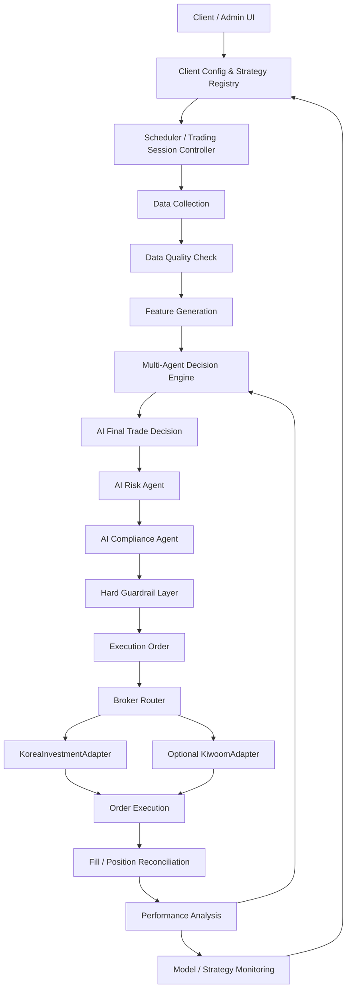
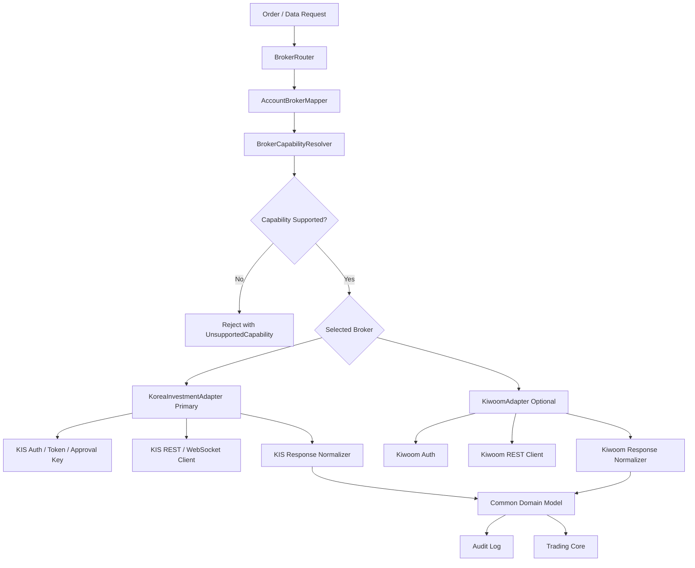
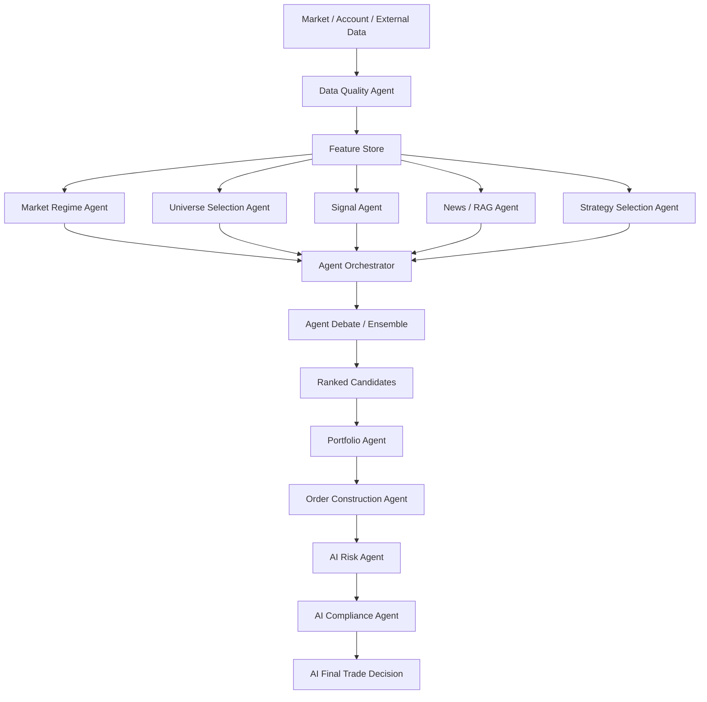
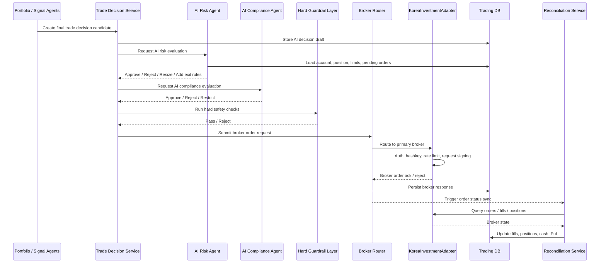
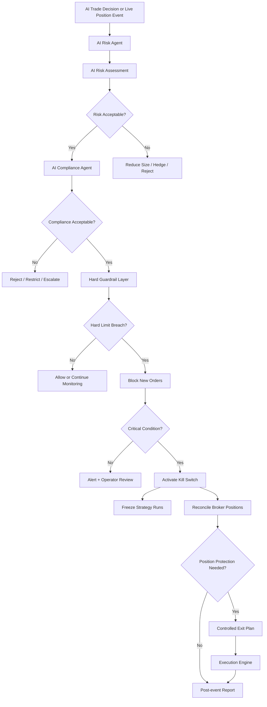
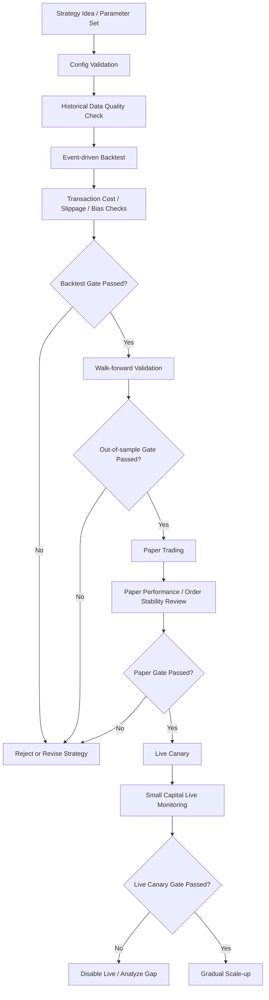
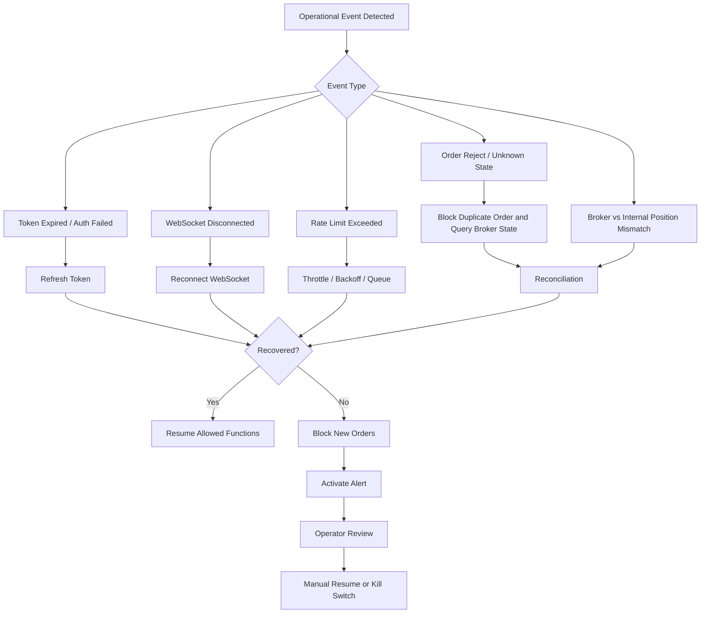

# 엔터프라이즈급 AI 멀티 에이전트 매매 시스템 설계 지시서

이 문서는 Cline의 설계 Agent가 실제 시스템 아키텍처를 설계하기 위한 기준 문서다.  
목표는 단순 알고리즘 매매가 아니라, AI 기반 멀티 에이전트 구조를 활용하여 데이터 수집, 시장 상황 판단, 종목 선정, 포트폴리오 구성, 주문 실행, 리스크 관리, 성과 분석을 종합적으로 수행하는 엔터프라이즈급 자동매매 시스템을 설계하는 것이다.

단, "최고 기대수익률"은 시스템의 설계 목표이지 보장 결과가 아니다. 설계 Agent는 수익 극대화와 동시에 실전 운용 안정성, 리스크 통제, 감사 가능성, 장애 대응성, 재현성을 반드시 함께 만족시키는 구조를 설계해야 한다.

---

## 1. 설계 목표

### 1.1 핵심 목표

- AI로 가능한 반드시 필요한 기능을 포함한 엔터프라이즈급 매매 시스템을 설계한다.
- 기대 수익률을 최대화하는 방향으로 설계하되, 실제 평가 기준은 위험조정수익률 중심으로 둔다.
- 한국투자증권 REST API를 기본 브로커 연동 대상으로 삼고, Broker Adapter 구조를 통해 키움증권 등 다른 브로커를 옵션으로 추가할 수 있게 설계한다.
- 멀티 에이전트 구조를 활용하여 매매 의사결정의 각 단계를 전문화한다.
- 클라이언트별 Input Parameter를 설정으로 주입할 수 있는 구조를 만든다.
- 실전투자와 모의투자를 명확히 분리한다.
- AI 멀티 에이전트가 전략 선택, 매수/매도, 가격, 수량, 리스크, 컴플라이언스 판단을 수행하고, 실행 엔진은 그 결정을 브로커에 안전하게 전달하도록 설계한다.
- AI 판단 계층 위에는 최소한의 `Hard Guardrail Layer`를 두어 계좌 보호, 브로커 제약, 중복 주문 방지, 치명적 손실 차단만 기계적으로 수행한다.
- 백테스트, 페이퍼트레이딩, 실전 주문, 성과 분석이 하나의 폐쇄 루프를 이루도록 설계한다.

### 1.2 핵심 성과 지표

설계 Agent는 단순 수익률이 아니라 다음 지표를 시스템의 공식 목표 지표로 설계해야 한다.

- 거래비용 반영 후 누적 수익률
- 연환산 수익률
- 샤프 비율
- 소르티노 비율
- 최대 낙폭, MDD
- Calmar ratio
- 승률
- 손익비
- 평균 보유 기간
- turnover
- 실현/미실현 손익
- 종목별/전략별/Agent별 성과 기여도
- 백테스트와 실전 성과 괴리
- 주문 실패율
- 체결 지연 시간
- API 오류율
- 리스크 제한 위반 시도 횟수

---

## 2. 한국투자증권 REST API 중심 및 멀티 브로커 반영 사항

설계 Agent는 한국투자증권 KIS Developers Open API를 기본 브로커 연동 대상으로 설계해야 한다. 동시에 처음부터 멀티 브로커 구조를 전제로 두어, 키움증권 REST API는 기본 경로가 아니라 선택적으로 붙일 수 있는 옵션 어댑터로 취급한다.

### 2.1 기본 브로커 우선순위

브로커 우선순위는 다음과 같다.

1. Primary broker: 한국투자증권 KIS Developers Open API
2. Optional broker: 키움증권 REST API
3. Future broker: NH투자증권, DB금융투자, 삼성증권 등 추가 가능성을 고려한 확장 구조

설계의 기본값은 항상 한국투자증권이어야 한다. 키움 전용 기능이 필요한 경우에도 시스템 코어가 키움에 종속되면 안 된다.

### 2.2 한국투자증권 KIS Developers 반영 사항

한국투자증권 KIS Developers 공식 포털 기준으로 다음 범위를 설계에 반영한다.

- REST 방식과 WebSocket 방식을 모두 고려한다.
- REST 방식은 계좌의 Appkey, App secret으로 토큰을 발급받고, 발급된 토큰으로 API를 호출하는 구조다.
- WebSocket 방식은 접속키를 발급받은 뒤 실시간 데이터를 수신하는 구조다.
- API 문서 범위에는 국내주식, 국내선물옵션, 해외주식, 해외선물옵션, 장내채권 등이 포함된다.
- 종목 정보 파일을 통해 매매 및 시세조회 가능한 전체 종목 리스트를 확보할 수 있다.
- 테스트 베드를 통해 API 호출 테스트가 가능하다.
- 공식 GitHub 샘플 코드와 REST/WebSocket 샘플을 참고할 수 있다.
- API 호출 유량 제한은 공지로 변경될 수 있으므로, 설계 Agent는 호출 제한값을 하드코딩하지 말고 broker capability/config로 관리해야 한다.

### 2.3 한국투자증권 인증 및 운영 제약

- Appkey와 App secret은 broker credential로 분리하여 관리한다.
- 접근 토큰은 자동 발급/갱신/폐기 흐름을 가져야 한다.
- WebSocket 접속키 또는 approval key가 필요한 경우 REST 토큰과 별도 생명주기로 관리한다.
- 실전투자와 모의투자는 base URL, credential, 계좌, 주문 정책을 분리한다.
- 국내주식, 해외주식, 선물옵션, 채권은 상품별 주문 규칙과 시간, 통화, 정산, 수수료, 세금이 다르므로 product capability로 분리한다.
- 한국투자증권 API의 TR ID, header, hashkey, rate limit 등 브로커 고유 요구사항은 공통 계층이 아니라 `KoreaInvestmentAdapter` 내부에서 처리한다.
- 토큰 갱신 실패, WebSocket 끊김, 호출 제한 초과, 주문 거부는 정상적으로 발생 가능한 운영 이벤트로 설계한다.
- 모든 API 요청/응답은 감사 로그로 저장한다.
- API 오류, rate limit, 네트워크 장애, 주문 실패에 대한 재시도 정책을 설계한다.
- 주문 API 실패 시 중복 주문을 방지하기 위한 idempotency key 또는 client order id 체계를 둔다.

### 2.4 Broker Adapter 구조 설계 원칙

- 시스템 코어는 특정 증권사 API 형식에 직접 의존하면 안 된다.
- 모든 브로커 연동은 `BrokerAdapter` interface 뒤에 숨긴다.
- `KoreaInvestmentAdapter`는 첫 번째이자 기본 구현체다.
- `KiwoomAdapter`는 옵션 구현체이며, 키움 전용 기능은 capability flag로 노출한다.
- 주문, 체결, 잔고, 포지션, 시세, 실시간 데이터, 인증, 오류 코드는 공통 domain model로 정규화한다.
- 브로커별 주문 가능 상품, 주문 타입, 실시간 지원 여부, 호출 제한, 모의투자 지원 여부는 `BrokerCapability`로 관리한다.
- 같은 전략이 브로커 교체만으로 최대한 동일하게 동작하도록 broker-independent strategy layer를 유지한다.
- 브로커별 차이 때문에 동일 동작이 불가능한 경우, adapter가 명시적인 unsupported capability error를 반환해야 한다.

### 2.5 키움증권 옵션 반영 사항

키움증권 REST API는 선택 브로커로만 설계한다. 키움 옵션 어댑터는 다음 기능을 제공할 수 있다.

- 차트 정보
- 투자자별 매매 정보
- 계좌 현황
- 조건 검색
- 시세 정보
- 주문
- 순위 정보

키움 관련 제약은 `KiwoomAdapter` 내부에만 존재해야 한다.

- 실전투자와 모의투자의 App Key 분리
- 허용 IP 기반 인증 제약
- OAuth 2.0 Client Credentials Grant 기반 접근 토큰
- 접근 토큰 만료 및 재발급
- 키움 조건검색 등 브로커 고유 기능

### 2.6 공식 참고 URL

- 한국투자증권 KIS Developers: https://apiportal.koreainvestment.com/
- 한국투자증권 KIS Developers 소개: https://apiportal.koreainvestment.com/intro
- 한국투자증권 공식 GitHub 샘플: https://github.com/koreainvestment/open-trading-api
- 키움 REST API 메인, 옵션 브로커 참고: https://openapi.kiwoom.com/

### 2.7 설계 Agent 확인 의무

브로커 API는 수시로 변경될 수 있다. 설계 Agent는 실제 endpoint, TR ID, header, rate limit, 상품별 주문 제한, 실전/모의 URL, WebSocket 접속 절차를 구현 전에 반드시 최신 공식 문서에서 재확인해야 한다.

---

## 3. 전체 시스템 아키텍처

### 3.1 최상위 흐름

```text
Client / Admin UI
  -> Strategy Config API
  -> Agent Orchestrator
  -> Data Pipeline
  -> Multi-Agent Decision Engine
  -> AI Risk & AI Compliance Layer
  -> Hard Guardrail Layer
  -> Portfolio / Order Manager
  -> Broker Router
  -> KoreaInvestment REST API Adapter
  -> Optional Broker Adapters, including Kiwoom
  -> Execution / Reconciliation
  -> Monitoring / Audit / Learning Loop
```

### 3.2 큰 구성 요소

```text
Control Plane
  - Client Config
  - Strategy Registry
  - Model Registry
  - Prompt Registry
  - Approval Workflow
  - RBAC / Audit

Trading Plane
  - Data Workers
  - Agent Runtime
  - Feature Pipeline
  - Signal Engine
  - AI Risk Engine
  - AI Compliance Engine
  - Hard Guardrail Engine
  - Portfolio Engine
  - Order Engine
  - Broker Adapter

Observability Plane
  - Real-time PnL
  - Order / Fill Status
  - Agent Decision Logs
  - API Error Rate
  - Latency
  - Drawdown
  - Strategy Performance
  - Alerting
```

### 3.3 핵심 설계 원칙

- AI는 판단 보조가 아니라 주문 판단 주체다.
- 전략 선택, 종목 선정, 진입/청산, 가격, 수량, 리스크 평가, 컴플라이언스 평가는 AI 멀티 에이전트가 담당한다.
- 시스템의 규칙 기반 계층은 판단자가 아니라 최소한의 하드 안전장치 역할만 수행한다.
- 모든 의사결정은 재현 가능해야 한다.
- 모든 주문은 추적 가능해야 한다.
- 모든 모델, 프롬프트, 설정, 데이터 버전은 기록되어야 한다.
- 실전 주문 전에는 항상 백테스트와 페이퍼트레이딩 검증 경로가 있어야 한다.
- Agent 간 의견 충돌을 조정하는 orchestrator가 필요하다.
- 장애 발생 시 신규 주문보다 포지션 보호와 상태 동기화가 우선이다.

---

## 4. 큰 업무 단위별 End-to-End Workflow

이 섹션은 Cline 설계 Agent가 전체 업무 흐름을 먼저 이해한 뒤 세부 컴포넌트를 설계하도록 돕기 위한 기준 흐름도다. 설계 Agent는 아래 흐름도를 기준으로 실제 컴포넌트 다이어그램, 시퀀스 다이어그램, 데이터 흐름도, 장애 대응 흐름도를 상세화해야 한다.

### 4.1 전체 운영 흐름도



### 4.2 브로커 연동 흐름도



### 4.3 매매 의사결정 흐름도



### 4.4 주문 실행 흐름도



### 4.5 리스크 및 Kill Switch 흐름도



### 4.6 백테스트, 페이퍼트레이딩, 실전 전환 흐름도



### 4.7 장애 대응 흐름도



### 4.8 주요 업무 단위별 책임 요약

| 업무 단위 | 입력 | 주요 처리 | 출력 |
|---|---|---|---|
| Client Config | 클라이언트 설정, 계좌, 전략, 리스크 | validation, versioning, approval | active config version |
| Data Pipeline | KIS REST/WebSocket, 외부 데이터 | 수집, 정합성 검증, feature 생성 | feature set, data quality report |
| Agent Decision | feature, 뉴스, 시장 국면 | 전략 선택, agent 판단, ensemble, 가격/수량 결정 | AI final trade decision |
| AI Risk / Compliance | AI trade decision, 계좌, 포지션, 한도 | AI 리스크 평가, AI 컴플라이언스 평가 | approved/restricted/rejected decision |
| Hard Guardrail | AI-approved decision, 절대 한도, 브로커 제약 | 계좌 보호, 중복 주문 방지, kill switch check | executable order or blocked order |
| Broker Execution | executable order | broker routing, 주문, 응답 저장 | broker order ack, order status |
| Reconciliation | 주문, 체결, 잔고, 포지션 | broker/internal state 비교 | positions, cash, PnL snapshot |
| Monitoring | 로그, metric, event | alert, dashboard, 성과 분석 | operator action, strategy feedback |

---

## 5. Client Input Parameter 구조

시스템은 클라이언트별로 전략, 계좌, 리스크, 종목군, AI 사용 범위, 주문 정책을 설정으로 주입할 수 있어야 한다.

### 5.1 예시 설정

```yaml
client_id: "client-a"
mode: "paper" # paper | live
broker: "korea_investment"
account_group: "domestic_equity_main"

broker_routing:
  primary: "korea_investment"
  fallback: []
  optional_adapters: ["kiwoom"]
  require_capabilities: ["domestic_equity_order", "domestic_equity_quote", "paper_trading"]

universe:
  market: ["KOSPI", "KOSDAQ"]
  include_sources: ["kis_domestic_stock_master", "거래대금상위", "외부스크리너"]
  exclude_symbols: ["관리종목", "거래정지", "ETF"]

strategy:
  objective: "risk_adjusted_return"
  rebalance_interval: "intraday"
  max_positions: 12
  holding_period: "1d-10d"
  signal_weights:
    technical: 0.25
    orderflow: 0.25
    news_sentiment: 0.15
    regime: 0.20
    risk_penalty: 0.15

ai_decision:
  strategy_selection_enabled: true
  order_construction_enabled: true
  ai_risk_enabled: true
  ai_compliance_enabled: true
  decision_model: "trade-decision-model-v3"
  risk_model: "risk-manager-model-v2"
  compliance_model: "compliance-model-v2"

risk:
  max_position_pct: 0.08
  max_daily_loss_pct: 0.02
  max_drawdown_pct: 0.08
  max_order_value_krw: 3000000
  stop_loss_pct: 0.035
  kill_switch_enabled: true
```

### 5.2 필수 설정 카테고리

설계 Agent는 다음 설정 카테고리를 포함해야 한다.

- Client identity
- Trading mode: backtest, paper, live
- Broker profile
- Broker routing policy
- Broker capability requirement
- Account mapping
- Market universe
- Exclusion rules
- Strategy profile
- AI decision policy
- Signal weight
- Risk limit
- Order execution policy
- AI model and prompt policy
- Data source policy
- Approval policy
- Notification policy

### 5.3 설정 관리 원칙

- 설정은 DB에 저장하고 변경 이력을 남긴다.
- 운영 중 설정 변경은 즉시 적용이 아니라 versioned rollout 방식으로 처리한다.
- live mode 설정 변경은 승인 워크플로우를 거쳐야 한다.
- 모든 주문과 의사결정 로그에는 당시 사용된 설정 버전이 포함되어야 한다.
- 잘못된 설정을 막기 위해 JSON Schema 또는 Pydantic 기반 validation을 둔다.

---

## 6. Multi-Agent 구조

### 6.1 필수 Agent 목록

| Agent | 역할 |
|---|---|
| Data Collector Agent | 한국투자증권 시세, 실시간 WebSocket, 계좌, 주문, 종목정보파일 및 외부 데이터 수집 |
| Data Quality Agent | 결측, 이상치, 지연 데이터, API 오류 탐지 |
| Market Regime Agent | 상승장, 하락장, 횡보장, 고변동성/저변동성 국면 판단 |
| Universe Selection Agent | 오늘 거래 가능한 후보 종목군 생성 |
| Strategy Selection Agent | 현재 시장 국면에서 사용할 전략, 알고리즘, 실행 스타일 선택 |
| Signal Agent | 기술적 지표, 수급, 모멘텀, 변동성, 뉴스 기반 점수화 |
| News/RAG Agent | 공시, 뉴스, 리포트, 이벤트를 요약하고 리스크 태깅 |
| Portfolio Agent | 종목별 목표 비중, 진입/청산 후보 계산 |
| Order Construction Agent | 매수/매도, 가격, 수량, 주문 타입, 시간조건, 청산 규칙 결정 |
| AI Risk Manager Agent | 한도, 손실, 변동성, 유동성, 집중도, 헤지, 사이징 조정 판단 |
| AI Compliance Agent | 금지 조건, 브로커 제약, 종목 규칙, 정책 위반 가능성 판단 |
| Execution Agent | AI 최종 결정 실행, 주문 분할, 체결 추적 |
| Performance Agent | 성과 분석, 원인 분석, 전략별 기여도 계산 |
| Model Monitor Agent | 모델 drift, 과최적화, 실전/백테스트 괴리 감시 |

### 6.2 Agent 의사결정 원칙

- 각 Agent는 독립된 입력과 출력을 가져야 한다.
- Agent 출력은 구조화된 JSON 형태여야 한다.
- Agent의 판단 근거를 로그로 남겨야 한다.
- Agent의 결과는 ensemble, debate, voting, confidence weighting 방식으로 통합할 수 있다.
- AI Agent 집합은 최종적으로 `AI Final Trade Decision`을 생성해야 한다.
- `AI Final Trade Decision`에는 전략 선택, 매수/매도, 가격, 수량, 주문 타입, 청산 규칙, 리스크 의견, 컴플라이언스 의견이 포함되어야 한다.
- `AI Risk Manager Agent`와 `AI Compliance Agent`도 판단 주체이며, 단순 yes/no 규칙 엔진이 아니다.
- 시스템의 규칙 기반 계층은 AI 결정을 대체하지 않고, 절대 금지 조건과 계좌 보호 조건만 기계적으로 차단한다.

### 6.3 Agent 출력 예시

```json
{
  "agent_name": "OrderConstructionAgent",
  "run_id": "2026-04-25T09:01:00+09:00",
  "client_id": "client-a",
  "symbol": "005930",
  "strategy_id": "intraday-momentum-v2",
  "side": "buy",
  "order_type": "limit",
  "price": 81200,
  "quantity": 37,
  "confidence": 0.64,
  "expected_holding_period": "1d-3d",
  "exit_rules": {
    "stop_loss_pct": 0.028,
    "take_profit_pct": 0.061,
    "time_stop": "3d"
  },
  "reasons": [
    "거래대금 증가",
    "단기 모멘텀 개선",
    "시장 국면 위험 보통"
  ],
  "risk_opinion": "position size reduced due to intraday volatility",
  "compliance_opinion": "allowed for domestic equity day order",
  "data_version": "marketdata-20260425-090100",
  "model_version": "trade-decision-model-v3"
}
```

---

## 7. 의사결정 및 주문 흐름

### 7.1 전체 흐름

```text
1. 한국투자증권 KIS / 외부 데이터 수집
2. 데이터 정합성 검증
3. Feature 생성
4. 종목 후보군 생성
5. Strategy Selection Agent가 현재 사용할 전략/알고리즘 결정
6. 여러 Agent가 독립적으로 점수, 진입 근거, 청산 근거 산출
7. Agent Debate / Ensemble로 최종 후보와 실행 방향 생성
8. Order Construction Agent가 매수/매도, 가격, 수량, 주문 타입 결정
9. AI Risk Manager Agent가 사이징, 헤지, 제한, 거절 여부 판단
10. AI Compliance Agent가 정책, 상품 규칙, 브로커 제약 적합성 판단
11. Hard Guardrail Layer가 절대 제한만 검증
12. Execution Agent가 Broker Router를 통해 한국투자증권 REST API로 주문
13. 체결/잔고/손익 동기화
14. 성과 분석 및 다음 의사결정에 반영
```

### 7.2 AI Final Trade Decision과 실제 주문 분리

```text
Agent Recommendation
  -> AI Final Trade Decision
  -> AI Risk Evaluation
  -> AI Compliance Evaluation
  -> Hard Guardrail Check
  -> Executable Order Plan
  -> Broker Order Request
  -> Broker Order Response
  -> Fill / Partial Fill / Reject
  -> Reconciliation
```

### 7.3 AI Final Trade Decision 예시

```json
{
  "client_id": "client-a",
  "account_id": "account-main",
  "strategy_id": "intraday-momentum-v2",
  "symbol": "005930",
  "side": "buy",
  "price": 81200,
  "quantity": 37,
  "target_weight": 0.05,
  "order_type": "limit",
  "time_in_force": "day",
  "entry_reason_code": "ensemble_rank_top",
  "source_agents": [
    "StrategySelectionAgent",
    "SignalAgent",
    "PortfolioAgent",
    "AIRiskManagerAgent",
    "AIComplianceAgent"
  ],
  "risk_decision": {
    "status": "approved_with_resize",
    "max_loss_krw": 92300,
    "stop_loss_pct": 0.028,
    "take_profit_pct": 0.061
  },
  "compliance_decision": {
    "status": "approved",
    "market_rule_profile": "krx_domestic_equity"
  },
  "created_at": "2026-04-25T09:10:00+09:00",
  "confidence": 0.67
}
```

---

## 8. Broker Adapter 상세 설계

### 8.1 공통 Broker Adapter 구조

```text
BrokerRouter
  - BrokerRegistry
  - BrokerCapabilityResolver
  - AccountBrokerMapper
  - OrderRoutingPolicy
  - FailoverPolicy
  - BrokerHealthMonitor

BrokerAdapter Interface
  - AuthService
  - CapabilityService
  - MarketDataClient
  - RealtimeDataClient
  - InstrumentClient
  - AccountClient
  - OrderClient
  - ReconcileService
  - RateLimitGuard
  - RetryPolicy
  - AuditLogger

KoreaInvestmentAdapter, primary
  - KisAuthService
  - KisApprovalKeyService
  - KisHashKeyService
  - KisDomesticStockClient
  - KisOverseasStockClient
  - KisDerivativesClient
  - KisBondClient
  - KisRealtimeClient
  - KisAccountClient
  - KisOrderClient
  - KisReconcileService

KiwoomAdapter, optional
  - KiwoomAuthService
  - KiwoomMarketDataClient
  - KiwoomConditionSearchClient
  - KiwoomAccountClient
  - KiwoomOrderClient
```

### 8.2 공통 모듈 책임

| 모듈 | 책임 |
|---|---|
| BrokerRouter | 계좌, 상품, 전략, capability에 따라 사용할 브로커 어댑터 선택 |
| BrokerRegistry | 사용 가능한 브로커 어댑터 등록 및 상태 관리 |
| BrokerCapabilityResolver | 브로커별 지원 상품, 주문 타입, rate limit, 실시간 지원 여부 조회 |
| AccountBrokerMapper | client/account와 broker credential 매핑 |
| AuthService | Appkey, App secret, OAuth token, approval key 등 인증 정보 발급/갱신/만료 관리 |
| MarketDataClient | 현재가, 시세, 호가, 일봉, 분봉 등 시장 데이터 조회 |
| RealtimeDataClient | WebSocket 기반 실시간 체결, 호가, 주문 이벤트 수신 |
| InstrumentClient | 종목 마스터, 거래 가능 상품, 거래 정지/관리종목 등 종목 정보 조회 |
| AccountClient | 계좌평가, 잔고, 주문가능금액 조회 |
| OrderClient | 매수, 매도, 정정, 취소 주문 |
| ReconcileService | 주문, 체결, 미체결, 잔고, 포지션 동기화 |
| RateLimitGuard | API 호출 제한, throttle, backoff 관리 |
| RetryPolicy | 네트워크 오류, 일시 오류 재시도 |
| AuditLogger | 요청/응답, 에러, latency, correlation id 저장 |

### 8.3 한국투자증권 Adapter 책임

`KoreaInvestmentAdapter`는 기본 구현체이며 다음 책임을 가진다.

- 한국투자증권 REST API 인증 토큰 발급/갱신/폐기
- WebSocket 접속키 또는 approval key 발급/갱신
- hashkey 등 한국투자증권 고유 요청 서명 또는 검증 절차 처리
- 국내주식 시세/주문/잔고/체결 조회
- 해외주식 시세/주문/잔고/체결 조회
- 국내선물옵션/해외선물옵션/장내채권 확장 가능 구조
- 종목 정보 파일 ingestion 및 instrument master 갱신
- REST 호출 유량 제한 및 WebSocket 연결 제한 관리
- 한국투자증권 고유 오류 코드를 공통 오류 코드로 변환
- 한국투자증권 주문 응답, 체결 응답, 잔고 응답을 공통 domain model로 변환

### 8.4 키움 Adapter 옵션 책임

`KiwoomAdapter`는 기본 구현체가 아니라 옵션 구현체다. 다음 조건을 만족해야 한다.

- 키움 관련 코드는 `packages/broker/kiwoom` 또는 동등한 adapter 영역 밖으로 새면 안 된다.
- 키움 조건검색, 순위정보 등 고유 기능은 optional capability로만 노출한다.
- 키움 전용 field를 공통 domain model에 직접 추가하지 않는다.
- 공통 모델로 표현 불가능한 값은 `broker_raw_payload` 또는 adapter-specific extension에 저장한다.
- 한국투자증권과 동일한 전략이 키움에서도 실행될 수 있는지 capability check를 먼저 수행한다.

### 8.5 인증 설계 요구사항

- Secret은 환경변수 평문 저장이 아니라 secret manager에 저장한다.
- token cache를 두되 만료 전 갱신한다.
- 갱신 실패 시 신규 주문은 차단하고 조회 기능만 제한적으로 허용한다.
- 실전 credential과 모의 credential을 절대 혼용하지 않는다.
- 브로커별 base URL, product scope, account scope를 credential profile에 포함한다.
- API 요청에는 correlation id를 부여한다.

### 8.6 주문 안정성 요구사항

- 동일 전략/동일 종목/동일 방향 중복 주문 방지
- 미체결 주문 조회 후 신규 주문 판단
- 부분 체결 처리
- 주문 거부 처리
- 정정/취소 상태 추적
- 장 종료 전 미체결 자동 처리 정책
- 주문 후 잔고/체결 재동기화
- broker state와 internal state의 불일치 감지
- 브로커별 주문 번호와 내부 client order id 매핑
- 브로커별 주문 가능 시간, 호가 단위, 주문 타입 차이 반영
- 국내/해외 상품의 통화, 결제일, 세금, 수수료 차이 반영

### 8.7 공통 BrokerAdapter interface 초안

설계 Agent는 실제 언어와 프레임워크에 맞게 interface를 구체화하되, 최소한 다음 메서드 범위를 포함해야 한다.

```text
BrokerAdapter
  - broker_id() -> BrokerId
  - get_capabilities() -> BrokerCapability
  - authenticate(profile) -> AuthSession
  - refresh_auth(session) -> AuthSession
  - get_instruments(market, product_type) -> list[Instrument]
  - get_quote(symbol, market) -> Quote
  - get_bars(symbol, timeframe, range) -> list[Bar]
  - subscribe_realtime(symbols, channels) -> RealtimeSubscription
  - get_account(account_id) -> AccountSnapshot
  - get_positions(account_id) -> list[Position]
  - get_cash(account_id) -> CashBalance
  - place_order(order_request) -> BrokerOrderAck
  - cancel_order(order_id) -> BrokerOrderAck
  - replace_order(order_id, replace_request) -> BrokerOrderAck
  - get_order(order_id) -> OrderStatus
  - get_fills(account_id, range) -> list[Fill]
  - reconcile(account_id) -> ReconciliationReport
```

### 8.8 BrokerCapability 모델

```yaml
broker_id: "korea_investment"
display_name: "한국투자증권"
is_primary: true
supports:
  paper_trading: true
  live_trading: true
  rest_market_data: true
  websocket_market_data: true
  domestic_equity: true
  overseas_equity: true
  domestic_derivatives: true
  overseas_derivatives: true
  listed_bond: true
  condition_search: false
limits:
  rest_rate_limit_profile: "kis_notice_managed"
  websocket_limit_profile: "kis_notice_managed"
order_types:
  - market
  - limit
adapter_specific:
  requires_hashkey: true
  requires_approval_key_for_websocket: true
```

키움 옵션 어댑터는 `broker_id: "kiwoom"`, `is_primary: false`로 정의하고, 키움 조건검색 지원 여부는 `condition_search: true` 같은 capability로만 표현한다.

---

## 9. 데이터 아키텍처

### 9.1 저장소 구성

| 저장소 | 용도 |
|---|---|
| PostgreSQL | 계좌, 주문, 체결, 설정, 감사 로그, 전략 메타데이터 |
| TimescaleDB 또는 ClickHouse | 분봉, 일봉, 호가, feature 등 시계열 데이터 |
| Redis | 실시간 상태, lock, rate limit, 최근 시세 cache |
| S3/MinIO | 원천 데이터, 백테스트 결과, 모델 artifact |
| Vector DB | 뉴스, 공시, 리포트 RAG 검색 |
| Kafka/Redpanda | 시세, 주문, Agent 이벤트 스트림 |

### 9.2 주요 데이터 도메인

- Clients
- Accounts
- Broker credentials
- Instruments
- Market data
- Chart data
- Condition search results
- Investor trading data
- Ranking data
- Features
- Signals
- Agent decisions
- Portfolio targets
- AI risk decisions
- AI compliance decisions
- Hard guardrail checks
- AI final trade decisions
- Orders
- Executions/fills
- Positions
- Cash balances
- PnL snapshots
- Backtest runs
- Paper trading runs
- Model registry
- Prompt registry
- Audit logs

### 9.3 데이터 품질 검사

- 결측 데이터
- 중복 데이터
- 장중 데이터 지연
- 가격 급변 이상치
- 거래정지/관리종목 필터
- 시간대 불일치
- split, dividend, corporate action 반영 여부
- broker 응답과 내부 DB 불일치

---

## 10. Feature 및 Signal 설계

### 10.1 Feature 범주

- 가격 모멘텀
- 거래량 모멘텀
- 변동성
- 추세 지표
- mean reversion 지표
- liquidity 지표
- gap 지표
- intraday strength
- investor flow
- ranking 변화
- 브로커/외부 스크리너 편입/이탈
- 뉴스 sentiment
- 공시 이벤트
- 시장 regime
- 종목별 risk penalty

### 10.2 Signal 통합 방식

설계 Agent는 다음 중 하나 이상을 설계에 포함할 수 있다.

- weighted score
- rank aggregation
- model ensemble
- Agent voting
- confidence weighted decision
- regime-dependent weight switching
- risk-adjusted expected return scoring

### 10.3 Signal Weight 예시

```yaml
signal_weights:
  technical: 0.25
  orderflow: 0.25
  news_sentiment: 0.15
  regime: 0.20
  risk_penalty: 0.15
```

---

## 11. Risk Management 필수 기능

리스크 관리는 수익률보다 우선순위가 높다. 이 시스템에서 리스크 관리는 기본적으로 `AI Risk Manager Agent`가 판단 주체가 되며, 시스템은 그 위에 최소한의 `Hard Guardrail Layer`를 둔다. 설계 Agent는 다음 이중 구조를 반드시 포함해야 한다.

### 11.0 구조 원칙

- `AI Risk Manager Agent`는 포지션 사이징, 손실 허용치, 집중도, 헤지, 청산 전략, 주문 축소 여부를 판단한다.
- `Hard Guardrail Layer`는 AI 판단을 대체하지 않고, 절대 한도 초과, 중복 주문, 브로커 거부 조건, 계좌 보호, kill switch 조건만 기계적으로 차단한다.
- 따라서 리스크 계층은 `AI risk decision`과 `hard safety enforcement`로 분리되어야 한다.
- Risk 관련 모든 판단에는 입력 데이터 버전, 모델 버전, 사용한 계좌 상태, 최종 수정 내역을 남겨야 한다.

### 11.1 Pre-trade Risk

- 계좌별 최대 주문 금액에 대한 AI 판단과 hard cap
- 종목별 최대 비중에 대한 AI 판단과 hard cap
- 전략별 최대 노출 판단
- 섹터별 최대 노출 판단
- 일간 총 주문 금액 제한
- 일간 최대 손실 제한
- 최대 낙폭 제한
- 유동성 부족 종목 회피 또는 사이징 축소
- 가격 괴리율 판단
- 호가/시세 지연 감지
- 거래정지/관리종목 차단
- 미체결 주문 중복 체크
- 주문 가능 금액 체크

### 11.2 In-trade Risk

- stop loss
- trailing stop
- take profit
- time stop
- volatility stop
- partial exit
- position scaling
- 장중 급락 감지
- 연속 손실 시 position size 축소
- AI 기반 동적 청산 규칙 조정
- hedge or de-risk decision

### 11.3 Portfolio Risk

- concentration limit
- correlation risk
- beta exposure
- market regime exposure
- liquidity-adjusted exposure
- overnight risk
- leverage 금지 또는 제한
- 전략 간 충돌 시 capital allocation rebalance
- 계좌 간 노출 조정

### 11.4 Kill Switch

다음 조건에서는 `Hard Guardrail Layer`가 신규 주문을 즉시 중단해야 한다.

- 일간 손실 한도 초과
- 최대 낙폭 한도 초과
- API 인증 실패
- 주문 응답 불일치
- broker position과 internal position 불일치
- 실시간 데이터 지연
- 주문 실패율 급증
- 비정상적인 주문 반복
- 운영자가 수동 중지

---

## 12. Compliance 및 감사

이 시스템에서 컴플라이언스 판단은 기본적으로 `AI Compliance Agent`가 수행한다. 다만 브로커가 명시적으로 거부하는 주문 조건, 금지 종목, 계좌 권한 불일치, 필수 필드 누락, 시장 상태상 주문 불가와 같은 절대 조건은 `Hard Rule Validator`가 기계적으로 차단해야 한다.

### 12.0 구조 원칙

- `AI Compliance Agent`는 정책 위반 가능성, 시장 규칙 적합성, 전략 충돌, 특수 이벤트 리스크를 해석한다.
- `Hard Rule Validator`는 브로커 및 계좌 기준에서 절대 금지인 조건만 차단한다.
- 컴플라이언스 계층은 규칙 승인 엔진이 아니라 AI 판단 계층이며, rule validator는 최소한의 실행 차단기다.
- AI 컴플라이언스 판단 결과와 하드 규칙 차단 결과를 분리 저장해야 한다.

### 12.1 감사 로그 필수 항목

- 사용자/클라이언트 ID
- 설정 버전
- 전략 버전
- Agent run id
- 모델 버전
- 프롬프트 버전
- 입력 데이터 버전
- Agent 출력
- AI risk decision 결과
- AI compliance decision 결과
- hard guardrail check 결과
- AI final trade decision
- 실제 주문 요청
- broker 응답
- 체결 결과
- 운영자 승인/거부 기록
- 예외 및 장애 로그

### 12.2 권한 관리

- RBAC 기반 권한 설계
- live 주문 활성화 권한 분리
- 설정 변경 권한 분리
- secret 조회 불가 원칙
- 운영자 수동 kill switch 권한
- 감사 로그 삭제 금지

### 12.3 AI Compliance 판단 범위 예시

- 종목 거래 가능 여부
- 시장별 주문 가능 시간 적합성
- 브로커별 주문 타입 허용 여부
- 전략별 허용 자산군 적합성
- 이벤트 드리븐 리스크가 큰 종목의 거래 제한 여부
- 내부 정책상 금지된 전략 조합 여부
- 계좌별 승인된 운용 범위 적합성

---

## 13. 백테스트, 페이퍼트레이딩, 실전 전환

### 13.1 백테스트 엔진

백테스트는 event-driven 방식으로 설계한다.

필수 반영 요소:

- 거래비용
- 세금
- 슬리피지
- 체결 가능성
- 유동성 제약
- 호가 단위
- 종목 편입/상장폐지 survivorship bias
- look-ahead bias 방지
- 데이터 지연 조건
- 전략 설정 버전
- 모델 버전

### 13.2 페이퍼트레이딩

- 한국투자증권 모의투자 또는 내부 paper engine을 기본 지원한다.
- 키움 모의투자는 `KiwoomAdapter`가 활성화된 경우에만 옵션으로 지원한다.
- 실전과 동일한 decision pipeline을 사용한다.
- 실제 주문 대신 simulated order를 생성한다.
- 실전 전환 전 최소 검증 기간을 둘 수 있게 한다.

### 13.3 실전 전환 Gate

live mode 전환 전 다음 조건을 검증한다.

- 백테스트 성과 기준 통과
- 페이퍼트레이딩 성과 기준 통과
- 최대 낙폭 기준 통과
- 주문 실패율 기준 통과
- 설정 승인 완료
- 계좌 및 API 인증 정상
- kill switch 정상 동작 확인
- 소액 canary 운용 계획 승인

---

## 14. 운영 및 관측성

### 14.1 실시간 모니터링

- 실시간 PnL
- 계좌별 현금/평가금
- 포지션 현황
- 주문 현황
- 미체결 주문
- Agent 판단 상태
- Risk check 실패 현황
- API 호출 성공/실패율
- latency
- 데이터 수집 지연
- drawdown
- 전략별 성과

### 14.2 Alert

- kill switch 발동
- 토큰 갱신 실패
- 주문 실패
- 체결 불일치
- 포지션 불일치
- 손실 한도 근접
- 데이터 지연
- Agent 오류
- API 오류율 급증
- DB 장애

### 14.3 추천 도구

- OpenTelemetry
- Prometheus
- Grafana
- Loki 또는 ELK
- Sentry
- PagerDuty 또는 Slack webhook

---

## 15. 기술 스택 권장안

### 15.1 Backend

- Python
- FastAPI
- Pydantic
- SQLAlchemy
- Alembic

### 15.2 Agent Runtime

- LangGraph 또는 자체 orchestrator
- structured output validation
- prompt registry
- model registry

### 15.3 Data / ML

- pandas
- polars
- scikit-learn
- LightGBM
- XGBoost
- PyTorch
- MLflow 또는 자체 model registry

### 15.4 Infra

- Docker
- Kubernetes
- Terraform
- PostgreSQL
- TimescaleDB 또는 ClickHouse
- Redis
- Kafka 또는 Redpanda
- S3 또는 MinIO
- Vector DB

### 15.5 Frontend

- React
- Next.js
- TradingView Charting Library 또는 대체 차트 라이브러리
- 실시간 dashboard
- 전략 설정 UI
- 주문/체결/리스크 모니터링 UI

---

## 16. 권장 Repository 구조

```text
agent_trading/
  apps/
    api/
    worker/
    scheduler/
    dashboard/
  packages/
    broker/
      common/
      korea_investment/
      kiwoom/
    agents/
    risk/
    portfolio/
    execution/
    backtest/
    data_pipeline/
    feature_store/
    common/
  configs/
    clients/
    strategies/
    risk_profiles/
  migrations/
  docs/
    architecture/
    api/
    operations/
  tests/
    unit/
    integration/
    backtest/
    paper/
  infra/
    docker/
    k8s/
    terraform/
```

---

## 17. API 설계 범위

설계 Agent는 최소한 다음 API를 설계해야 한다.

### 17.1 Client / Config API

- client 생성/조회/수정
- account mapping
- strategy config 등록
- risk profile 등록
- config version 관리
- live 적용 승인

### 17.2 Trading API

- strategy run 시작/중지
- paper trading 시작/중지
- live trading enable/disable
- kill switch activate/deactivate
- AI final trade decision 조회
- orders 조회
- positions 조회
- PnL 조회

### 17.3 Agent API

- Agent run 조회
- Agent decision 조회
- Agent별 score 조회
- AI risk decision 조회
- AI compliance decision 조회
- prompt version 조회
- model version 조회

### 17.4 Backtest API

- backtest 실행
- backtest 결과 조회
- parameter sweep
- walk-forward validation
- strategy comparison

### 17.5 Broker API

- broker profile 조회
- broker capability 조회
- broker health 조회
- broker credential 등록/회전 요청
- account-broker mapping 조회
- 한국투자증권 adapter 상태 조회
- optional Kiwoom adapter 활성화 여부 조회

---

## 18. 보안 설계

### 18.1 Secret 관리

- Appkey, App secret, OAuth token, WebSocket approval key 등 broker secret은 secret manager에 저장한다.
- DB에 평문 저장 금지
- 로그에 secret 출력 금지
- secret rotate 절차 설계
- 접근 권한 최소화

### 18.2 네트워크 보안

- 한국투자증권 API 호출 서버는 운영 환경에서 고정 egress IP 사용을 권장한다.
- 키움 옵션 어댑터를 사용할 경우 허용 IP 관리 절차를 별도 문서화한다.
- outbound access 제한
- dashboard는 인증 필수
- 관리자 API는 MFA 또는 강한 인증 적용

### 18.3 데이터 보안

- 계좌번호 masking
- 개인정보 암호화
- audit log immutable storage 고려
- 백업 암호화
- 운영/개발/테스트 환경 분리

---

## 19. 개발 단계

설계 Agent는 다음 순서로 단계별 구현 계획을 제시해야 한다.

### Phase 1. Foundation

- Repository 구조
- config schema
- DB schema
- 공통 logging
- audit log
- basic scheduler

### Phase 2. KoreaInvestment Adapter

- 한국투자증권 Appkey/App secret 기반 토큰 발급/갱신
- 한국투자증권 모의투자 credential 연동
- WebSocket approval key 또는 접속키 발급
- hashkey 등 한국투자증권 고유 요청 처리
- 시세 조회
- 실시간 WebSocket 수신
- 계좌 조회
- 주문 가능 금액 조회
- 모의 주문
- 체결/잔고 동기화
- 공통 BrokerAdapter interface와 KoreaInvestmentAdapter 분리
- KiwoomAdapter는 이 단계의 필수 구현 범위가 아니라 optional stub만 둔다.

### Phase 3. Data Pipeline

- 차트 데이터 수집
- 한국투자증권 종목 정보 파일 수집
- 한국투자증권 국내주식/해외주식 시세 수집
- 브로커별 ranking, screener, condition search는 optional source로 수집
- 투자자별 매매 수집
- feature 생성
- data quality check

### Phase 4. Backtest / Paper Trading

- event-driven backtest engine
- 비용/슬리피지 반영
- paper execution engine
- AI strategy selection and AI trade decision replay
- AI risk/compliance decision replay
- 전략 성과 리포트

### Phase 5. AI Risk / AI Compliance / Guardrail

- AI Risk Manager Agent
- AI Compliance Agent
- hard guardrail layer
- stop policy
- kill switch
- order duplication guard

### Phase 6. Multi-Agent Decision Engine

- Data Collector Agent
- Data Quality Agent
- Market Regime Agent
- Universe Selection Agent
- Strategy Selection Agent
- Signal Agent
- News/RAG Agent
- Portfolio Agent
- Order Construction Agent
- AI Risk Manager Agent
- AI Compliance Agent
- Performance Agent
- Model Monitor Agent

### Phase 7. Execution Engine

- AI final trade decision
- order plan
- broker order
- partial fill handling
- cancel/replace
- reconciliation

### Phase 8. Dashboard / Operations

- 실시간 계좌/PnL
- 주문/체결 현황
- Agent 판단 로그
- risk dashboard
- config approval UI
- kill switch UI

### Phase 9. Live Canary

- 소액 실전 운용
- 실전/모의 괴리 분석
- 장애 대응 훈련
- 성과/리스크 기준 통과 후 확대

---

## 20. 테스트 전략

### 20.1 Unit Test

- config validation
- AI risk decision schema validation
- AI compliance decision schema validation
- signal scoring
- AI final trade decision generation
- token refresh logic
- broker response parsing

### 20.2 Integration Test

- KoreaInvestment mock server
- optional Kiwoom mock server
- DB persistence
- Redis lock
- order lifecycle
- reconciliation
- Agent orchestration
- hard guardrail rejection flow

### 20.3 Backtest Validation

- look-ahead bias test
- survivorship bias test
- transaction cost test
- slippage test
- walk-forward validation
- out-of-sample validation

### 20.4 Operational Test

- token expiry simulation
- API failure simulation
- partial fill simulation
- order rejection simulation
- kill switch simulation
- data delay simulation
- broker/internal position mismatch simulation
- AI risk false positive / false negative simulation
- AI compliance false positive / false negative simulation

---

## 21. Cline 설계 Agent에게 요구하는 산출물

Cline 설계 Agent는 이 문서를 기준으로 다음 산출물을 작성해야 한다.

### 21.1 필수 산출물

- 상세 시스템 아키텍처 문서
- 컴포넌트 다이어그램
- 데이터 흐름 다이어그램
- 주문 흐름 시퀀스 다이어그램
- Agent orchestration 설계
- DB ERD 초안
- API endpoint 설계
- 공통 BrokerAdapter interface 설계
- KoreaInvestmentAdapter 상세 설계
- optional KiwoomAdapter 확장 설계
- AI Risk Manager Agent decision spec
- AI Compliance Agent decision spec
- Hard Guardrail rule spec
- Config schema
- 배포 아키텍처
- 보안 설계
- 테스트 전략
- 단계별 구현 로드맵

### 21.2 설계 시 반드시 지킬 것

- AI Agent가 주문 판단 주체가 되게 설계한다.
- AI Risk Manager Agent와 AI Compliance Agent를 판단 주체로 설계한다.
- deterministic rule 계층은 최소한의 hard guardrail로만 제한한다.
- 실전/모의 환경을 분리한다.
- 한국투자증권 REST API를 기본 구현체로 설계하되, 의존성은 `KoreaInvestmentAdapter`에 격리한다.
- 키움 REST API는 optional adapter로만 설계한다.
- 모든 주문과 판단은 감사 가능하게 기록한다.
- 설정은 클라이언트별로 분리하고 버전 관리한다.
- 토큰 만료, WebSocket 접속키, 호출 유량 제한, 브로커별 인증 제약을 설계에 반영한다.
- 장애 발생 시 신규 주문을 보수적으로 중단한다.
- 백테스트, 페이퍼트레이딩, 실전 전환 gate를 명확히 둔다.

---

## 22. 비기능 요구사항

### 22.1 안정성

- 주문 경로는 멱등성을 가져야 한다.
- broker 상태와 내부 상태의 불일치를 탐지해야 한다.
- 장애 발생 시 중복 주문보다 주문 누락이 더 안전한 기본 정책이다.
- 신규 주문 중단과 포지션 청산 정책을 분리해야 한다.

### 22.2 확장성

- 다중 클라이언트
- 다중 계좌
- 다중 전략
- 다중 Agent
- 한국투자증권 기본 adapter
- 키움 optional adapter
- 향후 다른 broker adapter 추가 가능성

### 22.3 재현성

- 같은 입력 데이터, 같은 설정, 같은 모델 버전, 같은 프롬프트 버전이면 같은 의사결정을 재현할 수 있어야 한다.
- 비결정적 LLM 출력을 사용하는 경우 seed, temperature, model version, prompt version, raw response를 저장한다.

### 22.4 운영성

- dashboard에서 시스템 상태를 한눈에 볼 수 있어야 한다.
- 운영자가 즉시 kill switch를 작동할 수 있어야 한다.
- 장애 원인을 추적할 수 있도록 correlation id를 전 구간에 전파한다.

---

## 23. 핵심 경고 및 설계 철학

- AI가 주문을 판단하더라도 계좌를 보호하는 최소 하드 안전장치는 반드시 유지해야 한다.
- 수익률을 높이는 기능보다 손실을 제한하는 기능이 먼저다.
- 백테스트 성과가 좋은 전략은 실전에서 깨질 수 있으므로 실전 전환 gate가 필요하다.
- AI Agent의 설명은 참고 자료이면서 동시에 주문 판단 근거이므로 구조화되어 저장되어야 한다.
- 시장 데이터 품질이 낮으면 AI 판단 품질도 낮아진다.
- 한국투자증권 API 장애, 토큰 만료, WebSocket 끊김, 호출 제한 초과, 주문 거부는 정상적으로 발생 가능한 운영 이벤트로 설계해야 한다.
- 키움 옵션 어댑터를 사용하는 경우 IP 인증 실패, 조건검색 장애 등 키움 고유 이벤트도 adapter 내부 운영 이벤트로 설계해야 한다.
- 실전 시스템은 "예측 시스템"이 아니라 "통제 가능한 실행 시스템"이어야 한다.

---

## 24. 최종 설계 방향 요약

이 시스템은 다음 형태로 설계되어야 한다.

```text
AI Multi-Agent Research & Decision Layer
  + AI Risk / AI Compliance Decision Layer
  + Minimal Hard Guardrail Layer
  + Robust Broker Execution Layer
  + Full Audit / Monitoring Layer
  + Client Parameterized Control Plane
```

가장 먼저 구현해야 하는 것은 AI가 아니라 다음 네 가지다.

1. Common BrokerAdapter + KoreaInvestmentAdapter
2. 데이터 정합성
3. 주문 안전장치
4. AI decision replay가 가능한 백테스트/페이퍼트레이딩

이 기반 위에 Multi-Agent AI Decision Engine을 얹어야 한다.
