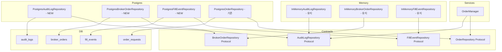
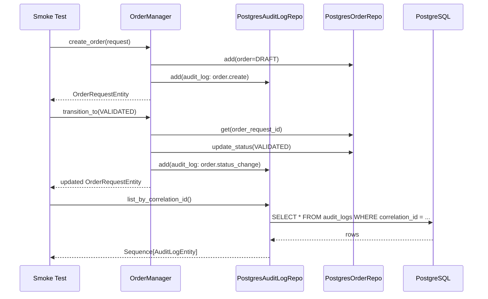
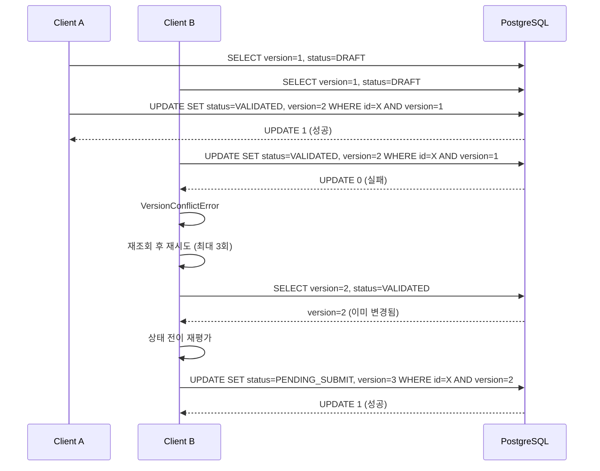

# Milestone 2 - Postgres 기반 Audit + Paper Loop 안정화

> **목표**: 실제 Postgres 기반 audit을 포함한 paper loop 안정화
>
> **상위 설계**: [`plan_docs/HANDOFF_TO_ROO_CODE.md`](plan_docs/HANDOFF_TO_ROO_CODE.md),
> [`plan_docs/ENTERPRISE_TRADING_SYSTEM_DESIGN.md`](plan_docs/ENTERPRISE_TRADING_SYSTEM_DESIGN.md)
>
> **Milestone 1 산출물**: [`plans/02.mvp_milestone1_implementation_plan.md`](plans/02.mvp_milestone1_implementation_plan.md),
> [`plans/03.milestone1_completion_review.md`](plans/03.milestone1_completion_review.md)

---

## 1. 현재 상태

| 영역 | 현재 구현 | 상태 |
|------|-----------|------|
| `AuditLogRepository` | [`InMemoryAuditLogRepository`](src/agent_trading/repositories/memory.py:336) | Postgres 미구현 |
| `BrokerOrderRepository` | [`InMemoryBrokerOrderRepository`](src/agent_trading/repositories/memory.py:252) | Postgres 미구현 |
| `FillEventRepository` | [`InMemoryFillEventRepository`](src/agent_trading/repositories/memory.py:278) | Postgres 미구현 |
| `build_postgres_repositories()` | [`bootstrap.py`](src/agent_trading/repositories/postgres/bootstrap.py:44) | 위 3개 InMemory fallback |
| 통합 테스트 | [`test_orders.py`](tests/repositories/test_orders.py) (InMemory only) | Postgres 테스트 없음 |
| Paper loop smoke test | [`test_paper_loop.py`](tests/smoke/test_paper_loop.py) (InMemory only) | Postgres 기반 테스트 없음 |
| 상태 전이 동시성 | [`PostgresOrderRepository.update_status()`](src/agent_trading/repositories/postgres/orders.py:123) | 낙관적 락 미적용 |

### DDL 매핑 검증

모든 대상 테이블의 DDL 컬럼이 엔티티 필드와 정확히 일치하므로
[`row_to_entity()`](src/agent_trading/db/row_mapper.py:14)를 직접 사용 가능 - 별도 매핑 코드 불필요.

| DDL 테이블 | 위치 | 엔티티 |
|-----------|------|--------|
| `trading.audit_logs` | [`0001_initial_schema.sql:407`](db/migrations/0001_initial_schema.sql:407) | [`AuditLogEntity`](src/agent_trading/domain/entities.py:246) |
| `trading.broker_orders` | [`0001_initial_schema.sql:332`](db/migrations/0001_initial_schema.sql:332) | [`BrokerOrderEntity`](src/agent_trading/domain/entities.py:204) |
| `trading.fill_events` | [`0001_initial_schema.sql:346`](db/migrations/0001_initial_schema.sql:346) | [`FillEventEntity`](src/agent_trading/domain/entities.py:218) |

---

## 2. 구현 계획 (우선순위 순)

> **원칙**: audit_logs를 최우선으로 구현. broker_orders / fill_events는 audit_logs 완료 후 진행.
> bootstrap도 audit_logs를 먼저 연결하여 부분 적용 가능한 상태로 만든다.

---

### Step 1 (최우선): `PostgresAuditLogRepository` 구현

**신규 파일**: [`src/agent_trading/repositories/postgres/audit_logs.py`](src/agent_trading/repositories/postgres/)

**구현 패턴**: [`PostgresClientRepository`](src/agent_trading/repositories/postgres/clients.py:12) 참조
(`__slots__`, `_tx`, `fetchrow` + `row_to_entity`)

**프로토콜**: [`AuditLogRepository`](src/agent_trading/repositories/contracts.py:183)

```python
class PostgresAuditLogRepository:
    __slots__ = ("_tx",)

    def __init__(self, tx: TransactionManager) -> None:
        self._tx = tx

    async def add(self, audit_log: AuditLogEntity) -> AuditLogEntity:
        row = await self._tx.connection.fetchrow(
            """
            INSERT INTO trading.audit_logs
                (audit_log_id, actor_type, actor_id, action,
                 target_entity_type, target_entity_id,
                 before_json, after_json,
                 correlation_id, metadata)
            VALUES ($1, $2, $3, $4, $5, $6, $7::jsonb, $8::jsonb, $9, $10::jsonb)
            RETURNING *
            """,
            audit_log.audit_log_id,
            audit_log.actor_type,
            audit_log.actor_id,
            audit_log.action,
            audit_log.target_entity_type,
            audit_log.target_entity_id,
            audit_log.before_json,
            audit_log.after_json,
            audit_log.correlation_id,
            audit_log.metadata,
        )
        return row_to_entity(row, AuditLogEntity)

    async def list_by_correlation_id(
        self, correlation_id: str
    ) -> Sequence[AuditLogEntity]:
        rows = await self._tx.connection.fetch(
            "SELECT * FROM trading.audit_logs WHERE correlation_id = $1 ORDER BY created_at",
            correlation_id,
        )
        return tuple(row_to_entity(r, AuditLogEntity) for r in rows)
```

**특이사항**:
- `before_json`, `after_json`, `metadata`는 JSONB 컬럼 - `::jsonb` 캐스팅 필요
- `created_at`은 DB DEFAULT `NOW()` - 엔티티에서 이미 설정했으므로 INSERT 값 사용
- UNIQUE 위반 상황 없음 (audit_logs에 UNIQUE 제약 없음) - 별도 예외 처리 불필요
- CHECK 제약 `ck_audit_logs_actor_type` 있음 (`system`, `operator`, `agent`) - OrderManager에서 `actor_type="system"`으로 고정

---

### Step 2: `PostgresBrokerOrderRepository` 구현

**신규 파일**: [`src/agent_trading/repositories/postgres/broker_orders.py`](src/agent_trading/repositories/postgres/)

**프로토콜**: [`BrokerOrderRepository`](src/agent_trading/repositories/contracts.py:134)

```python
class PostgresBrokerOrderRepository:
    __slots__ = ("_tx",)

    def __init__(self, tx: TransactionManager) -> None:
        self._tx = tx

    async def add(self, broker_order: BrokerOrderEntity) -> BrokerOrderEntity:
        row = await self._tx.connection.fetchrow(
            """
            INSERT INTO trading.broker_orders
                (broker_order_id, order_request_id, broker_name,
                 broker_native_order_id, broker_status,
                 request_payload_uri, response_payload_uri,
                 last_synced_at)
            VALUES ($1, $2, $3, $4, $5, $6, $7, $8)
            RETURNING *
            """,
            broker_order.broker_order_id,
            broker_order.order_request_id,
            broker_order.broker_name,
            broker_order.broker_native_order_id,
            broker_order.broker_status,
            broker_order.request_payload_uri,
            broker_order.response_payload_uri,
            broker_order.last_synced_at,
        )
        return row_to_entity(row, BrokerOrderEntity)

    async def get_by_native_order_id(
        self, broker_name: str, broker_native_order_id: str
    ) -> BrokerOrderEntity | None:
        row = await self._tx.connection.fetchrow(
            "SELECT * FROM trading.broker_orders WHERE broker_name = $1 AND broker_native_order_id = $2",
            broker_name, broker_native_order_id,
        )
        return row_to_entity(row, BrokerOrderEntity) if row else None

    async def list_by_order_request(
        self, order_request_id: UUID
    ) -> Sequence[BrokerOrderEntity]:
        rows = await self._tx.connection.fetch(
            "SELECT * FROM trading.broker_orders WHERE order_request_id = $1 ORDER BY created_at",
            order_request_id,
        )
        return tuple(row_to_entity(r, BrokerOrderEntity) for r in rows)
```

**특이사항**:
- `broker_native_order_id`가 NULL 허용 - UNIQUE 제약 `uq_broker_orders_native`는 NULL인 경우 중복 검사하지 않음 (SQL 표준)
- `created_at`, `updated_at`은 DB DEFAULT `NOW()` - 엔티티에 이미 값이 있으면 그대로 사용
- `asyncpg.UniqueViolationError` 처리: `uq_broker_orders_native` 위반 시 적절한 예외로 래핑 (선택사항)

---

### Step 3: `PostgresFillEventRepository` 구현

**신규 파일**: [`src/agent_trading/repositories/postgres/fill_events.py`](src/agent_trading/repositories/postgres/)

**프로토콜**: [`FillEventRepository`](src/agent_trading/repositories/contracts.py:149)

```python
class PostgresFillEventRepository:
    __slots__ = ("_tx",)

    def __init__(self, tx: TransactionManager) -> None:
        self._tx = tx

    async def add(self, fill_event: FillEventEntity) -> FillEventEntity:
        row = await self._tx.connection.fetchrow(
            """
            INSERT INTO trading.fill_events
                (fill_event_id, broker_order_id, broker_fill_id,
                 fill_timestamp, fill_price, fill_quantity,
                 fill_fee, fill_tax,
                 source_channel, raw_payload_uri)
            VALUES ($1, $2, $3, $4, $5, $6, $7, $8, $9, $10)
            RETURNING *
            """,
            fill_event.fill_event_id,
            fill_event.broker_order_id,
            fill_event.broker_fill_id,
            fill_event.fill_timestamp,
            fill_event.fill_price,
            fill_event.fill_quantity,
            fill_event.fill_fee,
            fill_event.fill_tax,
            fill_event.source_channel,
            fill_event.raw_payload_uri,
        )
        return row_to_entity(row, FillEventEntity)

    async def list_by_broker_order(
        self, broker_order_id: UUID
    ) -> Sequence[FillEventEntity]:
        rows = await self._tx.connection.fetch(
            "SELECT * FROM trading.fill_events WHERE broker_order_id = $1 ORDER BY fill_timestamp DESC",
            broker_order_id,
        )
        return tuple(row_to_entity(r, FillEventEntity) for r in rows)
```

**특이사항**:
- `broker_fill_id`가 NULL 허용 - UNIQUE `uq_fill_events_native (broker_order_id, broker_fill_id)`에 NULL 포함 시 중복 검사 안 함
- `fill_price`, `fill_quantity`는 `Decimal` 타입 - asyncpg가 자동 변환
- `source_channel`은 CHECK 제약 있음 (`websocket`, `rest_poll`, `backfill`, `manual`)

---

### Step 4: Postgres Bootstrap 업데이트 (audit_logs 우선 연결)

**수정 파일**: [`src/agent_trading/repositories/postgres/bootstrap.py`](src/agent_trading/repositories/postgres/bootstrap.py:44)

```python
from agent_trading.repositories.postgres.audit_logs import PostgresAuditLogRepository
from agent_trading.repositories.postgres.broker_orders import PostgresBrokerOrderRepository
from agent_trading.repositories.postgres.fill_events import PostgresFillEventRepository

def build_postgres_repositories(tx: TransactionManager) -> RepositoryContainer:
    return RepositoryContainer(
        unit_of_work=PostgresUnitOfWork(tx),
        clients=PostgresClientRepository(tx),
        accounts=PostgresAccountRepository(tx),
        strategies=InMemoryStrategyRepository(),                       # 유지
        instruments=PostgresInstrumentRepository(tx),
        decision_contexts=InMemoryDecisionContextRepository(),          # 유지
        position_snapshots=InMemoryPositionSnapshotRepository(),       # 유지
        cash_balance_snapshots=InMemoryCashBalanceSnapshotRepository(), # 유지
        trade_decisions=InMemoryTradeDecisionRepository(),             # 유지
        orders=PostgresOrderRepository(tx),
        broker_orders=PostgresBrokerOrderRepository(tx),              # InMemory -> Postgres
        fill_events=PostgresFillEventRepository(tx),                  # InMemory -> Postgres
        reconciliations=InMemoryReconciliationRepository(),            # 유지
        audit_logs=PostgresAuditLogRepository(tx),                    # InMemory -> Postgres
    )
```

**점진적 적용 전략**: audit_logs만 먼저 연결해도 코드는 정상 동작.
나머지 2개는 broker_orders / fill_events 구현 완료 후 연결.

---

### Step 5: PostgreSQL 통합 테스트 fixture 추가

**수정 파일**: [`tests/conftest.py`](tests/conftest.py)

**PostgreSQL 통합 테스트 원칙** (사용자 요구사항):
1. **테스트 전 migration 적용** - `ensure_schema()` 호출로 최신 DDL 반영
2. **테스트 간 clean state 보장** - 테스트 간 데이터 격리 필요 (롤백 기반 또는 스키마 재생성)
3. **`trading` 스키마 명시 사용** - 모든 쿼리는 `trading.xxx` 형식
4. **반복 실행 가능성 보장** - 실행 시마다 동일한 초기 상태

**fixture 설계**:

```python
@pytest.fixture
async def postgres_repos() -> AsyncIterator[RepositoryContainer]:
    """Create a clean PostgreSQL-backed RepositoryContainer per test.

    Builds the full postgres runtime, runs migrations, wraps everything
    in a transaction that is ROLLED BACK at the end - guaranteeing
    clean state for every test without manual cleanup.
    """
    config = DatabaseConfig()
    await create_pool(config)
    await ensure_schema(config)

    tx = await transaction().__aenter__()
    repos = build_postgres_repositories(tx)

    # Seed minimal required data (client, account, instrument)
    client_id = uuid4()
    account_id = uuid4()
    instrument_id = uuid4()
    now = datetime.now(timezone.utc)

    await repos.clients.add(ClientEntity(
        client_id=client_id, client_code="INTEG-TEST",
        name="Integration Test Client", status="active",
        base_currency="KRW",
    ))
    # ... account, instrument seed ...

    try:
        yield repos
    finally:
        await tx.rollback()
        await close_pool()
```

---

### Step 6: AuditLog 통합 테스트

**신규 파일**: [`tests/repositories/test_postgres_audit_logs.py`](tests/repositories/)

**테스트 시나리오**:
1. `add()` 후 `list_by_correlation_id()`로 조회 - 저장된 audit_log가 올바르게 반환되는지
2. `before_json` / `after_json` JSONB 저장 및 조회 - JSON 데이터 정합성
3. `metadata` JSONB 기본값 `{}` 동작 확인
4. 다중 audit_log 시간순 정렬 (`ORDER BY created_at`)
5. 존재하지 않는 correlation_id 조회시 빈 시퀀스 반환

---

### Step 7: BrokerOrder 통합 테스트

**신규 파일**: [`tests/repositories/test_postgres_broker_orders.py`](tests/repositories/)

**테스트 시나리오**:
1. `add()` 후 정상 저장 확인
2. `get_by_native_order_id()` 정상 케이스
3. `get_by_native_order_id()` 미존재시 None 반환
4. `list_by_order_request()` 복수 결과 확인
5. `broker_native_order_id` NULL 허용 확인

---

### Step 8: FillEvent 통합 테스트

**신규 파일**: [`tests/repositories/test_postgres_fill_events.py`](tests/repositories/)

**테스트 시나리오**:
1. `add()` 후 정상 저장 확인
2. `list_by_broker_order()` 시간 역순 정렬 확인
3. `broker_fill_id` NULL 허용 확인
4. 잘못된 `source_channel` 값으로 INSERT 시 DB CHECK 제약 위반 확인

---

### Step 9: Postgres 기반 Paper Loop Smoke Test

**신규 파일**: [`tests/smoke/test_paper_loop_postgres.py`](tests/smoke/)

**InMemory 테스트 유지**: CI에서 DB 없이도 빠른 검증 가능하도록 InMemory 테스트는 그대로 보존.

**Postgres smoke test 시나리오**:

```python
@pytest.mark.asyncio
async def test_postgres_paper_loop_happy_path(
    postgres_repos: RepositoryContainer,
) -> None:
    """Postgres 기반 paper loop: seed -> create -> transition -> audit verify."""

    # 1. postgres_repos fixture가 이미 seed data 제공
    mgr = OrderManager(repos=postgres_repos)

    # 2. Create order
    order = await mgr.create_order(request)
    assert order.status == OrderStatus.DRAFT

    # 3. Audit log: order.create 확인
    audit_logs = await postgres_repos.audit_logs.list_by_correlation_id("...")
    assert any(log.action == "order.create" for log in audit_logs)

    # 4. VALIDATED -> PENDING_SUBMIT -> SUBMITTED -> ACKNOWLEDGED -> FILLED
    validated = await mgr.transition_to(order, OrderStatus.VALIDATED)
    # ... 각 transition 후 audit log 확인 ...

    # 5. Audit log 상세 검증
    status_changes = [
        log for log in audit_logs if log.action == "order.status_change"
    ]
    assert len(status_changes) >= 1
    # before_json/after_json 검증
    assert status_changes[0].before_json["status"] == OrderStatus.DRAFT.value
    assert status_changes[0].after_json["status"] == OrderStatus.VALIDATED.value
```

**추가 검증 항목**:
- `build_postgres_runtime()`를 통한 폐쇄 루프:
  account -> instrument -> order -> audit_log 각 단계 데이터 정합성
- 중복 주문 차단 시 audit_log 기록 확인
- 금지 전이 차단 시 audit_log 기록 확인

---

### Step 10: 상태 전이 Optimistic Locking 설계 문서

**신규 파일**: [`plans/05.milestone2_optimistic_locking.md`](plans/)

> **Milestone 2에서는 문서화만 수행. 실제 구현은 Milestone 3에서 진행.**
> (OrderManager 인터페이스 변경 및 DDL 마이그레이션이 수반되므로)

#### 포함해야 할 내용 (사용자 요구사항)

1. **Version 컬럼 방식 권장 이유**
   - `updated_at` 기반 방식의 문제점: 타임스탬프 정밀도 한계 (동시 요청 시 동일 `updated_at` 읽기 가능),
     분산 환경에서 클럭 편향, NOW() 호출 시점에 따른 race condition 발생 가능
   - Version 컬럼 방식의 장점: 명시적 정수 비교로 충돌 감지 확실, NOW() 의존성 없음,
     재시도 로직이 직관적 (`version + 1`), DB 레벨 원자성 보장

2. **`order_requests` 우선 적용 이유**
   - 현재 동시성 리스크가 가장 큰 테이블: `OrderManager.transition_to()`에서
     `update_status()` 호출 시 read-modify-write 간 race condition 가능
   - 복수 클라이언트/워커가 동일 order를 동시에 transition 시도할 경우 lost update 발생
   - `broker_orders` / `fill_events`는 append-only 패턴 (race risk 낮음)
   - `audit_logs`는 append-only로 동시성 리스크 없음

3. **충돌 시 예외/재시도 정책**
   - `VersionConflictError` 정의: `order_request_id`, `expected_version`,
     `actual_version` 포함
   - 충돌 발생 시 OrderManager가 `OrderRequestEntity` 재조회 후 재시도
   - 재시도 횟수 제한 (예: 3회) 초과 시 상위 예외 전파
   - 최종 상태(terminal state) 도달 후 업데이트 시도 시 즉시 예외

4. **예상 DDL 변경안**
   ```sql
   -- 0002_add_version_column.sql
   ALTER TABLE trading.order_requests
       ADD COLUMN version INTEGER NOT NULL DEFAULT 1;

   -- 조회 성능을 위한 인덱스 (선택)
   CREATE INDEX idx_order_requests_version
       ON trading.order_requests (order_request_id, version);
   ```

5. **Entity 변경 사항**
   ```python
   @dataclass(slots=True, frozen=True)
   class OrderRequestEntity:
       # ... 기존 필드 ...
       version: int = 1   # 신규 추가
   ```

6. **Repository 변경 사항**
   ```python
   async def update_status(
       self,
       order_request_id: UUID,
       status: OrderStatus,
       *,
       expected_version: int,
       reason_code: str | None = None,
       reason_message: str | None = None,
   ) -> None:
       result = await self._tx.connection.execute(
           """
           UPDATE trading.order_requests
           SET status = $2,
               version = version + 1,
               status_reason_code = $3,
               status_reason_message = $4,
               updated_at = NOW()
           WHERE order_request_id = $1 AND version = $5
           """,
           order_request_id, status.value, reason_code, reason_message,
           expected_version,
       )
       if result != "UPDATE 1":
           raise VersionConflictError(order_request_id, expected_version)
   ```

---

### Step 11: 전체 테스트 실행 및 검증

- 모든 InMemory 테스트 정상 통과 확인
- PostgreSQL 통합 테스트 정상 통과 확인
- Smoke test (InMemory + Postgres) 정상 통과 확인
- `build_postgres_runtime()` 기반 paper loop 폐쇄 루프 실패 없음 확인

---

## 3. 변경 파일 목록

### 신규 생성 (8개)

| 파일 | 설명 |
|------|------|
| `src/agent_trading/repositories/postgres/audit_logs.py` | `PostgresAuditLogRepository` (Step 1) |
| `src/agent_trading/repositories/postgres/broker_orders.py` | `PostgresBrokerOrderRepository` (Step 2) |
| `src/agent_trading/repositories/postgres/fill_events.py` | `PostgresFillEventRepository` (Step 3) |
| `tests/repositories/test_postgres_audit_logs.py` | AuditLog 통합 테스트 (Step 6) |
| `tests/repositories/test_postgres_broker_orders.py` | BrokerOrder 통합 테스트 (Step 7) |
| `tests/repositories/test_postgres_fill_events.py` | FillEvent 통합 테스트 (Step 8) |
| `tests/smoke/test_paper_loop_postgres.py` | Postgres 기반 paper loop smoke test (Step 9) |
| `plans/05.milestone2_optimistic_locking.md` | Optimistic locking 설계 문서 (Step 10) |

### 수정 (2개)

| 파일 | 변경 내용 |
|------|-----------|
| `src/agent_trading/repositories/postgres/bootstrap.py` | 3개 InMemory -> Postgres 교체 (Step 4) |
| `tests/conftest.py` | `postgres_repos` fixture 추가 (Step 5) |

### 유지 (변경 불필요)

| 파일 | 이유 |
|------|------|
| `contracts.py`, `entities.py`, `enums.py` | 프로토콜/엔티티 변경 없음 |
| `row_mapper.py` | 이미 범용적으로 동작 |
| `order_manager.py` | 인터페이스 변경 불필요 |
| `memory.py` | InMemory 구현 유지 |
| 모든 InMemory 테스트 | CI 호환성 보장 |

---

## 4. 아키텍처 다이어그램

### 4.1 Postgres Repository 계층 구조 (Milestone 2 완료 후)



### 4.2 Paper Loop 데이터 흐름 (Postgres 기반)



### 4.3 Optimistic Locking 흐름



---

## 5. 완료 기준 (Exit Criteria)

1. [`PostgresAuditLogRepository`](src/agent_trading/repositories/postgres/audit_logs.py) -
   `add()` + `list_by_correlation_id()` 정상 동작, OrderManager 이벤트가 DB audit_logs 테이블에 저장됨
2. [`PostgresBrokerOrderRepository`](src/agent_trading/repositories/postgres/broker_orders.py) -
   `add()` + `get_by_native_order_id()` + `list_by_order_request()` 정상 동작
3. [`PostgresFillEventRepository`](src/agent_trading/repositories/postgres/fill_events.py) -
   `add()` + `list_by_broker_order()` 정상 동작
4. [`build_postgres_repositories()`](src/agent_trading/repositories/postgres/bootstrap.py) -
   위 3개가 Postgres 구현으로 교체됨
5. 통합 테스트 - 각 Repository별 최소 2개 이상 테스트 케이스 통과
6. Paper loop smoke test - Postgres 기반 폐쇄 루프 검증 통과
   (account -> instrument -> order -> audit_log 흐름)
7. [`plans/05.milestone2_optimistic_locking.md`](plans/05.milestone2_optimistic_locking.md) -
   version 컬럼 방식, order_requests 우선 적용 이유, 충돌 예외/재시도 정책, DDL 변경안 포함
8. InMemory 테스트 영향 없음 - 기존 InMemory 기반 테스트 모두 그대로 통과
