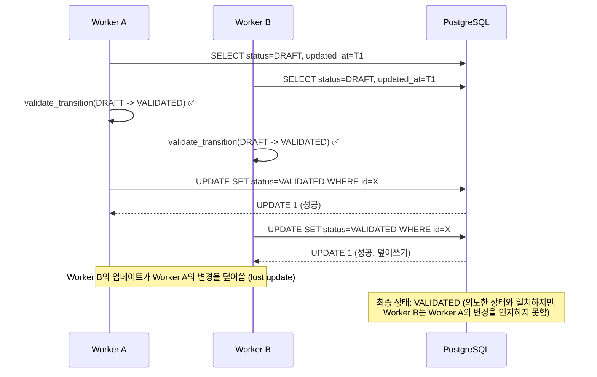
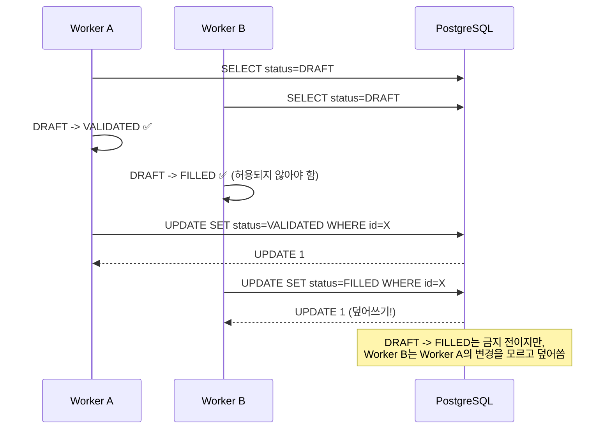

# 상태 전이 Optimistic Locking 설계안

> **문서화 목적**: Milestone 2에서는 설계안을 제안하고 문서화까지만 수행.
> 실제 DDL/Repository/OrderManager 반영은 Milestone 3에서 진행.
>
> **관련 파일**:
> - [`PostgresOrderRepository.update_status()`](src/agent_trading/repositories/postgres/orders.py:123) — 현재 동시성 제어 없음
> - [`OrderManager.transition_to()`](src/agent_trading/services/order_manager.py:253) — read-modify-write 패턴
> - [`OrderRequestEntity`](src/agent_trading/domain/entities.py:182) — version 필드 추가 필요
> - [`0001_initial_schema.sql`](db/migrations/0001_initial_schema.sql:286) — order_requests DDL

---

## 1. 문제 정의

### 1.1 현재 상황

[`PostgresOrderRepository.update_status()`](src/agent_trading/repositories/postgres/orders.py:123)는
`WHERE order_request_id = $1` 조건만 사용:

```python
async def update_status(self, order_request_id, status, ...):
    await self._tx.connection.execute(
        "UPDATE trading.order_requests SET status = $2 ... WHERE order_request_id = $1",
        order_request_id, ...
    )
```

### 1.2 Lost Update 시나리오



더 심각한 경우:



---

## 2. 설계안 비교

### 2.1 설계안 A: `updated_at` 기반 낙관적 락

```sql
UPDATE trading.order_requests
SET status = $2, updated_at = NOW()
WHERE order_request_id = $1 AND updated_at = $3
```

| 항목 | 평가 |
|------|------|
| DDL 변경 | 불필요 (`updated_at` 컬럼 이미 존재) |
| 충돌 감지 | 타임스탬프 정밀도에 의존 |
| 동시 요청 | 동일 `updated_at` 읽을 가능성 있음 (ms 단위) |
| 분산 환경 | 클럭 편향(clock skew)에脆弱 |
| 재시도 로직 | 복잡 (`updated_at` 재조회 필요) |

**결론**: 타임스탬프 기반은 정밀도 한계와 클럭 의존성으로 인해
동시성이 높은 트레이딩 시스템에 부적합.

### 2.2 설계안 B: Version 컬럼 기반 낙관적 락 (권장)

```sql
UPDATE trading.order_requests
SET status = $2, version = version + 1, updated_at = NOW()
WHERE order_request_id = $1 AND version = $3
```

| 항목 | 평가 |
|------|------|
| DDL 변경 | `version INTEGER NOT NULL DEFAULT 1` 컬럼 추가 필요 |
| 충돌 감지 | 명시적 정수 비교로 확실 |
| 동시 요청 | 원자적 `version + 1`로 race condition 없음 |
| 분산 환경 | 클럭 의존성 없음 |
| 재시도 로직 | 직관적 (`expected_version + 1`) |

**권장 이유**:
1. **명시적 충돌 감지**: 정수 비교로 타임스탬프보다 확실
2. **NOW() 의존성 없음**: 분산 환경에서 클럭 편향 문제 없음
3. **원자성 보장**: `version = version + 1`은 DB 레벨에서 원자적
4. **재시도 직관적**: `expected_version`만 변경하면 재시도 가능

---

## 3. `order_requests` 우선 적용 이유

### 3.1 동시성 리스크 평가

| 테이블 | 패턴 | 동시성 리스크 | 우선순위 |
|--------|------|--------------|---------|
| `order_requests` | read-modify-write (`transition_to`) | **높음** | **1순위** |
| `broker_orders` | append-only (INSERT) | 낮음 | 2순위 |
| `fill_events` | append-only (INSERT) | 낮음 | 2순위 |
| `audit_logs` | append-only (INSERT) | 없음 | 제외 |

### 3.2 `order_requests`의 특수성

- [`OrderManager.transition_to()`](src/agent_trading/services/order_manager.py:253)는
  `get()` -> `_validate_transition()` -> `_replace_status()` -> `update_status()` 순서로 동작
- 이 read-modify-write 사이에 다른 워커가 개입할 수 있음
- 복수 워커/스레드가 동일 order를 동시에 transition 시도 가능
- 상태 전이 검증(`_validate_transition`)이 stale state 기준으로 수행될 위험

### 3.3 다른 테이블은 제외하는 이유

- `broker_orders`, `fill_events`: INSERT-only 패턴으로 race condition 없음
- `audit_logs`: append-only, UNIQUE 제약 없음, 충돌 자체가 발생하지 않음

---

## 4. 상세 설계

### 4.1 DDL 변경안

```sql
-- 0002_add_version_column.sql
-- Migration: Add optimistic locking version column to order_requests

ALTER TABLE trading.order_requests
    ADD COLUMN version INTEGER NOT NULL DEFAULT 1;

-- 기존 데이터는 version=1로 설정
UPDATE trading.order_requests SET version = 1 WHERE version IS NULL;

-- (선택) 조회 성능 인덱스
CREATE INDEX idx_order_requests_version
    ON trading.order_requests (order_request_id, version);
```

### 4.2 Entity 변경

[`OrderRequestEntity`](src/agent_trading/domain/entities.py:182)에 `version` 필드 추가:

```python
@dataclass(slots=True, frozen=True)
class OrderRequestEntity:
    # ... 기존 필드 (변경 없음) ...
    created_at: datetime | None = None
    updated_at: datetime | None = None
    version: int = 1  # 신규 추가
```

`frozen=True` dataclass이므로 상태 변경 시 `dataclasses.replace()`로 version 증가:

```python
# OrderManager.transition_to() 내부
updated_order = dataclasses.replace(
    order,
    status=new_status,
    status_reason_code=reason_code,
    status_reason_message=reason_message,
    updated_at=datetime.now(timezone.utc),
    version=order.version + 1,  # version 증가
)
```

### 4.3 Repository 변경

[`PostgresOrderRepository.update_status()`](src/agent_trading/repositories/postgres/orders.py:123):

```python
class VersionConflictError(ValueError):
    """Raised when an optimistic lock version mismatch is detected."""

    def __init__(
        self,
        order_request_id: UUID,
        expected_version: int,
        actual_version: int | None = None,
    ) -> None:
        self.order_request_id = order_request_id
        self.expected_version = expected_version
        self.actual_version = actual_version
        super().__init__(
            f"Version conflict for order {order_request_id}: "
            f"expected version {expected_version}, "
            f"actual version {actual_version or 'unknown'}"
        )


async def update_status(
    self,
    order_request_id: UUID,
    status: OrderStatus,
    *,
    expected_version: int,
    reason_code: str | None = None,
    reason_message: str | None = None,
) -> None:
    result = await self._tx.connection.execute(
        """
        UPDATE trading.order_requests
        SET status = $2,
            version = version + 1,
            status_reason_code = $3,
            status_reason_message = $4,
            updated_at = NOW()
        WHERE order_request_id = $1 AND version = $5
        """,
        order_request_id,
        status.value,
        reason_code,
        reason_message,
        expected_version,
    )
    if result != "UPDATE 1":
        # 충돌 발생 - 현재 version 조회
        row = await self._tx.connection.fetchrow(
            "SELECT version FROM trading.order_requests WHERE order_request_id = $1",
            order_request_id,
        )
        actual = row["version"] if row else None
        raise VersionConflictError(order_request_id, expected_version, actual)
```

### 4.4 OrderManager 변경

[`OrderManager.transition_to()`](src/agent_trading/services/order_manager.py:253)에
재시도 로직 추가:

```python
from agent_trading.repositories.postgres.orders import VersionConflictError

MAX_RETRIES = 3

async def transition_to(
    self,
    order: OrderRequestEntity,
    new_status: OrderStatus,
    *,
    reason_code: str | None = None,
    reason_message: str | None = None,
) -> OrderRequestEntity:
    for attempt in range(MAX_RETRIES):
        # 1. 최신 상태 조회
        current = await self.repos.orders.get(order.order_request_id)
        if current is None:
            raise ValueError(f"Order {order.order_request_id} not found")

        # 2. 유효성 검증
        _validate_transition(current.status, new_status)

        # 3. 상태 변경
        updated = _replace_status(
            current, new_status,
            reason_code=reason_code,
            reason_message=reason_message,
        )

        # 4. 저장 (version 충돌 시 재시도)
        try:
            await self.repos.orders.update_status(
                order_request_id=current.order_request_id,
                status=new_status,
                expected_version=current.version,
                reason_code=reason_code,
                reason_message=reason_message,
            )
        except VersionConflictError:
            if attempt == MAX_RETRIES - 1:
                raise  # 최대 재시도 초과
            continue  # 재조회 후 재시도

        # 5. Audit log 기록
        await self._record_status_change(
            before=current,
            after=updated,
            correlation_id=current.correlation_id,
        )

        return updated

    raise RuntimeError(f"Failed to transition order after {MAX_RETRIES} attempts")
```

### 4.5 충돌 시 예외/재시도 정책

| 상황 | 동작 |
|------|------|
| Version 충돌 (1회) | 재조회 후 재시도 (최대 3회) |
| Version 충돌 (3회 초과) | `VersionConflictError` 상위 전파 |
| 최종 상태(terminal) 도달 후 업데이트 시도 | `_validate_transition()`에서 차단 (재시도 전) |
| 대상 row 삭제됨 | `ValueError("Order not found")` |

---

## 5. 적용 범위

### 5.1 이번 Milestone (Milestone 2) — 문서화만

| 항목 | 상태 |
|------|------|
| 설계 문서 | ✅ 본 문서 |
| DDL 마이그레이션 | ❌ Milestone 3 |
| Entity 변경 | ❌ Milestone 3 |
| Repository 변경 | ❌ Milestone 3 |
| OrderManager 변경 | ❌ Milestone 3 |

### 5.2 다음 Milestone (Milestone 3) — 구현

| 파일 | 변경 내용 |
|------|-----------|
| `db/migrations/0002_add_version_column.sql` | `ALTER TABLE ... ADD COLUMN version` |
| `src/agent_trading/domain/entities.py` | `OrderRequestEntity.version: int = 1` |
| `src/agent_trading/repositories/postgres/orders.py` | `VersionConflictError`, `update_status()`에 version 조건 |
| `src/agent_trading/services/order_manager.py` | `transition_to()`에 재시도 로직 |
| `src/agent_trading/repositories/contracts.py` | (변경 불필요 - Protocol은 선택적 파라미터 허용) |

---

## 6. 고려사항

### 6.1 `frozen=True` dataclass와 version 관리

`OrderRequestEntity`는 `frozen=True`이므로 `dataclasses.replace()`로 새 인스턴스 생성.
`version` 필드는 `_replace_status()` 헬퍼에서 증가시킴:

```python
def _replace_status(order, new_status, *, reason_code=None, reason_message=None):
    return dataclasses.replace(
        order,
        status=new_status,
        version=order.version + 1,  # 추가
        ...
    )
```

### 6.2 Protocol 호환성

[`OrderRepository`](src/agent_trading/repositories/contracts.py:111) Protocol의
`update_status()` 시그니처는 변경 불가 (계약 유지 원칙).
`**kwargs` 또는 선택적 파라미터로 `expected_version` 추가:

```python
# contracts.py (변경 불가 - 대안)
class OrderRepository(Protocol):
    async def update_status(
        self,
        order_request_id: UUID,
        status: OrderStatus,
        reason_code: str | None = None,
        reason_message: str | None = None,
        **kwargs: Any,  # 구현체별 추가 파라미터 허용
    ) -> None: ...
```

또는 `InMemoryOrderRepository`에서 version을 무시하도록 구현.

### 6.3 트랜잭션 격리 수준

PostgreSQL 기본 격리 수준(`READ COMMITTED`)에서 version 조건부 UPDATE는
동시성 제어에 충분함. `SERIALIZABLE` 격리 수준까지 필요하지 않음.
