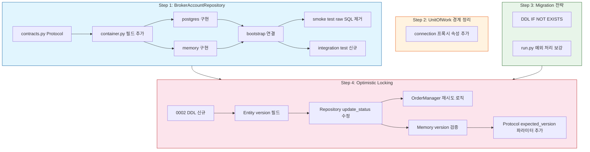

# Milestone 3 - Postgres 저장 계층 완성 및 동시성 제어

> **목표**: Milestone 2에서 누락된 `BrokerAccountRepository`를 추가하고, `PostgresUnitOfWork`의 경계를 정리하며, migration 재실행 전략을 확정하고, optimistic locking을 실제 구현한다.

---

## 1. BrokerAccountRepository 추가

### 1.1 현재 문제

[`tests/smoke/test_paper_loop_postgres.py`](../tests/smoke/test_paper_loop_postgres.py:42)의 `_seed_broker_account()`가 raw SQL을 직접 실행:

```python
async def _seed_broker_account(postgres_repos, broker_account_id, account_ref="PG-SMOKE-ACCT"):
    conn = postgres_repos.unit_of_work.transaction.connection  # ← 우회 접근
    await conn.execute(
        """INSERT INTO trading.broker_accounts (...) VALUES (...)""", ...
    )
```

또한 `agent_trading.runtime.bootstrap.build_postgres_runtime()`도 [`src/agent_trading/runtime/bootstrap.py`](../src/agent_trading/runtime/bootstrap.py:32) 내에서 raw SQL로 broker_account를 생성함.

### 1.2 필요한 변경

#### Step 1.1 — `BrokerAccountRepository` Protocol 정의

[`src/agent_trading/repositories/contracts.py`](../src/agent_trading/repositories/contracts.py:37)에 추가:

```python
class BrokerAccountRepository(Protocol):
    async def add(self, broker_account: BrokerAccountEntity) -> BrokerAccountEntity: ...
    async def get(self, broker_account_id: UUID) -> BrokerAccountEntity | None: ...
    async def get_by_ref(self, broker_name: str, account_ref: str, environment: Environment) -> BrokerAccountEntity | None: ...
    async def list_by_broker(self, broker_name: str) -> Sequence[BrokerAccountEntity]: ...
```

**설계 결정**: `get_by_ref()`는 `broker_name + account_ref + environment` 복합 UNIQUE 제약을 활용.

#### Step 1.2 — `RepositoryContainer`에 필드 추가

[`src/agent_trading/repositories/container.py`](../src/agent_trading/repositories/container.py:23):

```python
@dataclass(slots=True, frozen=True)
class RepositoryContainer:
    ...
    broker_accounts: BrokerAccountRepository  # ← 추가
```

> ⚠️ **주의**: `frozen=True`이므로 `build_postgres_repositories()`와 `build_in_memory_repositories()`에서도 함께 초기화해야 함.

#### Step 1.3 — `PostgresBrokerAccountRepository` 구현

[`src/agent_trading/repositories/postgres/broker_accounts.py`](../src/agent_trading/repositories/postgres/broker_accounts.py) (신규):

```python
from agent_trading.db.row_mapper import row_to_entity
from agent_trading.db.transaction import TransactionManager
from agent_trading.domain.entities import BrokerAccountEntity

class PostgresBrokerAccountRepository:
    __slots__ = ("_tx",)
    def __init__(self, tx: TransactionManager) -> None:
        self._tx = tx

    async def add(self, account: BrokerAccountEntity) -> BrokerAccountEntity:
        row = await self._tx.connection.fetchrow(
            """INSERT INTO trading.broker_accounts
               (broker_account_id, broker_name, account_ref, environment,
                credential_ref, base_url, status, created_at, updated_at)
               VALUES ($1, $2, $3, $4, $5, $6, $7, $8, $9)
               RETURNING *""",
            account.broker_account_id, account.broker_name, account.account_ref,
            account.environment.value, account.credential_ref, account.base_url,
            account.status, account.created_at or datetime.now(timezone.utc),
            account.updated_at or datetime.now(timezone.utc),
        )
        return row_to_entity(row, BrokerAccountEntity)

    async def get(self, broker_account_id: UUID) -> BrokerAccountEntity | None:
        row = await self._tx.connection.fetchrow(
            "SELECT * FROM trading.broker_accounts WHERE broker_account_id = $1",
            broker_account_id,
        )
        return row_to_entity(row, BrokerAccountEntity) if row else None

    async def get_by_ref(self, broker_name: str, account_ref: str, environment: Environment) -> BrokerAccountEntity | None:
        row = await self._tx.connection.fetchrow(
            "SELECT * FROM trading.broker_accounts WHERE broker_name = $1 AND account_ref = $2 AND environment = $3",
            broker_name, account_ref, environment.value,
        )
        return row_to_entity(row, BrokerAccountEntity) if row else None

    async def list_by_broker(self, broker_name: str) -> Sequence[BrokerAccountEntity]:
        rows = await self._tx.connection.fetch(
            "SELECT * FROM trading.broker_accounts WHERE broker_name = $1 ORDER BY account_ref",
            broker_name,
        )
        return tuple(row_to_entity(r, BrokerAccountEntity) for r in rows)
```

#### Step 1.4 — `InMemoryBrokerAccountRepository` 구현

[`src/agent_trading/repositories/memory.py`](../src/agent_trading/repositories/memory.py:50) 영역에 추가:

```python
class InMemoryBrokerAccountRepository:
    def __init__(self) -> None:
        self._items: dict[UUID, BrokerAccountEntity] = {}

    async def add(self, account: BrokerAccountEntity) -> BrokerAccountEntity:
        self._items[account.broker_account_id] = account
        return account

    async def get(self, broker_account_id: UUID) -> BrokerAccountEntity | None:
        return self._items.get(broker_account_id)

    async def get_by_ref(self, broker_name: str, account_ref: str, environment: Environment) -> BrokerAccountEntity | None:
        for item in self._items.values():
            if item.broker_name == broker_name and item.account_ref == account_ref and item.environment == environment:
                return item
        return None

    async def list_by_broker(self, broker_name: str) -> Sequence[BrokerAccountEntity]:
        return tuple(item for item in self._items.values() if item.broker_name == broker_name)
```

#### Step 1.5 — Bootstrap 업데이트

[`src/agent_trading/repositories/postgres/bootstrap.py`](../src/agent_trading/repositories/postgres/bootstrap.py:54)에 `broker_accounts=PostgresBrokerAccountRepository(tx)` 추가.

[`src/agent_trading/repositories/bootstrap.py`](../src/agent_trading/repositories/bootstrap.py:22)에 `broker_accounts=InMemoryBrokerAccountRepository()` 추가.

#### Step 1.6 — Smoke test raw SQL 제거

[`tests/smoke/test_paper_loop_postgres.py`](../tests/smoke/test_paper_loop_postgres.py:42)의 `_seed_broker_account()`를 repository 호출로 변경:

```python
async def _seed_broker_account(postgres_repos, broker_account_id, account_ref="PG-SMOKE-ACCT"):
    account = BrokerAccountEntity(
        broker_account_id=UUID(broker_account_id),
        broker_name="KoreaInvestment",
        account_ref=account_ref,
        environment=Environment.PAPER,
        credential_ref="pg-smoke-cred",
        status="active",
        created_at=datetime.now(timezone.utc),
        updated_at=datetime.now(timezone.utc),
    )
    await postgres_repos.broker_accounts.add(account)
```

#### Step 1.7 — Integration test 작성

`tests/repositories/test_postgres_broker_accounts.py` (신규) — 다른 postgres test 패턴과 동일하게 `postgres_repos` fixture 사용.

---

## 2. PostgresUnitOfWork 경계 정리

### 2.1 현재 문제

`postgres_repos.unit_of_work.transaction.connection` 체인으로 raw connection에 접근. 이는:
- `UnitOfWork` Protocol (`commit`, `rollback`만 정의)을 우회
- Postgres 구현 상세를 호출자에게 노출
- 테스트/모의가 어려워짐

### 2.2 설계 결정안

3가지 옵션을 비교:

| 옵션 | 설명 | 장점 | 단점 |
|------|------|------|------|
| **A: `connection` 속성을 `PostgresUnitOfWork`에 직접 추가** (권장) | `PostgresUnitOfWork.connection` → `TransactionManager.connection` 위임 | 최소 변경, 직관적, repository 생성자에 `tx` 전달 방식 유지 | `UnitOfWork` Protocol이 connection 노출 안 함 (구현체 전용) |
| **B: `execute()`/`fetchrow()` 래퍼 메서드** | `PostgresUnitOfWork.execute(sql, *params)` 등 | Protocol에 포함 가능, 우회 접근 차단 | repository마다 `self._uow.execute()` 호출로 변경 필요 (큰 변경) |
| **C: `UnitOfWork` Protocol 확장** | `connection` 속성을 Protocol에 추가 | 향후 모든 UnitOfWork 구현체가 connection 제공 | InMemory에는 connection 개념 없음, Protocol 오염 |

### 2.3 권장: 옵션 A

**최종 결정**: **옵션 A** (`PostgresUnitOfWork`에 `connection` 프록시 속성 추가) + `UnitOfWork` Protocol은 변경하지 않음.

**이유**:
1. `RepositoryContainer`의 `unit_of_work` 타입이 `UnitOfWork` Protocol이므로 Protocol 변경은 전체 구조에 영향
2. `PostgresUnitOfWork`는 이미 `TransactionManager`를 래핑하므로 `connection` 위임은 자연스러움
3. raw SQL이 필요한 smoke test 등에서만 사용되고, 일반 repository는 `TransactionManager`를 직접 받음

**변경 사항**:

[`src/agent_trading/repositories/postgres_uow.py`](../src/agent_trading/repositories/postgres_uow.py:19):

```python
@property
def connection(self) -> asyncpg.Connection:
    return self._tx.connection
```

이렇게 하면 현재의 `postgres_repos.unit_of_work.transaction.connection`이 `postgres_repos.unit_of_work.connection`으로 단축됨.

> **⚠️ 사용 범위 정책**: `connection` 프록시는 **repository 구현**과 **test fixture** 용도로만 사용한다. Service/application layer에서 raw connection을 직접 사용하는 것은 **금지**한다. 모든 데이터 접근은 repository Protocol을 통해야 하며, 이를 통해 일관된 트랜잭션 관리와 테스트 용이성을 확보한다.

**향후 방향**: 모든 repository가 `TransactionManager` 대신 `PostgresUnitOfWork`를 받도록 하면 `connection` 접근이 더 자연스러워짐. 이는 Milestone 4 이후로 연기.

---

## 3. Migration 재실행 전략 확정

### 3.1 현재 문제

[`src/agent_trading/db/migrations/run.py`](../src/agent_trading/db/migrations/run.py:66)에서 `DuplicateTableError`를 catch해서 무시:

```python
try:
    await conn.execute(sql)
except asyncpg.exceptions.DuplicateTableError:
    logger.info("Migration already applied: %s", path.name)
```

이는 테스트에서 `run_all_migrations()`가 매번 호출될 때 이미 존재하는 테이블에 대한 DDL이 실패하는 것을 우회하기 위한 임시 조치.

### 3.2 비교

| 옵션 | 설명 | 장점 | 단점 |
|------|------|------|------|
| **A: `IF NOT EXISTS` + idempotent SQL** | DDL에 `CREATE TABLE IF NOT EXISTS`, `CREATE SCHEMA IF NOT EXISTS` 등 사용 | 선언적, 안전, 운영 환경에도 적합 | 기존 SQL 파일 수정 필요, `ALTER TABLE` 등은 idempotent하지 않음 |
| **B: Schema Reset (테스트 전용)** | test fixture에서 `DROP SCHEMA trading CASCADE` 후 재생성 | 완전한 격리, 테스트 신뢰성 향상 | 운영 migration과 별도 흐름, 학습 비용 |
| **C: Migration version tracking** | 별도 `schema_migrations` 테이블로 적용 여부 추적 | 업계 표준 (Flyway, Alembic) | 새 인프라 필요, 복잡도 증가 |

### 3.3 권장: A + B 혼합 (임시 전략)

**Step 3.1 — DDL을 idempotent하게 변경** (옵션 A):

[`db/migrations/0001_initial_schema.sql`](../db/migrations/0001_initial_schema.sql)에서:
- `CREATE TABLE` → `CREATE TABLE IF NOT EXISTS` (이미 `CREATE SCHEMA IF NOT EXISTS` 사용 중)
- `CREATE INDEX` → `CREATE INDEX IF NOT EXISTS` (PostgreSQL 9.5+)

하지만 `ALTER TABLE ADD COLUMN`과 `CHECK` 제약은 idempotent하지 않음.

**Step 3.2 — `DuplicateTableError` 우회 유지 + 특정 예외만 catch**:

`DuplicateTableError` catch를 유지하지만, 다른 `PostgresError`(타입 불일치 등)는 전파되도록 개선:

```python
try:
    await conn.execute(sql)
except asyncpg.exceptions.DuplicateTableError:
    logger.info("Migration already applied: %s", path.name)
except asyncpg.exceptions.DuplicateObjectError:
    logger.info("Object already exists: %s", path.name)
# 그 외 PostgresError는 그대로 전파
```

**Step 3.3 — (선택) 테스트용 schema reset fixture**:

`tests/conftest.py`의 `postgres_repos` fixture에서 migration 전에 schema reset:

```python
async with pool.acquire() as conn:
    await conn.execute("DROP SCHEMA IF EXISTS trading CASCADE")
await run_all_migrations()
```

**권장**: 현재 `DuplicateTableError` 우회를 유지하되, DDL에 `IF NOT EXISTS`를 적용할 수 있는 부분은 적용. Schema reset은 필요시 별도 fixture로 제공.

> **⚠️ 임시 전략 고지**: `IF NOT EXISTS` + `Duplicate*` catch 전략은 **임시 전략**으로 취급한다. 장기적으로는 migration version tracking 도입 또는 DDL 자체 정리가 필요하다. 테스트에서는 clean state 보장을 우선하여, schema drift가 숨겨지지 않도록 한다.

---

## 4. Optimistic Locking 실제 구현

### 4.1 설계 문서 참조

이미 [`plans/05.milestone2_optimistic_locking.md`](../plans/05.milestone2_optimistic_locking.md)에 상세 설계가 문서화되어 있음.

### 4.2 DDL 변경

`db/migrations/0002_add_version_column.sql` (신규):

```sql
BEGIN;

ALTER TABLE trading.order_requests
    ADD COLUMN version INTEGER NOT NULL DEFAULT 1;

UPDATE trading.order_requests SET version = 1 WHERE version IS NULL;

COMMIT;
```

### 4.3 Entity 변경

[`src/agent_trading/domain/entities.py`](../src/agent_trading/domain/entities.py:192) `OrderRequestEntity`에 `version: int = 1` 추가:

```python
@dataclass(slots=True, frozen=True)
class OrderRequestEntity:
    ...
    created_at: datetime | None = None
    updated_at: datetime | None = None
    version: int = 1  # ← 신규 추가
```

### 4.4 Repository 변경

[`src/agent_trading/repositories/postgres/orders.py`](../src/agent_trading/repositories/postgres/orders.py:123) `update_status()`:

```python
async def update_status(
    self,
    order_request_id: UUID,
    status: OrderStatus,
    *,
    expected_version: int | None = None,  # ← 신규 파라미터
    reason_code: str | None = None,
    reason_message: str | None = None,
) -> None:
    if expected_version is not None:
        result = await self._tx.connection.execute(
            """
            UPDATE trading.order_requests
            SET status = $2,
                version = version + 1,
                status_reason_code = $3,
                status_reason_message = $4,
                updated_at = NOW()
            WHERE order_request_id = $1 AND version = $5
            """,
            order_request_id, status.value, reason_code, reason_message, expected_version,
        )
        if result != "UPDATE 1":
            row = await self._tx.connection.fetchrow(
                "SELECT version FROM trading.order_requests WHERE order_request_id = $1",
                order_request_id,
            )
            actual = row["version"] if row else None
            raise VersionConflictError(order_request_id, expected_version, actual)
    else:
        # Fallback: 기존 동작 (version 검사 없음)
        await self._tx.connection.execute(
            """UPDATE trading.order_requests
               SET status = $2, status_reason_code = $3, status_reason_message = $4, updated_at = NOW()
               WHERE order_request_id = $1""",
            order_request_id, status.value, reason_code, reason_message,
        )
```

### 4.5 `VersionConflictError` 추가

`src/agent_trading/repositories/postgres/orders.py`에 추가 (설계 문서와 동일):

```python
class VersionConflictError(ValueError):
    def __init__(self, order_request_id: UUID, expected_version: int, actual_version: int | None = None):
        self.order_request_id = order_request_id
        self.expected_version = expected_version
        self.actual_version = actual_version
        super().__init__(f"Version conflict for order {order_request_id}: expected {expected_version}, got {actual_version}")
```

### 4.6 `InMemoryOrderRepository` 대응 — version 검증

[`src/agent_trading/repositories/memory.py`](../src/agent_trading/repositories/memory.py:236)의 `update_status()`에 `expected_version` 검증 로직 추가:

```python
async def update_status(
    self,
    order_request_id: UUID,
    status: OrderStatus,
    *,
    expected_version: int | None = None,
    reason_code: str | None = None,
    reason_message: str | None = None,
) -> None:
    if order_request_id not in self._items:
        raise ValueError(f"Order {order_request_id} not found")
    current = self._items[order_request_id]
    if expected_version is not None and current.version != expected_version:
        raise VersionConflictError(order_request_id, expected_version, current.version)
    self._items[order_request_id] = dataclasses.replace(
        current,
        status=status,
        status_reason_code=reason_code,
        status_reason_message=reason_message,
        version=current.version + 1,
    )
```

> **설계 결정**: `InMemoryOrderRepository`도 `expected_version`을 검증함으로써 optimistic locking 테스트가 메모리 구현에서도 의미를 가진다. `**kwargs`로 무시하지 않으며, `VersionConflictError`는 Postgres 구현과 동일한 예외를 사용한다.

### 4.7 `OrderRepository` Protocol 변경

[`src/agent_trading/repositories/contracts.py`](../src/agent_trading/repositories/contracts.py:124) — `update_status()`에 `expected_version: int | None = None` 파라미터를 추가한다:

```python
async def update_status(
    self,
    order_request_id: UUID,
    status: OrderStatus,
    *,
    expected_version: int | None = None,
    reason_code: str | None = None,
    reason_message: str | None = None,
) -> None: ...
```

> **이유**: `InMemoryOrderRepository`도 `expected_version`을 검증하므로, Protocol에도 공식 파라미터로 선언하는 것이 타입 안정성에 유리하다. `None` 기본값으로 기존 호출자는 변경 불필요.

### 4.8 `OrderManager.transition_to()`에 재시도 로직

[`src/agent_trading/services/order_manager.py`](../src/agent_trading/services/order_manager.py:262):

```python
from agent_trading.repositories.postgres.orders import VersionConflictError

MAX_RETRIES = 3

async def transition_to(
    self,
    order: OrderRequestEntity,
    target_status: OrderStatus,
    *,
    reason_code: str | None = None,
    reason_message: str | None = None,
    actor_type: str = "system",
    actor_id: str = "order_manager",
) -> OrderRequestEntity:
    current = order

    # 사전 검증: 유효하지 않은 전이는 재시도해도 의미 없음
    _validate_transition(current.order_request_id, current.status, target_status)
    after = _replace_status(current, target_status, reason_code=reason_code, reason_message=reason_message)

    # Retry loop: 순수 상태 update만 재시도
    for attempt in range(MAX_RETRIES):
        try:
            await self.repos.orders.update_status(
                after.order_request_id, after.status,
                expected_version=current.version,
                reason_code=reason_code, reason_message=reason_message,
            )
        except VersionConflictError:
            if attempt == MAX_RETRIES - 1:
                raise
            # 재조회 후 재시도
            refreshed = await self.repos.orders.get(order.order_request_id)
            if refreshed is None:
                raise ValueError(f"Order {order.order_request_id} not found during retry")
            # Terminal state로 전이된 경우 재시도 중단
            if refreshed.status in _TERMINAL_STATES:
                raise InvalidStateTransitionError(
                    order.order_request_id, refreshed.status, target_status,
                    detail="Cannot transition from terminal state",
                )
            current = refreshed
            after = _replace_status(current, target_status, reason_code=reason_code, reason_message=reason_message)
            continue
        break  # 성공 시 retry loop 탈출
    else:
        # for-else: break 없이 loop 종료 = 모든 시도 실패
        raise RuntimeError(f"Failed to transition order after {MAX_RETRIES} attempts")

    # Audit log: retry loop 밖에서 한 번만 실행 (중복 방지)
    await self._record_status_change(current, after, actor_type, actor_id)
    return after
```

> **⚠️ Retry 범위 제한**: `update_status()` 순수 상태 update만 재시도한다. `_record_status_change` (audit log)는 retry loop 밖에서 한 번만 실행되어 중복을 방지한다. Terminal state edge case: 재시도 중 타 워커가 terminal state로 전이시키면 `_validate_transition`이 아닌 재조회 후 terminal state 감지로 차단한다.

---

## 5. 변경 파일 요약

| 파일 | 변경 유형 | 설명 |
|------|-----------|------|
| `src/agent_trading/repositories/contracts.py` | 수정 | `BrokerAccountRepository` Protocol 추가, `OrderRepository.update_status()`에 `expected_version` 파라미터 추가 |
| `src/agent_trading/repositories/container.py` | 수정 | `broker_accounts: BrokerAccountRepository` 필드 추가 |
| `src/agent_trading/repositories/postgres/broker_accounts.py` | **신규** | `PostgresBrokerAccountRepository` 구현 |
| `src/agent_trading/repositories/memory.py` | 수정 | `InMemoryBrokerAccountRepository` 추가, `InMemoryOrderRepository.update_status()`에 version 검증 로직 추가 |
| `src/agent_trading/repositories/postgres/bootstrap.py` | 수정 | `broker_accounts=PostgresBrokerAccountRepository(tx)` |
| `src/agent_trading/repositories/bootstrap.py` | 수정 | `broker_accounts=InMemoryBrokerAccountRepository()` |
| `src/agent_trading/repositories/postgres_uow.py` | 수정 | `connection` 프록시 속성 추가 |
| `db/migrations/0001_initial_schema.sql` | 수정 | `CREATE TABLE IF NOT EXISTS` 등 idempotent DDL 적용 |
| `db/migrations/0002_add_version_column.sql` | **신규** | `ALTER TABLE ... ADD COLUMN version` |
| `src/agent_trading/domain/entities.py` | 수정 | `OrderRequestEntity.version: int = 1` 추가 |
| `src/agent_trading/repositories/postgres/orders.py` | 수정 | `update_status()`에 `expected_version` + `VersionConflictError` |
| `src/agent_trading/services/order_manager.py` | 수정 | `transition_to()`에 재시도 로직 (audit log 분리, terminal state 감지) |
| `src/agent_trading/db/migrations/run.py` | 수정 | `DuplicateObjectError` 추가 catch |
| `tests/smoke/test_paper_loop_postgres.py` | 수정 | `_seed_broker_account()` raw SQL → repository |
| `tests/repositories/test_postgres_broker_accounts.py` | **신규** | BrokerAccount integration test |

---

## 6. 실행 순서 (구현 순서)

### Step 1: BrokerAccountRepository
1.1. [`contracts.py`](../src/agent_trading/repositories/contracts.py) — `BrokerAccountRepository` Protocol 추가
1.2. [`container.py`](../src/agent_trading/repositories/container.py) — `broker_accounts` 필드 추가
1.3. [`postgres/broker_accounts.py`](../src/agent_trading/repositories/postgres/broker_accounts.py) — 신규 구현
1.4. [`memory.py`](../src/agent_trading/repositories/memory.py) — `InMemoryBrokerAccountRepository` 추가
1.5. [`postgres/bootstrap.py`](../src/agent_trading/repositories/postgres/bootstrap.py), [`bootstrap.py`](../src/agent_trading/repositories/bootstrap.py) — bootstrap 연결
1.6. [`test_paper_loop_postgres.py`](../tests/smoke/test_paper_loop_postgres.py) — raw SQL 제거
1.7. [`test_postgres_broker_accounts.py`](../tests/repositories/test_postgres_broker_accounts.py) — 신규 integration test
1.8. 전체 테스트 실행 검증

### Step 2: PostgresUnitOfWork 경계 정리
2.1. [`postgres_uow.py`](../src/agent_trading/repositories/postgres_uow.py) — `connection` 프록시 속성 추가
2.2. 필요시 smoke test에서 `unit_of_work.connection` 사용으로 변경
2.3. 전체 테스트 실행 검증

### Step 3: Migration 재실행 전략
3.1. [`0001_initial_schema.sql`](../db/migrations/0001_initial_schema.sql) — `IF NOT EXISTS` 적용
3.2. [`run.py`](../src/agent_trading/db/migrations/run.py) — `DuplicateObjectError` 추가 catch
3.3. 전체 테스트 실행 검증

### Step 4: Optimistic Locking 구현
4.1. [`0002_add_version_column.sql`](../db/migrations/0002_add_version_column.sql) — 신규 DDL
4.2. [`entities.py`](../src/agent_trading/domain/entities.py) — `version: int = 1` 추가
4.3. [`postgres/orders.py`](../src/agent_trading/repositories/postgres/orders.py) — `VersionConflictError` + `update_status()` 수정
4.4. [`memory.py`](../src/agent_trading/repositories/memory.py) — `InMemoryOrderRepository.update_status()` version 검증 로직
4.5. [`contracts.py`](../src/agent_trading/repositories/contracts.py) — `OrderRepository.update_status()` `expected_version` 파라미터 추가
4.6. [`order_manager.py`](../src/agent_trading/services/order_manager.py) — `transition_to()` 재시도 로직
4.7. 전체 테스트 실행 검증

---

## 7. Mermaid: 작업 의존성 그래프



---

## 8. 보완 조건 반영 내역

사용자 승인 과정에서 추가된 조건을 기록한다.

### 8.1 BrokerAccountRepository

변경 없음. 원안대로 진행.

### 8.2 PostgresUnitOfWork.connection 사용 범위 정책

`connection` 프록시는 **repository 구현**과 **test fixture** 용도로만 사용한다. Service/application layer에서 raw connection 직접 사용은 금지. 정책은 Section 2.3에 명시됨.

### 8.3 Migration 임시 전략

`IF NOT EXISTS` + `Duplicate*` catch는 **임시 전략**이다. 장기적으로 migration version tracking 또는 DDL 자체 정리 필요. 테스트는 clean state 보장을 우선. 정책은 Section 3.3에 명시됨.

### 8.4 Optimistic Locking

- **Retry 범위**: `update_status()` 순수 상태 update만 재시도. Audit log(`_record_status_change`)는 retry loop 밖에서 한 번만 실행 (Section 4.8).
- **Terminal state edge case**: 재시도 중 타 워커가 terminal state로 전이시키면, 재조회 후 terminal state 감지로 차단 (Section 4.8).
- **InMemory version check**: `**kwargs` 무시 대신 실제 `expected_version` 검증. 공유 `VersionConflictError` 사용 (Section 4.6).
- **Protocol 업데이트**: `OrderRepository.update_status()`에 `expected_version: int | None = None` 명시적 파라미터 추가 (Section 4.7).

### 8.5 추가 테스트 요구사항

- `InMemoryOrderRepository`의 version check 검증 테스트
- Optimistic locking 충돌 시 retry → 성공 시나리오 테스트
- Terminal state 충돌 시 retry 중단 시나리오 테스트
- Audit log 중복 실행 방지 검증 테스트
