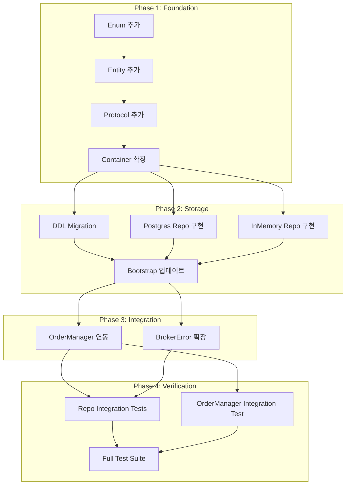

# Milestone 4 — Safe Order Path Persistence Gap Closure

> **목표**: 문서-코드 정합성 점검에서 식별된 Gap 중 **Safe Order Path와 Runtime Safety에 직접 연결되는 항목**부터 우선 해결한다.  
> **범위**: order_state_event append-only 저장, guardrail_evaluation 저장, risk_limit_snapshot 저장, AmbiguousOrderStateError 및 unknown-state 대응 기반 추가  
> **제외**: Config 전체 스키마, TradeDecisionEntity 전체 확장, SubmitOrderRequest/Result 확장, BrokerAdapter 확장, KIS adapter 실제 구현  
> **기준 문서**: [`03_data_model_erd.md`](../plan_docs/detailed_design/03_data_model_erd.md), [`02_order_execution_sequence.md`](../plan_docs/detailed_design/02_order_execution_sequence.md), [`04_broker_adapter_interface.md`](../plan_docs/detailed_design/04_broker_adapter_interface.md), [`07_mvp_scope_and_delivery_plan.md`](../plan_docs/detailed_design/07_mvp_scope_and_delivery_plan.md)

---

## 1. 현재 상태 요약

### 1.1 이미 구현된 Safe Order Path 인프라

| 항목 | 상태 | 파일 |
|------|------|------|
| `OrderRepository` Protocol + Postgres + InMemory | ✅ | [`contracts.py`](../src/agent_trading/repositories/contracts.py:131), [`postgres/orders.py`](../src/agent_trading/repositories/postgres/orders.py), [`memory.py`](../src/agent_trading/repositories/memory.py:201) |
| `OrderManager.transition_to()` with optimistic locking + retry | ✅ | [`order_manager.py`](../src/agent_trading/services/order_manager.py:255) |
| `AuditLogRepository` + Postgres + InMemory | ✅ | [`contracts.py`](../src/agent_trading/repositories/contracts.py:204), [`postgres/audit_logs.py`](../src/agent_trading/repositories/postgres/audit_logs.py) |
| `VersionConflictError` | ✅ | [`postgres/orders.py`](../src/agent_trading/repositories/postgres/orders.py:174) |
| `BrokerError` 기본 계층 (9개 타입) | ✅ | [`errors.py`](../src/agent_trading/brokers/errors.py) |
| `BrokerAdapter` Protocol (12개 메서드) | ✅ | [`base.py`](../src/agent_trading/brokers/base.py) |

### 1.2 이번 Milestone에서 해결할 Gap

| # | Gap | 문서 출처 | 현재 상태 | 우선순위 |
|---|-----|-----------|-----------|----------|
| G1 | `order_state_events` DDL + Entity + Repository + OrderManager 연동 | `03:271`, `07:116` | ❌ 미구현 | P0 |
| G2 | `guardrail_evaluations` DDL + Entity + Repository | `03:258`, `07:116` | ❌ 미구현 | P0 |
| G3 | `risk_limit_snapshots` DDL + Entity + Repository | `03:237` | ❌ 미구현 | P0 |
| G4 | `AmbiguousOrderStateError` + `BrokerError` 필드 확장 | `04:155` | ❌ 미구현 | P0 |
| G5 | `EventSource` Enum 추가 | `03:370` | ❌ 미구현 | P1 |
| G6 | `GuardrailAction` Enum 추가 | `03:370` | ❌ 미구현 | P1 |
| G7 | `ReconciliationStatus` Enum 추가 | `03:370` | ❌ 미구현 | P1 |

---

## 2. 상세 설계

### 2.1 DDL — Migration `0003_add_safe_order_path_tables.sql`

#### 2.1.1 `order_state_events` 테이블

문서 [`03_data_model_erd.md:271`](../plan_docs/detailed_design/03_data_model_erd.md:271) 기준.

```sql
CREATE TABLE IF NOT EXISTS trading.order_state_events (
    order_state_event_id UUID PRIMARY KEY DEFAULT gen_random_uuid(),
    order_request_id UUID NOT NULL REFERENCES trading.order_requests (order_request_id),
    previous_status VARCHAR(32),
    new_status VARCHAR(32) NOT NULL,
    event_source VARCHAR(32) NOT NULL,
    event_timestamp TIMESTAMPTZ NOT NULL,
    ingested_at TIMESTAMPTZ NOT NULL DEFAULT NOW(),
    reason_code VARCHAR(128),
    raw_event_uri TEXT,
    correlation_id VARCHAR(128),
    created_at TIMESTAMPTZ NOT NULL DEFAULT NOW()
);

CREATE INDEX IF NOT EXISTS idx_order_state_events_order_request_id
    ON trading.order_state_events (order_request_id);
CREATE INDEX IF NOT EXISTS idx_order_state_events_ingested_at
    ON trading.order_state_events (ingested_at);
```

**설계 결정**:
- `previous_status`는 `NULL` 허용 (최초 DRAFT 상태는 이전 상태 없음)
- `event_source`는 `VARCHAR(32)` — `EventSource` Enum 값 저장
- `ingested_at`은 시스템 수신 시점, `event_timestamp`는 실제 이벤트 발생 시점
- Append-only: `UPDATE`/`DELETE` 금지 (애플리케이션 레벨에서 보장)

#### 2.1.2 `guardrail_evaluations` 테이블

문서 [`03_data_model_erd.md:258`](../plan_docs/detailed_design/03_data_model_erd.md:258) 기준.

```sql
CREATE TABLE IF NOT EXISTS trading.guardrail_evaluations (
    guardrail_evaluation_id UUID PRIMARY KEY DEFAULT gen_random_uuid(),
    decision_context_id UUID REFERENCES trading.decision_contexts (decision_context_id),
    trade_decision_id UUID REFERENCES trading.trade_decisions (trade_decision_id),
    order_request_id UUID REFERENCES trading.order_requests (order_request_id),
    rule_set_version VARCHAR(64) NOT NULL,
    overall_passed BOOLEAN NOT NULL,
    evaluated_at TIMESTAMPTZ NOT NULL,
    rule_results JSONB NOT NULL DEFAULT '{}'::jsonb,
    blocking_rule_codes TEXT[],
    warning_rule_codes TEXT[],
    created_at TIMESTAMPTZ NOT NULL DEFAULT NOW()
);

CREATE INDEX IF NOT EXISTS idx_guardrail_evaluations_decision_context
    ON trading.guardrail_evaluations (decision_context_id);
CREATE INDEX IF NOT EXISTS idx_guardrail_evaluations_order_request
    ON trading.guardrail_evaluations (order_request_id);
```

**설계 결정**:
- 3개 FK 모두 `NULL` 허용 — guardrail은 decision 단계, order 단계 모두에서 평가 가능
- `rule_results`는 `JSONB` — 각 룰별 평가 결과를 구조화하여 저장
- `blocking_rule_codes` / `warning_rule_codes`는 PostgreSQL `TEXT[]` 배열 사용

#### 2.1.3 `risk_limit_snapshots` 테이블

문서 [`03_data_model_erd.md:237`](../plan_docs/detailed_design/03_data_model_erd.md:237) 기준.

```sql
CREATE TABLE IF NOT EXISTS trading.risk_limit_snapshots (
    risk_limit_snapshot_id UUID PRIMARY KEY DEFAULT gen_random_uuid(),
    account_id UUID NOT NULL REFERENCES trading.accounts (account_id),
    snapshot_at TIMESTAMPTZ NOT NULL,
    nav NUMERIC(24, 8),
    cash_available NUMERIC(24, 8),
    gross_exposure_pct NUMERIC(10, 4),
    net_exposure_pct NUMERIC(10, 4),
    daily_realized_pnl NUMERIC(20, 8),
    daily_unrealized_pnl NUMERIC(20, 8),
    daily_loss_used_pct NUMERIC(10, 4),
    max_daily_loss_limit_pct NUMERIC(10, 4),
    symbol_exposure_json JSONB DEFAULT '{}'::jsonb,
    sector_exposure_json JSONB DEFAULT '{}'::jsonb,
    open_order_exposure_json JSONB DEFAULT '{}'::jsonb,
    drawdown_state VARCHAR(32),
    kill_switch_active BOOLEAN NOT NULL DEFAULT FALSE,
    blocked_reason_codes TEXT[],
    created_at TIMESTAMPTZ NOT NULL DEFAULT NOW()
);

CREATE INDEX IF NOT EXISTS idx_risk_limit_snapshots_account
    ON trading.risk_limit_snapshots (account_id, snapshot_at DESC);
```

**설계 결정**:
- `account_id` 기준 최신 스냅샷 조회가 주 사용 패턴 → 복합 인덱스 `(account_id, snapshot_at DESC)`
- `kill_switch_active`는 hard guardrail의 즉시 확인 대상
- `symbol_exposure_json` / `sector_exposure_json` / `open_order_exposure_json`은 구조가 가변적이므로 `JSONB`

---

### 2.2 Enum 추가

#### 2.2.1 `EventSource`

```python
class EventSource(str, Enum):
    INTERNAL = "internal"
    BROKER_REST = "broker_rest"
    BROKER_WS = "broker_ws"
    RECONCILIATION = "reconciliation"
    OPERATOR = "operator"
```

#### 2.2.2 `GuardrailAction`

```python
class GuardrailAction(str, Enum):
    BLOCK = "block"
    WARN = "warn"
    ALLOW = "allow"
    ESCALATE = "escalate"
```

#### 2.2.3 `ReconciliationStatus`

```python
class ReconciliationStatus(str, Enum):
    PENDING = "pending"
    IN_PROGRESS = "in_progress"
    RESOLVED = "resolved"
    ESCALATED = "escalated"
```

---

### 2.3 Entity 추가

#### 2.3.1 `OrderStateEventEntity`

```python
@dataclass(slots=True, frozen=True)
class OrderStateEventEntity:
    order_state_event_id: UUID
    order_request_id: UUID
    new_status: OrderStatus
    event_source: EventSource
    event_timestamp: datetime
    ingested_at: datetime
    previous_status: OrderStatus | None = None
    reason_code: str | None = None
    raw_event_uri: str | None = None
    correlation_id: str | None = None
    created_at: datetime | None = None
```

#### 2.3.2 `GuardrailEvaluationEntity`

```python
@dataclass(slots=True, frozen=True)
class GuardrailEvaluationEntity:
    guardrail_evaluation_id: UUID
    rule_set_version: str
    overall_passed: bool
    evaluated_at: datetime
    decision_context_id: UUID | None = None
    trade_decision_id: UUID | None = None
    order_request_id: UUID | None = None
    rule_results: dict[str, object] = field(default_factory=dict)
    blocking_rule_codes: list[str] | None = None
    warning_rule_codes: list[str] | None = None
    created_at: datetime | None = None
```

#### 2.3.3 `RiskLimitSnapshotEntity`

```python
@dataclass(slots=True, frozen=True)
class RiskLimitSnapshotEntity:
    risk_limit_snapshot_id: UUID
    account_id: UUID
    snapshot_at: datetime
    nav: Decimal | None = None
    cash_available: Decimal | None = None
    gross_exposure_pct: Decimal | None = None
    net_exposure_pct: Decimal | None = None
    daily_realized_pnl: Decimal | None = None
    daily_unrealized_pnl: Decimal | None = None
    daily_loss_used_pct: Decimal | None = None
    max_daily_loss_limit_pct: Decimal | None = None
    symbol_exposure_json: dict[str, object] = field(default_factory=dict)
    sector_exposure_json: dict[str, object] = field(default_factory=dict)
    open_order_exposure_json: dict[str, object] = field(default_factory=dict)
    drawdown_state: str | None = None
    kill_switch_active: bool = False
    blocked_reason_codes: list[str] | None = None
    created_at: datetime | None = None
```

---

### 2.4 Repository Protocol 추가

#### 2.4.1 `OrderStateEventRepository`

```python
class OrderStateEventRepository(Protocol):
    async def add(self, event: OrderStateEventEntity) -> OrderStateEventEntity:
        ...

    async def list_by_order_request(
        self, order_request_id: UUID
    ) -> Sequence[OrderStateEventEntity]:
        ...

    async def list_recent(
        self, limit: int = 100
    ) -> Sequence[OrderStateEventEntity]:
        ...
```

#### 2.4.2 `GuardrailEvaluationRepository`

```python
class GuardrailEvaluationRepository(Protocol):
    async def add(self, evaluation: GuardrailEvaluationEntity) -> GuardrailEvaluationEntity:
        ...

    async def get_by_decision_context(
        self, decision_context_id: UUID
    ) -> Sequence[GuardrailEvaluationEntity]:
        ...

    async def get_by_order_request(
        self, order_request_id: UUID
    ) -> Sequence[GuardrailEvaluationEntity]:
        ...
```

#### 2.4.3 `RiskLimitSnapshotRepository`

```python
class RiskLimitSnapshotRepository(Protocol):
    async def add(self, snapshot: RiskLimitSnapshotEntity) -> RiskLimitSnapshotEntity:
        ...

    async def get_latest_by_account(
        self, account_id: UUID
    ) -> RiskLimitSnapshotEntity | None:
        ...

    async def list_by_account(
        self, account_id: UUID, limit: int = 20
    ) -> Sequence[RiskLimitSnapshotEntity]:
        ...
```

---

### 2.5 `RepositoryContainer` 확장

```python
@dataclass(slots=True, frozen=True)
class RepositoryContainer:
    clients: ClientRepository
    broker_accounts: BrokerAccountRepository
    accounts: AccountRepository
    strategies: StrategyRepository
    instruments: InstrumentRepository
    decision_contexts: DecisionContextRepository
    position_snapshots: PositionSnapshotRepository
    cash_balance_snapshots: CashBalanceSnapshotRepository
    trade_decisions: TradeDecisionRepository
    orders: OrderRepository
    broker_orders: BrokerOrderRepository
    fill_events: FillEventRepository
    reconciliation: ReconciliationRepository
    audit_logs: AuditLogRepository
    # --- Milestone 4 additions ---
    order_state_events: OrderStateEventRepository
    guardrail_evaluations: GuardrailEvaluationRepository
    risk_limit_snapshots: RiskLimitSnapshotRepository
```

---

### 2.6 `OrderManager.transition_to()` — `order_state_event` 연동

현재 `transition_to()`는 audit log만 기록하고 있다. 여기에 `order_state_event` append-only 기록을 추가한다.

**변경 위치**: [`order_manager.py:346`](../src/agent_trading/services/order_manager.py:346)

```python
# After successful update_status and before/after audit log:
async def transition_to(self, ...) -> OrderRequestEntity:
    _validate_transition(...)
    before = order
    after = _replace_status(...)

    # Retry loop (unchanged) ...
    # ... (existing retry logic) ...

    # --- New: record order_state_event (append-only) ---
    await self._record_order_state_event(before, after)

    # --- Existing: record audit log ---
    await self._record_status_change(before, after, actor_type, actor_id)
    return after

async def _record_order_state_event(
    self,
    before: OrderRequestEntity,
    after: OrderRequestEntity,
) -> None:
    event = OrderStateEventEntity(
        order_state_event_id=uuid4(),
        order_request_id=after.order_request_id,
        previous_status=before.status,
        new_status=after.status,
        event_source=EventSource.INTERNAL,
        event_timestamp=datetime.now(timezone.utc),
        ingested_at=datetime.now(timezone.utc),
        reason_code=after.status_reason_code,
        correlation_id=after.correlation_id,
    )
    await self.repos.order_state_events.add(event)
```

**중요 설계 결정**:
- `order_state_event` 기록은 **audit log와 별개**로 append-only 저장
- `event_source`는 `EventSource.INTERNAL`로 설정 (broker webhook/reconciliation에서 오는 이벤트는 별도 경로)
- `_record_order_state_event`는 retry loop **밖**에서 실행 (audit log와 동일한 패턴)
- `VersionConflictError` 발생 시 `before`는 재조회 전의 상태를 유지하므로, `_record_order_state_event`는 `after` 기준으로 기록

---

### 2.7 `BrokerError` 계층 확장 — `AmbiguousOrderStateError`

문서 [`04_broker_adapter_interface.md:155`](../plan_docs/detailed_design/04_broker_adapter_interface.md:155) 기준.

#### 2.7.1 새로운 오류 타입

```python
class AmbiguousOrderStateError(BrokerError):
    """Broker returned an order status that cannot be mapped to a known OrderStatus.

    This is a **recoverable** error that triggers reconciliation.
    New orders for the same account/symbol/strategy/side must be blocked
    until reconciliation completes.
    """
    pass
```

#### 2.7.2 `BrokerError` 필드 확장

```python
@dataclass(slots=True)
class BrokerError(Exception):
    broker_name: BrokerName
    error_type: BrokerErrorType
    retryable: bool
    correlation_id: str | None = None
    raw_code: str | None = None
    raw_message: str | None = None
    # --- New fields ---
    retry_after_seconds: float | None = None
    requires_reconciliation: bool = False
    safe_to_retry: bool = True
    blocks_new_orders: bool = False
```

**필드 설명**:
- `retry_after_seconds`: Rate limit 등에서 재시도까지 대기해야 하는 시간
- `requires_reconciliation`: 이 오류 발생 시 reconciliation이 필요함을 표시
- `safe_to_retry`: 재시도가 안전한지 여부 (예: `AmbiguousOrderStateError`는 `safe_to_retry=False`)
- `blocks_new_orders`: 이 오류로 인해 동일 account/symbol/strategy/side 신규 주문 차단 필요

---

### 2.8 Unknown-State 대응 기반

`AmbiguousOrderStateError`가 발생했을 때의 대응 흐름:

```
BrokerAdapter.submit_order()
    → AmbiguousOrderStateError 발생
    → BrokerRouter:
        1. error.requires_reconciliation = True 확인
        2. error.blocks_new_orders = True 확인
        3. OrderManager.transition_to(RECONCILE_REQUIRED) 호출
        4. Reconciliation Service에 reconciliation 요청
        5. Lock 등록 (account + symbol + strategy + side)
```

**이번 Milestone에서 구현 범위**:
1. `AmbiguousOrderStateError` 클래스 추가 ✅
2. `BrokerError` 필드 확장 (`requires_reconciliation`, `blocks_new_orders` 등) ✅
3. `RECONCILE_REQUIRED` 상태는 이미 존재 ✅
4. Lock 메커니즘은 **이번 범위에서 제외** (다음 마일스톤)

---

## 3. 구현 단계

### Step 1: Enum + Entity 추가

**파일**: [`enums.py`](../src/agent_trading/domain/enums.py), [`entities.py`](../src/agent_trading/domain/entities.py)

1. `EventSource` Enum 추가
2. `GuardrailAction` Enum 추가
3. `ReconciliationStatus` Enum 추가
4. `OrderStateEventEntity` 추가
5. `GuardrailEvaluationEntity` 추가
6. `RiskLimitSnapshotEntity` 추가

### Step 2: Repository Protocol 추가

**파일**: [`contracts.py`](../src/agent_trading/repositories/contracts.py)

1. `OrderStateEventRepository` Protocol 추가
2. `GuardrailEvaluationRepository` Protocol 추가
3. `RiskLimitSnapshotRepository` Protocol 추가
4. `contracts.py` import 업데이트

### Step 3: `RepositoryContainer` 확장

**파일**: [`container.py`](../src/agent_trading/repositories/container.py)

1. 3개 신규 Repository import
2. `order_state_events`, `guardrail_evaluations`, `risk_limit_snapshots` 필드 추가

### Step 4: Postgres Repository 구현

**파일**: 
- [`postgres/order_state_events.py`](../src/agent_trading/repositories/postgres/order_state_events.py) (신규)
- [`postgres/guardrail_evaluations.py`](../src/agent_trading/repositories/postgres/guardrail_evaluations.py) (신규)
- [`postgres/risk_limit_snapshots.py`](../src/agent_trading/repositories/postgres/risk_limit_snapshots.py) (신규)

각각 `row_to_entity()` 기반 매핑, `entity_to_insert_kwargs()` 사용.

### Step 5: InMemory Repository 구현

**파일**: [`memory.py`](../src/agent_trading/repositories/memory.py)

1. `InMemoryOrderStateEventRepository` 추가
2. `InMemoryGuardrailEvaluationRepository` 추가
3. `InMemoryRiskLimitSnapshotRepository` 추가

### Step 6: Bootstrap 업데이트

**파일**: 
- [`postgres/bootstrap.py`](../src/agent_trading/repositories/postgres/bootstrap.py)
- [`bootstrap.py`](../src/agent_trading/repositories/bootstrap.py)

두 bootstrap 함수에 신규 3개 repository 연결.

### Step 7: DDL Migration 추가

**파일**: [`db/migrations/0003_add_safe_order_path_tables.sql`](../db/migrations/0003_add_safe_order_path_tables.sql) (신규)

3개 테이블 DDL + 인덱스.

### Step 8: `OrderManager` — `order_state_event` 연동

**파일**: [`order_manager.py`](../src/agent_trading/services/order_manager.py)

1. `OrderStateEventEntity`, `EventSource` import
2. `_record_order_state_event()` 메서드 추가
3. `transition_to()`에서 `_record_order_state_event()` 호출

### Step 9: `BrokerError` 계층 확장

**파일**: [`errors.py`](../src/agent_trading/brokers/errors.py)

1. `BrokerError`에 `retry_after_seconds`, `requires_reconciliation`, `safe_to_retry`, `blocks_new_orders` 필드 추가
2. `AmbiguousOrderStateError` 클래스 추가

### Step 10: 통합 테스트

**파일**:
- [`tests/repositories/test_postgres_order_state_events.py`](../tests/repositories/test_postgres_order_state_events.py) (신규)
- [`tests/repositories/test_postgres_guardrail_evaluations.py`](../tests/repositories/test_postgres_guardrail_evaluations.py) (신규)
- [`tests/repositories/test_postgres_risk_limit_snapshots.py`](../tests/repositories/test_postgres_risk_limit_snapshots.py) (신규)
- [`tests/services/test_order_state_event_integration.py`](../tests/services/test_order_state_event_integration.py) (신규)

---

## 4. 변경 파일 요약

### 신규 생성 (7개)

| # | 파일 | 설명 |
|---|------|------|
| 1 | `db/migrations/0003_add_safe_order_path_tables.sql` | 3개 테이블 DDL |
| 2 | `src/agent_trading/repositories/postgres/order_state_events.py` | PostgresOrderStateEventRepository |
| 3 | `src/agent_trading/repositories/postgres/guardrail_evaluations.py` | PostgresGuardrailEvaluationRepository |
| 4 | `src/agent_trading/repositories/postgres/risk_limit_snapshots.py` | PostgresRiskLimitSnapshotRepository |
| 5 | `tests/repositories/test_postgres_order_state_events.py` | Integration test |
| 6 | `tests/repositories/test_postgres_guardrail_evaluations.py` | Integration test |
| 7 | `tests/repositories/test_postgres_risk_limit_snapshots.py` | Integration test |
| 8 | `tests/services/test_order_state_event_integration.py` | OrderManager 연동 테스트 |

### 수정 (9개)

| # | 파일 | 변경 내용 |
|---|------|-----------|
| 1 | `src/agent_trading/domain/enums.py` | `EventSource`, `GuardrailAction`, `ReconciliationStatus` 추가 |
| 2 | `src/agent_trading/domain/entities.py` | `OrderStateEventEntity`, `GuardrailEvaluationEntity`, `RiskLimitSnapshotEntity` 추가 |
| 3 | `src/agent_trading/repositories/contracts.py` | 3개 Repository Protocol 추가, import 업데이트 |
| 4 | `src/agent_trading/repositories/container.py` | 3개 필드 추가 |
| 5 | `src/agent_trading/repositories/memory.py` | 3개 InMemory Repository 추가 |
| 6 | `src/agent_trading/repositories/postgres/bootstrap.py` | 3개 Postgres Repository 연결 |
| 7 | `src/agent_trading/repositories/bootstrap.py` | 3개 InMemory Repository 연결 |
| 8 | `src/agent_trading/services/order_manager.py` | `_record_order_state_event()` 추가, `transition_to()` 연동 |
| 9 | `src/agent_trading/brokers/errors.py` | `AmbiguousOrderStateError` 추가, `BrokerError` 필드 확장 |

---

## 5. 테스트 계획

### 5.1 Repository Contract Tests

각 Postgres repository에 대해 최소 4개 테스트:

| 테스트 | 설명 |
|--------|------|
| `test_add_and_get` | 저장 후 조회 |
| `test_add_and_list` | 저장 후 목록 조회 |
| `test_get_nonexistent` | 존재하지 않는 ID 조회 → None |
| `test_add_multiple` | 다중 저장 후 정렬/필터 확인 |

### 5.2 OrderManager Integration Test

| 테스트 | 설명 |
|--------|------|
| `test_transition_to_creates_order_state_event` | `transition_to()` 호출 시 `order_state_event`가 생성되는지 확인 |
| `test_order_state_event_has_correct_source` | `event_source`가 `INTERNAL`로 설정되는지 확인 |
| `test_order_state_event_previous_status` | 이전 상태가 올바르게 기록되는지 확인 |

### 5.3 BrokerError Test

| 테스트 | 설명 |
|--------|------|
| `test_ambiguous_order_state_error_fields` | `requires_reconciliation=True`, `blocks_new_orders=True` 확인 |
| `test_broker_error_new_fields_defaults` | 기존 오류 타입에서 새 필드 기본값 확인 |

---

## 6. 완료 기준 (Exit Criteria)

1. ✅ `order_state_events` 테이블 DDL 적용 및 마이그레이션 성공
2. ✅ `guardrail_evaluations` 테이블 DDL 적용 및 마이그레이션 성공
3. ✅ `risk_limit_snapshots` 테이블 DDL 적용 및 마이그레이션 성공
4. ✅ 3개 Entity 정상 동작 (frozen dataclass, slots)
5. ✅ 3개 Enum 정상 동작
6. ✅ 3개 Repository Protocol 정의 완료
7. ✅ `RepositoryContainer`에 3개 필드 포함
8. ✅ PostgresRepository 3개 구현 완료 (CRUD)
9. ✅ InMemoryRepository 3개 구현 완료
10. ✅ Bootstrap 2개 모두 업데이트 완료
11. ✅ `OrderManager.transition_to()`가 `order_state_event`를 append-only로 기록
12. ✅ `AmbiguousOrderStateError` 추가 및 `BrokerError` 필드 확장
13. ✅ 전체 테스트 통과 (≥80 passed)

---

## 7. 제외 사항 (다음 마일스톤)

| 항목 | 이유 |
|------|------|
| `decision_state_events` 테이블 | Decision state machine 아직 미구현 |
| `broker_api_call_logs` 테이블 | Broker Router 아직 미구현 |
| `market_data_quality_events` 테이블 | Data Quality Service 아직 미구현 |
| Config 전체 스키마 | 별도 마일스톤 필요 |
| `TradeDecisionEntity` 전체 확장 | AI Decision Layer 이후 |
| `SubmitOrderRequest`/`Result` 확장 | Broker Adapter 확장과 함께 |
| `BrokerAdapter` Protocol 메서드 추가 | Broker Router 구현과 함께 |
| KIS Adapter 실제 구현 | 별도 마일스톤 필요 |
| Unknown state blocking lock 메커니즘 | Reconciliation Service 구현과 함께 |
| Step 0 Simulation Harness | Broker Adapter 구현 이후 |

---

## 8. Mermaid: 작업 의존성 그래프



---

## 9. 추정工时

| 단계 | 작업 | 예상 시간 |
|------|------|-----------|
| 1 | Enum + Entity 추가 | 15분 |
| 2 | Repository Protocol + Container | 15분 |
| 3 | DDL Migration | 10분 |
| 4 | Postgres Repository 3개 | 45분 |
| 5 | InMemory Repository 3개 | 20분 |
| 6 | Bootstrap 업데이트 | 10분 |
| 7 | OrderManager 연동 | 20분 |
| 8 | BrokerError 확장 | 10분 |
| 9 | 통합 테스트 4개 | 40분 |
| 10 | 전체 테스트 실행 및 검증 | 5분 |
| **합계** | | **~3시간** |
