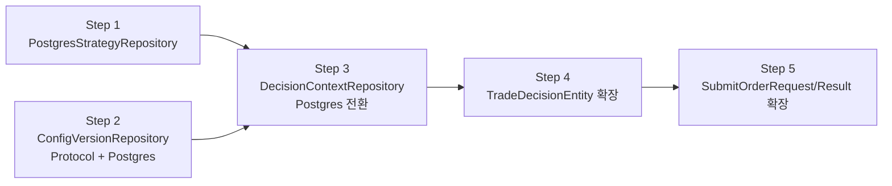

# Milestone 5 — Decision Persistence Alignment

## 0. Milestone 4 사후 정리: 3가지 설계 정책

### 0.1 guardrail_evaluations FK 사용 규칙

**DDL** ([`0003_add_safe_order_path_tables.sql`](db/migrations/0003_add_safe_order_path_tables.sql:50)):

```sql
decision_context_id UUID REFERENCES trading.decision_contexts (decision_context_id),
trade_decision_id   UUID REFERENCES trading.trade_decisions (trade_decision_id),
order_request_id    UUID REFERENCES trading.order_requests (order_request_id),
```

**규칙:**

| FK | Nullable | 사용 시점 | 예시 |
|---|---|---|---|
| `decision_context_id` | ✅ NULL 허용 | 의사결정 단계에서 평가된 guardrail | AI 판단 전 Hard Risk Limit 검증 |
| `trade_decision_id` | ✅ NULL 허용 | 특정 trade decision 대상 평가 | `trade_decision`별 risk check 결과 |
| `order_request_id` | ✅ NULL 허용 | 주문 제출 단계에서 평가된 guardrail | submit 직전 최종 검증 |

- **3개 FK 모두 nullable** — guardrail은 decision time, order time, 또는 둘 다 평가될 수 있으므로, 평가 맥락에 따라 다른 FK를 채운다.
- **최소 하나의 FK는 NOT NULL이어야 한다** — 어느 맥락에서 평가된 것인지 식별 가능해야 한다.
- `trade_decision_id`와 `order_request_id`는 상호 배타적이지 않다 — 동일한 guardrail 평가가 두 맥락 모두에 속할 수 있다.

### 0.2 order_state_events 조회 시 기본 정렬 기준

**원칙: `ingested_at DESC` (최신순)**

| 메서드 | 정렬 기준 | 근거 |
|---|---|---|
| `list_recent(limit)` | `ingested_at DESC` | 최근 발생한 상태 변화가 가장 중요 |
| `list_by_order_request(id)` | `ingested_at ASC` (시간순) | 단일 주문의 전체 상태 전이 이력을 시간순 재현 |

- `ingested_at`은 이벤트가 시스템에 **기록된 시점**으로, `event_timestamp`(실제 상태 전이 발생 시점)과 다를 수 있다.
- 조회 기본값은 `ingested_at` 기준으로 통일하되, 필요 시 `event_timestamp` 기준 정렬로 재조회 가능해야 한다.

### 0.3 risk_limit_snapshots 생성 시점 정책

`risk_limit_snapshots`는 특정 시점의 리스크 상태를 **재현 가능한 형태**로 저장하는 것이 목적이다.

| 생성 트리거 | 설명 | 우선순위 |
|---|---|---|
| **정기 스냅샷** | 일정 주기(예: 5분)로 자동 생성 | v1 필수 |
| **주문 전 스냅샷** | `OrderManager.create_order()` 직전 생성 | v1 필수 |
| **주문 후 스냅샷** | 상태 전이(`transition_to()`) 성공 후 생성 | v1 권장 |
| **Kill-switch 활성화** | Hard guardrail kill-switch가 활성화된 시점 | v1 권장 |
| **수동 트리거** | 운영자 명령으로 수동 생성 | v2 이후 |

- 동일 계정/시점에 여러 스냅샷이 존재할 수 있다 (`UNIQUE(account_id, snapshot_at)` 제약 없음).
- 최신 스냅샷은 `get_latest_by_account()`로 조회하며, 정렬 기준은 `snapshot_at DESC`이다.

---

## 1. 목적

Postgres 저장 계층에서 아직 **InMemory fallback** 상태인 Repository 3개를 Postgres 구현으로 전환하고, 동시에 **TradeDecisionEntity**와 **SubmitOrderRequest / SubmitOrderResult**를 상세 설계 문서(`03_data_model_erd.md`, `04_broker_adapter_interface.md`)에 맞게 확장한다.

이 마일스톤은 "Decision Persistence Alignment" — **의사결정 저장 계층의 문서-코드 정합성 확보** — 에 초점을 맞춘다.

### 1.1 추가 조건 (사용자 승인)

1. **TradeDecisionEntity P0/P1 우선순위 구분** — 필수 필드(P0)와 확장 필드(P1)를 명확히 구분하여 단계적 확장 가능
2. **ConfigVersionRepository / DecisionContextRepository는 replay 기준 저장소로 구현** — DecisionContext는 replay bundle 식별/복원의 핵심 단위
3. **SubmitOrderRequest/Result 확장 시 OrderManager + BrokerAdapter 경로 함께 점검** — 두 계층 간 필드 전달 경로 확인
4. **Migration은 backward-compatible하게 적용** — 기존 데이터 무결성 유지, ALTER TABLE ADD COLUMN with DEFAULT / nullable

## 2. 작업 항목 (실행 순서)

### Step 1: PostgresStrategyRepository

**현황:** `strategies=InMemoryStrategyRepository()` fallback

**할 일:**
1. [`postgres/strategies.py`](src/agent_trading/repositories/postgres/) 신규 생성
   - `PostgresStrategyRepository` 클래스
   - `add()` — INSERT ... RETURNING *
   - `get()` — SELECT by PK
   - `get_by_code()` — SELECT by `(client_id, strategy_code)`
2. [`postgres/bootstrap.py`](src/agent_trading/repositories/postgres/bootstrap.py:70) 변경 — `strategies=PostgresStrategyRepository(tx)`
3. 통합 테스트 [`test_postgres_strategies.py`] 신규 생성 (4 tests: add/get, get_by_code, get_nonexistent, get_by_code_nonexistent)
4. 전체 테스트 실행

**참고:** `StrategyEntity`는 현재 문서와 코드가 일치하므로 Entity 변경 불필요.

### Step 2: ConfigVersionRepository

**현황:** `ConfigVersionEntity`는 존재하지만, Repository Protocol 자체가 없음. `RepositoryContainer`에도 `config_versions` 필드 없음.

**할 일:**
1. [`contracts.py`](src/agent_trading/repositories/contracts.py) — `ConfigVersionRepository` Protocol 추가
   - `async def add(config_version: ConfigVersionEntity) -> ConfigVersionEntity`
   - `async def get(config_version_id: UUID) -> ConfigVersionEntity | None`
   - `async def get_active(client_id: UUID, environment: Environment) -> ConfigVersionEntity | None`
2. [`container.py`](src/agent_trading/repositories/container.py:28) — `config_versions: ConfigVersionRepository` 필드 추가
3. [`postgres/config_versions.py`] 신규 생성
   - `PostgresConfigVersionRepository`
   - `add()` — INSERT ... RETURNING *
   - `get()` — SELECT by PK
   - `get_active()` — `WHERE client_id=$1 AND environment=$2 ORDER BY activated_at DESC NULLS LAST LIMIT 1`
4. [`postgres/bootstrap.py`](src/agent_trading/repositories/postgres/bootstrap.py:66) — `config_versions=PostgresConfigVersionRepository(tx)` 추가
5. [`memory.py`](src/agent_trading/repositories/memory.py) — `InMemoryConfigVersionRepository` 추가
6. [`bootstrap.py`](src/agent_trading/repositories/bootstrap.py:26) — `config_versions=InMemoryConfigVersionRepository()` 추가
7. 통합 테스트 [`test_postgres_config_versions.py`] 신규 생성

**재현성 설계:** ConfigVersion은 특정 시점의 설정 상태를 freeze한 record로, replay 시점에 `get_active(client_id, environment)`로 해당 시점의 활성 설정을 복원한다. `activated_at` timestamp로 버전 관리.

### Step 3: DecisionContextRepository (Postgres 전환)

**현황:** `decision_contexts=InMemoryDecisionContextRepository()` fallback. Protocol과 Entity는 이미 존재.

**할 일:**
1. [`postgres/decision_contexts.py`] 신규 생성
   - `PostgresDecisionContextRepository`
   - `add()` — INSERT ... RETURNING *
   - `get()` — SELECT by PK
   - `get_by_correlation_id()` — SELECT by `correlation_id`
   - `list()` — `DecisionContextQuery` 조건에 따른 동적 WHERE + ORDER BY `market_timestamp DESC` + LIMIT
2. [`postgres/bootstrap.py`](src/agent_trading/repositories/postgres/bootstrap.py:72) 변경 — `decision_contexts=PostgresDecisionContextRepository(tx)`
3. 통합 테스트 [`test_postgres_decision_contexts.py`] 신규 생성

**재현성 설계:** DecisionContext는 replay의 기본 단위. `correlation_id`로 의사결정 단위를 추적하고, `market_timestamp`로 시점 복원이 가능해야 함. `list()`는 특정 계정/전략/시간 범위의 decision context를 조회하여 replay 범위를 결정.

**DDL 의존성:** `decision_contexts` 테이블은 `strategy_id` FK와 `config_version_id` FK를 참조하므로, Step 1(PostgresStrategyRepository)과 Step 2(ConfigVersionRepository)가 선행되어야 함.

### Step 4: TradeDecisionEntity 문서 정합성 확장

**현황:** 현재 [`TradeDecisionEntity`](src/agent_trading/domain/entities.py:173)는 10개 필드. 문서([`03_data_model_erd.md`](plan_docs/detailed_design/03_data_model_erd.md:135))는 ~25개 필드 명세.

**P0/P1 우선순위 구분:**

| 우선순위 | 필드 | 타입 | 기본값 | 비고 |
|---|---|---|---|---|
| **P0** | `decision_type` | `DecisionType` (enum) | 필수 | `APPROVE`, `REJECT`, `HOLD`, `WATCH`, `EXIT`, `REDUCE` |
| **P0** | `side` | `OrderSide` | 필수 | 의사결정 방향 |
| **P0** | `strategy_id` | `UUID` | 필수 | 전략 참조 |
| **P0** | `symbol` | `str` | 필수 | 종목 코드 |
| **P0** | `market` | `str` | 필수 | 시장 코드 |
| **P0** | `entry_style` | `EntryStyle` (enum) | 필수 | `LIMIT`, `MARKET`, `VWAP`, `TWAP`, `NO_ORDER` |
| **P0** | `entry_price` | `Decimal \| None` | `None` | 진입 가격 |
| **P0** | `quantity` | `Decimal \| None` | `None` | 수량 |
| **P0** | `max_order_value` | `Decimal \| None` | `None` | 최대 주문 금액 |
| **P0** | `price_band_lower` | `Decimal \| None` | `None` | 가격 하한 |
| **P0** | `price_band_upper` | `Decimal \| None` | `None` | 가격 상한 |
| **P1** | `expected_return_bps` | `Decimal \| None` | `None` | 기대 수익률(bps) |
| **P1** | `expected_downside_bps` | `Decimal \| None` | `None` | 기대 하방(bps) |
| **P1** | `net_expected_value_bps` | `Decimal \| None` | `None` | 순 기대값(bps) |
| **P1** | `final_trade_score` | `Decimal \| None` | `None` | 최종 트레이드 점수 |
| **P1** | `minimum_required_edge_bps` | `Decimal \| None` | `None` | 최소 요구 에지(bps) |
| **P1** | `regime_label` | `str \| None` | `None` | 레짐 레이블 |
| **P1** | `strategy_fit_score` | `Decimal \| None` | `None` | 전략 적합도 점수 |
| **P1** | `risk_check_passed` | `bool \| None` | `None` | 리스크 검증 통과 여부 |
| **P1** | `compliance_check_passed` | `bool \| None` | `None` | 컴플라이언스 검증 통과 여부 |
| **P1** | `execution_check_passed` | `bool \| None` | `None` | 실행 검증 통과 여부 |
| **P1** | `failed_rule_codes` | `list[str] \| None` | `None` | 실패한 규칙 코드 목록 |
| **P1** | `reason_codes` | `list[str] \| None` | `None` | 사유 코드 |
| **P1** | `opposing_evidence` | `dict[str, object]` | `{}` | 반대 증거 JSON |
| **P1** | `exit_plan_json` | `dict[str, object]` | `{}` | 청산 계획 JSON |
| **P1** | `calculation_version` | `str \| None` | `None` | 계산 버전 |
| **P1** | `agent_version_json` | `dict[str, object]` | `{}` | Agent 버전 JSON |
| **P1** | `model_version_json` | `dict[str, object]` | `{}` | 모델 버전 JSON |
| **P1** | `prompt_version_json` | `dict[str, object]` | `{}` | 프롬프트 버전 JSON |

**할 일:**
1. [`enums.py`](src/agent_trading/domain/enums.py) — `DecisionType` enum 추가
2. [`entities.py`](src/agent_trading/domain/entities.py:173) — `TradeDecisionEntity` 필드 확장 (P0 11개 + P1 18개 = 29개)
3. [`db/migrations/0004_expand_trade_decision.sql`] 신규 생성 — DDL 변경 (ALTER TABLE ADD COLUMN)
   - P0 필드: NOT NULL 또는 DEFAULT 지정
   - P1 필드: 모두 nullable, DEFAULT NULL
   - 신규 인덱스: `(decision_context_id, decision_type)`, `(strategy_id, symbol, market_timestamp)`
4. `PostgresTradeDecisionRepository` 구현 (필요 시)
5. [`tests/repositories/test_postgres_trade_decisions.py`] 신규 생성
6. 전체 테스트 실행

### Step 5: SubmitOrderRequest / SubmitOrderResult 확장

**현황:** 현재 [`SubmitOrderRequest`](src/agent_trading/domain/models.py:104)는 11개 필드 (문서는 ~17개), [`SubmitOrderResult`](src/agent_trading/domain/models.py:119)는 7개 필드 (문서는 ~13개).

**5.1 SubmitOrderRequest 문서 대비 누락 필드:**

| 필드 | 타입 | 기본값 | 비고 |
|---|---|---|---|
| `idempotency_key` | `str` | 필수 | 멱등성 키 |
| `decision_id` | `UUID \| None` | `None` | 의사결정 ID |
| `decision_context_id` | `UUID \| None` | `None` | 의사결정 컨텍스트 ID |
| `order_intent_id` | `UUID \| None` | `None` | 주문 의도 ID |
| `price_band_lower` | `Decimal \| None` | `None` | 가격 하한 |
| `price_band_upper` | `Decimal \| None` | `None` | 가격 상한 |
| `max_slippage_bps` | `int \| None` | `None` | 최대 슬리피지(bps) |
| `allow_partial_fill` | `bool` | `True` | 부분 체결 허용 |
| `client_timestamp` | `datetime \| None` | `None` | 클라이언트 타임스탬프 |
| `metadata` | `dict[str, object]` | `{}` | 추가 메타데이터 |

**5.2 SubmitOrderResult 문서 대비 누락 필드:**

| 필드 | 타입 | 기본값 | 비고 |
|---|---|---|---|
| `idempotency_key` | `str` | 필수 | 멱등성 키 |
| `normalized_status` | `OrderStatus` | 필수 | 정규화된 상태 |
| `exchange_timestamp` | `datetime \| None` | `None` | 거래소 타임스탬프 |
| `raw_payload_uri` | `str \| None` | `None` | 원본 응답 URI |
| `uncertain` | `bool` | `False` | 불확실 상태 플래그 |
| `requires_reconciliation` | `bool` | `False` | Reconciliation 필요 플래그 |

**참고:** `strategy_id`는 이미 존재, `correlation_id`는 이미 존재 (→ `decision_context_id`로 이름 변경 고려)

**OrderManager + BrokerAdapter 경로 점검:**
- `SubmitOrderRequest`는 `BrokerAdapter.submit_order()`의 입력 — 확장된 필드가 adapter 구현에 영향을 주는지 확인
- `OrderManager.create_order()`는 `SubmitOrderRequest`를 받아 `OrderRequestEntity`로 변환 — 변환 로직에서 신규 필드 누락 방지
- `SubmitOrderResult`는 `BrokerAdapter.submit_order()`의 반환값 — `OrderManager`가 결과를 처리할 때 신규 필드 사용

**할 일:**
1. [`models.py`](src/agent_trading/domain/models.py:104) — `SubmitOrderRequest` 필드 확장
2. [`models.py`](src/agent_trading/domain/models.py:119) — `SubmitOrderResult` 필드 확장
3. [`order_manager.py`](src/agent_trading/services/order_manager.py) — 확장된 필드를 사용하도록 `create_order()`와 `_generate_idempotency_key()` 조정
4. 기존 테스트 수정 — 확장된 dataclass 필드 호환성 유지

---

## 3. Mermaid: 작업 의존성 그래프



**의존성 설명:**
- Step 1, 2는 Step 3의 `decision_contexts` FK 대상이므로 선행 필수
- Step 3(DecisionContextRepository Postgres 전환)은 Step 4(TradeDecisionEntity)의 기반이 됨
- Step 4와 Step 5는 논리적 연결은 있지만 코드 의존성은 독립적 — `TradeDecisionEntity`가 `SubmitOrderRequest.decision_id`로 참조될 수 있음
- Step 5는 `order_manager.py` 변경을 수반하므로 테스트 영향도가 가장 큼

---

## 4. 변경 파일 요약

| 파일 | 변경 유형 | Step |
|---|---|---|
| `src/agent_trading/repositories/postgres/strategies.py` | 신규 생성 | 1 |
| `src/agent_trading/repositories/postgres/bootstrap.py` | 수정 (strategies) | 1 |
| `src/agent_trading/repositories/contracts.py` | 수정 (ConfigVersionRepository) | 2 |
| `src/agent_trading/repositories/container.py` | 수정 (config_versions 필드) | 2 |
| `src/agent_trading/repositories/postgres/config_versions.py` | 신규 생성 | 2 |
| `src/agent_trading/repositories/memory.py` | 수정 (InMemoryConfigVersionRepository) | 2 |
| `src/agent_trading/repositories/bootstrap.py` | 수정 (config_versions) | 2 |
| `src/agent_trading/repositories/postgres/bootstrap.py` | 수정 (config_versions, decision_contexts) | 2, 3 |
| `src/agent_trading/repositories/postgres/decision_contexts.py` | 신규 생성 | 3 |
| `src/agent_trading/domain/enums.py` | 수정 (DecisionType, EntryStyle) | 4 |
| `src/agent_trading/domain/entities.py` | 수정 (TradeDecisionEntity 확장) | 4 |
| `db/migrations/0004_expand_trade_decision.sql` | 신규 생성 | 4 |
| `src/agent_trading/domain/models.py` | 수정 (SubmitOrderRequest/Result 확장) | 5 |
| `src/agent_trading/services/order_manager.py` | 수정 (확장된 필드 대응) | 5 |
| `tests/repositories/test_postgres_strategies.py` | 신규 생성 | 1 |
| `tests/repositories/test_postgres_config_versions.py` | 신규 생성 | 2 |
| `tests/repositories/test_postgres_decision_contexts.py` | 신규 생성 | 3 |
| `tests/repositories/test_postgres_trade_decisions.py` | 신규 생성 | 4 |
| 기존 테스트 파일들 | 수정 (확장된 Entity/Model 호환) | 4, 5 |

---

## 5. 테스트 전략

| Step | 테스트 파일 | 테스트 수 | 설명 |
|---|---|---|---|
| 1 | `test_postgres_strategies.py` | 4 | add/get, get_by_code, nonexistent |
| 2 | `test_postgres_config_versions.py` | 5 | add/get, get_active, nonexistent, version_tag |
| 3 | `test_postgres_decision_contexts.py` | 5 | add/get, get_by_correlation_id, list with filters |
| 4 | `test_postgres_trade_decisions.py` | 5+ | 확장된 필드 저장/조회, JSONB, nullable, P0/P1 구분 |
| 5 | 기존 smoke/transition 테스트 | 유지 | 확장된 Model 호환성 |

**공통 fixture:** Step 1, 2, 3의 Postgres 테스트는 `seeded_postgres_data` fixture (Milestone 4에서 확장 완료) 재사용 가능.

---

## 6. 완료 기준 (Exit Criteria)

1. ✅ `PostgresStrategyRepository` 구현 및 통합 테스트 통과
2. ✅ `ConfigVersionRepository` Protocol 정의, Postgres + InMemory 구현, 통합 테스트 통과
3. ✅ `PostgresDecisionContextRepository` 구현, 기존 InMemory → Postgres 전환, 통합 테스트 통과
4. ✅ `TradeDecisionEntity` 문서 정합성 확장 (P0 11개 + P1 18개 = 29개 필드), DDL migration (backward-compatible), 통합 테스트 통과
5. ✅ `SubmitOrderRequest` / `SubmitOrderResult` 문서 정합성 확장, OrderManager + BrokerAdapter 경로 점검 완료, 기존 테스트 호환성 유지
6. ✅ 전체 테스트 93+ 통과 (기존 테스트 회귀 없음)

---

## 7. 제외 항목 (별도 마일스톤)

| 항목 | 사유 | 예상 마일스톤 |
|---|---|---|
| `PostgresPositionSnapshotRepository` | PositionSnapshotEntity는 아직 확정되지 않음 | M6+ |
| `PostgresCashBalanceSnapshotRepository` | CashBalanceSnapshotEntity 단순, 우선순위 낮음 | M6+ |
| `PostgresReconciliationRepository` | Reconciliation 정책 세분화 필요 | M6+ |
| `BrokerAdapter` Protocol 확장 | Broker 계층 대규모 변경, 별도 마일스톤 필요 | M6+ |
| `BrokerError` 하위 타입 확장 | 오류 타입 14개는 adapter 구현과 함께 진행 | M6+ |
| Config Pydantic Schema | `06_config_schema.md` 문서 기반 별도 작업 필요 | M7+ |
| KIS Adapter 실제 구현 | 대규모 작업, 별도 마일스톤 필요 | M7+ |
