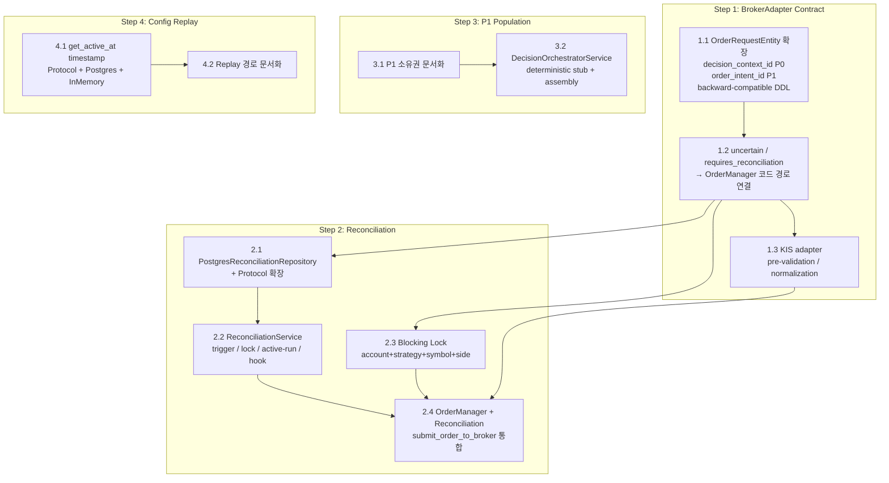

# Milestone 6 — Broker Contract + Reconciliation Alignment

## 1. 목적

Milestone 5에서 확장한 `SubmitOrderRequest`/`SubmitOrderResult` 필드를 실제 코드 경로로 연결하고, `uncertain`/`requires_reconciliation` 플래그를 처리하는 Reconciliation Trigger 체계를 구축한다. 또한 `TradeDecisionEntity` P1 필드를 채우는 AI Layer 최소 설계와 `ConfigVersionRepository`의 replay 시맨틱을 보강한다.

**이번 Milestone에서는 KIS adapter 실제 구현, EntryStyle routing, broker_api_call_log 저장을 포함하지 않는다.** 이들은 이후 별도 Milestone에서 다룬다.

### 1.1 사용자 승인 조정 조건

| # | 조건 | 반영 |
|---|------|------|
| 1 | `OrderRequestEntity` — `decision_context_id` P0, `order_intent_id` P1(optional), backward-compatible migration | ✅ |
| 2 | Blocking lock key: `account_id + strategy_id + symbol + side` (strategy_id 포함) | ✅ |
| 3 | ReconciliationService: trigger + lock + active run 조회 + 최소 복구 훅까지 (full automation 제외) | ✅ |
| 4 | KIS adapter: pre-validation / conflict detection / normalization 수준만 (full 매핑 제외) | ✅ |
| 5 | DecisionOrchestratorService: deterministic stub + structured assembly (LLM orchestration 제외) | ✅ |

---

## 2. 작업 상세

### Step 1: BrokerAdapter Contract Alignment

#### 1.1 `SubmitOrderRequest` 확장 필드 사용 경로 정리

현재 [`SubmitOrderRequest`](src/agent_trading/domain/models.py:103)에 정의된 M5 확장 필드 10개 중, 실제 코드 경로에서 사용되는 것은 `idempotency_key`(OrderManager)와 `decision_id`(OrderManager)뿐이다. 나머지 8개 필드는 정의만 되어 있고 실제 소비자(sink)가 없다.

**할 일:**

| 필드 | 우선순위 | 현재 상태 | 필요한 조치 |
|------|---------|-----------|------------|
| `idempotency_key` | P0 | ✅ OrderManager 사용 | 변경 불필요 |
| `decision_id` | P0 | ✅ OrderManager UUID resolve | 변경 불필요 |
| `decision_context_id` | **P0** | 정의만 있음 | `OrderRequestEntity` P0 필드 추가 + DDL + OrderManager 전달 |
| `order_intent_id` | **P1** | 정의만 있음 | `OrderRequestEntity` P1 optional 필드 추가 + DDL nullable |
| `price_band_lower` | P0 | 정의만 있음 | KIS adapter 사전 검증 로직 추가 |
| `price_band_upper` | P0 | 정의만 있음 | KIS adapter 사전 검증 로직 추가 |
| `max_slippage_bps` | P0 | 정의만 있음 | KIS adapter 사전 검증 로직 추가 |
| `allow_partial_fill` | P0 | 정의만 있음 | KIS adapter 충돌 감지 로직 추가 |
| `client_timestamp` | P1 | 정의만 있음 | 감사 로그 메타데이터에 포함 |
| `metadata` | P1 | 정의만 있음 | BrokerOrderEntity raw_payload_uri 대신 저장 검토 |

**변경 파일:**

1. [`src/agent_trading/domain/entities.py`](src/agent_trading/domain/entities.py) — `OrderRequestEntity`:
   - **P0**: `decision_context_id: UUID` 필드 추가 (nullable, 기존 필드와 함께)
   - **P1**: `order_intent_id: UUID | None = None` 필드 추가
2. [`src/agent_trading/services/order_manager.py`](src/agent_trading/services/order_manager.py) — `create_order()`:
   - `request.decision_context_id` → UUID 변환 후 `OrderRequestEntity.decision_context_id`에 전달
   - `request.order_intent_id` → UUID 변환 후 `OrderRequestEntity.order_intent_id`에 전달 (nullable)
   - `request.client_timestamp` → 감사 로그 metadata에 포함
3. [`db/migrations/0005_add_order_tracing_and_locks.sql`](db/migrations/0005_add_order_tracing_and_locks.sql) — backward-compatible:
   ```sql
   ALTER TABLE trading.order_requests ADD COLUMN IF NOT EXISTS decision_context_id UUID
       REFERENCES trading.decision_contexts (decision_context_id);
   ALTER TABLE trading.order_requests ADD COLUMN IF NOT EXISTS order_intent_id UUID;
   COMMENT ON COLUMN trading.order_requests.order_intent_id IS 'P1 optional: references an order_intent entity if implemented.';
   ```
4. [`src/agent_trading/brokers/base.py`](src/agent_trading/brokers/base.py) — (변경 불필요, Protocol은 이미 확장 필드를 받음)

#### 1.2 `SubmitOrderResult.uncertain` / `requires_reconciliation` 의미 정의 및 코드 경로 연결

현재 [`SubmitOrderResult`](src/agent_trading/domain/models.py:135)에 정의된 두 플래그는 값만 있고, 이를 해석하거나 액션을 트리거하는 코드가 없다.

**의미 정의:**

```python
# SubmitOrderResult.uncertain
#   True  = 브로커 응답이 불확실함 (timeout, partial response, ambiguous status)
#           → OrderManager.submit_order_to_broker():
#             1. transition_to(RECONCILE_REQUIRED)
#             2. reconciliation_service.trigger('submit_uncertain', ...)
#             3. reconciliation_service.acquire_blocking_lock(...)
#   False = 응답이 명확함 (정상 접수 또는 명시적 거절)
#
# SubmitOrderResult.requires_reconciliation
#   True  = 브로커가 정산 필요 응답을 반환함 (예: KIS의 "처리중", "확인불가")
#           → OrderManager.submit_order_to_broker():
#             1. transition_to(RECONCILE_REQUIRED)
#             2. reconciliation_service.trigger('broker_requires_reconciliation', ...)
#             3. reconciliation_service.acquire_blocking_lock(...)
#   False = 정상 처리
```

**변경 파일:**

1. [`src/agent_trading/services/order_manager.py`](src/agent_trading/services/order_manager.py) — `submit_order_to_broker()`에서:
   - `uncertain=True` → `transition_to(RECONCILE_REQUIRED)` + `reconciliation_service.trigger()` + `acquire_blocking_lock()`
   - `requires_reconciliation=True` → `transition_to(RECONCILE_REQUIRED)` + `reconciliation_service.trigger()` + `acquire_blocking_lock()`
2. 신규: [`src/agent_trading/services/reconciliation_service.py`](src/agent_trading/services/reconciliation_service.py) — trigger/lock/active run 조회 (Step 2에서 상세 구현)

#### 1.3 KIS adapter 검증 로직 개선 (Pre-validation / Conflict Detection / Normalization 수준)

현재 [`KoreaInvestmentAdapter.submit_order()`](src/agent_trading/brokers/koreainvestment/adapter.py:106)는 stub이다. 이번 단계에서는 **broker-specific 파라미터 완전 매핑 없이** 사전 검증/충돌 감지/정규화 수준으로만 개선한다.

**구현 범위:**

| 검증 항목 | 동작 | 위반 시 |
|-----------|------|---------|
| `price_band_lower` / `price_band_upper` | `request.price`가 범위 밖이면 경고 로그 + WARN audit | 주문은 진행하되 audit에 기록 (soft guard) |
| `max_slippage_bps` | simulated fill price 계산 후 slippage 초과 시 경고 | 주문은 진행하되 audit에 기록 |
| `allow_partial_fill=False` | 부분 체결 시뮬레이션 금지 | FOK-like 동작 (전체 체결 or 취소) |
| 잘못된 필드 조합 | 예: MARKET 주문에 limit price 지정 | `InvalidRequestError` raise |

**변경 파일:**

1. [`src/agent_trading/brokers/koreainvestment/adapter.py`](src/agent_trading/brokers/koreainvestment/adapter.py):
   - `_validate_order_request(request: SubmitOrderRequest) -> None` — 사전 검증 메서드 추가
   - `_normalize_submit_result(...)` — 응답 정규화 메서드 추가
   - `submit_order()`에서 두 메서드 호출

---

### Step 2: Reconciliation Trigger and Unknown-State Recovery

#### 2.1 PostgresReconciliationRepository 구현

현재 [`ReconciliationRepository`](src/agent_trading/repositories/contracts.py:202) Protocol과 [`InMemoryReconciliationRepository`](src/agent_trading/repositories/memory.py:340)는 존재하나, Postgres 구현체가 없다.

**Protocol 메서드:**

```python
class ReconciliationRepository(Protocol):
    async def add_run(self, run: ReconciliationRunEntity) -> ReconciliationRunEntity: ...
    async def get_run(self, reconciliation_run_id: UUID) -> ReconciliationRunEntity | None: ...
    async def attach_order_mismatch(
        self, reconciliation_run_id: UUID, order_request_id: UUID,
        mismatch_type: str, details: dict[str, object],
    ) -> None: ...
    async def attach_position_mismatch(
        self, reconciliation_run_id: UUID, position_snapshot_id: UUID,
        mismatch_type: str, details: dict[str, object],
    ) -> None: ...
    # -- M6 추가 메서드 --
    async def list_runs_by_account(
        self, account_id: UUID, limit: int = 20
    ) -> Sequence[ReconciliationRunEntity]: ...
    async def get_active_run(self, account_id: UUID) -> ReconciliationRunEntity | None: ...
    async def update_run_status(
        self, reconciliation_run_id: UUID, status: str,
        summary_json: dict[str, object] | None = None,
    ) -> None: ...
```

**변경 파일:**

1. 신규: [`src/agent_trading/repositories/postgres/reconciliation.py`](src/agent_trading/repositories/postgres/reconciliation.py) — `PostgresReconciliationRepository`
2. [`src/agent_trading/repositories/contracts.py`](src/agent_trading/repositories/contracts.py) — Protocol에 `list_runs_by_account()`, `get_active_run()`, `update_run_status()` 추가
3. [`src/agent_trading/repositories/memory.py`](src/agent_trading/repositories/memory.py) — `InMemoryReconciliationRepository`에 동일 메서드 추가
4. [`src/agent_trading/repositories/postgres/bootstrap.py`](src/agent_trading/repositories/postgres/bootstrap.py) — `PostgresReconciliationRepository(tx)` 연결

#### 2.2 Reconciliation Service — 범위 제한 구현

**신규 서비스:** [`src/agent_trading/services/reconciliation_service.py`](src/agent_trading/services/reconciliation_service.py)

이번 단계에서는 full automation 대신 **trigger / lock 생성 / active run 조회 / 최소 복구 훅**까지만 구현한다.

```python
@dataclass(slots=True)
class ReconciliationService:
    """Manages reconciliation runs and blocking locks.
    
    Scope (M6): trigger creation, lock lifecycle, active run query, minimal hooks.
    Out of scope (M6): broker-specific recover flow, automated mismatch resolution.
    """
    repos: RepositoryContainer

    async def trigger(
        self,
        trigger_type: str,           # 'submit_timeout' | 'ws_disconnect' | 'broker_ambiguous' | 'manual'
        account_id: UUID,
        order_request_id: UUID,
        reason: str | None = None,
    ) -> ReconciliationRunEntity:
        """Create a new reconciliation run and acquire a blocking lock."""
        ...

    async def acquire_blocking_lock(
        self,
        account_id: UUID,
        strategy_id: UUID,
        symbol: str,
        side: OrderSide,
        reason: str,
        locked_by_run_id: UUID,
    ) -> None:
        """Insert a blocking lock entry.
        Lock key: (account_id, strategy_id, symbol, side)
        Raises if lock already exists and is not expired.
        """
        ...

    async def release_blocking_lock(
        self,
        account_id: UUID,
        strategy_id: UUID,
        symbol: str,
        side: OrderSide,
    ) -> None:
        """Remove the blocking lock."""
        ...

    async def is_blocked(
        self,
        account_id: UUID,
        strategy_id: UUID,
        symbol: str,
        side: OrderSide,
    ) -> bool:
        """Check if a blocking lock exists and is not expired."""
        ...

    async def get_active_run(self, account_id: UUID) -> ReconciliationRunEntity | None:
        """Return the most recent started/active reconciliation run."""
        ...

    async def attach_mismatch(
        self,
        run_id: UUID,
        order_request_id: UUID,
        mismatch_type: str,
        details: dict[str, object],
    ) -> None:
        """Record a detected mismatch for the reconciliation run."""
        ...

    async def mark_resolved(self, run_id: UUID, summary: dict[str, object] | None = None) -> None:
        """Mark a reconciliation run as resolved and release all its locks.
        This is the **minimal recovery hook** — in future milestones it may
        trigger broker-specific reconciliation flows.
        """
        ...
```

**변경 파일:**

1. 신규: [`src/agent_trading/services/reconciliation_service.py`](src/agent_trading/services/reconciliation_service.py)
2. 신규: [`db/migrations/0005_add_order_tracing_and_locks.sql`](db/migrations/0005_add_order_tracing_and_locks.sql) — DDL (아래 상세 참조)

#### 2.3 Blocking Lock 설계 — strategy_id 포함

**lock key:** `(account_id, strategy_id, symbol, side)`

`strategy_id`를 포함하는 이유:
- 같은 계정에서 서로 다른 전략이 같은 symbol을 거래할 수 있음 (e.g., momentum vs mean-reversion)
- 한 전략의 주문이 uncertain 상태여도 다른 전략의 정상 주문을 차단하지 않음
- 차단 범위를 전략 단위로 제한하여 과도 차단 방지

**DDL:**

```sql
CREATE TABLE IF NOT EXISTS trading.order_blocking_locks (
    lock_id         UUID PRIMARY KEY DEFAULT gen_random_uuid(),
    account_id      UUID NOT NULL REFERENCES trading.accounts (account_id),
    strategy_id     UUID NOT NULL REFERENCES trading.strategies (strategy_id),
    symbol          VARCHAR(20) NOT NULL,
    side            VARCHAR(8) NOT NULL,
    reason          VARCHAR(255) NOT NULL,
    locked_by_run_id UUID NOT NULL REFERENCES trading.reconciliation_runs (reconciliation_run_id),
    locked_at       TIMESTAMPTZ NOT NULL DEFAULT NOW(),
    expires_at      TIMESTAMPTZ NOT NULL DEFAULT NOW() + INTERVAL '30 minutes',

    CONSTRAINT uq_order_blocking_locks_key
        UNIQUE (account_id, strategy_id, symbol, side),

    CONSTRAINT ck_order_blocking_locks_side
        CHECK (side IN ('buy', 'sell'))
);

CREATE INDEX IF NOT EXISTS idx_order_blocking_locks_expires
    ON trading.order_blocking_locks (expires_at)
    WHERE expires_at > NOW();
```

**Blocking Lock 적용 조건:**
- `transition_to(RECONCILE_REQUIRED)`가 호출될 때
- `AmbiguousOrderStateError`가 발생할 때
- `SubmitOrderResult.uncertain == True`일 때
- `SubmitOrderResult.requires_reconciliation == True`일 때

**Blocking Lock 해제 조건:**
- `ReconciliationService.mark_resolved(run_id)` 호출 시 자동 해제
- Lock 타임아웃(30분) 초과 시 `is_blocked()`에서 자동 만료 처리
- 운영자 수동 해제 (향후)

**변경 파일:**

1. [`src/agent_trading/services/reconciliation_service.py`](src/agent_trading/services/reconciliation_service.py) — lock 관리 메서드
2. [`src/agent_trading/services/order_manager.py`](src/agent_trading/services/order_manager.py) — `submit_order_to_broker()`에서 `is_blocked()` 사전 체크

#### 2.4 OrderManager에 Reconciliation Trigger 통합

**`OrderManager.submit_order_to_broker()` 메서드 추가:**

```
flow:
  1. is_blocked(account, strategy, symbol, side) 확인 → blocked면 raise
  2. create_order() → DRAFT
  3. transition_to(PENDING_SUBMIT)
  4. broker.submit_order(request) 호출
  5. 결과 분석:

  [SubmitOrderResult]
  ├─ accepted=True + uncertain=False + requires_reconciliation=False
  │   → transition_to(SUBMITTED or ACKNOWLEDGED)
  │
  ├─ accepted=True + uncertain=True
  │   → transition_to(RECONCILE_REQUIRED)
  │   → reconciliation_service.trigger('submit_uncertain', ...)
  │   → reconciliation_service.acquire_blocking_lock(...)
  │
  ├─ accepted=False + requires_reconciliation=True
  │   → transition_to(RECONCILE_REQUIRED)
  │   → reconciliation_service.trigger('broker_requires_reconciliation', ...)
  │   → reconciliation_service.acquire_blocking_lock(...)
  │
  └─ accepted=False + requires_reconciliation=False
      → transition_to(REJECTED)

  [BrokerError]
  ├─ AmbiguousOrderStateError
  │   → transition_to(RECONCILE_REQUIRED)
  │   → reconciliation_service.trigger('broker_ambiguous', ...)
  │   → reconciliation_service.acquire_blocking_lock(...)
  │
  ├─ OrderRejectedError
  │   → transition_to(REJECTED)
  │
  ├─ NetworkError / RateLimitError / TemporaryBrokerError
  │   → 재시도 로직 (최대 3회, exponential backoff)
  │   → 모두 실패 시 transition_to(RECONCILE_REQUIRED) + trigger
  │
  └─ 기타 BrokerError
      → transition_to(RECONCILE_REQUIRED) + trigger
```

**변경 파일:**

1. [`src/agent_trading/services/order_manager.py`](src/agent_trading/services/order_manager.py):
   - `reconciliation_service: ReconciliationService | None = None` 필드 추가
   - `is_blocked()` 사전 체크 로직 추가
   - `submit_order_to_broker()` 메서드 추가 (전체 흐름)
   - 기존 `create_order()`와 `transition_to()`는 그대로 유지 (하위 호환성)

---

### Step 3: TradeDecision P1 Field Population — 설계 및 최소 구현

#### 3.1 역할별 P1 필드 소유권 정의

| 필드 | 소유자 | 책임 | M6 구현? |
|------|--------|------|----------|
| `expected_return_bps` | Signal Agent | 신호 강도를 bps로 변환 | ✅ stub |
| `expected_downside_bps` | Risk Agent | 하방 리스크 추정 | ✅ stub |
| `net_expected_value_bps` | Portfolio Engine | `expected_return - expected_downside` | ✅ stub |
| `final_trade_score` | Decision Orchestrator | 앙상블 점수 | ✅ stub |
| `conviction_score` | Decision Orchestrator | 신뢰도 0.0~1.0 | ✅ stub |
| `reasoning` | Decision Orchestrator | 자연어 판단 근거 | ✅ stub |
| `failed_rule_codes` | Hard Guardrail / Compliance | 위반된 규칙 코드 목록 | ✅ stub |
| `reason_codes` | Decision Orchestrator | 거절/보류 사유 코드 | ✅ stub |
| `opposing_evidence` | AI Risk / AI Compliance | 반대 증거 목록 | stub only |
| `exit_plan_json` | Portfolio Engine / Risk Agent | 청산 조건 및 가격 | stub only |
| `regime_label` | Market Regime Agent | 현재 시장 레짐 | stub only |
| `strategy_fit_score` | Strategy Selection Agent | 전략 적합도 | stub only |
| `risk_check_passed` | Hard Guardrail Engine | 리스크 체크 통과 여부 | ✅ stub |
| `compliance_check_passed` | AI Compliance Agent | 컴플라이언스 통과 여부 | ✅ stub |
| `execution_check_passed` | Order Construction Agent | 실행 가능성 체크 통과 여부 | ✅ stub |
| `calculation_version` | 시스템 | 계산 로직 버전 | ✅ "m6-stub" |
| `agent_version_json` | 각 Agent | Agent 버전 정보 | stub only |
| `model_version_json` | 각 Agent | AI 모델 버전 | stub only |
| `prompt_version_json` | 각 Agent | 프롬프트 버전 | stub only |

#### 3.2 최소 구현: DecisionOrchestratorService (deterministic stub)

**신규 파일:** [`src/agent_trading/services/decision_orchestrator.py`](src/agent_trading/services/decision_orchestrator.py)

- **deterministic stub**: LLM 호출 없이 규칙 기반으로 P1 필드 채움
- **structured assembly**: 각 하위 Agent의 출력을 받아 `TradeDecisionEntity`로 조립
- **범위**: P1 필드 중 `expected_return_bps`, `expected_downside_bps`, `net_expected_value_bps`, `final_trade_score`, `conviction_score`, `failed_rule_codes`, `risk_check_passed`, `compliance_check_passed`, `execution_check_passed` + `reasoning`, `reason_codes` stub

```python
@dataclass(slots=True)
class DecisionOrchestratorService:
    """Coordinates the AI decision pipeline and populates TradeDecision P1 fields.
    
    This is a deterministic stub for Milestone 6. It uses rule-based assembly
    without LLM calls. Full LLM orchestration is deferred to Milestone 7+.
    """
    repos: RepositoryContainer

    async def evaluate(
        self,
        context: DecisionContextEntity,
        signal_input: SignalInput,  # structured input, not LLM output
    ) -> TradeDecisionEntity:
        """Run the decision pipeline:
        1. Hard Guardrail → failed_rule_codes, risk_check_passed, compliance_check_passed
        2. Signal scoring → expected_return_bps, expected_downside_bps, net_expected_value_bps
        3. Assembly → final_trade_score, conviction_score, decision_type
        4. Populate → complete TradeDecisionEntity with P0 + P1 fields
        5. Persist via repos.trade_decisions.add()
        """
        ...
```

**신규 파일:** [`src/agent_trading/domain/signals.py`](src/agent_trading/domain/signals.py)

```python
@dataclass(slots=True, frozen=True)
class SignalInput:
    """Structured input for the decision pipeline.
    Deterministic stub data — not LLM output.
    """
    strategy_id: UUID
    symbol: str
    market: str
    side: OrderSide
    signal_return_bps: int = 0       # stub: configurable
    signal_downside_bps: int = 0     # stub: configurable
    conviction: Decimal = Decimal("0.5")  # stub: 0.0~1.0
    regime_label: str = "neutral"
```

**변경 파일:**

1. 신규: [`src/agent_trading/services/decision_orchestrator.py`](src/agent_trading/services/decision_orchestrator.py)
2. 신규: [`src/agent_trading/domain/signals.py`](src/agent_trading/domain/signals.py)
3. 기존 파일 수정 없음 — `TradeDecisionEntity`는 이미 P1 필드를 모두 가지고 있음

---

### Step 4: Config Replay Semantics

#### 4.1 `ConfigVersionRepository.get_active_at(timestamp)` 추가

현재 [`ConfigVersionRepository`](src/agent_trading/repositories/contracts.py:86)는 `get_active(client_id, environment)`만 제공한다. Replay 시나리오에서는 **특정 과거 시점에 활성화되어 있던 config**를 조회해야 한다.

**Protocol 변경:**

```python
class ConfigVersionRepository(Protocol):
    async def add(self, config_version: ConfigVersionEntity) -> ConfigVersionEntity: ...
    async def get(self, config_version_id: UUID) -> ConfigVersionEntity | None: ...
    async def get_active(self, client_id: UUID, environment: Environment) -> ConfigVersionEntity | None: ...
    async def get_active_at(
        self, client_id: UUID, environment: Environment, at: datetime
    ) -> ConfigVersionEntity | None:
        """Return the config version that was active at the given timestamp.
        
        Selects the most recently activated version where activated_at <= at.
        Returns None if no version was activated before the given timestamp.
        
        This is critical for replay: to reconstruct the system state at a
        specific point in time, we need the config that was governing at that time.
        """
        ...
```

**SQL (Postgres):**

```sql
SELECT * FROM trading.config_versions
WHERE client_id = $1
  AND environment = $2
  AND activated_at IS NOT NULL
  AND activated_at <= $3
ORDER BY activated_at DESC
LIMIT 1
```

**replay semantics 검증:**

| 시나리오 | 기대 결과 |
|----------|-----------|
| `at` = config 활성화 직전 | 이전 config 반환 (또는 None) |
| `at` = config 활성화 직후 | 해당 config 반환 |
| `at` = config 비활성화 이후 | 마지막 활성화 config 반환 (config는 soft-delete 없음) |
| `at` = 현재 시각 | `get_active()`와 동일 결과 |
| 활성화되지 않은 config만 존재 | None 반환 |

**변경 파일:**

1. [`src/agent_trading/repositories/contracts.py`](src/agent_trading/repositories/contracts.py:86) — `get_active_at()` 메서드 추가
2. [`src/agent_trading/repositories/postgres/config_versions.py`](src/agent_trading/repositories/postgres/config_versions.py:14) — `get_active_at()` 구현
3. [`src/agent_trading/repositories/memory.py`](src/agent_trading/repositories/memory.py:106) — `get_active_at()` 구현

#### 4.2 Replay 경로 설계 문서화

Replay 엔진의 기본 동작 (구현은 이후 Milestone):

```
1. DecisionContextRepository.list(query)
   → replay 대상 DecisionContext 조회 (이미 구현됨)

2. ConfigVersionRepository.get_active_at(client_id, env, context.created_at)
   → 해당 시점 config 복원 (이번 M6에서 구현)

3. TradeDecisionRepository.get_by_context(context_id)
   → 해당 결정 조회 (이미 구현됨)

4. 재현: 동일 DecisionContext + ConfigVersion으로 결정 재연산
   → 이후 Milestone에서 구현
```

이번 Milestone에서는 `ConfigVersionRepository.get_active_at()` 구현까지만 수행한다.

**변경 파일:**

1. (문서만, 코드 변경 없음)

---

## 3. Mermaid: 작업 의존성 그래프



---

## 4. 변경 파일 요약

### 신규 생성 (7개)

| 파일 | 설명 |
|------|------|
| `src/agent_trading/repositories/postgres/reconciliation.py` | PostgresReconciliationRepository |
| `src/agent_trading/services/reconciliation_service.py` | Reconciliation Service (trigger/lock/hook) |
| `src/agent_trading/services/decision_orchestrator.py` | DecisionOrchestratorService deterministic stub |
| `src/agent_trading/domain/signals.py` | SignalInput 등 신호 모델 |
| `db/migrations/0005_add_order_tracing_and_locks.sql` | DDL: order_request tracing + order_blocking_locks |
| `tests/repositories/test_postgres_reconciliation.py` | PostgresReconciliationRepository 테스트 |
| `tests/services/test_reconciliation_service.py` | ReconciliationService 테스트 |

### 수정 (11개)

| 파일 | 변경 내용 |
|------|-----------|
| `src/agent_trading/domain/entities.py` | `OrderRequestEntity`에 P0 `decision_context_id`, P1 `order_intent_id` 필드 추가 |
| `src/agent_trading/services/order_manager.py` | `submit_order_to_broker()` 메서드 추가, `reconciliation_service` 의존성, blocking lock 사전 체크, 감사 로그 확장 |
| `src/agent_trading/repositories/contracts.py` | `ReconciliationRepository`에 `list_runs_by_account()`, `get_active_run()`, `update_run_status()` 추가; `ConfigVersionRepository`에 `get_active_at()` 추가 |
| `src/agent_trading/repositories/postgres/config_versions.py` | `get_active_at()` 구현 |
| `src/agent_trading/repositories/memory.py` | `InMemoryConfigVersionRepository.get_active_at()` + `InMemoryReconciliationRepository` 확장 메서드 구현 |
| `src/agent_trading/repositories/postgres/bootstrap.py` | `PostgresReconciliationRepository(tx)` 연결 |
| `src/agent_trading/brokers/koreainvestment/adapter.py` | `_validate_order_request()` + `_normalize_submit_result()` 추가 |
| `tests/conftest.py` | reconciliation seed 데이터 추가 |
| `tests/smoke/test_paper_loop_postgres.py` | `submit_order_to_broker()` smoke 테스트 확장 |
| `tests/repositories/test_postgres_config_versions.py` | `get_active_at()` 테스트 추가 |
| `plans/10.milestone6_broker_contract_reconciliation_alignment.md` | 본 문서 |

---

## 5. 테스트 전략

| 테스트 그룹 | 대상 | 예상 개수 |
|------------|------|----------|
| PostgresReconciliationRepository | add_run / get_run / attach_order_mismatch / attach_position_mismatch / list_runs_by_account / get_active_run / update_run_status | 7 |
| ReconciliationService | trigger / acquire_blocking_lock / release_blocking_lock / is_blocked / get_active_run / attach_mismatch / mark_resolved | 7 |
| OrderManager.submit_order_to_broker | 각 분기: accepted+uncertain / rejected+requires_reconciliation / AmbiguousOrderStateError / OrderRejectedError / NetworkError 재시도 / blocked 사전 체크 | 6 |
| ConfigVersionRepository.get_active_at | 5개 시나리오 (활성화 전/후/비활성화/현재시각/미활성화) | 5 |
| KIS adapter 확장 필드 | price_band 검증 / max_slippage 검증 / allow_partial_fill / 잘못된 조합 | 4 |
| DecisionOrchestratorService | evaluate()가 P0+P1 TradeDecisionEntity 반환 | 2 |
| 기존 테스트 회귀 | 전체 테스트 | 108+α 통과 |

---

## 6. 완료 기준 (Exit Criteria)

- [ ] `OrderRequestEntity`에 `decision_context_id`(P0), `order_intent_id`(P1) 추가 + backward-compatible DDL migration `0005`
- [ ] `SubmitOrderResult.uncertain` → `transition_to(RECONCILE_REQUIRED)` + trigger + lock 연결
- [ ] `SubmitOrderResult.requires_reconciliation` → trigger + lock 연결
- [ ] `KoreaInvestmentAdapter.submit_order()`에 pre-validation / normalization 로직 추가
- [ ] `PostgresReconciliationRepository` 구현 완료 (7개 메서드)
- [ ] `ReconciliationService` 구현 완료 (trigger / lock / active-run / hook — 7개 메서드)
- [ ] Blocking lock key = `(account_id, strategy_id, symbol, side)` 최종 결정
- [ ] `order_blocking_locks` DDL + UNIQUE constraint 적용
- [ ] `OrderManager.submit_order_to_broker()` 구현 — 전체 분기 처리
- [ ] `DecisionOrchestratorService` deterministic stub 구현 (P1 필드 assembly)
- [ ] `ConfigVersionRepository.get_active_at(timestamp)` Protocol + Postgres + InMemory 구현
- [ ] `get_active_at()` replay semantics 5개 시나리오 검증 완료
- [ ] 전체 테스트 통과 (기존 108 + 신규 ~31 = ~139)

---

## 7. Milestone 7로 넘겨야 할 broker-specific 미완 항목

| 항목 | 사유 | 비고 |
|------|------|------|
| KIS adapter 실제 HTTP 구현 | 이번 M6는 pre-validation까지만 | POST/GET/KIS API 매핑 필요 |
| KIS-specific ambiguous state 매핑 | `_normalize_submit_result()`는 stub, 실제 KIS 응답 코드 매핑 필요 | `04_broker_adapter_interface.md` §5 참조 |
| EntryStyle routing (VWAP/TWAP) | Order Construction Agent 필요 | `08_ai_decision_policy.md` §9 참조 |
| Reconciliation full resolve flow | 이번 M6는 trigger + lock까지만 | 브로커별 재조회/복구 로직 필요 |
| WebSocket recovery | KIS adapter 구현과 함께 | `05_koreainvestment_adapter_spec.md` §6.7 |
| Full LLM orchestration | DecisionOrchestratorService는 deterministic stub | `08_ai_decision_policy.md` §7 참조 |
| `broker_api_call_log` 저장 | 관측성, 우선순위 낮음 | M8+ |
| `market_data_quality_event` 저장 | 관측성, 우선순위 낮음 | M8+ |
| Replay Engine 전체 구현 | Config replay semantics만 처리 | M8+ |

---

## 8. 주요 설계 결정 요약

| 결정 | 내용 | 근거 |
|------|------|------|
| Blocking lock key | `account_id + strategy_id + symbol + side` | 과도 차단 방지, 전략 단위 격리 |
| ReconciliationService 범위 | trigger / lock / active-run / mark_resolved only | Full automation은 broker-specific 로직 필요 |
| KIS adapter 검증 수준 | pre-validation / conflict detection / normalization | 실제 HTTP 매핑은 다음 단계 |
| DecisionOrchestratorService | deterministic stub + structured assembly | LLM orchestration은 아직 범위 밖 |
| Migration 0005 | backward-compatible (ADD COLUMN IF NOT EXISTS) | 기존 데이터 영향 없음 |
| `decision_context_id` 우선순위 | P0 (OrderRequestEntity 필수) | 결정 추적의 기본 식별자 |
| `order_intent_id` 우선순위 | P1 (OrderRequestEntity optional) | 아직 order_intent entity 미구현 |
