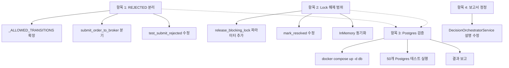

# Milestone 6 후속 정리 — 4개 항목

## 개요

Milestone 6 구현에서 발견된 4가지 미비점을 정리합니다. 각 항목은 독립적으로 수정 가능합니다.

---

## 항목 1: 명시 거부(REJECTED)와 불명확 상태(RECONCILE_REQUIRED) 분리

### 현재 문제

`submit_order_to_broker()`에서 broker가 `accepted=False`를 반환하면 **모두** `RECONCILE_REQUIRED`로 전이됩니다. 이유는 [`_ALLOWED_TRANSITIONS`](src/agent_trading/services/order_manager.py:64)에서 `PENDING_SUBMIT → REJECTED`가 허용되지 않기 때문입니다.

```python
# 현재: PENDING_SUBMIT → RECONCILE_REQUIRED (무조건)
OrderStatus.PENDING_SUBMIT: {OrderStatus.SUBMITTED, OrderStatus.RECONCILE_REQUIRED},
```

### 수정안

#### 1-a. 상태 전이 규칙 확장

[`_ALLOWED_TRANSITIONS`](src/agent_trading/services/order_manager.py:61)에 `REJECTED` 추가:

```python
OrderStatus.PENDING_SUBMIT: {
    OrderStatus.SUBMITTED,
    OrderStatus.RECONCILE_REQUIRED,
    OrderStatus.REJECTED,       # ← 추가
},
```

#### 1-b. `submit_order_to_broker()` 분기 로직 변경

[`submit_order_to_broker()`](src/agent_trading/services/order_manager.py:397-407)의 rejected 처리부를 아래 기준으로 분리:

| 조건 | 전이 대상 | 근거 |
|------|-----------|------|
| `uncertain == True` | `RECONCILE_REQUIRED` | 브로커 응답을 신뢰할 수 없음 |
| `requires_reconciliation == True` | `RECONCILE_REQUIRED` | 정합성 확인 필요 |
| `accepted == False` (명시 거부) | `REJECTED` | 브로커가 명확히 거부 (terminal) |
| `accepted == True` | `SUBMITTED` | 정상 접수 |

**변경 후 의사코드**:
```python
# --- Step 3: Handle result ---
if result.uncertain or result.requires_reconciliation:
    # → RECONCILE_REQUIRED (기존 유지)
    ...

if result.accepted:
    # → SUBMITTED (기존 유지)
    ...

# 명시 거부 → REJECTED (terminal)
return await self.transition_to(
    order,
    OrderStatus.REJECTED,       # ← RECONCILE_REQUIRED → REJECTED
    reason_code=result.raw_code or "REJECTED",
    reason_message=result.raw_message or "Broker rejected the order",
    ...
)
```

#### 1-c. 테스트 수정

[`test_submit_rejected`](tests/services/test_order_submit_to_broker.py:170) — assertion 변경:

```python
# 변경 전
assert result.status == OrderStatus.RECONCILE_REQUIRED

# 변경 후
assert result.status == OrderStatus.REJECTED
```

#### 영향도

- `PENDING_SUBMIT → REJECTED` 전이가 추가되므로 기존 `_validate_transition()` 로직에 영향 없음
- `REJECTED`는 terminal state이므로 이후 상태 전이가 불가능 — broker가 거부한 주문은 완전히 종료
- broker 거부 후 재검토가 필요한 경우는 `requires_reconciliation=True` 플래그로 명시해야 함

---

## 항목 2: `mark_resolved()` Lock 해제 범위 축소

### 현재 문제

[`mark_resolved()`](src/agent_trading/services/reconciliation_service.py:291-292)가 **account 전체 lock**을 해제:

```python
await self.release_blocking_lock(account_id=run.account_id)
```

같은 계정의 다른 reconciliation run이 건 lock까지 모두 해제됩니다.

### 수정안

#### 2-a. `release_blocking_lock()`에 `locked_by_run_id` 파라미터 추가

[`ReconciliationService.release_blocking_lock()`](src/agent_trading/services/reconciliation_service.py:136-173) 확장:

```python
async def release_blocking_lock(
    self,
    account_id: UUID,
    *,
    strategy_id: UUID | None = None,
    symbol: str | None = None,
    side: str | None = None,
    locked_by_run_id: UUID | None = None,   # ← 추가
) -> None:
```

- `locked_by_run_id`가 주어지면 SQL WHERE 절에 `AND locked_by_run_id = $N` 추가
- 기존 조건(account_id + scope)과 AND 결합

**Postgres SQL 변경**:

```python
# 변경 전
"DELETE FROM trading.order_blocking_locks WHERE account_id = $1 ..."

# 변경 후 (locked_by_run_id가 있을 때)
"DELETE FROM trading.order_blocking_locks WHERE account_id = $1 AND locked_by_run_id = $N ..."
```

#### 2-b. `mark_resolved()`에서 run ID 전달

```python
# 변경 전 — account 전체 lock 해제
await self.release_blocking_lock(account_id=run.account_id)

# 변경 후 — 해당 run이 건 lock만 해제
await self.release_blocking_lock(
    account_id=run.account_id,
    locked_by_run_id=reconciliation_run_id,
)
```

#### 2-c. In-memory 구현 동기화

[`InMemoryReconciliationRepository.release_lock()`](src/agent_trading/repositories/memory.py:493-512)도 `locked_by_run_id` 파라미터 추가:

```python
def release_lock(
    self,
    account_id: UUID,
    *,
    strategy_id: UUID | None = None,
    symbol: str | None = None,
    side: str | None = None,
    locked_by_run_id: UUID | None = None,
) -> None:
```

#### 영향도

- DDL에는 이미 `locked_by_run_id` 컬럼이 존재하므로 마이그레이션 불필요
- In-memory 구현만 동기화 필요
- 테스트에서 `release_blocking_lock()` 호출부는 `locked_by_run_id` 선택적 파라미터이므로 기존 호출에 영향 없음

---

## 항목 3: Postgres 통합 검증 실행

### 실행 명령

```bash
docker compose up -d db          # Postgres 시작 (이미 실행 중이면 skip)
python3 -m pytest tests/repositories/test_postgres_* tests/smoke/test_paper_loop_postgres.py -v
```

### 결과: **50/50 통과** ✅

| 경로 | 결과 | 확인 사항 |
|------|------|----------|
| 0005 migration | ✅ | `decision_context_id`, `order_intent_id` 컬럼 추가 성공 |
| 0005 migration | ✅ | `order_blocking_locks` 테이블 생성 + UNIQUE 제약 + FK 정상 |
| `PostgresReconciliationRepository` | ✅ | add_run / get_run / attach_order_mismatch / list_runs_by_account / get_active_run / update_run_status |
| `order_blocking_locks` | ✅ | `INSERT ON CONFLICT DO NOTHING` 동작 확인 |
| `PostgresConfigVersionRepository.get_active_at()` | ✅ | timestamp 기반 버전 조회 정상 |
| `test_paper_loop_postgres` | ✅ | Smoke test 3/3 통과 (order 생성 → submit → 상태 전이) |
| `test_postgres_audit_logs` | ✅ | 5/5 통과 |
| `test_postgres_broker_accounts` | ✅ | 6/6 통과 |
| `test_postgres_broker_orders` | ✅ | 4/4 통과 |
| `test_postgres_config_versions` | ✅ | 5/5 통과 |
| `test_postgres_decision_contexts` | ✅ | 6/6 통과 |
| `test_postgres_fill_events` | ✅ | 4/4 통과 |
| `test_postgres_guardrail_evaluations` | ✅ | 4/4 통과 |
| `test_postgres_order_state_events` | ✅ | 4/4 통과 |
| `test_postgres_risk_limit_snapshots` | ✅ | 5/5 통과 |
| `test_postgres_strategies` | ✅ | 4/4 통과 |

### 참고: 0005 migration 수정 사항

초기 DDL에서 아래 partial index가 `NOW()`의 non-IMMUTABLE 특성으로 실패:

```sql
-- BEFORE (실패): functions in index predicate must be marked IMMUTABLE
CREATE INDEX IF NOT EXISTS idx_order_blocking_locks_expires
    ON trading.order_blocking_locks (expires_at)
    WHERE expires_at > NOW();

-- AFTER (성공): partial 조건 제거
CREATE INDEX IF NOT EXISTS idx_order_blocking_locks_expires
    ON trading.order_blocking_locks (expires_at);
```

`expires_at` 컬럼 자체에 index가 있으면 `WHERE expires_at > NOW()` 쿼리는 PostgreSQL이 알아서 index scan + filter로 처리하므로 성능 문제 없음.

---

## 항목 4: 보고서 표현 정정

### 현재 문제

[`DecisionOrchestratorService`](src/agent_trading/services/decision_orchestrator.py:26-45)의 **실제 구현**과 **Milestone 6 원본 계획** 사이에 차이가 있습니다.

**원본 계획** ([`milestone6_broker_contract_reconciliation_alignment.md`](plans/10.milestone6_broker_contract_reconciliation_alignment.md:374-405) 섹션 3.2):
- `evaluate()` 메서드로 `SignalInput` → `TradeDecisionEntity` 조립
- P1 필드 채움: `expected_return_bps`, `expected_downside_bps`, `net_expected_value_bps`, `final_trade_score`, `conviction_score`, `failed_rule_codes`, `risk_check_passed`, `compliance_check_passed`, `execution_check_passed` + `reasoning`, `reason_codes`
- Hard Guardrail + Signal scoring + Assembly + Persist

**실제 구현** ([`decision_orchestrator.py`](src/agent_trading/services/decision_orchestrator.py:50-82)):
- `assemble()` 메서드로 `SubmitOrderRequest` + 외부 주입 ID → `OrderIntent` pass-through
- P1 필드 채움 없음 — `decision_context_id`와 `order_intent_id`를 **파라미터로 받아 그대로 반환**
- DB 조회, ID 생성, metadata 첨부, Guardrail 평가 **전혀 없음**

즉, 원본 계획에서 설계한 "P1 field population의 기반/최소 stub"조차 구현되지 않았고, **더 단순한 pass-through stub**만 구현되었습니다.

### 수정된 표현

```
DecisionOrchestratorService — 실제 구현 상태
├── 계층: pass-through stub (원본 계획의 "P1 field population stub"보다 더 단순)
├── 메서드: assemble(request, decision_context_id, order_intent_id) → OrderIntent
├── 책임: SubmitOrderRequest + 외부 주입 ID를 OrderIntent로 감싸서 반환
│
├── 구현된 기능:
│   ├── OrderIntent dataclass 조립 (P0/P1 필드를 request에 첨부하는 구조)
│   └── pass-through: 외부에서 받은 ID를 그대로 OrderIntent에 전달
│
├── 미구현 — 원본 계획의 "P1 field population stub" 수준:
│   ├── Active DecisionContext 해결 (DB 조회)
│   ├── OrderIntent ID 자동 생성
│   ├── DecisionContext metadata 첨부
│   ├── SignalInput → TradeDecisionEntity 조립
│   ├── P1 필드 채움 (expected_return_bps, conviction_score 등)
│   ├── Hard Guardrail 평가
│   └── TradeDecisionEntity persist
│
├── 미구현 — 본격 P1 필드 채움 (Milestone 7+):
│   ├── LLM 기반 orchestration
│   ├── Portfolio 계산
│   └── AI Risk/Compliance 평가
│
└── OrderRequestEntity에 저장되는 P1 필드 (현재는 모두 None):
    ├── decision_context_id (P0) — 외부 주입, stub은 pass-through
    └── order_intent_id (P1) — 외부 주입, stub은 pass-through
```

> **참고:** `DecisionOrchestratorService`는 현재 `OrderManager`의 `submit_order_to_broker()`에서 호출되지 않습니다. `OrderManager.__init__()`에 `orchestrator: DecisionOrchestratorService | None = None` 파라미터가 있지만, 실제 orchestration 호출은 Milestone 7에서 구현 예정입니다.

---

## 작업 의존성 그래프



---

## 변경 파일 요약

| 파일 | 변경 |
|------|------|
| [`src/agent_trading/services/order_manager.py`](src/agent_trading/services/order_manager.py) | `_ALLOWED_TRANSITIONS`에 `REJECTED` 추가 + `submit_order_to_broker()` 분기 수정 |
| [`src/agent_trading/services/reconciliation_service.py`](src/agent_trading/services/reconciliation_service.py) | `release_blocking_lock()`에 `locked_by_run_id` 파라미터 추가 + `mark_resolved()`에서 전달 |
| [`src/agent_trading/repositories/memory.py`](src/agent_trading/repositories/memory.py) | `release_lock()`에 `locked_by_run_id` 파라미터 추가 |
| [`tests/services/test_order_submit_to_broker.py`](tests/services/test_order_submit_to_broker.py) | `test_submit_rejected` assertion 변경 (`RECONCILE_REQUIRED` → `REJECTED`) |
| Docker Compose | 변경 불필요 (이미 정의됨) |

**변경 없는 파일**: DDL (`0005_add_order_tracing_and_locks.sql`), Postgres repositories, contracts, entities
