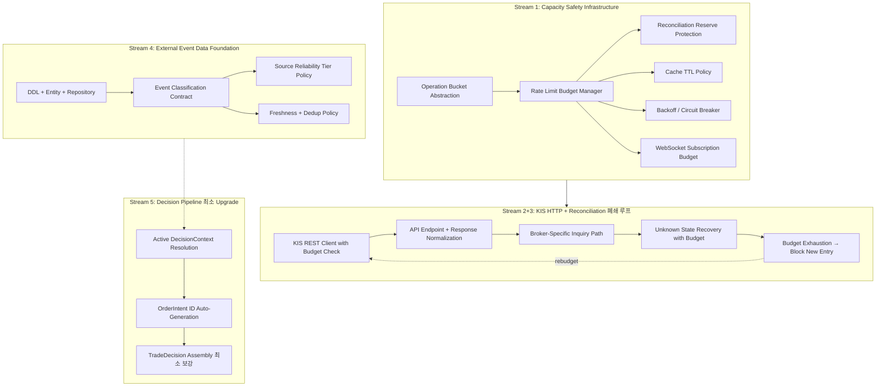

# Milestone 7 — Broker Capacity Safety + External Event Data 기반

## 1. 목적

Milestone 7은 **broker-specific 구현**(KIS adapter)을 완료하면서 동시에 **broker capacity safety 정책**과 **external event data 기반**을 확보하는 계층적 마일스톤이다.

### 1.1 핵심 전제

- Rate limit은 **성능 문제가 아니라 주문 안전성 제약**이다.
- 조회/정산 예산이 고갈되면 주문 상태 확인과 reconciliation이 막히고, 이는 중복 주문·상태 불명확·포지션 불일치로 이어진다.
- 따라서 rate limit 관리는 **throughput 최적화가 아니라 fail-safe 정책**으로 접근한다.

### 1.2 Milestone 6에서 넘어온 항목 (계획 대비 실제 구현 차이)

| 항목 | Milestone 6 계획 | 실제 구현 | M7 처리 |
|------|-----------------|-----------|---------|
| KIS adapter HTTP + Reconciliation resolve | 별도 Stream | stub + trigger/lock만 | **Stream 2+3 (통합 폐쇄 루프)** |
| DecisionOrchestrator | P1 field population stub | pass-through stub | **Stream 5 (최소화)** |
| WebSocket | recovery 지정 | 미구현 | **Stream 2+3 내 gap fill** |

> **핵심 설계 결정:** Stream 2(KIS HTTP)와 Stream 3(Reconciliation)은 분리하지 않는다.
> `submit → normalize → inquiry → reconcile trigger → block/unblock` 경로가 하나의 구현 단위로 동작해야 하며,
> submit path만 열리고 recovery path가 비어 있는 상태를 방지한다.

---

## 2. 작업 의존성 그래프



---

## 3. Stream 상세

### Stream 1: Capacity Safety Infrastructure

#### 1-a. Operation Bucket 모델 정의

**신규 파일:** [`src/agent_trading/brokers/rate_limit.py`](src/agent_trading/brokers/rate_limit.py)

```python
@dataclass(slots=True, frozen=True)
class OperationBucket:
    """단일 operation 유형의 rate limit budget."""
    bucket_type: BucketType      # ORDER / INQUIRY / RECONCILIATION / MARKET_DATA / AUTH
    capacity: int                # 최대 토큰 수
    refill_rate: float           # 초당 refill 토큰 수
    remaining: int               # 현재 잔여 토큰
    refill_at: datetime          # 다음 refill 시각

class BucketType(str, Enum):
    AUTH = "auth"
    ORDER = "order"
    INQUIRY = "inquiry"
    RECONCILIATION = "reconciliation"
    MARKET_DATA = "market_data"
```

**핵심 정책:**
- ORDER / INQUIRY / RECONCILIATION 버킷은 **완전 분리** — reconciliation 예산이 order 호출에 소진되지 않음
- RECONCILIATION 버킷은 **reserve 모드** — 일반 조회에 사용 불가
- AUTH 버킷은 single-flight + 최소 capacity 유지

#### 1-b. RateLimitBudgetManager

**신규 파일:** [`src/agent_trading/brokers/rate_limit.py`](src/agent_trading/brokers/rate_limit.py)

```python
class RateLimitBudgetManager:
    """세션별 rate limit 예산 관리.
    
    - 버킷별 토큰 소진/refill
    - reconciliation reserve 보호
    - universe shrink trigger
    """
    
    def __init__(self, session_id: UUID, config: RateLimitProfile) -> None: ...
    
    async def try_consume(
        self, bucket: BucketType, tokens: int = 1
    ) -> bool: ...
    
    async def reserve_reconciliation(
        self, tokens: int
    ) -> bool: ...
    
    @property
    def can_accept_new_entries(self) -> bool: ...
    
    @property
    def reconciliation_reserve_remaining(self) -> float: ...
    
    async def shrink_universe(self, factor: float) -> None: ...
```

#### 1-c. Cache TTL Policy

**변경 파일:** [`src/agent_trading/brokers/base.py`](src/agent_trading/brokers/base.py) 또는 신규 정책 파일

데이터 유형별 TTL 정책 (구체적 수치는 `BrokerCapability.rate_limit_profile`에서 관리):

| 데이터 | TTL 권장 | 비고 |
|--------|---------|------|
| instrument master | 1시간 | 길게 |
| trading session | 30초 | 짧게 |
| quote snapshot | 매우 짧음 (1~5초) | 신규 주문 직전 freshness 확인 필수 |
| account snapshot | 10초 | 주문 직전 캐시 무효화 |
| position | 30초 | reconciliation 시 새 조회 |
| cash balance | 30초 | reconciliation 시 새 조회 |

**원칙:**
- stale cache로 신규 주문 금지
- cache miss보다 stale cache가 더 위험한 데이터는 강한 freshness 검증

#### 1-d. Backoff / Circuit Breaker

**신규 파일:** [`src/agent_trading/brokers/backoff.py`](src/agent_trading/brokers/backoff.py)

operation별 backoff 정책:

| Error 유형 | Backoff 전략 | Circuit Open 조건 |
|-----------|-------------|-------------------|
| 429 Rate Limit | exponential + jitter | 연속 5회 초과 |
| Auth 실패 | linear (고정 간격) | 연속 3회 실패 |
| Network Timeout | exponential | 연속 3회 타임아웃 |
| Broker Maintenance | 즉시 open | maintenance header 감지 |
| Unknown State 급증 | N/A | 1분内 3건 이상 → 신규 진입 중단 |

Circuit Open 시 행동:
1. 신규 진입 주문 차단
2. 위험 축소 주문만 제한적 허용
3. reconciliation 우선 수행
4. 모니터링 메트릭 전송

#### 1-e. WebSocket Subscription Budget

**변경 파일:** [`src/agent_trading/brokers/base.py`](src/agent_trading/brokers/base.py)

```python
@dataclass(slots=True, frozen=True)
class SubscriptionBudget:
    max_subscriptions: int
    critical_limit: int         # critical subscription 상한
    optional_limit: int         # optional subscription 상한
    current_critical: int = 0
    current_optional: int = 0
```

**핵심 정책:**
- CRITICAL: 보유 종목 + 미체결 주문 종목 + 진입 후보 상위 N개
- OPTIONAL: watchlist 하위 후보 + 비보유 관찰 종목
- budget 초과 시 **optional부터 제거**
- gap fill용 REST 예산은 별도 유지

---

### Stream 2+3: KIS HTTP + Reconciliation 폐쇄 루프

> **설계 원칙:** `submit → normalize → inquiry → reconcile trigger → block/unblock` 경로를 하나의 구현 단위로 다룬다.
> submit path만 열리고 recovery path가 비어 있는 상태를 방지한다.

#### 2+3-a. KIS REST Client with Budget Check

**신규 파일:** [`src/agent_trading/brokers/koreainvestment/rest_client.py`](src/agent_trading/brokers/koreainvestment/rest_client.py)

- `httpx.AsyncClient` 기반
- `RateLimitBudgetManager.try_consume()` 통합 — 각 REST 호출 전 budget 검증
- Access token 갱신 (single-flight, AUTH bucket 사용)
- Approval key 관리
- Response raw payload 저장 (audit trail)

#### 2+3-b. API Endpoint Mapping + Response Normalization

**변경 파일:** [`src/agent_trading/brokers/koreainvestment/adapter.py`](src/agent_trading/brokers/koreainvestment/adapter.py)

KIS API 매핑 테이블:

| Operation | KIS Endpoint | Bucket |
|-----------|-------------|--------|
| submit_order | `/uapi/domestic-stock/v1/trading/order-cash` | ORDER |
| cancel_order | `/uapi/domestic-stock/v1/trading/order-revise` | ORDER |
| amend_order | `/uapi/domestic-stock/v1/trading/order-revise` | ORDER |
| get_order_status | `/uapi/domestic-stock/v1/trading/inquire-psbl-rvsecncl` | INQUIRY |
| get_positions | `/uapi/domestic-stock/v1/trading/inquire-balance` | INQUIRY |
| get_cash_balance | `/uapi/domestic-stock/v1/trading/inquire-psbl-order` | INQUIRY |
| get_quote | `/uapi/domestic-stock/v1/quotations/inquire-price` | MARKET_DATA |
| get_orderbook | `/uapi/domestic-stock/v1/quotations/inquire-asking-price-exp-ccn` | MARKET_DATA |

KIS 응답 코드 → `SubmitOrderResult` 매핑:

| KIS 응답 조건 | `accepted` | `uncertain` | `requires_reconciliation` | `normalized_status` |
|--------------|-----------|------------|-------------------------|-------------------|
| 정상 접수 (주문번호 있음) | True | False | False | PENDING_SUBMIT |
| 주문번호 있으나 응답 지연 | True | True | False | PENDING_SUBMIT |
| 응답 없음 / 타임아웃 | False | True | True | RECONCILE_REQUIRED |
| 명시 거절 (사유 코드 있음) | False | False | False | REJECTED |
| HTTP 429 | False | False | True | RECONCILE_REQUIRED |
| HTTP 5xx | False | True | True | RECONCILE_REQUIRED |
| 이상 상태 코드 (unknown) | False | True | True | RECONCILE_REQUIRED |

실제 endpoint 경로는 KIS 문서 최신 버전 기준 (`reference_docs/한국투자증권_오픈API_전체문서_20260503_030000.xlsx`)으로 확정.

#### 2+3-c. Broker-Specific Inquiry + Unknown State Recovery

**변경 파일:** [`src/agent_trading/services/reconciliation_service.py`](src/agent_trading/services/reconciliation_service.py)

```python
async def resolve_unknown_state(
    self,
    order: OrderRequestEntity,
    broker_adapter: BrokerAdapter,
    account_ref: str,
) -> ReconciliationResult:
    """1. Check RECONCILIATION budget → 부족 시 escalate
       2. Call broker_adapter.get_order_status() (INQUIRY bucket)
       3. Map response → KNOWN/UNKNOWN/UNCERTAIN
       4. If KNOWN → transition order + release lock
       5. If UNKNOWN → keep lock + escalate + block new entries on same account/strategy/symbol/side
       6. If UNCERTAIN → keep lock + retry with backoff (up to N times)
    """
```

#### 2+3-d. Budget Exhaustion → Block New Entry

**변경 파일:** [`src/agent_trading/services/order_manager.py`](src/agent_trading/services/order_manager.py)

`submit_order_to_broker()` 진입 전:

```python
async def submit_order_to_broker(self, ...):
    # --- Inquiry budget check before submission ---
    if not await self.rate_limit_budget.can_accept_new_entries:
        raise BudgetExhaustedError(
            "Inquiry budget insufficient for safe order submission. "
            "Resolve unknown states before placing new orders."
        )
    ...
```

**Trigger-Action 테이블:**

| Trigger | Action |
|---------|--------|
| INQUIRY budget < 20% | Universe 축소, quote polling 완화, 신규 진입 보수화 |
| RECONCILIATION reserve < 50% | 신규 진입 차단, open order 확인만 수행 |
| Unknown state 발생 후 budget 부족 | 동일 account/strategy/symbol/side lock 유지 |
| INQUIRY budget 고갈 + 미확인 주문 존재 | 재주문 차단, broker 응답 불명확 상태에서 order bucket 잔여도 무시 |

---

### Stream 4: External Event Data Foundation

#### 4-a. Event Classification Schema (DB Migration 0006)

**신규 마이그레이션:** [`db/migrations/0006_add_external_event_data.sql`](db/migrations/0006_add_external_event_data.sql)

```sql
CREATE TABLE trading.external_events (
    event_id            UUID PRIMARY KEY DEFAULT gen_random_uuid(),
    event_type          TEXT NOT NULL,         -- earnings, disclosure_material, trading_halt, etc.
    source_name         TEXT NOT NULL,         -- opendart, krx_kind, news_provider, etc.
    source_reliability_tier TEXT NOT NULL,     -- T1 / T2 / T3 / T4
    source_event_id     TEXT,                  -- 원천 시스템의 event ID (dedup key)
    issuer_code         TEXT,                  -- 종목 코드 (corp code / symbol)
    symbol              TEXT,
    market              TEXT,
    published_at        TIMESTAMPTZ NOT NULL,
    ingested_at         TIMESTAMPTZ NOT NULL DEFAULT now(),
    effective_at        TIMESTAMPTZ,           -- 실제 효력 발생 시각
    severity            TEXT,                  -- low / medium / high / critical
    direction           TEXT,                  -- positive / negative / neutral
    headline            TEXT,
    body_summary        TEXT,
    raw_payload_uri     TEXT,                  -- 원문 저장소 참조
    dedup_key_hash      TEXT,                  -- 중복 탐지용 hash
    supersedes_event_id UUID REFERENCES trading.external_events(event_id),  -- 정정/대체 관계
    metadata            JSONB NOT NULL DEFAULT '{}',
    created_at          TIMESTAMPTZ NOT NULL DEFAULT now()
);

CREATE INDEX idx_external_events_symbol ON trading.external_events (symbol, published_at DESC);
CREATE INDEX idx_external_events_type ON trading.external_events (event_type, published_at DESC);
CREATE INDEX idx_external_events_dedup ON trading.external_events (dedup_key_hash);
CREATE INDEX idx_external_events_source ON trading.external_events (source_name, source_event_id);
```

#### 4-b. Entity 정의

**신규 파일:** [`src/agent_trading/domain/entities.py`](src/agent_trading/domain/entities.py) (내부 추가)

```python
@dataclass(slots=True, frozen=True)
class ExternalEventEntity:
    event_id: UUID
    event_type: str
    source_name: str
    source_reliability_tier: str          # T1/T2/T3/T4
    source_event_id: str | None
    issuer_code: str | None
    symbol: str | None
    market: str | None
    published_at: datetime
    ingested_at: datetime
    effective_at: datetime | None
    severity: str
    direction: str
    headline: str | None
    body_summary: str | None
    raw_payload_uri: str | None
    dedup_key_hash: str | None
    supersedes_event_id: UUID | None
    metadata: dict[str, Any]
```

#### 4-c. Source Reliability Tier

**신규 파일:** [`src/agent_trading/domain/enums.py`](src/agent_trading/domain/enums.py) (내부 추가)

```python
class SourceReliabilityTier(str, Enum):
    T1_REGULATORY = "T1"     # OpenDART, KRX KIND, government
    T2_INSTITUTIONAL = "T2"  # Broker reports, exchange data
    T3_MEDIA = "T3"          # News, media, aggregator
    T4_LOW_CONFIDENCE = "T4" # Experimental, unverified
```

#### 4-d. Repository Protocol

**신규 추가:** [`src/agent_trading/repositories/contracts.py`](src/agent_trading/repositories/contracts.py)

```python
class ExternalEventRepository(Protocol):
    async def add(self, event: ExternalEventEntity) -> ExternalEventEntity: ...
    async def get(self, event_id: UUID) -> ExternalEventEntity | None: ...
    async def find_by_dedup_key(self, hash: str) -> ExternalEventEntity | None: ...
    async def list_by_symbol(
        self, symbol: str, since: datetime
    ) -> Sequence[ExternalEventEntity]: ...
    async def list_by_type(
        self, event_type: str, since: datetime
    ) -> Sequence[ExternalEventEntity]: ...
```

#### 4-e. Postgres + InMemory 구현

- **신규:** [`src/agent_trading/repositories/postgres/external_events.py`](src/agent_trading/repositories/postgres/external_events.py) — `PostgresExternalEventRepository`
- **신규:** In-memory 구현 (`InMemoryExternalEventRepository`) — `memory.py` 내부
- **변경:** [`src/agent_trading/repositories/container.py`](src/agent_trading/repositories/container.py) — `external_events` 필드 추가
- **변경:** Bootstrap — Postgres/InMemory 등록

#### 4-f. Dedup 정책

의사결정 트리:

```python
async def _dedup_event(event: ExternalEventEntity) -> DedupDecision:
    """1. source_event_id + source_name 으로 정확 일치 확인
       2. 없으면 dedup_key_hash 일치 확인
       3. 없으면 headline normalization hash 확인
       4. supersedes 관계 확인 (정정/대체)
       5. T1 source의 정정 이벤트는 원본을 덮어쓰지 않고 supersede relation 저장
    """
```

#### 4-g. Freshness Budget

```python
FRESHNESS_BUDGET: dict[str, timedelta] = {
    "news_breaking": timedelta(minutes=1),
    "disclosure_material": timedelta(minutes=5),
    "macro_release": timedelta(seconds=30),
    "broker_report_change": timedelta(hours=1),
}
```

- budget 초과 이벤트는 `stale`로 표시
- stale 이벤트는 신규 진입 근거에서 제외
- replay 시 당시 stale 여부도 재현

> **v1 제외 (Stream 4 범위 밖):** 실제 OpenDART/KRX API polling worker, 실제 뉴스 피드 연결, source별 adapter 구현, AI 기반 이벤트 해석, RAG/Embedding storage

---

### Stream 5: Decision Pipeline 최소 Upgrade

#### 5-a. DecisionOrchestratorService — 최소 보강

**변경 파일:** [`src/agent_trading/services/decision_orchestrator.py`](src/agent_trading/services/decision_orchestrator.py)

현재 pass-through stub에서 **최소 보강**:

```python
class DecisionOrchestratorService:
    """Minimal P1 field assembly (Milestone 7).
    
    Milestone 6: pass-through stub — 외부 주입 ID를 그대로 반환
    Milestone 7: active context resolution + ID generation + minimal assembly
    
    유지되는 제한:
    - No LLM orchestration
    - No portfolio calculation
    - No AI risk/compliance evaluation
    """
    
    repos: RepositoryContainer
    
    async def assemble(
        self,
        request: SubmitOrderRequest,
        *,
        decision_context_id: UUID | None = None,
        order_intent_id: UUID | None = None,
    ) -> OrderIntent:
        """1. decision_context_id가 없으면 repos.decision_contexts에서 active context 조회
           2. order_intent_id가 없으면 uuid4() 자동 생성
           3. TradeDecisionEntity 조립 (P0 필드 + 기본 P1 필드만)
           4. repos.trade_decisions.add()로 persist
           5. OrderIntent 반환
        """
```

> **Stream 5 제한:** Decision pipeline 고도화(LLM, portfolio, AI risk/compliance)는 이번 범위 밖.

---

## 4. 변경 파일 요약

### 신규 생성 (10개)

| 파일 | Stream | 설명 |
|------|--------|------|
| `src/agent_trading/brokers/rate_limit.py` | 1 | OperationBucket, RateLimitBudgetManager |
| `src/agent_trading/brokers/backoff.py` | 1 | Backoff 전략, Circuit Breaker |
| `src/agent_trading/brokers/koreainvestment/rest_client.py` | 2+3 | KIS REST HTTP client with budget check |
| `src/agent_trading/brokers/koreainvestment/websocket_client.py` | 2+3 | KIS WebSocket + gap fill |
| `db/migrations/0006_add_external_event_data.sql` | 4 | external_events 테이블 |
| `src/agent_trading/domain/events.py` | 4 | ExternalEventEntity, enums |
| `src/agent_trading/repositories/postgres/external_events.py` | 4 | PostgresExternalEventRepository |
| `tests/brokers/test_kis_rate_limit.py` | 1 | Rate limit budget 단위 테스트 |
| `tests/brokers/test_kis_rest_client.py` | 2+3 | REST client + closed loop 테스트 |
| `tests/repositories/test_postgres_external_events.py` | 4 | External event repo 테스트 |

### 수정 (11개)

| 파일 | Stream | 변경 내용 |
|------|--------|----------|
| `src/agent_trading/brokers/base.py` | 1 | SubscriptionBudget dataclass 추가 |
| `src/agent_trading/brokers/koreainvestment/adapter.py` | 2+3 | REST client 사용, 정규화 + ambiguous state 매핑 |
| `src/agent_trading/services/reconciliation_service.py` | 2+3 | resolve_unknown_state() 추가, budget-aware mark_resolved() |
| `src/agent_trading/services/order_manager.py` | 2+3 | Budget check before submit + budget exhaustion block |
| `src/agent_trading/services/decision_orchestrator.py` | 5 | Active context resolution + ID generation + minimal assembly |
| `src/agent_trading/domain/enums.py` | 4 | SourceReliabilityTier, BucketType, EventType 추가 |
| `src/agent_trading/domain/entities.py` | 4 | ExternalEventEntity 추가 |
| `src/agent_trading/repositories/contracts.py` | 4 | ExternalEventRepository protocol |
| `src/agent_trading/repositories/container.py` | 4 | external_events 필드 |
| `src/agent_trading/repositories/memory.py` | 4 | InMemoryExternalEventRepository |
| `src/agent_trading/repositories/postgres/bootstrap.py` | 4 | PostgresExternalEventRepository 등록 |

---

## 5. 테스트 전략

| Stream | 테스트 유형 | 비고 |
|--------|-----------|------|
| 1 | 단위 + 통합 | Token bucket 분리, reserve 보호, budget exhaustion trigger |
| 2+3 | 단위 + 통합 | Mock HTTP → 각 ambiguous state → inquiry → block 폐쇄 루프 |
| 4 | 단위 + 통합 | DDL mig, entity 저장/조회, dedup 정책, freshness 검증 |
| 5 | 단위 | Active context resolution, ID generation, minimal assembly |

### Smoke Test

```
order_budget 차감 → submit (via KIS REST) → 응답 정규화
                → uncertain/requires_reconciliation → inquiry budget 사용
                → state 확인 → resolved or escalate
                → reconciliation reserve depletion → 신규 진입 차단 검증
```

---

## 6. 완료 기준 (Exit Criteria)

| # | 기준 | 검증 방법 | Stream |
|---|------|----------|--------|
| 1 | broker rate limit이 **주문 안전성 정책**으로 코드에 반영됨 (단순 throughput 제한이 아님) | 코드 리뷰 + 단위 테스트 | 1 |
| 2 | ORDER / INQUIRY / RECONCILIATION 버킷이 실제로 분리되어 reconciliation reserve가 일반 조회에 소진되지 않음 | 단위 테스트 + 통합 테스트 | 1 |
| 3 | INQUIRY budget exhaustion 시 신규 진입 차단 또는 universe 축소 경로가 존재함 | 통합 테스트 | 2+3 |
| 4 | KIS adapter HTTP 구현: submit → normalize → inquiry → reconcile trigger → block/unblock closed loop가 최소 동작함 | Smoke test (paper loop) | 2+3 |
| 5 | Unknown state recovery가 budget-aware하게 동작 (reconciliation reserve 확인 후 inquiry) | 단위 테스트 | 2+3 |
| 6 | External event data foundation이 schema/entity/repository/contract 수준으로 준비됨 | Postgres 통합 테스트 | 4 |
| 7 | 모든 기존 테스트 137/137 통과 유지 | CI | - |

---

## 7. 제외 항목 (별도 마일스톤)

| 항목 | 사유 | 예상 마일스톤 |
|------|------|--------------|
| 실제 OpenDART/KRX API polling worker | 외부 연동, 별도 검증 필요 | M8 |
| 실제 뉴스 피드 연결 | 라이선스 검토 + source adapter 필요 | M8 |
| Full LLM orchestration | AI decision layer 전체 필요 | M8+ |
| AI risk / compliance agent | AI pipeline 필요 | M8+ |
| broker_api_call_log | 관측성, 우선순위 낮음 | M8+ |
| market_data_quality_event | 관측성, 우선순위 낮음 | M8+ |
| Replay Engine 전체 구현 | Config replay semantics만 처리 | M8+ |
| EntryStyle routing (VWAP/TWAP) | Order Construction Agent 필요 | M8+ |
| RAG/Embedding storage | AI pipeline 이후 | M9+ |

---

## 8. 리스크 및 고려사항

### 8.1 KIS API 문서 의존성
- KIS endpoint 경로, rate limit 값은 실제 문서 기준으로 확정 필요
- 현재 `reference_docs/`에 있는 Excel 문서 (`한국투자증권_오픈API_전체문서_20260503_030000.xlsx`) 기준

### 8.2 Rate Limit 값 추정
- KIS의 실제 rate limit 값은 문서화되어 있지 않을 수 있음
- v1에서는 **보수적 기본값** + 운영 튜닝으로 접근

### 8.3 WebSocket 안정성
- KIS WebSocket 재접속 정책, event ordering, gap detection은 실제 테스트 필요

### 8.4 Event Data 라이선스
- 뉴스/리포트 데이터는 사용 권한 범위를 명확히 확인 필요
- v1에서는 OpenDART + KRX KIND 등 무료 공식 소스에 집중

---

## 9. Milestone 7 → 8 연결

Milestone 7 완료 후 시스템 상태:

```
                         ┌─────────────────────┐
                         │   KIS HTTP Adapter   │
                         │   + Rate Limit Safe  │
                         │   + WebSocket Events │
                         └──────────┬──────────┘
                                    │
            ┌───────────────────────┼───────────────────────┐
            ▼                       ▼                       ▼
   ┌────────────────┐   ┌────────────────────┐   ┌──────────────────┐
   │  Reconciliation │   │  External Events   │   │  Decision        │
   │  + Unknown State│   │  + Dedup + Fresh   │   │  Orchestrator    │
   │  + Budget Aware │   │  + Source Tier     │   │  (P1 Stub)       │
   └────────────────┘   └────────────────────┘   └──────────────────┘
            │                       │                       │
            └───────────┬───────────┴───────────┬───────────┘
                        ▼                       ▼
               ┌─────────────────┐   ┌────────────────────┐
               │  Replay Engine  │   │  AI Decision       │
               │  (M8+)          │   │  Layer (M8+)       │
               └─────────────────┘   └────────────────────┘
```
