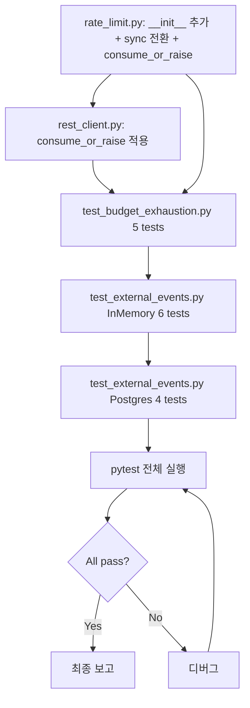

# Milestone 7 — 3가지 버그 수정 및 테스트 보강 계획

## 설계 결정: Budget API 계약 정리

### 현재 문제점
1. [`BudgetExhaustedError`](src/agent_trading/brokers/rate_limit.py:103)에 `__init__`이 없어 `order_manager.py`의 keyword argument 호출이 `TypeError` 발생
2. [`RateLimitBudgetManager.try_consume()`](src/agent_trading/brokers/rate_limit.py:209)이 `async def`지만 메모리 연산이므로 sync가 자연스러움
3. [`KISRestClient`](src/agent_trading/brokers/koreainvestment/rest_client.py)에서 `await` 누락 + 반환값 무시로 budget exhaustion이 silently 무시됨

### 수정 방향

| 메서드 | 변경 전 | 변경 후 |
|--------|---------|---------|
| `RateLimitBudgetManager.try_consume()` | `async def`, bool 반환 | **sync**, bool 반환 유지 |
| `RateLimitBudgetManager.consume_or_raise()` | 없음 | **신규**: sync, `try_consume()` 호출 후 False면 `BudgetExhaustedError` raise |
| `RateLimitBudgetManager.reserve_reconciliation()` | `async def`, bool 반환 | **sync**, bool 반환 유지 |
| `RateLimitBudgetManager.reserve_reconciliation_or_raise()` | 없음 | **신규**: sync, False면 `BudgetExhaustedError` raise |
| `BudgetExhaustedError.__init__()` | 없음 (RuntimeError 기본) | **신규**: `(self, bucket, message)` |

### 호출자 변경

| 호출자 | 현재 | 변경 |
|--------|------|------|
| `rest_client.py:authenticate()` | `try_consume(AUTH)` await+반환 무시 | `consume_or_raise(AUTH)` |
| `rest_client.py:get_approval_key()` | `try_consume(AUTH)` await+반환 무시 | `consume_or_raise(AUTH)` |
| `rest_client.py:submit_order()` | `try_consume(ORDER)` await+반환 무시 | `consume_or_raise(ORDER)` |
| `rest_client.py:cancel_order()` | `try_consume(ORDER)` await+반환 무시 | `consume_or_raise(ORDER)` |
| `rest_client.py:get_order_status()` | `try_consume(INQUIRY)` await+반환 무시 | `consume_or_raise(INQUIRY)` |
| `rest_client.py:get_fills()` | `try_consume(INQUIRY)` await+반환 무시 | `consume_or_raise(INQUIRY)` |
| `rest_client.py:get_positions()` | `try_consume(INQUIRY)` await+반환 무시 | `consume_or_raise(INQUIRY)` |
| `rest_client.py:get_cash_balance()` | `try_consume(INQUIRY)` await+반환 무시 | `consume_or_raise(INQUIRY)` |
| `rest_client.py:resolve_unknown_state()` | `get_order_status()` 호출, `BudgetExhaustedError` catch → `reserve_reconciliation()` | 동일하나 `reserve_reconciliation_or_raise()`로 변경 |
| `rest_client.py:get_quote()` | `try_consume(MARKET_DATA)` await+반환 무시 | `consume_or_raise(MARKET_DATA)` |
| `rest_client.py:get_orderbook()` | `try_consume(MARKET_DATA)` await+반환 무시 | `consume_or_raise(MARKET_DATA)` |
| `order_manager.py:create_order()` | `BudgetExhaustedError(bucket=, message=)` TypeError | 정상 동작 (`BudgetExhaustedError.__init__` 추가됨) |

---

## 작업 목록

### Fix 1: BudgetExhaustedError + Budget API 정리

#### 1-a. `rate_limit.py`
- `BudgetExhaustedError.__init__(self, bucket: str, message: str = "")` 추가
- `RateLimitBudgetManager.try_consume()` → `async` 제거 (sync)
- `RateLimitBudgetManager.consume_or_raise(bucket, tokens=1)` → 신규, `try_consume()` 호출 후 False면 raise
- `RateLimitBudgetManager.reserve_reconciliation()` → `async` 제거 (sync)
- `RateLimitBudgetManager.reserve_reconciliation_or_raise(tokens=1)` → 신규

#### 1-b. `rest_client.py`
- 모든 `try_consume()` 호출 → `consume_or_raise()`로 대체
- `resolve_unknown_state()`: `reserve_reconciliation()` → `reserve_reconciliation_or_raise()`로 변경
- `KISRestClient`는 이제 `async` 메서드가 `consume_or_raise()`를 호출 (sync 호출이므로 await 불필요)

### Fix 2: Budget exhaustion 테스트 (`tests/brokers/test_budget_exhaustion.py`)

#### 2-a. `test_create_order_blocks_when_inquiry_exhausted`
- `RateLimitBudgetManager(inquiry_capacity=1, inquiry_refill_rate=0)` 생성
- inquiry 1회 consume으로 utilization < 20% 만듦
- `OrderManager(budget_manager=...)` 생성, `create_order()` 호출 → `BudgetExhaustedError`
- 에러 메시지에 `inquiry_utilization` 포함 확인

#### 2-b. `test_create_order_blocks_when_reconciliation_exhausted`
- reconciliation bucket 1회 consume으로 utilization < 50% 만듦
- `create_order()` 호출 → `BudgetExhaustedError`
- 에러 메시지에 `reconciliation_utilization` 포함 확인

#### 2-c. `test_create_order_allows_when_budget_healthy`
- budget 정상 (inquiry=100%, reconciliation=100%)
- `OrderManager.create_order()` → 정상적으로 `OrderRequestEntity` 반환

#### 2-d. `test_kis_inquiry_fallback_to_reconciliation_reserve`
- inquiry_capacity=0인 `KISRestClient` 생성
- `resolve_unknown_state()` 호출
  - `get_order_status()` → `consume_or_raise(INQUIRY)` → `BudgetExhaustedError`
  - catch → `reserve_reconciliation_or_raise(1)` → 성공
  - `OrderStatusResult(RECONCILE_REQUIRED)` 반환

#### 2-e. `test_kis_reserve_exhausted_recovery_fails`
- inquiry_capacity=0, reconciliation_capacity=0
- `resolve_unknown_state()` 호출
  - `consume_or_raise(INQUIRY)` → `BudgetExhaustedError`
  - catch → `reserve_reconciliation_or_raise(1)` → `BudgetExhaustedError`
  - 예외 전파 → caller가 `BudgetExhaustedError` 받음

### Fix 3: External event foundation 테스트 (`tests/repositories/test_external_events.py`)

#### 3-a. InMemory: `test_add_and_get`
- `ExternalEventEntity` 생성 → `add()` → `get(event_id)` → 동일 객체 반환 확인

#### 3-b. InMemory: `test_get_nonexistent`
- 존재하지 않는 event_id → `None` 반환

#### 3-c. InMemory: `test_find_by_dedup_key`
- dedup_key_hash 설정한 이벤트 추가 → `find_by_dedup_key()`로 조회 → 일치 확인

#### 3-d. InMemory: `test_find_by_dedup_key_nonexistent`
- 존재하지 않는 dedup_key_hash → `None`

#### 3-e. InMemory: `test_list_by_symbol`
- symbol="005930" 이벤트 2개, symbol="000660" 이벤트 1개 추가
- `list_by_symbol("005930", since)` → 2개 반환, published_at 내림차순

#### 3-f. InMemory: `test_list_by_type`
- event_type="공시" 이벤트 2개, event_type="뉴스" 이벤트 1개 추가
- `list_by_type("공시", since)` → 2개 반환

#### 3-g. Postgres: `test_postgres_add_and_get`
- `seeded_postgres_data` fixture 사용
- `PostgresExternalEventRepository.add()` → `get()` → 일치 확인

#### 3-h. Postgres: `test_postgres_find_by_dedup_key`
- dedup_key_hash 조회

#### 3-i. Postgres: `test_postgres_list_by_symbol`
- symbol 조회

#### 3-j. Postgres: `test_postgres_list_by_type`
- type 조회

---

## 실행 순서

## 변경 파일 요약

| 파일 | 작업 |
|------|------|
| `src/agent_trading/brokers/rate_limit.py` | BudgetExhaustedError.__init__, sync 전환, consume_or_raise 추가 |
| `src/agent_trading/brokers/koreainvestment/rest_client.py` | consume_or_raise 적용, reserve_reconciliation_or_raise 적용 |
| `tests/brokers/test_budget_exhaustion.py` | 신규, 5개 테스트 |
| `tests/repositories/test_external_events.py` | 신규, InMemory 6 + Postgres 4 테스트 |
