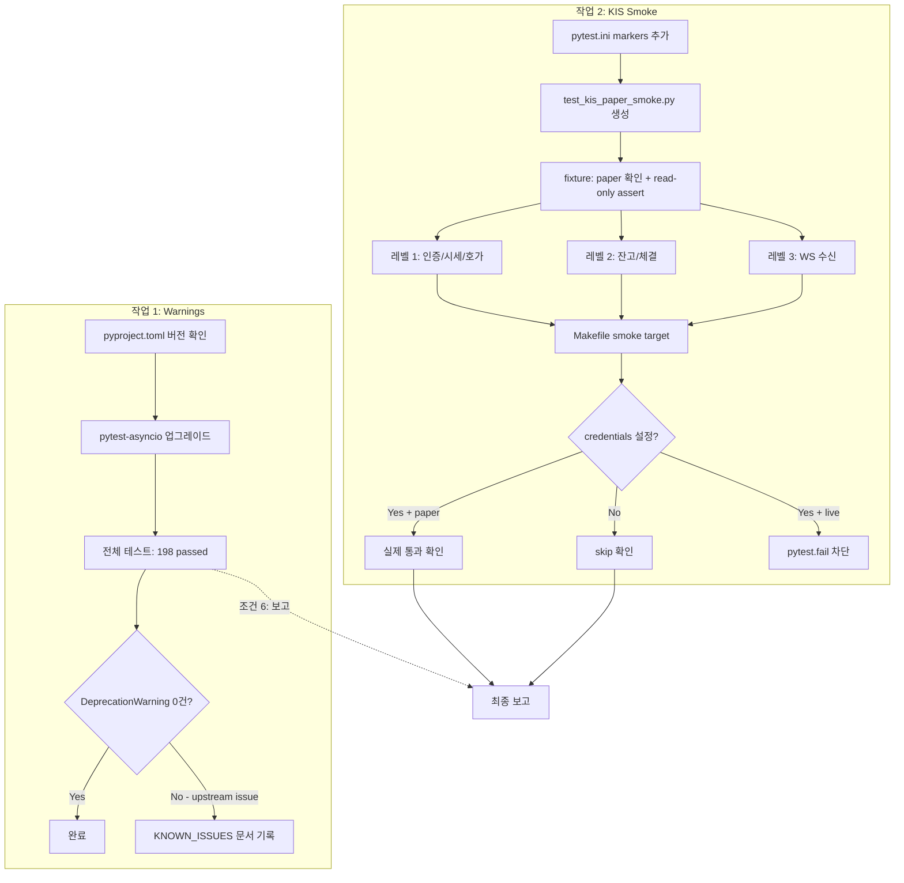

# Post-Milestone 8 계획

> **승인 조건 (6가지)**
> 1. pytest-asyncio 경고는 버전 업그레이드 우선; upstream 문제로 잔여 경고는 documented known issue로 분리
> 2. KIS smoke는 **read-only만** 수행 (인증, 시세/호가, 잔고/체결 조회, WS 수신 확인). 주문 제출 금지
> 3. smoke는 **paper credential만** 허용; live credential 감지 시 명시적 차단 (skip ❌)
> 4. skip 조건은 KIS_API_KEY 단일이 아닌 **필수 credential 전체 세트** 기준
> 5. WS smoke 통과 조건: 단순 connect ❌ → **ack 또는 데이터 1건 이상 수신**
> 6. 작업 후 전체 테스트 198 passed 유지 + warnings 변화량 보고

## 개요

Milestone 8 (KIS REST 실전화 + WebSocket + 실시간 이벤트 루프)이 198 passed, 0 failed로 완료됨.
다음 단계로 아래 두 가지 작업을 진행:

1. **pytest_asyncio deprecation warnings 정리**
2. **실제 KIS paper/sandbox 연동 smoke 검증**

---

## 작업 1: pytest_asyncio Deprecation Warnings 정리

### 문제

Python 3.14.4에서 `pytest-asyncio` 플러그인이 아래 deprecated API를 사용:
- `asyncio.get_event_loop_policy()` — Python 3.16에서 제거 예정
- `asyncio.set_event_loop_policy()` — Python 3.16에서 제거 예정

현재 약 19,068개의 warnings가 발생.

### 분석

`pytest.ini`:
```ini
[pytest]
asyncio_mode = auto
testpaths = tests
```

`pyproject.toml`에서 pytest-asyncio 버전 확인 필요. Python 3.14 호환 버전으로 업그레이드 필요.

### 조건 1: upstream 문제 시 documented known issue

업그레이드 후에도 `pytest-asyncio` 플러그인 내부의 deprecated API 사용으로 인한 경고가 남으면:
- `KNOWN_ISSUES.md` (또는 기존 문서)에 기록
- 경고 억제(`-W ignore::DeprecationWarning`)는 최후 수단으로만 사용

### Todo

1. [`pyproject.toml`](pyproject.toml)에서 `pytest-asyncio` 의존성 버전 확인
2. 최신 `pytest-asyncio` (>= 0.25)로 업그레이드 (Python 3.14 호환)
3. `pytest.ini`에 `asyncio_mode = auto` 유지 + `filterwarnings` 설정 검토
4. 업그레이드 후 전체 테스트 실행하여 198 passed 유지 확인
5. Deprecation warning 0건 확인 (`-W error::DeprecationWarning`)
6. 잔여 경로가 upstream issue면 documented known issue로 등록

### 위험 요소

- `pytest-asyncio` 최신 버전이 Python 3.14를 완전 지원하지 않을 수 있음
- `asyncio_mode = auto`가 최신 버전에서 동작 방식 변경 가능
- 테스트 실패 시 이전 버전으로 롤백

---

## 작업 2: 실제 KIS Paper/Sandbox 연동 Smoke 검증

### 목적

실제 KIS API (모의투자/paper 환경)에 연결하여 **read-only** 작업 검증:
1. 접근토큰 발급 (`/oauth2/tokenP`)
2. WebSocket 접속키 발급 (`/oauth2/Approval`)
3. 주식현재가 시세 조회 (`/uapi/domestic-stock/v1/quotations/inquire-price`)
4. 주식호가 조회 (`/uapi/domestic-stock/v1/quotations/inquire-asking-price-exp-option`)
5. 주식잔고조회 (`/uapi/domestic-stock/v1/trading/inquire-balance`)
6. 주식일별주문체결조회 (`/uapi/domestic-stock/v1/trading/inquire-daily-ccld`)
7. 실시간 WebSocket 데이터 수신 (시세/호가/체결통보)

### 전제 조건

사용자가 `.env` 파일에 KIS API credentials 설정 필요:
```
KIS_API_KEY=your_kis_api_key
KIS_API_SECRET=your_kis_api_secret
KIS_ACCOUNT_NUMBER=your_account_number-01
KIS_ENV=paper
```

### 조건 2: Read-only only
- `submit_order()`, `cancel_order()`, `amend_order()` 호출 금지
- 인증, 시세/호가 조회, 잔고/체결 조회, WS 수신 확인만 허용
- 테스트에 `_read_only_operations` set을 정의하고, 호출 금지 메서드 assert 추가

### 조건 3: Paper credential only; live 차단
- `KIS_ENV`가 `paper`가 아니면 `pytest.fail("Live KIS environment detected; smoke tests are read-only and must not run against live")`
- `skip`이 아니라 **명시적 실패** — 사용자가 잘못 설정한 것을 즉시 알 수 있도록

### 조건 4: 전체 credential 세트 skip 조건
- `skipif` 조건: `not (KIS_API_KEY and KIS_API_SECRET and KIS_ACCOUNT_NUMBER)`
- 세 가지 모두 설정되어야 smoke 테스트 활성화

### 조건 5: WS 통과 = ack 또는 데이터 1건 이상 수신
- `KISWebSocketClient` 연결 + `subscribe("H0STCNT0", "005930")` 호출
- `messages()` async iterator에서 첫 번째 메시지 수신 대기 (timeout: 15초)
- 수신 실패 시 `pytest.fail("WebSocket did not receive any message within 15s")`

### 테스트 전략

#### 레벨 1: 단일 endpoint smoke (최소)
- `KISRestClient` 생성 → `authenticate()` 호출 → token 발급 확인
- `get_approval_key()` 호출 → WS 접속키 발급 확인
- `get_quote("005930", "KRX")` 호출 → 삼성전자 현재가 반환 확인
- `get_orderbook("005930", "KRX")` 호출 → 호가 데이터 반환 확인

#### 레벨 2: 계좌 연동 smoke
- `get_positions()` 호출 → 잔고 목록 반환 확인
- `get_cash_balance()` 호출 → 예수금 반환 확인
- `get_fills()` 호출 → 체결 내역 조회 확인

#### 레벨 3: WebSocket smoke (고급, @pytest.mark.slow)
- `get_approval_key()` 호출 → WS 접속키 발급 확인
- `KISWebSocketClient` 연결 → H0STCNT0/005930 구독
- `messages()`에서 첫 메시지 수신 확인 (ack 또는 데이터)

### 테스트 파일 구조

```python
# tests/smoke/test_kis_paper_smoke.py

import os
import pytest
from agent_trading.brokers.koreainvestment.rest_client import KISRestClient
from agent_trading.brokers.koreainvestment.websocket_client import KISWebSocketClient

_REQUIRED_ENV_VARS = ["KIS_API_KEY", "KIS_API_SECRET", "KIS_ACCOUNT_NUMBER"]
_READ_ONLY_OPS = {"submit_order", "cancel_order", "amend_order"}

def _credentials_configured() -> bool:
    return all(os.getenv(v) for v in _REQUIRED_ENV_VARS)

@pytest.fixture
async def kis_rest_client():
    env = os.getenv("KIS_ENV", "paper")
    if env != "paper":
        pytest.fail(f"Live KIS environment detected: {env}; smoke tests are read-only")

    client = KISRestClient(
        api_key=os.getenv("KIS_API_KEY", ""),
        api_secret=os.getenv("KIS_API_SECRET", ""),
        account_number=os.getenv("KIS_ACCOUNT_NUMBER", ""),
        env=env,
    )
    # Verify no order methods are accidentally called
    for op in _READ_ONLY_OPS:
        assert not hasattr(client, op) or not callable(getattr(client, op, None)), \
            f"Read-only violation: {op} must not be called"

    yield client
    await client.close()


@pytest.mark.smoke
@pytest.mark.skipif(
    not _credentials_configured(),
    reason="KIS_API_KEY, KIS_API_SECRET, KIS_ACCOUNT_NUMBER must all be set"
)
class TestKISPaperSmoke:
    """KIS paper environment read-only smoke tests."""

    async def test_authentication(self, kis_rest_client):
        """접근토큰 발급"""
        token = await kis_rest_client.authenticate()
        assert token and len(token) > 0

    async def test_approval_key(self, kis_rest_client):
        """WebSocket 접속키 발급"""
        key = await kis_rest_client.get_approval_key()
        assert key and len(key) > 0

    async def test_get_quote(self, kis_rest_client):
        """주식현재가 시세 조회 (005930 삼성전자)"""
        quote = await kis_rest_client.get_quote("005930")
        # KIS 응답 필드: stck_prpr (현재가), stck_shrn_iscd (종목코드)
        assert "stck_prpr" in quote or "current_price" in quote

    async def test_get_orderbook(self, kis_rest_client):
        """주식호가 조회 (005930)"""
        ob = await kis_rest_client.get_orderbook("005930")
        assert ob is not None

    async def test_get_positions(self, kis_rest_client):
        """주식잔고조회 (read-only)"""
        positions = await kis_rest_client.get_positions()
        assert isinstance(positions, list)

    async def test_get_cash_balance(self, kis_rest_client):
        """예수금 조회 (read-only)"""
        balance = await kis_rest_client.get_cash_balance()
        assert balance is not None

    async def test_get_fills(self, kis_rest_client):
        """주식일별주문체결조회 (read-only)"""
        fills = await kis_rest_client.get_fills(
            account_ref=os.getenv("KIS_ACCOUNT_NUMBER", ""),
            broker_order_id="",
            from_ts="",
        )
        assert fills is not None

    @pytest.mark.slow
    async def test_websocket_receive(self, kis_rest_client):
        """WebSocket 연결 → 구독 → 첫 메시지 수신 확인 (timeout: 15s)"""
        approval_key = await kis_rest_client.get_approval_key()
        assert approval_key, "Approval key is required for WebSocket"

        ws_client = KISWebSocketClient(
            api_key=os.getenv("KIS_API_KEY", ""),
            api_secret=os.getenv("KIS_API_SECRET", ""),
            approval_key=approval_key,
            env=os.getenv("KIS_ENV", "paper"),
        )

        await ws_client.connect()
        try:
            await ws_client.subscribe("H0STCNT0", "005930", critical=True)
            # Wait for first message (ack or data)
            import asyncio
            async with asyncio.timeout(15):
                async for msg in ws_client.messages():
                    # Any message means the pipeline works
                    assert msg is not None
                    break
        finally:
            await ws_client.disconnect()
```

### 조건 2 보강: submit_order/cancel_order 호출 금지 확인
- fixture에서 `KISRestClient` 객체에 `submit_order`, `cancel_order`, `amend_order` 메서드가 있는지 확인
- `_READ_ONLY_OPS` set으로 관리
- 실수로 호출되면 assertion error 발생

### Todo

1. `pytest.ini`에 `markers` 설정 추가:
   ```ini
   markers =
       smoke: KIS paper/sandbox read-only smoke test
       slow: Time-intensive tests (WebSocket, etc.)
   ```
2. [`tests/smoke/test_kis_paper_smoke.py`](tests/smoke/test_kis_paper_smoke.py) 신규 생성
   - `_REQUIRED_ENV_VARS` = `["KIS_API_KEY", "KIS_API_SECRET", "KIS_ACCOUNT_NUMBER"]`
   - `_credentials_configured()` 함수 — 모두 설정되었는지 확인
   - `kis_rest_client` fixture — paper 확인 + read-only assert + cleanup
   - `TestKISPaperSmoke` 클래스 — 8개 테스트 메서드
   - `test_websocket_receive` — `@pytest.mark.slow` + timeout 15s + 첫 메시지 수신 확인
3. `Makefile`에 `smoke` target 추가:
   ```makefile
   .PHONY: smoke
   smoke:  ## Run KIS paper read-only smoke tests
   	pytest tests/smoke/test_kis_paper_smoke.py -v -m smoke --timeout=30 -W ignore::DeprecationWarning
   ```
4. 실행 검증: credentials 미설정 시 skip 확인
5. (조건부) 사용자 paper credentials 설정 후 실제 통과 확인

### 위험 요소

- KIS API 실제 호출 시 rate limit 소비 (read-only는 inquiry bucket만 사용, 비교적 여유로움)
- 장 시작/마감 시간에 따라 시세 데이터 가용성 다름 (09:00-15:30 KST 외에는 stale 데이터)
- WebSocket smoke 테스트는 15-30초 소요 (연결 + 구독 + 첫 데이터 대기)
- 계좌 미개설 시 positions/balance 테스트 실패 가능
- pytest-asyncio upstream 이슈로 경고가 완전히 제거되지 않을 수 있음

---

## 전체 의존성 그래프



## 실행 순서

| 순서 | 작업 | 비고 |
|------|------|------|
| 1 | pytest-asyncio 버전 업그레이드 | pyproject.toml 수정 |
| 2 | 전체 테스트 실행 + warning 확인 | 198 passed 유지 |
| 3 | pytest.ini markers 추가 | smoke, slow |
| 4 | test_kis_paper_smoke.py 생성 | 조건 2-5 반영 |
| 5 | Makefile smoke target 추가 | |
| 6 | credentials 미설정 시 skip 검증 | |
| 7 | 최종 보고: 198 passed + warnings 변화량 | 조건 6 |
