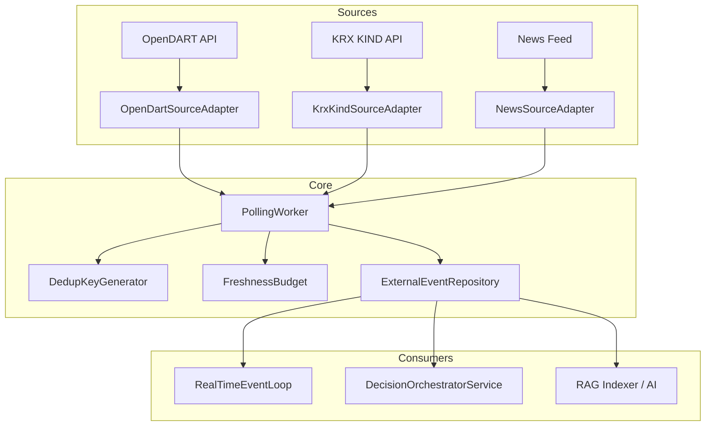
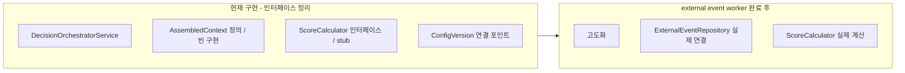

# 3대 우선순위 작업 계획 (v3)

## 전체 작업 순서

1. **Priority 1: KIS paper smoke 검증** — 사용자 credential 제공 후 즉시 실행
2. **Priority 2: External event polling workers + source adapters** — full implementation
3. **Priority 3: DecisionOrchestratorService 고도화 (제한된 범위)** — external event 입력 계약 안정화 후

### 순서 결정 이유

- orchestrator 고도화는 external event 입력 계약이 먼저 안정되어야 재작업이 없음
- external event polling workers 구현 후 event 구조가 확정되면 orchestrator의 event context 연결이 안정적
- orchestrator의 일부 인터페이스 정리/구조 확장은 먼저 가능하지만, event-driven 판단 고도화는 polling workers 이후

---

## Priority 1: KIS Paper Smoke 검증

### 상태
- Smoke 테스트 인프라는 이미 완전히 준비됨 ([`tests/smoke/test_kis_paper_smoke.py`](tests/smoke/test_kis_paper_smoke.py))
- Makefile target `make smoke`, `make smoke-all` 준비
- Read-only guard, paper env check, credential skip guard 모두 적용

### 실행 절차
1. 사용자가 `.env`에 paper credential 설정
2. `make smoke` 실행 (8 tests: auth 2, market data 2, account 3, WS 1 slow)
3. `make smoke-all` 실행 (WS slow test 포함)
4. 실패 시 KIS API 응답 분석 → 수정안 정리

### 필요 credential (paper 전용)
```
KIS_API_KEY=paper_api_key
KIS_API_SECRET=paper_api_secret
KIS_ACCOUNT_NUMBER=paper_account_number
KIS_ACCOUNT_PRODUCT_CODE=paper_product_code
KIS_ENV=paper
```

### 완료 조건
- [ ] `make smoke` 통과 (REST auth, approval key, quote, orderbook, positions, cash, fills)
- [ ] `make smoke-all` 통과 (WebSocket ack 또는 첫 데이터 수신)
- [ ] live credential 차단 확인

---

## Priority 2: External Event Polling Workers + Source Adapters

### 현황 분석

**이미 있는 것:**
- [`ExternalEventEntity`](src/agent_trading/domain/entities.py:376) — 정규화된 이벤트 저장 구조 완비
- [`ExternalEventRepository`](src/agent_trading/repositories/contracts.py:324) — Protocol (`add`, `get`, `find_by_dedup_key`, `list_by_symbol`, `list_by_type`)
- [`PostgresExternalEventRepository`](src/agent_trading/repositories/postgres/external_events.py:15) — PostgreSQL 구현 완료
- [`InMemoryExternalEventRepository`](src/agent_trading/repositories/memory.py:687) — 메모리 구현 완료
- [`db/migrations/0006_add_external_event_data.sql`](db/migrations/0006_add_external_event_data.sql) — `external_events` 테이블 스키마
- [`SourceReliabilityTier`](src/agent_trading/domain/enums.py:134) — `T1_REGULATORY` ~ `T4_LOW_CONFIDENCE`
- [`EventSource`](src/agent_trading/domain/enums.py:76) — `INTERNAL`, `BROKER_REST`, `BROKER_WS`, `RECONCILIATION`, `OPERATOR`

**없는 것 (구현 필요):**
1. Source adapter 추상화 (Protocol)
2. RawEvent dataclass (소스별 원시 이벤트 표현)
3. OpenDART source adapter (첫 번째 T1 소스)
4. PollingWorker + PollingConfig
5. Dedup key 생성 전략 (SHA256)
6. Freshness budget 적용
7. Event classification 헬퍼
8. Bootstrap 통합 (runtime에 polling worker 등록)

### 아키텍처



### SourceAdapter Protocol

```python
class SourceAdapter(Protocol):
    """Source adapter protocol for external event ingestion."""

    @property
    def source_name(self) -> str: ...

    @property
    def reliability_tier(self) -> SourceReliabilityTier: ...

    async def fetch(self) -> Sequence[RawEvent]:
        """Fetch new events since last poll."""

    async def normalize(self, raw: RawEvent) -> ExternalEventEntity:
        """Convert a raw source event into a normalized entity."""

    def generate_dedup_key(self, raw: RawEvent) -> str:
        """Generate a deterministic dedup key for the raw event."""
```

### Priority 2 추가 조건 (사용자 지정)

1. **RawEvent 필수 필드:**
   - `source_name`, `source_event_id`, `published_at`, `ingested_at`
   - `symbol` and/or `issuer_code` (종목 식별자 최소 1개)
   - `raw_payload` (원본 응답 전체 보존)
   - `source_reliability_tier`

2. **DedupKeyGenerator 규칙:**
   - payload hash 단독 사용 금지
   - source-specific stable field 우선: `source_name | source_event_id | event_type | symbol_or_issuer` 조합
   - 동일 source_event_id + 동일 event_type이면 같은 이벤트로 간주 (payload 내용이 달라도)

3. **OpenDartSourceAdapter v1 범위 제한:**
   - 수집 → 정규화 → 저장까지만
   - 의미 해석, AI classification, event_type 추론은 v1 범위 밖
   - `event_type`은 OpenDART 원본 분류(`corp_cls`, `report_nm`)를 그대로 보존

4. **Freshness/stale 기록 규칙:**
   - 저장 시점에 deterministic하게 stale 여부 기록 (replay 재현 가능)
   - `metadata["stale"]`는 저장 시점의 `ingested_at - published_at` 기준으로 계산
   - replay에서 같은 raw event → 같은 stale 판정이 나와야 함

### RawEvent dataclass

```python
@dataclass(slots=True, frozen=True)
class RawEvent:
    """Raw event from an external source before normalization."""
    source_name: str
    source_event_id: str
    event_type: str
    published_at: datetime
    ingested_at: datetime              # 필수: freshness 계산용
    source_reliability_tier: str       # 필수: SourceReliabilityTier 값
    symbol: str | None = None          # at least one of symbol or issuer_code required
    issuer_code: str | None = None
    market: str | None = None
    headline: str | None = None
    body: str | None = None
    raw_payload: dict[str, Any] = field(default_factory=dict)  # 원본 응답 전체 보존

### PollingWorker 설계

```python
@dataclass
class PollingConfig:
    source_name: str
    interval_seconds: int
    freshness_max_seconds: int | None = None

class PollingWorker:
    """Async polling worker for a single source adapter."""

    def __init__(
        self,
        adapter: SourceAdapter,
        config: PollingConfig,
        repo: ExternalEventRepository,
    ) -> None:
        self._adapter = adapter
        self._config = config
        self._repo = repo
        self._task: asyncio.Task | None = None
        self._running = False

    async def run(self) -> None:
        """Continuously poll at the configured interval."""
        self._running = True
        while self._running:
            await self.poll_once()
            await asyncio.sleep(self._config.interval_seconds)

    async def poll_once(self) -> int:
        """Single poll cycle: fetch, dedup, normalize, store. Returns count of new events."""
        raw_events = await self._adapter.fetch()
        count = 0
        for raw in raw_events:
            dedup_key = self._adapter.generate_dedup_key(raw)
            existing = await self._repo.find_by_dedup_key(dedup_key)
            if existing:
                continue  # skip duplicate
            normalized = await self._adapter.normalize(raw)
            # Apply freshness budget
            if self._config.freshness_max_seconds is not None:
                lag = (normalized.ingested_at - normalized.published_at).total_seconds()
                if lag > self._config.freshness_max_seconds:
                    normalized = dataclasses.replace(
                        normalized,
                        metadata={**normalized.metadata, "stale": True},
                    )
            await self._repo.add(normalized)
            count += 1
        return count

    async def stop(self) -> None:
        self._running = False
        if self._task:
            self._task.cancel()
```

### Dedup 전략

- `dedup_key_hash` = SHA256 of `{source_name}|{source_event_id}|{event_type}|{symbol or ""}|{published_at.isoformat()}`
- Before insert: `find_by_dedup_key()` 체크 → 존재 시 skip
- Correction chain: `supersedes_event_id` 링크로 원본 이벤트 참조

### v1 대상 소스 (OpenDART 우선)

| 소스 | Tier | 주기 | 비고 |
|------|------|------|------|
| OpenDART | T1_REGULATORY | 장중 5분, 장외 30분 | 공시 정보 |
| KRX KIND | T1_REGULATORY | 장중 5분 | 거래정지/관리종목 |
| (향후) News | T3_MEDIA | v1.1 | |

### OpenDART Adapter 상세

OpenDART API (https://opendart.fss.or.kr):
- 공시검색: `/api/fnlttSinglAcntAll.json` — 단일 회사 전체 재무제표
- 공시목록: `/api/list.json` — 공시 목록 조회
- 인증: `crtfc_key` (API 키)
- 필수 파라미터: `corp_code`, `bgn_de`, `end_de`, `page_no`, `page_count`

```python
class OpenDartSourceAdapter:
    """Source adapter for OpenDART (금융감독원 전자공시)."""

    source_name = "opendart"
    reliability_tier = SourceReliabilityTier.T1_REGULATORY

    def __init__(self, api_key: str, base_url: str = "https://opendart.fss.or.kr/api") -> None:
        self._api_key = api_key
        self._base_url = base_url
        self._client = httpx.AsyncClient(base_url=base_url)
        self._last_poll: datetime | None = None

    async def fetch(self) -> Sequence[RawEvent]:
        """Fetch new disclosures since last poll."""
        bgn_de = (self._last_poll or datetime.now() - timedelta(days=1)).strftime("%Y%m%d")
        end_de = datetime.now().strftime("%Y%m%d")
        response = await self._client.get("/list.json", params={
            "crtfc_key": self._api_key,
            "bgn_de": bgn_de,
            "end_de": end_de,
            "page_no": 1,
            "page_count": 100,
        })
        data = response.json()
        if data.get("status") != "000":
            return []
        return [self._raw_from_item(item) for item in data.get("list", [])]

    def _raw_from_item(self, item: dict) -> RawEvent:
        return RawEvent(
            source_name=self.source_name,
            source_event_id=item["rcept_no"],
            event_type=self._classify_disclosure(item["corp_cls"], item["report_nm"]),
            published_at=datetime.strptime(item["rcept_dt"], "%Y%m%d"),
            issuer_code=item.get("corp_code"),
            headline=item["report_nm"],
            raw_payload=item,
        )
```

### Freshness Budget

- 각 소스별 `freshness_max_seconds` 설정 (OpenDART: 600s = 10분)
- `ingested_at - published_at > freshness_max_seconds` → `metadata["stale"] = True`
- Consumer(RealTimeEventLoop, DecisionOrchestratorService)에서 stale 이벤트 필터링

### 파일 변경 목록

| 파일 | 액션 | 설명 |
|------|------|------|
| `src/agent_trading/brokers/source_adapter.py` | **생성** | SourceAdapter protocol + RawEvent dataclass |
| `src/agent_trading/brokers/polling_worker.py` | **생성** | PollingWorker + PollingConfig |
| `src/agent_trading/brokers/dedup.py` | **생성** | DedupKeyGenerator |
| `src/agent_trading/brokers/freshness.py` | **생성** | FreshnessBudget + stale marking |
| `src/agent_trading/brokers/opendart_adapter.py` | **생성** | OpenDART source adapter |
| `src/agent_trading/runtime/bootstrap.py` | **수정** | polling worker 초기화 추가 |
| `tests/brokers/test_source_adapter.py` | **생성** | SourceAdapter protocol 준수 테스트 |
| `tests/brokers/test_polling_worker.py` | **생성** | PollingWorker 단위/통합 테스트 |
| `tests/brokers/test_opendart_adapter.py` | **생성** | OpenDART adapter (mocked HTTP) |
| `tests/brokers/test_dedup.py` | **생성** | Dedup 키 생성 및 중복 방지 |

### 완료 조건
- [ ] SourceAdapter protocol 정의 + RawEvent dataclass
- [ ] OpenDartSourceAdapter가 실제 공시 API 호출 → 정규화
- [ ] DedupKeyGenerator로 SHA256 기반 dedup key 생성
- [ ] PollingWorker가 interval 기반 polling + dedup + 저장
- [ ] FreshnessBudget으로 stale 마킹
- [ ] Bootstrap에 polling worker 등록
- [ ] 모든 새 코드에 단위 테스트 + 통합 테스트
- [ ] 기존 테스트 0 failure 유지 (198/8/0)

---

## Priority 3: DecisionOrchestratorService 고도화 (제한된 범위)

### 핵심 원칙

> external event 입력 계약이 안정된 후에 실제 event-driven 판단 고도화를 진행합니다.
> 이 단계에서는 인터페이스 정리와 구조 확장에 집중합니다.

### 허용 범위

1. **Context provider 인터페이스 정리**
   - [`AssembledContext`](src/agent_trading/services/decision_orchestrator.py) dataclass 정의
   - 결정 시점의 관련 정보를 구조화하는 포맷 마련
   - 현재는 빈/default 값으로 채우고, external event worker 완료 후 실제 데이터 연결

2. **Structured input/output 확장**
   - [`OrderIntent`](src/agent_trading/services/decision_orchestrator.py:13)에 config_version_id, reason_codes 필드 추가
   - 결정 과정을 설명하는 메타데이터 구조화

3. **Config/feature/event context 연결 포인트 마련**
   - `ConfigVersionRepository.get_active()` 호출 포인트 추가
   - `ExternalEventRepository.list_by_symbol()` 호출 인터페이스 정의는 하되 실제 로직은 stub 처리

4. **Deterministic scoring/threshold hook 추가**
   - [`ScoreCalculator`](src/agent_trading/services/decision_orchestrator.py) 클래스 인터페이스 정의
   - 실제 계산 로직은 빈 구현 (또는 최소 stub)

### 제외 범위 (external event worker 완료 후)

- 실제 event-driven 점수 계산
- ExternalEvent 데이터 기반 판단 고도화
- Portfolio context 조정
- Sizing/entry/exit 결정

### 설계



### 세부 구현

#### 1. AssembledContext dataclass

```python
@dataclass(slots=True, frozen=True)
class AssembledContext:
    """결정 시점의 컨텍스트 스냅샷 (현재는 빈 구현)."""
    decision_context: DecisionContextEntity | None = None
    config_version: ConfigVersionEntity | None = None
    recent_events: Sequence[ExternalEventEntity] = ()  # external event worker 이후 채움
    position_snapshot: PositionSnapshotEntity | None = None
    cash_snapshot: CashBalanceSnapshotEntity | None = None
    risk_snapshot: RiskLimitSnapshotEntity | None = None
```

#### 2. OrderIntent 구조 확장

```python
@dataclass(slots=True, frozen=True)
class OrderIntent:
    decision_context_id: UUID | None
    order_intent_id: UUID
    request: SubmitOrderRequest
    context: AssembledContext | None = None        # NEW
    config_version_id: UUID | None = None          # NEW
    reason_codes: tuple[str, ...] = ()              # NEW
```

#### 3. DecisionOrchestratorService.assemble() 로직 확장

```
assemble(request, ...):
  1. (기존) Resolve decision context
  2. (기존) Generate IDs (decision_id, correlation_id, order_intent_id)
  3. (신규) Load ConfigVersion: ConfigVersionRepository.get_active()
  4. (신규) Build AssembledContext (stub: 빈 context, 실제 데이터 연결은 이후)
  5. (기존) Assemble final SubmitOrderRequest
  6. (신규) Return OrderIntent with assembled_context + config_version_id
```

**핵심: ExternalEventRepository 조회는 인터페이스만 정의하고 실제 구현은 stub 처리.**

```python
async def _load_context(self, symbol: str | None) -> AssembledContext:
    """Load decision context snapshot. (stub: external event worker 이후 확장)"""
    decision_context = await self._resolve_active_context_full()
    config_version = await self._repos.config_versions.get_active()
    # ExternalEvent 조회는 인터페이스만 정의:
    # recent_events = await self._repos.external_events.list_by_symbol(symbol, since=...) if symbol else []
    return AssembledContext(
        decision_context=decision_context,
        config_version=config_version,
    )
```

### 파일 변경 목록

| 파일 | 액션 | 설명 |
|------|------|------|
| `src/agent_trading/services/decision_orchestrator.py` | **수정** | OrderIntent + AssembledContext 구조 확장, stub context 로딩 |
| `tests/services/test_decision_orchestrator.py` | **수정** | 확장된 OrderIntent 검증, context 포함 테스트 |

### 완료 조건
- [ ] `AssembledContext` dataclass 정의 (stub)
- [ ] `OrderIntent`에 `context`, `config_version_id`, `reason_codes` 추가
- [ ] `assemble()`가 `AssembledContext`를 포함한 `OrderIntent` 반환
- [ ] `ConfigVersionRepository.get_active()` 호출 포인트 추가
- [ ] 실제 ExternalEvent 조회는 stub (주석または 빈 리스트)
- [ ] 기존 3개 테스트 모두 통과
- [ ] 새 테스트: context 포함 assemble, config_version 포함
- [ ] 기존 전체 테스트 0 failure 유지 (198/8/0)

---

## 공통 제약 준수 확인

| 제약 | Priority 1 | Priority 2 | Priority 3 |
|------|-----------|-----------|-----------|
| Unknown state → reconciliation 우선 | N/A | N/A | `resolve_unknown_state` 경로 유지 |
| Audit/replay/reconciliation 원칙 | Read-only guard | 모든 저장 이벤트 dedup + stale 마킹 | Config version + context snapshot |
| BrokerAdapter 뒤로 broker 연동 | KISRestClient/KoreaInvestmentAdapter | SourceAdapter는 broker와 별도 | BrokerAdapter 통해서만 접근 |
| Paper 검증 먼저 | ✅ 이것이 paper 검증 | In-memory repo로 단위 테스트 | In-memory repo로 단위 테스트 |
| Test-first | 이미 smoke infra 완료 | 각 adapter별 mock HTTP 테스트 | 기존 테스트 확장 |

---

