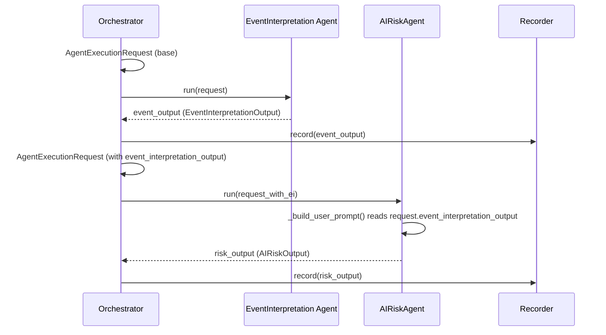

# EI Output → AIRiskAgent 전달 구현 계획

## 1. 문제

현재 [`_run_agents()`](src/agent_trading/services/decision_orchestrator.py:381)는
Event Interpretation Agent의 출력(`event_output`)을 Recorder에만 저장하고,
이후 실행되는 AI Risk Agent에 전달하지 않는다.

```python
# Line 408-412: shared request (EI output 없음)
request = AgentExecutionRequest(
    decision_context_id=decision_context_id,
    correlation_id=correlation_id,
    context=assembled_context,
)

# Line 417: EI 실행
event_output = await self._event_interpretation_agent.run(request)
await self._agent_recorder.record(...)          # recorder 저장만 함

# Line 436: AR 실행 — 동일한 request (event_output 미전달!)
risk_output = await self._ai_risk_agent.run(request)
```

## 2. 변경 후 흐름



## 3. 변경 대상 및 상세 코드

### 3.1 AgentExecutionRequest 확장

**파일**: [`src/agent_trading/services/ai_agents/base.py`](src/agent_trading/services/ai_agents/base.py:27)

**변경 사항**:
1. `TYPE_CHECKING` 블록에 `EventInterpretationOutput` import 추가
2. `AgentExecutionRequest`에 `event_interpretation_output: EventInterpretationOutput | None = None` 필드 추가

```python
from __future__ import annotations

from dataclasses import dataclass, field
from typing import TYPE_CHECKING, Protocol, runtime_checkable
from uuid import UUID

if TYPE_CHECKING:
    from agent_trading.services.decision_orchestrator import AssembledContext
    from agent_trading.services.ai_agents.schemas import EventInterpretationOutput  # ← 추가


@dataclass(slots=True, frozen=True)
class AgentExecutionRequest:
    decision_context_id: UUID | None
    correlation_id: str
    context: AssembledContext
    event_interpretation_output: EventInterpretationOutput | None = None  # ← 추가
    model_id: str | None = None
    prompt_id: str | None = None
```

**순환 import 안전성**:
- `schemas.py`는 leaf module — `from agent_trading...` import가 전혀 없음 (`dataclass`, `field`, `Any`만 사용)
- `base.py`는 이미 `from __future__ import annotations` 사용 — 모든 annotation은 runtime에 문자열로 저장됨
- `TYPE_CHECKING` import이므로 runtime circular import가 발생하지 않음

### 3.2 Orchestrator 흐름 수정

**파일**: [`src/agent_trading/services/decision_orchestrator.py`](src/agent_trading/services/decision_orchestrator.py:381)

**변경 사항**: `_run_agents()`에서 EI 실행 직후 `event_output`을 포함한 새 request 생성

```python
# --- 1. Event Interpretation Agent ---
event_output: EventInterpretationOutput
try:
    event_output = await self._event_interpretation_agent.run(request)
except Exception:
    logger.warning(
        "Event Interpretation Agent failed — using default output "
        "(safe fallback). decision_context_id=%s",
        decision_context_id,
        exc_info=True,
    )
    event_output = EventInterpretationOutput()

await self._agent_recorder.record(
    decision_context_id=decision_context_id,
    agent_type=self._event_interpretation_agent.agent_name,
    structured_output=_dataclass_to_dict(event_output),
)

# --- EI output을 포함한 request 생성 (frozen이므로 새 객체) ---
request_with_ei = AgentExecutionRequest(
    decision_context_id=request.decision_context_id,
    correlation_id=request.correlation_id,
    context=request.context,
    event_interpretation_output=event_output,          # ← 추가
    model_id=request.model_id,
    prompt_id=request.prompt_id,
)

# --- 2. AI Risk Agent ---
risk_output: AIRiskOutput
try:
    risk_output = await self._ai_risk_agent.run(request_with_ei)  # ← 변경
except Exception:
    ...

# --- 3. Final Decision Composer Agent ---
composer_output: FinalDecisionComposerOutput
try:
    composer_output = await self._final_decision_agent.run(request_with_ei)  # ← 변경 (선택)
except Exception:
    ...
```

**참고**: FDC는 현재 stub이므로 `request_with_ei`를 받아도 `event_interpretation_output`을 무시함. 향후 FDC real 구현 시에도 EI 출력을 활용할 수 있도록 동일 request 전달.

**Safe fallback**: EI 실패 시 `EventInterpretationOutput()` (기본값)이 전달되므로 AR은 항상 `None`이 아닌 값을 받음. 이는 `_build_user_prompt()`에서 조건부 로직을 단순하게 유지할 수 있게 함.

### 3.3 AIRiskAgent prompt 확장

**파일**: [`src/agent_trading/services/ai_agents/ai_risk.py`](src/agent_trading/services/ai_agents/ai_risk.py:226)

**변경 사항**: `_build_user_prompt()`에서 `request.event_interpretation_output`을 읽어 prompt에 포함

```python
from agent_trading.services.ai_agents.schemas import AIRiskOutput, EventInterpretationOutput, generate_json_schema
#                                                         ^^^^^^^^^^^^^^^^^^^^^^^^^^^^^^^ 추가

def _build_user_prompt(self, request: AgentExecutionRequest) -> str:
    """Build the user prompt with the current request context."""
    context = request.context
    score = context.score
    events = context.recent_events or []

    lines: list[str] = [
        f"Correlation ID: {request.correlation_id}",
    ]

    # Symbol and proposed side
    lines.append(f"Symbol: {request.context.decision_context or '(not available)'}")

    # === Event Interpretation output (if available) ===
    ei_output = request.event_interpretation_output
    if ei_output is not None:
        lines.append("")
        lines.append("=== Event Interpretation ===")
        lines.append(f"Overall bias: {ei_output.aggregate_view.overall_bias}")
        lines.append(f"Event conflict: {ei_output.aggregate_view.event_conflict}")
        if ei_output.aggregate_view.top_reason_codes:
            lines.append(
                "Top reason codes: "
                f"{', '.join(ei_output.aggregate_view.top_reason_codes)}"
            )

        # Interpreted events summary (max 10)
        interpreted_events = ei_output.events or ()
        if interpreted_events:
            lines.append(f"Interpreted events ({len(interpreted_events)}):")
            for ie in interpreted_events[:10]:
                summary = ie.summary or ie.headline or "(no summary)"
                lines.append(
                    f"  - [{ie.event_type}] {summary}"
                )
                lines.append(
                    f"    impact={ie.impact_direction} "
                    f"confidence={ie.confidence}"
                )
        lines.append("")
    # ==================================================

    if score:
        lines.append(f"Score: {score.score} (threshold: {score.threshold})")
        if score.reason_codes:
            lines.append(f"Reason codes: {', '.join(score.reason_codes)}")

    # Decision context info
    dc = context.decision_context
    if dc:
        lines.append(f"Decision context account_id: {dc.account_id}")

    lines.append(f"Recent events ({len(events)}):")
    for e in events[:20]:
        headline = e.headline or "(no headline)"
        summary = e.body_summary or ""
        lines.append(
            f"  - [{e.event_type}] {headline}"
            f"{' — ' + summary[:200] if summary else ''}"
        )

    return "\n".join(lines)
```

## 4. Scope Limits (변경하지 않는 것)

| 항목 | 상태 |
|------|------|
| 주문 실행 경로 | 변경 없음 |
| Deterministic scoring/threshold | 변경 없음 |
| Hard guardrail | 변경 없음 |
| FDC real 구현 | stub 유지 |
| Position/risk_limit snapshot | 변경 없음 |
| Recorder format | 변경 없음 |
| Bootstrap contract | 변경 없음 |
| Provider client | 변경 없음 |

## 5. Completion Criteria

1. AIRiskAgent가 실제로 Event Interpretation 결과(`aggregate_view.overall_bias`, `event_conflict`, `top_reason_codes`, interpreted events)를 prompt에 포함
2. 기존 stub/real 조합과 호환 유지
3. `event_interpretation_output=None` (기존 request) → 기존 동작 그대로
4. 전체 테스트 green 유지 (384 passed, 14 skipped, 0 failed)
5. 다음 단계(FDC real 구현, AR 입력 추가 확장)로 자연스럽게 이어짐

## 6. 테스트 계획

### 6.1 test_base.py — AgentExecutionRequest 새 필드

| 테스트 | 검증 내용 |
|--------|----------|
| `test_event_interpretation_output_default_none` | 새 필드가 기본적으로 `None` |
| `test_event_interpretation_output_custom` | 명시적으로 `EventInterpretationOutput` 전달 가능 |
| (기존) `test_optional_fields_default_none` | 수정 없이 통과 |

### 6.2 test_agents.py — AIRiskAgent prompt

| 테스트 | 검증 내용 |
|--------|----------|
| `test_run_with_ei_output_in_prompt` | EI 출력이 포함된 request → provider가 `user_prompt`에 EI 관련 내용을 받는지 확인 (tracking mock) |
| `test_run_without_ei_output` | EI 출력 없는 request (기존) → prompt에 EI 내용 없음 |

### 6.3 test_orchestrator_agents.py — Orchestrator 통합

| 테스트 | 검증 내용 |
|--------|----------|
| `test_ei_output_passed_to_ar` (신규) | 실제 orchestrator flow에서 EI→AR로 `event_interpretation_output`이 전달되는지 확인 (TrackingAR agent 사용) |
| (기존) `test_real_ei_and_real_ar_with_stub_fdc` | 수정 없이 통과 |
| (기존) `test_real_ei_real_ar_records_decision_context_id` | 수정 없이 통과 |
| (기존) 모든 `TestExistingBehaviourPreserved` | 수정 없이 통과 |
