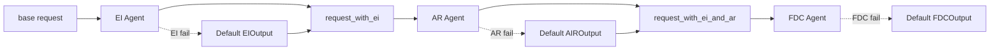
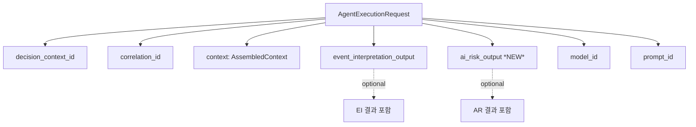
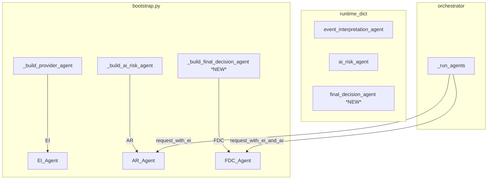

# Plan 28: Real FinalDecisionComposerAgent 구현

## 1. 목표

`FinalDecisionComposerAgent`를 stub에서 real 구현으로 올립니다.  
Event Interpretation Agent(`EI`)와 AIRiskAgent(`AR`)의 출력이 이미 존재하므로,  
`FinalDecisionComposerAgent`가 이 둘의 결과와 기존 `assembled_context`를 종합해  
구조화된 최종 판단을 생성하도록 연결합니다.

## 2. 변경 전후 흐름

### 변경 전 (현재)
```
base request → EI → request_with_ei → AR → base request (← EI/AR 출력 전달 안 됨) → stub FDC
```

### 변경 후
```
base request → EI → request_with_ei → AR → request_with_ei_and_ar (← EI + AR 출력 포함) → real FDC
```

## 3. 변경 파일 목록

| # | 파일 | 변경 유형 | 설명 |
|---|------|-----------|------|
| 1 | `src/.../ai_agents/base.py` | 수정 | `ai_risk_output: AIRiskOutput \| None = None` 필드 추가 (TYPE_CHECKING) |
| 2 | `src/.../ai_agents/final_decision_composer.py` | 수정 | `FinalDecisionComposerAgent` real class 추가 (기존 stub 유지) |
| 3 | `src/.../ai_agents/__init__.py` | 수정 | `FinalDecisionComposerAgent` import/export 추가 |
| 4 | `src/.../decision_orchestrator.py` | 수정 | `_run_agents()`에서 3단계 request 생성해서 FDC에 전달 |
| 5 | `src/.../runtime/bootstrap.py` | 수정 | `_build_final_decision_agent()`, orchestrator 파라미터, runtime dict, shutdown |
| 6 | `tests/.../test_base.py` | 수정 | `ai_risk_output` 필드 테스트 2개 추가 |
| 7 | `tests/.../test_agents.py` | 수정 | `TestFinalDecisionComposerAgent` 클래스 추가 |
| 8 | `tests/.../test_orchestrator_agents.py` | 수정 | real FDC 통합 테스트, AR→FDC 출력 전달 테스트 |
| 9 | `tests/.../test_bootstrap.py` | 수정 | FDC agent key 테스트 추가 |
| 10 | `plans/README.md` | 수정 | 인덱스 갱신 |

## 4. 상세 구현 계획

### 4.1 `base.py` — AgentExecutionRequest에 `ai_risk_output` 필드 추가

**TYPE_CHECKING import 추가:**
```python
if TYPE_CHECKING:
    from agent_trading.services.decision_orchestrator import AssembledContext
    from agent_trading.services.ai_agents.schemas import EventInterpretationOutput
    from agent_trading.services.ai_agents.schemas import AIRiskOutput  # ← 추가
```

**필드 추가:**
```python
event_interpretation_output: EventInterpretationOutput | None = None
ai_risk_output: AIRiskOutput | None = None  # ← 추가
model_id: str | None = None
prompt_id: str | None = None
```

> **참고**: `from __future__ import annotations` 덕분에 TYPE_CHECKING import로 충분하며,  
> `AIRiskOutput`은 `schemas.py`에 정의되어 있어 순환 import가 발생하지 않습니다.

### 4.2 `final_decision_composer.py` — `FinalDecisionComposerAgent` class 추가

**패턴**: `AIRiskAgent`와 완전히 동일한 구조 (`ai_risk.py` 참조)

```python
class FinalDecisionComposerAgent:
    """Real Final Decision Composer — calls a Provider via AIProviderClient."""

    def __init__(self, provider_client: AIProviderClient, *,
                 model_id: str = "deepseek-chat",
                 schema_version: str = "v1") -> None:
        self._provider = provider_client
        self._model_id = model_id
        self._schema_version = schema_version

    @property
    def agent_name(self) -> str:
        return "final_decision_composer"

    @property
    def schema_version(self) -> str:
        return self._schema_version

    async def run(self, request: AgentExecutionRequest) -> FinalDecisionComposerOutput:
        try:
            system_prompt = self._build_system_prompt()
            user_prompt = self._build_user_prompt(request)
            raw_response = await self._provider.generate_structured(
                model_id=self._model_id,
                system_prompt=system_prompt,
                user_prompt=user_prompt,
                response_format=FinalDecisionComposerOutput,
            )
            result: FinalDecisionComposerOutput = raw_response.parsed
            # Override metadata
            result = FinalDecisionComposerOutput(
                schema_version=result.schema_version or self._schema_version,
                agent_name=result.agent_name or self.agent_name,
                decision_context_id=(str(request.decision_context_id) if request.decision_context_id else None),
                symbol=result.symbol,
                decision_type=result.decision_type,
                side=result.side,
                entry_style=result.entry_style,
                time_horizon=result.time_horizon,
                confidence=result.confidence,
                conviction=result.conviction,
                reason_codes=result.reason_codes,
                opposing_evidence=result.opposing_evidence,
                execution_preferences=result.execution_preferences,
                sizing_hint=result.sizing_hint,
                exit_plan_hint=result.exit_plan_hint,
                summary=result.summary,
            )
            return result
        except Exception:
            logger.warning("FinalDecisionComposerAgent failed — returning default output ...")
            return FinalDecisionComposerOutput(
                schema_version=self._schema_version,
                agent_name=self.agent_name,
                decision_context_id=(str(request.decision_context_id) if request.decision_context_id else None),
            )

    def _build_system_prompt(self) -> str:
        schema_json = json.dumps(generate_json_schema(FinalDecisionComposerOutput), indent=2)
        return (
            "You are a Final Decision Composer for a trading system. "
            "Synthesise the outputs of the Event Interpretation Agent and "
            "the AI Risk Agent, together with the assembled trading context, "
            "to produce a structured final decision.\n\n"
            "Output must be valid JSON matching this schema:\n"
            f"{schema_json}"
        )

    def _build_user_prompt(self, request: AgentExecutionRequest) -> str:
        """Build user prompt with assembled_context + EI output + AR output."""
        context = request.context
        score = context.score
        events = context.recent_events or []

        lines: list[str] = [
            f"Correlation ID: {request.correlation_id}",
            f"Symbol: {request.context.decision_context or '(not available)'}",
        ]

        # === Score & Reason Codes (from assembled_context) ===
        if score:
            lines.append("")
            lines.append("=== Score ===")
            lines.append(f"Score: {score.score} (threshold: {score.threshold})")
            if score.reason_codes:
                lines.append(f"Reason codes: {', '.join(score.reason_codes)}")

        # === EI Output ===
        ei = request.event_interpretation_output
        if ei is not None:
            lines.append("")
            lines.append("=== Event Interpretation ===")
            lines.append(f"Overall bias: {ei.aggregate_view.overall_bias}")
            lines.append(f"Event conflict: {ei.aggregate_view.event_conflict}")
            if ei.aggregate_view.top_reason_codes:
                lines.append(f"Top reason codes: {', '.join(ei.aggregate_view.top_reason_codes)}")
            interpreted = ei.events or ()
            if interpreted:
                lines.append(f"Interpreted events ({len(interpreted)}):")
                for ie in interpreted[:10]:
                    summary = ie.summary or ie.headline or "(no summary)"
                    lines.append(f"  - [{ie.event_type}] {summary}")
                    lines.append(f"    impact={ie.impact_direction} confidence={ie.confidence}")

        # === AR Output ===
        ar = request.ai_risk_output
        if ar is not None:
            lines.append("")
            lines.append("=== AI Risk Assessment ===")
            lines.append(f"Risk opinion: {ar.risk_opinion}")
            lines.append(f"Risk score: {ar.risk_score}")
            lines.append(f"Confidence: {ar.confidence}")
            lines.append(f"Size adjustment factor: {ar.size_adjustment_factor}")
            if ar.reason_codes:
                lines.append(f"Reason codes: {', '.join(ar.reason_codes)}")
            if ar.opposing_evidence:
                lines.append("Opposing evidence:")
                for oe in ar.opposing_evidence:
                    lines.append(f"  - {oe}")

        # === Recent Events ===
        lines.append("")
        lines.append(f"Recent events ({len(events)}):")
        for e in events[:20]:
            headline = e.headline or "(no headline)"
            summary = e.body_summary or ""
            lines.append(f"  - [{e.event_type}] {headline}{' — ' + summary[:200] if summary else ''}")

        # === Decision Context ===
        dc = context.decision_context
        if dc:
            lines.append(f"Decision context account_id: {dc.account_id}")

        return "\n".join(lines)
```

**Import 추가:**
```python
import json
from agent_trading.services.ai_agents.base import (
    AgentExecutionRequest,
    AIProviderClient,
    ProviderAIAgent,
    RawProviderResponse,
)
from agent_trading.services.ai_agents.schemas import (
    FinalDecisionComposerOutput,
    generate_json_schema,
)
```

### 4.3 `decision_orchestrator.py` — 3단계 request chain

**`_run_agents()`에서 FDC 호출 부분 변경 (line 465-476):**

```python
# --- Build a new request with both EI and AR output for FDC ---
request_with_ei_and_ar = AgentExecutionRequest(
    decision_context_id=request.decision_context_id,
    correlation_id=request.correlation_id,
    context=request.context,
    event_interpretation_output=event_output,
    ai_risk_output=risk_output,
    model_id=request.model_id,
    prompt_id=request.prompt_id,
)

# --- 3. Final Decision Composer Agent ---
composer_output: FinalDecisionComposerOutput
try:
    composer_output = await self._final_decision_agent.run(request_with_ei_and_ar)
except Exception:
    logger.warning(
        "Final Decision Composer Agent failed — using default output "
        "(safe fallback). decision_context_id=%s",
        decision_context_id,
        exc_info=True,
    )
    composer_output = FinalDecisionComposerOutput()
```

### 4.4 `__init__.py` — `FinalDecisionComposerAgent` export

**Import 추가:**
```python
from agent_trading.services.ai_agents.final_decision_composer import (
    FinalDecisionComposerAgent,
    StubFinalDecisionComposerAgent,
)
```

**`__all__` 추가:**
```python
"FinalDecisionComposerAgent",
```

### 4.5 `bootstrap.py` — FDC wiring

#### `_build_final_decision_agent()` 함수 추가 (AR 패턴과 동일):
```python
def _build_final_decision_agent(settings: AppSettings) -> FinalDecisionComposerAgent | None:
    if not settings.provider_api_key:
        logger.info("Provider API key not configured — using stub FinalDecisionComposerAgent")
        return None
    if not settings.provider_base_url:
        logger.warning("provider_base_url is empty — using stub FinalDecisionComposerAgent")
        return None
    if not settings.provider_model_id:
        logger.warning("provider_model_id is empty — using stub FinalDecisionComposerAgent")
        return None
    client = OpenAICompatibleClient(
        api_key=settings.provider_api_key,
        base_url=settings.provider_base_url,
        timeout_seconds=settings.provider_timeout_seconds,
    )
    return FinalDecisionComposerAgent(
        provider_client=client,
        model_id=settings.provider_model_id,
    )
```

#### `_build_orchestrator()`에 `final_decision_agent` 파라미터 추가:
```python
def _build_orchestrator(
    repos: RepositoryContainer,
    settings: AppSettings,
    event_interpretation_agent: EventInterpretationAgent | None = None,
    ai_risk_agent: AIRiskAgent | None = None,
    final_decision_agent: FinalDecisionComposerAgent | None = None,  # ← 추가
) -> DecisionOrchestratorService:
    if event_interpretation_agent is None:
        event_interpretation_agent = _build_provider_agent(settings)
    if ai_risk_agent is None:
        ai_risk_agent = _build_ai_risk_agent(settings)
    if final_decision_agent is None:                                  # ← 추가
        final_decision_agent = _build_final_decision_agent(settings)  # ← 추가
    return DecisionOrchestratorService(
        repos=repos,
        event_interpretation_agent=event_interpretation_agent,
        ai_risk_agent=ai_risk_agent,
        final_decision_agent=final_decision_agent,  # ← 추가
    )
```

#### 모든 runtime dict에 `final_decision_agent` 키 추가:
- `build_default_runtime()` 
- `build_postgres_runtime()`
- `postgres_runtime()` context manager

#### `shutdown_postgres_runtime()`에 FDC agent cleanup 추가:
```python
for key in ("event_interpretation_agent", "ai_risk_agent", "final_decision_agent"):
    agent = runtime.get(key)
    await _close_provider_agent(agent)
```

### 4.6 Tests

#### 4.6.1 `test_base.py` — `ai_risk_output` 필드 테스트 2개

```python
def test_ai_risk_output_default_none(self) -> None:
    """ai_risk_output defaults to None when not provided."""
    context = AssembledContext()
    req = AgentExecutionRequest(
        decision_context_id=None,
        correlation_id="corr-ar-none",
        context=context,
    )
    assert req.ai_risk_output is None

def test_ai_risk_output_custom(self) -> None:
    """ai_risk_output accepts an AIRiskOutput."""
    context = AssembledContext()
    ar_output = AIRiskOutput(symbol="AAPL", risk_score=0.5)
    req = AgentExecutionRequest(
        decision_context_id=None,
        correlation_id="corr-ar-set",
        context=context,
        ai_risk_output=ar_output,
    )
    assert req.ai_risk_output is not None
    assert req.ai_risk_output.symbol == "AAPL"
    assert req.ai_risk_output.risk_score == 0.5
```

**Import 추가:**
```python
from agent_trading.services.ai_agents.schemas import AIRiskOutput
# (EventInterpretationOutput import 이미 존재)
```

#### 4.6.2 `test_agents.py` — `TestFinalDecisionComposerAgent` 클래스

`TestAIRiskAgent`와 동일한 패턴 (mock_provider fixture 재사용):

| 테스트 | 설명 |
|--------|------|
| `test_protocol_conformance` | `isinstance(agent, ProviderAIAgent)` |
| `test_agent_name` | `agent.agent_name == "final_decision_composer"` |
| `test_schema_version_default` | 기본값 `"v1"` |
| `test_schema_version_custom` | 커스텀 값 |
| `test_run_returns_final_decision_composer_output` | 반환 타입 확인 |
| `test_run_with_mock_response` | provider가 valid response → 필드 매핑 확인 |
| `test_run_fallback_on_provider_error` | provider 에러 → 기본 fallback |
| `test_run_fallback_on_parse_error` | parse 에러 → 기본 fallback |
| `test_decision_context_id_set_when_provided` | ctx ID 전달 확인 |
| `test_decision_context_id_none_when_not_provided` | None ctx ID |
| `test_run_with_ei_and_ar_output_in_prompt` | EI+AR 출력이 prompt에 포함되는지 확인 |
| `test_run_without_ei_and_ar_output` | EI/AR 없이 prompt 구성 확인 |

#### 4.6.3 `test_orchestrator_agents.py` — 2개 테스트 추가

1. **`test_real_ei_real_ar_real_fdc`**: Real EI + Real AR + Real FDC (모두 mock provider), assemble 성공, recorder 3 runs, FDC 출력 확인
2. **`test_ei_and_ar_output_passed_to_fdc`**: TrackingFDC agent로 FDC가 `request_with_ei_and_ar`를 수신하는지 확인 (EI output + AR output 모두 전달)

**mock_fdc_provider fixture 추가 필요** — FDC용 mock provider (기존 mock_ei_provider, mock_ar_provider와 유사)

#### 4.6.4 `test_bootstrap.py` — FDC agent key 테스트

`TestBuildDefaultRuntime`, `TestBuildPostgresRuntime`, `TestPostgresRuntimeContext` 각각:
- `test_contains_final_decision_agent_key` — runtime dict에 `final_decision_agent` 키 포함
- `test_runtime_shape_consistent` — expected_keys에 `final_decision_agent` 추가
- `test_uses_real_agent_when_api_key_set` — 설정 완전 시 FDC real agent 주입 확인

## 5. Scope Limits (변경하지 않는 것)

- 결정론적 score/threshold 재설계 ❌
- 수량 계산 변경 ❌
- Hard guardrail 변경 ❌
- Order submit 경로 변경 ❌
- Replay format 변경 ❌
- Broker/reconciliation contract 변경 ❌
- Multi-provider orchestration ❌
- Prompt optimization 실험 ❌

## 6. Completion Criteria

- [x] `FinalDecisionComposerAgent` real class 구현
- [x] EI→AR→FDC 데이터 흐름 연결 (3단계 request chain)
- [x] Stub과 real 구현 공존 (`StubFinalDecisionComposerAgent` 유지)
- [x] Safe fallback: provider error 시 default `FinalDecisionComposerOutput()`, metadata 보존
- [x] Runtime-safe wiring (bootstrap)
- [x] 모든 테스트 green
- [x] 자연스러운 다음 단계로의 경로 확보 (deeper deterministic backend coupling 또는 AI input expansion)

## 7. Mermaid: 변경 후 Agent 실행 흐름






