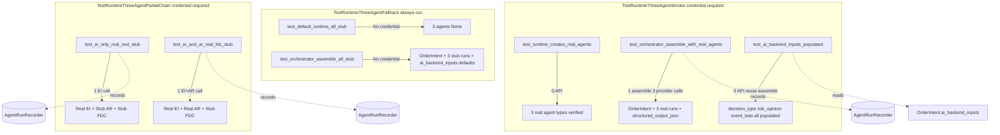

# Plan 30: Real 3-Agent Runtime Smoke Verification

## Revision History

| Rev | Date | Author | Change |
|-----|------|--------|--------|
| 1 | 2026-05-04 | Roo (Architect) | Initial plan |
| 2 | 2026-05-04 | Roo | Follow-up: env isolation (monkeypatch) + provider-agnostic skip (AppSettings-based) |

---

## 1. Goal

현재 wiring된 `EventInterpretationAgent` → `AIRiskAgent` → `FinalDecisionComposerAgent` 3-agent chain이 실제 runtime에서 동작하는지 smoke/integration 수준으로 검증한다.

기존 Plan 25 (EI-only smoke)는 `EventInterpretationAgent`만 runtime 경로로 검증하고, AR과 FDC는 stub 상태로 남겨둔다. Plan 30은 3-agent 전체 chain을 runtime에서 검증하여 **가장 큰 남은 리스크 — real provider/runtime 경로의 안정성** 을 해소한다.

---

## 2. 현재 커버리지 갭

### 2.1 기존 테스트 현황

| 영역 | 테스트 파일 | 커버리지 |
|------|------------|----------|
| Agent unit (mock provider) | `test_agents.py` | EI, AR, FDC 각각 unit test ✅ |
| Orchestrator + mock agents | `test_orchestrator_agents.py` | 3-agent chain + safe fallback + schema alignment ✅ |
| Bootstrap wiring | `test_bootstrap.py` | Runtime dict shape, credential-based injection ✅ |
| EI-only runtime smoke | `test_runtime_event_interpretation_smoke.py` | EI만 real, AR/FDC는 stub ❌ |
| **3-agent runtime smoke** | **없음** | **EI+AR+FDC 모두 real provider로 검증 없음** ❌ |

### 2.2 구체적 갭

1. **Runtime wiring completeness**: `build_default_runtime()`가 3개 real agent를 모두 올바르게 주입하는지 실제 provider credential 환경에서 검증 부재
2. **Full chain execute**: EI→AR→FDC sequential execution이 runtime에서 실제로 동작하는지 검증 부재
3. **Recorder integration**: 모든 3개 agent run이 recorder에 올바른 `structured_output_json`으로 기록되는지 검증 부재
4. **AIDecisionInputs population**: 3개 agent 출력이 모두 `ai_backend_inputs`에 반영되는지 검증 부재 (기존 테스트는 mock provider만 사용)
5. **Partial chain scenarios**: 일부 agent만 real이고 나머지는 stub인 상황에서의 동작 검증 부재

---

## 3. 설계

### 3.1 새 파일

`tests/smoke/test_runtime_three_agent_smoke.py`

세 개의 테스트 클래스로 구성:

#### Class A: `TestRuntimeThreeAgentFallback` (always-run, credential 불필요)

환경 변수와 무관하게 항상 실행. Provider credential이 없는 환경에서 모든 agent가 stub fallback되는지 확인.

| 테스트 | 내용 | API 호출 |
|--------|------|----------|
| `test_default_runtime_all_stub_when_no_credential` | 모든 provider env var 제거 → 3개 agent 모두 `None`인지 확인 | 0회 |
| `test_orchestrator_assemble_all_stub` | stub 상태에서 `assemble()` 정상 동작, recorder 3 runs, `ai_backend_inputs` 전부 default | 0회 |

#### Class B: `TestRuntimeThreeAgentSmoke` (`@pytest.mark.smoke`, credential 필요)

3개 real agent의 full chain 검증.

**Skip 조건** (기존 EI smoke와 동일): `DEEPSEEK_API_KEY` 미설정 시 `pytest.skip`.

**API call 최소화**: `runtime` fixture를 class-scope로 1회 빌드, `assemble()` 결과를 class-scope fixture로 재사용.

| 테스트 | 내용 | API 호출 |
|--------|------|----------|
| `test_runtime_creates_real_agents` | 3개 agent 모두 real type인지 확인 (`isinstance`) | 0회 |
| `test_orchestrator_assemble_with_real_agents` | `assemble()` → `OrderIntent` + recorder 3 runs + `structured_output_json` populated | 1회 (3회 provider call) |
| `test_ai_backend_inputs_populated` | `ai_backend_inputs` — FDC `decision_type`, AR `risk_opinion`, EI `event_bias` etc. default와 다른 값인지 확인 | 0회 (assemble 결과 재사용) |

#### Class C: `TestRuntimeThreeAgentPartialChain` (`@pytest.mark.smoke`, credential 필요)

일부 agent만 real인 partial chain 검증. `TestRuntimeThreeAgentSmoke`와 동일한 skip 조건.

`full_runtime` fixture를 class-scope로 1회 빌드, runtime에서 real agent를 추출하여 orchestrator를 partial 구성.

| 테스트 | 내용 | API 호출 |
|--------|------|----------|
| `test_ei_only_real_rest_stub` | Real EI + AR `None` + FDC `None` → recorder 1 real EI + 2 stub, `ai_backend_inputs` EI만 populated + AR/FDC default | 1회 (EI만 real call) |
| `test_ei_and_ar_real_fdc_stub` | Real EI + Real AR + FDC `None` → recorder 2 real + 1 stub, `ai_backend_inputs` EI+AR populated + FDC default | 1회 (EI+AR real call) |

### 3.2 총 API 호출량

| Class | 테스트 | Real API 호출 | Provider Call 횟수 |
|-------|--------|---------------|-------------------|
| A | `test_default_runtime_all_stub_when_no_credential` | 0 | 0 |
| A | `test_orchestrator_assemble_all_stub` | 0 | 0 |
| B | `test_runtime_creates_real_agents` | 0 | 0 |
| B | `test_orchestrator_assemble_with_real_agents` | 1 | 3 (EI+AR+FDC) |
| B | `test_ai_backend_inputs_populated` | 0 | 0 |
| C | `test_ei_only_real_rest_stub` | 1 | 1 (EI only) |
| C | `test_ei_and_ar_real_fdc_stub` | 1 | 2 (EI+AR) |
| **Total** | **7 tests** | **3** | **6** |

### 3.3 Test Detail

#### `TestRuntimeThreeAgentFallback`

```python
def test_default_runtime_all_stub_when_no_credential(
    self, monkeypatch: pytest.MonkeyPatch
) -> None:
    monkeypatch.delenv("DEEPSEEK_API_KEY", raising=False)
    monkeypatch.delenv("DEEPSEEK_BASE_URL", raising=False)
    monkeypatch.delenv("DEEPSEEK_MODEL_ID", raising=False)
    monkeypatch.delenv("OPENAI_API_KEY", raising=False)
    monkeypatch.delenv("OPENAI_BASE_URL", raising=False)
    monkeypatch.delenv("OPENAI_MODEL_ID", raising=False)
    monkeypatch.delenv("LLM_PROVIDER", raising=False)
    runtime = build_default_runtime()
    assert runtime["event_interpretation_agent"] is None
    assert runtime["ai_risk_agent"] is None
    assert runtime["final_decision_agent"] is None

async def test_orchestrator_assemble_all_stub(
    self, monkeypatch: pytest.MonkeyPatch
) -> None:
    monkeypatch.delenv("DEEPSEEK_API_KEY", raising=False)
    monkeypatch.delenv("DEEPSEEK_BASE_URL", raising=False)
    monkeypatch.delenv("DEEPSEEK_MODEL_ID", raising=False)
    monkeypatch.delenv("OPENAI_API_KEY", raising=False)
    monkeypatch.delenv("OPENAI_BASE_URL", raising=False)
    monkeypatch.delenv("OPENAI_MODEL_ID", raising=False)
    monkeypatch.delenv("LLM_PROVIDER", raising=False)
    runtime = build_default_runtime()
    orchestrator: DecisionOrchestratorService = runtime["orchestrator"]
    intent = await orchestrator.assemble(sample_request())
    assert isinstance(intent, OrderIntent)

    # NOTE: Stub agents share the same agent_type (agent_name) as real
    # agents — the recorder cannot distinguish them by agent_type.
    runs = orchestrator._agent_recorder.list_all()
    assert len(runs) == 3
    for i, expected_agent in enumerate(
        ["event_interpretation", "ai_risk", "final_decision_composer"]
    ):
        assert runs[i].agent_type == expected_agent
        assert runs[i].structured_output_json is not None
        assert runs[i].structured_output_json.get("schema_version") == "v1"

    # ai_backend_inputs: safe-fallback defaults for decision values;
    # metadata (source_agent_names, schema_versions) is populated by
    # stub outputs (same values as real agents).
    ai = intent.ai_backend_inputs
    assert ai.decision_type == "HOLD"
    assert ai.risk_opinion == "allow"
    assert ai.event_bias == "neutral"
    assert len(ai.source_agent_names) == 3
    assert len(ai.schema_versions) == 3
```

> **Env isolation**: Fallback tests force all provider env vars to empty via ``monkeypatch``, so they are deterministic regardless of the user's shell environment.

#### `TestRuntimeThreeAgentSmoke`

```python
@pytest.fixture(scope="class")
def runtime(self) -> dict[str, Any]:
    """Build default runtime once per class (0 API calls)."""
    return build_default_runtime()

def test_runtime_creates_real_agents(self, runtime: dict[str, Any]) -> None:
    ei = runtime["event_interpretation_agent"]
    ar = runtime["ai_risk_agent"]
    fdc = runtime["final_decision_agent"]
    assert isinstance(ei, EventInterpretationAgent)
    assert isinstance(ar, AIRiskAgent)
    assert isinstance(fdc, FinalDecisionComposerAgent)
    assert ei.agent_name == "event_interpretation"
    assert ar.agent_name == "ai_risk"
    assert fdc.agent_name == "final_decision_composer"

@pytest.fixture(scope="class")
async def assemble_result(self, runtime: dict[str, Any]) -> OrderIntent:
    """1 real provider call (3 agent calls inside)."""
    orchestrator = runtime["orchestrator"]
    return await orchestrator.assemble(sample_request())

async def test_orchestrator_assemble_with_real_agents(
    self, runtime: dict[str, Any], assemble_result: OrderIntent,
) -> None:
    intent = assemble_result
    assert isinstance(intent, OrderIntent)
    # Recorder: 3 runs, all real agent_type
    orchestrator = runtime["orchestrator"]
    runs = orchestrator._agent_recorder.list_all()
    assert len(runs) == 3
    for i, expected_agent in enumerate(
        ["event_interpretation", "ai_risk", "final_decision_composer"]
    ):
        assert runs[i].agent_type == expected_agent
        assert runs[i].structured_output_json is not None
        assert runs[i].structured_output_json.get("schema_version") == "v1"
        assert runs[i].structured_output_json.get("agent_name") == expected_agent

async def test_ai_backend_inputs_assembled(
    self, assemble_result: OrderIntent,
) -> None:
    """Contract-level structural verification: AIDecisionInputs is assembled and
    present on OrderIntent, with expected field types and metadata populated."""
    ai = assemble_result.ai_backend_inputs
    # AIDecisionInputs dataclass exists and is not default-empty
    assert isinstance(ai, AIDecisionInputs)
    # Metadata: source_agent_names and schema_versions from _run_agents() assembly
    assert len(ai.source_agent_names) == 3
    assert "event_interpretation" in ai.source_agent_names
    assert "ai_risk" in ai.source_agent_names
    assert "final_decision_composer" in ai.source_agent_names
    assert len(ai.schema_versions) == 3
    # Each agent has a schema_version tuple: (agent_name, version_str)
    for agent_name in ("event_interpretation", "ai_risk", "final_decision_composer"):
        matching = [v for v in ai.schema_versions if v[0] == agent_name]
        assert len(matching) == 1, f"Missing schema_version for {agent_name}"
        assert matching[0][1] == "v1"
    # All fields are present (not raising AttributeError) — structural contract
    _ = ai.decision_type
    _ = ai.confidence
    _ = ai.conviction
    _ = ai.reason_codes
    _ = ai.opposing_evidence
    _ = ai.execution_preferences
    _ = ai.sizing_hint
    _ = ai.risk_opinion
    _ = ai.risk_score
    _ = ai.risk_confidence
    _ = ai.size_adjustment_factor
    _ = ai.risk_reason_codes
    _ = ai.risk_flags
    _ = ai.event_bias
    _ = ai.event_conflict
    _ = ai.event_reason_codes
    # FDC defaults are acceptable; the important thing is that the contract
    # was assembled successfully by the real provider execution path.
```

> **Note on assertion strategy**: Real provider output is non-deterministic — the model may conservatively return `HOLD`, `allow`, `neutral`. We verify **structural/contract correctness** (types, metadata, field existence) rather than requiring non-default values. This avoids false failures when the model judges the empty context as low-risk/no-action.

#### `TestRuntimeThreeAgentPartialChain`

```python
@pytest.fixture(scope="class")
def full_runtime(self) -> dict[str, Any]:
    """Build runtime with all real agents (1 build)."""
    return build_default_runtime()

@pytest.fixture(scope="class")
def repos(self, full_runtime: dict[str, Any]) -> RepositoryContainer:
    return full_runtime["repositories"]

@pytest.fixture(scope="class")
def real_ei(
    self, full_runtime: dict[str, Any]
) -> EventInterpretationAgent:
    agent = full_runtime["event_interpretation_agent"]
    assert isinstance(agent, EventInterpretationAgent)
    return agent

@pytest.fixture(scope="class")
def real_ar(
    self, full_runtime: dict[str, Any]
) -> AIRiskAgent:
    agent = full_runtime["ai_risk_agent"]
    assert isinstance(agent, AIRiskAgent)
    return agent

async def test_ei_only_real_rest_stub(
    self, real_ei: EventInterpretationAgent, repos: RepositoryContainer,
) -> None:
    orchestrator = DecisionOrchestratorService(
        repos=repos,
        event_interpretation_agent=real_ei,
        ai_risk_agent=None,       # stub fallback
        final_decision_agent=None,  # stub fallback
    )
    intent = await orchestrator.assemble(sample_request())
    runs = orchestrator._agent_recorder.list_all()
    assert len(runs) == 3
    # Run 0: real EI
    assert runs[0].agent_type == "event_interpretation"
    assert runs[0].structured_output_json.get("agent_name") == "event_interpretation"
    # Run 1: stub AR (same agent_type as real — "ai_risk")
    assert runs[1].agent_type == "ai_risk"
    # Run 2: stub FDC (same agent_type as real — "final_decision_composer")
    assert runs[2].agent_type == "final_decision_composer"
    # ai_backend_inputs: EI real, AR+FDC stub fallback contract
    ai = intent.ai_backend_inputs
    # Metadata: 3 source_agent_names always present (includes stubs)
    assert len(ai.source_agent_names) == 3
    # Only EI has a real schema_version entry (AR/FDC stubs produce defaults)
    ei_versions = [v for v in ai.schema_versions if v[0] == "event_interpretation"]
    assert len(ei_versions) == 1
    assert ei_versions[0][1] == "v1"
    # AR/FDC fields are at default values (stub fallback contract)
    assert ai.risk_opinion == "allow"
    assert ai.decision_type == "HOLD"
    # EI field exists (structural check — value may be default or populated)
    _ = ai.event_bias

async def test_ei_and_ar_real_fdc_stub(
    self,
    real_ei: EventInterpretationAgent,
    real_ar: AIRiskAgent,
    repos: RepositoryContainer,
) -> None:
    orchestrator = DecisionOrchestratorService(
        repos=repos,
        event_interpretation_agent=real_ei,
        ai_risk_agent=real_ar,
        final_decision_agent=None,  # stub fallback
    )
    intent = await orchestrator.assemble(sample_request())
    runs = orchestrator._agent_recorder.list_all()
    assert len(runs) == 3
    assert runs[0].agent_type == "event_interpretation"   # real
    assert runs[1].agent_type == "ai_risk"                 # real
    assert runs[2].agent_type == "final_decision_composer"  # stub (same agent_type as real)
    # ai_backend_inputs: EI+AR real, FDC stub fallback contract
    ai = intent.ai_backend_inputs
    assert ai.decision_type == "HOLD"  # FDC default (stub)
    assert len(ai.source_agent_names) == 3
    ei_ar_versions = [v for v in ai.schema_versions if v[0] in ("event_interpretation", "ai_risk")]
    assert len(ei_ar_versions) == 2
    # All fields accessible (structural contract)
    _ = ai.event_bias
    _ = ai.risk_opinion
```

### 3.4 Skip 조건

Provider-agnostic skip — ``AppSettings()`` 기반으로 현재 설정된 provider(DeepSeek 또는 OpenAI)가 real runtime wiring을 만들 수 있는지 판단:

```python
from agent_trading.config.settings import AppSettings


def _have_real_provider_config() -> bool:
    """``_build_provider_agent()``과 동일한 로직으로 provider 설정 완료 여부 확인."""
    s = AppSettings()
    return bool(
        s.llm_provider
        and s.provider_api_key
        and s.provider_base_url
        and s.provider_model_id
    )


_SKIP_REASON = (
    "LLM provider not fully configured — skipping 3-agent runtime smoke test. "
    "Set LLM_PROVIDER and the corresponding DEEPSEEK_* or OPENAI_* "
    "environment variables (API key, base URL, model ID)."
)


@pytest.mark.smoke
@pytest.mark.skipif(not _have_real_provider_config(), reason=_SKIP_REASON)
class TestRuntimeThreeAgentSmoke:
    ...
```

> **중요**: `autouse=True` fixture는 class-scope fixture보다 먼저 실행되므로, `scope="class"`인 `runtime` fixture가 실행되기 전에 skip을 결정할 수 있다. skip 시에는 provider 호출이 전혀 발생하지 않는다.

### 3.5 샘플 request

```python
def sample_request() -> SubmitOrderRequest:
    return SubmitOrderRequest(
        client_order_id="smoke-3agent-001",
        correlation_id="runtime-3agent-smoke-001",
        account_ref="smoke-test",
        symbol="005930",
        market="KRX",
        side="buy",
        order_type="limit",
        time_in_force="day",
        quantity=Decimal("10"),
        price=Decimal("50000"),
        idempotency_key="idem-3agent-smoke-001",
    )
```

---

## 4. 수정 파일 목록

| 파일 | 작업 | 변경 사유 |
|------|------|-----------|
| `tests/smoke/test_runtime_three_agent_smoke.py` | **신규 생성** | 3-agent runtime smoke 검증 |
| `plans/README.md` | 수정 | Entry 30 인덱스 추가 |
| **그 외 모든 파일** | **변경 없음** | 기존 코드/테스트 수정 불필요 |

---

## 5. Scope Boundaries (변경하지 않는 것)

- `SubmitOrderRequest`, `OrderManager`, `BrokerAdapter`, `ReconciliationService` — 변경 금지
- `DecisionOrchestratorService.assemble()` signature — 변경 금지
- `AIDecisionInputs` field 추가/삭제 — 변경 금지
- `decision_orchestrator.py`, `bootstrap.py`, `base.py`, `schemas.py` — 변경 금지
- 기존 smoke/test 파일 수정 — 변경 금지 (새 파일만 생성)
- Richer risk inputs (position, cash, risk_limit_snapshot) — 이번 범위 아님
- `EventInterpretationOutput` → `AIRiskOutput` 직접 연결 — Plan 27에서 이미 완료

---

## 6. 기존 테스트와의 관계

| 테스트 | 역할 |
|--------|------|
| `test_bootstrap.py::TestBuildDefaultRuntime` | Runtime dict shape, credential-based agent type 검증 (unit) |
| `test_runtime_event_interpretation_smoke.py::TestRuntimeEventInterpretationSmoke` | EI single-agent runtime smoke (integration) |
| `test_orchestrator_agents.py::TestRealAgentsIntegration` | 3-agent chain + mock provider (unit) |
| **신규 smoke (Plan 30)** | 3-agent chain + real provider (integration/smoke) — **가장 현실적인 검증** |

---

## 7. 실행 순서

1. `tests/smoke/test_runtime_three_agent_smoke.py` 생성
2. `TestRuntimeThreeAgentFallback` 구현 (always-run, 2 tests)
3. `TestRuntimeThreeAgentSmoke` 구현 (credential-conditional, 3 tests)
4. `TestRuntimeThreeAgentPartialChain` 구현 (credential-conditional, 2 tests)
5. `plans/README.md`에 Entry 30 추가
6. 전체 테스트 실행 및 green 확인

---

## 8. Mermaid: 3-Agent Smoke Test Coverage



---

## 9. 완료 기준 (Completion Criteria)

- [ ] `TestRuntimeThreeAgentFallback` — credential 불필요, 2 tests, 항상 통과
- [ ] `TestRuntimeThreeAgentSmoke` — 3개 real agent full chain 검증 (credential 필요)
- [ ] `TestRuntimeThreeAgentPartialChain` — 2가지 partial chain 검증 (credential 필요)
- [ ] `test_ai_backend_inputs_populated` — real provider 출력이 default와 다른 값인지 확인
- [ ] API 호출 최소화: class-scope fixture 재사용으로 총 3회 assemble만 실행
- [ ] 기존 테스트 green 유지 (변경 없음)
- [ ] `plans/README.md` 인덱스 업데이트
- [ ] 변동값(real provider 출력)에 의존하지 않는 assertion 전략

---

## 10. Follow-up: 환경 제어 정렬 (Rev 2)

Rev 2에서 수정된 내용. 코드 변경 내역은 이미 위 코드 예제에 반영되어 있음; 여기서는 의사 결정 근거와 분석을 문서화한다.

### 10.1 수정 동기

Plan 30 초안의 두 가지 문제를 해결:

**문제 A — Fallback 테스트가 환경에 의존적**

`TestRuntimeThreeAgentFallback`이 `monkeypatch` 없이 `build_default_runtime()`을 호출하여, 사용자의 shell env에 `DEEPSEEK_API_KEY=sk-xxx` 등이 설정되어 있으면 `_build_provider_agent()`가 real agent를 반환하므로 `is None` assertion이 실패함.

**문제 B — Skip 조건이 DeepSeek 전용**

```python
# Before
_LLM_PROVIDER = os.getenv("LLM_PROVIDER", "deepseek").strip().lower()
_HAVE_DEEPSEEK_CONFIG = (
    _LLM_PROVIDER == "deepseek"
    and bool(os.getenv("DEEPSEEK_API_KEY"))
    and bool(os.getenv("DEEPSEEK_BASE_URL"))
    and bool(os.getenv("DEEPSEEK_MODEL_ID"))
)
```

`LLM_PROVIDER=openai`와 `OPENAI_*` env vars가 설정된 환경에서는 real agent가 생성됨에도 불구하고 skip되어 버림.

### 10.2 해결 방법

**해결 A: monkeypatch env isolation**

`TestRuntimeThreeAgentFallback`의 두 test method에 `monkeypatch: pytest.MonkeyPatch` 파라미터 추가 + 7개 `delenv()` 호출:

```python
monkeypatch.delenv("DEEPSEEK_API_KEY", raising=False)
monkeypatch.delenv("DEEPSEEK_BASE_URL", raising=False)
monkeypatch.delenv("DEEPSEEK_MODEL_ID", raising=False)
monkeypatch.delenv("OPENAI_API_KEY", raising=False)
monkeypatch.delenv("OPENAI_BASE_URL", raising=False)
monkeypatch.delenv("OPENAI_MODEL_ID", raising=False)
monkeypatch.delenv("LLM_PROVIDER", raising=False)
```

- `monkeypatch` scope는 single test method로 한정 → smoke class의 `@pytest.mark.skipif` 평가(import time)와 충돌 없음
- `AppSettings()`가 `field(default_factory=...)`를 사용하므로, monkeypatch 이후 `build_default_runtime()` 호출 시점의 env를 읽어 모든 agent가 `None`(stub)이 됨
- 기존 `TestRuntimeEventInterpretationFallback`과 동일한 패턴

**해결 B: AppSettings-based provider-agnostic skip**

```python
def _have_real_provider_config() -> bool:
    s = AppSettings()
    return bool(
        s.llm_provider
        and s.provider_api_key
        and s.provider_base_url
        and s.provider_model_id
    )
```

- `AppSettings()`는 `LLM_PROVIDER`에 따라 `DEEPSEEK_*` 또는 `OPENAI_*` env var를 자동으로 resolve
- runtime의 `_build_provider_agent()`와 동일한 판단 경로
- `@pytest.mark.skipif(not _have_real_provider_config(), ...)`는 import 시점에 평가되지만, `AppSettings` field가 `default_factory`를 사용하므로 호출 시점 env를 정확히 읽음

### 10.3 검증 유지 사항

| 검증 항목 | 클래스 | 환경 제어 |
|-----------|--------|-----------|
| All stub: 3 agent slots ``None`` | Fallback | monkeypatch로 env 제거 |
| All stub: ``assemble()`` → OrderIntent, recorder 3 runs, ``ai_backend_inputs`` safe-fallback | Fallback | monkeypatch로 env 제거 |
| Real agents: ``isinstance`` 검증 | Full Chain | provider config 있을 때만 실행 |
| Real agents: ``assemble()`` → OrderIntent, recorder 3 runs with ``structured_output_json`` | Full Chain | provider config 있을 때만 실행 |
| Real agents: ``ai_backend_inputs`` structural contract | Full Chain | provider config 있을 때만 실행 |
| EI only real, AR+FDC stub: recorder 3 runs, schema_versions | Partial Chain | provider config 있을 때만 실행 |
| EI+AR real, FDC stub: recorder 3 runs, schema_versions | Partial Chain | provider config 있을 때만 실행 |

### 10.4 변경 금지 준수

- `src/agent_trading/runtime/bootstrap.py` — 미변경
- `src/agent_trading/config/settings.py` — 미변경
- orchestrator / agent 구현 — 미변경
- broker / order / reconciliation 경로 — 미변경

---

## 11. 후속 작업 (이번 범위 밖)

- Richer risk inputs (`position`, `cash`, `risk_limit_snapshot`) → `AssembledContext` 확장
- `AIDecisionInputs` field 확장 (richer risk inputs 반영)
- `DecisionOrchestratorService` → deterministic backend (`ScoreCalculator` → `OrderManager`) coupling
- Postgres runtime smoke (현재는 `build_default_runtime()`만 사용)
- Multi-provider (DeepSeek + OpenAI) 분기 smoke
