# 31 — AIRiskAgent 입력 확장 (position / cash / risk limit)

## Revision History

| Rev | Date | Description |
|-----|------|-------------|
| 1 | 2026-05-04 | Initial draft |
| 2 | 2026-05-04 | Feedback 반영: snapshot_id 우선 조회, contract 확장 명시, position 우선순위 분리, prompt 요약만 |

---

## 1. Goal

`AIRiskAgent` 가 현재 `score` + `recent_events` + `EI output` 만 보고 리스크 의견을 내는 구조에서, **실제 계좌/포지션/리스크 상태 데이터를 함께 볼 수 있도록 입력을 확장**한다.

### 왜 지금인가

- Runtime/provider path 안정성은 Plan 25–30 을 통해 확보됨
- `AIRiskAgent` 는 이미 real agent 로 동작하지만, prompt 에 들어가는 input 이 `score` / `events` / `EI output` 뿐 → 실제 계좌 상태를 반영한 리스크 평가 불가
- Position / cash / risk limit 데이터는 이미 `RepositoryContainer` 에 등록되어 있고, `DecisionContextEntity` 가 `account_id` + `position_snapshot_id` + `cash_balance_snapshot_id` 보유
- 브로커 submit path / hard guardrail / `AIDecisionInputs` / `SubmitOrderRequest` 는 전혀 건드리지 않음 → 안전한 확장

---

## 2. Design Principles

| 원칙 | 내용 |
|------|------|
| **AI = risk opinion provider** | AI 는 리스크 의견만 제공. 최대 사이즈 계산, hard guardrail threshold, final sizing = deterministic backend 책임 |
| **Safe fallback first** | 모든 쿼리는 `try/except` 로 감싸고, 실패 시 `None` 으로 fallback. 예외는 절대 `assemble()` 을 중단시키지 않음 |
| **Snapshot ID 우선, account latest fallback** | 재현성과 replay 정합성 보장. `DecisionContextEntity` 의 `position_snapshot_id`/`cash_balance_snapshot_id` 가 존재하면 get-by-ID 로 정확히 그 스냅샷 조회, 없으면 account_id 기반 latest 조회 |
| **Position은 symbol 단위로만** | Raw portfolio dump 금지. 현재 symbol 에 해당하는 position 1개 + account-level exposure summary 만 전달 |
| **Prompt는 요약만** | Entity raw dump 금지. current position / available cash / risk limit status 를 짧고 구조화된 section 으로만 추가 |
| **Contract 확장은 최소로** | get-by-ID 가 필요하면 contract protocol + in-memory 에만 추가. Postgres 구현은 현재 없으므로 불필요 |

---

## 3. 변경 파일 목록

| 파일 | 변경 내용 |
|------|-----------|
| `src/agent_trading/repositories/contracts.py` | `PositionSnapshotRepository` 에 `get()` 추가; `CashBalanceSnapshotRepository` 에 `get()` 추가 |
| `src/agent_trading/repositories/memory.py` | `InMemoryPositionSnapshotRepository` 에 `get()` 추가; `InMemoryCashBalanceSnapshotRepository` 에 `get()` 추가 |
| `src/agent_trading/services/decision_orchestrator.py` | `AssembledContext` 에 3개 필드 추가; `assemble()` 에 snapshot 조회 로직 추가 |
| `src/agent_trading/services/ai_agents/ai_risk.py` | `_build_user_prompt()` 에 position / cash / risk_limit 요약 section 추가 |
| `tests/services/test_decision_orchestrator.py` | AssembledContext 새 필드 default + full construction test; assemble snapshot 전달 test |
| `tests/services/ai_agents/test_agents.py` | AR prompt 에 position/cash/risk_limit 포함/생략 test |
| `tests/services/ai_agents/test_orchestrator_agents.py` | TrackingARAgent 로 context snapshot 전달 통합 test |
| `plans/README.md` | 항목 31 추가 |

---

## 4. 상세 설계

### 4.1 Repository Contract 확장 — `get()` 추가

**`PositionSnapshotRepository`** ([`contracts.py:146`](../src/agent_trading/repositories/contracts.py:146)):

```python
class PositionSnapshotRepository(Protocol):
    async def add(self, snapshot: PositionSnapshotEntity) -> PositionSnapshotEntity: ...
    async def get(self, position_snapshot_id: UUID) -> PositionSnapshotEntity | None: ...  # ★ NEW
    async def list_latest_by_account(self, account_id: UUID) -> Sequence[PositionSnapshotEntity]: ...
```

**`CashBalanceSnapshotRepository`** ([`contracts.py:154`](../src/agent_trading/repositories/contracts.py:154)):

```python
class CashBalanceSnapshotRepository(Protocol):
    async def add(self, snapshot: CashBalanceSnapshotEntity) -> CashBalanceSnapshotEntity: ...
    async def get(self, cash_balance_snapshot_id: UUID) -> CashBalanceSnapshotEntity | None: ...  # ★ NEW
    async def get_latest_by_account(self, account_id: UUID) -> CashBalanceSnapshotEntity | None: ...
```

**변경 사유**:
- `DecisionContextEntity` 가 `position_snapshot_id: UUID | None` 과 `cash_balance_snapshot_id: UUID | None` 을 이미 보유
- 재현성과 replay 정합성 확보: 동일 `decision_context` 로 재실행 시 정확히 같은 snapshot 데이터 조회 가능
- `get()` 은 in-memory 구현에서는 `self._items.get(id)` 로 1줄 추가

**영향도**: `PostgresPositionSnapshotRepository` 와 `PostgresCashBalanceSnapshotRepository` 는 현재 존재하지 않음 (postgres bootstrap 은 in-memory 버전 사용). 따라서 in-memory 구현만 확장하면 됨.

### 4.2 `AssembledContext` 확장

**현재** ([`decision_orchestrator.py:135`](../src/agent_trading/services/decision_orchestrator.py:135)):

```python
@dataclass(slots=True, frozen=True)
class AssembledContext:
    decision_context: DecisionContextEntity | None = None
    config_version: ConfigVersionEntity | None = None
    recent_events: tuple[ExternalEventEntity, ...] = ()
    score: ScoreResult = field(default_factory=ScoreResult)
```

**변경 후**:

```python
@dataclass(slots=True, frozen=True)
class AssembledContext:
    decision_context: DecisionContextEntity | None = None
    config_version: ConfigVersionEntity | None = None
    recent_events: tuple[ExternalEventEntity, ...] = ()
    score: ScoreResult = field(default_factory=ScoreResult)
    position_snapshot: PositionSnapshotEntity | None = None
    cash_balance_snapshot: CashBalanceSnapshotEntity | None = None
    risk_limit_snapshot: RiskLimitSnapshotEntity | None = None
```

- `position_snapshot` → 단일 `Optional`, symbol 에 해당하는 position snapshot 1개만 전달
- `cash_balance_snapshot` → 단일 `Optional`
- `risk_limit_snapshot` → 단일 `Optional`
- 모든 필드 `= None` 기본값 → 기존 `AssembledContext()` 호출 영향 없음

### 4.3 `assemble()` — Snapshot 조회 로직

**삽입 위치**: [`decision_orchestrator.py:329`](../src/agent_trading/services/decision_orchestrator.py:329) (external events 쿼리 직후)

```python
# --- Query position snapshot ---
# Priority 1: use decision_context.position_snapshot_id if available
# Priority 2: fall back to latest by account + filter by current symbol
position_snapshot: PositionSnapshotEntity | None = None
if decision_context is not None:
    if decision_context.position_snapshot_id is not None:
        try:
            pos = await self._repos.position_snapshots.get(
                decision_context.position_snapshot_id
            )
            if pos is not None and pos.instrument_id == instrument.instrument_id:
                position_snapshot = pos
        except Exception:
            pass

    if position_snapshot is None and decision_context.account_id is not None:
        try:
            snaps = await self._repos.position_snapshots.list_latest_by_account(
                decision_context.account_id
            )
            for s in snaps:
                if s.instrument_id == instrument.instrument_id:
                    position_snapshot = s
                    break
        except Exception:
            pass

# --- Query cash balance snapshot ---
# Priority 1: use decision_context.cash_balance_snapshot_id if available
# Priority 2: fall back to latest by account
cash_balance_snapshot: CashBalanceSnapshotEntity | None = None
if decision_context is not None:
    if decision_context.cash_balance_snapshot_id is not None:
        try:
            cash_balance_snapshot = await self._repos.cash_balance_snapshots.get(
                decision_context.cash_balance_snapshot_id
            )
        except Exception:
            pass

    if cash_balance_snapshot is None and decision_context.account_id is not None:
        try:
            cash_balance_snapshot = (
                await self._repos.cash_balance_snapshots.get_latest_by_account(
                    decision_context.account_id
                )
            )
        except Exception:
            pass

# --- Query risk limit snapshot ---
# RiskLimitSnapshotRepository has no snapshot_id in DecisionContextEntity,
# so always use latest by account
risk_limit_snapshot: RiskLimitSnapshotEntity | None = None
if decision_context is not None and decision_context.account_id is not None:
    try:
        risk_limit_snapshot = (
            await self._repos.risk_limit_snapshots.get_latest_by_account(
                decision_context.account_id
            )
        )
    except Exception:
        pass
```

**주의**: `instrument` 는 `request.symbol` 로 조회 필요. `assemble()` 에서 `instrument` 확인 코드:

```python
# --- Resolve instrument for snapshot filtering ---
instrument: InstrumentEntity | None = None
try:
    instrument = await self._repos.instruments.get_by_symbol(request.symbol)
except Exception:
    pass
```

> **설계 판단**: `PositionSnapshotEntity.instrument_id` 는 `UUID` 타입으로 `InstrumentEntity.instrument_id` 와 비교. `request.symbol` 로 instrument 조회 후 position 필터링.

**변경되는 `AssembledContext` 생성자 2곳** — pre-score + post-score 모두 새 필드 포함:

```python
assembled_context = AssembledContext(
    decision_context=decision_context,
    config_version=config_version,
    recent_events=recent_events,
    position_snapshot=position_snapshot,
    cash_balance_snapshot=cash_balance_snapshot,
    risk_limit_snapshot=risk_limit_snapshot,
    # score=score_result,  # post-score only
)
```

**생략 조건**: `decision_context is None` → 모든 snapshot 쿼리 skip. `position_snapshot_id`/`cash_balance_snapshot_id` 가 `None` 이면 Priority 2 로 fallback.

### 4.4 `_build_user_prompt()` — 조건부 요약 section

**삽입 위치**: [`ai_risk.py:277`](../src/agent_trading/services/ai_agents/ai_risk.py:277) (`if score:` 블록 직후)

```python
# === Current position (if available) ===
pos = context.position_snapshot
if pos is not None:
    lines.append("")
    lines.append("=== Current Position ===")
    lines.append(
        f"Symbol position: qty={pos.quantity}, "
        f"avg_price={pos.average_price}, "
        f"unrealized_pnl={pos.unrealized_pnl}"
    )

# === Cash balance (if available) ===
cash = context.cash_balance_snapshot
if cash is not None:
    lines.append("")
    lines.append("=== Cash Balance ===")
    lines.append(f"Available cash: {cash.available_cash}")

# === Risk limit status (if available) ===
rl = context.risk_limit_snapshot
if rl is not None:
    lines.append("")
    lines.append("=== Risk Limit Status ===")
    if rl.nav is not None:
        lines.append(f"NAV: {rl.nav}")
    if rl.gross_exposure_pct is not None:
        lines.append(f"Gross exposure: {rl.gross_exposure_pct}%")
    if rl.cash_available is not None:
        lines.append(f"Cash available: {rl.cash_available}")
    if rl.kill_switch_active:
        lines.append("KILL SWITCH ACTIVE")
    if rl.drawdown_state is not None:
        lines.append(f"Drawdown state: {rl.drawdown_state}")
    if rl.blocked_reason_codes:
        lines.append(f"Blocked reasons: {', '.join(rl.blocked_reason_codes)}")
```

- 각 section 은 2-5 줄 이내로 짧게 유지
- Entity raw dump 없음, 필요한 요약 필드만 선택
- 데이터가 없으면 section 자체 생략

### 4.5 `base.py` — 변경 불필요

`AgentExecutionRequest` ([`base.py:30`](../src/agent_trading/services/ai_agents/base.py:30)) 는 이미 `context: AssembledContext` 보유. `AssembledContext` 만 확장하면 request 가 자동으로 새 필드 전달.

---

## 5. Scope Boundaries (변경하지 않는 것)

| 항목 | 사유 |
|------|------|
| `SubmitOrderRequest` 구조 | 실행 계층 변경 금지 |
| 브로커 submit path (`OrderManager`, `KoreaInvestmentAdapter`) | 실행 계층 변경 금지 |
| Hard guardrail logic (`GuardrailEvaluationEntity`, 평가 로직) | deterministic backend 책임 |
| `AIDecisionInputs` 스키마 | AI output contract 변경 금지 |
| `AIRiskOutput` 스키마 | AI output contract 변경 금지 |
| `FinalDecisionComposerAgent` prompt | FDC prompt 확장 금지 |
| `EventInterpretationAgent` prompt | EI 는 position/cash data 불필요 |
| KIS paper smoke test | 실행 경로 변경 없음 |
| `ScoreCalculator` / score 로직 | deterministic 계산 계층 변경 금지 |
| Postgres repository 구현 | position/cash snapshot 의 PG 구현은 현재 없으며, 이번 범위에서 추가하지 않음 |
| DB migration | snapshot 데이터는 이미 entities/repos 존재; migration 불필요 |

---

## 6. 테스트 계획

### 6.1 `test_decision_orchestrator.py` — `TestAssembledContext` 확장

**기존 클래스** [`TestAssembledContext`](../tests/services/test_decision_orchestrator.py:164):

```python
def test_default_construction(self) -> None:
    """새 필드가 None 기본값으로 정상 생성"""
    ctx = AssembledContext()
    assert ctx.position_snapshot is None
    assert ctx.cash_balance_snapshot is None
    assert ctx.risk_limit_snapshot is None

def test_full_construction(self) -> None:
    """새 필드를 명시적으로 전달 가능"""
    pos = PositionSnapshotEntity(...)
    cash = CashBalanceSnapshotEntity(...)
    rl = RiskLimitSnapshotEntity(...)
    ctx = AssembledContext(
        position_snapshot=pos,
        cash_balance_snapshot=cash,
        risk_limit_snapshot=rl,
    )
    assert ctx.position_snapshot is pos
    assert ctx.cash_balance_snapshot is cash
    assert ctx.risk_limit_snapshot is rl
```

**`TestOrderIntentExtensions`** 에 통합 테스트 추가:

```python
@pytest.mark.asyncio
async def test_assemble_carries_position_snapshot(
    self, service: DecisionOrchestratorService,
    seeded_service: DecisionOrchestratorService,
    sample_request: SubmitOrderRequest,
) -> None:
    """assemble() 결과 context 에 snapshot 데이터가 포함됨"""
    intent = await seeded_service.assemble(sample_request)
    ctx = intent.context
    # snapshot 은 seeded_service 의 decision_context 에 저장된 데이터 기준
    # position_snapshot_id 가 없으므로 None 일 수 있음 (account_id 기반 fallback)
    # 기본 검증: 필드가 존재하고, 예외 없이 assemble() 완료
    assert hasattr(ctx, "position_snapshot")
    assert hasattr(ctx, "cash_balance_snapshot")
    assert hasattr(ctx, "risk_limit_snapshot")
```

### 6.2 `test_agents.py` — `TestAIRiskAgent` 에 prompt 검증 추가

**Tracking mock provider 패턴** ([기존 `test_run_with_ei_output_in_prompt`](../tests/services/ai_agents/test_agents.py:394) 과 동일):

```python
@pytest.mark.asyncio
async def test_run_with_position_cash_risk_limit(
    self, mock_provider: AIProviderClient
) -> None:
    """Position/cash/risk_limit 요약 데이터가 prompt 에 포함됨"""
    provider_output: dict[str, object] = {}

    async def _generate(**kwargs: object) -> RawProviderResponse:
        nonlocal provider_output
        provider_output = {k: v for k, v in kwargs.items()}
        return RawProviderResponse(
            content=json.dumps({"risk_opinion": "allow", ...}),
            usage={},
        )
    mock_provider.generate_structured = _generate

    pos = PositionSnapshotEntity(...)
    cash = CashBalanceSnapshotEntity(...)
    rl = RiskLimitSnapshotEntity(...)
    ctx = AssembledContext(
        decision_context=DecisionContextEntity(...),
        position_snapshot=pos,
        cash_balance_snapshot=cash,
        risk_limit_snapshot=rl,
    )
    request = AgentExecutionRequest(
        decision_context_id=uuid4(),
        correlation_id="test",
        context=ctx,
    )
    agent = AIRiskAgent(provider=mock_provider)
    result = await agent.run(request)

    prompt = provider_output.get("user_prompt", "")
    assert "=== Current Position ===" in prompt
    assert "=== Cash Balance ===" in prompt
    assert "=== Risk Limit Status ===" in prompt
    assert isinstance(result, AIRiskOutput)
```

```python
@pytest.mark.asyncio
async def test_run_without_position_cash_risk_limit(
    self, mock_provider: AIProviderClient
) -> None:
    """데이터가 없으면 prompt 에 해당 section 이 없음"""
    provider_output: dict[str, object] = {}
    async def _generate(**kwargs: object) -> RawProviderResponse:
        nonlocal provider_output
        provider_output = {k: v for k, v in kwargs.items()}
        return RawProviderResponse(
            content=json.dumps({"risk_opinion": "allow", ...}),
            usage={},
        )
    mock_provider.generate_structured = _generate

    request = AgentExecutionRequest(
        decision_context_id=uuid4(),
        correlation_id="test",
        context=AssembledContext(),
    )
    agent = AIRiskAgent(provider=mock_provider)
    result = await agent.run(request)

    prompt = provider_output.get("user_prompt", "")
    assert "=== Current Position ===" not in prompt
    assert "=== Cash Balance ===" not in prompt
    assert "=== Risk Limit Status ===" not in prompt
```

### 6.3 `test_orchestrator_agents.py` — 통합 검증

**`TestRealAgentsIntegration`** ([`test_orchestrator_agents.py:502`](../tests/services/ai_agents/test_orchestrator_agents.py:502)):

`TrackingARAgent` 패턴으로 context snapshot 데이터 전달 검증:

```python
@pytest.mark.asyncio
async def test_context_snapshots_passed_to_ar(
    self, sample_request: SubmitOrderRequest, repos: RepositoryContainer
) -> None:
    """Snapshot 데이터가 repository → AssembledContext → AR 까지 전달됨"""
    account_id = uuid4()
    # Given: position snapshot 저장
    pos = PositionSnapshotEntity(
        position_snapshot_id=uuid4(),
        account_id=account_id,
        instrument_id=uuid4(),
        quantity=Decimal("100"),
        average_price=Decimal("150.0"),
        market_price=Decimal("155.0"),
        unrealized_pnl=Decimal("500.0"),
        source_of_truth="test",
        snapshot_at=datetime.now(timezone.utc),
    )
    await repos.position_snapshots.add(pos)
    cash = CashBalanceSnapshotEntity(
        cash_balance_snapshot_id=uuid4(),
        account_id=account_id,
        currency="USD",
        available_cash=Decimal("50000.0"),
        source_of_truth="test",
        snapshot_at=datetime.now(timezone.utc),
    )
    await repos.cash_balance_snapshots.add(cash)
    rl = RiskLimitSnapshotEntity(
        risk_limit_snapshot_id=uuid4(),
        account_id=account_id,
        snapshot_at=datetime.now(timezone.utc),
        nav=Decimal("100000.0"),
        gross_exposure_pct=Decimal("30.5"),
        drawdown_state="normal",
    )
    await repos.risk_limit_snapshots.add(rl)

    # Given: decision context with account_id
    dc_id = uuid4()
    await repos.decision_contexts.add(DecisionContextEntity(
        decision_context_id=dc_id,
        account_id=account_id,
        strategy_id=uuid4(),
        config_version_id=uuid4(),
        market_timestamp=datetime.now(timezone.utc),
        correlation_id="test",
    ))

    captured_ctx: AssembledContext | None = None

    class TrackingARAgent:
        agent_name = "ai_risk"
        schema_version = "v1"
        async def run(self, request: AgentExecutionRequest) -> AIRiskOutput:
            nonlocal captured_ctx
            captured_ctx = request.context
            return AIRiskOutput()

    oracle = DecisionOrchestratorService(
        repos=repos,
        ai_risk_agent=TrackingARAgent(),
    )
    result = await oracle.assemble(
        sample_request, decision_context_id=dc_id
    )

    assert captured_ctx is not None
    # position_snapshot_id 가 없으므로 account_id 기반 fallback
    # instrument_id matching 이 필요하므로 정확한 검증은 seeded fixture 필요
    assert hasattr(captured_ctx, "position_snapshot")
    assert hasattr(captured_ctx, "cash_balance_snapshot")
    assert hasattr(captured_ctx, "risk_limit_snapshot")
```

### 6.4 기존 테스트 영향도 — 없음

- `position_snapshot=None`, `cash_balance_snapshot=None`, `risk_limit_snapshot=None` 기본값 → 기존 `AssembledContext()` 생성 코드 100% 호환
- 모든 snapshot query `try/except` + 실패 시 `None` 유지
- `_build_user_prompt()` 새 section 은 조건부 (`if` 블록) — 데이터 없으면 출력 없음
- `get()` contract 추가 → 기존 protocol 사용 코드 영향 없음 (Protocol 은 최소 요구사항; 새 메서드 추가는 하위 호환)

---

## 7. 실행 순서

| 단계 | 파일 | 변경 내용 |
|------|------|-----------|
| 1 | `contracts.py` | `PositionSnapshotRepository.get()`, `CashBalanceSnapshotRepository.get()` 추가 |
| 2 | `memory.py` | `InMemoryPositionSnapshotRepository.get()`, `InMemoryCashBalanceSnapshotRepository.get()` 추가 |
| 3 | `decision_orchestrator.py` | `AssembledContext` 에 `position_snapshot`, `cash_balance_snapshot`, `risk_limit_snapshot` 필드 추가 |
| 4 | `decision_orchestrator.py` | `assemble()` 에 snapshot 조회 로직 추가 (snapshot_id 우선 → account latest fallback) |
| 5 | `decision_orchestrator.py` | 두 `AssembledContext()` 생성자에 새 필드 전달 |
| 6 | `ai_risk.py` | `_build_user_prompt()` 에 position / cash / risk_limit 요약 section 추가 |
| 7 | `test_decision_orchestrator.py` | AssembledContext 새 필드 테스트 + assemble snapshot 전달 테스트 |
| 8 | `test_agents.py` | AR prompt 포함/생략 테스트 2개 |
| 9 | `test_orchestrator_agents.py` | TrackingARAgent 통합 테스트 |
| 10 | 전체 테스트 실행 | Regression green 확인 |
| 11 | `plans/README.md` | 항목 31 추가 |

---

## 8. Mermaid: 변경 후 데이터 흐름

```mermaid
flowchart TD
    A[SubmitOrderRequest] --> B[assemble]

    subgraph B [DecisionOrchestratorService.assemble]
        B1[Resolve DecisionContext] --> B2[Resolve ConfigVersion]
        B2 --> B3[Query ExternalEvents]
        
        B3 --> B4a{position_snapshot_id?}
        B4a -->|Yes| B4b[PositionSnapshotRepository.get id]
        B4a -->|No| B4c[list_latest_by_account + filter symbol]
        B4b --> B4d[position_snapshot]
        B4c --> B4d
        
        B4d --> B5a{cash_balance_snapshot_id?}
        B5a -->|Yes| B5b[CashBalanceSnapshotRepository.get id]
        B5a -->|No| B5c[get_latest_by_account]
        B5b --> B5d[cash_balance_snapshot]
        B5c --> B5d
        
        B5d --> B6a[RiskLimitSnapshotRepository.get_latest_by_account]
        B6a --> B6b[risk_limit_snapshot]
        
        B6b --> B7[Build AssembledContext<br/>with all snapshot data]
        B7 --> B8[Calculate Score]
        B8 --> B9[Rebuild AssembledContext<br/>with score + snapshots]
        B9 --> B10[_run_agents<br/>context carries snapshots]
    end

    subgraph C [AIRiskAgent._build_user_prompt]
        C1[Score section] --> C2[EI output section]
        C2 --> C3[Current Position section<br/>if position_snapshot]
        C3 --> C4[Cash Balance section<br/>if cash_balance_snapshot]
        C4 --> C5[Risk Limit Status section<br/>if risk_limit_snapshot]
        C5 --> C6[Decision context info]
        C6 --> C7[Recent events]
    end

    B --> C
    C --> D[AIRiskOutput]

    style B4b fill:#d4f1d4,stroke:#333
    style B4c fill:#d4f1d4,stroke:#333
    style B5b fill:#d4f1d4,stroke:#333
    style B5c fill:#d4f1d4,stroke:#333
    style B6a fill:#d4f1d4,stroke:#333
    style C3 fill:#d4f1d4,stroke:#333
    style C4 fill:#d4f1d4,stroke:#333
    style C5 fill:#d4f1d4,stroke:#333
```



---

## 9. 완료 기준 (Completion Criteria)

- [x] `PositionSnapshotRepository` contract 에 `get()` 추가 — in-memory 구현 완료
- [x] `CashBalanceSnapshotRepository` contract 에 `get()` 추가 — in-memory 구현 완료
- [x] `AssembledContext` 에 `position_snapshot` / `cash_balance_snapshot` / `risk_limit_snapshot` 필드 추가
- [x] `assemble()` 에서 snapshot 조회: snapshot_id 우선 → account latest fallback
- [x] `assemble()` 에서 쿼리 실패 시 `try/except` 로 안전 fallback (`None`)
- [x] `_build_user_prompt()` 에 position / cash / risk_limit 요약 section 추가 (raw dump 금지)
- [x] `test_decision_orchestrator.py` — AssembledContext 새 필드 default + full construction
- [x] `test_agents.py` — AR prompt 에 position/cash/risk_limit 포함/생략 테스트
- [x] `test_orchestrator_agents.py` — context snapshot 전달 통합 테스트
- [x] 전체 regression test green (기존 테스트 0 failures)
- [x] `SubmitOrderRequest`, broker path, hard guardrail, FDC prompt, `AIRiskOutput` schema, `AIDecisionInputs` 모두 미변경

---

## 10. 후속 작업 (이번 범위 밖)

| 항목 | 설명 |
|------|------|
| Postgres snapshot repository 구현 | Position / CashBalance snapshot 의 PG 저장소가 없음. 향후 실계좌 연동 시 필요 |
| Symbol-specific position exposure | 여러 symbol 에 걸친 position exposure 를 prompt 에 포함 |
| Risk limit history 추세 | `list_by_account()` 로 여러 시점 risk limit 추이 제공 |
| `_resolve_active_context()` 구현 | 현재 `None` 반환; 활성 context 자동 선택 로직 필요 시 snapshot 조회도 연동 |
