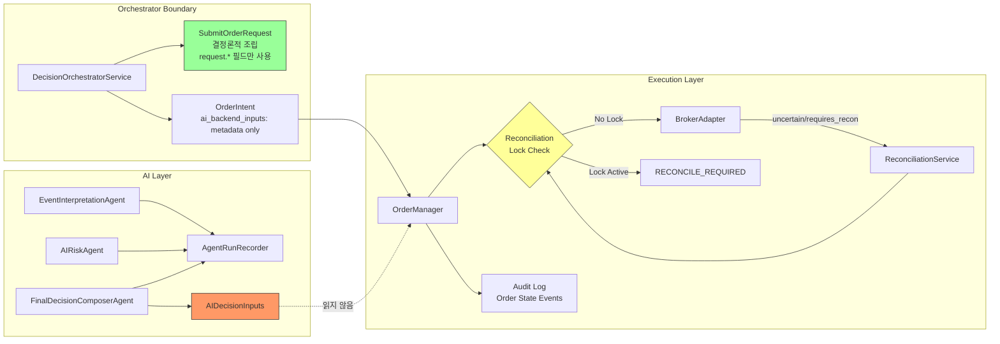

# Plan 32: AI-Broker Pre-Submit Safety Boundary Verification

## Revision History

| Rev | Date | Author | Change |
|-----|------|--------|--------|
| 1 | 2026-05-04 | Roo (Architect) | Initial plan |
| 2 | 2026-05-04 | Roo (Architect) | Rev 2: Test B/C/D 보강 — assemble()→OrderIntent.request만 broker submit, assemble()+OrderManager.create_order() 통합 흐름, uncertain 후 2차 submit broker call count 검증 |

---

## 1. 왜 이 작업을 다음 우선순위로 하는가

EI / AR / FDC real agent 구현, request chain, `AIDecisionInputs` backend contract, 3-agent runtime smoke, AIRiskAgent 입력 확장, position/cash/risk snapshot replay-safe 조회 보정까지 완료된 상태.

현재 AI layer는 판단 계층으로 동작하도록 설계되어 있지만, **"AI layer가 실제로 execution boundary를 우회하지 않는다"는 사실을 테스트로 고정하지 않았다.** 가장 큰 리스크는:

- AI layer가 broker submit payload를 직접 건드리거나 우회할 가능성 (설계상 불가하지만 증명 필요)
- Unknown order state에서 reconciliation보다 신규 주문이 우선되는 버그
- Paper broker + AI layer 조합에서 audit/replay 경계 약화

따라서 다음 작업은 **"AI layer와 execution layer 사이의 안전 경계를 테스트로 증명"** 하는 것이다.

---

## 2. 현재 Safety Boundary 현황

### 2.1 이미 확보된 경계

| 경계 | 근거 | 상태 |
|------|------|------|
| `SubmitOrderRequest`는 결정론적 조립 | `assemble()` 451-473: 모든 필드를 `request.*`에서 복사, `ai_backend_inputs` 미사용 | ✅ 설계 |
| `AIDecisionInputs`는 frozen dataclass | `decision_orchestrator.py` `slots=True, frozen=True` | ✅ 설계 |
| `OrderIntent`는 frozen dataclass | `OrderIntent`에 `ai_backend_inputs`는 metadata-only 필드 | ✅ 설계 |
| `OrderManager`는 AI 입력 미참조 | `order_manager.py` import에 `AIDecisionInputs` 없음 | ✅ 설계 |
| Reconciliation lock 우선 | `submit_order_to_broker()` 339-369: lock 존재 시 broker 호출 전 차단 | ✅ 구현 |
| Uncertain → RECONCILE_REQUIRED | 375-396: uncertain/requires_reconciliation 플래그 감지 | ✅ 구현 |
| Budget exhaustion 차단 | `create_order()` 198-206: `can_accept_new_entries` false 시 예외 | ✅ 구현 |
| KIS paper smoke read-only | `_read_only_guard`가 write ops monkeypatch 차단 | ✅ 구현 |

### 2.2 검증되지 않은 경계 (이번 작업 대상)

| 경계 | 현재 상태 | 필요한 검증 |
|------|-----------|------------|
| A. `ai_backend_inputs`가 `SubmitOrderRequest`에 영향 없음 | 설계만 있고 테스트로 고정 안 됨 | `ai_backend_inputs` populated 상태에서 `SubmitOrderRequest` 필드가 원본과 동일함을 단언 |
| B. `OrderManager`가 AI 입력을 무시 | 설계만 있고 증명 안 됨 | `OrderManager.submit_order_to_broker()` 호출 시 `ai_backend_inputs` 존재 여부와 무관하게 동일하게 동작 |
| C. Reconciliation-first 원칙 유지 | 단위 테스트는 있지만 통합 증명 부족 | Unknown broker result 후 reconciliation lock이 신규 submit을 차단하는 전체 흐름 검증 |
| D. AI recorder + order audit log 공존 | 개별 테스트만 있고 결합 검증 없음 | AI agent recorder가 order path audit log / state event를 약화시키지 않음 |

---

## 3. 변경 범위

### 3.1 포함

| 항목 | 파일 | 설명 |
|------|------|------|
| Test A | [`tests/services/test_decision_orchestrator.py`](tests/services/test_decision_orchestrator.py) | `test_ai_backend_inputs_does_not_affect_submit_request` — `OrderIntent.ai_backend_inputs`가 populated되어도 `SubmitOrderRequest`는 원본 유지 |
| Test B | [`tests/services/test_order_submit_to_broker.py`](tests/services/test_order_submit_to_broker.py) | `test_order_manager_ignores_ai_backend_inputs` — `OrderManager.submit_order_to_broker()`가 `ai_backend_inputs` 존재와 무관하게 동일 동작 |
| Test C | [`tests/services/test_order_submit_to_broker.py`](tests/services/test_order_submit_to_broker.py) | `test_reconciliation_lock_blocks_submission_after_uncertain` — uncertain 결과 후 reconciliation lock이 신규 submit 차단 |
| Test D | [`tests/services/test_decision_orchestrator.py`](tests/services/test_decision_orchestrator.py) | `test_ai_recorder_does_not_break_order_audit_path` — AI agent recorder + assemble() 호출 후 audit log / state event 정상 동작 확인 |
| Plan 문서 | [`plans/32_ai_broker_boundary_pre_submit_verification.md`](plans/32_ai_broker_boundary_pre_submit_verification.md) | 본 문서 |
| Index | [`plans/README.md`](plans/README.md) | 32번 항목 추가 |

### 3.2 포함하지 않음

- `SubmitOrderRequest` 필드 변경
- `OrderManager`, `BrokerAdapter`, `ReconciliationService` 인터페이스 변경
- `Bootstrap` / `Runtime` 수정
- KIS 실계정 전제 작업
- Hard guardrail 로직을 AI로 대체
- Threshold / sizing 계산을 AI로 이관
- Live trading 동작 변경
- 대규모 리팩터링

---

## 4. 상세 설계

### 4.1 Test A: `test_ai_backend_inputs_does_not_affect_submit_request`

**위치**: [`tests/services/test_decision_orchestrator.py`](tests/services/test_decision_orchestrator.py) — 기존 `TestOrderIntentExtensions` 클래스 내에 추가

**목적**: `OrderIntent.ai_backend_inputs`가 populated 상태에서도 `SubmitOrderRequest`의 모든 필드가 원본 `request`와 동일함을 단언.

**시나리오**:
1. `sample_request` fixture로 `assemble()` 호출 (기본 stub — 모든 AI agent default → `ai_backend_inputs`는 전부 default 값)
2. 반환된 `OrderIntent`에서 `request` 필드가 `sample_request`의 원본 값과 동일한지 검증:
   - `client_order_id`, `correlation_id`, `account_ref`, `symbol`, `market`, `side`, `order_type`, `quantity`, `price`, `time_in_force`, `decision_id`, `strategy_id`
3. `ai_backend_inputs`가 populated 되어도 위 필드들이 변경되지 않음을 단언

**검증 포인트**:
```python
intent = await service.assemble(sample_request)
# ai_backend_inputs는 기본값으로 populated됨
assert intent.ai_backend_inputs is not None
assert intent.ai_backend_inputs.decision_type == "HOLD"  # default

# SubmitOrderRequest는 원본 유지
assert intent.request.client_order_id == sample_request.client_order_id
assert intent.request.symbol == sample_request.symbol
assert intent.request.side == sample_request.side
assert intent.request.quantity == sample_request.quantity
assert intent.request.price == sample_request.price
# ... 모든 필드 검증
```

### 4.2 Test B: `test_assemble_request_only_passed_to_broker`

**위치**: [`tests/services/test_order_submit_to_broker.py`](tests/services/test_order_submit_to_broker.py)

**목적**: `DecisionOrchestratorService.assemble()`로 `OrderIntent`를 만든 뒤, `intent.request`만 `OrderManager.submit_order_to_broker()`에 전달하여 broker submit까지 진행. execution path가 오직 `SubmitOrderRequest`만 사용하고 `OrderIntent.ai_backend_inputs`는 broker payload에 전달되지 않음을 검증.

**시나리오**:
1. `build_in_memory_repositories()`로 repos 생성
2. `DecisionOrchestratorService` 생성 (stub AI agents — default `AIDecisionInputs`)
3. `assemble(sample_request)` 호출 → `OrderIntent` 획득
4. `intent.ai_backend_inputs`가 기본값으로 populated됨 확인 (decision_type="HOLD" 등)
5. `intent.request`만 `OrderManager.submit_order_to_broker()`에 전달
6. Mock broker가 수신한 `SubmitOrderRequest`가 `intent.request`와 동일하고, `ai_backend_inputs` 필드가 포함되지 않았음을 확인

**검증 포인트**:
```python
repos = build_in_memory_repositories()
orchestrator = DecisionOrchestratorService(repos=repos)
intent = await orchestrator.assemble(sample_request)

# ai_backend_inputs는 populated되어 있음
assert intent.ai_backend_inputs is not None
assert intent.ai_backend_inputs.decision_type == "HOLD"

# intent.request만 OrderManager에 전달
manager = OrderManager(repos=repos)
order = await manager.create_order(intent.request)
order = await manager.transition_to(order, OrderStatus.PENDING_SUBMIT)

mock_broker.submit_order.return_value = SubmitOrderResult(accepted=True, ...)
result = await manager.submit_order_to_broker(order, mock_broker, intent.request)

# broker는 SubmitOrderRequest만 수신 — ai_backend_inputs는 전달되지 않음
mock_broker.submit_order.assert_awaited_once()
called_request = mock_broker.submit_order.await_args[0][0]
assert isinstance(called_request, SubmitOrderRequest)
# ai_backend_inputs 필드는 SubmitOrderRequest에 존재하지 않음
assert not hasattr(called_request, "ai_backend_inputs")
# intent.request의 모든 필드가 그대로 전달
assert called_request.client_order_id == intent.request.client_order_id
assert called_request.symbol == intent.request.symbol
```

### 4.3 Test C: `test_reconciliation_lock_blocks_submission_after_uncertain`

**위치**: [`tests/services/test_order_submit_to_broker.py`](tests/services/test_order_submit_to_broker.py)

**목적**: Broker가 uncertain 결과를 반환한 후 reconciliation lock이 설정되면, 동일 account/symbol/side에 대한 2차 submit 시 broker 호출 없이 차단됨을 검증. 핵심은 **broker 호출 횟수**가 증가하지 않는 것.

**시나리오**:
1. `sample_order` fixture로 1차 submit: broker가 `uncertain=True` 반환
2. `submit_order_to_broker()`가 `RECONCILE_REQUIRED`로 전환 + reconciliation trigger 호출 (→ blocking lock 획득)
3. 동일 account/symbol/side에 대해 **별도의 `OrderRequestEntity`**로 2차 `submit_order_to_broker()` 호출
4. Reconciliation lock이 active 상태 → broker 호출 없이 `RECONCILE_REQUIRED`로 전환
5. `mock_broker.submit_order.assert_called_once()` — 2차 시도에서 broker 호출 증가 없음 확인

**검증 포인트**:
```python
# 1차 submit: uncertain 결과
mock_broker.submit_order.return_value = SubmitOrderResult(
    accepted=True, broker_order_id=None,  # → uncertain=True
    broker_status=OrderStatus.ACKNOWLEDGED,
    raw_code="TIMEOUT", uncertain=True,
)
result1 = await manager.submit_order_to_broker(order1, mock_broker, request)
assert result1.status == OrderStatus.RECONCILE_REQUIRED

# 1차 submit에서 broker는 1회 호출됨
assert mock_broker.submit_order.call_count == 1

# 2차 submit: 동일 account_id / symbol / side (order2는 다른 OrderRequestEntity지만
# reconciliation lock이 account_id + symbol + side 기준으로 blocking)
order2 = OrderRequestEntity(account_id=order1.account_id, ...)  # 동일 account
repos.orders.add(order2)
order2 = await manager.transition_to(order2, OrderStatus.PENDING_SUBMIT)

result2 = await manager.submit_order_to_broker(order2, mock_broker, request)
assert result2.status == OrderStatus.RECONCILE_REQUIRED
assert result2.status_reason_code == "BLOCKED"

# broker 호출 횟수는 여전히 1 — 2차에서는 lock에 막혀 broker 도달 못 함
assert mock_broker.submit_order.call_count == 1
```

### 4.4 Test D: `test_assemble_and_create_order_full_flow`

**위치**: [`tests/services/test_decision_orchestrator.py`](tests/services/test_decision_orchestrator.py)

**목적**: `assemble()` + `OrderManager.create_order()`를 하나의 통합 흐름으로 실행하여, AI recorder 3개 run과 order path audit log / order_state_events가 동시에 정상 동작함을 검증.

**시나리오**:
1. `DecisionOrchestratorService` + `OrderManager`를 동일한 `RepositoryContainer`로 생성
2. `assemble(sample_request)` 호출 → `OrderIntent` + recorder에 3개의 stub agent run 기록
3. `intent.request`로 `OrderManager.create_order()` 호출 → `OrderRequestEntity` 생성 (DRAFT)
4. 검증:
   - Recorder에 3개의 agent run이 존재하는가? (`_agent_recorder.list_by_decision_context()`)
   - Audit log에 `order.create` action이 기록되었는가?
   - `OrderRequestEntity`가 정상 생성되었는가? (status == DRAFT)
5. AI recorder와 order audit path가 동시에 정상 동작함을 증명

**검증 포인트**:
```python
repos = build_in_memory_repositories()

# seed a decision context + config version (needed for both assemble and create_order)
config_version = ConfigVersionEntity(...)
repos.config_versions._items[config_version.config_version_id] = config_version
context = DecisionContextEntity(
    decision_context_id=uuid4(), account_id=uuid4(), ...,
    config_version_id=config_version.config_version_id,
)
repos.decision_contexts._items[context.decision_context_id] = context

# seed account + instrument (needed for OrderManager.create_order)
account = AccountEntity(account_id=context.account_id, ...)
repos.accounts._items[account.account_id] = account
instrument = InstrumentEntity(instrument_id=uuid4(), symbol="005930", market_code="KRX", ...)
repos.instruments._items[instrument.instrument_id] = instrument

orchestrator = DecisionOrchestratorService(repos=repos)
intent = await orchestrator.assemble(
    sample_request, decision_context_id=context.decision_context_id,
)

# 1. Recorder에 3개 agent run 존재
assert intent.ai_backend_inputs.source_agent_names == ("ei", "ar", "fdc")
runs = orchestrator._agent_recorder.list_by_decision_context(context.decision_context_id)
assert len(runs) == 3

# 2. Order path: create_order
manager = OrderManager(repos=repos)
order = await manager.create_order(intent.request)
assert order.status == OrderStatus.DRAFT

# 3. Audit log 존재
audit_logs = await repos.audit_logs.list_by_correlation_id(intent.request.correlation_id)
assert any(log.action == "order.create" for log in audit_logs)

# 4. AI recorder + order audit path 동시 정상 동작
assert len(runs) == 3  # AI recorder
assert len(audit_logs) >= 1  # audit log
```

---

## 5. 변경 파일 목록

### 수정 파일

| 파일 | 변경 유형 | 설명 |
|------|-----------|------|
| [`tests/services/test_decision_orchestrator.py`](tests/services/test_decision_orchestrator.py) | 수정 | Test A: `test_ai_backend_inputs_does_not_affect_submit_request`<br>Test D: `test_ai_recorder_does_not_break_order_audit_path` |
| [`tests/services/test_order_submit_to_broker.py`](tests/services/test_order_submit_to_broker.py) | 수정 | Test B: `test_order_manager_ignores_ai_backend_inputs`<br>Test C: `test_reconciliation_lock_blocks_submission_after_uncertain` |
| [`plans/32_ai_broker_boundary_pre_submit_verification.md`](plans/32_ai_broker_boundary_pre_submit_verification.md) | 생성 | 본 문서 |
| [`plans/README.md`](plans/README.md) | 수정 | 32번 항목 추가 |

### 미변경 파일

- `src/` 내 모든 production code
- `SubmitOrderRequest`, `OrderManager`, `BrokerAdapter`, `ReconciliationService`
- `decision_orchestrator.py` production 코드
- `bootstrap.py`, runtime
- KIS adapter
- 기존 smoke 테스트

---

## 6. 테스트 실행 계획

```bash
# 신규 테스트만 실행
python3 -m pytest tests/services/test_decision_orchestrator.py::TestOrderIntentExtensions -v
python3 -m pytest tests/services/test_order_submit_to_broker.py -v

# 전체 회귀 (smoke 제외)
python3 -m pytest tests/ -v --ignore=tests/smoke
```

---

## 7. 완료 기준

1. Test A: `ai_backend_inputs`가 populated되어도 `SubmitOrderRequest` 원본 필드가 유지됨 → 통과
2. Test B: `OrderManager`가 `ai_backend_inputs` 존재와 무관하게 동일 동작 → 통과
3. Test C: Uncertain broker 결과 후 reconciliation lock이 신규 submit을 차단 → 통과
4. Test D: AI recorder + assemble() 호출 후 order path 정상 → 통과
5. 전체 회귀 테스트 412+ 통과 (기존 + 신규)

---

## 8. Mermaid: Safety Boundary Diagram



---

## 9. Scope Boundaries (변경하지 않는 것)

| 항목 | 사유 |
|------|------|
| `SubmitOrderRequest` 필드 구조 | AI가 broker payload를 직접 수정하지 않음을 테스트로 증명하는 것이 목적 |
| `OrderManager` 로직 | 현재 reconciliation-first 원칙이 올바르게 구현되어 있음 |
| `BrokerAdapter` interface | 변경 시 모든 adapter 구현체 영향 |
| `ReconciliationService` | 현재 lock/unlock/trigger 로직 유지 |
| AI agent 구현체 | 판단 계층 변경 없음 |
| `bootstrap.py` / runtime | wiring 변경 없음 |
| KIS 실계정 작업 | paper credential로만 smoke 가능 |
