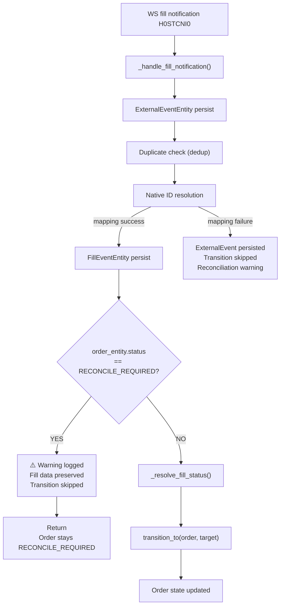

# Plan 34: RECONCILE_REQUIRED → FILLED 정책 재검토 및 Event Loop 보호 경계 강화

## Revision History

| Rev | Date | Author | Description |
|-----|------|--------|-------------|
| 1 | 2026-05-04 | Roo | 초안 |
| 2 | 2026-05-04 | Roo | gap-fill 경로 분석 추가, 테스트 설명 강화, follow-up 명시 |

---

## 1. 왜 이 작업을 하는가

### 1.1 현재 상태 (Plan 33 Known Gap)

[`_ALLOWED_TRANSITIONS`](src/agent_trading/services/order_manager.py:90)는 현재 `RECONCILE_REQUIRED → FILLED`를 허용한다:

```python
OrderStatus.RECONCILE_REQUIRED: {
    OrderStatus.ACKNOWLEDGED,
    OrderStatus.FILLED,       # ← KNOWN GAP (Plan 33 §6.1)
    OrderStatus.CANCELLED,
    OrderStatus.REJECTED,
    OrderStatus.EXPIRED,
},
```

이는 WebSocket full-fill notification이 [`_handle_fill_notification()`](src/agent_trading/services/event_loop.py:219)을 통해 도착하면, order가 `RECONCILE_REQUIRED` 상태임에도 불구하고 `FILLED`로 전이될 수 있음을 의미한다. reconciliation이 아직 완료되지 않았는데 order 상태가 낙관적으로 확정되는 것이다.

> **참고**: 현재 fill data ingestion 경로는 두 가지다.
> 1. **WS fill notification** (`_handle_fill_notification`) — ExternalEvent → FillEvent → `transition_to()`
> 2. **Gap-fill REST inquiry** (`trigger_gap_fill`) — ExternalEvent persist만 수행, `transition_to()` 호출하지 않음
>
> 따라서 optimistic state progression 위험은 WS 경로에 국한된다. gap-fill 경로는 `transition_to()`를 호출하지 않으므로 별도 guard가 필요하지 않다. 이번 Plan의 guard는 WS `_handle_fill_notification()`에만 적용한다.

### 1.2 리스크

| 시나리오 | 영향 |
|----------|-------|
| WS fill이 reconciliation보다 먼저 도착 → order가 FILLED로 전이 | Reconciliation이 다른 결과를 찾으면 (CANCELLED, REJECTED) 상태 불일치 발생 |
| Reconciliation이 mismatch를 감지했어야 하지만, order가 이미 FILLED여서 조용히 소비됨 | 감사 불가능한 상태 불일치 |
| 동일 order에 대해 WS fill + reconciliation fill이 경합 | 중복 체결 또는 상태 손상 |

### 1.3 프로젝트 원칙과의 연결

[`02_order_execution_sequence.md`](plan_docs/detailed_design/02_order_execution_sequence.md:178):
> When order state is unknown, do not submit a new order for the same account/symbol/strategy/side until reconciliation is completed.

이 원칙을 order 상태 전이에도 확장 적용한다: **unknown state에서는 state progression도 보류한다.**

---

## 2. 설계 결정

### 2.1 판단: 어느 계층에서 막을 것인가?

| 접근법 | 장점 | 단점 | 채택? |
|--------|------|------|-------|
| **A: `_ALLOWED_TRANSITIONS`에서 `FILLED` 제거** | State machine 자체가 차단, 모든 경로에 적용, 가장 강력한 보호 | 단일 변경으로 충분 | ✅ **Primary** |
| **B: Event loop guard만 추가** | WS 경로만 차단, 다른 경로는 영향 없음 | REST/gap-fill 등 다른 경로는 여전히 허용, 불완전 | ❌ |
| **C: Both** | Defense in depth, 명시적 의도 표현 | 중복 변경 | ✅ **Adopted** |

**채택: Option C (Both)**

이유:
1. `_ALLOWED_TRANSITIONS` 수정은 hard boundary — state machine 규칙 자체를 바꾼다
2. Event loop guard는 application-level explicit behavior — "fill data는 보존하되 상태 전이는 reconciliation에 위임"한다는 의도를 명시적으로 표현한다
3. 예외 기반 제어 흐름(exception-driven)을 피하고 명시적 가드로 대체한다

### 2.2 왜 Event Loop Guard도 필요한가

`_ALLOWED_TRANSITIONS`만 수정하면 `_handle_fill_notification`의 [`transition_to()` 호출](src/agent_trading/services/event_loop.py:317)이 `InvalidStateTransitionError`를 던지고, 기존 [`except` 블록](src/agent_trading/services/event_loop.py:328)이 이를 잡아낸다.

문제점:
- 제어 흐름이 예외에 의존한다 (exception-as-control-flow anti-pattern)
- 에러 메시지가 generic하다: `"OrderManager.transition_to failed for ... InvalidStateTransitionError"`
- Fill data 보존 의도가 코드에 명시적으로 드러나지 않는다

Event loop guard를 추가하면:
```python
if order_entity.status == OrderStatus.RECONCILE_REQUIRED:
    logger.warning(
        "Fill notification skipped for order %s — "
        "order is in RECONCILE_REQUIRED state. "
        "Fill data preserved. Reconciliation expected to resolve state.",
        order_entity.order_request_id,
    )
    return
```

이렇게 하면:
- 의도가 명시적: "RECONCILE_REQUIRED면 transition을 건너뛴다"
- 로그 메시지가 구체적: "왜 건너뛰었는지 + fill data는 보존됨 + reconciliation이 해결할 것"
- 제어 흐름이 예외에 의존하지 않음

### 2.3 Fill Ingestion 경로 분석: WS 전용 Guard

이번 Plan의 guard는 WS `_handle_fill_notification()`에만 적용한다. 그 이유:

| 경로 | transition_to 호출? | guard 필요? |
|------|-------------------|-------------|
| [`_handle_fill_notification()`](src/agent_trading/services/event_loop.py:219) (WS H0STCNI0) | **예** — `_resolve_fill_status()` → `transition_to()` | ✅ 적용 대상 |
| [`trigger_gap_fill()`](src/agent_trading/services/event_loop.py:428) (REST inquire-daily-ccld) | **아니오** — ExternalEvent persist만 수행 | ❌ 불필요 (`transition_to` 호출 없음) |
| [`get_fills()`](src/agent_trading/brokers/base.py:162) (BrokerAdapter protocol) | **아니오** — raw `FillEvent` domain model 반환 | ❌ 불필요 (Repository 계층) |

Gap-fill 경로(`trigger_gap_fill`)는 REST를 통해 누락된 체결 데이터를 조회하여 ExternalEvent로 저장할 뿐, `OrderManager.transition_to()`를 호출하지 않는다. 따라서 WS 경로만 보호하면 충분하다. 만약 향후 gap-fill 경로에서도 `transition_to()`를 호출하도록 확장된다면, 그때는 이미 `_ALLOWED_TRANSITIONS`에서 `FILLED`가 제거되어 있으므로 state machine이 자동으로 차단한다.

### 2.4 Reconciliation Path는 그대로 둔다

`resolve_and_mark()` ([`reconciliation_service.py:369`](src/agent_trading/services/reconciliation_service.py:369))는 현재 order 상태를 변경하지 않는다. reconciliation run의 status만 `"resolved"`로 변경한다.

**현재 한계**: `resolve_and_mark()`가 broker inquiry로 확인한 resolved status(예: FILLED, CANCELLED)를 order state에 반영하지 않는다. 즉, reconciliation이 완료되어도 order는 `RECONCILE_REQUIRED` 상태에 남아 있다.

**이번 Plan의 범위**: **optimistic transition 차단**까지만 수행한다.
- WS fill notification이 `RECONCILE_REQUIRED` order를 `FILLED`로 전이하는 것을 막는다
- Fill data는 보존한다 (ExternalEvent + FillEvent persist 유지)
- reconciliation이 완료될 때까지 order 상태를 보류한다

**다음 단계 (이번 범위 밖)**: **reconciliation resolved result를 order state에 반영**하는 정책이 필요하다.
- `resolve_and_mark()`가 broker inquiry 결과를 바탕으로 `transition_to()`를 호출하도록 확장
- 또는 caller(예: DecisionOrchestrator)가 `resolve_and_mark()` 호출 후 `transition_to()`를 호출
- 이는 별도 설계 검토 필요 — Section 11 Follow-up 참고

---

## 3. 변경 상세

### 3.1 [`src/agent_trading/services/order_manager.py`](src/agent_trading/services/order_manager.py)

**Line 90-96**: `OrderStatus.FILLED`를 `_ALLOWED_TRANSITIONS[OrderStatus.RECONCILE_REQUIRED]`에서 제거

```python
# Before
OrderStatus.RECONCILE_REQUIRED: {
    OrderStatus.ACKNOWLEDGED,
    OrderStatus.FILLED,       # ← 제거
    OrderStatus.CANCELLED,
    OrderStatus.REJECTED,
    OrderStatus.EXPIRED,
},

# After
OrderStatus.RECONCILE_REQUIRED: {
    OrderStatus.ACKNOWLEDGED,
    OrderStatus.CANCELLED,
    OrderStatus.REJECTED,
    OrderStatus.EXPIRED,
},
```

**영향**:
- 모든 `transition_to(order, FILLED)` 호출 (order가 RECONCILE_REQUIRED 상태일 때) → `InvalidStateTransitionError`
- WS fill, REST poll, operator action 등 모든 `transition_to()` 호출 경로에 적용
- 단, gap-fill 경로(`trigger_gap_fill`)는 `transition_to()`를 호출하지 않으므로 직접적 영향 없음
- reconciliation이 완료되기 전까지 order는 `RECONCILE_REQUIRED` 상태 유지

### 3.2 [`src/agent_trading/services/event_loop.py`](src/agent_trading/services/event_loop.py)

**Line 312-334**: `_handle_fill_notification()`에 RECONCILE_REQUIRED guard 추가

```python
# After FillEventEntity persist (line 310), before transition_to (line 316):

if order_entity.status == OrderStatus.RECONCILE_REQUIRED:
    logger.warning(
        "Fill notification skipped for order %s — "
        "order is in RECONCILE_REQUIRED state. "
        "Fill data preserved. Reconciliation expected to resolve state.",
        order_entity.order_request_id,
    )
    return  # ← transition_to를 호출하지 않고 반환
```

**데이터 흐름**:
```
WS fill notification
  → ExternalEvent persisted ✓
  → FillEvent persisted ✓
  → order_entity.status == RECONCILE_REQUIRED? → YES
  → transition_to SKIPPED (guard return)
  → Warning logged
```

**Partial fill case**: `PARTIALLY_FILLED`는 `_ALLOWED_TRANSITIONS[RECONCILE_REQUIRED]`에 없었음 (Plan 33 Test A). Event loop guard는 모든 fill notification에 대해 작동하므로 partial fill도 동일하게 보호된다.

### 3.3 테스트 파일

#### 3.3.1 [`tests/services/test_order_state_transition.py`](tests/services/test_order_state_transition.py)

**`test_reconcile_required_to_filled`** (line 168-175): expectation 변경

```python
# Before: transition succeeds
async def test_reconcile_required_to_filled(self, ...):
    ...
    result = await order_manager.transition_to(order, OrderStatus.FILLED)
    assert result.status == OrderStatus.FILLED

# After: transition raises InvalidStateTransitionError
async def test_reconcile_required_to_filled_blocked(self, ...):
    ...
    with pytest.raises(InvalidStateTransitionError):
        await order_manager.transition_to(order, OrderStatus.FILLED)
```

#### 3.3.2 [`tests/services/test_unknown_state_reconciliation_boundary.py`](tests/services/test_unknown_state_reconciliation_boundary.py)

**Test B 클래스 (`TestWsFullFillOnReconcileRequiredCurrentlyAllowedKnownGap`)**: Known gap 문서화에서 safety verification test로 전환

**핵심 원칙**: 모든 테스트명과 docstring에 `"fill data preserved, order state progression held until reconciliation"` 원칙이 드러나야 한다.

- **클래스명 변경**: `TestWsFullFillOnReconcileRequiredCurrentlyAllowedKnownGap` → `TestWsFullFillOnReconcileRequiredFillDataPreservedStateHeld`
- **클래스 docstring**:
  ```
  SAFETY VERIFICATION: RECONCILE_REQUIRED → FILLED is now blocked.
  
  Core principle: fill data is preserved (ExternalEvent + FillEvent persisted),
  but order state progression is held until reconciliation completes.
  
  Previous behavior (Plan 33 known gap): WS full fill could optimistically
  transition order from RECONCILE_REQUIRED to FILLED.
  
  Current behavior (Plan 34 fix):
  1. State machine (_ALLOWED_TRANSITIONS) blocks RECONCILE_REQUIRED → FILLED
  2. Event loop guard (_handle_fill_notification) explicitly skips transition_to
  3. ExternalEvent + FillEvent are still persisted (data preservation)
  4. Order stays RECONCILE_REQUIRED until reconciliation resolves state
  ```
- **`test_full_fill_transition_from_reconcile_required_succeeds`** → `test_reconcile_required_to_filled_state_machine_blocked`:
  - `pytest.raises(InvalidStateTransitionError)`로 변경
  - docstring: "State machine blocks RECONCILE_REQUIRED → FILLED via _ALLOWED_TRANSITIONS"
- **`test_event_loop_full_fill_on_reconcile_required_allowed`** → `test_ws_full_fill_on_reconcile_required_data_preserved_state_held`:
  - Order가 FILLED가 아니라 RECONCILE_REQUIRED로 남아있는지 검증
  - ExternalEvent + FillEvent가 persist되었는지 검증 (data preservation 원칙)
  - docstring: "WS full fill: ExternalEvent + FillEvent persisted, order stays RECONCILE_REQUIRED"

#### 3.3.3 신규 테스트 (Test B 내에 추가)

**`test_ws_partial_fill_on_reconcile_required_data_preserved_state_held`**: Partial fill도 동일하게 차단되는지 검증
- ExternalEvent + FillEvent persisted (data preservation)
- Order stays RECONCILE_REQUIRED (state progression held)
- docstring: "WS partial fill during RECONCILE_REQUIRED: data preserved, state held"

#### 3.3.4 [`tests/services/test_event_loop_integration.py`](tests/services/test_event_loop_integration.py)

**`test_full_fill_transition`** (line 269-300): 이 테스트는 `sample_order_entity`가 기본 `DRAFT` 상태이므로 변경 영향 없음. 확인만.

---

## 4. 변경하지 않는 것 (Scope Boundaries)

| 항목 | 이유 |
|------|------|
| Reconciliation path에 `transition_to()` 추가 | `ReconciliationService`는 `OrderManager`에 의존하지 않음; caller가 처리 (Section 12 참고) |
| `resolve_and_mark()` 시그니처 변경 | 이번 범위 밖 |
| `_ALLOWED_TRANSITIONS[RECONCILE_REQUIRED]`에서 다른 상태 제거 | `ACKNOWLEDGED`, `CANCELLED`, `REJECTED`, `EXPIRED`는 reconciliation 결과로 유효 |
| Broker adapter redesign | 범위 밖 |
| AI layer | 범위 밖 |
| KIS live/paper 실연동 | 범위 밖 |
| Hard guardrail 전체 재설계 | 범위 밖 |

---

## 5. 수정 파일 목록

### 수정

| 파일 | 변경 내용 |
|------|-----------|
| [`src/agent_trading/services/order_manager.py`](src/agent_trading/services/order_manager.py) | `_ALLOWED_TRANSITIONS`에서 `FILLED` 제거 |
| [`src/agent_trading/services/event_loop.py`](src/agent_trading/services/event_loop.py) | `_handle_fill_notification()`에 `RECONCILE_REQUIRED` guard 추가 |
| [`tests/services/test_order_state_transition.py`](tests/services/test_order_state_transition.py) | `test_reconcile_required_to_filled` → `test_reconcile_required_to_filled_blocked` |
| [`tests/services/test_unknown_state_reconciliation_boundary.py`](tests/services/test_unknown_state_reconciliation_boundary.py) | Test B class → safety verification으로 전환 |
| [`plans/33_post_submit_reconciliation_boundary.md`](plans/33_post_submit_reconciliation_boundary.md) | Known gap → "Resolved by Plan 34" 연결 추가 |
| [`plans/README.md`](plans/README.md) | Plan 34 설명 추가 |

---

## 6. 테스트 전략

### 6.1 신규/변경 테스트

| 테스트 | 클래스 | 검증 내용 | 비고 |
|--------|--------|-----------|------|
| `test_reconcile_required_to_filled_blocked` | `TestForbiddenTransitions` | state machine이 `InvalidStateTransitionError` throw | 기존 test rename + expectation 변경 |
| `test_reconcile_required_to_filled_state_machine_blocked` | Test B (rename) | `transition_to(RECONCILE_REQUIRED, FILLED)` → error | Known gap → safety verification |
| `test_ws_full_fill_on_reconcile_required_data_preserved_state_held` | Test B (rename) | WS full fill: ExternalEvent+FillEvent persisted, order stays RECONCILE_REQUIRED | Known gap → safety verification |
| `test_ws_partial_fill_on_reconcile_required_data_preserved_state_held` | Test B (신규) | WS partial fill: data preserved, state held | 신규 |

### 6.2 영향을 받지 않는 기존 테스트

| 테스트 파일 | 이유 |
|-------------|------|
| `test_event_loop_integration.py::test_partial_fill_transition` | DRAFT 상태 order 사용 — RECONCILE_REQUIRED 경로 아님 |
| `test_event_loop_integration.py::test_full_fill_transition` | DRAFT 상태 order 사용 — RECONCILE_REQUIRED 경로 아님 |
| `test_unknown_state_reconciliation_boundary.py::TestA` | Partial fill on RECONCILE_REQUIRED — 이미 차단, 변경 없음 |
| `test_unknown_state_reconciliation_boundary.py::TestC/D/E` | Reconciliation lock/resolve — 변경 없음 |
| `test_order_submit_to_broker.py` | Submit 경로 — RECONCILE_REQUIRED → FILLED 경로 아님 |

### 6.3 회귀 위험

가장 취약한 경로: `ACKNOWLEDGED → FILLED`, `PARTIALLY_FILLED → FILLED` — 변경 없음, 영향 없음.

---

## 7. 실행 순서

1. `order_manager.py` — `_ALLOWED_TRANSITIONS` 수정
2. `event_loop.py` — `_handle_fill_notification()` guard 추가
3. `test_order_state_transition.py` — `test_reconcile_required_to_filled_blocked`로 변경
4. `test_unknown_state_reconciliation_boundary.py` — Test B class 변경 + 신규 테스트 추가
5. 전 테스트 실행 및 회귀 확인
6. Plan 문서 업데이트

---

## 8. 완료 기준

| 기준 | 검증 |
|------|------|
| `RECONCILE_REQUIRED` 상태에서 `transition_to(FILLED)` 호출 → `InvalidStateTransitionError` | `test_reconcile_required_to_filled_blocked` |
| WS full fill notification: order stays `RECONCILE_REQUIRED`, fill data preserved | `test_event_loop_full_fill_on_reconcile_required_blocked` |
| WS partial fill notification: order stays `RECONCILE_REQUIRED`, fill data preserved | `test_event_loop_partial_fill_on_reconcile_required_blocked` |
| 기존 normal fill 경로 회귀 없음 | `test_partial_fill_transition`, `test_full_fill_transition` |
| `ACKNOWLEDGED → FILLED` 경로 영향 없음 | `test_acknowledged_to_filled` |

---

## 9. Mermaid: 변경 후 데이터 흐름



---

## 10. Plan 33 Known Gap 상태 업데이트

[`plans/33_post_submit_reconciliation_boundary.md`](plans/33_post_submit_reconciliation_boundary.md)의 §6.1 (Test B)에 다음 문구를 추가:

> **Plan 34로 해소됨**: `_ALLOWED_TRANSITIONS[RECONCILE_REQUIRED]`에서 `FILLED`가 제거되었고, event loop guard가 추가되어 reconciliation-first 원칙이 강화되었다. 기존 characterization test는 safety verification test로 전환되었다. 자세한 내용은 [`plans/34_reconcile_required_fill_transition_policy.md`](plans/34_reconcile_required_fill_transition_policy.md) 참고.

---

## 11. Follow-up (이번 범위 밖)

### 11.1 최우선: Reconciliation Path에서 Order 상태 전이 (authoritative state reflection)

**👉 Resolved by [Plan 35](35_reconciliation_authoritative_state_reflection.md)**

~~이번 Plan은 **optimistic transition 차단**까지만 수행했다.~~

Plan 35가 reconciliation authoritative state reflection을 구현하여, 아래 갭을 해결했다:

```text
Plan 34 (이전):  WS fill (RECONCILE_REQUIRED) → 차단됨 ✅
                 Reconciliation 완료 (FILLED 확인) → order는 RECONCILE_REQUIRED 상태 유지 ❌

Plan 35 (해결):  Reconciliation 완료 (FILLED 확인) →
                   transition_to_authoritative() → order 상태 반영 ✅
                   실패 시 → run="reflection_failed", lock 유지, error 기록
```

**Plan 35의 핵심 설계**:
1. `_ALLOWED_TRANSITIONS`는 **불변 유지** — `FILLED`를 복원하지 않고, `transition_to_authoritative()` 전용 메서드 신규 생성
2. `transition_to_authoritative()`는 `_validate_transition()`을 **SKIP** — reconciliation 경로 전용
3. `_AUTHORITATIVE_REFLECTION_TARGETS` (`FROZENSET`)로 target_status 검증 — `PARTIALLY_FILLED` 제외
4. `resolve_and_mark(order_manager=...)` parameter-based injection — **순환 의존 없음**, backward compatible
5. 성공 순서: authoritative transition → audit/state event → run resolved → lock release
6. 실패 시: `ReconciliationStatus.REFLECTION_FAILED` + lock 유지 + `summary_json["reflection_error"]` 기록

**구현 파일**:
- `src/agent_trading/domain/enums.py` — `REFLECTION_FAILED` enum 추가
- `src/agent_trading/services/order_manager.py` — `transition_to_authoritative()`, `_transition_to_core()`, `_AUTHORITATIVE_REFLECTION_TARGETS`, `_validate_authoritative_target()`
- `src/agent_trading/services/reconciliation_service.py` — `resolve_and_mark(order_manager=...)` reflection 로직, `_resolve_order_for_reflection()` helper
- `tests/services/test_order_state_transition.py` — `TestAuthoritativeTransitions` (4 tests)
- `tests/services/test_unknown_state_reconciliation_boundary.py` — Test D 확장 (3 tests) + Test F (6 tests)

### 11.2 기타 후속 항목

| 항목 | 설명 |
|------|------|
| RECONCILE_REQUIRED → ACKNOWLEDGED 경로 재검토 | 현재 `ACKNOWLEDGED`는 허용됨. reconciliation이 ACKNOWLEDGED를 발견하면 order를 ACKNOWLEDGED로 전이해도 되는가? |
| RECONCILE_REQUIRED → CANCELLED/REJECTED/EXPIRED 경로 유효성 | reconciliation 결과로 terminal state로 전이될 때 추가 검증이 필요한가? |
| Gap-fill 경로에 `transition_to()` 추가 검토 | 현재는 ExternalEvent persist만 수행하지만, 향후 fill data → order state 반영이 필요하면 state machine이 이미 차단 |

---

## 12. 설계 판단 근거 요약

| 질문 | 답변 | 근거 |
|------|------|------|
| RECONCILE_REQUIRED → WS full-fill → FILLED가 맞는가? | **아니오** | reconciliation-first 원칙 위반, 상태 불일치 리스크 |
| 어느 계층에서 막을 것인가? | **`_ALLOWED_TRANSITIONS` + Event loop guard** | State machine은 hard boundary, guard는 explicit behavior |
| 데이터 보존은? | **ExternalEvent + FillEvent persist 유지** | transition_to만 보류, data ingest는 그대로 |
| State progression만 막을 수 있는가? | **예** | Fill data 저장 후 guard return — atomic하지 않지만 safety-first |
| Reconciliation이 authoritative path인가? | **현재는 부분적** | `resolve_and_mark()`가 run status는 resolved로 변경하나 order 상태는 변경하지 않음. Follow-up에서 해결 |
