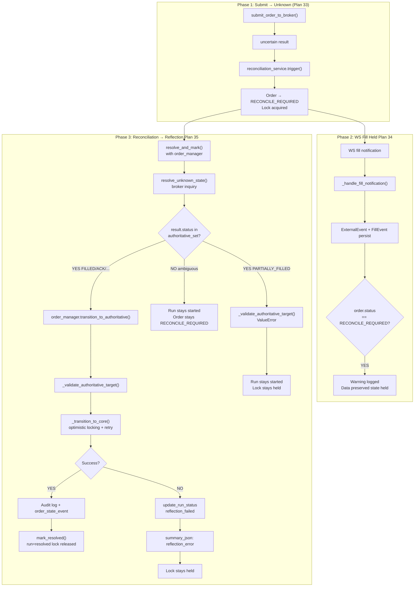

# Plan 35: Reconciliation Authoritative State Reflection

## Revision History

| Revision | Date       | Description |
|----------|------------|-------------|
| Rev 1    | 2026-05-04 | Initial design — Option A with parameter-based OrderManager injection |
| Rev 2    | 2026-05-04 | User feedback 반영: (1) `_ALLOWED_TRANSITIONS` 불변 유지 → `transition_to_authoritative()` 전용 메서드. (2) Reflection 실패 시 run/lock 유지 |

---

## 1. 왜 이 작업을 하는가

### 1.1 현재 상태

Plan 33과 34를 통해 두 가지 safety boundary가 확보되었다:

| Plan | 경계 | 상태 |
|------|------|------|
| 33 | Post-submit reconciliation lock + broker inquiry path | ✅ 완료 |
| 34 | RECONCILE_REQUIRED → FILLED optimistic transition 차단 (event loop guard + state machine) | ✅ 완료 |

### 1.2 남은 갭

Plan 34가 "상태를 섣불리 바꾸지 않는 것"은 확보했지만, **"언제, 어떻게 상태를 최종 반영할 것인가"** 는 남아있다.

현재 [`ReconciliationService.resolve_and_mark()`](src/agent_trading/services/reconciliation_service.py:369)의 동작:

```
broker_inquiry → FILLED 확인 → run.resolved = true, lock released
                              → order.status = RECONCILE_REQUIRED (그대로) ❌
```

즉, reconciliation이 authoritative result를 확인했지만, 그 결과가 `OrderRequestEntity.status`에 반영되지 않는다. Order는 `RECONCILE_REQUIRED`에 머물러 있고, 이후 fill notification이 와도 Plan 34 guard에 막힌다.

### 1.3 이번 작업의 목표

Reconciliation이 broker inquiry를 통해 authoritative status를 확인했을 때, 그 결과를 order state에 안전하게 반영하는 정책과 구현을 추가한다.

**핵심 원칙**: "fill data는 보존, state progression은 hold (Plan 34)" → "reconciliation resolved → authoritative state reflection (Plan 35)"

---

## 2. 설계

### 2.1 Option 비교

#### Option A (권장): `resolve_and_mark()` 내부에서 `OrderManager.transition_to()` 호출

```
resolve_and_mark()
  → resolve_unknown_state()  (broker inquiry)
  → if status in authoritative_set:
      → transition_to_authoritative(order, resolved_status)  ← NEW 전용 메서드
      → if success: mark_resolved()  (run resolved + lock release)
      → if failure: run/lock 유지, summary_json에 error 기록
  → return result
```

**장점**:
- Reconciliation lifecycle + authoritative reflection이 하나의 흐름으로 묶임
- Caller가 추가 orchestration을 몰라도 됨 — `resolve_and_mark()` 호출 한 번으로 완결
- 기존 Test D caller(`resolve_and_mark()` 사용)가 변경 없이 reflection 기능을 자동 획득

**단점**:
- `ReconciliationService`가 `OrderManager`를 알아야 함

#### Option B: Caller가 별도 orchestration

```
caller:
  result = resolve_unknown_state()
  if result.status in authoritative_set:
    transition_to(order, result.status)
    mark_resolved(run_id)
```

**장점**:
- 서비스 경계 깔끔
**단점**:
- 호출자마다 구현 흩어짐. 기존 caller 모두 수정 필요.

#### 판단: **Option A 채택**

### 2.2 순환 의존 해결 방법

현재 의존 구조:
- `OrderManager.reconciliation_service: ReconciliationService \| None = None` — **optional**
- `ReconciliationService.__init__(repos: RepositoryContainer)` — OrderManager 없음

**해결책**: Constructor injection이 아닌 **parameter-based injection** 사용

```python
class ReconciliationService:
    async def resolve_and_mark(
        self,
        ...,
        order_manager: OrderManager | None = None,  # ← NEW optional parameter
    ) -> OrderStatusResult:
```

이 방식의 장점:
1. **순환 의존 없음** — `ReconciliationService`는 `OrderManager`를 생성자에서 알지 않음
2. **Backward compatible** — `order_manager`를 전달하지 않은 기존 caller는 동일하게 동작
3. **명시적** — call site에서 "이 호출은 state reflection이 필요하다"는 의도가 드러남
4. **테스트 용이** — mock 또는 real OrderManager 전달

### 2.3 `_ALLOWED_TRANSITIONS`는 그대로 — 별도 전용 메서드 `transition_to_authoritative()`

**Plan 34의 hard boundary는 유지한다.** `_ALLOWED_TRANSITIONS[RECONCILE_REQUIRED]`에 `FILLED`를 복원하지 않는다.

대신 `OrderManager`에 **reconciliation authoritative reflection 전용 메서드**를 추가한다:

```python
class OrderManager:
    async def transition_to_authoritative(
        self,
        order: OrderRequestEntity,
        target_status: OrderStatus,
        *,
        reconciliation_run_id: UUID,
        reason_message: str | None = None,
    ) -> OrderRequestEntity:
        """Authoritative state reflection for reconciliation path ONLY.
        
        SKIPS _validate_transition() because this transition is driven
        by the broker's authoritative inquiry response, not by an
        optimistic WS fill.  All other safeguards are preserved:
        optimistic locking, audit log, order_state_event.
        
        Regular callers MUST use transition_to() which enforces
        _ALLOWED_TRANSITIONS.
        """
```

#### 왜 별도 메서드인가?

| 구분 | `transition_to()` | `transition_to_authoritative()` |
|------|-------------------|--------------------------------|
| `_validate_transition()` | ✅ 적용 | ❌ 건너뜀 (reconciliation 전용) |
| Optimistic locking | ✅ 유지 | ✅ 유지 |
| Audit log (status_change) | ✅ 유지 | ✅ 유지 (actor="reconciliation_service") |
| Order state event | ✅ 유지 | ✅ 유지 (reason_code="RECONCILIATION_RESOLVED") |
| Terminal state protection | ✅ 유지 | ✅ 유지 |
| 호출 가능자 | 모든 caller | ReconciliationService만 |
| reason_code | caller 지정 | `RECONCILIATION_RESOLVED` 고정 |

#### 내부 구현: `transition_to()`와 코드 중복 방지

`transition_to()`의 내부 로직(optimistic locking retry + audit 기록)을 `_transition_to_core()`로 추출:

```python
async def transition_to(self, order, target_status, ...):
    _validate_transition(order.order_request_id, order.status, target_status)
    return await self._transition_to_core(order, target_status, ...)

async def transition_to_authoritative(self, order, target_status, ...):
    # _validate_transition() SKIPPED — authorized by reconciliation
    # BUT terminal state protection is still enforced inside _transition_to_core
    return await self._transition_to_core(order, target_status, ...)

async def _transition_to_core(self, order, target_status, ...):
    # Optimistic locking retry loop (shared logic)
    # Audit log + order_state_event recording (shared logic)
    # Terminal state detection on version conflict (shared logic)
```

이렇게 하면:
- 코드 중복 없음
- `_validate_transition()`만 선택적으로 skip
- 모든 다른 safeguard는 동일하게 유지

### 2.4 Authoritative Status Set

Reconciliation이 broker inquiry로 확인했을 때 order state에 반영할 status:

| Status | 포함? | 근거 |
|--------|-------|------|
| `FILLED` | ✅ | Broker가 체결 완료 확인 — 가장 중요한 authoritative result |
| `ACKNOWLEDGED` | ✅ | Broker가 주문 접수 확인 — 정상 상태로 복귀 |
| `CANCELLED` | ✅ | Broker가 취소 확인 — terminal state |
| `REJECTED` | ✅ | Broker가 거절 확인 — terminal state |
| `EXPIRED` | ✅ | Broker가 만료 확인 — terminal state |
| `PARTIALLY_FILLED` | ❌ 제외 | 부분 체결은 추가 fill 가능성 존재. 현재 정책상 RECONCILE_REQUIRED 유지가 안전 |

`transition_to_authoritative()` 내부에서 target_status 검증:

```python
_AUTHORITATIVE_REFLECTION_TARGETS: frozenset[OrderStatus] = frozenset({
    OrderStatus.FILLED,
    OrderStatus.ACKNOWLEDGED,
    OrderStatus.CANCELLED,
    OrderStatus.REJECTED,
    OrderStatus.EXPIRED,
})

def _validate_authoritative_target(target_status: OrderStatus) -> None:
    if target_status not in _AUTHORITATIVE_REFLECTION_TARGETS:
        raise ValueError(
            f"{target_status.value} is not a valid authoritative reflection target. "
            f"Allowed: {', '.join(s.value for s in _AUTHORITATIVE_REFLECTION_TARGETS)}"
        )
```

### 2.5 Reflection 실패/Unresolved 정책

#### 핵심 원칙: **inquiry success ≠ state convergence success**

Broker inquiry가 성공해도 local order state 반영이 실패하면 복구는 완료된 것이 아니다. 두 단계를 분리한다.

| 시나리오 | Broker inquiry | State reflection | Run status | Lock | summary_json |
|----------|---------------|-----------------|------------|------|-------------|
| Broker가 authoritative status 반환 + reflection 성공 | ✅ 성공 | ✅ 성공 | `resolved` | 해제 | `resolved_status`, `reflected_at` |
| Broker가 authoritative status 반환 but reflection 실패 (e.g. version conflict, terminal state) | ✅ 성공 | ❌ 실패 | `reflection_failed` (신규 상태) | **유지** | `resolved_status`, `reflection_error`, `error_timestamp` |
| Broker가 여전히 ambiguous status 반환 | ✅ 성공 | ❌ 해당 없음 | `started` (그대로) | 유지 | 변경 없음 |
| Broker API 자체 실패 (network, auth) | ❌ 실패 | ❌ 해당 없음 | `started` (그대로) | 유지 | 변경 없음 |

#### Run status 신규 값: `reflection_failed`

현재 `ReconciliationRunEntity.status`는 `started` / `resolved` 두 가지만 있다. `reflection_failed`를 추가한다:

```python
# enums.py (기존 ReconciliationStatus)
class ReconciliationStatus(str, Enum):
    STARTED = "started"
    RESOLVED = "resolved"
    REFLECTION_FAILED = "reflection_failed"  # NEW: inquiry succeeded but state reflection failed
```

이 상태는:
- `resolved`가 아니므로 reconciliation-first 원칙 위반 없음
- Lock이 유지되므로 새로운 submit이 차단됨 (safety)
- Operator가 `reflection_failed` run을 보고 재시도 가능
- 재시도는 동일한 `resolve_and_mark()` 호출로 가능 (idempotent)

#### Reflection 실패 세부 정책

```python
try:
    await order_manager.transition_to_authoritative(
        order,
        result.status,
        reconciliation_run_id=reconciliation_run_id,
    )
    # Success → mark resolved
    await self.mark_resolved(
        reconciliation_run_id,
        summary_json={
            "resolved_via": "broker_inquiry",
            "resolved_status": result.status.value,
            "broker_order_id": result.broker_order_id,
            "client_order_id": result.client_order_id,
        },
    )
except Exception as exc:
    # Failure → update run status without resolving
    logger.error(
        "Authoritative reflection failed for run %s: %s",
        reconciliation_run_id, exc,
    )
    await self._repos.reconciliations.update_run_status(
        reconciliation_run_id,
        status="reflection_failed",
        summary_json={
            "resolved_via": "broker_inquiry",
            "resolved_status": result.status.value,
            "reflection_error": str(exc),
            "error_timestamp": datetime.now(timezone.utc).isoformat(),
            "broker_order_id": result.broker_order_id,
            "client_order_id": result.client_order_id,
        },
    )
    # Lock is NOT released — stays held until retry or operator intervention
```

---

## 3. 변경 상세

### 3.1 [`src/agent_trading/domain/enums.py`](src/agent_trading/domain/enums.py)

**변경: `ReconciliationStatus`에 `REFLECTION_FAILED` 추가**

```python
class ReconciliationStatus(str, Enum):
    STARTED = "started"
    RESOLVED = "resolved"
    REFLECTION_FAILED = "reflection_failed"  # NEW
```

### 3.2 [`src/agent_trading/services/order_manager.py`](src/agent_trading/services/order_manager.py)

**변경 1: `_AUTHORITATIVE_REFLECTION_TARGETS` 상수 추가**

```python
# 기존 _ALLOWED_TRANSITIONS, _TERMINAL_STATES 뒤에 추가
_AUTHORITATIVE_REFLECTION_TARGETS: frozenset[OrderStatus] = frozenset({
    OrderStatus.FILLED,
    OrderStatus.ACKNOWLEDGED,
    OrderStatus.CANCELLED,
    OrderStatus.REJECTED,
    OrderStatus.EXPIRED,
})
```

**변경 2: `_transition_to_core()` 추출**

기존 `transition_to()`에서 `_validate_transition()`을 제외한 내부 로직(optimistic locking retry + audit)을 `_transition_to_core()` private 메서드로 추출.

```python
async def transition_to(self, order, target_status, *, ...):
    _validate_transition(order.order_request_id, order.status, target_status)
    return await self._transition_to_core(order, target_status, ...)

async def _transition_to_core(self, order, target_status, *, 
                              reason_code=None, reason_message=None,
                              actor_type="system", actor_id="order_manager",
                              max_retries=3, retry_delay=0.05):
    """Shared core: optimistic locking retry + audit + order_state_event."""
    before = order
    after = _replace_status(order, target_status, reason_code=reason_code, reason_message=reason_message)
    
    last_exc = None
    for attempt in range(max_retries):
        try:
            await self.repos.orders.update_status(...)
            last_exc = None
            break
        except VersionConflictError as exc:
            ...  # (기존 retry 로직 그대로)
    if last_exc is not None:
        raise last_exc
    
    await self._record_order_state_event(before, after)
    await self._record_status_change(before, after, actor_type, actor_id)
    return after
```

**변경 3: `transition_to_authoritative()` 신규 메서드**

```python
async def transition_to_authoritative(
    self,
    order: OrderRequestEntity,
    target_status: OrderStatus,
    *,
    reconciliation_run_id: UUID,
    reason_message: str | None = None,
    max_retries: int = 3,
    retry_delay: float = 0.05,
) -> OrderRequestEntity:
    """Authoritative state reflection for reconciliation path ONLY.

    This method is EXCLUSIVELY for use by ReconciliationService when
    a broker inquiry has resolved an unknown order state.

    Design rationale
    ----------------
    This method deliberately SKIPS _validate_transition() because the
    transition is driven by the broker's authoritative inquiry response,
    NOT by an optimistic WS fill.  The regular state machine
    (_ALLOWED_TRANSITIONS) remains conservative — RECONCILE_REQUIRED →
    FILLED is still blocked for all other callers.

    All other safeguards are preserved:
    * Optimistic locking with retry
    * Audit log entry (status_change) with actor="reconciliation_service"
    * Order state event (append-only) with reason_code="RECONCILE_RESOLVED"
    * Terminal state detection on version conflict

    Parameters
    ----------
    reconciliation_run_id : UUID
        The reconciliation run driving this reflection.  Included in
        audit/log for full traceability.
    """
    _validate_authoritative_target(target_status)

    # Terminal state check (same as transition_to)
    if order.status in _TERMINAL_STATES:
        raise InvalidStateTransitionError(
            order.order_request_id,
            target_status,
            order.status,
            reason=f"Cannot transition from terminal state {order.status.value}",
        )

    return await self._transition_to_core(
        order,
        target_status,
        reason_code="RECONCILE_RESOLVED",
        reason_message=reason_message or (
            f"Reconciliation authoritative reflection: "
            f"run_id={reconciliation_run_id}, broker returned {target_status.value}"
        ),
        actor_type="system",
        actor_id="reconciliation_service",
        max_retries=max_retries,
        retry_delay=retry_delay,
    )
```

**변경 4: `_validate_authoritative_target()` 추가**

```python
def _validate_authoritative_target(target_status: OrderStatus) -> None:
    if target_status not in _AUTHORITATIVE_REFLECTION_TARGETS:
        raise ValueError(
            f"{target_status.value} is not a valid authoritative reflection target. "
            f"Allowed: {', '.join(s.value for s in _AUTHORITATIVE_REFLECTION_TARGETS)}"
        )
```

### 3.3 [`src/agent_trading/services/reconciliation_service.py`](src/agent_trading/services/reconciliation_service.py)

**변경: `resolve_and_mark()`에 `order_manager` parameter + reflection 로직**

```python
async def resolve_and_mark(
    self,
    reconciliation_run_id: UUID,
    account_ref: str,
    broker: BrokerAdapter,
    *,
    client_order_id: str | None = None,
    broker_order_id: str | None = None,
    order_manager: OrderManager | None = None,  # ← NEW
) -> OrderStatusResult:
    result = await self.resolve_unknown_state(...)

    resolved_statuses = {
        OrderStatus.FILLED,
        OrderStatus.CANCELLED,
        OrderStatus.REJECTED,
        OrderStatus.EXPIRED,
        OrderStatus.ACKNOWLEDGED,
    }

    if result.status in resolved_statuses:
        # --- Authoritative state reflection (Plan 35) ---
        if order_manager is not None:
            order = await self._resolve_order_for_reflection(
                client_order_id=client_order_id or "",
                broker_order_id=broker_order_id,
            )
            if order is not None and order.status == OrderStatus.RECONCILE_REQUIRED:
                try:
                    await order_manager.transition_to_authoritative(
                        order,
                        result.status,
                        reconciliation_run_id=reconciliation_run_id,
                    )
                    # Success → mark resolved
                    await self.mark_resolved(
                        reconciliation_run_id,
                        summary_json={
                            "resolved_via": "broker_inquiry",
                            "resolved_status": result.status.value,
                            "broker_order_id": result.broker_order_id,
                            "client_order_id": result.client_order_id,
                        },
                    )
                except Exception as exc:
                    # Inquiry succeeded, reflection failed → keep lock
                    logger.error(
                        "Authoritative reflection failed for run %s: %s",
                        reconciliation_run_id, exc,
                    )
                    await self._repos.reconciliations.update_run_status(
                        reconciliation_run_id,
                        status="reflection_failed",
                        summary_json={
                            "resolved_via": "broker_inquiry",
                            "resolved_status": result.status.value,
                            "reflection_error": str(exc),
                            "error_timestamp": datetime.now(timezone.utc).isoformat(),
                            "broker_order_id": result.broker_order_id,
                            "client_order_id": result.client_order_id,
                        },
                    )
            else:
                # Order not found or not in RECONCILE_REQUIRED — still mark resolved
                await self.mark_resolved(
                    reconciliation_run_id,
                    summary_json={"resolved_via": "broker_inquiry", ...},
                )
        else:
            # No order_manager provided — backward compatible behavior
            await self.mark_resolved(
                reconciliation_run_id,
                summary_json={"resolved_via": "broker_inquiry", ...},
            )

    return result
```

**`_resolve_order_for_reflection()` helper (신규)**:

```python
async def _resolve_order_for_reflection(
    self,
    client_order_id: str,
    broker_order_id: str | None,
) -> OrderRequestEntity | None:
    """Find the order associated with this reconciliation run."""
    if broker_order_id:
        broker_order = await self._repos.broker_orders.get_by_native_order_id(broker_order_id)
        if broker_order is not None:
            return await self._repos.orders.get(broker_order.order_request_id)
    if client_order_id:
        orders = await self._repos.orders.list(OrderQuery(client_order_id=client_order_id))
        if orders:
            return orders[0]
    return None
```

**Import 추가**:
```python
from agent_trading.services.order_manager import OrderManager
import logging
logger = logging.getLogger(__name__)
```

### 3.4 Event Loop (변경 없음 — Plan 34 guard 유지)

[`src/agent_trading/services/event_loop.py`](src/agent_trading/services/event_loop.py)의 RECONCILE_REQUIRED guard는 **변경하지 않는다**. WS fill path는 계속 차단.

### 3.5 State Machine Transition Test (변경 없음 — Plan 34 유지)

[`tests/services/test_order_state_transition.py`](tests/services/test_order_state_transition.py)의 `test_reconcile_required_to_filled_blocked`는 **변경하지 않는다**. `_ALLOWED_TRANSITIONS`가 여전히 FILLED를 허용하지 않음을 검증.

대신 `TestAuthoritativeTransitions` 클래스 신규 추가 (또는 `TestForbiddenTransitions` 옆에):

```python
class TestAuthoritativeTransitions:
    """Authoritative transitions allowed ONLY via transition_to_authoritative()."""

    @pytest.mark.asyncio
    async def test_reconcile_required_to_filled_authoritative(
        self, order_manager: OrderManager, in_memory_repos: RepositoryContainer
    ) -> None:
        """transition_to_authoritative() allows RECONCILE_REQUIRED → FILLED."""
        order = _make_order(OrderStatus.RECONCILE_REQUIRED)
        await in_memory_repos.orders.add(order)
        result = await order_manager.transition_to_authoritative(
            order, OrderStatus.FILLED,
            reconciliation_run_id=uuid4(),
        )
        assert result.status == OrderStatus.FILLED

    @pytest.mark.asyncio
    async def test_regular_transition_to_filled_still_blocked(
        self, order_manager: OrderManager, in_memory_repos: RepositoryContainer
    ) -> None:
        """transition_to() still blocks RECONCILE_REQUIRED → FILLED (Plan 34)."""
        order = _make_order(OrderStatus.RECONCILE_REQUIRED)
        await in_memory_repos.orders.add(order)
        with pytest.raises(InvalidStateTransitionError):
            await order_manager.transition_to(order, OrderStatus.FILLED)

    @pytest.mark.asyncio
    async def test_authoritative_rejects_partially_filled(
        self, order_manager: OrderManager, in_memory_repos: RepositoryContainer
    ) -> None:
        """transition_to_authoritative() rejects PARTIALLY_FILLED."""
        order = _make_order(OrderStatus.RECONCILE_REQUIRED)
        await in_memory_repos.orders.add(order)
        with pytest.raises(ValueError, match="not a valid authoritative reflection target"):
            await order_manager.transition_to_authoritative(
                order, OrderStatus.PARTIALLY_FILLED,
                reconciliation_run_id=uuid4(),
            )

    @pytest.mark.asyncio
    async def test_authoritative_preserves_audit_trail(
        self, order_manager: OrderManager, in_memory_repos: RepositoryContainer
    ) -> None:
        """transition_to_authoritative() records audit + order_state_event."""
        order = _make_order(OrderStatus.RECONCILE_REQUIRED)
        await in_memory_repos.orders.add(order)
        result = await order_manager.transition_to_authoritative(
            order, OrderStatus.FILLED,
            reconciliation_run_id=uuid4(),
        )
        assert result.status == OrderStatus.FILLED
        # Verify order_state_event
        events = await in_memory_repos.order_state_events.list_by_order_request(
            order.order_request_id
        )
        assert len(events) >= 1
        assert events[-1].to_status == OrderStatus.FILLED
        assert events[-1].reason_code == "RECONCILE_RESOLVED"
```

### 3.6 Reconciliation Boundary Test (Test D 확장 + 신규 Test F)

#### [`tests/services/test_unknown_state_reconciliation_boundary.py`](tests/services/test_unknown_state_reconciliation_boundary.py)

**Test D 확장** — `TestResolveAndMarkUnblocksSubmission`에 신규 메서드 3개:

```python
async def test_resolve_and_mark_reflects_authoritative_state(self, ...):
    """resolve_and_mark() with order_manager → order state reflected."""
    # 기존 Test D 셋업 (submit → uncertain → RECONCILE_REQUIRED)
    ...
    # resolve_and_mark with order_manager
    await reconciliation_service.resolve_and_mark(
        ..., order_manager=manager,
    )
    # Verify order state reflected
    updated_order = await repos.orders.get(sample_order.order_request_id)
    assert updated_order.status == OrderStatus.ACKNOWLEDGED  # broker returns ACKNOWLEDGED

async def test_resolve_and_mark_preserves_audit_trail(self, ...):
    """State reflection creates audit log + order_state_event."""
    ...
    events = await repos.order_state_events.list_by_order_request(...)
    assert events[-1].reason_code == "RECONCILE_RESOLVED"
    assert events[-1].to_status == OrderStatus.ACKNOWLEDGED

async def test_resolve_and_mark_handles_unresolved_status(self, ...):
    """Ambiguous broker status → run stays started, lock stays held."""
    mock_broker.resolve_unknown_state.return_value = OrderStatusResult(
        ..., status=OrderStatus.RECONCILE_REQUIRED,  # still ambiguous
    )
    await reconciliation_service.resolve_and_mark(
        reconciliation_run_id=..., account_ref=..., broker=mock_broker,
        client_order_id=..., order_manager=manager,
    )
    # Run still started
    run = await reconciliation_service.get_active_run(account_id)
    assert run.status == "started"
    # Lock still held
    assert await reconciliation_service.is_blocked(...) is True
```

**Test F (신규)** — `TestReconciliationAuthoritativeStateReflection`:

```python
class TestReconciliationAuthoritativeStateReflection:
    """Test F: Reconciliation authoritative state reflection (Plan 35)."""

    async def test_full_fill_reflected_after_reconciliation(self, ...):
        """FILLED authoritative reflection via resolve_and_mark()."""
        ...

    async def test_acknowledged_reflected_after_reconciliation(self, ...):
        """ACKNOWLEDGED authoritative reflection."""
        ...

    async def test_cancelled_reflected_after_reconciliation(self, ...):
        """CANCELLED authoritative reflection."""
        ...

    async def test_rejected_reflected_after_reconciliation(self, ...):
        """REJECTED authoritative reflection."""
        ...

    async def test_expired_reflected_after_reconciliation(self, ...):
        """EXPIRED authoritative reflection."""
        ...

    async def test_reflection_failure_keeps_run_and_lock(self, ...):
        """transition_to_authoritative() fails → run=reflection_failed, lock held."""
        # Mock broker returns FILLED
        # But set up order so transition fails (e.g. already terminal)
        ...
        await reconciliation_service.resolve_and_mark(
            ..., order_manager=manager,
        )
        # Run status = reflection_failed
        run = await reconciliation_service.get_active_run(account_id)
        assert run.status == "reflection_failed"
        assert run.summary_json["reflection_error"] is not None
        # Lock still held
        assert await reconciliation_service.is_blocked(...) is True

    async def test_hold_policy_not_broken_by_reconciliation(self, ...):
        """Plan 34: WS fill still blocked after reconciliation reflection."""
        # After reflection, order is in FILLED
        # WS fill notification → held (but order is already FILLED/terminal)
        # Actually: test that during RECONCILE_REQUIRED, WS fill is still blocked
        # (This is already tested by Test B, but verify regression)
        ...
```

---

## 4. 변경하지 않는 것 (Scope Boundaries)

| 항목 | 이유 |
|------|------|
| `_ALLOWED_TRANSITIONS` | Plan 34 hard boundary 유지 — RECONCILE_REQUIRED → FILLED 여전히 금지 |
| Event loop guard (Plan 34) | Hold policy 유지 — WS fill path 계속 차단 |
| `SubmitOrderRequest` | AI layer contract, 변경 금지 |
| AI layer (`DecisionOrchestratorService`, agents) | 이번 범위 밖 |
| Broker adapter interface (`BrokerAdapter`) | 변경 불필요 |
| `OrderManager.__init__` | 순환 의존 방지 — 변경 불필요 |
| Repository 계층 (`update_status()` 직접 호출) | Direct status mutation 금지 — 항상 `OrderManager` 경유 |
| `enums.py` / `entities.py` | `ReconciliationStatus.REFLECTION_FAILED`만 추가 |
| 일반 `transition_to()` 동작 | Plan 34 그대로 유지 |

---

## 5. 파일 변경 목록

### 수정

| 파일 | 변경 내용 |
|------|----------|
| [`src/agent_trading/domain/enums.py`](src/agent_trading/domain/enums.py) | `ReconciliationStatus.REFLECTION_FAILED` 추가 |
| [`src/agent_trading/services/order_manager.py`](src/agent_trading/services/order_manager.py) | `_AUTHORITATIVE_REFLECTION_TARGETS` 상수, `_transition_to_core()` 추출, `transition_to_authoritative()` 신규, `_validate_authoritative_target()` 신규 |
| [`src/agent_trading/services/reconciliation_service.py`](src/agent_trading/services/reconciliation_service.py) | `resolve_and_mark()`에 `order_manager` parameter + reflection 로직 + `_resolve_order_for_reflection()` helper + logging |

### 신규/수정 테스트

| 파일 | 변경 내용 |
|------|----------|
| [`tests/services/test_order_state_transition.py`](tests/services/test_order_state_transition.py) | 신규 `TestAuthoritativeTransitions` 클래스 (4 tests) — 기존 `test_reconcile_required_to_filled_blocked`는 유지 |
| [`tests/services/test_unknown_state_reconciliation_boundary.py`](tests/services/test_unknown_state_reconciliation_boundary.py) | Test D 확장 (3 tests) + 신규 Test F (6 tests) |

### 문서

| 파일 | 변경 내용 |
|------|----------|
| `plans/README.md` | Plan 35 entry 추가 |
| `plans/34_reconcile_required_fill_transition_policy.md` | "Resolved by Plan 35" follow-up 업데이트 |

---

## 6. 테스트 전략

### 6.1 신규/변경 테스트

| 테스트 | 위치 | 검증 |
|--------|------|------|
| `test_reconcile_required_to_filled_authoritative` | `TestAuthoritativeTransitions` | `transition_to_authoritative()` 허용 |
| `test_regular_transition_to_filled_still_blocked` | `TestAuthoritativeTransitions` | `transition_to()` 여전히 차단 (Plan 34) |
| `test_authoritative_rejects_partially_filled` | `TestAuthoritativeTransitions` | PARTIALLY_FILLED 거부 |
| `test_authoritative_preserves_audit_trail` | `TestAuthoritativeTransitions` | Audit + order_state_event 생성 |
| `test_resolve_and_mark_reflects_authoritative_state` | Test D 확장 | `resolve_and_mark()` → order state 반영 |
| `test_resolve_and_mark_preserves_audit_trail` | Test D 확장 | Audit log + order_state_event 확인 |
| `test_resolve_and_mark_handles_unresolved_status` | Test D 확장 | Ambiguous → run/lock 유지 |
| `test_full_fill_reflected_after_reconciliation` | Test F | FILLED reflection |
| `test_acknowledged_reflected_after_reconciliation` | Test F | ACKNOWLEDGED reflection |
| `test_cancelled_reflected_after_reconciliation` | Test F | CANCELLED reflection |
| `test_rejected_reflected_after_reconciliation` | Test F | REJECTED reflection |
| `test_expired_reflected_after_reconciliation` | Test F | EXPIRED reflection |
| `test_reflection_failure_keeps_run_and_lock` | Test F | Failure → `reflection_failed` + lock 유지 |

### 6.2 회귀 위험

| 위험 | 완화 |
|------|------|
| `_transition_to_core()` 추출로 기존 `transition_to()` 변경 | ✅ 동일한 로직, 단순 추출. 기존 테스트 20개로 검증 |
| `_ALLOWED_TRANSITIONS` 불변 — WS fill이 transition_to() 성공 | ✅ `_ALLOWED_TRANSITIONS` 변경 없음. event loop guard 유지 |
| `transition_to_authoritative()`가 잘못된 caller에게 노출 | ✅ 명시적 메서드명 + `_validate_authoritative_target()` + reconciliation_run_id 필수 |
| 기존 Test D `resolve_and_mark()` 호출자 변경 | ✅ `order_manager=None`이면 backward compatible |

---

## 7. 실행 순서

1. `enums.py` — `ReconciliationStatus.REFLECTION_FAILED` 추가
2. `order_manager.py` — `_AUTHORITATIVE_REFLECTION_TARGETS` + `_transition_to_core()` 추출 + `transition_to_authoritative()` + `_validate_authoritative_target()`
3. `reconciliation_service.py` — `resolve_and_mark()`에 reflection 로직 + `_resolve_order_for_reflection()` helper
4. `test_order_state_transition.py` — `TestAuthoritativeTransitions` 신규 (4 tests)
5. `test_unknown_state_reconciliation_boundary.py` — Test D 확장 (3 tests) + Test F 신규 (6 tests)
6. Plan 34 follow-up 문서 업데이트
7. README 업데이트
8. **전체 회귀 테스트** — 특히 Plan 34 Test B (WS fill guard) 통과 확인

---

## 8. 완료 기준

1. ✅ `transition_to_authoritative()`가 RECONCILE_REQUIRED → FILLED를 허용 (전용 메서드)
2. ✅ 일반 `transition_to()`는 RECONCILE_REQUIRED → FILLED를 계속 차단 (Plan 34 유지)
3. ✅ `resolve_and_mark()` + `order_manager` parameter → order state 반영
4. ✅ 반영 시 audit log + order_state_event 생성 (reason_code="RECONCILE_RESOLVED")
5. ✅ PARTIALLY_FILLED는 authoritative reflection에서 제외
6. ✅ Reflection 실패 시 run = `reflection_failed`, lock 유지, summary_json에 error
7. ✅ Ambiguous broker status → run `started` 유지, lock 유지
8. ✅ Plan 34 WS fill guard 계속 동작 (Test B pass)
9. ✅ 전체 회귀 0 실패

---

## 9. Mermaid: 변경 후 데이터 흐름



---

## 10. Plan 34 Follow-up 상태 업데이트

[`plans/34_reconcile_required_fill_transition_policy.md`](plans/34_reconcile_required_fill_transition_policy.md) §11.1에 추가:

> **Plan 35로 해소됨**: `resolve_and_mark()`에 `OrderManager` parameter가 추가되어 reconciliation이 authoritative result를 order state에 반영할 수 있게 되었다. 단, `_ALLOWED_TRANSITIONS`는 변경하지 않고 `OrderManager.transition_to_authoritative()` 전용 메서드를 신규 생성하여 Plan 34의 hard boundary를 유지한다.

---

## 11. Follow-up (이번 범위 밖)

| 항목 | 설명 |
|------|------|
| Event loop gap-fill path `transition_to()` 검토 | 현재 `trigger_gap_fill()`은 ExternalEvent persist만 수행. 향후 fill data → order state 반영이 필요한지 검토 |
| Reconciliation 결과로 PARTIALLY_FILLED 반영 검토 | 현재는 제외. 실제 broker에서 partial fill이 reconciliation으로 확인되는 사례가 발생하면 재검토 |
| Reconciliation Run에 order_id 직접 매핑 | `_resolve_order_for_reflection()`이 broker_order_id/client_order_id로 찾는 방식. 향후 run에 직접 order_id 저장하는 방안 검토 |
| Multiple fill reconciliation 정책 | 동일 order에 여러 fill이 쌓인 상태에서 reconciliation이 전체를 어떻게 처리할지 명시적 정책 필요 |

---

## 12. 설계 판단 근거 요약

| 질문 | 답변 | 근거 |
|------|------|------|
| `_ALLOWED_TRANSITIONS`에 FILLED 복원? | **아니오** | Plan 34 hard boundary 유지. 일반 transition table은 보수적으로 |
| Reconciliation 경로에서만 허용하는 방법? | **`transition_to_authoritative()` 전용 메서드** | `_validate_transition()` skip + `_validate_authoritative_target()` + `_transition_to_core()` 공유 |
| 일반 경로와의 분리? | **메서드명 + reason_code 고정 + reconciliation_run_id 필수** | 실수로 일반 caller가 호출할 위험 최소화 |
| Reflection 실패 시 정책? | **run=`reflection_failed`, lock 유지, summary_json에 error** | inquiry success ≠ state convergence success |
| Audit/order_state_event 경로? | **`_transition_to_core()` 공유 — 일반 transition과 동일** | `actor_id=reconciliation_service`, `reason_code=RECONCILE_RESOLVED`로 구분 |
