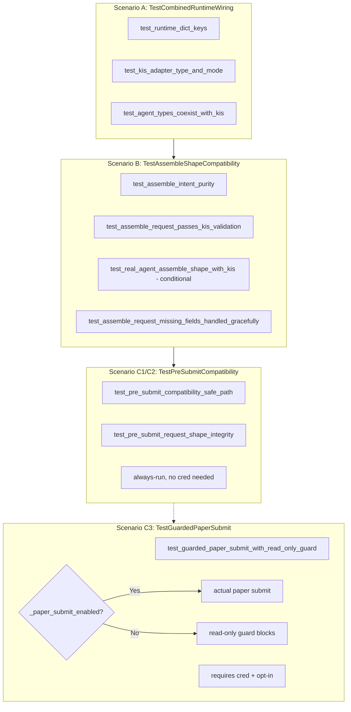

# Plan 36: KIS Paper + AI Layer Combined Runtime Smoke Verification

## Revision History

| Rev | Date | Author | Description |
|-----|------|--------|-------------|
| 1 | 2026-05-04 | Roo (Architect) | Initial plan |
| 2 | 2026-05-04 | Roo (Architect) | Scenario C redesign: Guarded Optional Pre-Submit Compatibility; Scenario B 강화; Opt-in flag + 조건 강화 |
| 3 | 2026-05-04 | Roo (Architect) | Scenario C split: C1/C2 → env-independent always-run class; C3 → guarded optional submit class |

---

## 1. Why This Task is Next Priority

### 1.1 Current Coverage Gap

| 영역 | 테스트 파일 | 커버리지 |
|------|------------|----------|
| KIS paper adapter read-only smoke | [`test_kis_paper_smoke.py`](tests/smoke/test_kis_paper_smoke.py) | ✅ Auth, quote, orderbook, positions, cash, WS |
| 3-agent runtime smoke | [`test_runtime_three_agent_smoke.py`](tests/smoke/test_runtime_three_agent_smoke.py) | ✅ EI/AR/FDC full chain + partial chains |
| AI-Broker pre-submit boundary | [`test_decision_orchestrator.py`](tests/services/test_decision_orchestrator.py) + [`test_order_submit_to_broker.py`](tests/services/test_order_submit_to_broker.py) | ✅ `ai_backend_inputs` ≠ `SubmitOrderRequest` |
| Post-submit reconciliation boundary | [`test_unknown_state_reconciliation_boundary.py`](tests/services/test_unknown_state_reconciliation_boundary.py) | ✅ WS fill on RECONCILE_REQUIRED, lock persist, audit trail |
| Authoritative state reflection | [`test_unknown_state_reconciliation_boundary.py`](tests/services/test_unknown_state_reconciliation_boundary.py) (Test F) | ✅ `transition_to_authoritative()`, reflection failure |
| **KIS + AI combined runtime smoke** | **없음** | ❌ **AI layer + paper broker coexistence 미검증** |

### 1.2 구체적 갭

1. **Runtime dict completeness**: [`build_default_runtime()`](src/agent_trading/runtime/bootstrap.py:237)가 반환하는 dict에 `primary_broker_adapter`(KIS) + 3개 AI agent slots이 모두 존재하고, 서로 충돌하지 않음
2. **Agent type resolution coexistence**: KIS adapter가 `KoreaInvestmentAdapter` 타입인 상태에서 AI agent들이 각각 `EventInterpretationAgent` / `AIRiskAgent` / `FinalDecisionComposerAgent` (또는 None/stub)로 올바르게 주입됨
3. **`assemble()` → broker-safe request**: AI layer를 통해 `assemble()`로 생성한 `OrderIntent`의 `request` 필드가 KIS adapter가 수용 가능한 순수 `SubmitOrderRequest`인지 확인 — shape conflict 없음
4. **Read-only safety with AI layer present**: 기존 [`_read_only_guard`](tests/smoke/test_kis_paper_smoke.py:73) 패턴이 AI layer가 포함된 runtime에서도 write operations를 효과적으로 차단하는지 검증
5. **Guarded pre-submit compatibility**: `assemble()` → `create_order()` → `PENDING_SUBMIT`까지의 pre-submit path 안전성 검증
6. **Guarded actual paper submit (opt-in only)**: KIS paper credential + opt-in이 모두 설정된 환경에서만 actual submit 실행

---

## 2. Design

### 2.1 New File

`tests/smoke/test_kis_paper_ai_runtime_smoke.py`

### 2.2 Test Class Structure (Rev 3)

| Class | 의존성 | API 호출 | 실행 조건 |
|-------|--------|----------|----------|
| **A**: `TestCombinedRuntimeWiring` | 환경 변수만 (KIS + AI optional) | 0 | **항상 실행** |
| **B**: `TestAssembleShapeCompatibility` | 환경 변수만 | 0~3회 (AI provider config에 따라) | **항상 실행** (B3는 conditional) |
| **C1/C2**: `TestPreSubmitCompatibility` | **없음** | 0 | **항상 실행** |
| **C3**: `TestGuardedPaperSubmit` | KIS paper credential + opt-in | 0~1회 (paper submit) | **Opt-in 시에만** |

### 2.3 Total API Calls

| Class | Tests | Real API Calls | Provider Calls |
|-------|-------|---------------|----------------|
| A | 3 | 0 | 0 |
| B | 3~4 | 0~1 (assemble) | 0~3 (EI/AR/FDC) |
| C1/C2 | 2 | 0 | 0 |
| C3 | 1 | 0~1 (KIS paper, opt-in only) | 0 |
| **Total** | **9~10** | **0~2** | **0~3** |

---

## 3. Scenario A — Runtime Wiring Smoke

**Class**: `TestCombinedRuntimeWiring`

**Location**: [`tests/smoke/test_kis_paper_ai_runtime_smoke.py`](tests/smoke/test_kis_paper_ai_runtime_smoke.py)

**목적**: [`build_default_runtime()`](src/agent_trading/runtime/bootstrap.py:237)이 반환하는 runtime dict의 키 완전성, KIS adapter 타입, AI agent 타입(real or stub)을 검증. 환경 변수에 의존하지 않는 fallback 검증 포함.

### Test A1: `test_runtime_dict_keys`

```python
def test_runtime_dict_keys(self) -> None:
    runtime = build_default_runtime()
    expected_keys = {
        "settings",
        "primary_broker_adapter",
        "repositories",
        "polling_workers",
        "orchestrator",
        "event_interpretation_agent",
        "ai_risk_agent",
        "final_decision_agent",
    }
    assert set(runtime.keys()) == expected_keys, (
        f"Runtime keys mismatch. Extra: {set(runtime.keys()) - expected_keys}. "
        f"Missing: {expected_keys - set(runtime.keys())}"
    )
```

**검증 포인트**:
- 모든 예상 키가 존재하고 예상치 못한 키가 없음
- KIS adapter + AI agent slots이 공존

### Test A2: `test_kis_adapter_type_and_mode`

```python
def test_kis_adapter_type_and_mode(self) -> None:
    runtime = build_default_runtime()
    adapter = runtime["primary_broker_adapter"]
    assert isinstance(adapter, KoreaInvestmentAdapter), (
        f"Expected KoreaInvestmentAdapter, got {type(adapter).__name__}"
    )
    assert adapter.broker_name == BrokerName.KOREA_INVESTMENT
    
    # Verify adapter is in paper mode (env-isolated)
    env = os.getenv("KIS_ENV", "paper")
    assert env == "paper", (
        f"KIS_ENV must be 'paper' for smoke tests, got {env!r}"
    )
```

**검증 포인트**:
- KIS adapter가 올바른 타입으로 생성됨
- broker_name이 `KOREA_INVESTMENT`
- `KIS_ENV`가 `paper` (또는 기본값) — live env에서는 즉시 실패

### Test A3: `test_agent_types_coexist_with_kis`

```python
def test_agent_types_coexist_with_kis(
    self, monkeypatch: pytest.MonkeyPatch
) -> None:
    """Env-isolated: 모든 provider env var 제거 후에도 KIS adapter는 유지되고
    AI agent slots은 None(stub fallback)인지 확인."""
    monkeypatch.delenv("DEEPSEEK_API_KEY", raising=False)
    monkeypatch.delenv("DEEPSEEK_BASE_URL", raising=False)
    monkeypatch.delenv("DEEPSEEK_MODEL_ID", raising=False)
    monkeypatch.delenv("OPENAI_API_KEY", raising=False)
    monkeypatch.delenv("OPENAI_BASE_URL", raising=False)
    monkeypatch.delenv("OPENAI_MODEL_ID", raising=False)
    monkeypatch.delenv("LLM_PROVIDER", raising=False)
    
    runtime = build_default_runtime()
    
    # KIS adapter는 env와 무관하게 항상 존재
    adapter = runtime["primary_broker_adapter"]
    assert isinstance(adapter, KoreaInvestmentAdapter)
    
    # AI agent slots은 모두 None (stub fallback)
    assert runtime["event_interpretation_agent"] is None
    assert runtime["ai_risk_agent"] is None
    assert runtime["final_decision_agent"] is None
    
    # Orchestrator는 stub으로 동작
    orchestrator = runtime["orchestrator"]
    assert isinstance(orchestrator, DecisionOrchestratorService)
```

**검증 포인트**:
- Provider credential이 없어도 KIS adapter는 정상 생성
- AI agent는 `None` (stub fallback)
- Orchestrator는 정상 생성됨

---

## 4. Scenario B — Assemble Shape Compatibility (강화)

**Class**: `TestAssembleShapeCompatibility`

**목적**: AI layer `assemble()`로 생성한 `OrderIntent`가 KIS adapter와 shape 충돌 없이 안전하게 상호작용 가능한지 **더 분명히** 검증. 특히 `OrderIntent.ai_backend_inputs`가 populated되어도 `intent.request`는 순수 `SubmitOrderRequest`이며, KIS adapter `_validate_order_request()`를 통과함을 증명.

### Test B1: `test_assemble_intent_purity`

```python
@pytest.mark.asyncio
async def test_assemble_intent_purity(self) -> None:
    """OrderIntent.ai_backend_inputs가 populated되어도 SubmitOrderRequest는
    순수하게 유지됨을 검증. 모든 AI 관련 필드가 SubmitOrderRequest에 존재하지 않음을
    명시적으로 단언."""
    runtime = build_default_runtime()
    orchestrator: DecisionOrchestratorService = runtime["orchestrator"]
    
    request = _sample_request()
    intent = await orchestrator.assemble(request)
    
    # ai_backend_inputs는 항상 populated (default or real)
    assert intent.ai_backend_inputs is not None
    assert isinstance(intent.ai_backend_inputs, AIDecisionInputs)
    
    # ── Block 1: SubmitOrderRequest에 없어야 할 AI 필드 ──
    ai_field_names_should_not_exist = [
        "ai_backend_inputs", "source_agent_names", "schema_versions",
        "decision_type", "risk_opinion", "event_bias",
        "ai_risk_output", "event_interpretation_output", "composer_output",
        "risk_score", "risk_confidence", "conviction", "confidence",
        "execution_preferences", "sizing_hint", "event_conflict",
    ]
    for field in ai_field_names_should_not_exist:
        assert not hasattr(intent.request, field), (
            f"SubmitOrderRequest should not contain AI field: {field}"
        )
    
    # ── Block 2: OrderIntent.ai_backend_inputs에 있어야 할 AI metadata ──
    ai = intent.ai_backend_inputs
    assert hasattr(ai, "decision_type")
    assert hasattr(ai, "confidence")
    assert hasattr(ai, "conviction")
    assert hasattr(ai, "reason_codes")
    # ... (전체 AI metadata 필드 검증)
    
    # ── Block 3: 모든 원본 주문 필드 보존 ──
    assert intent.request.client_order_id == request.client_order_id
    assert intent.request.symbol == request.symbol
    # ... (전체 원본 필드 검증)
```

**검증 포인트**:
- Block 1: SubmitOrderRequest에 AI 필드가 전혀 없음 (16개 명시적 검증)
- Block 2: OrderIntent.ai_backend_inputs에 AI metadata가 정상 존재
- Block 3: 모든 원본 주문 필드가 보존됨

### Test B2: `test_assemble_request_passes_kis_validation`

```python
@pytest.mark.asyncio
async def test_assemble_request_passes_kis_validation(self) -> None:
    """assemble()으로 생성된 SubmitOrderRequest가 KIS adapter의
    _validate_order_request()를 통과함을 검증."""
    runtime = build_default_runtime()
    orchestrator: DecisionOrchestratorService = runtime["orchestrator"]
    adapter: KoreaInvestmentAdapter = runtime["primary_broker_adapter"]
    
    intent = await orchestrator.assemble(_sample_request())
    submit_request = intent.request
    
    # Pre-validation 통과 (validation errors = 0)
    validation_errors = adapter._validate_order_request(submit_request)
    assert len(validation_errors) == 0
```

**검증 포인트**:
- `_validate_order_request()` 직접 호출로 KIS adapter 수준의 shape compatibility 확인

### Test B3 (conditional): `test_real_agent_assemble_shape_with_kis`

```python
@pytest.mark.smoke
@pytest.mark.skipif(not _have_real_provider_config(), reason=_SKIP_REASON)
@pytest.mark.asyncio
async def test_real_agent_assemble_shape_with_kis(self) -> None:
    """Real provider credential이 설정된 환경에서만 실행.
    실제 provider call로 assemble()을 수행하고,
    결과물이 KIS adapter와 호환되는 shape인지 검증."""
    runtime = build_default_runtime()
    orchestrator: DecisionOrchestratorService = runtime["orchestrator"]
    adapter: KoreaInvestmentAdapter = runtime["primary_broker_adapter"]
    
    intent = await orchestrator.assemble(_sample_request())
    
    # ai_backend_inputs에 real agent 데이터 존재
    ai = intent.ai_backend_inputs
    assert ai.source_agent_names is not None
    assert len(ai.source_agent_names) == 3
    
    # SubmitOrderRequest는 여전히 순수
    assert not hasattr(intent.request, "ai_backend_inputs")
    
    # KIS adapter validation 통과
    validation_errors = adapter._validate_order_request(intent.request)
    assert len(validation_errors) == 0
```

**검증 포인트**:
- Real agent assemble 결과가 KIS adapter validation 통과
- source_agent_names가 3개 real agent 모두 기록

### Test B4 (robustness): `test_assemble_request_missing_fields_handled_gracefully`

```python
@pytest.mark.asyncio
async def test_assemble_request_missing_fields_handled_gracefully(self) -> None:
    """의도적으로 max_slippage_bps=0 market order로 assemble()을 호출해도
    KIS adapter validation이 적절히 error를 반환하고 crash하지 않음을 검증.
    
    이 테스트는 ADAPTER-LEVEL validation failure를 검증 (transport failure와 구분).
    - adapter.validation failure: _validate_order_request()가 error list 반환
    - submit_order()가 API call 없이 SubmitOrderResult(accepted=False) 반환
    """
    runtime = build_default_runtime()
    orchestrator: DecisionOrchestratorService = runtime["orchestrator"]
    adapter: KoreaInvestmentAdapter = runtime["primary_broker_adapter"]
    
    # Market order + max_slippage_bps=0 → adapter validation failure
    bad_request = _sample_request(order_type="market", max_slippage_bps=0)
    intent = await orchestrator.assemble(bad_request)
    
    # Adapter-level validation failure (caught BEFORE transport)
    errors = adapter._validate_order_request(intent.request)
    assert len(errors) > 0
    assert any("max_slippage_bps" in e for e in errors), (
        f"Expected max_slippage_bps validation error, got: {errors}"
    )
    
    # submit_order() returns accepted=False WITHOUT making an API call
    result = await adapter.submit_order(intent.request)
    assert result.accepted is False
    assert result.raw_code == "VALIDATION_ERROR"
```

**검증 포인트**:
- `max_slippage_bps=0` + market order → `_validate_order_request()`에서 "max_slippage_bps must be positive" 에러
- `submit_order()`가 crash 대신 `SubmitOrderResult(accepted=False, raw_code="VALIDATION_ERROR")` 반환
- **Adapter validation failure ≠ transport failure**: API call 없이 local validation에서 차단

---

## 5. Scenario C — Pre-Submit Compatibility

### 5.1 구조 (Rev 3 변경)

Scenario C를 **두 개의 독립 클래스**로 분리:

| 클래스 | 포함 테스트 | 실행 조건 | credential 필요 |
|--------|-----------|----------|----------------|
| `TestPreSubmitCompatibility` | C1, C2 | **항상 실행** | ❌ 없음 |
| `TestGuardedPaperSubmit` | C3 | opt-in flag + paper cred | ✅ 필요 |

**분리 이유**:
- C1/C2는 actual submit이 없는 pre-submit compatibility 검증
- `build_default_runtime()` + `_validate_order_request()` 모두 KIS credential 없이 동작 (KISRestClient는 `@dataclass` — empty string으로 생성되어도 crash 없음)
- C3만 실제 KIS paper API 호출 가능성이 있음 → opt-in guard 필요

### 5.2 Class: `TestPreSubmitCompatibility` (always-run)

```python
class TestPreSubmitCompatibility:
    """Pre-submit compatibility: env-independent, always-run.
    
    Verifies that AI layer + KIS adapter coexistence does not break
    the order creation path.  No actual submit — only:
    - assemble() → OrderIntent
    - OrderManager.create_order() → DRAFT
    - transition_to(PENDING_SUBMIT)
    - adapter._validate_order_request() (pure Python, no network)
    """
```

**C1: `test_pre_submit_compatibility_safe_path`**

```python
@pytest.mark.asyncio
async def test_pre_submit_compatibility_safe_path(self) -> None:
    """Pre-submit path 안전성 검증: assemble() → create_order() → PENDING_SUBMIT.
    
    KIS credential 불필요 — build_default_runtime()은 empty string으로
    KISRestClient를 생성하며, _validate_order_request()는 순수 Python 메서드.
    """
    runtime = build_default_runtime()
    repos: RepositoryContainer = runtime["repositories"]
    adapter: KoreaInvestmentAdapter = runtime["primary_broker_adapter"]
    orchestrator: DecisionOrchestratorService = runtime["orchestrator"]
    
    await _seed_repos(repos)
    
    intent = await orchestrator.assemble(
        _sample_request(account_ref="smoke-test-acc")
    )
    
    manager = OrderManager(repos=repos)
    order = await manager.create_order(intent.request)
    assert order.status == OrderStatus.DRAFT
    
    order = await manager.transition_to(order, OrderStatus.PENDING_SUBMIT)
    assert order.status == OrderStatus.PENDING_SUBMIT
    
    # Audit trail
    events = await repos.order_state_events.list_by_order_request(
        order.order_request_id
    )
    assert len(events) >= 1
    assert events[-1].new_status == OrderStatus.PENDING_SUBMIT
    
    # KIS adapter validation (pure Python, no network)
    errors = adapter._validate_order_request(intent.request)
    assert len(errors) == 0
```

**C2: `test_pre_submit_request_shape_integrity`**

```python
@pytest.mark.asyncio
async def test_pre_submit_request_shape_integrity(self) -> None:
    """SubmitOrderRequest 모든 필드의 shape integrity 검증.
    
    Extended fields (price_band, slippage, partial_fill)가 None/기본값일 때도
    KIS adapter validation 통과.
    """
    runtime = build_default_runtime()
    repos: RepositoryContainer = runtime["repositories"]
    adapter: KoreaInvestmentAdapter = runtime["primary_broker_adapter"]
    orchestrator: DecisionOrchestratorService = runtime["orchestrator"]
    
    await _seed_repos(repos)
    
    intent = await orchestrator.assemble(
        _sample_request(account_ref="smoke-test-acc")
    )
    manager = OrderManager(repos=repos)
    order = await manager.create_order(intent.request)
    order = await manager.transition_to(order, OrderStatus.PENDING_SUBMIT)
    
    req = intent.request
    
    # Core fields
    assert req.client_order_id is not None
    assert req.symbol == "005930"
    assert req.side == OrderSide.BUY
    assert req.quantity == Decimal("10")
    
    # Extended fields may be None — valid for basic requests
    _ = req.price_band_lower       # None is valid
    _ = req.price_band_upper       # None is valid
    _ = req.max_slippage_bps       # None is valid
    _ = req.allow_partial_fill     # True is default
    
    # KIS adapter validation passes even with None extended fields
    errors = adapter._validate_order_request(req)
    assert len(errors) == 0
```

### 5.3 Class: `TestGuardedPaperSubmit` (opt-in only)

```python
class TestGuardedPaperSubmit:
    """Guarded actual paper submit — requires opt-in.
    
    Read-only guard
    ---------------
    By default (opt-in=false), the ``_read_only_guard`` blocks all write
    operations on ``KISRestClient`` and ``KoreaInvestmentAdapter``.
    
    When ``ENABLE_KIS_PAPER_SUBMIT_SMOKE=true`` AND all safety conditions
    are met, submit_order is NOT blocked (guarded actual submit).
    """
    
    @pytest.fixture(autouse=True)
    def _read_only_guard(self, monkeypatch: pytest.MonkeyPatch) -> None:
        if _paper_submit_enabled():
            return  # Allow guarded actual submit
        
        async def _block(*args: object, **kwargs: object) -> None:
            pytest.fail(...)
        
        for op in ("submit_order", "cancel_order"):
            monkeypatch.setattr(KISRestClient, op, _block)
        for op in ("submit_order", "cancel_order", "amend_order"):
            monkeypatch.setattr(KoreaInvestmentAdapter, op, _block)
    
    @pytest.mark.skipif(
        not _paper_submit_enabled(),
        reason=_paper_submit_skip_reason(),
    )
    @pytest.mark.asyncio
    async def test_guarded_paper_submit_with_read_only_guard(self) -> None:
        """C3: Guarded actual paper submit via real KIS adapter.
        
        실행 조건 (모두 만족 필요):
        1. KIS paper credential 완료
        2. KIS_ENV=paper (또는 미설정)
        3. ENABLE_KIS_PAPER_SUBMIT_SMOKE=true
        """
        runtime = build_default_runtime()
        repos: RepositoryContainer = runtime["repositories"]
        adapter: KoreaInvestmentAdapter = runtime["primary_broker_adapter"]
        orchestrator: DecisionOrchestratorService = runtime["orchestrator"]
        
        await _seed_repos(repos)
        
        intent = await orchestrator.assemble(
            _sample_request(account_ref="smoke-test-acc")
        )
        manager = OrderManager(repos=repos)
        order = await manager.create_order(intent.request)
        order = await manager.transition_to(order, OrderStatus.PENDING_SUBMIT)
        
        order = await manager.submit_order_to_broker(
            order, adapter, intent.request,
        )
        
        assert order.status in (
            OrderStatus.SUBMITTED,
            OrderStatus.RECONCILE_REQUIRED,
            OrderStatus.REJECTED,
        )
```

### 5.4 User-Facing Behavior Summary (Rev 3)

| 환경 | C1/C2 (`TestPreSubmitCompatibility`) | C3 (`TestGuardedPaperSubmit`) |
|------|--------------------------------------|-------------------------------|
| KIS credential 없음 | ✅ **실행됨** (env-independent) | ❌ skip (opt-in 미충족) |
| KIS paper + opt-in=false | ✅ 실행됨 | ❌ skip (opt-in=false) |
| KIS paper + opt-in=true | ✅ 실행됨 | ✅ **실행됨** (guarded submit) |
| KIS_ENV=live | ✅ 실행됨 (no network call) | ❌ 실패 (_check_paper_env) |

### 5.5 Read-Only Guard (C3 전용, Rev 3 변경)

Read-only guard는 **C3(`TestGuardedPaperSubmit`)에만 적용**:
- C1/C2는 actual submit을 수행하지 않으므로 guard 불필요
- C3는 `_read_only_guard` fixture로 write operations 차단
- Opt-in 시 guard가 해제되어 실제 submit 허용

### 5.6 공통 helper: `_seed_repos`

```python
async def _seed_repos(repos: RepositoryContainer) -> None:
    """Seed in-memory repos with minimum required data for
    ``OrderManager.create_order()``.
    
    ``create_order()`` needs:
    - ``AccountEntity`` (resolved via ``account_ref``)
    - ``InstrumentEntity`` (resolved via ``symbol`` + ``market``)
    
    This is a module-level helper shared by C1/C2 and C3.
    """
    account_id = uuid4()
    client_id = uuid4()
    instrument_id = uuid4()
    
    account = AccountEntity(
        account_id=account_id,
        client_id=client_id,
        broker_account_id=uuid4(),
        environment=Environment.PAPER,
        account_alias="smoke-test-acc",
        account_masked="****1234",
        status="active",
    )
    instrument = InstrumentEntity(
        instrument_id=instrument_id,
        symbol="005930",
        market_code="KRX",
        asset_class="KR_STOCK",
        currency="KRW",
        name="Samsung Electronics",
        is_active=True,
    )
    
    await repos.accounts.add(account)
    await repos.instruments.add(instrument)
```

---

## 6. Files to Change

### 수정

| 파일 | 설명 |
|------|------|
| [`tests/smoke/test_kis_paper_ai_runtime_smoke.py`](tests/smoke/test_kis_paper_ai_runtime_smoke.py) | Scenario C 분리: `TestGuardedPreSubmitCompatibility` → `TestPreSubmitCompatibility`(C1/C2) + `TestGuardedPaperSubmit`(C3) |
| [`plans/36_kis_paper_ai_runtime_smoke.md`](plans/36_kis_paper_ai_runtime_smoke.md) | Rev 3 문서 업데이트 (본 문서) |

### 변경하지 않음

- Production code (`src/`) — **변경 없음**, 테스트 전용
- 기존 smoke 테스트 — 영향 없음
- 서비스 테스트 — 영향 없음
- `plans/README.md` — Rev 2에서 이미 추가됨, 구조 변경 반영 불필요
- `_paper_submit_enabled()`, `_paper_submit_skip_reason()`, `_credentials_configured()`, `_check_paper_env()` — 모두 유지

---

## 7. 구체적 코드 변경 (Diff)

### 7.1 `_seed_repos` 이동: class static method → module-level helper

**Before** (lines 580-613 inside `TestGuardedPreSubmitCompatibility`):
```python
class TestGuardedPreSubmitCompatibility:
    @staticmethod
    async def _seed_repos(repos: RepositoryContainer) -> None:
        ...
```

**After**: module-level function before class definitions.

### 7.2 `TestGuardedPreSubmitCompatibility` 분할

**Before**: 단일 클래스 (3개 테스트, `_read_only_guard` autouse fixture, credential check)

```python
class TestGuardedPreSubmitCompatibility:
    @pytest.fixture(autouse=True)
    def _read_only_guard(self, monkeypatch): ...
    
    async def test_pre_submit_compatibility_safe_path(self):
        if not _credentials_configured():
            pytest.skip(...)
        _check_paper_env()
        ...
    
    async def test_pre_submit_request_shape_integrity(self):
        if not _credentials_configured():
            pytest.skip(...)
        _check_paper_env()
        ...
    
    @pytest.mark.skipif(not _paper_submit_enabled(), ...)
    async def test_guarded_paper_submit_with_read_only_guard(self):
        ...
```

**After**: 두 개 클래스

```python
class TestPreSubmitCompatibility:
    """C1, C2 — always-run, no credential dependency, no read-only guard."""
    
    @pytest.mark.asyncio
    async def test_pre_submit_compatibility_safe_path(self):
        # NO credential check
        # NO _check_paper_env()
        runtime = build_default_runtime()
        repos = runtime["repositories"]
        ...
    
    @pytest.mark.asyncio
    async def test_pre_submit_request_shape_integrity(self):
        # NO credential check
        # NO _check_paper_env()
        ...


class TestGuardedPaperSubmit:
    """C3 — opt-in guarded actual paper submit."""
    
    @pytest.fixture(autouse=True)
    def _read_only_guard(self, monkeypatch): ...
    
    @pytest.mark.skipif(not _paper_submit_enabled(), ...)
    @pytest.mark.asyncio
    async def test_guarded_paper_submit_with_read_only_guard(self):
        ...
```

### 7.3 제거되는 코드

1. C1/C2 메서드 내 `if not _credentials_configured(): pytest.skip(...)` — **2개 블록 제거**
2. C1/C2 메서드 내 `_check_paper_env()` — **2개 호출 제거**
3. `TestGuardedPreSubmitCompatibility` 클래스 전체 — **삭제되고 2개 클래스로 대체**
4. `_read_only_guard` fixture — C1/C2에서 **제거**, C3에서만 유지

### 7.4 유지되는 코드 (변경 없음)

1. 모든 module-level helper 함수 (`_credentials_configured`, `_check_paper_env`, `_have_real_provider_config`, `_paper_submit_enabled`, `_paper_submit_skip_reason`, `_sample_request`)
2. Scenario A, B 클래스와 모든 테스트
3. C3의 `_read_only_guard` fixture (클래스 이동만)
4. C3의 `@pytest.mark.skipif` 조건

---

## 8. 실행 순서

1. [`plans/36_kis_paper_ai_runtime_smoke.md`](plans/36_kis_paper_ai_runtime_smoke.md) Rev 3 업데이트 (본 문서)
2. [`tests/smoke/test_kis_paper_ai_runtime_smoke.py`](tests/smoke/test_kis_paper_ai_runtime_smoke.py) 코드 변경:
   - `_seed_repos` → module-level 함수로 이동
   - `TestGuardedPreSubmitCompatibility` → `TestPreSubmitCompatibility` + `TestGuardedPaperSubmit` 분할
   - C1/C2에서 `_credentials_configured()` + `_check_paper_env()` 제거
3. 테스트 실행:
   ```bash
   pytest tests/smoke/test_kis_paper_ai_runtime_smoke.py -v
   ```
4. 전체 회귀 테스트:
   ```bash
   pytest tests/ -v --ignore=tests/smoke -x
   ```

---

## 9. 완료 기준

1. ✅ C1/C2가 KIS paper credential 없이도 실행됨 (env-independent)
2. ✅ C3만 opt-in 조건에 따라 skip
3. ✅ Scenario A, B 기존 테스트 모두 pass
4. ✅ Read-only guard가 C3에서만 정상 동작 (C1/C2에는 불필요)
5. ✅ Full regression: 기존 테스트 0 failure

---

## 10. Mermaid: Rev 3 Class Structure



---

## 11. Risk Assessment (Rev 3)

| Risk | Impact | Mitigation |
|------|--------|------------|
| KIS paper credential 미설정으로 C1/C2 skip (기존 문제) | C1/C2 검증 누락 | ✅ **Rev 3에서 해결**: C1/C2는 env-independent, 항상 실행 |
| `build_default_runtime()`이 empty KIS cred로 crash | C1/C2 실행 불가 | KISRestClient는 `@dataclass` — empty string도 허용. `_validate_order_request()`는 순수 Python |
| C1/C2가 실수로 submit 호출 | 불필요한 network call | C1/C2는 `adapter.submit_order()` 호출하지 않음. `_validate_order_request()`만 사용 |
| Opt-in flag로 인한 actual submit 실수 | Paper 계정에 불필요한 주문 | Opt-in은 명시적 + paper env 확인 + `_check_paper_env()` 이중 안전장치 |

---

## 12. Design Rationale Summary

1. **C1/C2를 env-independent로 만든 이유**: `build_default_runtime()` + `_validate_order_request()`는 모두 순수 Python 로직. KIS credential 없이도 실행 가능하며, 실제로 검증하는 것은 "AI layer + KIS adapter가 공존할 때 pre-submit path가 정상 동작하는가" — 이는 credential과 무관한 검증.
2. **C3만 opt-in으로 남긴 이유**: Actual paper submit은 side-effect를 발생시키므로 기본적으로 차단. 명시적 opt-in(`ENABLE_KIS_PAPER_SUBMIT_SMOKE=true`)이 있을 때만 실행.
3. **Read-only guard를 C3 전용으로 분리한 이유**: C1/C2는 actual submit을 전혀 수행하지 않으므로 guard가 불필요. Guard가 있으면 오히려 "이 테스트는 credential이 있어야 하는구나"라는 오해를 줄 수 있음.
4. **Production code 변경 zero**: 모든 검증은 테스트 전용; 기존 코드에 영향 없음.
