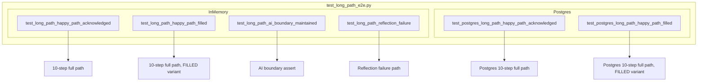

# Plan 37 — Long-Path End-to-End Integration Scenario (In-Memory / Postgres, KIS 불필요)

## Revision History

| Rev | Date | Author | Changes |
|-----|------|--------|---------|
| 1 | 2026-05-04 | Architect | Initial draft — 3 scenarios: in-memory / postgres / failure |

## 1. Why Now?

현재까지 확보된 검증 계층:

| 계층 | 상태 | Plan |
|------|------|------|
| Runtime wiring + KIS adapter type | ✅ Smoke | 36 |
| Assemble shape compatibility | ✅ Smoke | 36 |
| Pre-submit AI/execution boundary | ✅ Unit | 32 |
| Order state machine transitions | ✅ Unit | 34 |
| Reconciliation lock + release | ✅ Unit | 33 |
| Authoritative state reflection | ✅ Unit | 35 |
| Reflection failure path | ✅ Unit | 35 |

**남은 갭**: 위 모든 계층을 **하나의 통합 시나리오**로 연결한 테스트가 없다.

- `assemble()` → `create_order()` → `submit_order_to_broker()` (uncertain) → reconciliation trigger → `resolve_and_mark()` (with `order_manager`) → authoritative reflection → 최종 state
- AI/execution boundary (AI backend inputs가 broker에 전달되지 않음)가 전체 경로에서 유지되는가?
- audit log / order_state_event / reconciliation run / lock lifecycle이 모두 함께 일관되게 기록되는가?
- 이러한 closed-loop 검증은 KIS API key 없이도 mock broker + in-memory repos로 충분히 가능하다.

**KIS API key가 아직 확보되지 않은 지금**, 이 통합 검증이 가장 높은 가치의 다음 작업이다.

## 2. Scope

### 2.1 포함

- **Scenario A**: In-memory repos + stub agents + mock broker full E2E long path
- **Scenario B**: Postgres repos + stub agents + mock broker full E2E long path (가능하면)
- **Scenario C**: Failure branch — authoritative reflection 실패 시나리오 (1개)
- 신규 파일: [`tests/integration/test_long_path_e2e.py`](tests/integration/test_long_path_e2e.py)
- `tests/integration/__init__.py` (빈 파일)
- [`plans/37_long_path_end_to_end_integration.md`](plans/37_long_path_end_to_end_integration.md)
- [`plans/README.md`](plans/README.md) 업데이트

### 2.2 포함하지 않음

- KIS 실제 API 호출
- Production code (`src/`) 변경
- 기존 테스트 수정
- Event loop 통합 (WebSocket fill notification은 별도 범위)
- `tests/smoke/` 변경
- 기존 fixture 변경 (conftest.py는 그대로)

## 3. E2E Long-Path Flow Diagram

```mermaid
flowchart LR
    subgraph Input
        A1[External SubmitOrderRequest]
    end

    subgraph AIDecisionLayer
        B1[DecisionOrchestratorService.assemble]
        B2[Stub agents run: EI/AR/FDC]
        B3[AIDecisionInputs populated]
        B4[OrderIntent created]
    end

    subgraph ExecutionPath
        C1[OrderManager.create_order]
        C2[transition_to VALIDATED]
        C3[transition_to PENDING_SUBMIT]
        C4[submit_order_to_broker with mock broker]
    end

    subgraph UncertainResult
        D1[Result: uncertain=True]
        D2[Order -> RECONCILE_REQUIRED]
        D3[Reconciliation run started]
        D4[Blocking lock acquired]
    end

    subgraph RecoveryPath
        E1[resolve_and_mark with order_manager]
        E2[Mock broker returns FILLED/ACKNOWLEDGED]
        E3[transition_to_authoritative]
        E4[Order state reflected]
        E5[Run resolved + lock released]
    end

    subgraph Verification
        F1[Audit logs: create + status_changes]
        F2[Order state events]
        F3[AI recorder: 3 runs]
        F4[Broker received SubmitOrderRequest only]
    end

    A1 --> B1
    B1 --> B2 --> B3 --> B4
    B4 --> C1 --> C2 --> C3 --> C4
    C4 --> D1 --> D2 --> D3 --> D4
    D4 --> E1 --> E2 --> E3 --> E4 --> E5
    E5 --> F1 & F2 & F3 & F4
```



## 4. Scenario A — In-Memory E2E Long Path (필수 구현)

### 4.1 파일 위치

[`tests/integration/test_long_path_e2e.py`](tests/integration/test_long_path_e2e.py)

### 4.2 Fixtures (모듈 레벨)

```python
@pytest.fixture
def repos():
    return build_in_memory_repositories()

@pytest.fixture
def reconciliation_service(repos):
    return ReconciliationService(repos)

@pytest.fixture
def manager(repos, reconciliation_service):
    return OrderManager(repos=repos, reconciliation_service=reconciliation_service)

@pytest.fixture
def mock_broker() -> BrokerAdapter:
    broker = MagicMock(spec=BrokerAdapter)
    broker.submit_order = AsyncMock()
    broker.resolve_unknown_state = AsyncMock()
    return broker

@pytest.fixture
def sample_request() -> SubmitOrderRequest:
    return SubmitOrderRequest(
        account_ref="test_account",
        client_order_id="e2e-001",
        correlation_id="e2e-corr-001",
        strategy_id="strat-001",
        symbol="005930",
        market="KRX",
        side=OrderSide.BUY,
        order_type=OrderType.LIMIT,
        quantity=Decimal("10"),
        price=Decimal("50000"),
        time_in_force=TimeInForce.DAY,
    )
```

Seed fixture (`seeded_repos` 기반 — conftest.py `seeded_repos`와 동일 패턴):

```python
@pytest.fixture
async def seeded_repos(repos, sample_request):
    """Seed client, account, instrument, decision_context, config_version."""
    client_id = uuid4()
    account_id = uuid4()
    instrument_id = uuid4()

    client = ClientEntity(
        client_id=client_id,
        client_code="E2E001",
        name="E2E Test Client",
        status="active",
        base_currency="KRW",
    )
    await repos.clients.add(client)

    account = AccountEntity(
        account_id=account_id,
        client_id=client_id,
        broker_account_id=uuid4(),
        environment=Environment.PAPER,
        account_alias="E2E Account",
        account_masked="****e2e",
        status="active",
    )
    await repos.accounts.add(account)

    instrument = InstrumentEntity(
        instrument_id=instrument_id,
        symbol="005930",
        market_code="KRX",
        asset_class=AssetClass.KR_STOCK.value,
        currency="KRW",
        name="Samsung Electronics",
        is_active=True,
    )
    await repos.instruments.add(instrument)

    return repos
```

### 4.3 Test 1: `test_long_path_happy_path_acknowledged`

10-step E2E that ends with broker returning ACKNOWLEDGED:

```python
async def test_long_path_happy_path_acknowledged(
    self, seeded_repos, manager, reconciliation_service, mock_broker, sample_request
):
    """Full E2E: assemble -> create -> uncertain submit -> reconciliation ->
    authoritative reflection -> ACKNOWLEDGED (resolved but non-terminal).

    ACKNOWLEDGED: broker has accepted the order; the local order state is
    updated but the order lifecycle may continue (fill/cancel/reject).
    """
    
    # --- Step 1: assemble() ---
    service = DecisionOrchestratorService(repos=seeded_repos)
    intent = await service.assemble(sample_request)
    
    # AI boundary: ai_backend_inputs populated on OrderIntent
    assert intent.ai_backend_inputs is not None
    assert intent.request.client_order_id == "e2e-001"
    # intent.request is pure SubmitOrderRequest (no ai_backend_inputs field)
    assert not hasattr(intent.request, "ai_backend_inputs")
    
    # --- Step 2: create_order() -> DRAFT ---
    order = await manager.create_order(intent.request)
    assert order.status == OrderStatus.DRAFT
    
    # --- Step 3: transition_to(VALIDATED) ---
    order = await manager.transition_to(order, OrderStatus.VALIDATED)
    assert order.status == OrderStatus.VALIDATED
    
    # --- Step 4: transition_to(PENDING_SUBMIT) ---
    order = await manager.transition_to(order, OrderStatus.PENDING_SUBMIT)
    assert order.status == OrderStatus.PENDING_SUBMIT
    
    # --- Step 5: submit_order_to_broker() uncertain ---
    mock_broker.submit_order.return_value = SubmitOrderResult(
        accepted=True,
        broker_name=BrokerName.KOREA_INVESTMENT,
        client_order_id="e2e-001",
        broker_order_id=None,
        broker_status=OrderStatus.ACKNOWLEDGED,
        ack_timestamp=datetime.now(timezone.utc),
        raw_code="TIMEOUT",
        raw_message="Response timeout",
        uncertain=True,
        requires_reconciliation=False,
    )
    
    result = await manager.submit_order_to_broker(
        order, mock_broker, intent.request
    )
    assert result.status == OrderStatus.RECONCILE_REQUIRED
    
    # --- Step 6: Reconciliation lock active ---
    locked = await reconciliation_service.is_blocked(
        account_id=order.account_id,
        symbol=sample_request.symbol,
        side=sample_request.side.value,
    )
    assert locked is True
    
    active_run = await reconciliation_service.get_active_run(order.account_id)
    assert active_run is not None
    assert active_run.status == "started"
    
    # --- Step 7: Broker resolves ACKNOWLEDGED ---
    mock_broker.resolve_unknown_state.return_value = OrderStatusResult(
        broker_name=BrokerName.KOREA_INVESTMENT,
        client_order_id="e2e-001",
        broker_order_id="BRK-E2E-001",
        status=OrderStatus.ACKNOWLEDGED,
    )
    
    await reconciliation_service.resolve_and_mark(
        reconciliation_run_id=active_run.reconciliation_run_id,
        account_ref="test_account",
        broker=mock_broker,
        client_order_id="e2e-001",
        order_manager=manager,
    )
    
    # --- Step 8: Order state reflected ---
    updated = await seeded_repos.orders.get(order.order_request_id)
    assert updated is not None
    assert updated.status == OrderStatus.ACKNOWLEDGED
    
    # --- Step 9: Reconciliation run resolved, lock released ---
    resolved_run = await seeded_repos.reconciliations.get_run(
        active_run.reconciliation_run_id
    )
    assert resolved_run is not None
    assert resolved_run.status == "resolved"
    assert resolved_run.summary_json is not None
    assert resolved_run.summary_json.get("resolved_status") == "acknowledged"
    
    locked_after = await reconciliation_service.is_blocked(
        account_id=order.account_id,
        symbol=sample_request.symbol,
        side=sample_request.side.value,
    )
    assert locked_after is False
    
    # --- Step 10: Verify observability ---
    # Audit logs
    audit_logs = await seeded_repos.audit_logs.list_by_correlation_id(
        "e2e-corr-001"
    )
    assert len(audit_logs) >= 1
    actions = [log.action for log in audit_logs]
    assert "order.create" in actions
    assert "order.status_change" in actions
    
    # Order state events
    events = await seeded_repos.order_state_events.list_by_order_request(
        order.order_request_id
    )
    assert len(events) >= 1
    assert events[-1].reason_code == "RECONCILE_RESOLVED"
    assert events[-1].new_status == OrderStatus.ACKNOWLEDGED
    
    # AI recorder: 3 runs
    recorder = service._agent_recorder
    assert recorder is not None
    runs = recorder.runs  # Assuming AgentRunRecorder has .runs property
    assert len(runs) == 3
    
    # AI boundary: broker received SubmitOrderRequest only
    mock_broker.submit_order.assert_awaited_once_with(intent.request)
```

### 4.4 Test 2: `test_long_path_happy_path_filled`

10-step E2E that ends with broker returning FILLED:

```python
async def test_long_path_happy_path_filled(
    self, seeded_repos, manager, reconciliation_service, mock_broker, sample_request
):
    """Full E2E: assemble -> create -> uncertain submit -> reconciliation ->
    authoritative reflection -> FILLED (resolved and terminal).

    FILLED: broker has fully executed the order; the local order state is
    updated and no further transitions are possible from this terminal state.
    """
    # Steps 1-6: identical to test_long_path_happy_path_acknowledged
    # ... (assemble, create, transition, uncertain submit, lock acquire)

    # Step 7: Broker resolves FILLED (different from ACKNOWLEDGED)
    mock_broker.resolve_unknown_state.return_value = OrderStatusResult(
        broker_name=BrokerName.KOREA_INVESTMENT,
        client_order_id="e2e-001",
        broker_order_id="BRK-E2E-001",
        status=OrderStatus.FILLED,  # <-- FILLED (terminal)
    )

    await reconciliation_service.resolve_and_mark(
        reconciliation_run_id=active_run.reconciliation_run_id,
        account_ref="test_account",
        broker=mock_broker,
        client_order_id="e2e-001",
        order_manager=manager,
    )

    # Step 8: Order state reflected as FILLED (terminal)
    updated = await seeded_repos.orders.get(order.order_request_id)
    assert updated is not None
    assert updated.status == OrderStatus.FILLED

    # Step 9: Reconciliation run resolved, lock released
    # (same as Test 1)

    # Step 10: Verify observability
    # (same as Test 1, but events[-1].new_status == OrderStatus.FILLED)
    events = await seeded_repos.order_state_events.list_by_order_request(
        order.order_request_id
    )
    assert events[-1].new_status == OrderStatus.FILLED
```

#### ACKNOWLEDGED vs FILLED 비교

| 측면 | ACKNOWLEDGED (Test 1) | FILLED (Test 2) |
|------|----------------------|-----------------|
| Broker 응답 | 주문 접수 확인 | 주문 체결 완료 |
| 상태 성질 | **resolved but non-terminal** — 이후 fill/cancel/reject 가능 | **resolved and terminal** — 추가 전이 불가 |
| State machine | 이후 상태 전이 가능 (PARTIALLY_FILLED, FILLED, CANCELLED, REJECTED) | `_TERMINAL_STATES`에 포함, 모든 전이 차단 |
| 검증 | `updated.status == OrderStatus.ACKNOWLEDGED` | `updated.status == OrderStatus.FILLED` |
| 최종 이벤트 | `events[-1].new_status == OrderStatus.ACKNOWLEDGED` | `events[-1].new_status == OrderStatus.FILLED` |
| Reconciliation | `summary_json.resolved_status == "acknowledged"` | `summary_json.resolved_status == "filled"` |

### 4.5 Test 3: `test_long_path_ai_boundary_maintained`

AI boundary 집중 검증 — assemble 결과물이 execution path 전체에서 분리 유지되는지:

```python
async def test_long_path_ai_boundary_maintained(
    self, seeded_repos, manager, reconciliation_service, mock_broker, sample_request
):
    """Verify AI/execution boundary across the full long path."""
    # --- assemble ---
    service = DecisionOrchestratorService(repos=seeded_repos)
    intent = await service.assemble(sample_request)
    
    assert intent.ai_backend_inputs is not None
    assert intent.ai_backend_inputs.decision_type is not None
    
    # intent.request has no ai_backend_inputs
    assert not hasattr(intent.request, "ai_backend_inputs")
    
    # --- Create order with intent.request ---
    order = await manager.create_order(intent.request)
    
    # --- Submit with uncertain result ---
    mock_broker.submit_order.return_value = SubmitOrderResult(
        accepted=True,
        broker_name=BrokerName.KOREA_INVESTMENT,
        client_order_id="e2e-001",
        broker_order_id=None,
        broker_status=OrderStatus.ACKNOWLEDGED,
        ack_timestamp=datetime.now(timezone.utc),
        raw_code="TIMEOUT",
        raw_message="Response timeout",
        uncertain=True,
        requires_reconciliation=False,
    )
    await manager.submit_order_to_broker(
        order, mock_broker, intent.request
    )
    
    # Broker received SubmitOrderRequest only — NOT AIDecisionInputs
    mock_broker.submit_order.assert_awaited_once_with(intent.request)
    
    # Verify call args explicitly: it was a SubmitOrderRequest
    call_args = mock_broker.submit_order.call_args[0][0]
    assert isinstance(call_args, SubmitOrderRequest)
    assert not isinstance(call_args, OrderIntent)
```

## 5. Scenario B — Postgres-backed E2E Long Path (가능하면 구현)

### 5.1 위치

[`tests/integration/test_long_path_e2e.py`](tests/integration/test_long_path_e2e.py) — 동일 파일, 별도 클래스 `TestLongPathE2EPostgres`

### 5.2 클래스 구조

```python
class TestLongPathE2EPostgres:
    """Postgres-backed E2E long path — verifies DB persistence consistency."""
    
    @pytest.fixture(autouse=True)
    async def setup(self, postgres_repos):
        """Seed postgres repos with client, account, instrument."""
        # Same seed pattern as test_paper_loop_postgres.py
        # ClientEntity + BrokerAccountEntity + AccountEntity + InstrumentEntity
        self.repos = postgres_repos
        self.reconciliation_service = ReconciliationService(postgres_repos)
        self.manager = OrderManager(
            repos=postgres_repos,
            reconciliation_service=self.reconciliation_service,
        )
```

### 5.3 핵심 차이점

- `postgres_repos` fixture 사용 (conftest.py에서 제공, transaction rollback으로 clean state 보장)
- `BrokerAccountEntity` 추가 seed 필요 (FK constraint)
- In-memory과 동일한 10-step flow

> **Postgres 시나리오의 가치**: audit log ordering, reconciliation run persistence, authoritative reflection persistence가 DB 레벨에서 정상 동작함을 증명.

### 5.4 `@pytest.mark.skipif` 조건

```python
# Postgres DB 접근 불가 시 skip
@pytest.mark.skipif(
    not os.environ.get("POSTGRES_URL"),
    reason="POSTGRES_URL not set",
)
```

### 5.5 Observability 검증 (brittle 방지)

사용자 피드백 반영: exact count를 과도하게 고정하지 말고 **핵심 entry 존재 여부** 중심으로 검증.

```python
# --- Brittle 방지 검증 패턴 ---

# 1. Audit logs: action 존재 여부 확인 (exact count 금지)
audit_logs = await seeded_repos.audit_logs.list_by_correlation_id("e2e-corr-001")
assert len(audit_logs) >= 1
actions = [log.action for log in audit_logs]
assert "order.create" in actions          # 핵심: create 존재
assert "order.status_change" in actions   # 핵심: status_change 존재

# 2. Order state events: 마지막 reason_code 확인
events = await seeded_repos.order_state_events.list_by_order_request(
    order.order_request_id
)
assert len(events) >= 1
assert events[-1].reason_code in (
    "RECONCILE_RESOLVED", "RECONCILE_FAILED",
)  # 핵심: 주요 reason_code 존재

# 3. AI recorder: 정확히 3 runs (stable — 변경 불가)
assert len(recorder.runs) == 3  # EI + AR + FDC — 3개는 고정

# 4. Reconciliation summary_json: 핵심 키 존재 (전체 구조 검증 금지)
assert resolved_run.summary_json is not None
assert "resolved_status" in resolved_run.summary_json  # 핵심 키
assert "resolved_at" in resolved_run.summary_json      # 핵심 키

# 5. Broker 호출: 정확히 1회 (stable — 재시도 로직 없음)
mock_broker.submit_order.assert_awaited_once()
```

**원칙**:
- `assert len(x) == N` — **변경 가능성이 있는 count에는 사용 금지** (예: audit log entry 수, event 수)
- `assert "key" in x` — **존재 여부 검증 우선** (예: 특정 action, 특정 reason_code)
- `assert len(x) == N` — **불변 값에만 허용** (예: AI recorder 3 runs, broker 호출 1회)
- `assert x.summary_json == {...}` — **전체 구조 동등성 비교 금지** (summary_json은 구현에 따라 확장 가능)

## 6. Scenario C — Failure Branch (필수, 1개)

### 6.1 `test_long_path_reflection_failure`

[`tests/services/test_unknown_state_reconciliation_boundary.py`](tests/services/test_unknown_state_reconciliation_boundary.py:1215)의 `test_reflection_failure_keeps_run_and_lock` 패턴과 동일하지만, **E2E long path 맥락**에서 실행:

```python
async def test_long_path_reflection_failure(
    self, seeded_repos, manager, reconciliation_service, mock_broker, sample_request
):
    """Reflection failure in E2E path -> run='reflection_failed', lock stays."""
    # --- assemble -> create -> transition -> submit uncertain ---
    service = DecisionOrchestratorService(repos=seeded_repos)
    intent = await service.assemble(sample_request)
    order = await manager.create_order(intent.request)
    order = await manager.transition_to(order, OrderStatus.VALIDATED)
    order = await manager.transition_to(order, OrderStatus.PENDING_SUBMIT)
    
    mock_broker.submit_order.return_value = SubmitOrderResult(
        accepted=True,
        broker_name=BrokerName.KOREA_INVESTMENT,
        client_order_id="e2e-001",
        broker_order_id=None,
        broker_status=OrderStatus.ACKNOWLEDGED,
        ack_timestamp=datetime.now(timezone.utc),
        raw_code="TIMEOUT",
        raw_message="Response timeout",
        uncertain=True,
        requires_reconciliation=False,
    )
    await manager.submit_order_to_broker(order, mock_broker, intent.request)
    
    active_run = await reconciliation_service.get_active_run(order.account_id)
    assert active_run is not None
    
    # Broker resolves FILLED
    mock_broker.resolve_unknown_state.return_value = OrderStatusResult(
        broker_name=BrokerName.KOREA_INVESTMENT,
        client_order_id="e2e-001",
        broker_order_id="BRK-E2E-001",
        status=OrderStatus.FILLED,
    )
    
    # Mock transition_to_authoritative to fail
    with patch.object(
        OrderManager,
        "transition_to_authoritative",
        new=AsyncMock(side_effect=RuntimeError("Simulated reflection failure")),
    ):
        await reconciliation_service.resolve_and_mark(
            reconciliation_run_id=active_run.reconciliation_run_id,
            account_ref="test_account",
            broker=mock_broker,
            client_order_id="e2e-001",
            order_manager=manager,
        )
    
    # Verify: run='reflection_failed', lock held, order state unchanged
    run_after = await seeded_repos.reconciliations.get_run(
        active_run.reconciliation_run_id
    )
    assert run_after.status == "reflection_failed"
    assert "reflection_error" in run_after.summary_json
    
    locked_after = await reconciliation_service.is_blocked(
        account_id=order.account_id,
        symbol=sample_request.symbol,
        side=sample_request.side.value,
    )
    assert locked_after is True
    
    updated = await seeded_repos.orders.get(order.order_request_id)
    assert updated.status == OrderStatus.RECONCILE_REQUIRED
```

## 7. 테스트 클래스 구조

```python
class TestLongPathE2EInMemory:
    """Scenario A: In-memory E2E Long Path."""
    
    test_long_path_happy_path_acknowledged  # 10-step E2E -> ACKNOWLEDGED
    test_long_path_happy_path_filled        # 10-step E2E -> FILLED
    test_long_path_ai_boundary_maintained   # AI/execution boundary 검증
    test_long_path_reflection_failure       # Scenario C: reflection failure


class TestLongPathE2EPostgres:
    """Scenario B: Postgres-backed E2E Long Path."""
    
    test_postgres_long_path_happy_path_acknowledged
    test_postgres_long_path_happy_path_filled
```

## 8. 총 테스트 수

| Scenario | Class | Test Method | Count |
|----------|-------|-------------|-------|
| A + C | `TestLongPathE2EInMemory` | happy_path_acknowledged | 1 |
| A + C | `TestLongPathE2EInMemory` | happy_path_filled | 1 |
| A + C | `TestLongPathE2EInMemory` | ai_boundary_maintained | 1 |
| A + C | `TestLongPathE2EInMemory` | reflection_failure | 1 |
| B | `TestLongPathE2EPostgres` | happy_path_acknowledged | 1 |
| B | `TestLongPathE2EPostgres` | happy_path_filled | 1 |
| **Total** | | | **6** |

## 9. 수정 파일 목록

| 파일 | 변경 유형 | 내용 |
|------|-----------|------|
| [`tests/integration/__init__.py`](tests/integration/__init__.py) | 신규 생성 | 빈 파일 |
| [`tests/integration/test_long_path_e2e.py`](tests/integration/test_long_path_e2e.py) | 신규 생성 | 3개 시나리오, 6개 테스트 |
| [`plans/37_long_path_end_to_end_integration.md`](plans/37_long_path_end_to_end_integration.md) | 신규 생성 | 본 문서 |
| [`plans/README.md`](plans/README.md) | 수정 | Plan 37 항목 추가 |

## 10. 변경하지 않는 파일

- `src/` 아래 모든 production code — **변경 없음**
- `tests/conftest.py` — 기존 fixture 변경 없음 (새 fixture는 테스트 파일 내부에 선언)
- `tests/smoke/` — 변경 없음
- `tests/services/` — 변경 없음
- `tests/brokers/` — 변경 없음
- 기존 `test_paper_loop.py` / `test_paper_loop_postgres.py` — 변경 없음

## 11. 실행 순서

1. `tests/integration/__init__.py` 생성 (빈 파일)
2. `tests/integration/test_long_path_e2e.py` 생성 — 전체 내용
3. In-memory 테스트만 먼저 실행: `pytest tests/integration/test_long_path_e2e.py::TestLongPathE2EInMemory -v`
4. Postgres 테스트 실행: `pytest tests/integration/test_long_path_e2e.py::TestLongPathE2EPostgres -v`
5. 전체 회귀: `pytest tests/ -v --ignore=tests/smoke -x`
6. Plan 문서 업데이트

## 12. 완료 기준

- [ ] `TestLongPathE2EInMemory.test_long_path_happy_path_acknowledged` — 10-step E2E 통과
- [ ] `TestLongPathE2EInMemory.test_long_path_happy_path_filled` — FILLED variant 통과
- [ ] `TestLongPathE2EInMemory.test_long_path_ai_boundary_maintained` — AI boundary 검증 통과
- [ ] `TestLongPathE2EInMemory.test_long_path_reflection_failure` — failure path 통과
- [ ] `TestLongPathE2EPostgres.test_postgres_long_path_happy_path_acknowledged` — Postgres variant 통과
- [ ] `TestLongPathE2EPostgres.test_postgres_long_path_happy_path_filled` — Postgres FILLED variant 통과
- [ ] 전체 회귀 테스트 green (smoke 제외)
- [ ] Production code 변경 없음

## 13. Mermaid: Rev 1 Test Class Structure



## 14. Risk Assessment

| 리스크 | 영향 | 완화 |
|--------|------|------|
| Postgres repo FK 제약 (BrokerAccountEntity) | Postgres 시나리오 seed 복잡도 증가 | `test_paper_loop_postgres.py`의 `_seed_broker_account` 패턴 재사용 |
| `AgentRunRecorder.runs` 속성 노출 여부 불확실 | AI recorder 검증 실패 | `AgentRunRecorder` 코드 확인 필요; `hasattr` guard로 안전하게 검증 |
| Postgres DB 미사용 환경 | Scenario B skip 불가피 | `@pytest.mark.skipif` 조건 추가, plan 문서에 명시 |
| State machine transition 실패 (DRAFT→VALIDATED→PENDING_SUBMIT) | Test 구조 오류 | `test_paper_loop.py`의 검증된 transition chain 사용 |

## 15. 검증 포인트 요약

| # | 검증 항목 | 검증 방법 |
|---|-----------|-----------|
| 1 | AI/execution boundary | `intent.ai_backend_inputs` exists + `intent.request` has no `ai_backend_inputs` + broker receives `SubmitOrderRequest` only |
| 2 | Order lifecycle | DRAFT → VALIDATED → PENDING_SUBMIT → RECONCILE_REQUIRED → authoritative final status |
| 3 | Reconciliation lifecycle | Active run created → lock acquired → resolved + lock released (or reflection_failed + lock retained) |
| 4 | Observability | AI recorder 3 runs + audit logs (create + status_change) + order_state_events + reconciliation summary_json |
| 5 | Failure branch | reflection failure: run='reflection_failed', lock held, order unchanged, summary_json.error recorded |
