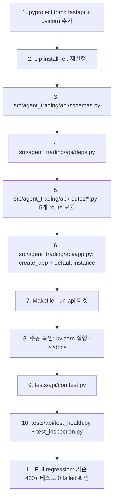
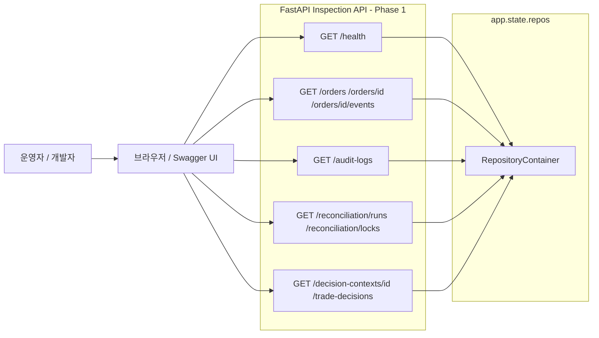

# Plan 40 — FastAPI Inspection / Admin API (Read-Only First)

> **목표**: FastAPI 기반 read-only inspection API를 열어 Swagger UI로 시스템 상태를 직접 확인할 수 있게 한다.
>
> **원칙**: write API 금지, 기존 서비스 경계 유지, repository 직접 노출 지양, 기존 안정성 훼손 금지.
>
> **전략**: Phase 1은 최소 핵심 endpoint로 작게 열고, Phase 2에서 확장한다.

---

## Revision History

| Rev | Date | Author | Changes |
|-----|------|--------|---------|
| 1 | 2026-05-04 | Roo (Architect) | Initial |
| 2 | 2026-05-04 | Roo (Architect) | Phase 1 범위 축소: 9개 endpoint, app wiring 단순화, response model 최소화, 테스트 2개 파일 |

---

## 1. 현황 분석

### 1.1 FastAPI Skeleton 존재 여부

**FastAPI skeleton은 존재하지 않는다.**

| 확인 항목 | 결과 |
|-----------|------|
| `src/agent_trading/api/` 디렉토리 | ❌ 없음 |
| `src/agent_trading/app.py` | ❌ 없음 |
| `src/agent_trading/web/` | ❌ 없음 |
| `pyproject.toml`에 FastAPI 의존성 | ❌ 없음 (`asyncpg`, `python-dotenv`, `httpx`만 존재) |
| `main.py` | 단순 데모용 — runtime dict를 `pprint`로 출력 |

**결론**: FastAPI app을 신규 생성해야 한다.

### 1.2 의존성 추가 필요

```
fastapi>=0.110.0
uvicorn[standard]>=0.27.0
```

- `pydantic`은 FastAPI에 내장되어 별도 추가 불필요
- `httpx`는 이미 존재하므로 API 테스트에 불필요 (TestClient 사용)
- `uvicorn`은 서버 실행기

### 1.3 사용 가능한 Repository Read 인터페이스

전체 [`RepositoryContainer`](src/agent_trading/repositories/container.py:30)가 read-only 조회에 사용 가능. Phase 1에서 사용할 핵심 repository:

| Repository | Read 메서드 | Phase 1 Endpoint |
|-----------|-------------|-----------------|
| `orders` | `get(id)`, `get_by_client_order_id(id)`, `list(query)` | `GET /orders`, `GET /orders/{id}` |
| `order_state_events` | `list_by_order_request(id)`, `list_recent(limit)` | `GET /orders/{id}/events` |
| `audit_logs` | `list_by_correlation_id(correlation_id)` | `GET /audit-logs` |
| `reconciliations` | `get_run(id)`, `list_runs_by_account(id,limit)`, `get_active_run(id)` | `GET /reconciliation/runs`, `GET /reconciliation/locks` |
| `decision_contexts` | `get(id)`, `get_by_correlation_id(id)`, `list(query)` | `GET /decision-contexts/{id}` |
| `trade_decisions` | `get_by_context(context_id)` | `GET /trade-decisions` |

---

## 2. Phase 1 API 디자인

### 2.1 Phase 1 Endpoint (9개)

| Method | Path | Description | Query Params |
|--------|------|-------------|-------------|
| `GET` | `/health` | 서버 및 DB 상태 확인 | — |
| `GET` | `/orders` | 주문 목록 조회 | `account_id`, `client_order_id`, `status`, `limit` |
| `GET` | `/orders/{order_request_id}` | 단일 주문 상세 | — |
| `GET` | `/orders/{order_request_id}/events` | 주문 상태 이벤트 이력 | — |
| `GET` | `/audit-logs` | 감사 로그 조회 | `correlation_id` (required) |
| `GET` | `/reconciliation/runs` | Reconciliation 실행 목록 | `account_id` (required), `limit` |
| `GET` | `/reconciliation/locks` | Blocking lock 상태 확인 | `account_id` (required) |
| `GET` | `/decision-contexts/{decision_context_id}` | 단일 decision context | — |
| `GET` | `/trade-decisions` | Trade decision 조회 | `decision_context_id` (required) |

### 2.2 Phase 2 (이번 범위 밖 — backlog)

| Endpoint | 이유 |
|----------|------|
| `GET /orders/{id}/broker-orders` | broker_orders 조회는 fill_events와 함께 확장 시 |
| `GET /accounts`, `GET /accounts/{id}` | 계좌 목록은 Config/Admin 영역 |
| `GET /clients/{id}` | 클라이언트 조회는 Admin 영역 |
| `GET /instruments/{id}` | 종목 마스터 조회 |
| `GET /positions`, `GET /cash-balances` | 포트폴리오 조회 |
| `GET /guardrail-evaluations` | Guardrail 평가 결과 |
| `GET /risk-limit-snapshots` | 리스크 한도 스냅샷 |
| `GET /agent-runs` | AI Agent 실행 trace (DB 저장 후 필요) |

### 2.3 Response Model (최소 read model)

Phase 1은 order / audit / reconciliation / decision 중심의 **summary + detail** shape만 정의한다.

```python
# src/agent_trading/api/schemas.py

from pydantic import BaseModel
from datetime import datetime


class HealthResponse(BaseModel):
    """GET /health response."""
    status: str                               # "ok"
    version: str                              # "0.1.0"
    timestamp: datetime                       # 현재 시간
    database: str                             # "connected" | "disconnected" | "in_memory"
    runtime_mode: str                         # "in_memory" | "postgres"


class OrderSummary(BaseModel):
    """GET /orders list item — 최소 inspection 용."""
    order_request_id: str
    client_order_id: str
    account_id: str
    side: str
    order_type: str
    status: str
    requested_quantity: float
    requested_price: float | None = None
    symbol: str | None = None                 # resolve from instrument_id
    correlation_id: str
    trade_decision_id: str | None = None
    created_at: str | None = None
    updated_at: str | None = None
    version: int


class OrderDetail(OrderSummary):
    """GET /orders/{id} — 상세 정보 포함."""
    instrument_id: str
    time_in_force: str
    decision_context_id: str | None = None
    status_reason_code: str | None = None
    status_reason_message: str | None = None
    submitted_at: str | None = None


class OrderEvent(BaseModel):
    """GET /orders/{id}/events — 상태 전이 이벤트."""
    order_state_event_id: str
    previous_status: str | None = None
    new_status: str
    event_source: str
    event_timestamp: str
    reason_code: str | None = None


class AuditLogEntry(BaseModel):
    """GET /audit-logs — 감사 로그 항목."""
    audit_log_id: str
    actor_type: str
    actor_id: str
    action: str
    target_entity_type: str
    target_entity_id: str
    created_at: str
    correlation_id: str | None = None
    before_json: dict[str, object] | None = None
    after_json: dict[str, object] | None = None


class ReconciliationRunSummary(BaseModel):
    """GET /reconciliation/runs — reconciliation 실행 요약."""
    reconciliation_run_id: str
    account_id: str
    trigger_type: str
    status: str
    mismatch_count: int
    started_at: str
    completed_at: str | None = None


class BlockingLockStatus(BaseModel):
    """GET /reconciliation/locks — blocking lock 상태."""
    blocked: bool
    account_id: str


class DecisionContextDetail(BaseModel):
    """GET /decision-contexts/{id} — decision context 상세."""
    decision_context_id: str
    account_id: str
    strategy_id: str
    config_version_id: str
    market_timestamp: str
    correlation_id: str


class TradeDecisionDetail(BaseModel):
    """GET /trade-decisions — trade decision 상세."""
    trade_decision_id: str
    decision_context_id: str
    decision_type: str
    side: str
    strategy_id: str
    symbol: str
    market: str
    entry_style: str
    entry_price: float | None = None
    quantity: float | None = None
    reason_codes: list[str] | None = None
    opposing_evidence: dict[str, object] | None = None
    exit_plan_json: dict[str, object] | None = None
    created_at: str
```

### 2.4 Entity 변환 헬퍼

```python
# response model의 from_domain() 정적 메서드 또는 별도 변환 함수

def _to_str(value: object) -> str | None:
    return str(value) if value is not None else None

def _to_dt(value: object) -> str | None:
    return value.isoformat() if value is not None else None

def _to_float(value: object) -> float | None:
    return float(value) if value is not None else None

def _to_enum(value: object) -> str | None:
    return value.value if value is not None else None
```

---

## 3. App Wiring (단순 구조)

### 3.1 App Factory — 명시적 주입

```python
# src/agent_trading/api/app.py

from contextlib import asynccontextmanager
from fastapi import FastAPI
from agent_trading.repositories.container import RepositoryContainer
from agent_trading.repositories.bootstrap import build_in_memory_repositories
from agent_trading.api.routes import health, orders, audit_logs, reconciliation, decisions


def create_app(
    repos: RepositoryContainer | None = None,
    runtime_mode: str = "in_memory",
) -> FastAPI:
    """Create a FastAPI app with optional RepositoryContainer injection.

    Parameters
    ----------
    repos : RepositoryContainer | None
        If provided, uses this container. Otherwise creates in-memory repos.
    runtime_mode : str
        Label for the health endpoint: "in_memory" or "postgres".

    Returns
    -------
    FastAPI
        Configured application instance.
    """
    if repos is None:
        repos = build_in_memory_repositories()

    @asynccontextmanager
    async def lifespan(app: FastAPI):
        app.state.repos = repos
        app.state.runtime_mode = runtime_mode
        yield

    app = FastAPI(
        title="Agent Trading — Inspection API",
        description="Read-only inspection API for the Agent Trading system",
        version="0.1.0",
        lifespan=lifespan,
    )
    app.include_router(health.router)
    app.include_router(orders.router)
    app.include_router(audit_logs.router)
    app.include_router(reconciliation.router)
    app.include_router(decisions.router)
    return app


# Default instance (in-memory) for ``uvicorn agent_trading.api.app:app``
app = create_app()
```

### 3.2 의존성 주입

```python
# src/agent_trading/api/deps.py

from fastapi import Request
from agent_trading.repositories.container import RepositoryContainer


def get_repos(request: Request) -> RepositoryContainer:
    return request.app.state.repos
```

### 3.3 Route 예시

```python
# src/agent_trading/api/routes/orders.py

from fastapi import APIRouter, Depends, HTTPException, Query
from uuid import UUID
from agent_trading.api.deps import get_repos
from agent_trading.api.schemas import OrderSummary, OrderDetail, OrderEvent
from agent_trading.repositories.container import RepositoryContainer
from agent_trading.repositories.filters import OrderQuery

router = APIRouter(prefix="/orders", tags=["orders"])


@router.get("", response_model=list[OrderSummary])
async def list_orders(
    account_id: str | None = Query(None),
    client_order_id: str | None = Query(None),
    status: str | None = Query(None),
    limit: int = Query(100, ge=1, le=1000),
    repos: RepositoryContainer = Depends(get_repos),
):
    query = OrderQuery(
        account_id=UUID(account_id) if account_id else None,
        client_order_id=client_order_id,
        status=status,
        limit=limit,
    )
    orders = await repos.orders.list(query)
    return [_order_to_summary(o) for o in orders]


@router.get("/{order_request_id}", response_model=OrderDetail)
async def get_order(
    order_request_id: str,
    repos: RepositoryContainer = Depends(get_repos),
):
    try:
        uid = UUID(order_request_id)
    except ValueError:
        raise HTTPException(status_code=400, detail="Invalid UUID")
    order = await repos.orders.get(uid)
    if order is None:
        raise HTTPException(status_code=404, detail="Order not found")
    return _order_to_detail(order)


@router.get("/{order_request_id}/events", response_model=list[OrderEvent])
async def get_order_events(
    order_request_id: str,
    repos: RepositoryContainer = Depends(get_repos),
):
    try:
        uid = UUID(order_request_id)
    except ValueError:
        raise HTTPException(status_code=400, detail="Invalid UUID")
    events = await repos.order_state_events.list_by_order_request(uid)
    return [_event_to_response(e) for e in events]
```

### 3.4 Server Entry Point

```makefile
# Makefile
run-api:
	python -m uvicorn agent_trading.api.app:app --host 0.0.0.0 --port 8000 --reload
```

---

## 4. 파일 구조

### 4.1 Production Code (신규, 8개 파일)

```
src/agent_trading/api/
├── __init__.py
├── app.py              # FastAPI app factory + default instance
├── deps.py             # get_repos dependency
├── schemas.py          # Pydantic response models + 변환 헬퍼
└── routes/
    ├── __init__.py
    ├── health.py       # GET /health
    ├── orders.py       # GET /orders, /orders/{id}, /orders/{id}/events
    ├── audit_logs.py   # GET /audit-logs
    ├── reconciliation.py  # GET /reconciliation/runs, /reconciliation/locks
    └── decisions.py    # GET /decision-contexts/{id}, /trade-decisions
```

### 4.2 변경 파일 (기존, 2개)

| 파일 | 변경 내용 |
|------|----------|
| `pyproject.toml` | `fastapi`, `uvicorn` 의존성 추가 |
| `Makefile` | `run-api` 타겟 추가 |

### 4.3 Test Files (신규, 3개 파일)

```
tests/api/
├── __init__.py
├── conftest.py         # TestClient + seeded data fixtures
├── test_health.py      # /health + app startup + Swagger 검증
└── test_inspection.py  # /orders, /orders/{id}, /orders/{id}/events,
                        # /audit-logs, /reconciliation/runs,
                        # /decision-contexts/{id}, /trade-decisions
```

---

## 5. 테스트 전략

### 5.1 테스트 파일 (2개 테스트 파일)

**`tests/api/test_health.py`** — 3개 테스트:
1. `test_app_startup` — `create_app()` 정상 반환, `app.state.repos` 존재
2. `test_health_endpoint` — `GET /health` 200, `status == "ok"`, `runtime_mode == "in_memory"`
3. `test_swagger_docs` — `GET /docs` 200, `GET /openapi.json` 200

**`tests/api/test_inspection.py`** — 7개 테스트:
1. `test_list_orders_empty` — 빈 상태에서 `GET /orders` → `[]`
2. `test_list_orders_seeded` — 시드 데이터에서 `GET /orders` → 1개
3. `test_get_order_by_id` — `GET /orders/{id}` → 200, 필드 일치
4. `test_get_order_404` — 존재하지 않는 UUID → 404
5. `test_get_order_events` — 시드된 order의 `GET /orders/{id}/events` → `[]`
6. `test_audit_logs` — `GET /audit-logs?correlation_id=...` (found / not found)
7. `test_reconciliation_runs` — `GET /reconciliation/runs?account_id=...` (empty)

### 5.2 Test Fixture 설계

```python
# tests/api/conftest.py

import pytest
from fastapi.testclient import TestClient
from agent_trading.api.app import create_app


@pytest.fixture
def app():
    """In-memory FastAPI app (no seed data)."""
    return create_app()


@pytest.fixture
def client(app):
    with TestClient(app) as c:
        yield c


@pytest.fixture
async def seeded_repos():
    """Pre-seeded in-memory repositories with a client, account,
    instrument, and one DRAFT order."""
    from agent_trading.repositories.bootstrap import build_in_memory_repositories
    from agent_trading.domain.entities import (
        ClientEntity, AccountEntity, InstrumentEntity,
        BrokerAccountEntity, StrategyEntity,
        ConfigVersionEntity, DecisionContextEntity,
        OrderRequestEntity,
    )
    from agent_trading.domain.enums import (
        OrderSide, OrderType, OrderStatus, TimeInForce, Environment,
    )
    from datetime import datetime, timezone
    from decimal import Decimal
    from uuid import uuid4

    repos = build_in_memory_repositories()
    now = datetime.now(timezone.utc)
    client_id = uuid4()
    account_id = uuid4()
    instrument_id = uuid4()
    strategy_id = uuid4()
    config_version_id = uuid4()
    decision_context_id = uuid4()

    await repos.clients.add(ClientEntity(
        client_id=client_id, client_code="TEST001",
        name="Test Client", status="active", base_currency="KRW",
    ))
    broker_account_id = uuid4()
    await repos.broker_accounts.add(BrokerAccountEntity(
        broker_account_id=broker_account_id,
        broker_name="TEST_BROKER", account_ref="test-ref-001",
        environment=Environment.PAPER, credential_ref="test-cred",
        base_url="https://test/api", status="active",
    ))
    await repos.accounts.add(AccountEntity(
        account_id=account_id, client_id=client_id,
        broker_account_id=broker_account_id,
        environment=Environment.PAPER,
        account_alias="Test Account", account_masked="****5678",
        status="active",
    ))
    await repos.instruments.add(InstrumentEntity(
        instrument_id=instrument_id, symbol="005930",
        market_code="KRX", asset_class="KR_STOCK",
        currency="KRW", name="Samsung Electronics", is_active=True,
    ))
    await repos.strategies.add(StrategyEntity(
        strategy_id=strategy_id, client_id=client_id,
        strategy_code="TEST_STRAT", name="Test Strategy",
        asset_class="KR_STOCK", status="active",
    ))
    await repos.config_versions.add(ConfigVersionEntity(
        config_version_id=config_version_id, client_id=client_id,
        environment=Environment.PAPER, version_tag="v1.0",
        config_json={}, checksum="abc",
    ))
    await repos.decision_contexts.add(DecisionContextEntity(
        decision_context_id=decision_context_id,
        account_id=account_id, strategy_id=strategy_id,
        config_version_id=config_version_id,
        market_timestamp=now, correlation_id="test-corr",
    ))
    await repos.orders.add(OrderRequestEntity(
        order_request_id=uuid4(), account_id=account_id,
        instrument_id=instrument_id,
        client_order_id="CLI-001", idempotency_key="idem-001",
        correlation_id="test-corr",
        side=OrderSide.BUY, order_type=OrderType.LIMIT,
        time_in_force=TimeInForce.DAY,
        requested_price=Decimal("50000"),
        requested_quantity=Decimal("10"),
        status=OrderStatus.DRAFT,
        trade_decision_id=None,
        created_at=now, updated_at=now,
    ))
    return repos


@pytest.fixture
def seeded_client(seeded_repos):
    """TestClient with pre-seeded data."""
    app = create_app(repos=seeded_repos)
    with TestClient(app) as c:
        yield c
```

---

## 6. Swagger UI

FastAPI는 자동으로 OpenAPI 스펙을 생성한다:

| 경로 | 설명 |
|------|------|
| `/docs` | Swagger UI (interactive API explorer) |
| `/redoc` | ReDoc (alternative API docs) |
| `/openapi.json` | Raw OpenAPI 3.1 spec |

테스트에서는 `GET /docs` 200 + `GET /openapi.json` 200 + 경로 정보 포함으로 검증한다.

---

## 7. 변경 파일 요약

### 신규 Production 파일 (8개)

| 파일 | 설명 |
|------|------|
| `src/agent_trading/api/__init__.py` | 패키지 마커 |
| `src/agent_trading/api/app.py` | FastAPI app factory `create_app(repos, runtime_mode)` |
| `src/agent_trading/api/deps.py` | `get_repos` FastAPI dependency |
| `src/agent_trading/api/schemas.py` | 8개 Pydantic response models + 변환 헬퍼 |
| `src/agent_trading/api/routes/__init__.py` | 패키지 마커 |
| `src/agent_trading/api/routes/health.py` | `GET /health` |
| `src/agent_trading/api/routes/orders.py` | `GET /orders`, `/orders/{id}`, `/orders/{id}/events` |
| `src/agent_trading/api/routes/audit_logs.py` | `GET /audit-logs?correlation_id=` |
| `src/agent_trading/api/routes/reconciliation.py` | `GET /reconciliation/runs`, `/reconciliation/locks` |
| `src/agent_trading/api/routes/decisions.py` | `GET /decision-contexts/{id}`, `/trade-decisions` |

### 신규 Test 파일 (3개)

| 파일 | 설명 |
|------|------|
| `tests/api/__init__.py` | 패키지 마커 |
| `tests/api/conftest.py` | `app`, `client`, `seeded_repos`, `seeded_client` fixtures |
| `tests/api/test_health.py` | app startup, `/health`, `/docs` (3 tests) |
| `tests/api/test_inspection.py` | orders/audit/reconciliation inspection (7 tests) |

### 기존 변경 파일 (2개)

| 파일 | 변경 내용 |
|------|----------|
| `pyproject.toml` | `fastapi`, `uvicorn` 의존성 추가 |
| `Makefile` | `run-api` 타겟 추가 |

---

## 8. 변경하지 않는 파일

| 파일 | 이유 |
|------|------|
| `src/agent_trading/domain/entities.py` | Domain entity는 API schema가 감싸므로 변경 불필요 |
| `src/agent_trading/repositories/contracts.py` | Repository protocol은 변경 불필요 |
| `src/agent_trading/repositories/*.py` | Read 계층만 사용하므로 변경 불필요 |
| `src/agent_trading/services/*.py` | Service 계층은 write 작업에만 필요 |
| `src/agent_trading/runtime/bootstrap.py` | API lifespan과 별도 — 변경 불필요 |
| 기존 모든 테스트 파일 | API 테스트와 독립적 |

---

## 9. 실행 순서



---

## 10. 완료 기준 (Completion Criteria)

| 항목 | 기준 |
|------|------|
| FastAPI app factory | `create_app()` 호출 시 FastAPI 인스턴스 반환 |
| Health endpoint | `GET /health` 200 + `status: ok` + `runtime_mode` |
| 9개 Phase 1 endpoint | 각각 200/404 정상 응답 |
| API 테스트 | `test_health.py` 3개 + `test_inspection.py` 7개 = 10개 PASSED |
| Swagger UI | `GET /docs` 200 + `GET /openapi.json`에 모든 경로 포함 |
| Full regression | 기존 400+ 테스트 0 failed |
| In-memory 모드 동작 | 별도 DB 없이 `uvicorn agent_trading.api.app:app` 실행 가능 |

---

## 11. Mermaid: 시스템 아키텍처 (Phase 1)



---

## 12. Risk Assessment

| 리스크 | 영향 | 완화 |
|--------|------|------|
| FastAPI 의존성 추가로 설치 시간 증가 | 낮음 | `[project.dependencies]`에 추가, CI는 `pip install` 재실행 |
| Repository container async 호환성 | 없음 | FastAPI는 `async def` route handler 완벽 지원 |
| Domain entity 변경 시 API schema 누락 | 중간 | Response model은 entity와 별도 관리, schema test에서 coverage 확인 |
| In-memory 모드에서 데이터 소멸 | 없음 | Inspection API는 실시간 조회 목적, 영속성은 Postgres에서 해결 |
| Phase 2 endpoint가 불필요하게 확장될 위험 | 낮음 | Phase 2는 backlog로만 기록, 실제 구현은 별도 판단 |

---

## 13. Follow-up (Phase 2 후보)

| 항목 | 설명 |
|------|------|
| Auth / RBAC | API key 또는 bearer token 기반 인증 |
| Postgres-backed 모드 | `create_app(repos=postgres_repos, runtime_mode="postgres")` 지원 |
| 추가 endpoint | accounts, clients, instruments, positions, broker-orders, fill-events |
| Postgres API test 1개 | `skipif` guard로 Postgres 환경에서만 실행 |
| Pagination cursor | `limit` 기반 단순 페이징 → cursor-based pagination |
| Docker Compose 통합 | `docker compose`에서 `api` 서비스로 FastAPI 추가 |
| Agent run trace | `AgentRunRecorder` DB 저장 후 API 노출 |
