# 422 Unprocessable Entity 수정 계획

## 1. 422 원인 분석

### 1.1 `GET /accounts` 422

**백엔드 계약** ([`src/agent_trading/api/routes/accounts.py`](../../src/agent_trading/api/routes/accounts.py):34-35):
```python
async def list_accounts(
    client_id: str = Query(..., description="Client UUID to filter by"),
    ...
)
```
`client_id`는 **필수(field required)** 파라미터입니다.

**문제 코드** ([`admin_ui/src/components/OperationsDashboardView.tsx`](../../admin_ui/src/components/OperationsDashboardView.tsx):194):
```typescript
const accountsPromise = getAccounts().catch(...)   // client_id 없이 호출 → 422!
```

`getAccounts()`가 `clientId` 없이 호출되어 `/accounts` (파라미터 없음)로 요청 → 백엔드 422.

### 1.2 `GET /reconciliation/runs` 422

**백엔드 계약** ([`src/agent_trading/api/routes/reconciliation.py`](../../src/agent_trading/api/routes/reconciliation.py):25-26):
```python
async def list_reconciliation_runs(
    account_id: str = Query(..., description="Account ID (required)"),
    ...
)
```
`account_id`는 **필수** 파라미터입니다.

**문제 코드** ([`admin_ui/src/components/OperationsDashboardView.tsx`](../../admin_ui/src/components/OperationsDashboardView.tsx):172):
```typescript
const reconRunsPromise = getReconciliationRuns().catch(...)  // account_id 없이 호출 → 422!
```

**동일 문제** ([`admin_ui/src/components/OperationsAlertsView.tsx`](../../admin_ui/src/components/OperationsAlertsView.tsx):272):
```typescript
getReconciliationRuns().then(...).catch(...)  // account_id 없이 호출 → 422!
```

## 2. 기존 화면의 올바른 호출 방식

### 2.1 [`Dashboard.tsx`](../../admin_ui/src/components/Dashboard.tsx) — 올바른 패턴

```typescript
// Step 1: getClients()로 client 목록 조회
const clients = await getClients();

// Step 2: 각 client의 client_id로 getAccounts() 호출
for (const client of clients) {
    const clientAccounts = await getAccounts(client.client_id);
    allAccounts.push(...clientAccounts);
}

// Step 3: getReconciliationSummary()는 account_id 불필요 → 안전하게 호출
const reconSummary = await getReconciliationSummary();

// getReconciliationRuns()는 전혀 호출하지 않음 → summary로 대체
```

### 2.2 [`AccountsView.tsx`](../../admin_ui/src/components/AccountsView.tsx) — 동일 패턴

```typescript
getClients()
  .then((allClients) => {
    const first = allClients[0];
    return getAccounts(first.client_id);  // ← client_id 전달
  })
```

### 2.3 [`ReconciliationView.tsx`](../../admin_ui/src/components/ReconciliationView.tsx) — 안전한 처리

```typescript
// account_id를 확보할 방법이 없으므로 API 호출 자체를 스킵
setRuns([]);
setLocks([]);
setLoading(false);
```

## 3. 수정 계획

### 3.1 [`OperationsDashboardView.tsx`](../../admin_ui/src/components/OperationsDashboardView.tsx)

#### 3.1.1 `getAccounts()` → `getClients()` + 조건부 `getAccounts(client_id)`

```typescript
// 변경 전 (422 발생)
const accountsPromise = getAccounts().catch(...);

// 변경 후
const clientsPromise = getClients().catch((e) => {
    addError("getClients", e);
    return [] as ClientDetail[];
});
```

Promise.all 후 clients → accounts 해소:
```typescript
const clients = await clientsPromise;
let accounts: AccountSummary[] = [];

if (clients.length > 0) {
    const results = await Promise.allSettled(
        clients.map((c) => getAccounts(c.client_id))
    );
    for (const r of results) {
        if (r.status === "fulfilled") accounts.push(...r.value);
    }
    // 일부 실패해도 부분 데이터 사용, 실패는 apiErrors에 기록
    if (results.some((r) => r.status === "rejected")) {
        addError("getAccounts", "일부 클라이언트 계좌 조회 실패");
    }
}
```

#### 3.1.2 `getReconciliationRuns()` → 조건부 호출

`account_id`가 없으면 runs를 호출할 수 없음. 두 가지 옵션:
1. 첫 번째 account_id가 있을 때만 호출 (부분 데이터)
2. 아예 호출하지 않고 summary + account 수준 데이터로 대체

**선택: 첫 번째 account_id가 있을 때만 호출** (사용자 요구사항: "필수 파라미터 미확보 시 호출하지 않음")

```typescript
// 변경 전 (422 발생)
const reconRunsPromise = getReconciliationRuns().catch(...);

// 변경 후
const firstAccountId = accounts.length > 0 ? accounts[0].account_id : null;
const reconRunsPromise = firstAccountId
    ? getReconciliationRuns(firstAccountId).catch((e) => {
          addError("getReconciliationRuns", e);
          return [] as ReconciliationRunSummary[];
      })
    : Promise.resolve([] as ReconciliationRunSummary[]);
```

#### 3.1.3 `DashboardData` 타입에 `ClientDetail[]` 추가

```typescript
interface DashboardData {
    clients: ClientDetail[];  // 추가
    // ... existing fields
}
```

#### 3.1.4 Pending recons 표시 방식 보강

`reconRuns`가 비어있을 때 (account_id 미확보):
```typescript
const pendingRecons: PendingRecon[] = useMemo(() => {
    if (!data?.reconRuns || data.reconRuns.length === 0) {
        // account_id가 없어서 runs를 조회할 수 없는 경우
        if (data?.accounts.length === 0) {
            return [];  // 계좌 데이터 자체가 없음
        }
        // reconSummary의 recent_incomplete_runs 활용
        // (있으면 표시, 없으면 "Runs 데이터 없음")
    }
    // ... 기존 로직
}, [data]);
```

### 3.2 [`OperationsAlertsView.tsx`](../../admin_ui/src/components/OperationsAlertsView.tsx)

#### 3.2.1 `getAccounts()` → `getClients()` + 조건부 `getAccounts(client_id)`

OperationsDashboardView와 동일한 패턴 적용.

#### 3.2.2 `getReconciliationRuns()` → 조건부 호출

동일하게 첫 번째 account_id가 있을 때만 호출. account_id가 없으면:
- Rule 2 (ALT-SNAP-001/002): reconSummary의 `recent_incomplete_runs` 활용
- 또는 "스냅샷 동기화 데이터 없음 (계좌 미선택)"으로 표시

```typescript
// 변경 전 (422 발생)
getReconciliationRuns().then(...).catch(...);

// 변경 후
const firstAccountId = accounts.length > 0 ? accounts[0].account_id : null;
const reconRunsResult = firstAccountId
    ? await getReconciliationRuns(firstAccountId)
          .then((r) => ({ data: r, error: false }))
          .catch(() => ({ data: [] as ReconciliationRunSummary[], error: true }))
    : { data: [] as ReconciliationRunSummary[], error: false };
```

### 3.3 DashboardData / AlertRuleInput 인터페이스 변경

없음. 기존 타입 유지. `getClients()` 반환 타입은 이미 정의되어 있음.

### 3.4 empty state, retry, error 표시

수정 없음. 기존 구조 유지. 422가 발생하지 않게 사전 차단.

## 4. 테스트 계획

1. `cd admin_ui && npm run build` — 빌드 성공 확인
2. `cd admin_ui && npm run test:run` — 기존 테스트 통과 확인 (111 tests)
3. 브라우저 `#/` 접속 후 백엔드 로그에 422 미발생 확인 (운영 환경)

## 5. Mermaid: 데이터 흐름 변경

```mermaid
flowchart TD
    subgraph Before[변경 전 - 422 발생]
        A1[OperationsDashboardView] -->|getAccounts&#40;&#41;| B1[GET /accounts ❌ 422]
        A1 -->|getReconciliationRuns&#40;&#41;| C1[GET /reconciliation/runs ❌ 422]
        A2[OperationsAlertsView] -->|getAccounts&#40;&#41;| B1
        A2 -->|getReconciliationRuns&#40;&#41;| C1
    end

    subgraph After[변경 후 - API 계약 준수]
        D1[OperationsDashboardView] -->|getClients&#40;&#41;| E1[GET /clients ✅]
        D1 -->|getAccounts&#40;client_id&#41;| F1[GET /accounts?client_id=... ✅]
        D1 -->|account_id 있음| G1[GET /reconciliation/runs?account_id=... ✅]
        D1 -->|account_id 없음| H1[호출 안 함 - 빈 배열]
        
        I1[OperationsAlertsView] -->|getClients&#40;&#41;| E1
        I1 -->|getAccounts&#40;client_id&#41;| F1
        I1 -->|account_id 있음| G1
        I1 -->|account_id 없음| H1
    end
```



## 6. 변경 파일 요약

| 파일 | 변경 내용 | 영향 범위 |
|------|----------|----------|
| [`OperationsDashboardView.tsx`](../../admin_ui/src/components/OperationsDashboardView.tsx) | `getAccounts()` → `getClients()` + `getAccounts(client_id)`, `getReconciliationRuns()` 조건부 호출 | `DashboardData` 타입에 `clients` 필드 추가 |
| [`OperationsAlertsView.tsx`](../../admin_ui/src/components/OperationsAlertsView.tsx) | `getAccounts()` → `getClients()` + `getAccounts(client_id)`, `getReconciliationRuns()` 조건부 호출 | 없음 (기존 타입 활용) |

**변경하지 않는 파일:**
- `admin_ui/src/api/client.ts` — 함수 시그니처 유지 (선택적 파라미터는 그대로)
- `admin_ui/src/App.tsx` — 라우트 변경 없음
- `admin_ui/src/components/Layout.tsx` — 메뉴 변경 없음
- `admin_ui/src/components/Dashboard.tsx` — 기존 기능 유지
- `admin_ui/src/components/AccountsView.tsx` — 기존 기능 유지
- `admin_ui/src/components/ReconciliationView.tsx` — 기존 기능 유지
- `admin_ui/src/__tests__/layout.test.tsx` — 테스트 변경 없음
- 백엔드 API (`src/agent_trading/api/routes/`) — 변경 금지
