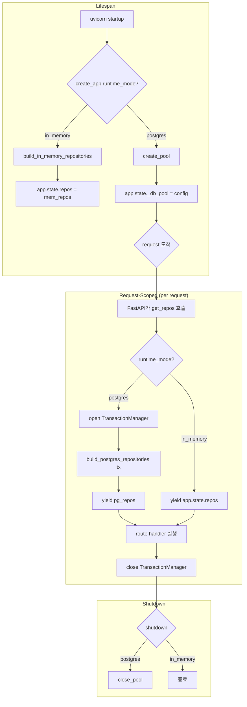
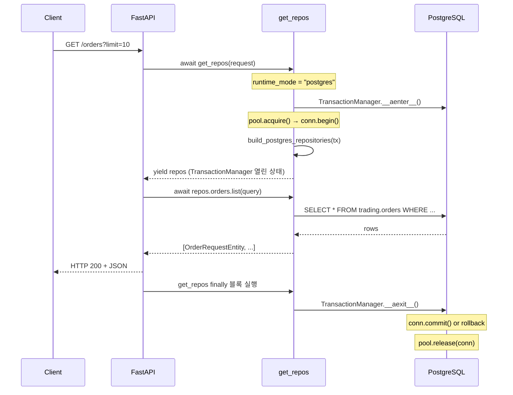
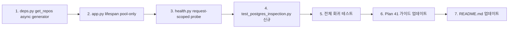

# Plan 42 — Postgres-backed Inspection API Mode (Rev 2)

> **목적**: FastAPI inspection API가 in-memory뿐 아니라 실제 PostgreSQL 데이터를 조회할 수 있도록
> Postgres-backed mode를 추가한다.
>
> **핵심 원칙**: Read-only. Trading runtime 전체를 bootstrap하지 않고 Postgres read path만 최소 구성으로 연결한다.
>
> **Rev 2 변경 사항**: 단일 TransactionManager를 API lifespan 전체에 유지하던 설계를 폐기.
> Pool만 lifespan에서 관리하고, repos는 요청 단위(request-scoped)로 생성/폐기한다.

---

## Revision History

| Rev | 날짜 | 변경 내용 |
|-----|------|-----------|
| 1 | 2026-05-04 | 최초 작성 — lifespan 단일 트랜잭션 설계 (거부됨) |
| 2 | 2026-05-04 | 전면 재설계: pool-lifetime + request-scoped repos. `deps.py`를 async generator로 변경. `/health`에서 `Depends(get_repos)` 제거 |

---

## 1. Why Now

- Plan 40으로 API 구조는 갖췄지만 in-memory 전용이라 운영 가치 제한적
- Postgres persistence는 Plan 37/38 E2E 테스트로 검증 완료
- 실제 DB 데이터를 Swagger UI에서 직접 볼 수 있어야 operator inspection API로서 의미가 있음
- Plan 41 manual verification guide도 Postgres mode 실행 방법을 포함해야 완전함

---

## 2. 현재 상태 분석

### 2.1 `create_app()` 현재 구조

[`src/agent_trading/api/app.py:28`](../src/agent_trading/api/app.py:28)

```python
def create_app(
    repos: RepositoryContainer | None = None,
    *,
    runtime_mode: str = "in_memory",
) -> FastAPI:
    if repos is None:
        repos = build_in_memory_repositories()
    # lifespan: repos → app.state
```

- `repos=None`이면 항상 in-memory로 fallback
- `runtime_mode`는 단순 문자열 label; lifespan에서 `app.state.runtime_mode`에 저장만 함
- Postgres repos를 전달하려면 호출자가 직접 `build_postgres_repositories(tx)` 해야 함

### 2.2 현재 `/health`의 DB 감지 방식

[`src/agent_trading/api/routes/health.py:30-39`](../src/agent_trading/api/routes/health.py:30)

```python
uow = repos.unit_of_work
if hasattr(uow, "_pool") and uow._pool is not None:  # InMemoryUnitOfWork 전용
    runtime_mode = "postgres"
```

- `InMemoryUnitOfWork`는 `_pool` 속성이 없으므로 항상 in-memory로 판단
- `PostgresUnitOfWork`는 `TransactionManager`를 래핑 — `_pool` 속성이 **없음**
- 따라서 현재 방식으로는 Postgres repos가 주입되어도 감지 불가

### 2.3 Postgres repos 의존성 (Request-Scoped Transaction이 필요한 이유)

모든 Postgres repository는 [`TransactionManager`](../src/agent_trading/db/transaction.py:12)를 필요로 함:

```python
class PostgresOrderRepository:
    def __init__(self, tx: TransactionManager) -> None:
        self._tx = tx
    # 모든 쿼리: self._tx.connection.fetch(...)
```

따라서 Postgres repos를 구성하려면 반드시 `TransactionManager`가 필요하며,
이는 request-scoped transaction이 필요한 근본적인 이유다.
즉, repos 자체가 tx 인스턴스에 의존하므로 요청마다 새 tx를 열어 repos를 구성해야 한다.

구체적인 구성 순서:
1. `create_pool()` — asyncpg connection pool 생성
2. `TransactionManager()` 열기 — pool에서 connection 획득 + transaction 시작
3. `build_postgres_repositories(tx)` — repos 조립

### 2.4 기존 Postgres fixture 패턴 (request-scoped 패턴)

[`tests/conftest.py:160-193`](../tests/conftest.py:160):

```python
@pytest.fixture
async def postgres_repos() -> AsyncIterator[RepositoryContainer]:
    await create_pool()
    await run_all_migrations()
    tx = TransactionManager(force_rollback=True)
    await tx.__aenter__()
    try:
        repos = build_postgres_repositories(tx)
        yield repos
    finally:
        await tx.__aexit__(None, None, None)
        await close_pool()
```

→ 테스트 fixture는 이미 request-scoped 패턴을 사용 중. API의 `get_repos()`도 동일한 패턴 사용.

### 2.5 `build_postgres_runtime()` 주의

[`src/agent_trading/runtime/bootstrap.py:311`](../src/agent_trading/runtime/bootstrap.py:311):

```python
repositories = build_postgres_repositories(None)  # tx=None → RuntimeError
```

Plan 42는 API 전용 초기화 경로 사용. 이 함수는 호출하지 않음.

### 2.6 `ReconciliationRepository` — Lock 지원 분석

**Protocol**: [`src/agent_trading/repositories/contracts.py:223-268`](../src/agent_trading/repositories/contracts.py:223)

`ReconciliationRepository` 프로토콜은 `add_run`, `get_run`, `attach_order_mismatch`, `attach_position_mismatch`, `list_runs_by_account`, `get_active_run`, `update_run_status`만 정의. **`list_locks()`는 프로토콜에 존재하지 않음.**

**Postgres 구현**: [`src/agent_trading/repositories/postgres/reconciliation.py:12-142`](../src/agent_trading/repositories/postgres/reconciliation.py:12)

프로토콜 메서드만 구현. `trading.order_blocking_locks` 테이블을 조회하는 코드가 전혀 없음. `acquire_lock`, `release_lock`, `is_locked` 메서드도 없음 (이들은 `ReconciliationService`에서 직접 raw SQL로 처리).

**In-memory 구현**: [`src/agent_trading/repositories/memory.py:365-557`](../src/agent_trading/repositories/memory.py:365)

`_blocking_locks` private dict + `acquire_lock()`, `release_lock()`, `is_locked()` — 프로토콜 밖의 추가 메서드. `ReconciliationService`에서 사용.

**Route**: [`src/agent_trading/api/routes/reconciliation.py:51-94`](../src/agent_trading/api/routes/reconciliation.py:51)

```python
if hasattr(repo, "_blocking_locks"):    # InMemory 전용
    # ... lock 조회
# Postgres: 항상 [] 반환
return []
```

**결론**: `GET /reconciliation/locks`는 Postgres 모드에서 항상 빈 배열(`[]`)을 반환.
**이는 "lock이 없어서"가 아니라 "lock 조회 기능이 구현되지 않아서"다.**
이번 Plan 42 범위에서 변경하지 않음. Phase 2 과제로 `list_locks()` 프로토콜 추가 + Postgres 구현 필요.

---

## 3. 설계: Pool-Lifetime + Request-Scoped Repos

### 3.1 전체 아키텍처



### 3.2 `app.py` — Lifespan 변경 (Pool-only)

[`src/agent_trading/api/app.py`](../src/agent_trading/api/app.py): lifespan에 Postgres pool 초기화만 추가.

```python
@asynccontextmanager
async def lifespan(_app: FastAPI) -> AsyncIterator[None]:
    if repos is not None:
        # 명시적 repos 주입 → 호출자가 완전 제어
        _app.state.repos = repos
        _app.state.runtime_mode = runtime_mode
        yield
        return

    if runtime_mode == "postgres":
        from agent_trading.db.connection import DatabaseConfig, create_pool, close_pool

        db_config = DatabaseConfig()
        await create_pool(db_config)
        _app.state._db_config = db_config
        _app.state.runtime_mode = "postgres"
        try:
            yield
        finally:
            await close_pool()
    else:
        # 기본 in-memory (변경 없음)
        _app.state.repos = build_in_memory_repositories()
        _app.state.runtime_mode = "in_memory"
        yield
```

**변경 사항**:
- `repos`가 명시적으로 주입되면 lifespan은 기존과 동일
- `runtime_mode="postgres"`일 때 lifespan은 **pool만 생성**하고 종료
- `TransactionManager`나 `build_postgres_repositories`는 lifespan에서 **호출하지 않음**
- Postgres repos는 app.state에 저장하지 않음 (request-scoped로 처리)

### 3.3 `deps.py` — Async Generator로 변경 (핵심 변경)

**변경 이유**: Postgres repos는 요청마다 새 `TransactionManager` + 새 repos가 필요. FastAPI의 yield-based dependency가 이 패턴을 지원.

[`src/agent_trading/api/deps.py`](../src/agent_trading/api/deps.py):

```python
"""FastAPI dependency injection — provides RepositoryContainer to routes.

In-memory mode: returns app.state.repos (singleton, existing behavior).
Postgres mode: creates request-scoped TransactionManager + repos per request.
"""

from __future__ import annotations

from typing import AsyncIterator

from fastapi import Request

from agent_trading.repositories.container import RepositoryContainer


async def get_repos(request: Request) -> AsyncIterator[RepositoryContainer]:
    """Request-scoped dependency that yields a ``RepositoryContainer``.

    In ``in_memory`` mode, returns the pre-built repos from ``app.state``.
    In ``postgres`` mode, opens a new ``TransactionManager``, builds
    Postgres repos, yields them, then closes the transaction on teardown.

    Usage (unchanged)::

        @router.get("/orders")
        async def list_orders(
            repos: RepositoryContainer = Depends(get_repos),
        ) -> ...:
    """
    runtime_mode: str = getattr(request.app.state, "runtime_mode", "in_memory")

    if runtime_mode == "postgres":
        from agent_trading.db.transaction import TransactionManager
        from agent_trading.repositories.postgres.bootstrap import (
            build_postgres_repositories,
        )

        tx = TransactionManager()
        await tx.__aenter__()
        try:
            repos = build_postgres_repositories(tx)
            yield repos
        finally:
            await tx.__aexit__(None, None, None)
    else:
        # In-memory: 기존 singleton repos 반환
        yield request.app.state.repos
```

**변경 사항**:
- 함수 시그니처: `get_repos(request: Request) -> RepositoryContainer` → `async get_repos(request: Request) -> AsyncIterator[RepositoryContainer]`
- `async def` + `yield` 사용 (FastAPI yield-based dependency)
- Postgres mode: 요청마다 새 `TransactionManager` + repos 생성
- In-memory mode: 기존처럼 `app.state.repos` 반환
- **기존 route 코드는 변경 불필요** — FastAPI가 async generator dependency를 투명하게 처리

**동작 설명**:
1. 요청이 들어오면 FastAPI가 `get_repos()` 호출
2. `yield repos`까지 실행 → route handler에 repos 전달
3. Route handler가 응답을 반환하면 → `yield` 이후의 `finally` 블록 실행
4. `TransactionManager.__aexit__()`가 트랜잭션 정리 (commit or rollback)
5. 예외 발생 시에도 `finally` 블록이 실행되어 리소스 정리 보장

### 3.4 `/health` / `/readyz` — Request-Scoped Repos 제거

**변경 이유**: `/health`는 request-scoped repos와 무관한 lightweight probe여야 함. DB 연결 상태는 pool 수준에서 확인.

[`src/agent_trading/api/routes/health.py`](../src/agent_trading/api/routes/health.py):

```python
"""``GET /health`` — minimal server and database status.

Uses ``request.app.state.runtime_mode`` directly instead of
``Depends(get_repos)`` to avoid creating request-scoped Postgres
repos for a simple health check.
"""

from __future__ import annotations

from datetime import datetime, timezone

from fastapi import APIRouter, Request
from fastapi.responses import JSONResponse

from agent_trading.api.schemas import HealthResponse

router = APIRouter(tags=["health"])

try:
    from agent_trading import __version__ as _version
except ImportError:
    _version = "0.1.0"


@router.get("/health", response_model=HealthResponse)
async def health(request: Request) -> HealthResponse:
    """Return minimal server status and database connectivity.

    Uses ``request.app.state.runtime_mode`` directly (no ``Depends(get_repos)``)
    to keep the health probe lightweight and independent of request-scoped repos.
    """
    runtime_mode: str = getattr(request.app.state, "runtime_mode", "in_memory")
    database_status: str = runtime_mode  # fallback: same as mode

    if runtime_mode == "postgres":
        from agent_trading.db.connection import health_check

        db_ok = await health_check()
        database_status = "connected" if db_ok else "disconnected"

    return HealthResponse(
        status="ok",
        version=_version,
        timestamp=datetime.now(timezone.utc),
        database=database_status,
        runtime_mode=runtime_mode,
    )


@router.get("/health/readyz")
async def readyz(request: Request) -> JSONResponse:
    """Kubernetes-style readiness probe.

    In postgres mode, checks database reachability.
    """
    runtime_mode: str = getattr(request.app.state, "runtime_mode", "in_memory")

    if runtime_mode == "postgres":
        from agent_trading.db.connection import health_check

        db_ok = await health_check()
        if not db_ok:
            return JSONResponse(
                {"status": "not_ready", "reason": "database unreachable"},
                status_code=503,
            )

    return JSONResponse({"status": "ok"})
```

**변경 사항**:
- `Depends(get_repos)` 제거 → `request: Request` 직접 사용
- `hasattr(uow, "_pool")` → `request.app.state.runtime_mode`로 변경
- `readyz()`에 `request: Request` 파라미터 추가
- Postgres mode에서 `health_check()`로 lightweight DB probe 수행
- In-memory mode: 기존 동작과 동일 (항상 "in_memory" 반환)

### 3.5 `GET /reconciliation/locks` — Postgres 미지원 명시

[`src/agent_trading/api/routes/reconciliation.py:66`](../src/agent_trading/api/routes/reconciliation.py:66):

현재 구현:
```python
# The in-memory reconciliation repository stores locks internally.
# We access the private store for inspection purposes.
# In Postgres mode, this would query `trading.order_blocking_locks`.
repo = repos.reconciliations
if hasattr(repo, "_blocking_locks"):
    # ... InMemory 전용 lock 조회
# Fallback for Postgres or unknown repos: return empty.
return []
```

**Postgres mode에서는 항상 빈 배열 반환**.
⚠️ **이는 "실제 lock이 없어서"가 아니라 "lock 조회 기능이 아직 구현되지 않아서"다.**
운영자가 Swagger UI에서 `/reconciliation/locks`가 빈 배열을 반환하는 것을 보고
"현재 blocking lock이 없다"고 오해하지 않도록 주의해야 함.

원인: 프로토콜에 `list_locks()`가 없고, Postgres 구현체에 lock 조회 로직이 없기 때문.
Phase 2에서 `ReconciliationRepository` 프로토콜 확장 + Postgres 구현 필요.

**이번 Plan 42에서 변경하지 않음** — 라우트 코드는 repos 추상화만 사용하므로
Postgres repos가 전달되어도 정상 동작 (빈 배열 반환). 별도 경고 로그도 추가하지 않음
(정상 동작이므로 오해의 소지만 문서로 남김).

### 3.6 `build_postgres_runtime()` 버그 — 이번 범위 밖

`runtime/bootstrap.py:311`의 `tx=None` 버그는 Plan 42와 직접 관련 없음. API에서 `build_postgres_runtime()`을 호출하지 않음으로써 이 문제를 우회.

---

## 4. 변경 파일 목록

### 4.1 Production 코드 변경

| 파일 | 변경 내용 | 영향 |
|------|-----------|------|
| [`src/agent_trading/api/app.py`](../src/agent_trading/api/app.py) | lifespan에 Postgres pool-only 초기화 경로 추가. repos는 app.state에 저장하지 않음 | ⭐ 중간 — lifespan 로직 변경 |
| [`src/agent_trading/api/deps.py`](../src/agent_trading/api/deps.py) | `get_repos()`를 async generator로 변경. Postgres mode에서 request-scoped repos 생성 | ⭐ 높음 — 핵심 변경. 기존 모든 route에 영향 |
| [`src/agent_trading/api/routes/health.py`](../src/agent_trading/api/routes/health.py) | `Depends(get_repos)` → `request: Request`. `runtime_mode` 기반 DB probe | 낮음 — health 전용 |

### 4.2 변경이 필요 없는 파일

| 파일 | 이유 |
|------|------|
| `src/agent_trading/api/schemas.py` | Response model 변경 불필요 |
| `src/agent_trading/api/routes/*.py` (health 제외) | Route 코드는 `Depends(get_repos)`를 통해 repos를 받음. `get_repos()`의 내부 구현이 바뀌어도 route 코드는 변경 불필요 |
| `src/agent_trading/repositories/postgres/bootstrap.py` | `build_postgres_repositories(tx)`는 request-scoped로 계속 사용 |
| `src/agent_trading/db/connection.py` / `transaction.py` | 변경 불필요 |
| `src/agent_trading/runtime/bootstrap.py` | API는 이 함수를 호출하지 않음 |
| `Makefile` | `run-api` target 변경 불필요 |

### 4.3 테스트 파일

| 파일 | 설명 |
|------|------|
| [`tests/api/test_health.py`](../tests/api/test_health.py) | 기존 3개 테스트는 in-memory mode 검증. `Depends(get_repos)` 제거로 인한 변경 없음 (`empty_client`는 `create_app()` → in-memory) |
| [`tests/api/conftest.py`](../tests/api/conftest.py) | 기존 fixture 변경 불필요. `postgres_client` fixture는 새 테스트 파일에 작성 |
| [`tests/api/test_inspection.py`](../tests/api/test_inspection.py) | Route 테스트는 repos 추상화 위에 있으므로 변경 불필요 |
| **신규**: [`tests/api/test_postgres_inspection.py`](../tests/api/test_postgres_inspection.py) | Postgres mode API 테스트 (skipif 패턴) |

### 4.4 문서 변경

| 파일 | 설명 |
|------|------|
| [`plans/41_inspection_api_manual_verification.md`](../plans/41_inspection_api_manual_verification.md) | Postgres mode 실행 방법 추가. `GET /reconciliation/locks` Postgres 제한 사항 추가 |
| [`plans/README.md`](../plans/README.md) | Plan 42 Rev 2 반영 |

---

## 5. 테스트 전략

### 5.1 Layer A: In-memory Regression (변경 없음)

기존 14개 API 테스트가 변경 없이 계속 통과해야 함.

```bash
python -m pytest tests/api/ -v
# → 14 passed (기존과 동일)
```

**중요**: `get_repos()`가 async generator로 바뀌어도 기존 in-memory 테스트에는 영향 없음. `empty_client`와 `client` fixture는 모두 in-memory `create_app()`을 사용하므로 `get_repos()`의 in-memory 브랜치가 실행됨.

### 5.2 Layer B: Postgres-backed API Tests (신규)

[`tests/api/test_postgres_inspection.py`](../tests/api/test_postgres_inspection.py):

```python
"""Postgres-backed inspection API tests.

Requires ``DATABASE_*`` environment variables.
Uses the same ``skipif`` pattern as ``test_long_path_e2e.py``.
"""

from __future__ import annotations

import os

import pytest
from fastapi.testclient import TestClient

from agent_trading.api.app import create_app


_REQUIRED_PG_VARS = (
    "DATABASE_HOST", "DATABASE_PORT", "DATABASE_NAME",
    "DATABASE_USER", "DATABASE_PASSWORD",
)


def _pg_env_complete() -> bool:
    return all(bool(os.getenv(v)) for v in _REQUIRED_PG_VARS)


# ── Fixtures ─────────────────────────────────────────────────────────


@pytest.fixture
async def postgres_client() -> TestClient:
    """TestClient backed by Postgres (pool-only lifespan, request-scoped repos)."""
    app = create_app(runtime_mode="postgres")
    with TestClient(app) as tc:
        yield tc


# ── Tests (대표 경로 4개만) ─────────────────────────────────────────


@pytest.mark.skipif(not _pg_env_complete(), reason="requires DATABASE_* env vars")
class TestPostgresInspectionAPI:
    """Postgres-backed inspection API tests.

    Tests 4 representative paths to verify Postgres mode works end-to-end.
    Does NOT cover all endpoints — in-memory regression tests do that.
    """

    async def test_health_postgres_mode(self, postgres_client: TestClient) -> None:
        """``GET /health`` returns postgres runtime mode + DB status."""
        resp = postgres_client.get("/health")
        assert resp.status_code == 200
        data = resp.json()
        assert data["runtime_mode"] == "postgres"
        assert data["database"] in ("connected", "disconnected")

    async def test_list_orders_empty(self, postgres_client: TestClient) -> None:
        """``GET /orders`` returns empty list (clean DB)."""
        resp = postgres_client.get("/orders", params={"limit": 10})
        assert resp.status_code == 200
        assert resp.json() == []

    async def test_audit_logs_requires_param(
        self, postgres_client: TestClient,
    ) -> None:
        """``GET /audit-logs`` returns 422 without correlation_id."""
        resp = postgres_client.get("/audit-logs")
        assert resp.status_code == 422

    async def test_reconciliation_runs_requires_param(
        self, postgres_client: TestClient,
    ) -> None:
        """``GET /reconciliation/runs`` returns 422 without account_id."""
        resp = postgres_client.get("/reconciliation/runs")
        assert resp.status_code == 422
```

**skipif 동작**: Postgres 환경이 없으면 전체 클래스가 skip. DB가 깨끗한 상태(빈 테이블)여야 함.

---

## 6. 실행 방법

### 6.1 In-memory mode (변경 없음)

```bash
make run-api
# 또는
uvicorn agent_trading.api.app:app --reload --host 0.0.0.0 --port 8000
```

### 6.2 Postgres mode (신규)

```bash
# 1. .env 파일에서 DB 환경 변수 로드
set -a && source .env && set +a

# 2. Postgres mode로 API 실행 (runtime_mode override 필요)
uvicorn agent_trading.api.app:app --reload --host 0.0.0.0 --port 8000
```

> ⚠️ **주의**: 기본 `app` 인스턴스는 `create_app()` (in-memory)으로 생성됨.
> Postgres mode로 실행하려면 `create_app(runtime_mode="postgres")`가 필요.
> 현재 `Makefile`의 `run-api` target은 `app` 인스턴스를 사용하므로,
> 별도의 entry point 또는 환경 변수 기반 분기가 필요할 수 있음.
>
> **임시 방법**: 테스트나 스크립트에서 직접 `create_app(runtime_mode="postgres")` 호출.
> 추후 Phase 2에서 env var 기반 mode 전환 추가.

Postgres mode에서의 동작:
1. Lifespan startup: `DatabaseConfig()`로 `.env` 읽기 → `create_pool()`로 pool 생성
2. 각 요청마다: `TransactionManager` 열기 → `build_postgres_repositories(tx)` → repos 사용 → 트랜잭션 정리
3. Lifespan shutdown: `close_pool()`로 pool 정리

---

## 7. Request-Scoped Dependencies 동작 설명



---

## 8. 완료 기준 (Completion Criteria)

| # | 조건 | 검증 방법 |
|---|------|-----------|
| 1 | In-memory mode 유지 | 기존 API 테스트 14개 통과 (`tests/api/`) |
| 2 | Postgres mode app startup 성공 | `create_app(runtime_mode="postgres")`로 TestClient 생성 시 오류 없음 |
| 3 | `/health`가 `runtime_mode` + DB 상태 노출 | `test_health_postgres_mode` 통과 |
| 4 | Postgres 데이터가 inspection endpoint로 조회됨 | 새 Postgres API 테스트 통과 (5개) |
| 5 | 기존 전체 테스트 회귀 없음 | `python -m pytest tests/ --ignore=tests/smoke --ignore=tests/integration -x -q` 통과 |
| 6 | Plan 41 가이드 업데이트 완료 | Postgres mode 실행 방법 + lock 제한 사항 포함 |
| 7 | Request-scoped repos가 요청마다 새로 생성됨 | Postgres mode에서 `/orders` 호출 후 트랜잭션 정상 종료 확인 |

---

## 9. 실행 순서



### Step 1: `deps.py` — `get_repos()` async generator 변경

**왜 먼저?** 이 변경이 가장 크고 많은 route에 영향. 먼저 변경하고 테스트로 검증.

변경 사항:
- Sync function → `async def` + `yield` (AsyncIterator)
- Postgres mode: `TransactionManager()` → `build_postgres_repositories(tx)` → yield → cleanup
- In-memory mode: 기존처럼 `app.state.repos` yield

**주의**: FastAPI yield-based dependency는 `AsyncIterator`를 반환해야 함.
`typing.AsyncIterator`를 return type으로 사용. FastAPI가 자동으로 처리.

### Step 2: `app.py` — lifespan pool-only

변경 사항:
- `runtime_mode == "postgres"` 분기: `create_pool()`만 실행, `TransactionManager` 없음
- `_app.state.repos`를 Postgres mode에서 설정하지 않음
- `_app.state._db_config`만 저장 (health_check 등에서 사용 가능)
- Shutdown: `close_pool()`

### Step 3: `routes/health.py` — request-scoped repos 제거

변경 사항:
- `Depends(get_repos)` → `request: Request`
- `hasattr(uow, "_pool")` → `request.app.state.runtime_mode`
- Postgres mode: `health_check()` 호출
- `readyz()`에 `request: Request` 추가 및 Postgres probe

### Step 4: `tests/api/test_postgres_inspection.py` — 신규

- `_REQUIRED_PG_VARS` + `_pg_env_complete()` 패턴
- `postgres_client` fixture
- `@pytest.mark.skipif`로 guard
- 6개 테스트: health, readyz, orders empty, audit-logs param, reconciliation runs param, locks empty

### Step 5: 전체 회귀 테스트

```bash
# in-memory tests
python -m pytest tests/api/ -v
# → 14 passed

# 전체 테스트 (PG 환경 없으면 skip)
python -m pytest tests/ --ignore=tests/smoke --ignore=tests/integration -x -q
```

### Step 6: Plan 41 가이드 업데이트

- "실행 방법" 섹션에 Postgres mode 실행 절차 추가
- `.env` 준비 + `set -a && source .env && set +a` 예시
- Postgres mode에서 Swagger UI로 실제 DB 데이터 보는 설명
- `/health` 응답 변화 (runtime_mode: "postgres")
- `GET /reconciliation/locks` Postgres 제한 사항 명시

### Step 7: `plans/README.md` 업데이트

Plan 42 Rev 2 항목 업데이트.

---

## 10. Risk Assessment

| 위험 | 영향 | 확률 | 대응 |
|------|------|------|------|
| `get_repos()`를 async generator로 변경 시 기존 route에서 `await` 이슈 | 컴파일/런타임 오류 | 낮음 | FastAPI가 async generator dependency를 투명하게 처리. 기존 route 코드 변경 불필요. 단, `get_repos()`를 직접 호출하는 코드가 있다면 `async for` 필요 (현재 없음) |
| Request-scoped TransactionManager 오버헤드 | 각 요청마다 connection acquire + begin | 중간 | Read-only inspection API는 트래픽이 낮음. Pool connection 재사용으로 overhead 최소화. 필요시 connection pooling 튜닝 |
| `/health`가 request-scoped repos 없이도 정상 동작 | Health check가 부정확 | 낮음 | `health_check()`는 pool 수준에서 SELECT 1 수행. repos가 없어도 DB 연결 상태는 정확히 측정 가능 |
| `GET /reconciliation/locks`가 Postgres에서 항상 빈 배열 | Operator 혼란 | 중간 | Plan 41 가이드에 명시적으로 제한 사항 문서화. Phase 2에서 `list_locks()` 프로토콜 추가 예정 |
| Postgres pool이 startup 시 생성 실패 | 서버 기동 불가 | 낮음 | `create_pool()` 실패 시 lifespan에서 예외 발생 → uvicorn이 startup 실패로 처리. 명시적 실패가 나음 |
| Request-scoped repos에서 write 발생 (버그) | 데이터 오염 | 매우 낮음 | 모든 route는 read-only. TransactionManager가 commit해도 write가 없으면 영향 없음 |

---

## 11. Follow-up (Phase 2 후보)

| # | 항목 | 설명 | 우선순위 |
|---|------|------|----------|
| 1 | `ReconciliationRepository.list_locks()` 프로토콜 추가 | `GET /reconciliation/locks`가 Postgres에서도 동작하도록 | 높음 |
| 2 | Postgres `trading.order_blocking_locks` 조회 구현 | `PostgresReconciliationRepository`에 `list_locks()` 구현 | 높음 |
| 3 | Connection pool health check / reconnect | 장기 실행 API 서버에서 connection 유실 시 자동 복구 | 중간 |
| 4 | 환경 변수 기반 mode 전환 | `INSPECTION_MODE=postgres` env var로 `app` 인스턴스 자동 전환 | 중간 |
| 5 | Pagination / filtering 확장 | 현재 `limit=20` 고정. Phase 2에서 cursor-based pagination | 낮음 |
| 6 | Read-only 트랜잭션 (Postgres 14+) | `BEGIN READ ONLY`로 write 방지 강화 | 낮음 |
