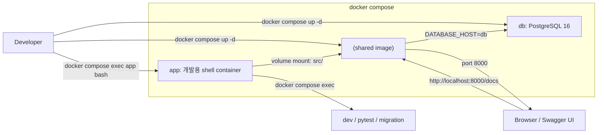
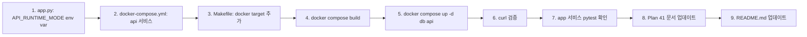

# Plan 43 — Containerize FastAPI Inspection API and docker-compose Integration

> **목표**: 개발용 `app` 컨테이너는 유지하면서, 실제 FastAPI inspection API를 실행하는 `api` 서비스를 `docker-compose.yml`에 추가한다.
> `docker compose up`으로 DB + API 서버가 함께 올라오고 `http://localhost:8000/docs`에서 Swagger UI를 확인할 수 있게 한다.
>
> **핵심 원칙**: 
> - 기존 `app` 서비스를 개발용 shell container로 유지 (덮어쓰지 않음)
> - `api` 서비스는 같은 Docker image 재사용
> - Postgres mode로 DB 연동하여 실제 데이터 조회 가능
> - 과도한 설정 추가 금지 (nginx, auth, write API, KIS adapter 등 제외)

---

## Revision History

| Rev | Date | Author | Changes |
|-----|------|--------|---------|
| 1 | 2026-05-04 | Roo (Architect) | Initial |

---

## 1. Why Now

1. **코어 엔진, Postgres, inspection API 모두 준비 완료**
   - Plan 40: FastAPI inspection API Phase 1 완료 (9개 endpoint)
   - Plan 42: Postgres-backed inspection API mode 검증 완료 (4/4 테스트 통과, curl 수동 확인 완료)
   - Plan 41: Manual verification guide 작성 완료

2. **실행 환경 재현성 필요**
   - 현재는 사람이 로컬 셸에서 수동으로 API를 띄워야 함 (`make run-api` 또는 `uvicorn`)
   - `docker compose`에 API 서비스를 추가하면 재현성과 온보딩이 크게 개선됨
   - `docker compose up` 한 번으로 DB + API 서버 전체 기동 가능

3. **역할 분리**
   - `app`: 개발용 shell container (pytest, migration, 수동 스크립트)
   - `api`: 실제 API 서버 (Postgres mode, port 8000 노출)

---

## 2. 현재 상태 분석

### 2.1 docker-compose.yml 현재 구조

```yaml
services:
  db:       # PostgreSQL 16 (localhost:5432)
  app:      # 개발용 shell container (tail -f /dev/null)
```

- `db`: postgres:16-alpine, healthcheck 있음
- `app`: 동일 image build, volumes mount, `command: ["tail", "-f", "/dev/null"]`
- DB env vars: `DATABASE_HOST=db`, `DATABASE_PORT=5432`, `DATABASE_NAME=trading`, `DATABASE_USER=trading`, `DATABASE_PASSWORD=trading`, `DATABASE_SCHEMA=trading`

### 2.2 Dockerfile 현재 상태

- `python:3.12-slim` 기반
- `pip install -e ".[dev]"` — fastapi + uvicorn 포함
- Default CMD: `["tail", "-f", "/dev/null"]`
- **curl 없음** (`python:3.12-slim`에는 curl 미포함)

### 2.3 `create_app()` 현재 구조

```python
def create_app(repos=None, *, runtime_mode="in_memory") -> FastAPI:
    # lifespan에서 pool-only (postgres) 또는 in-memory repos 초기화

# Default instance (module level)
app = create_app()  # 항상 in-memory
```

**문제**: `uvicorn agent_trading.api.app:app`로 실행하면 항상 in-memory 모드.
Postgres mode로 실행하려면 `create_app(runtime_mode="postgres")` 호출이 필요하나,
uvicorn CLI로는 factory 함수에 인자를 전달할 수 없음.

### 2.4 필요한 env vars

Docker `api` 서비스가 Postgres mode로 동작하려면:
- `API_RUNTIME_MODE=postgres` ← 신규 env var 필요
- `DATABASE_HOST=db`, `DATABASE_PORT=5432`, ... ← 기존 db env vars

---

## 3. 설계

### 3.1 전체 아키텍처 (변경 후)



### 3.2 기존 `app` 서비스 — 유지 (변경 없음)

```yaml
app:
  build: .
  depends_on:
    db:
      condition: service_healthy
  environment:
    DATABASE_HOST: db
    DATABASE_PORT: 5432
    DATABASE_NAME: trading
    DATABASE_USER: trading
    DATABASE_PASSWORD: trading
    DATABASE_SCHEMA: trading
  volumes:
    - ./src:/app/src
    - ./db:/app/db
    - ./tests:/app/tests
    - ./pyproject.toml:/app/pyproject.toml
  command: ["tail", "-f", "/dev/null"]
  restart: unless-stopped
```

- **변경 없음**. 개발용 shell container로 계속 사용.

### 3.3 신규 `api` 서비스 — 추가

```yaml
api:
  build: .                    # 같은 Dockerfile 재사용
  depends_on:
    db:
      condition: service_healthy
  environment:
    DATABASE_HOST: db
    DATABASE_PORT: 5432
    DATABASE_NAME: trading
    DATABASE_USER: trading
    DATABASE_PASSWORD: trading
    DATABASE_SCHEMA: trading
    API_RUNTIME_MODE: postgres   # ← 신규 env var
  ports:
    - "8000:8000"
  # Volumes 생략 (production-like). 필요 시 dev에서만 추가 가능.
  command:
    - uvicorn
    - agent_trading.api.app:create_app_from_env
    - --factory
    - --host
    - "0.0.0.0"
    - --port
    - "8000"
  healthcheck:
    test: ["CMD", "python", "-c", "import urllib.request; exit(0 if urllib.request.urlopen('http://localhost:8000/health/readyz').status==200 else 1)"]
    interval: 10s
    timeout: 5s
    retries: 3
    start_period: 10s
  restart: unless-stopped
```

**핵심 설계 결정**:

| 항목 | 결정 | 이유 |
|------|------|------|
| Build context | `build: .` (기존과 동일) | Dockerfile 재사용, 별도 Dockerfile 불필요 |
| Command | `uvicorn ...:create_app_from_env --factory` | uvicorn `--factory` 플래그로 factory 함수 호출. module-level `app`은 변경 없음 |
| Postgres mode | `API_RUNTIME_MODE=postgres` env var | `create_app_from_env()`가 call time에 env var 읽어 mode 결정 |
| Port | `8000:8000` | 기존 로컬 개발과 동일한 포트 |
| Volumes | **없음** (production-like) | dev에서 live reload 필요 시 `--reload` 추가 + volumes mount 고려 |
| Healthcheck | Python `urllib` 사용 | `python:3.12-slim`에 curl 없음. Python 내장 라이브러리로 대체 |
| depends_on | `db: condition: service_healthy` | DB 준비 후 API 시작 |

### 3.4 `app.py` — `create_app_from_env()` factory 함수 추가 (uvicorn --factory)

**변경 이유**: uvicorn의 `--factory` 플래그를 사용하여 container runtime에서만 Postgres mode를 선택.
module-level `app = create_app()`은 항상 in-memory로 고정 (import-time behavior 불변).

`app.py` 하단에 다음 함수를 추가:

```python
# ── uvicorn --factory support ─────────────────────────────────────────


def create_app_from_env() -> FastAPI:
    """Factory for ``uvicorn ... --factory``.

    Reads ``API_RUNTIME_MODE`` from the environment and delegates to
    :func:`create_app`.  The module-level ``app`` instance is **not**
    affected — it always stays in-memory.

    Usage::

        uvicorn agent_trading.api.app:create_app_from_env --factory ...
    """
    import os

    mode = os.getenv("API_RUNTIME_MODE", "in_memory")
    return create_app(runtime_mode=mode)


# Default instance: always in-memory (unchanged)
app = create_app()
```

**변경 사항**:
- 신규 함수 `create_app_from_env()` 추가 — uvicorn `--factory` 전용
- module-level `app = create_app()` — **변경 없음**, 항상 in-memory
- `create_app()` 함수 자체 — **변경 없음**

**동작**:
- `uvicorn agent_trading.api.app:app` (기존) → module-level `app` → 항상 in-memory
- `uvicorn agent_trading.api.app:create_app_from_env --factory` (신규, Docker) → `API_RUNTIME_MODE=postgres` → Postgres mode
- `make run-api` (로컬) → module-level `app` → in-memory 유지

### 3.5 Healthcheck 설계

`python:3.12-slim`에는 `curl`이 없으므로 Python 내장 `urllib.request`를 사용:

```yaml
healthcheck:
  test: ["CMD", "python", "-c", 
    "import urllib.request; 
     exit(0 if urllib.request.urlopen('http://localhost:8000/health/readyz').status==200 else 1)"]
  interval: 10s
  timeout: 5s
  retries: 3
  start_period: 10s
```

- `start_period: 10s`: 컨테이너 시작 후 10초 동안 healthcheck 대기 (DB 연결 + pool 생성 시간 고려)
- `/health/readyz` 사용: Postgres mode에서 DB reachability도 함께 확인
- 200이 아니면 `exit(1)`로 unhealthy 보고

### 3.6 Makefile 변경

기존 docker target에 `api` 관련 target 추가:

```makefile
# docker-compose.yml에 api 서비스 추가 후
docker-up-api:
	docker compose up -d db api

docker-logs-api:
	docker compose logs -f api

docker-restart-api:
	docker compose restart api
```

- `docker-up` (기존): 모든 서비스(db + app + api) 시작
- `docker-up-api` (신규): db + api만 시작 (app 불필요할 때)

---

## 4. 변경 파일 목록

### 4.1 변경 파일

| 파일 | 변경 내용 | 영향 |
|------|-----------|------|
| [`docker-compose.yml`](../docker-compose.yml) | `api` 서비스 신규 추가 | ⭐ 중간 |
| [`src/agent_trading/api/app.py`](../src/agent_trading/api/app.py) | module-level `app`이 `API_RUNTIME_MODE` env var 읽도록 변경 | 낮음 — default in-memory 유지 |
| [`Makefile`](../Makefile) | `docker-up-api`, `docker-logs-api`, `docker-restart-api` target 추가 | 낮음 |
| [`plans/41_inspection_api_manual_verification.md`](../plans/41_inspection_api_manual_verification.md) | Docker compose 실행 절차 추가 ("실행 방법" 섹션) | 낮음 — 문서 |
| [`plans/README.md`](../plans/README.md) | Plan 43 항목 추가 | 낮음 — 문서 |

### 4.2 변경 불필요 파일

| 파일 | 이유 |
|------|------|
| `Dockerfile` | Dockerfile 재사용. 변경 불필요 |
| `pyproject.toml` | fastapi + uvicorn 이미 포함 |
| `src/agent_trading/api/deps.py` | API 동작 변경 없음 |
| `src/agent_trading/api/routes/*.py` | Route 변경 없음 |
| `src/agent_trading/api/schemas.py` | Response model 변경 없음 |
| `src/agent_trading/db/connection.py` / `transaction.py` | 변경 없음 |
| `tests/` 전체 | 테스트 변경 불필요 |
| `.env` | Docker 환경에서는 env vars를 docker-compose에서 직접 설정 |

---

## 5. 실행 / 검증 절차

### 5.1 이미지 빌드

```bash
docker compose build
```

### 5.2 전체 기동

```bash
# 모든 서비스 기동 (db + app + api)
docker compose up -d

# 또는 api + db만 (app 불필요 시)
docker compose up -d db api
```

### 5.3 상태 확인

```bash
# 서비스 상태
docker compose ps

# API 로그
docker compose logs -f api

# Healthcheck 상태
docker inspect --format='{{json .State.Health}}' agent_trading-api-1
```

### 5.4 curl 검증

```bash
# 헬스 체크
curl -s http://localhost:8000/health/readyz
# → {"status":"ok"}

# 상세 상태 (runtime_mode + database 확인)
curl -s http://localhost:8000/health | python3 -m json.tool
# → {"status":"ok", "runtime_mode":"postgres", "database":"connected"}

# Swagger UI 접근
curl -s -o /dev/null -w "%{http_code}" http://localhost:8000/docs
# → 200

# OpenAPI 스펙
curl -s http://localhost:8000/openapi.json | python3 -m json.tool
```

### 5.5 브라우저 검증

브라우저에서 `http://localhost:8000/docs` 열기 → Swagger UI에서 9개 endpoint 확인.

### 5.6 기존 `app` 서비스 확인

```bash
# app 서비스에 shell 진입
docker compose exec app bash

# pytest 실행
python -m pytest tests/api/ -v

# migration 실행
python -m agent_trading.db.migrations.run
```

### 5.7 종료

```bash
# 모든 서비스 종료
docker compose down

# 특정 서비스만 종료
docker compose stop api
```

---

## 6. 테스트 전략

### 6.1 자동화 테스트 (변경 없음)

| 테스트 | 실행 | 기대 결과 |
|--------|------|----------|
| 기존 API 테스트 (in-memory) | `python -m pytest tests/api/ -v` | 14 passed |
| Postgres API 테스트 | `.env` 로드 후 `python -m pytest tests/api/test_postgres_inspection.py -v` | 4 passed (skip 없음) |
| 전체 회귀 테스트 | `python -m pytest tests/ --ignore=tests/smoke --ignore=tests/integration -x -q` | 기존 통과 유지 |

### 6.2 수동 검증 (Docker)

| 검증 항목 | 방법 | 기대 결과 |
|-----------|------|----------|
| 컨테이너 기동 | `docker compose ps` | `db`, `app`, `api` 모두 `Up` |
| API 응답 | `curl http://localhost:8000/health/readyz` | `{"status":"ok"}` |
| Postgres mode | `curl http://localhost:8000/health` | `runtime_mode: "postgres"`, `database: "connected"` |
| Swagger UI | 브라우저 `http://localhost:8000/docs` | 9개 endpoint 표시 |
| app shell | `docker compose exec app bash` | shell 진입 가능 |
| app pytest | `docker compose exec app python -m pytest tests/api/ -v` | 14 passed |

### 6.3 Healthcheck 검증

```bash
# 컨테이너 health 상태 확인
docker inspect --format='{{json .State.Health.Status}}' agent_trading-api-1
# → "healthy"
```

---

## 7. 완료 기준 (Completion Criteria)

| # | 조건 | 검증 방법 |
|---|------|-----------|
| 1 | `api` 서비스가 `docker-compose.yml`에 추가됨 | 파일 내용 확인 |
| 2 | 기존 `app` 서비스가 shell container로 유지됨 | `command: ["tail", "-f", "/dev/null"]` 유지 |
| 3 | `API_RUNTIME_MODE` env var로 Postgres mode 전환 | `app.py` 하단 변경 확인 |
| 4 | `docker compose up -d db api`로 기동 가능 | 명령어 실행 성공 |
| 5 | `/health/readyz` 200 응답 | curl 확인 |
| 6 | `/health`가 `runtime_mode: "postgres"` + `database: "connected"` 반환 | curl 확인 |
| 7 | Swagger UI `/docs` 200 응답 | curl 확인 |
| 8 | `app` 서비스에서 pytest 실행 가능 | `docker compose exec app python -m pytest tests/api/ -v` 통과 |
| 9 | Healthcheck가 정상 동작 | `docker inspect`로 `"healthy"` 확인 |
| 10 | Plan 41 문서에 Docker 실행 절차 추가 | 문서 변경 확인 |

---

## 8. 실행 순서



### Step 1: `app.py` — module-level `app`에 `API_RUNTIME_MODE` env var 지원 추가

하단 2줄을 다음과 같이 변경:

```python
# Default instance: env var로 runtime mode 전환 가능
import os
app = create_app(runtime_mode=os.getenv("API_RUNTIME_MODE", "in_memory"))
```

### Step 2: `docker-compose.yml` — `api` 서비스 추가

기존 `db`, `app` 서비스 아래에 `api` 서비스 추가:
- `build: .` (기존 image 재사용)
- `depends_on: db: condition: service_healthy`
- `API_RUNTIME_MODE=postgres` env var 설정
- `ports: "8000:8000"`
- `command: uvicorn agent_trading.api.app:app --host 0.0.0.0 --port 8000`
- `healthcheck` 추가 (Python urllib 기반)

### Step 3: `Makefile` — docker target 추가

```makefile
docker-up-api:
	docker compose up -d db api

docker-logs-api:
	docker compose logs -f api

docker-restart-api:
	docker compose restart api
```

### Step 4: `docker compose build`

```bash
docker compose build
```

변경된 `app.py`가 image에 포함되도록 build.

### Step 5: `docker compose up -d db api`

```bash
docker compose up -d db api
```

### Step 6: curl 검증

```bash
curl -s http://localhost:8000/health/readyz
curl -s http://localhost:8000/health | python3 -m json.tool
curl -s -o /dev/null -w "%{http_code}" http://localhost:8000/docs
```

### Step 7: `app` 서비스 pytest 확인

```bash
docker compose exec app python -m pytest tests/api/ -v
```

### Step 8: Plan 41 문서 업데이트

"실행 방법" 섹션에 Docker compose 실행 절차 추가.

### Step 9: `plans/README.md` 업데이트

Plan 43 항목 추가.

---

## 9. Risk Assessment

| 위험 | 영향 | 확률 | 대응 |
|------|------|------|------|
| `python:3.12-slim`에 `urllib`가 없음 | Healthcheck 실패 | 매우 낮음 | `urllib.request`는 Python 표준 라이브러리. 모든 Python 설치에 포함 |
| DB startup보다 API가 먼저 시작됨 | API 503 + healthcheck 실패 | 중간 | `depends_on: condition: service_healthy`로 순서 보장. `start_period: 10s`로 초기 failure 허용 |
| `create_app_from_env()` 도입으로 기존 import 영향 | 없음 | 낮음 | module-level `app`은 변경 없음. 기존 `from agent_trading.api.app import app`는 영향 없음 |
| Volumes 미마운트로 코드 변경 시 API 재시작 필요 | 개발 편의성 저하 | 낮음 | 개발 환경에서는 필요 시 `--reload` + volumes 추가 고려. 현재는 production-like 유지 |
| Port 8000 충돌 (로컬 uvicorn + docker 동시 실행) | 포트 바인딩 실패 | 중간 | 문서에 주의사항 명시. `docker compose down` 후 로컬 실행 권장 |
| Docker compose env var와 `.env` 파일 중복 | 혼란 | 낮음 | Docker 환경에서는 docker-compose.yml의 env vars가 우선. `.env`는 로컬 전용 |

---

## 10. 변경 시 주요 주의사항

1. **기존 `app` 서비스를 절대 수정하지 않는다**
   - `command` 변경 금지
   - `volumes` 변경 금지
   - `environment`는 동일 유지 (API_RUNTIME_MODE는 `api` 서비스에만 추가)

2. **`app.py` 변경은 최소화**
   - module-level `app = create_app()`은 변경하지 않음 (항상 in-memory 유지)
   - `create_app_from_env()` factory 함수만 추가 (uvicorn --factory 전용)
   - `create_app()` 함수 자체는 변경 없음

3. **Docker image 재사용**
   - `api` 서비스는 `build: .`로 기존 Dockerfile 재사용
   - 별도 Dockerfile 불필요

4. **Healthcheck는 현실적으로**
   - `curl`이 없으므로 Python `urllib` 사용
   - 실패 시 컨테이너가 `unhealthy`로 표시되지만 자동 재시작은 `restart: unless-stopped`에 의존

---

## 11. Follow-up (Phase 2 후보)

| # | 항목 | 설명 | 우선순위 |
|---|------|------|----------|
| 1 | `api` 서비스에 volumes + `--reload` | 개발 중 코드 변경 시 자동 재시작 | 낮음 (개발 편의성) |
| 2 | Docker network 최적화 | `app` 서비스에서 `api`로 HTTP 요청 가능하도록 | 낮음 |
| 3 | multi-stage Dockerfile | production image 경량화 (dev deps 분리) | 낮음 |
| 4 | docker-compose override | `docker-compose.override.yml`로 dev/prod 분리 | 낮음 |
| 5 | API 서버 metrics | Prometheus endpoint 노출 | 낮음 |
