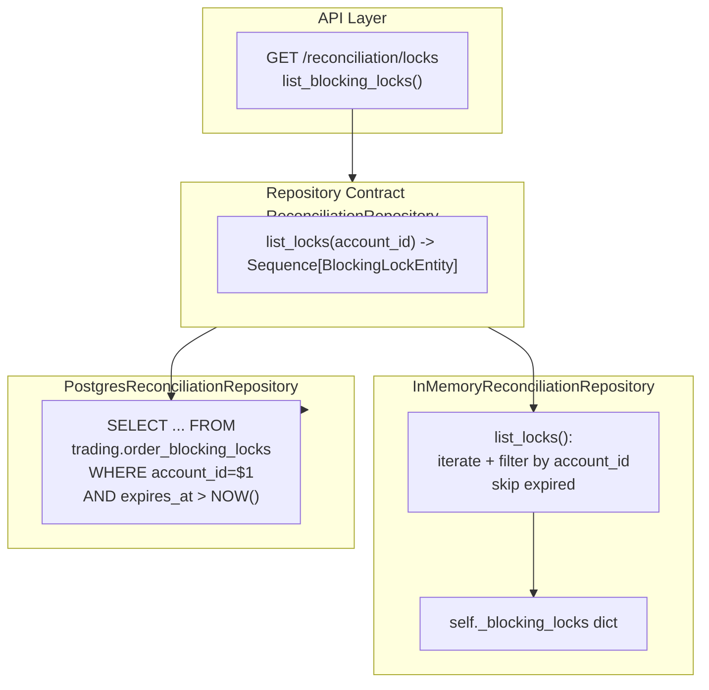

# Plan 44 — Postgres-backed Reconciliation Locks Inspection Support

> **목적**: `GET /reconciliation/locks`가 Postgres mode에서도 실제 `trading.order_blocking_locks` 테이블의 데이터를 반환하도록 한다. In-memory/Postgres 양쪽에서 repository contract를 통해 동등하게 동작하도록 정렬한다.

---

## Revision History

| Rev | 날짜 | 변경 내용 |
|-----|------|-----------|
| 1 | 2026-05-04 | 최초 작성 |

---

## 1. Why Now

- `GET /reconciliation/locks`는 현재 Postgres mode에서 **항상 `[]` 반환** — 운영 관측성에 구멍
- orders / audit_logs / reconciliation_runs는 Postgres-backed 조회가 완료
- reconciliation-first 시스템에서 lock 상태는 operator 핵심 신호
- Docker compose로 API 기동 환경이 안정화되어 있음

---

## 2. Current State Analysis

### 2.1 현재 `GET /reconciliation/locks` 동작

[`src/agent_trading/api/routes/reconciliation.py:51`](../src/agent_trading/api/routes/reconciliation.py:51)

```python
@router.get("/locks", response_model=list[BlockingLockStatus])
async def list_blocking_locks(...):
    repo = repos.reconciliations
    if hasattr(repo, "_blocking_locks"):
        # In-memory: iterate private dict
        ...
        return locks
    # Fallback for Postgres or unknown repos: return empty.
    return []  # ← Postgres mode에서 항상 여기 도달
```

문제:
- `hasattr(repo, "_blocking_locks")`로 in-memory 여부를 **덕타이핑** — 깨지기 쉬움
- Postgres fallback이 무조건 `[]` 반환
- `_blocking_locks`는 private attribute — route가 내부 구조에 의존

### 2.2 `order_blocking_locks` DDL

[`db/migrations/0005_add_order_tracing_and_locks.sql:36`](../db/migrations/0005_add_order_tracing_and_locks.sql:36)

```sql
CREATE TABLE trading.order_blocking_locks (
    lock_id             UUID PRIMARY KEY DEFAULT gen_random_uuid(),
    account_id          UUID NOT NULL REFERENCES trading.accounts (account_id),
    strategy_id         UUID,  -- nullable (0008 migration)
    symbol              VARCHAR(20) NOT NULL,
    side                VARCHAR(8) NOT NULL,
    reason              VARCHAR(255) NOT NULL,
    locked_by_run_id    UUID NOT NULL REFERENCES trading.reconciliation_runs,
    locked_at           TIMESTAMPTZ NOT NULL DEFAULT NOW(),
    expires_at          TIMESTAMPTZ NOT NULL DEFAULT NOW() + INTERVAL '30 minutes',

    CONSTRAINT uq_order_blocking_locks_key
        UNIQUE (account_id, strategy_id, symbol, side),
);
```

### 2.3 `ReconciliationRepository` contract — 현재

[`src/agent_trading/repositories/contracts.py:223`](../src/agent_trading/repositories/contracts.py:223)

`ReconciliationRepository` 프로토콜에는 **lock read method가 없음**. Lock write는 `InMemoryReconciliationRepository`에만 `acquire_lock` / `release_lock` / `is_locked`가 있고, `PostgresReconciliationRepository`에는 lock 관련 메서드가 **전혀 없음**.

Lock write는 [`ReconciliationService`](../src/agent_trading/services/reconciliation_service.py:123)에서 직접 SQL 실행:
```python
await self._repos.reconciliations._tx.connection.execute(
    "INSERT INTO trading.order_blocking_locks (...) VALUES (...) ON CONFLICT ... DO NOTHING",
    ...
)
```

`PostgresReconciliationRepository`는 `_tx`(TransactionManager)만 가지고 있고 lock 조회 메서드가 없음.

### 2.4 `InMemoryReconciliationRepository` — 현재 lock 저장 구조

[`src/agent_trading/repositories/memory.py:371`](../src/agent_trading/repositories/memory.py:371)

```python
# Key: (account_id, strategy_id, symbol, side)
# Value: {"reason": ..., "locked_by_run_id": ..., "expires_at": ...}
self._blocking_locks: dict[tuple, dict[str, object]] = {}
```

---

## 3. Proposed Architecture (변경 후)

### 3.1 전체 구조



### 3.2 핵심 설계 변경

| 항목 | 변경 전 | 변경 후 |
|------|--------|--------|
| Contract | `list_locks()` 없음 | `list_locks(account_id) -> Sequence[BlockingLockEntity]` 추가 |
| InMemory | `_blocking_locks` private dict를 route가 직접 접근 | `list_locks(account_id)` 메서드로 정규화 |
| Postgres | lock 조회 메서드 없음, 항상 `[]` | `list_locks(account_id)` SQL 구현 |
| Route | `hasattr` 덕타이핑 + `return []` fallback | `repos.reconciliations.list_locks(uid)` 호출 |
| Schema | `BlockingLockStatus`에 `lock_id`, `locked_at`, `is_active` 없음 | 필드 추가 |

### 3.3 `BlockingLockEntity` — 신규 Entity

```python
@dataclass(slots=True, frozen=True)
class BlockingLockEntity:
    lock_id: UUID
    account_id: UUID
    strategy_id: UUID | None = None
    symbol: str | None = None
    side: str | None = None
    reason: str = "reconciliation"
    locked_by_run_id: UUID | None = None
    locked_at: datetime | None = None
    expires_at: datetime | None = None
```

### 3.4 `list_locks(account_id)` contract

```python
async def list_locks(
    self, account_id: UUID
) -> Sequence[BlockingLockEntity]:
    """List non-expired blocking locks for an account.
    
    Only locks where ``expires_at > NOW()`` (or NULL) are returned.
    Sorted by ``locked_at`` descending (newest first).
    """
    ...
```

### 3.5 In-memory 구현

`InMemoryReconciliationRepository.list_locks()`:
1. `self._blocking_locks`를 iterate
2. `key[0] == account_id` 필터
3. `value["expires_at"] <= now()` → expired → skip (그리고 정리)
4. 남은 항목 → `BlockingLockEntity`로 변환
5. `locked_at` 내림차순 정렬

### 3.6 Postgres 구현

`PostgresReconciliationRepository.list_locks()`:
```sql
SELECT lock_id, account_id, strategy_id, symbol, side,
       reason, locked_by_run_id, locked_at, expires_at
FROM trading.order_blocking_locks
WHERE account_id = $1
  AND expires_at > NOW()
ORDER BY locked_at DESC
```

`row_to_entity()`를 사용하거나 직접 row→entity 변환.

### 3.7 Schema — `BlockingLockStatus` 확장

```python
class BlockingLockStatus(BaseModel):
    lock_id: str             # NEW
    account_id: str
    strategy_id: str | None = None
    symbol: str | None = None
    side: str | None = None
    reason: str
    locked_by_run_id: str
    locked_at: datetime      # NEW
    expires_at: datetime
    is_active: bool = True   # NEW — derived
```

### 3.8 Route 변경 — `list_blocking_locks()`

```python
@router.get("/locks", response_model=list[BlockingLockStatus])
async def list_blocking_locks(
    account_id: str = Query(..., description="Account ID (required)"),
    repos: RepositoryContainer = Depends(get_repos),
) -> list[BlockingLockStatus]:
    try:
        uid = UUID(account_id)
    except ValueError as exc:
        raise HTTPException(status_code=400, detail=f"Invalid UUID: {account_id}") from exc

    locks = await repos.reconciliations.list_locks(uid)
    now = datetime.now(timezone.utc)
    return [
        BlockingLockStatus(
            lock_id=str(lock.lock_id),
            account_id=str(lock.account_id),
            strategy_id=str(lock.strategy_id) if lock.strategy_id else None,
            symbol=lock.symbol,
            side=lock.side,
            reason=lock.reason,
            locked_by_run_id=str(lock.locked_by_run_id) if lock.locked_by_run_id else "",
            locked_at=lock.locked_at,
            expires_at=lock.expires_at,
            is_active=lock.expires_at is None or lock.expires_at > now,
        )
        for lock in locks
    ]
```

변경 사항:
- `hasattr(repo, "_blocking_locks")` 제거
- `repo._blocking_locks.items()` 접근 제거
- `return []` fallback 제거
- `list_locks(uid)` 호출로 통일

---

## 4. Changed Files Summary

### 4.1 변경 파일

| 파일 | 변경 내용 |
|------|----------|
| [`src/agent_trading/domain/entities.py`](../src/agent_trading/domain/entities.py) | `BlockingLockEntity` dataclass 추가 |
| [`src/agent_trading/repositories/contracts.py`](../src/agent_trading/repositories/contracts.py) | `ReconciliationRepository`에 `list_locks()` 추가 |
| [`src/agent_trading/repositories/memory.py`](../src/agent_trading/repositories/memory.py) | `InMemoryReconciliationRepository.list_locks()` 구현 |
| [`src/agent_trading/repositories/postgres/reconciliation.py`](../src/agent_trading/repositories/postgres/reconciliation.py) | `PostgresReconciliationRepository.list_locks()` 구현 |
| [`src/agent_trading/api/schemas.py`](../src/agent_trading/api/schemas.py) | `BlockingLockStatus`에 `lock_id`, `locked_at`, `is_active` 추가 |
| [`src/agent_trading/api/routes/reconciliation.py`](../src/agent_trading/api/routes/reconciliation.py) | `list_blocking_locks()` — `hasattr`/`_blocking_locks`/`return []` 제거, `list_locks()` 사용 |

### 4.2 변경 불필요 파일

| 파일 | 이유 |
|------|------|
| [`docker-compose.yml`](../docker-compose.yml) | API 서비스 변경 없음 |
| [`Makefile`](../Makefile) | 새 target 불필요 |
| [`src/agent_trading/api/deps.py`](../src/agent_trading/api/deps.py) | repos DI 구조 변경 없음 |
| [`src/agent_trading/services/reconciliation_service.py`](../src/agent_trading/services/reconciliation_service.py) | lock write semantics 변경 없음 |

---

## 5. Test Strategy

### 5.1 Layer A: In-memory Regression (기존 + 신규)

#### 기존 테스트 — 변경 없음
- `tests/api/test_inspection.py::TestReconciliation::test_list_reconciliation_runs`
- `tests/api/test_inspection.py::TestReconciliation::test_list_reconciliation_runs_missing_param`

#### 신규 테스트 — `tests/api/test_inspection.py`

```python
class TestReconciliation:
    # ... 기존 테스트 유지 ...

    def test_list_locks_empty(self, client: TestClient) -> None:
        """``GET /reconciliation/locks`` returns empty list when no locks exist."""
        # Get an account_id that has no locks
        orders_resp = client.get("/orders")
        orders = orders_resp.json()
        assert len(orders) >= 1
        acct_id = orders[0]["account_id"]
        
        response = client.get(f"/reconciliation/locks?account_id={acct_id}")
        assert response.status_code == 200
        assert response.json() == []

    def test_list_locks_missing_param(self, client: TestClient) -> None:
        """``GET /reconciliation/locks`` returns 422 without account_id."""
        response = client.get("/reconciliation/locks")
        assert response.status_code == 422

    def test_list_locks_with_lock(self, client: TestClient) -> None:
        """``GET /reconciliation/locks`` returns lock when one exists."""
        import asyncio
        from uuid import uuid4
        
        # Get account_id from orders fixture
        orders_resp = client.get("/orders")
        orders = orders_resp.json()
        assert len(orders) >= 1
        acct_id = orders[0]["account_id"]
        
        # Manually acquire a lock via the repos (they're shared with the app)
        # via the seeded_repos fixture
        ...
```

Wait, the TestClient doesn't expose the repos directly. I need to think about how to seed locks in the test.

Looking at `tests/api/conftest.py`, the `seeded_repos` fixture returns `RepositoryContainer`. The `client` fixture creates the app with those repos. So the lock data needs to be seeded in `seeded_repos` itself.

Let me re-design:

```python
# In conftest.py — seed a lock after seeding other data
from agent_trading.domain.entities import BlockingLockEntity

# Seed: blocking lock
lock = BlockingLockEntity(
    lock_id=uuid4(),
    account_id=account_id,
    strategy_id=strategy_id,
    symbol="AAPL",
    side="buy",
    reason="reconciliation",
    locked_by_run_id=uuid4(),
    locked_at=datetime.now(timezone.utc),
    expires_at=datetime.now(timezone.utc) + timedelta(minutes=30),
)
repos.reconciliations.acquire_lock(
    account_id=lock.account_id,
    strategy_id=lock.strategy_id,
    symbol=lock.symbol,
    side=lock.side,
    reason=lock.reason,
    locked_by_run_id=lock.locked_by_run_id,
    expires_at=lock.expires_at,
)
```

Actually wait - `acquire_lock` is how the in-memory repo creates locks, but the entity itself doesn't exist yet. Let me think...

The in-memory repo's `_blocking_locks` dict doesn't store full entities — it stores raw dicts with `reason`, `locked_by_run_id`, `expires_at`. The key tuple `(account_id, strategy_id, symbol, side)` encodes the remaining fields.

For `list_locks()` I'll build `BlockingLockEntity` from this structure by reconstructing from the key tuple and value dict.

For seeding in the test fixture, I'll call `acquire_lock()` on the in-memory repo (which is fine since it's a sync method).

Let me reconsider the test approach:

#### 5.1 In-memory API tests

**conftest.py** 변경:
- `seeded_repos` fixture에 lock seeding 추가:
  ```python
  repos.reconciliations.acquire_lock(
      account_id=account_id,
      strategy_id=strategy_id,
      symbol="AAPL",
      side="buy",
      reason="reconciliation",
      locked_by_run_id=uuid4(),
      expires_at=datetime.now(timezone.utc) + timedelta(minutes=30),
  )
  ```

**test_inspection.py** 변경:
- `TestReconciliation` class에 3개 테스트 추가:
  - `test_list_locks_empty` — 다른 account_id로 조회 (lock 없음 → `[]`)
  - `test_list_locks_with_lock` — seeded lock 조회 (1개 반환)
  - `test_list_locks_missing_param` — 422

#### 5.2 Postgres API tests

**test_postgres_inspection.py** 변경:
- `TestPostgresInspectionAPI` class에 1개 테스트 추가:
  - `test_list_locks_requires_param` — 422 (기존 패턴과 동일)

**Postgres에서 lock 생성 테스트**는 repository-level 테스트로 처리.

#### 5.3 Repository-level Postgres lock test

신규 파일: [`tests/repositories/test_postgres_blocking_locks.py`](../tests/repositories/test_postgres_blocking_locks.py)

- `test_list_locks_empty` — clean DB → `[]`
- `test_list_locks_with_lock` — INSERT lock → list_locks → 1개 반환, 필드 확인
- `test_list_locks_expired` — expired lock → `[]`
- `test_list_locks_account_filter` — 다른 account lock은 반환 안 됨

---

## 6. Execution Steps

### Step 1: `entities.py` — `BlockingLockEntity` dataclass 추가

`BlockingLockEntity` 추가 (DML 관련 필드 없이 read-only 용도).

### Step 2: `contracts.py` — `list_locks()` 추가

`ReconciliationRepository` 프로토콜에 `list_locks(account_id)` 메서드 추가.

### Step 3: `memory.py` — `list_locks()` 구현

`InMemoryReconciliationRepository`에 `list_locks()` 구현.

### Step 4: `postgres/reconciliation.py` — `list_locks()` 구현

`PostgresReconciliationRepository`에 `list_locks()` 구현.

### Step 5: `schemas.py` — `BlockingLockStatus` 확장

`lock_id`, `locked_at`, `is_active` 필드 추가.

### Step 6: `routes/reconciliation.py` — route 개선

`list_blocking_locks()`를 `repos.reconciliations.list_locks(uid)`로 변경, fallback 제거.

### Step 7: Test fixtures 업데이트

`tests/api/conftest.py` — `seeded_repos`에 lock seeding 추가.

### Step 8: In-memory API tests 추가

`tests/api/test_inspection.py` — lock 관련 3개 테스트 추가.

### Step 9: Postgres API tests 추가

`tests/api/test_postgres_inspection.py` — lock 422 테스트 추가.

### Step 10: Repository-level Postgres lock test

`tests/repositories/test_postgres_blocking_locks.py` — 신규, 4개 테스트.

### Step 11: API 서버 수동 검증

```bash
# 기존 API 테스트 회귀 확인
docker compose exec app python -m pytest tests/api/ -v

# Postgres API 테스트
docker compose exec app python -m pytest tests/api/test_postgres_inspection.py -v

# Repository-level Postgres lock test
docker compose exec app python -m pytest tests/repositories/test_postgres_blocking_locks.py -v
```

### Step 12: curl 검증 (Docker)

```bash
# In-memory mode
make run-api &
# 다른 터미널에서:
curl -s "http://localhost:8000/reconciliation/locks?account_id=00000000-0000-0000-0000-000000000000"

# Postgres mode (Docker)
curl -s "http://localhost:8000/reconciliation/locks?account_id=00000000-0000-0000-0000-000000000000"
```

### Step 13: 문서 업데이트

- `plans/README.md` — Plan 44 항목 추가

---

## 7. Completion Criteria

1. `GET /reconciliation/locks`가 in-memory mode에서 seeded lock 반환
2. `GET /reconciliation/locks`가 Postgres mode에서 실제 DB lock 반환 (더 이상 `[]` 아님)
3. `account_id` 누락 시 422 반환
4. expired lock은 결과에서 제외
5. 기존 in-memory API 테스트 회귀 없음
6. Postgres-backed API 테스트 회귀 없음
7. Swagger UI에서 lock endpoint 정상 동작 확인

---

## 8. Risk Assessment

| 리스크 | 영향 | 완화 |
|--------|------|------|
| `BlockingLockEntity`가 너무 무거움 | 코드 복잡도 증가 | 최소 필드만 포함, frozen dataclass |
| Postgres `row_to_entity()`가 lock 테이블과 호환되지 않음 | 변환 실패 | 직접 dict→entity 변환 사용 |
| 기존 `_blocking_locks` private attribute 접근 제거로 인한 회귀 | in-memory 테스트 실패 | route 변경 후 테스트 전면 실행 |

---

## 9. Follow-up Items

1. `ReconciliationService.acquire_blocking_lock()`가 repo를 통하지 않고 직접 SQL 실행 — 향후 repository로 이동 고려
2. Lock 해제 시 `resolved_at` 필드가 DDL에 없음 — 필요 시 migration 추가
3. `GET /reconciliation/locks`에 `include_expired` 파라미터 추가 고려
