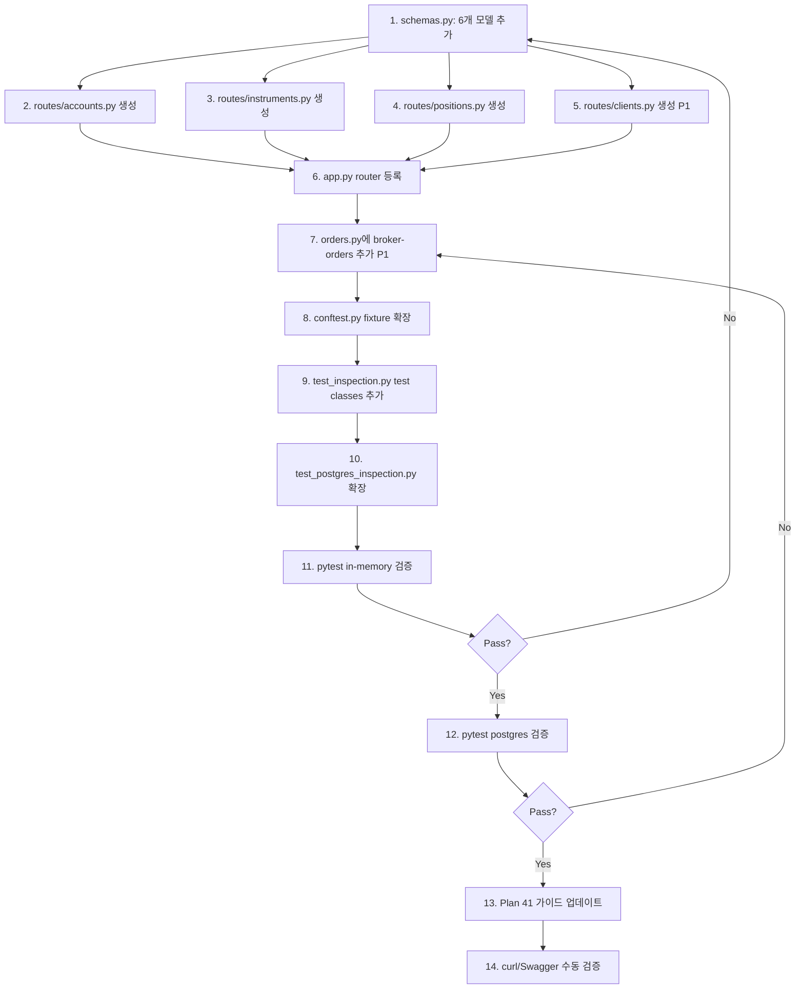

# Plan 45 — Inspection API Phase 2: Endpoint Expansion

## Revision History

| Date | Version | Description |
|------|---------|-------------|
| 2026-05-04 | 1.0 | Initial design — P0/P1 endpoints, response models, test plan |
| 2026-05-04 | 1.1 | Approved by user with 4 implementation notes |

## 1. Why Now

Phase 1 (Plan 40) delivered 9 read-only endpoints focused on orders, audit logs, reconciliation, and decisions. Phase 2 (Plan 42, 43, 44) added Postgres-backed mode, containerization, and reconciliation lock inspection.

운영자는 현재 Swagger UI에서 주문/감사/재조정/의사결정 상태는 볼 수 있지만, **accounts, clients, instruments, positions, cash-balances, broker-orders** 는 조회 수단이 없다. 이번 Phase 2는 **기존에 이미 구현된 repository read path를 최대한 활용**하여 이 gap을 메운다.

**핵심 원칙:** 새로운 repository method를 최소로 추가하고, 기존 read contract만으로 endpoint를 노출한다.

---

## 2. Repository Read Path 현황 (분석 완료)

각 candidate endpoint에 대해 현재 contract에 존재하는 read method를 매핑했다.

| Endpoint | Repository Method | Contract Line | Memory Line | Postgres Line |
|----------|------------------|---------------|-------------|---------------|
| `GET /accounts?client_id=...` | `AccountRepository.list_by_client(client_id)` | [`contracts.py:73`](../src/agent_trading/repositories/contracts.py#73) | [`memory.py:83`](../src/agent_trading/repositories/memory.py#83) | [`accounts.py:80`](../src/agent_trading/repositories/postgres/accounts.py#80) |
| `GET /accounts/{id}` | `AccountRepository.get(account_id)` | [`contracts.py:67`](../src/agent_trading/repositories/contracts.py#67) | [`memory.py:67`](../src/agent_trading/repositories/memory.py#67) | [`accounts.py:44`](../src/agent_trading/repositories/postgres/accounts.py#44) |
| `GET /clients/{id}` | `ClientRepository.get(client_id)` | [`contracts.py:37`](../src/agent_trading/repositories/contracts.py#37) | [`memory.py:52`](../src/agent_trading/repositories/memory.py#52) | [`clients.py:38`](../src/agent_trading/repositories/postgres/clients.py#38) |
| `GET /instruments/{id}` | `InstrumentRepository.get(instrument_id)` | [`contracts.py:126`](../src/agent_trading/repositories/contracts.py#126) | [`memory.py:168`](../src/agent_trading/repositories/memory.py#168) | [`instruments.py:44`](../src/agent_trading/repositories/postgres/instruments.py#44) |
| `GET /positions?account_id=...` | `PositionSnapshotRepository.list_latest_by_account(account_id)` | [`contracts.py:154`](../src/agent_trading/repositories/contracts.py#154) | [`memory.py:225`](../src/agent_trading/repositories/memory.py#225) | [`position_snapshots.py:55`](../src/agent_trading/repositories/postgres/position_snapshots.py#55) |
| `GET /cash-balances?account_id=...` | `CashBalanceSnapshotRepository.get_latest_by_account(account_id)` | [`contracts.py:165`](../src/agent_trading/repositories/contracts.py#165) | [`memory.py:242`](../src/agent_trading/repositories/memory.py#242) | [`cash_balance_snapshots.py:53`](../src/agent_trading/repositories/postgres/cash_balance_snapshots.py#53) |
| `GET /orders/{id}/broker-orders` | `BrokerOrderRepository.list_by_order_request(order_request_id)` | [`contracts.py:212`](../src/agent_trading/repositories/contracts.py#212) | [`memory.py:348`](../src/agent_trading/repositories/memory.py#348) | [`broker_orders.py:59`](../src/agent_trading/repositories/postgres/broker_orders.py#59) |

### 2.1 Missing Read Methods (Contract 변경 불필요 — 우회 설계)

| 부재 method | 영향받는 endpoint | 우회 설계 |
|-------------|-------------------|-----------|
| `AccountRepository.list()` (generic) | `GET /accounts` (no filter) | `client_id` **required** query param 사용 → `list_by_client()` 호출 |
| `ClientRepository.list()` (generic) | `GET /clients` (list all) | P2로 defer — 단일 조회만 노출 |
| `InstrumentRepository.list()` (generic) | `GET /instruments` (list all) | P2로 defer — 단일 조회만 노출 |

→ **P0/P1 범위 내에서는 contract 변경이 전혀 필요 없다.**

### 2.2 `list_latest_by_account()` 동작 참고

`PositionSnapshotRepository.list_latest_by_account(account_id)`는 이름과 달리 **account의 모든 position snapshot row**를 `snapshot_at DESC` 정렬로 반환한다 (단일 "latest per instrument" 아님).  
→ Endpoint 응답에는 이 점을 명시하고, 운영자는 snapshot_at 필드로 최신 상태를 식별한다.

---

## 3. Priority 정의

### P0 (필수 — 이번 구현)

| # | Endpoint | HTTP Method | Query Params | Description |
|---|----------|-------------|--------------|-------------|
| 1 | `/accounts` | GET | `client_id` (required, UUID) | 특정 client의 모든 account 목록 |
| 2 | `/accounts/{account_id}` | GET | — | 단일 account 상세 조회 |
| 3 | `/instruments/{instrument_id}` | GET | — | 단일 instrument 상세 조회 |
| 4 | `/positions` | GET | `account_id` (required, UUID) | 특정 account의 position snapshot 목록 |
| 5 | `/cash-balances` | GET | `account_id` (required, UUID) | 특정 account의 최신 cash balance snapshot |

### P1 (차순위 — 가능하면 포함)

| # | Endpoint | HTTP Method | Query Params | Description |
|---|----------|-------------|--------------|-------------|
| 6 | `/clients/{client_id}` | GET | — | 단일 client 상세 조회 |
| 7 | `/orders/{order_request_id}/broker-orders` | GET | — | 특정 order에 연결된 broker order 목록 |

### P2 (Defer — 이번 범위 밖)

| Endpoint | Reason |
|----------|--------|
| `GET /clients` (list) | Contract에 `list()` 없음 — 새 method 추가 필요 |
| `GET /instruments` (list) | Contract에 `list()` 없음 — 새 method 추가 필요 |
| `GET /accounts` (no filter) | Contract에 `list()` 없음 |
| `GET /positions/{id}` | 단일 조회 use-case 불명확 |
| `GET /cash-balances/{id}` | 단일 조회 use-case 불명확 |

---

## 4. Response Model 설계

### 4.1 `AccountSummary` — [`schemas.py`](../src/agent_trading/api/schemas.py) 신규

```python
class AccountSummary(BaseModel):
    model_config = ConfigDict(from_attributes=True)

    account_id: str          # UUID
    client_id: str           # UUID
    broker_account_id: str   # UUID
    account_alias: str | None
    account_masked: str | None
    environment: str         # Enum → str
    status: str
    risk_profile: str | None
    created_at: datetime
    updated_at: datetime | None
```

> `AccountEntity`의 모든 public field를 포함.  
> `AccountDetail`은 불필요 — `AccountEntity`에 joining 관계가 없으므로 summary와 detail이 동일.

### 4.2 `ClientDetail` — [`schemas.py`](../src/agent_trading/api/schemas.py) 신규

```python
class ClientDetail(BaseModel):
    model_config = ConfigDict(from_attributes=True)

    client_id: str
    client_code: str
    name: str
    status: str
    base_currency: str
    created_at: datetime
    updated_at: datetime | None
```

### 4.3 `InstrumentDetail` — [`schemas.py`](../src/agent_trading/api/schemas.py) 신규

```python
class InstrumentDetail(BaseModel):
    model_config = ConfigDict(from_attributes=True)

    instrument_id: str
    symbol: str
    market_code: str
    asset_class: str
    currency: str
    name: str
    tick_size: float | None
    lot_size: float | None
    is_active: bool
    created_at: datetime
    updated_at: datetime | None
```

### 4.4 `PositionSnapshotView` — [`schemas.py`](../src/agent_trading/api/schemas.py) 신규

```python
class PositionSnapshotView(BaseModel):
    model_config = ConfigDict(from_attributes=True)

    position_snapshot_id: str
    account_id: str
    instrument_id: str
    quantity: float
    average_price: float
    market_price: float
    unrealized_pnl: float | None
    source_of_truth: str
    snapshot_at: datetime
    created_at: datetime
```

### 4.5 `CashBalanceSnapshotView` — [`schemas.py`](../src/agent_trading/api/schemas.py) 신규

```python
class CashBalanceSnapshotView(BaseModel):
    model_config = ConfigDict(from_attributes=True)

    cash_balance_snapshot_id: str
    account_id: str
    currency: str
    available_cash: float
    settled_cash: float
    unsettled_cash: float
    source_of_truth: str
    snapshot_at: datetime
    created_at: datetime
```

### 4.6 `BrokerOrderView` — [`schemas.py`](../src/agent_trading/api/schemas.py) 신규

```python
class BrokerOrderView(BaseModel):
    model_config = ConfigDict(from_attributes=True)

    broker_order_id: str
    order_request_id: str
    broker_name: str
    broker_status: str
    broker_native_order_id: str | None
    request_payload_uri: str | None
    response_payload_uri: str | None
    last_synced_at: datetime | None
    created_at: datetime
    updated_at: datetime | None
```

---

## 5. Route 파일 설계

Phase 1의 패턴을 따라 **도메인별 1 route file** 원칙을 유지한다.

### 5.1 [`routes/accounts.py`](../src/agent_trading/api/routes/accounts.py) — 신규

```python
"""Account inspection endpoints: ``GET /accounts``, ``GET /accounts/{id}``."""

from fastapi import APIRouter, Depends, HTTPException, Query
from uuid import UUID

from agent_trading.api.deps import get_repos
from agent_trading.api.schemas import AccountSummary
from agent_trading.repositories.container import RepositoryContainer

router = APIRouter(tags=["accounts"])


@router.get("/accounts", response_model=list[AccountSummary])
async def list_accounts(
    client_id: str = Query(..., description="Client UUID"),
    repos: RepositoryContainer = Depends(get_repos),
) -> list[AccountSummary]:
    try:
        cid = UUID(client_id)
    except ValueError:
        raise HTTPException(status_code=400, detail="Invalid client_id UUID")

    accounts = await repos.accounts.list_by_client(cid)
    return [AccountSummary.model_validate(a) for a in accounts]


@router.get("/accounts/{account_id}", response_model=AccountSummary)
async def get_account(
    account_id: str,
    repos: RepositoryContainer = Depends(get_repos),
) -> AccountSummary:
    try:
        aid = UUID(account_id)
    except ValueError:
        raise HTTPException(status_code=400, detail="Invalid account_id UUID")

    account = await repos.accounts.get(aid)
    if account is None:
        raise HTTPException(status_code=404, detail="Account not found")
    return AccountSummary.model_validate(account)
```

### 5.2 [`routes/clients.py`](../src/agent_trading/api/routes/clients.py) — 신규 (P1)

```python
"""Client inspection endpoints: ``GET /clients/{id}``."""

from fastapi import APIRouter, Depends, HTTPException
from uuid import UUID

from agent_trading.api.deps import get_repos
from agent_trading.api.schemas import ClientDetail
from agent_trading.repositories.container import RepositoryContainer

router = APIRouter(tags=["clients"])


@router.get("/clients/{client_id}", response_model=ClientDetail)
async def get_client(
    client_id: str,
    repos: RepositoryContainer = Depends(get_repos),
) -> ClientDetail:
    try:
        cid = UUID(client_id)
    except ValueError:
        raise HTTPException(status_code=400, detail="Invalid client_id UUID")

    client = await repos.clients.get(cid)
    if client is None:
        raise HTTPException(status_code=404, detail="Client not found")
    return ClientDetail.model_validate(client)
```

### 5.3 [`routes/instruments.py`](../src/agent_trading/api/routes/instruments.py) — 신규 (P0)

```python
"""Instrument inspection endpoints: ``GET /instruments/{id}``."""

from fastapi import APIRouter, Depends, HTTPException
from uuid import UUID

from agent_trading.api.deps import get_repos
from agent_trading.api.schemas import InstrumentDetail
from agent_trading.repositories.container import RepositoryContainer

router = APIRouter(tags=["instruments"])


@router.get("/instruments/{instrument_id}", response_model=InstrumentDetail)
async def get_instrument(
    instrument_id: str,
    repos: RepositoryContainer = Depends(get_repos),
) -> InstrumentDetail:
    try:
        iid = UUID(instrument_id)
    except ValueError:
        raise HTTPException(status_code=400, detail="Invalid instrument_id UUID")

    instrument = await repos.instruments.get(iid)
    if instrument is None:
        raise HTTPException(status_code=404, detail="Instrument not found")
    return InstrumentDetail.model_validate(instrument)
```

### 5.4 [`routes/positions.py`](../src/agent_trading/api/routes/positions.py) — 신규 (P0)

```python
"""Position/cash-balance inspection endpoints.

``GET /positions``, ``GET /cash-balances``
"""

from fastapi import APIRouter, Depends, HTTPException, Query
from uuid import UUID

from agent_trading.api.deps import get_repos
from agent_trading.api.schemas import PositionSnapshotView, CashBalanceSnapshotView
from agent_trading.repositories.container import RepositoryContainer

router = APIRouter(tags=["positions"])


@router.get("/positions", response_model=list[PositionSnapshotView])
async def list_positions(
    account_id: str = Query(..., description="Account UUID"),
    repos: RepositoryContainer = Depends(get_repos),
) -> list[PositionSnapshotView]:
    try:
        aid = UUID(account_id)
    except ValueError:
        raise HTTPException(status_code=400, detail="Invalid account_id UUID")

    snapshots = await repos.position_snapshots.list_latest_by_account(aid)
    return [PositionSnapshotView.model_validate(s) for s in snapshots]


@router.get("/cash-balances", response_model=CashBalanceSnapshotView | None)
async def get_cash_balance(
    account_id: str = Query(..., description="Account UUID"),
    repos: RepositoryContainer = Depends(get_repos),
) -> CashBalanceSnapshotView | None:
    try:
        aid = UUID(account_id)
    except ValueError:
        raise HTTPException(status_code=400, detail="Invalid account_id UUID")

    snapshot = await repos.cash_balance_snapshots.get_latest_by_account(aid)
    if snapshot is None:
        # 404보다 None 반환 — cash balance가 없는 것은 정상 상태일 수 있음
        return None
    return CashBalanceSnapshotView.model_validate(snapshot)
```

> `GET /cash-balances`는 `None` 반환 허용 (404 아님) — account에 snapshot이 없는 것은 정상 상태.

### 5.5 `GET /orders/{id}/broker-orders` — 기존 [`routes/orders.py`](../src/agent_trading/api/routes/orders.py)에 추가 (P1)

```python
@router.get("/{order_request_id}/broker-orders", response_model=list[BrokerOrderView])
async def get_broker_orders(
    order_request_id: str,
    repos: RepositoryContainer = Depends(get_repos),
) -> list[BrokerOrderView]:
    try:
        oid = UUID(order_request_id)
    except ValueError:
        raise HTTPException(status_code=400, detail="Invalid order_request_id UUID")

    # First verify the order exists
    order = await repos.orders.get(oid)
    if order is None:
        raise HTTPException(status_code=404, detail="Order not found")

    broker_orders = await repos.broker_orders.list_by_order_request(oid)
    return [BrokerOrderView.model_validate(bo) for bo in broker_orders]
```

---

## 6. `app.py` 변경 사항

[`app.py`](../src/agent_trading/api/app.py#L80-L104)의 `create_app()`에 신규 router를 등록한다.

```python
# 기존 import 아래에 추가
from agent_trading.api.routes.accounts import router as accounts_router
from agent_trading.api.routes.instruments import router as instruments_router
from agent_trading.api.routes.positions import router as positions_router

# P1
from agent_trading.api.routes.clients import router as clients_router

# 기존 include_router 아래에 추가
app.include_router(accounts_router)
app.include_router(instruments_router)
app.include_router(positions_router)

# P1
app.include_router(clients_router)
```

**Description 업데이트:**

```python
description=(
    "Read-only inspection API for the AI Multi-Agent Trading System. "
    "Phase 2 — accounts, clients, instruments, positions, cash-balances, and broker-orders."
),
```

---

## 7. `schemas.py` 변경 사항

기존 모델 아래에 6개 신규 모델을 추가한다.  
[`schemas.py`](../src/agent_trading/api/schemas.py)의 `TradeDecisionDetail` (line 128-142) 이후에 추가.

---

## 8. 테스트 계획

### 8.1 In-Memory 테스트 — [`test_inspection.py`](../tests/api/test_inspection.py)

**Fixture 변경** — [`conftest.py`](../tests/api/conftest.py)의 `seeded_repos`에 추가:

```python
# 추가 fixture: position_snapshot_id, broker_order_id
@pytest.fixture
def position_snapshot_id() -> UUID:
    return uuid4()

@pytest.fixture
def broker_order_id() -> UUID:
    return uuid4()

# seeded_repos에 추가 seeding
# Seed: position snapshot
await repos.position_snapshots.add(
    PositionSnapshotEntity(
        position_snapshot_id=position_snapshot_id,
        account_id=account_id,
        instrument_id=instrument_id,
        quantity=Decimal("100"),
        average_price=Decimal("150.00"),
        market_price=Decimal("155.00"),
        unrealized_pnl=Decimal("500.00"),
        source_of_truth="broker",
        snapshot_at=datetime.now(timezone.utc),
        created_at=datetime.now(timezone.utc),
    )
)

# Seed: cash balance snapshot
await repos.cash_balance_snapshots.add(
    CashBalanceSnapshotEntity(
        cash_balance_snapshot_id=uuid4(),
        account_id=account_id,
        currency="KRW",
        available_cash=Decimal("1000000"),
        settled_cash=Decimal("1000000"),
        unsettled_cash=Decimal("0"),
        source_of_truth="broker",
        snapshot_at=datetime.now(timezone.utc),
        created_at=datetime.now(timezone.utc),
    )
)

# Seed: broker order
await repos.broker_orders.add(
    BrokerOrderEntity(
        broker_order_id=broker_order_id,
        order_request_id=order.order_request_id,
        broker_name="KIS",
        broker_status="filled",
        broker_native_order_id="KIS-12345",
        last_synced_at=datetime.now(timezone.utc),
        created_at=datetime.now(timezone.utc),
    )
)
```

**신규 Test Classes** — [`test_inspection.py`](../tests/api/test_inspection.py)에 추가:

#### `TestAccounts`

| Test Name | Description |
|-----------|-------------|
| `test_list_accounts` | `GET /accounts?client_id=...` → 200 + seeded account 포함 |
| `test_list_accounts_missing_param` | `GET /accounts` (no client_id) → 422 |
| `test_list_accounts_invalid_uuid` | `GET /accounts?client_id=invalid` → 400 |
| `test_get_account_by_id` | `GET /accounts/{seeded_id}` → 200 |
| `test_get_account_not_found` | `GET /accounts/{unknown_uuid}` → 404 |
| `test_get_account_invalid_uuid` | `GET /accounts/invalid` → 400 |

#### `TestInstruments`

| Test Name | Description |
|-----------|-------------|
| `test_get_instrument_by_id` | `GET /instruments/{seeded_id}` → 200 |
| `test_get_instrument_not_found` | `GET /instruments/{unknown_uuid}` → 404 |
| `test_get_instrument_invalid_uuid` | `GET /instruments/invalid` → 400 |

#### `TestPositions`

| Test Name | Description |
|-----------|-------------|
| `test_list_positions` | `GET /positions?account_id=...` → 200 + seeded position 포함 |
| `test_list_positions_missing_param` | `GET /positions` (no account_id) → 422 |
| `test_list_positions_invalid_uuid` | `GET /positions?account_id=invalid` → 400 |
| `test_list_positions_empty` | `GET /positions?account_id={unknown_uuid}` → 200 [] |
| `test_get_cash_balance` | `GET /cash-balances?account_id=...` → 200 |
| `test_get_cash_balance_missing_param` | `GET /cash-balances` (no account_id) → 422 |
| `test_get_cash_balance_empty` | `GET /cash-balances?account_id={unknown_uuid}` → 200 null |

#### P1: `TestClients` (선택)

| Test Name | Description |
|-----------|-------------|
| `test_get_client_by_id` | `GET /clients/{seeded_id}` → 200 |
| `test_get_client_not_found` | `GET /clients/{unknown_uuid}` → 404 |
| `test_get_client_invalid_uuid` | `GET /clients/invalid` → 400 |

#### P1: Orders에 broker-orders 추가

| Test Name | Description |
|-----------|-------------|
| `test_get_broker_orders` | `GET /orders/{seeded_order_id}/broker-orders` → 200 |
| `test_get_broker_orders_not_found` | `GET /orders/{unknown_uuid}/broker-orders` → 404 |
| `test_get_broker_orders_invalid_uuid` | `GET /orders/invalid/broker-orders` → 400 |

### 8.2 Postgres 테스트 — [`test_postgres_inspection.py`](../tests/api/test_postgres_inspection.py)

`TestPostgresInspectionAPI` class에 대표 경로만 추가 (Phase 1 패턴과 동일, in-memory에서 상세 검증):

```python
async def test_account_by_id(self, postgres_client: TestClient) -> None:
    """``GET /accounts/{id}`` returns account from Postgres."""
    conn = await asyncpg.connect(...)
    try:
        # Insert test data
        ...
        response = postgres_client.get(f"/accounts/{account_id}")
        assert response.status_code == 200
        data = response.json()
        assert data["account_alias"] == "PG-ACCT-001"
    finally:
        await conn.close()

async def test_instrument_by_id(self, postgres_client: TestClient) -> None:
    """``GET /instruments/{id}`` returns instrument from Postgres."""
    ...

async def test_positions_by_account(self, postgres_client: TestClient) -> None:
    """``GET /positions?account_id=...`` returns positions from Postgres."""
    ...
```

---

## 9. 변경 파일 요약

| File | Action | Description |
|------|--------|-------------|
| `src/agent_trading/api/schemas.py` | **수정** | 6개 신규 Pydantic model 추가 |
| `src/agent_trading/api/routes/accounts.py` | **생성** | `GET /accounts`, `GET /accounts/{id}` |
| `src/agent_trading/api/routes/clients.py` | **생성** (P1) | `GET /clients/{id}` |
| `src/agent_trading/api/routes/instruments.py` | **생성** | `GET /instruments/{id}` |
| `src/agent_trading/api/routes/positions.py` | **생성** | `GET /positions`, `GET /cash-balances` |
| `src/agent_trading/api/routes/orders.py` | **수정** | `GET /{id}/broker-orders` 추가 (P1) |
| `src/agent_trading/api/app.py` | **수정** | Router 등록 + description 업데이트 |
| `tests/api/conftest.py` | **수정** | position_snapshot, cash_balance_snapshot, broker_order seeding 추가 |
| `tests/api/test_inspection.py` | **수정** | TestAccounts, TestInstruments, TestPositions, TestClients, broker-orders tests 추가 |
| `tests/api/test_postgres_inspection.py` | **수정** | Postgres 대표 경로 테스트 추가 |
| `plans/41_inspection_api_manual_verification.md` | **수정** | Phase 2 endpoint 가이드 추가 |
| `docker-compose.yml` | **변경 없음** | — |
| `src/agent_trading/repositories/contracts.py` | **변경 없음** | — |

---

## 10. 검증 포인트

| # | 검증 | 방법 |
|---|------|------|
| 1 | In-memory mode: 모든 신규 endpoint 응답 | `pytest tests/api/test_inspection.py -v` |
| 2 | Postgres mode: 대표 경로 응답 | `pytest tests/api/test_postgres_inspection.py -v` |
| 3 | 기존 Phase 1 endpoint regression 없음 | 동일 test suite로 확인 |
| 4 | Swagger UI에 신규 endpoint 표시 | `make run-api` 후 `/docs` 접속 |
| 5 | `GET /cash-balances` empty → 200 null (not 404) | 의도한 동작 확인 |

---

## 11. 실행 순서



---

## 12. Reviewer's Implementation Notes (2026-05-04)

Plan 45 approved with the following implementation notes:

1. **`GET /cash-balances` 200 null semantics** — Swagger docstring에 `None` 반환 의도를 명확히 기록할 것
2. **`GET /positions` 설명 명확화** — live state가 아닌 latest snapshot list임을 route description에 명시
3. **Postgres 대표 경로에 `cash-balances` 포함** — null/non-null semantics를 Postgres 계층에서도 검증
4. **`broker-orders` 최소 필드만 노출** — inspection 목적에 맞게 필드 선별 (현재 `BrokerOrderView` 설계 적절)

---

## 13. Risk Assessment

| Risk | Impact | Likelihood | Mitigation |
|------|--------|------------|------------|
| `list_latest_by_account()`가 예상보다 많은 row 반환 | Low | Medium | 응답 필드에 `snapshot_at` 포함 — 운영자가 최신 식별 가능 |
| Postgres 테스트에 DATABASE_* env var 필요 | Low | Low (CI) | `@pytest.mark.skipif` guard — 기존 패턴과 동일 |
| Account/Client/instrument에 `metadata` dict 필드 누락 | Low | Low | `AccountEntity`/`ClientEntity`에는 metadata 없음. `InstrumentEntity.metadata`는 JSONB — Phase 2에서는 생략 (inspection 목적 외) |
| P1/P0 동시 구현 시 merge conflict | Low | Medium | 순차 실행으로 해소 |
