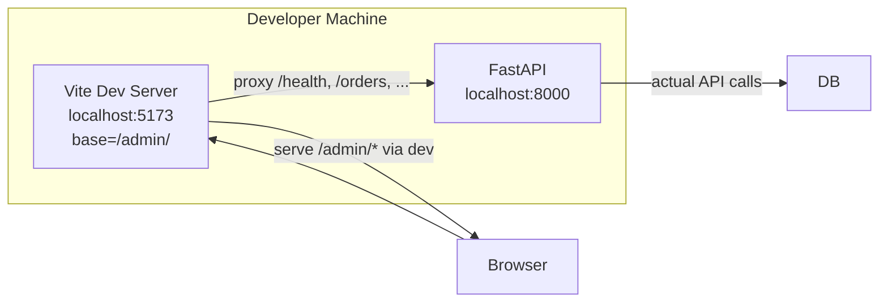
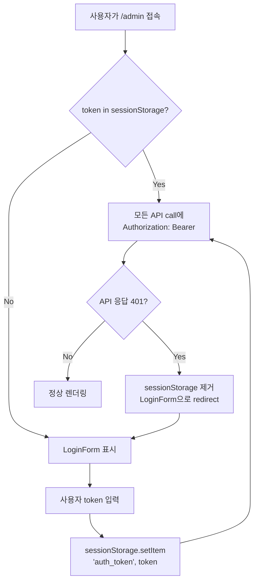

# Plan 48 — Admin UI Phase 1 (Read-Only Operations Dashboard)

## Revision History

| Rev | Date | Author | 변경 내용 |
|-----|------|--------|-----------|
| 1 | 2026-05-05 | Roo (Architect) | 초안 작성 |

## 목차

1. [Why Now](#1-why-now)
2. [현황 분석](#2-현황-분석)
3. [프론트엔드 스택 선정](#3-프론트엔드-스택-선정)
4. [디렉토리 구조 및 구성](#4-디렉토리-구조-및-구성)
5. [FastAPI Static Serving 구성](#5-fastapi-static-serving-구성)
6. [Token 처리 정책](#6-token-처리-정책)
7. [Phase 1 화면 설계](#7-phase-1-화면-설계)
8. [Backend API 변경 사항](#8-backend-api-변경-사항)
9. [테스트 전략](#9-테스트-전략)
10. [변경 파일 요약](#10-변경-파일-요약)
11. [실행 순서](#11-실행-순서)
12. [검증 포인트](#12-검증-포인트)
13. [Risk Assessment](#13-risk-assessment)

---

## 1. Why Now

- 코어 엔진 / AI / reconciliation / Postgres E2E 완료
- FastAPI Inspection API Phase 1/2 완료 (orders, reconciliation, audit-logs, accounts, positions, decisions 등)
- Plan 46/47로 Auth/RBAC 및 auth policy hardening 완료
- 현재 운영자는 Swagger UI로만 상태 확인 가능 → 운영용 대시보드 화면 필요
- Admin UI는 시스템 아키텍처 문서에서도 명시된 외부 시스템 경계 항목

## 2. 현황 분석

### 2.1 코드베이스 현황

| 항목 | 상태 |
|------|------|
| 프론트엔드 skeleton | ❌ 없음 (`frontend/`, `web/`, `ui/`, `package.json` 전무) |
| Python 패키지 | FastAPI, uvicorn, asyncpg, httpx, pytest |
| Docker | Python 3.12-slim, Node.js 미포함 |
| Auth 정책 | Plan 47 고정 — Bearer token 필수, docs 공개 |
| API endpoints | health(공개), orders, reconciliation, audit-logs, accounts, positions, decisions, clients, instruments(모두 보호) |

### 2.2 사용 가능한 API 목록 (모두 GET, 모두 재사용 가능)

| Endpoint | Phase | 응답 모델 |
|----------|-------|-----------|
| `GET /health` | Phase 1 | HealthResponse |
| `GET /health/readyz` | Phase 1 | JSON |
| `GET /orders` | Phase 1 | list[OrderSummary] |
| `GET /orders/{id}` | Phase 1 | OrderDetail |
| `GET /orders/{id}/events` | Phase 1 | list[OrderEvent] |
| `GET /orders/{id}/broker-orders` | Phase 1 (P1) | list[BrokerOrderView] |
| `GET /audit-logs?correlation_id=` | Phase 1 | list[AuditLogEntry] |
| `GET /reconciliation/runs?account_id=` | Phase 1 | list[ReconciliationRunSummary] |
| `GET /reconciliation/locks?account_id=` | Phase 1 | list[BlockingLockStatus] |
| `GET /accounts?client_code=` | Phase 2 | list[AccountSummary] |
| `GET /accounts/{id}` | Phase 2 | AccountSummary |
| `GET /positions?account_id=` | Phase 2 | list[PositionSnapshotView] |
| `GET /cash-balances?account_id=` | Phase 2 | CashBalanceSnapshotView \| null |
| `GET /clients/{id}` | Phase 2 | ClientDetail |
| `GET /instruments/{id}` | Phase 2 | InstrumentDetail |
| `GET /trade-decisions?decision_context_id=` | Phase 1 | list[TradeDecisionDetail] |
| `GET /decision-contexts/{id}` | Phase 1 | DecisionContextDetail |

## 3. 프론트엔드 스택 선정

### 선택: **Vite + React + TypeScript**

| 비교 항목 | Vite + React | Vanilla HTML/JS/CSS |
|-----------|-------------|---------------------|
| 초기 설정 복잡도 | 중 (npm install + config) | 낮음 (파일만 생성) |
| Phase 2+ 확장성 | **매우 높음** (컴포넌트 재사용, 상태 관리) | 낮음 (스파게티 위험) |
| 상태 관리 (token, filters) | React context / state | 전역 변수 or DOM 조작 |
| 컴포넌트 조합 (Dashboard 카드) | 선언적, props 기반 | 수동 DOM 조작 |
| API fetch + 에러 처리 | custom hook으로 추상화 | 각 페이지마다 중복 |
| 빌드 필요 | Vite build → static | 불필요 |
| Node.js 의존성 | **개발 시에만** (빌드 도구) | 없음 |

**선정 이유:**
1. Phase 1이 작더라도 Phase 2+에서 화면 추가/수정이 빈번할 것이므로 컴포넌트 기반 구조가 유리
2. Token 상태, loading/error 상태, 필터 상태를 React state로 관리 가능
3. Vite build 결과물은 순수 static 파일 → FastAPI가 별도 Node.js 없이 serve 가능
4. 향후 write action, operator intervention 등이 추가되어도 확장 용이

### 3.1 CSS Framework

**선택: Pico CSS (classless CSS framework)**

- 26KB minified, zero JS
- Semantic HTML → classless (대부분 기본 HTML 요소로 스타일링)
- 다크 모드 내장
- 개발 속도: 별도 CSS 작성 최소화
- 대안: Tailwind CSS (더 무겁고 config 필요) — Phase 2에서 검토

### 3.2 HTTP Client

**선택: fetch API (래퍼 함수 자체 구현)**

- React Query / axios 등 외부 라이브러리 불필요 (Phase 1 규모)
- 단일 `apiClient` 함수로 token 부착, 401 처리, 에러 핸들링 통합

## 4. 디렉토리 구조 및 구성

```
admin_ui/
├── index.html                 # Vite entry point
├── package.json
├── tsconfig.json
├── vite.config.ts             # Dev proxy → localhost:8000
├── src/
│   ├── main.tsx               # ReactDOM.createRoot
│   ├── App.tsx                # Router + AuthProvider
│   ├── App.css                # Pico CSS overrides
│   ├── api/
│   │   └── client.ts          # fetch wrapper (token, 401 handling)
│   ├── context/
│   │   └── AuthContext.tsx     # Token state provider
│   ├── components/
│   │   ├── Layout.tsx          # Sidebar + header shell
│   │   ├── ProtectedRoute.tsx  # Token check → redirect login
│   │   ├── LoginForm.tsx       # Token input form
│   │   ├── Dashboard.tsx       # Overview cards
│   │   ├── OrdersView.tsx      # Orders list + detail modal
│   │   ├── OrderDetail.tsx     # Single order detail + events
│   │   ├── ReconciliationView.tsx  # Runs + locks tabs
│   │   ├── AccountsView.tsx    # Accounts list + positions/cash
│   │   ├── DecisionsView.tsx   # Trade decisions + context
│   │   └── common/
│   │       ├── DataTable.tsx   # Reusable table component
│   │       ├── StatusBadge.tsx # Order/lock status badges
│   │       ├── LoadingSpinner.tsx
│   │       └── ErrorBanner.tsx
│   └── types/
│       └── api.ts              # TypeScript interfaces matching backend schemas
└── dist/                       # Vite build output (FastAPI static mount target)
```

## 5. FastAPI Static Serving 구성

### 5.1 SPA 라우팅 전략

**선택: `HashRouter`** (React Router Hash-based routing)

FastAPI의 `StaticFiles(html=True)`는 `/admin/` 경로에 대해 `index.html`을 serve한다. 그러나 `/admin/orders` 같은 하위 경로를 **직접 URL 입력**하거나 **브라우저 새로고침**하면 FastAPI가 해당 경로를 찾지 못해 404가 발생할 수 있다.

| 접근법 | 장점 | 단점 |
|--------|------|------|
| **HashRouter** (`#/orders`) | Backend 변경 불필요. URL hash는 서버에 전송되지 않음 | URL에 `#` 포함 |
| BrowserRouter + FastAPI catch-all | URL 깔끔 (`/admin/orders`) | FastAPI에 `/admin/{path:path}` catch-all route 추가 필요 |

**HashRouter 사용 시 URL:**
- `http://localhost:8000/admin#/` — Dashboard
- `http://localhost:8000/admin#/orders` — Orders View
- `http://localhost:8000/admin#/reconciliation` — Reconciliation View
- `http://localhost:8000/admin#/accounts` — Accounts View
- `http://localhost:8000/admin#/decisions` — Decisions View

HashRouter는 URL hash(`#/orders`)를 서버에 전송하지 않으므로, FastAPI는 항상 `/admin` → `index.html`만 로드하고 클라이언트가 hash를 파싱하여 라우팅한다. 새로고침/직접 URL 입력 모두 정상 동작한다.

### 5.2 Vite base 경로 설정

[`vite.config.ts`](admin_ui/vite.config.ts)에서 `base`를 **`/admin/`** 로 설정:

```ts
import { defineConfig } from "vite";
import react from "@vitejs/plugin-react";

export default defineConfig({
  plugins: [react()],
  base: "/admin/",          // ← 정적 asset이 /admin/assets/... 로 로드됨
  server: {
    proxy: {
      "/health": "http://localhost:8000",
      "/health/readyz": "http://localhost:8000",
      "/orders": "http://localhost:8000",
      "/reconciliation": "http://localhost:8000",
      "/audit-logs": "http://localhost:8000",
      "/accounts": "http://localhost:8000",
      "/positions": "http://localhost:8000",
      "/cash-balances": "http://localhost:8000",
      "/clients": "http://localhost:8000",
      "/instruments": "http://localhost:8000",
      "/trade-decisions": "http://localhost:8000",
      "/decision-contexts": "http://localhost:8000",
    },
  },
  build: {
    outDir: "dist",
  },
});
```

`base: "/admin/"` 효과:
- 빌드된 `index.html` → `<script src="/admin/assets/index-xxx.js">`
- 모든 정적 asset이 `/admin/` 하위에서 로드 → FastAPI mount 경로와 일치
- `base: "/"` (루트) 사용 시 `/assets/...`로 로드되어 FastAPI mount와 충돌

### 5.3 [`src/agent_trading/api/app.py`](src/agent_trading/api/app.py) 변경

`admin_ui/dist/`를 FastAPI StaticFiles로 mount:

```python
# create_app() 내부, router 등록 이후, return app 직전
import os
from fastapi.staticfiles import StaticFiles

_admin_ui_path = os.path.join(os.path.dirname(__file__), "..", "..", "..", "admin_ui", "dist")
_admin_ui_path = os.path.abspath(_admin_ui_path)
if os.path.isdir(_admin_ui_path):
    app.mount("/admin", StaticFiles(directory=_admin_ui_path, html=True), name="admin")
```

**설계 근거:**
- `admin_ui/dist/` 존재 시에만 mount → 개발 환경에서 없어도 에러 방지
- `html=True` → `/admin` 접속 시 `index.html` serve
- `/admin` 프리픽스로 API 경로(/, /health, /orders 등)와 충돌 방지
- FastAPI 동일 origin → CORS 불필요
- HashRouter와 결합 → SPA 새로고침/직접 URL 접근 완벽 대응

### 5.4 `/admin` 공개 shell 정책

```
/admin UI shell (HTML/CSS/JS)  → 공개 (인증 불필요)
  ├── API 호출 (data fetch)    → Bearer token 필수 (Plan 47 정책)
  ├── 401 응답 시              → LoginForm 자동 전환
  └── 번들에 secret 미포함     → token은 sessionStorage에만 존재
```

**정책 상세:**

1. **정적 UI shell은 공개 접근 가능**: `index.html`, CSS, JS 번들(React, Pico CSS)은 누구나 로드 가능
2. **실제 데이터는 token 필수**: 모든 API 호출(`/orders`, `/reconciliation/*`, `/accounts/*` 등)에 `Authorization: Bearer <token>` 필요
3. **Backend auth 정책과 충돌 없음**: Plan 47의 auth 정책을 그대로 따름. UI shell이 공개여도 backend가 보호됨
4. **Secret 미포함**: `INSPECTION_API_TOKEN`은 빌드 번들에 포함되지 않음. 사용자가 런타임에 sessionStorage에 입력
5. **401 자동 처리**: token 만료/변경 시 React context가 감지하여 LoginForm으로 복귀
6. **docs 보호 정책과 무관**: `/docs`, `/openapi.json`은 Plan 47 정책대로 공개 유지

### 5.5 개발 환경 흐름



### 5.6 운영/배포 환경 흐름

```mermaid
flowchart LR
    subgraph Docker Container / Production
        FastAPI2["FastAPI<br/>create_app()"]
        Static["StaticFiles<br/>/admin/* -> admin_ui/dist/"]
    end

    Browser --> FastAPI2
    FastAPI2 -->|"/admin" or "/admin/"| Static
    FastAPI2 -->|"/orders, /health, ..."| Router

    FastAPI2 -- "StaticFiles(html=True)" --> SPA["SPA index.html<br/>HashRouter client-side routing"]
```

## 6. Token 처리 정책

### 6.1 저장소

**선택: `sessionStorage`**

| 저장소 | 생명주기 | 새로고침 | 탭 종료 | 보안 |
|--------|----------|----------|---------|------|
| React state (memory) | 앱 생명주기 | ❌ 소멸 | ❌ 소멸 | ✅ 가장 안전 |
| `sessionStorage` | 탭 생명주기 | ✅ 유지 | ❌ 소멸 | ✅ XSS 위험 동일 |
| `localStorage` | 영구 | ✅ 유지 | ✅ 유지 | ❌ 영구 노출 위험 |

**근거:**
- SPA 내 페이지 이동 시 token 유지 (React state만으로는 React Router navigation 시 유지되나 hard refresh 시 소멸)
- 탭 종료 시 자동 소멸 (sessionStorage)
- localStorage보다 안전 (영구 저장 아님)
- Phase 1 pragmatism: UX vs 보안 균형

### 6.2 동작 흐름



### 6.3 구현 상세

- **`AuthContext.tsx`**: React context로 token 상태 제공
- **`api/client.ts`**: 모든 fetch 호출 시 `Authorization: Bearer` 헤더 자동 부착
- **401 handling**: `client.ts`에서 401 응답 시 context의 logout 함수 호출
- **Logout**: sessionStorage 제거 + LoginForm으로 redirect
- **초기 로딩**: `AuthContext` 초기화 시 sessionStorage에서 token 복원

## 7. Phase 1 화면 설계

### 7.1 Layout

```
+-------------------------------------------------------+
| 🛡️ Admin UI (Read-Only)    [token: ****...] [Logout]  |
+----------+--------------------------------------------+
|          |                                            |
| Dashboard|  [Content Area]                            |
| Orders   |                                            |
| Reconc.  |  (각 페이지별 내용)                          |
| Accounts |                                            |
| Decisions|                                            |
|          |                                            |
+----------+--------------------------------------------+
```

- 좌측: 네비게이션 사이드바 (5개 메뉴)
- 우측 상단: 현재 token 상태 + 로그아웃 버튼
- 상단: "🔒 Read-Only Mode" 배지 (운영자 인지용)

### 7.2 Login / Token Input

**URL**: `/admin` (redirect to login if no token)

**화면 구성:**
- 제목: "Admin UI — Inspection Dashboard"
- 설명: "INSPECTION_API_TOKEN을 입력하세요"
- Input (password type, placeholder="Bearer token")
- [Submit] 버튼
- 오류 메시지 영역 (401, network error)

**UX 규칙:**
- Enter 키 제출 지원
- Submit 시 sessionStorage 저장 + dashboard로 이동
- token이 비어있으면 Submit 비활성화

### 7.3 Overview Dashboard

**URL**: `/admin/` (or `/admin/dashboard`)

**API 호출 (병렬):**
- `GET /health`
- `GET /reconciliation/runs?account_id=` (최근 5건)
- `GET /reconciliation/locks?account_id=` (미해결 lock)
- `GET /orders` (최근 10건)

**화면 구성 (4개 카드):**

| 카드 | 표시 정보 |
|------|-----------|
| 🟢 API Status | health status + database status |
| 🔄 Reconciliation | 최근 run count + active locks count |
| 📋 Recent Orders | 최근 10건 orders 요약 (symbol, status, time) |
| 📊 System Info | runtime mode (in_memory/postgres), version |

### 7.4 Orders View

**URL**: `/admin/orders`

**API 호출:**
- `GET /orders` (primary)
- `GET /orders/{id}` (detail click)
- `GET /orders/{id}/events` (detail click)
- `GET /orders/{id}/broker-orders` (detail click)

**화면 구성:**

**Table (메인):**
| Column | Source |
|--------|--------|
| Order ID | order_request_id |
| Symbol | symbol |
| Side | side (BUY/SELL) |
| Order Type | order_type |
| Quantity | qty |
| Status | status (StatusBadge) |
| Created At | created_at |
| [Detail] | 클릭 시 detail panel 오픈 |

**Detail Panel (클릭 시 하단 또는 모달):**
- **Order Detail**: 속성 전체 표시
- **State Events**: 타임라인 형태 (timestamp, from_status → to_status)
- **Broker Orders**: broker_order_id, native_order_id, status

### 7.5 Reconciliation View

**URL**: `/admin/reconciliation`

**API 호출:**
- `GET /reconciliation/runs?account_id=` (with account selector)
- `GET /reconciliation/locks?account_id=` (with account selector)

**화면 구성:**

**Tab 1: Runs** — Table
| Column | Source |
|--------|--------|
| Run ID | run_id |
| Account ID | account_id |
| Start Time | started_at |
| Status | status (running/completed/reflection_failed/resolved) |
| Mismatches | order_mismatches + position_mismatches count |

**Tab 2: Active Locks** — Table
| Column | Source |
|--------|--------|
| Lock Key | lock_key |
| Account | account_id |
| Symbol | symbol |
| Strategy | strategy_code |
| Type | lock_type |
| Expires At | expires_at |

- Account 필터 입력 (account_id UUID)

### 7.6 Accounts View

**URL**: `/admin/accounts`

**API 호출:**
- `GET /accounts?client_code=` (with client_code filter)
- `GET /accounts/{id}` (detail click)
- `GET /positions?account_id=` (detail click)
- `GET /cash-balances?account_id=` (detail click)

**화면 구성:**

**Account Table:**
| Column | Source |
|--------|--------|
| Account ID | account_id |
| Account Code | account_code |
| Client Code | client_code |
| Status | status |
| [Select] | 클릭 시 positions + cash balance 표시 |

**Detail Panel (account 선택 시):**
- **Positions Table**: symbol, side, quantity, avg_price, current_price, pnl
- **Cash Balance**: currency, available, total, snapshot timestamp

### 7.7 Decisions View

**URL**: `/admin/decisions`

**API 호출:**
- `GET /trade-decisions?decision_context_id=`
- `GET /decision-contexts/{id}` (context click)

**화면 구성:**

**Decision Contexts** (상단): context_id, strategy_code, timestamp, agent_count
클릭 시 trade decisions 로드

**Trade Decisions** (하단): decision_id, intent, ticker, side, qty, confidence, agent_label, timestamp

## 8. Backend API 변경 사항

### 8.1 변경 없음 (권장)

**원칙: 기존 Inspection API를 그대로 재사용**

| Endpoint | Phase 1 Admin UI 사용 |
|----------|----------------------|
| `GET /health` | ✅ Dashboard |
| `GET /orders` | ✅ Orders View |
| `GET /orders/{id}` | ✅ Order Detail |
| `GET /orders/{id}/events` | ✅ Order Detail |
| `GET /orders/{id}/broker-orders` | ✅ Order Detail |
| `GET /audit-logs` | 보류 (Phase 1 범위 밖) |
| `GET /reconciliation/runs` | ✅ Reconciliation View |
| `GET /reconciliation/locks` | ✅ Reconciliation View |
| `GET /accounts` | ✅ Accounts View |
| `GET /accounts/{id}` | ✅ Account Detail |
| `GET /positions` | ✅ Account Detail |
| `GET /cash-balances` | ✅ Account Detail |
| `GET /clients/{id}` | 보류 (Phase 1 범위 밖) |
| `GET /instruments/{id}` | 보류 (Phase 1 범위 밖) |
| `GET /trade-decisions` | ✅ Decisions View |
| `GET /decision-contexts/{id}` | ✅ Decisions View |

### 8.2 검토: Overview Dashboard 전용 경량 endpoint

Dashboard에서 4개 API를 병렬 호출하므로, 별도 `/dashboard/summary` endpoint를 만들면 네트워크 효율이 개선됨.

**BUT**: Phase 1에서는 만들지 않음. 이유:
- 복잡도 증가 대비 이점이 크지 않음 (4개 병렬 호출이면 충분)
- Phase 1 핵심은 "기존 API 재사용"
- 이후 필요 시 Phase 2에서 검토

### 8.3 `app.py` StaticFiles mount (유일한 backend 변경)

```python
# create_app() 내부, return app 직전
_admin_ui_dist = os.path.join(FRONTEND_DIR, "dist")
if os.path.isdir(_admin_ui_dist):
    app.mount("/admin", StaticFiles(directory=_admin_ui_dist, html=True), name="admin")
```

## 9. 테스트 전략

### 9.1 Frontend Smoke Tests (선택 — Phase 1 범위 밖)

추가하지 않음. 이유:
- 테스트 프레임워크(Playwright/Cypress/Vitest) 설치 및 설정 부담
- Phase 1은 수동 검증으로 충분
- Phase 2에서 필요 시 도입 검토

### 9.2 수동 검증 시나리오

| # | 시나리오 | 기대 |
|---|----------|------|
| 1 | `/admin` 접속 → LoginForm 표시 | token 미입력 시 login 화면 |
| 2 | 잘못된 token 입력 → 401 에러 메시지 | "Unauthorized" 표시 |
| 3 | 올바른 token 입력 → Dashboard 이동 | 4개 카드 정상 표시 |
| 4 | Orders 메뉴 클릭 → orders list | table 정상 렌더링 |
| 5 | Order 클릭 → detail panel | events + broker-orders 표시 |
| 6 | Reconciliation 메뉴 → runs + locks | tab 전환 정상 |
| 7 | Accounts 메뉴 → account list + position | 필터/선택 동작 |
| 8 | Decisions 메뉴 → contexts + decisions | cross-reference 정상 |
| 9 | Logout 클릭 → login 화면 + token 제거 | sessionStorage 초기화 |
| 10 | 브라우저 새로고침 → login 화면 (token 재입력) | sessionStorage는 탭 유지 |
| 11 | 브라우저 탭 종료 후 재접속 → login 화면 | sessionStorage 소멸 |
| 12 | 모든 화면 401 응답 시 login 화면으로 자동 전환 | token 만료/변경 대응 |

### 9.3 Backend Regression

- `test_auth.py` — auth 정책 변경 없음, 기존 25개 테스트 유지
- `test_health.py` — health endpoint 변경 없음
- `test_inspection.py` — inspection API 변경 없음
- `pytest tests/api/` — **68 passed 유지**되어야 함

## 10. 변경 파일 요약

| 파일 | 변경 유형 | 내용 |
|------|-----------|------|
| `admin_ui/package.json` | 신규 | Vite + React + TypeScript + Pico CSS deps |
| `admin_ui/tsconfig.json` | 신규 | TypeScript 설정 |
| `admin_ui/vite.config.ts` | 신규 | Vite 설정 (dev proxy → localhost:8000) |
| `admin_ui/index.html` | 신규 | Vite entry HTML |
| `admin_ui/src/main.tsx` | 신규 | React entry point |
| `admin_ui/src/App.tsx` | 신규 | Router + AuthProvider |
| `admin_ui/src/App.css` | 신규 | Pico CSS overrides |
| `admin_ui/src/api/client.ts` | 신규 | fetch wrapper (token, 401) |
| `admin_ui/src/context/AuthContext.tsx` | 신규 | Token state + sessionStorage |
| `admin_ui/src/components/Layout.tsx` | 신규 | Sidebar + header shell |
| `admin_ui/src/components/ProtectedRoute.tsx` | 신규 | Token check guard |
| `admin_ui/src/components/LoginForm.tsx` | 신규 | Token input form |
| `admin_ui/src/components/Dashboard.tsx` | 신규 | Overview cards |
| `admin_ui/src/components/OrdersView.tsx` | 신규 | Orders list + detail |
| `admin_ui/src/components/OrderDetail.tsx` | 신규 | Order detail + events + broker-orders |
| `admin_ui/src/components/ReconciliationView.tsx` | 신규 | Runs + locks tabs |
| `admin_ui/src/components/AccountsView.tsx` | 신규 | Accounts + positions + cash |
| `admin_ui/src/components/DecisionsView.tsx` | 신규 | Decisions + contexts |
| `admin_ui/src/components/common/DataTable.tsx` | 신규 | Reusable table |
| `admin_ui/src/components/common/StatusBadge.tsx` | 신규 | Status badges |
| `admin_ui/src/components/common/LoadingSpinner.tsx` | 신규 | Loading indicator |
| `admin_ui/src/components/common/ErrorBanner.tsx` | 신규 | Error display |
| `admin_ui/src/types/api.ts` | 신규 | TypeScript interfaces |
| `src/agent_trading/api/app.py` | 변경 (최소) | StaticFiles mount 추가 |
| `plans/48_admin_ui_phase1.md` | 신규 | 본 설계 문서 |
| `plans/README.md` | 변경 | Plan 48 추가 |
| `plans/[BACKLOG] backlog.md` | 변경 | Plan 48 승격 기록 |

## 11. 실행 순서

### Step 1: `admin_ui/` 프로젝트 초기화
- `package.json`, `tsconfig.json`, `vite.config.ts`, `index.html` 생성
- `npm create vite@latest` 또는 수동 생성

### Step 2: TypeScript 타입 정의
- 백엔드 `schemas.py` 기반으로 `types/api.ts` 작성
- HealthResponse, OrderSummary, OrderDetail, OrderEvent, ReconciliationRunSummary 등

### Step 3: Auth Layer
- `AuthContext.tsx` — sessionStorage 기반 token 관리
- `api/client.ts` — fetch wrapper (Authorization header + 401 handling)
- `ProtectedRoute.tsx` — token 없으면 LoginForm redirect
- `LoginForm.tsx` — token 입력 UI

### Step 4: Layout Shell
- `Layout.tsx` — 사이드바 네비게이션 + 콘텐츠 영역
- `App.tsx` — React Router 설정

### Step 5: Common Components
- `DataTable.tsx` — 재사용 가능한 테이블 (columns prop 기반)
- `StatusBadge.tsx` — order/lock/reconciliation status → 배지
- `LoadingSpinner.tsx` — 로딩 표시
- `ErrorBanner.tsx` — 에러 표시

### Step 6: Dashboard
- `Dashboard.tsx` — 4개 카드, 병렬 API 호출

### Step 7: Orders View
- `OrdersView.tsx` — orders table + detail panel
- `OrderDetail.tsx` — order detail + events + broker-orders

### Step 8: Reconciliation View
- `ReconciliationView.tsx` — runs tab + locks tab

### Step 9: Accounts View
- `AccountsView.tsx` — accounts table + positions + cash balance

### Step 10: Decisions View
- `DecisionsView.tsx` — decision contexts + trade decisions

### Step 11: FastAPI Static Mount
- `app.py`에 StaticFiles mount 추가

### Step 12: Build + Verify
- `cd admin_ui && npm run build`
- FastAPI 실행 후 `/admin` 접속 확인

## 12. 검증 포인트

| # | 검증 항목 | 방법 |
|---|-----------|------|
| 1 | `npm run dev` → Vite dev server 정상 기동 | 브라우저 확인 |
| 2 | Vite proxy → FastAPI API 호출 가능 | Dashboard 데이터 표시 |
| 3 | `npm run build` → `admin_ui/dist/` 생성 | 파일 확인 |
| 4 | FastAPI 실행 → `http://localhost:8000/admin` 접속 | SPA 로딩 확인 |
| 5 | Token 미입력 → LoginForm 표시 | ProtectedRoute 동작 |
| 6 | 올바른 token 입력 → Dashboard 이동 | API 호출 성공 |
| 7 | 잘못된 token → 401 처리 | ErrorBanner 표시 |
| 8 | Logout → sessionStorage 제거 + LoginForm | 초기화 확인 |
| 9 | Orders / Reconciliation / Accounts / Decisions 페이지 | 각 화면 정상 렌더링 |
| 10 | Backend pytest 전면 통과 | `python -m pytest tests/api/ -v` 68 passed |
| 11 | Auth 정책 영향 없음 | `/docs` 공개, `/orders`는 token 필요 유지 |

## 13. Risk Assessment

| Risk | 영향 | 확률 | 대응 |
|------|------|------|------|
| Node.js 없음 → frontend 빌드 불가 | 중 | 낮음 (개발자는 Node.js 보유 가정) | `README.md`에 Node.js 설치 안내 |
| Docker에 frontend 미포함 | 중 | 낮음 (Docker는 backend 전용) | 별도 빌드 후 volume mount로 해결 가능 |
| React 초기 설정 시간 | 중 | 중간 | Vite 템플릿 사용으로 최소화 |
| sessionStorage XSS | 낮음 | 낮음 | token은 API 호출 외 사용 안 함, CSP 적용 (Phase 2) |
| API rate limit | 낮음 | 낮음 | Dashboard 병렬 호출 4회 → 부하 미미 |
| Pico CSS 커스터마이징 한계 | 낮음 | 중간 | Phase 2에서 Tailwind로 교체 가능 |
| SPA routing과 API path 충돌 | 중 | 낮음 | `/admin` 프리픽스로 완전 분리 |
| module-level app에 admin UI 미포함 | 낮음 | 낮음 | `create_app()`에 조건부 mount → `create_app_from_env()`에서도 동작 |

---

**완료 후 보고 형식:**

1. 프론트엔드 구조 선택과 이유 → Vite + React + TypeScript + Pico CSS
2. Phase 1 실제 구현 화면 목록 → Login, Dashboard, Orders, Reconciliation, Accounts, Decisions
3. Token 처리 방식 → sessionStorage + AuthContext + fetch wrapper
4. Backend API 변경 여부 → StaticFiles mount만 추가 (API 변경 없음)
5. UI 수동 검증 결과
6. 실행 방법 (Vite dev server / production build)
7. 남은 후속 작업 2-3개
