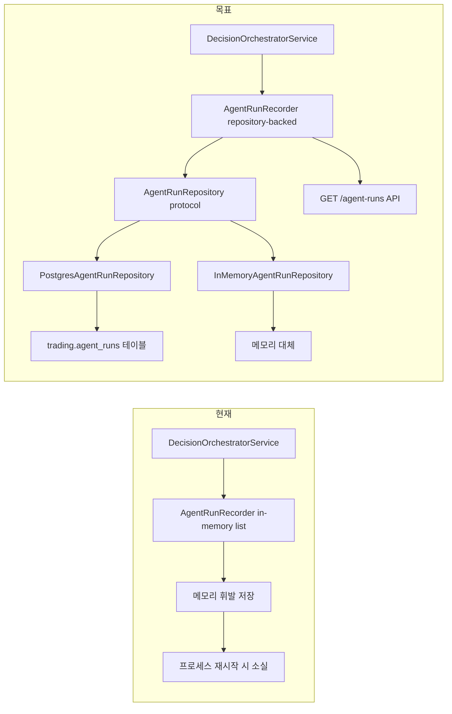
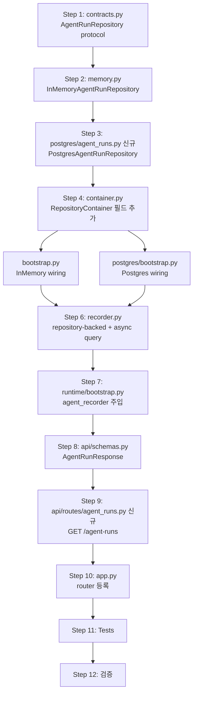

# Plan 52 — AgentRun 영속화 경로 구현 및 Inspection Read Path 정렬

## 목적

`AgentRunRecorder`의 in-memory 전용 stub을 repository-backed 구조로 전환하고,  
`GET /agent-runs` inspection API를 추가하여 AI Agent 실행 이력을 DB에 저장하고 조회할 수 있게 한다.

**범위 제한**: `GET /agent-runs` 목록 endpoint + optional `?decision_context_id=` filter 까지만.  
`GET /agent-runs/{id}`는 이번 턴에서 제외.

## 현재 상태



### 이미 존재하는 것

| 항목 | 위치 | 상태 |
|------|------|------|
| `AgentRunEntity` | `entities.py:159-173` | ✅ 13개 필드, DB와 완벽 정렬 |
| `trading.agent_runs` 테이블 | `migrations/0001_initial_schema.sql` | ✅ 컬럼·제약조건·인덱스 완비 |
| `row_to_entity()` | `row_mapper.py:58-94` | ✅ Enum 필드 없음, 별도 변환 불필요 |
| `AgentRunRecorder.record()` (async) | `recorder.py:43-163` | ✅ 비즈니스 로직(agent_name 정합성, decision_context_id payload vs storage 분리) 존재 |
| `AgentRunRecorder.list_*()` (sync) | `recorder.py:165-177` | ⚠️ sync → async 변환 필요 |
| `DecisionOrchestratorService.__init__` | `decision_orchestrator.py:280-297` | ✅ `agent_recorder` DI 지원 |
| `_run_agents()` → `record()` 호출 | `decision_orchestrator.py:605,637,659` | ✅ 수정 불필요 (record는 이미 async) |
| `_build_orchestrator()` | `runtime/bootstrap.py:197-234` | ⚠️ `agent_recorder` 미주입 → default `AgentRunRecorder()` |

## 호출부 전수조사 결과: `list_all()` / `list_by_decision_context()`

### `list_all()` call sites

| 위치 | 호출 방식 | 영향 |
|------|----------|------|
| **Production 코드: 0곳** | | **sync→async 전환에 영향 없음** |
| `tests/services/ai_agents/test_orchestrator_agents.py` (13곳) | `recorder.list_all()` / `service._agent_recorder.list_all()` | await 추가 필요 |
| `tests/services/test_decision_orchestrator.py` (4곳) | `service._agent_recorder.list_all()` | await 추가 필요 |
| `tests/smoke/test_runtime_event_interpretation_smoke.py` (2곳) | `orchestrator._agent_recorder.list_all()` | await 추가 필요 |
| `tests/smoke/test_runtime_three_agent_smoke.py` (4곳) | `orchestrator._agent_recorder.list_all()` | await 추가 필요 |
| `tests/integration/test_long_path_e2e.py` (1곳) | `service._agent_recorder.list_all()` | await 추가 필요 |

### `list_by_decision_context()` call sites

| 위치 | 호출 방식 | 영향 |
|------|----------|------|
| **Production 코드: 0곳** | | **sync→async 전환에 영향 없음** |
| **Test 코드: 0곳** | | **await 추가 불필요** |

### `clear()` call sites

| 위치 | 영향 |
|------|------|
| **외부 호출 0곳** | 변경 없이 유지 |

### 결론

`list_all()` sync→async 변환은 **test 5개 파일**(총 24곳)에만 `await` 추가 작업이 필요하다.  
Production 코드에는 영향이 전혀 없다. `list_by_decision_context()`는 아직 호출자가 없으므로  
안전하게 async로 변경 가능하다.

## 변경 불가 항목

다음은 이 Plan의 범위에서 **절대 수정하지 않는다**:

- `OrderManager` (`services/order_manager.py`)
- `ReconciliationService` (`services/reconciliation_service.py`)
- `BrokerAdapter` 및 `KoreaInvestmentAdapter`
- Hard Guardrail Engine
- `admin_ui/` 전체
- `_run_agents()` 내부의 EI→AR→FDC 요청 체인 구조 (request→request_with_ei→request_with_ei_and_ar)
- 기존 `agent_recorder.record()` 호출부 (`decision_orchestrator.py:605,637,659`)

## 상세 구현 계획

### Step 1: `contracts.py` — AgentRunRepository protocol 추가

**파일**: `src/agent_trading/repositories/contracts.py`

```python
class AgentRunRepository(Protocol):
    """Store for AI Agent execution run records."""

    async def add(self, run: AgentRunEntity) -> AgentRunEntity:
        """Persist a new agent run and return it with server defaults."""
        ...

    async def list_by_decision_context(
        self, decision_context_id: UUID
    ) -> Sequence[AgentRunEntity]:
        """Return all runs for a decision context, ordered by started_at DESC."""
        ...

    async def list_all(self, limit: int = 100) -> Sequence[AgentRunEntity]:
        """Return recent runs ordered by started_at DESC."""
        ...
```

**근거**: 기존 `TradeDecisionRepository` 패턴과 동일.  
`list_all()`에 `limit` 파라미터를 추가하여 API에서 페이징 기본값을 갖도록 함.

---

### Step 2: `memory.py` — InMemoryAgentRunRepository 구현

**파일**: `src/agent_trading/repositories/memory.py`

```python
class InMemoryAgentRunRepository:
    """In-memory implementation of ``AgentRunRepository``."""

    def __init__(self) -> None:
        self._runs: list[AgentRunEntity] = []

    async def add(self, run: AgentRunEntity) -> AgentRunEntity:
        self._runs.append(run)
        return run

    async def list_by_decision_context(
        self, decision_context_id: UUID
    ) -> Sequence[AgentRunEntity]:
        return tuple(
            r for r in self._runs
            if r.decision_context_id == decision_context_id
        )

    async def list_all(self, limit: int = 100) -> Sequence[AgentRunEntity]:
        return tuple(self._runs[-limit:])

    async def clear(self) -> None:
        self._runs.clear()
```

**근거**: 기존 `InMemoryTradeDecisionRepository` 패턴과 동일.  
`clear()` 메서드는 테스트에서 사용 가능하도록 추가.

---

### Step 3: `postgres/agent_runs.py` — PostgresAgentRunRepository 신규 파일

**파일**: `src/agent_trading/repositories/postgres/agent_runs.py`

`PostgresTradeDecisionRepository` 패턴을 따라 explicit SQL 사용.

```python
from __future__ import annotations

import json
from uuid import UUID

from agent_trading.db.row_mapper import row_to_entity
from agent_trading.db.transaction import TransactionManager
from agent_trading.domain.entities import AgentRunEntity


class PostgresAgentRunRepository:
    """PostgreSQL implementation of ``AgentRunRepository``."""

    __slots__ = ("_tx",)

    def __init__(self, tx: TransactionManager) -> None:
        self._tx = tx

    async def add(self, run: AgentRunEntity) -> AgentRunEntity:
        row = await self._tx.connection.fetchrow(
            """
            INSERT INTO trading.agent_runs
                (agent_run_id, decision_context_id, agent_type,
                 model_id, prompt_id, temperature, seed,
                 raw_output_uri, structured_output_json,
                 status, started_at, completed_at, created_at)
            VALUES ($1, $2, $3,
                    $4, $5, $6, $7,
                    $8, $9::jsonb,
                    $10, $11, $12, $13)
            RETURNING *
            """,
            run.agent_run_id,
            run.decision_context_id,
            run.agent_type,
            run.model_id,
            run.prompt_id,
            run.temperature,
            run.seed,
            run.raw_output_uri,
            json.dumps(run.structured_output_json) if run.structured_output_json else None,
            run.status,
            run.started_at,
            run.completed_at,
            run.created_at,
        )
        return row_to_entity(row, AgentRunEntity)

    async def list_by_decision_context(
        self, decision_context_id: UUID
    ) -> list[AgentRunEntity]:
        rows = await self._tx.connection.fetch(
            "SELECT * FROM trading.agent_runs "
            "WHERE decision_context_id = $1 "
            "ORDER BY started_at DESC",
            decision_context_id,
        )
        return [row_to_entity(r, AgentRunEntity) for r in rows]

    async def list_all(self, limit: int = 100) -> list[AgentRunEntity]:
        rows = await self._tx.connection.fetch(
            "SELECT * FROM trading.agent_runs ORDER BY started_at DESC LIMIT $1",
            limit,
        )
        return [row_to_entity(r, AgentRunEntity) for r in rows]
```

**핵심 설계**:
- `structured_output_json` → `$n::jsonb` 캐스팅 (asyncpg JSONB codec 없을 때 대비)
- `json.dumps()`로 dict를 JSON 문자열로 변환 (asyncpg JSONB codec fallback)
- `RETURNING *` → `row_to_entity()`로 Entity 변환 (DB 기본값 반영)
- `ORDER BY started_at DESC` → 최신 실행이 먼저 오도록
- `LIMIT $1` → `list_all()`에 limit 기본값 100
- `agent_run_id`는 recorder가 생성하고 repository는 전달받은 entity를 저장만 함

---

### Step 4: `container.py` — RepositoryContainer에 agent_runs 필드 추가

**파일**: `src/agent_trading/repositories/container.py`

```python
from agent_trading.repositories.contracts import (
    ...
    AgentRunRepository,    # import 추가
)

@dataclass(slots=True, frozen=True)
class RepositoryContainer:
    unit_of_work: UnitOfWork
    agent_runs: AgentRunRepository  # accounts 앞, 알파벳 순서
    accounts: AccountRepository
    ...
```

⚠️ `frozen=True` dataclass — 필드 순서는 **알파벳 순서** 유지해야 함.  
`agent_runs`는 `unit_of_work` 다음, `accounts` 앞에 위치.

---

### Step 5: Bootstrap wiring

**파일 수정 1**: `src/agent_trading/repositories/bootstrap.py`

```python
from agent_trading.repositories.memory import (
    ...
    InMemoryAgentRunRepository,   # import 추가
)

def build_in_memory_repositories() -> RepositoryContainer:
    return RepositoryContainer(
        unit_of_work=InMemoryUnitOfWork(),
        agent_runs=InMemoryAgentRunRepository(),  # 추가
        clients=InMemoryClientRepository(),
        ...
    )
```

**파일 수정 2**: `src/agent_trading/repositories/postgres/bootstrap.py`

wiring 책임만 — SQL 디테일은 `postgres/agent_runs.py`에 위임.

```python
from agent_trading.repositories.postgres.agent_runs import (
    PostgresAgentRunRepository,  # import 추가
)

def build_postgres_repositories(tx: TransactionManager) -> RepositoryContainer:
    return RepositoryContainer(
        unit_of_work=PostgresUnitOfWork(tx),
        agent_runs=PostgresAgentRunRepository(tx),  # 추가
        clients=PostgresClientRepository(tx),
        ...
    )
```

---

### Step 6: `AgentRunRecorder` repository-backed 전환

**파일**: `src/agent_trading/services/ai_agents/recorder.py`

**변경 사항**:

1. **생성자 변경**: `AgentRunRepository`를 필수로 받도록
   - `def __init__(self, repo: AgentRunRepository, max_runs: int = 0) -> None:`
   - `self._repo = repo` 저장
   - 기존 `self._runs: list[AgentRunEntity]`는 유지 (fallback buffer + clear()용)

2. **`record()` 수정**: 
   - 기존 비즈니스 로직 **전부 유지** (agent_name 정합성 체크, decision_context_id payload/storage 분리)
   - `self._runs.append(run)` 후 `self._repo.add(run)` 호출
   - **`agent_run_id`는 recorder가 생성**, repository는 전달받은 entity를 저장만 함

3. **`list_by_decision_context()` sync → async 변환**
4. **`list_all()` sync → async 변환** (기존 arg 없는 signature → `limit: int = 100`)

5. **`clear()` 유지** — 내부 buffer만 clear

```python
from collections.abc import Sequence
from uuid import UUID

from agent_trading.repositories.contracts import AgentRunRepository

class AgentRunRecorder:
    def __init__(
        self,
        repo: AgentRunRepository,
        max_runs: int = 0,
    ) -> None:
        self._repo = repo
        self._max_runs = max_runs
        self._runs: list[AgentRunEntity] = []  # fallback buffer

    async def record(self, ...) -> AgentRunEntity:
        # ... 기존 비즈니스 로직 그대로 유지 ...
        run = AgentRunEntity(...)
        
        self._runs.append(run)
        persisted = await self._repo.add(run)  # 영속화
        
        if self._max_runs > 0 and len(self._runs) > self._max_runs:
            self._runs = self._runs[-self._max_runs :]
        
        return persisted

    async def list_by_decision_context(
        self, decision_context_id: UUID
    ) -> Sequence[AgentRunEntity]:
        return await self._repo.list_by_decision_context(decision_context_id)

    async def list_all(self, limit: int = 100) -> Sequence[AgentRunEntity]:
        return await self._repo.list_all(limit=limit)

    def clear(self) -> None:
        self._runs.clear()
```

**영향 파일 (await 추가 필요)**:

| 파일 | 변경 내용 |
|------|----------|
| `tests/services/ai_agents/test_orchestrator_agents.py` | 13곳 `list_all()` → `await list_all()` |
| `tests/services/test_decision_orchestrator.py` | 4곳 `list_all()` → `await list_all()` |
| `tests/smoke/test_runtime_event_interpretation_smoke.py` | 2곳 `list_all()` → `await list_all()` |
| `tests/smoke/test_runtime_three_agent_smoke.py` | 4곳 `list_all()` → `await list_all()` |
| `tests/integration/test_long_path_e2e.py` | 1곳 `list_all()` → `await list_all()` |

---

### Step 7: Runtime bootstrap wiring

**파일**: `src/agent_trading/runtime/bootstrap.py`

**`_build_orchestrator()` 변경**:

```python
from agent_trading.services.ai_agents.recorder import AgentRunRecorder

def _build_orchestrator(
    repos: RepositoryContainer,
    settings: AppSettings,
    event_interpretation_agent: EventInterpretationAgent | None = None,
    ai_risk_agent: AIRiskAgent | None = None,
    final_decision_agent: FinalDecisionComposerAgent | None = None,
) -> DecisionOrchestratorService:
    # ... 기존 agent 빌드 로직 ...
    agent_recorder = AgentRunRecorder(repo=repos.agent_runs)
    return DecisionOrchestratorService(
        repos=repos,
        event_interpretation_agent=event_interpretation_agent,
        ai_risk_agent=ai_risk_agent,
        final_decision_agent=final_decision_agent,
        agent_recorder=agent_recorder,
    )
```

이렇게 하면 `build_default_runtime()`과 `build_postgres_runtime()` 모두  
자동으로 repository-backed recorder를 갖게 됨.

---

### Step 8: API Schema — AgentRunResponse 추가

**파일**: `src/agent_trading/api/schemas.py`

```python
class AgentRunResponse(BaseModel):
    """``GET /agent-runs`` — AI agent execution run record."""

    agent_run_id: str
    decision_context_id: str
    agent_type: str
    status: str
    started_at: datetime
    completed_at: datetime | None = None
    model_id: str | None = None
    prompt_id: str | None = None
    temperature: float | None = None
    seed: int | None = None
    raw_output_uri: str | None = None
    structured_output_json: dict[str, object] | None = None
    created_at: datetime | None = None
```

**설계**: `TradeDecisionDetail` 패턴과 동일. UUID→str 변환은 Pydantic v2 자동 처리.  
`Decimal`인 `temperature`는 `float | None`으로 노출.

---

### Step 9: API Route — GET /agent-runs

**파일**: `src/agent_trading/api/routes/agent_runs.py` (신규)

`decisions.py` 패턴을 따라 구현.

```python
from __future__ import annotations

from uuid import UUID

from fastapi import APIRouter, Depends, HTTPException, Query

from agent_trading.api.deps import get_repos
from agent_trading.api.schemas import AgentRunResponse
from agent_trading.repositories.container import RepositoryContainer

router = APIRouter(tags=["agent-runs"])


@router.get("/agent-runs", response_model=list[AgentRunResponse])
async def list_agent_runs(
    decision_context_id: str | None = Query(
        None, description="Optional decision context ID filter"
    ),
    limit: int = Query(100, ge=1, le=1000, description="Max results"),
    repos: RepositoryContainer = Depends(get_repos),
) -> list[AgentRunResponse]:
    """List AI agent execution runs, optionally filtered by decision context."""
    if decision_context_id is not None:
        try:
            ctx_id = UUID(decision_context_id)
        except ValueError as exc:
            raise HTTPException(
                status_code=400, detail=f"Invalid UUID: {decision_context_id}"
            ) from exc
        runs = await repos.agent_runs.list_by_decision_context(ctx_id)
    else:
        runs = await repos.agent_runs.list_all(limit=limit)

    return [
        AgentRunResponse(
            agent_run_id=str(r.agent_run_id),
            decision_context_id=str(r.decision_context_id),
            agent_type=r.agent_type,
            status=r.status,
            started_at=r.started_at,
            completed_at=r.completed_at,
            model_id=str(r.model_id) if r.model_id else None,
            prompt_id=str(r.prompt_id) if r.prompt_id else None,
            temperature=float(r.temperature) if r.temperature else None,
            seed=r.seed,
            raw_output_uri=r.raw_output_uri,
            structured_output_json=r.structured_output_json,
            created_at=r.created_at,
        )
        for r in runs
    ]
```

---

### Step 10: `app.py` — agent_runs_router 등록

**파일**: `src/agent_trading/api/app.py`

```python
# Phase 1 routers
from agent_trading.api.routes.agent_runs import router as agent_runs_router  # 추가

protected_routers = [
    orders_router,
    audit_logs_router,
    reconciliation_router,
    decisions_router,
    agent_runs_router,  # 추가
]
```

---

### Step 11: 테스트

#### 11.1 Postgres Repository Test

**파일**: `tests/repositories/test_postgres_agent_runs.py` (신규)

`test_postgres_trade_decisions.py` 패턴 참조:
- `seeded_decision_context` fixture 재사용
- `test_add_agent_run` — full entity INSERT 및 RETURNING 검증
- `test_list_by_decision_context` — context별 조회
- `test_list_all` — 전체 조회 + limit
- `test_list_by_decision_context_empty` — 존재하지 않는 context → 빈 리스트

#### 11.2 API Inspection Test

**파일**: `tests/api/test_inspection.py`에 `TestAgentRuns` 클래스 추가

`TestOrders` 패턴 참조:
- `test_list_agent_runs_empty` — empty_client → 200 + []
- `test_list_agent_runs` — client → seeded runs 반환
- `test_list_agent_runs_by_decision_context` — `?decision_context_id=` 필터
- `test_list_agent_runs_invalid_uuid` → 400

#### 11.3 API conftest 수정

**파일**: `tests/api/conftest.py` — **이 파일만** 수정

- `agent_run_id` fixture 추가
- `decision_context_id` fixture 재사용
- `seeded_repos`에 `AgentRunEntity` 시드 추가 (decision_context_id 참조)

#### 11.4 Orchestrator assemble() persisted 검증

**파일**: `tests/services/test_decision_orchestrator.py`

기존 `test_assemble_with_ai_agents_runs_recorder` 테스트를 확장하여  
`assemble()` 1회 → EI/AR/FDC 3건이 **persisted**되었는지 검증:
- `service._agent_recorder.list_all()` 호출 후 `len(runs) == 3` 확인
- 각 run의 `agent_type` 확인 (`event_interpretation`, `ai_risk`, `final_decision`)
- `structured_output_json`이 None이 아닌지 확인

#### 11.5 기존 test 파일 await 추가

다음 5개 파일의 `list_all()` 호출 24곳에 `await` 추가:

| 파일 | 변경 수량 |
|------|----------|
| `tests/services/ai_agents/test_orchestrator_agents.py` | 13곳 |
| `tests/services/test_decision_orchestrator.py` | 4곳 |
| `tests/smoke/test_runtime_event_interpretation_smoke.py` | 2곳 |
| `tests/smoke/test_runtime_three_agent_smoke.py` | 4곳 |
| `tests/integration/test_long_path_e2e.py` | 1곳 |

---

### Step 12: 최종 검증

1. **`pytest tests/ -x`** 실행 — 기존 테스트가 깨지지 않는지 확인
2. **`pytest tests/repositories/test_postgres_agent_runs.py -x`** — 신규 Postgres repository 테스트
3. **`pytest tests/api/test_inspection.py::TestAgentRuns -x`** — API inspection 테스트
4. **`pytest tests/services/test_decision_orchestrator.py -x`** — orchestrator assemble persisted 검증

## 최종 변경 파일 목록

| # | 파일 | 변경 유형 | 설명 |
|---|------|----------|------|
| 1 | `repositories/contracts.py` | 수정 | `AgentRunRepository` protocol 추가 |
| 2 | `repositories/memory.py` | 수정 | `InMemoryAgentRunRepository` 클래스 추가 |
| 3 | `repositories/postgres/agent_runs.py` | **신규** | `PostgresAgentRunRepository` — explicit SQL |
| 4 | `repositories/container.py` | 수정 | `agent_runs: AgentRunRepository` 필드 추가 |
| 5 | `repositories/bootstrap.py` | 수정 | `InMemoryAgentRunRepository()` wiring |
| 6 | `repositories/postgres/bootstrap.py` | 수정 | `PostgresAgentRunRepository(tx)` wiring (wiring만) |
| 7 | `services/ai_agents/recorder.py` | 수정 | repository-backed, query async화 |
| 8 | `runtime/bootstrap.py` | 수정 | `AgentRunRecorder(repo=repos.agent_runs)` 주입 |
| 9 | `api/schemas.py` | 수정 | `AgentRunResponse` Pydantic 모델 추가 |
| 10 | `api/routes/agent_runs.py` | **신규** | `GET /agent-runs` endpoint |
| 11 | `api/app.py` | 수정 | agent_runs_router 등록 |
| 12 | `tests/repositories/test_postgres_agent_runs.py` | **신규** | Postgres repository test |
| 13 | `tests/api/conftest.py` | 수정 | `AgentRunEntity` 시드 추가 |
| 14 | `tests/api/test_inspection.py` | 수정 | `TestAgentRuns` 클래스 추가 |
| 15 | `tests/services/test_decision_orchestrator.py` | 수정 | assemble persisted 검증 + await 추가 |
| 16 | `tests/services/ai_agents/test_orchestrator_agents.py` | 수정 | 13곳 `await` 추가 |
| 17 | `tests/smoke/test_runtime_event_interpretation_smoke.py` | 수정 | 2곳 `await` 추가 |
| 18 | `tests/smoke/test_runtime_three_agent_smoke.py` | 수정 | 4곳 `await` 추가 |
| 19 | `tests/integration/test_long_path_e2e.py` | 수정 | 1곳 `await` 추가 |

## 구현 순서



## 제외된 변경

- **`decision_orchestrator.py`의 `_run_agents()`** — 내부 `record()` 호출은 이미 async이며, 수정 불필요
- **`DecisionOrchestratorService.__init__`** — `agent_recorder` DI signature는 유지, 기본값만 삭제
- **기존 `AgentRunRecorder`의 `record()` 비즈니스 로직** — agent_name 정합성 체크, decision_context_id payload/storage 분리 → 그대로 유지
- **`GET /agent-runs/{id}`** — 이번 턴에서 제외
- **`OrderManager`**, **`ReconciliationService`**, **`BrokerAdapter`**, **`admin_ui`** — 절대 수정 금지
