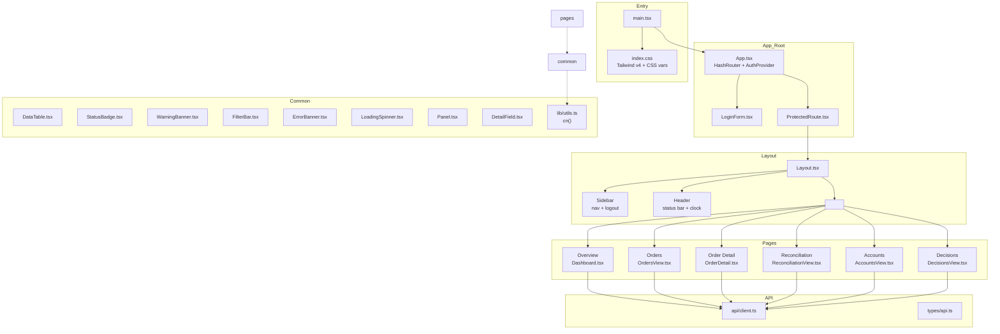
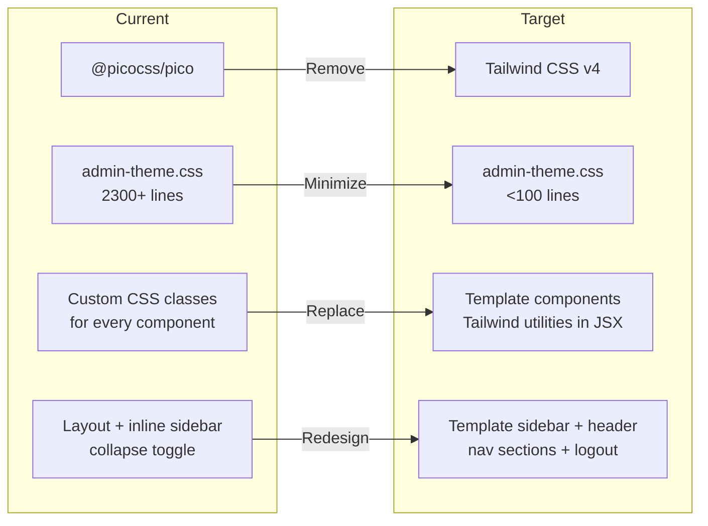

# Admin UI 2nd Design Migration Plan

## Overview

Apply the visual design from `design/design_template/` to the existing `admin_ui/` (Vite+React) application while preserving all existing functionality: authentication, routing, API connectivity (FastAPI), DB integration via proxy, and all tests.

---

## Phase 1: Project Dependencies & Configuration

### 1.1 Update package.json
**File:** [`admin_ui/package.json`](admin_ui/package.json)

**Remove:**
- `@picocss/pico` (replaced by Tailwind CSS v4)

**Add dependencies from template:**
- `tailwindcss` (^4.2.0)
- `@tailwindcss/postcss` (^4.2.0)
- `postcss` (^8.5)
- `class-variance-authority` (^0.7.1)
- `clsx` (^2.1.1)
- `tailwind-merge` (^3.3.1)
- `recharts` (^2.15.0)
- `@radix-ui/react-avatar`, `@radix-ui/react-dropdown-menu`, `@radix-ui/react-scroll-area`, `@radix-ui/react-separator`, `@radix-ui/react-slot`, `@radix-ui/react-tooltip`

**Keep existing:**
- `lucide-react` (upgrade to ^0.564.0 if needed)
- `react-router-dom` (keep ^7.5.0+)
- `react`, `react-dom` (keep ^19)
- All devDependencies (testing, types)

### 1.2 Create postcss.config.mjs
**File:** [`admin_ui/postcss.config.mjs`](admin_ui/postcss.config.mjs)
```js
export default {
  plugins: {
    '@tailwindcss/postcss': {},
  },
}
```

### 1.3 Update vite.config.ts
**File:** [`admin_ui/vite.config.ts`](admin_ui/vite.config.ts)

- Add `@` path alias: `'@': path.resolve(__dirname, './src')`
- Add `css.postcss` config pointing to `postcss.config.mjs`
- Keep all existing proxy configuration for FastAPI backend

### 1.4 Update tsconfig.json
**File:** [`admin_ui/tsconfig.json`](admin_ui/tsconfig.json)

- Add `baseUrl: "."`
- Add `paths: { "@/*": ["./src/*"] }`

### 1.5 Create index.css (Tailwind entry)
**File:** [`admin_ui/src/index.css`](admin_ui/src/index.css)

- Copy from `design/design_template/src/index.css` (Tailwind v4 import + CSS vars)
- Remove design_template-specific chart colors if needed
- Keep the CSS variable system for the template's color palette

---

## Phase 2: CSS System Migration

### 2.1 Replace admin-theme.css
**File:** [`admin_ui/src/styles/admin-theme.css`](admin_ui/src/styles/admin-theme.css)

- **Keep only:** Custom CSS classes that are NOT covered by Tailwind utilities
- **Remove:** All PicoCSS resets, color token definitions (replaced by Tailwind theme), layout classes
- **Migrate to Tailwind:** Most component-specific styles (sidebar, header, cards, tables) can use Tailwind utility classes directly in JSX

**Specific CSS classes to keep (minimal):**
- `.side-buy`, `.side-sell`, `.side-long`, `.side-short` (color text classes)
- Any animation keyframes
- Print-specific styles

**Strategy:** Instead of maintaining a large CSS file, use the template's pattern of applying styles directly via Tailwind classes in JSX components.

### 2.2 Update main.tsx
**File:** [`admin_ui/src/main.tsx`](admin_ui/src/main.tsx)

- Change import from `"./styles/admin-theme.css"` to `"./index.css"`
- Keep `StrictMode` and `App` rendering

---

## Phase 3: Common Components

### 3.1 Create utility function
**File:** [`admin_ui/src/lib/utils.ts`](admin_ui/src/lib/utils.ts)

- Copy `cn()` function from `design/design_template/src/lib/utils.ts` using `clsx` + `tailwind-merge`

### 3.2 Rewrite DataTable
**File:** [`admin_ui/src/components/common/DataTable.tsx`](admin_ui/src/components/common/DataTable.tsx)

**Current interface:** Uses `Column<T>` with `key`, `label`, `render`, `sortable`  
**Target interface:** Template style with `key`, `header`, `render`, `width`

**Changes needed:**
- Adopt template's `Column<T>` interface (rename `label` → `header`, add `width`)
- Apply template's table styling: `bg-white rounded-xl border border-[#e2e8f0]`, header row with `bg-[#f8fafc]`
- Keep `keyField` parameter (template uses `idKey`)
- Keep `selectedKey`, `onRowClick`, `emptyMessage`, `compact`
- Add `isLoading` state support
- Add row hover highlight (`cursor-pointer hover:bg-[#f8fafc]`)
- Add selected row highlight (`bg-[#eff6ff]`)

### 3.3 Rewrite StatusBadge
**File:** [`admin_ui/src/components/common/StatusBadge.tsx`](admin_ui/src/components/common/StatusBadge.tsx)

**Current interface:** `{ status: string }` → renders a `<span>` with CSS class  
**Target interface:** Template style with `{ variant: BadgeVariant, children, className }`

**Changes needed:**
- Accept both a `variant` prop (success/warning/error/info/neutral) AND a `status` prop (for backward compatibility)
- Map status strings to variants using the existing `statusToVariant()` logic
- Apply template's badge styling: `inline-flex items-center px-2 py-0.5 rounded text-xs font-medium`
- Use template's color scheme: `bg-[#dcfce7] text-[#166534]` for success, etc.

**Note:** Tests use `StatusBadge` with `status` prop. Support both interfaces.

### 3.4 Create WarningBanner component
**File:** [`admin_ui/src/components/common/WarningBanner.tsx`](admin_ui/src/components/common/WarningBanner.tsx)

- Copy from `design/design_template/src/components/WarningBanner.tsx`
- Support `variant` (warning/error/info), `title`, `message`, `onDismiss`
- Use lucide-react icons (AlertTriangle, AlertCircle, Info)

### 3.5 Create FilterBar component
**File:** [`admin_ui/src/components/common/FilterBar.tsx`](admin_ui/src/components/common/FilterBar.tsx)

- Copy from `design/design_template/src/components/FilterBar.tsx`
- Support `searchPlaceholder`, `searchValue`, `onSearchChange`
- Support `filters[]` with key/label/options/value/onChange
- Support `onClearAll`

### 3.6 Create/Preserve ErrorBanner & LoadingSpinner
**Files:** Keep existing [`admin_ui/src/components/common/ErrorBanner.tsx`](admin_ui/src/components/common/ErrorBanner.tsx) and [`admin_ui/src/components/common/LoadingSpinner.tsx`](admin_ui/src/components/common/LoadingSpinner.tsx)

- Apply template styling (Tailwind classes) rather than CSS classes
- ErrorBanner: use `bg-[#fef2f2] border border-[#f87171]` style
- LoadingSpinner: use `flex items-center justify-center p-8` with spinner animation

### 3.7 Create/Preserve Panel component
**File:** [`admin_ui/src/components/common/Panel.tsx`](admin_ui/src/components/common/Panel.tsx)

- Keep existing but apply template card styling: `bg-white rounded-xl border border-[#e2e8f0]`

### 3.8 Preserve DetailField & SectionDivider
**Files:** Keep existing [`admin_ui/src/components/common/DetailField.tsx`](admin_ui/src/components/common/DetailField.tsx) and [`admin_ui/src/components/common/SectionDivider.tsx`](admin_ui/src/components/common/SectionDivider.tsx)

- Apply template styling

---

## Phase 4: Layout (Sidebar + Header)

### 4.1 Rewrite Layout.tsx
**File:** [`admin_ui/src/components/Layout.tsx`](admin_ui/src/components/Layout.tsx)

**Design reference:** [`design/design_template/src/components/Sidebar.tsx`](design/design_template/src/components/Sidebar.tsx) + [`design/design_template/src/components/Header.tsx`](design/design_template/src/components/Header.tsx)

**Key changes:**
- **Sidebar:** Use template's visual design (white bg, border-r, 220px width, nav sections with "ACTIVE"/"RESERVED" headers)
  - Keep template's nav section grouping
  - Keep "Broker", "System", "Admin" as disabled "Soon" items (template pattern)
  - Add "Log Out" at bottom (template bottom pattern + actual logout functionality)
  - Show auth token/status info in footer area
  - Remove collapse toggle (template doesn't have it)
  - Use NavLink from react-router-dom for navigation, but style like template buttons
- **Header:** Use template's header design
  - Green status dots for API/DB status (keep `useHealth` or similar)
  - Date/time display
  - "Read-only" badge (template pattern)
  - Remove notification bell and avatar button (template has these but we can simplify)
- **Main area:** Use `flex flex-1 flex-col overflow-hidden`
- **Outlet:** Render child routes in `<main className="flex-1 overflow-auto">`

**Preserve:**
- `useAuth()` integration for logout
- Token display
- All route links

### 4.2 Remove Sidebar & Header standalone components
Since Layout.tsx will integrate the sidebar and header directly (matching template pattern), no separate Sidebar.tsx or Header.tsx files are needed in admin_ui.

---

## Phase 5: Page Components

Each page needs to adopt the template's visual design while keeping real API data fetching and all existing functionality.

### 5.1 Dashboard → Overview
**File:** [`admin_ui/src/components/Dashboard.tsx`](admin_ui/src/components/Dashboard.tsx)
**Design reference:** [`design/design_template/src/pages/Overview.tsx`](design/design_template/src/pages/Overview.tsx)

**Changes:**
- Page header: "Overview" title + "System status and recent activity" subtitle
- **Status cards** (template's `StatusCard` pattern): 
  - API Health, Database Health, Recent Orders, Active Locks, Incomplete Recon
  - Use template's card style with status dot + label
- **WarningBanner** for active locks (template pattern)
- **Recent Orders** table (template DataTable) with "View all orders" link → `/orders`
- **Active Locks** table (template DataTable) with "View reconciliation" link → `/reconciliation`
- Keep all real data fetching from API: `getHealth()`, `getOrders()`, `getAccounts()`, `getReconciliationRuns()`, `getReconciliationLocks()`
- Keep `LoadingSpinner` and `ErrorBanner` states

### 5.2 OrdersView → Orders
**File:** [`admin_ui/src/components/OrdersView.tsx`](admin_ui/src/components/OrdersView.tsx)
**Design reference:** [`design/design_template/src/pages/Orders.tsx`](design/design_template/src/pages/Orders.tsx)

**Changes:**
- Page header: "Orders" title + "View order lifecycle, broker mapping, and decision lineage"
- **FilterBar** with search + status/ side filter dropdowns (template pattern)
- **DataTable** with template styling
- **Order Detail panel** (right side, on row select):
  - Template's detail card style with X close button
  - Shows: Order ID, Symbol, Side, Qty, Status, Correlation ID, State Events table, Broker Orders table
  - Keep navigation to OrderDetail page (`/orders/:orderId`)

**Note:** The current OrdersView has an inline order detail panel AND a separate OrderDetail page at `/orders/:orderId`. Keep both working.

### 5.3 ReconciliationView → Reconciliation
**File:** [`admin_ui/src/components/ReconciliationView.tsx`](admin_ui/src/components/ReconciliationView.tsx)
**Design reference:** [`design/design_template/src/pages/Reconciliation.tsx`](design/design_template/src/pages/Reconciliation.tsx)

**Changes:**
- Page header: "Reconciliation" + "Monitor uncertain states, reconciliation runs, and active locks"
- **WarningBanner** for active blocking locks (template pattern)
- **Active Locks** section with DataTable
- **Reconciliation Runs** section with FilterBar + DataTable
- Keep real data: `getReconciliationRuns()`, `getReconciliationLocks()`
- Keep run detail on row select

### 5.4 AccountsView → Accounts
**File:** [`admin_ui/src/components/AccountsView.tsx`](admin_ui/src/components/AccountsView.tsx)
**Design reference:** [`design/design_template/src/pages/Accounts.tsx`](design/design_template/src/pages/Accounts.tsx)

**Changes:**
- Page header: "Accounts" + "View account status, positions, and cash balances"
- **FilterBar** with search + account type filter
- **DataTable** for accounts list with row selection
- **Account Detail panel** (side panel):
  - Account info (Account Code, Client Code, Type, Status)
  - **Positions** sub-table
  - **Cash Balances** sub-table
- Keep real data: `getAccounts()`, `getPositions()`, `getCashBalance()`

### 5.5 DecisionsView → Decisions
**File:** [`admin_ui/src/components/DecisionsView.tsx`](admin_ui/src/components/DecisionsView.tsx)
**Design reference:** [`design/design_template/src/pages/Decisions.tsx`](design/design_template/src/pages/Decisions.tsx)

**Changes:**
- Page header: "Decisions" + "View AI trade decisions and related context"
- **FilterBar** with search + side filter + confidence range
- **DataTable** with template styling and confidence bar
- **Decision Detail panel** (side panel):
  - Decision info: ID, Symbol, Side, Type, Confidence, Agent, Context ID
  - **Decision Context** card: Market Condition, RSI, MACD, MA, Fundamental Score, Risk, Reasoning
- Keep real data: `getTradeDecisions()`, `getDecisionContext()`

### 5.6 OrderDetail
**File:** [`admin_ui/src/components/OrderDetail.tsx`](admin_ui/src/components/OrderDetail.tsx)

**Changes:**
- Apply template card styling
- Back link: `&larr; Back to Orders`
- Keep existing data: `getOrderDetail()`, `getOrderEvents()`, `getBrokerOrders()`
- Keep DetailField grid layout but use template colors
- Keep State Events and Broker Orders tables with template DataTable styling
- Keep Decision Links section

---

## Phase 6: LoginForm Styling

### 6.1 Update LoginForm.tsx
**File:** [`admin_ui/src/components/LoginForm.tsx`](admin_ui/src/components/LoginForm.tsx)

**Changes:**
- Replace inline styles with template-aligned design:
  - Centered card: `bg-white rounded-xl border border-[#e2e8f0] p-8 max-w-md mx-auto mt-20`
  - Title: "Admin Console" (matching template logo)
  - Subtitle: "Enter your access token"
  - Token input: template input styling
  - Submit button: `bg-[#1e293b] text-white rounded-lg px-4 py-2.5`
  - Error message: `bg-[#fef2f2] text-[#991b1b] border border-[#f87171] rounded-lg p-3`
- Keep all logic: token verification, error handling, redirect

---

## Phase 7: Test Updates

### 7.1 Update test imports and mocks
**Files:** [`admin_ui/src/__tests__/*.test.tsx`](admin_ui/src/__tests__/)

**Changes needed:**
- Update component imports (if component file names changed)
- Update mock data to match any changed prop interfaces
- If `StatusBadge` API changed, update test expectations
- If `DataTable` column definition changed (`label` → `header`), update test mocks

### 7.2 Update test-utils
**Files:** [`admin_ui/src/__tests__/test-utils/`](admin_ui/src/__tests__/test-utils/)

- Ensure render wrapper includes AuthContext provider
- Update fixtures if needed

### 7.3 Verify all tests pass
Run `npm test` (vitest) and fix any failures.

---

## Phase 8: Build Verification & Cleanup

### 8.1 Build
```bash
cd admin_ui && npm run build
```

### 8.2 Visual verification checklist
- [ ] Sidebar matches template design with proper navigation
- [ ] Header shows API/DB status with green dots
- [ ] Overview page shows status cards, recent orders, active locks
- [ ] Orders page shows filter bar + table + detail panel
- [ ] Reconciliation page shows locks + runs sections
- [ ] Accounts page shows accounts + positions + cash balances
- [ ] Decisions page shows decisions list + detail + context
- [ ] Login form is centered and styled
- [ ] All pages load real data from API (no mock data visible)

### 8.3 Remove unused files
- Remove `design/design_template/` references from admin_ui
- Clean up any unused CSS or components

---

## Key Design Decisions

### Why keep HashRouter?
The current admin_ui uses `HashRouter` (with `#/` in URLs) which works well for a proxied admin UI. The template uses `BrowserRouter` but switching would break existing bookmarks and the proxy configuration. **Keep HashRouter.**

### Why integrate Sidebar/Header into Layout?
The template has standalone Sidebar and Header components. However, since admin_ui uses `react-router-dom` with `<Outlet>`, integrating the sidebar and header into `Layout.tsx` (which wraps `<Outlet>`) is more natural for the existing routing structure.

### Why support both `status` and `variant` props in StatusBadge?
The admin_ui's existing `StatusBadge` component uses a `status` prop (string → auto-map to color). The template uses `variant` prop (explicit success/warning/error/info/neutral). Supporting both interfaces minimizes test changes and allows gradual migration.

### Tailwind v4 vs v3
The design template uses Tailwind CSS v4 (with `@import 'tailwindcss'` syntax and `@theme` directive). We should follow the same version to ensure compatibility.

---

## File Change Summary

| Action | File |
|--------|------|
| **Modify** | `admin_ui/package.json` |
| **Create** | `admin_ui/postcss.config.mjs` |
| **Modify** | `admin_ui/vite.config.ts` |
| **Modify** | `admin_ui/tsconfig.json` |
| **Create** | `admin_ui/src/index.css` |
| **Modify** | `admin_ui/src/main.tsx` |
| **Modify** | `admin_ui/src/styles/admin-theme.css` (minimize) |
| **Create** | `admin_ui/src/lib/utils.ts` |
| **Modify** | `admin_ui/src/components/common/DataTable.tsx` |
| **Modify** | `admin_ui/src/components/common/StatusBadge.tsx` |
| **Create** | `admin_ui/src/components/common/WarningBanner.tsx` |
| **Create** | `admin_ui/src/components/common/FilterBar.tsx` |
| **Modify** | `admin_ui/src/components/common/ErrorBanner.tsx` |
| **Modify** | `admin_ui/src/components/common/LoadingSpinner.tsx` |
| **Modify** | `admin_ui/src/components/common/Panel.tsx` |
| **Modify** | `admin_ui/src/components/Layout.tsx` |
| **Modify** | `admin_ui/src/components/Dashboard.tsx` |
| **Modify** | `admin_ui/src/components/OrdersView.tsx` |
| **Modify** | `admin_ui/src/components/OrderDetail.tsx` |
| **Modify** | `admin_ui/src/components/ReconciliationView.tsx` |
| **Modify** | `admin_ui/src/components/AccountsView.tsx` |
| **Modify** | `admin_ui/src/components/DecisionsView.tsx` |
| **Modify** | `admin_ui/src/components/LoginForm.tsx` |
| **Modify** | `admin_ui/src/__tests__/*.test.tsx` (as needed) |

---

## Mermaid: Component Architecture



---

## Mermaid: Migration Flow



---

## Risk Mitigation

| Risk | Mitigation |
|------|-----------|
| Tailwind CSS v4 breaking changes | Use `@import 'tailwindcss'` syntax from template, ensure PostCSS config is correct |
| Test failures after component API changes | Support backward-compatible props (e.g., `status` + `variant` in StatusBadge) |
| Layout regression (auth flow broken) | Keep ProtectedRoute + AuthContext unchanged; only change visual styling |
| Build fails due to missing dependencies | Install all template deps at once, verify with `npm run build` |
| Proxy configuration lost | Keep existing vite.config.ts proxy rules intact |
