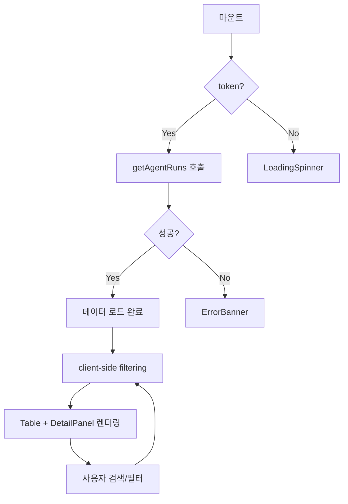

# Agent Runs 독립 페이지 — v0.dev 템플릿 이식 계획

## 템플릿 분석 결과

| 템플릿 파일 | 분석 | 조치 |
|---|---|---|
| `design/design_template/src/types/agentRun.ts` | 기존 `admin_ui/src/types/api.ts`의 `AgentRunResponse`와 완전 동일 | ❌ 새 타입 파일 생성 안 함. 기존 타입 재사용 |
| `design/design_template/src/components/AgentTypeBadge.tsx` | EI/AR/FDC 배지 컴포넌트, 깔끔한 디자인 | ✅ 공유 컴포넌트로 생성. `AgentRunsPanel` 리팩터에 사용 |
| `design/design_template/src/components/AgentRunsTable.tsx` | 테이블: Agent Type, Status, Decision Context, Started, Summary | ✅ 현재 스타일 시스템에 맞게 생성 |
| `design/design_template/src/components/AgentRunDetailPanel.tsx` | Metadata + Structured Output + Raw JSON + clipboard copy | ✅ 생성. current API 계약에 맞게 조정 |
| `design/design_template/src/pages/AgentRuns.tsx` | Search/Filter + Table + Detail Panel (2/3 + 1/3 그리드) | ✅ `AgentRunsView`로 생성. mock data 대신 실제 `getAgentRuns()` 사용 |
| `design/design_template/src/App.tsx` | State-based routing (React Router 아님) | 참고만. 기존 React Router 패턴 사용 |
| `design/design_template/src/components/Sidebar.tsx` | "Agent Runs" nav item (Zap icon) | 참고만. 기존 `Layout.tsx` 패턴 사용 |

## 변경 파일 목록

### 생성 (신규 파일)
1. `admin_ui/src/components/AgentTypeBadge.tsx`
2. `admin_ui/src/components/AgentRunsTable.tsx`
3. `admin_ui/src/components/AgentRunDetailPanel.tsx`
4. `admin_ui/src/components/AgentRunsView.tsx`
5. `admin_ui/src/__tests__/agentRuns.test.tsx`

### 수정 (기존 파일)
6. `admin_ui/src/components/AgentRunsPanel.tsx` — inline badge → shared `AgentTypeBadge`
7. `admin_ui/src/App.tsx` — `/agent-runs` 라우트 추가
8. `admin_ui/src/components/Layout.tsx` — 내비에 `Agent Runs` 추가
9. `admin_ui/src/__tests__/layout.test.tsx` — 5개 → 6개 nav 링크

### 변경 금지
- `src/agent_trading/` 이하 backend 전체
- `admin_ui/src/types/api.ts` (이미 `AgentRunResponse` 있음)
- `admin_ui/src/api/client.ts` (이미 `getAgentRuns()` 있음)
- `admin_ui/src/components/DecisionsView.tsx` (기존 AgentRunsPanel 유지)
- auth/RBAC 정책

---

## Step 1: AgentTypeBadge 공유 컴포넌트

**파일**: `admin_ui/src/components/AgentTypeBadgetsx`

**템플릿 기준**: `design/design_template/src/components/AgentTypeBadge.tsx`

**설명**:
- EI(파랑), AR(호박색), FDC(초록) 배지
- `agent_type` 문자열 포함 여부로 variant 결정 (`event_interpretation` → EI, `ai_risk` → AR, `final_decision_composer` → FDC)
- `cn()` 유틸리티 사용

**변경사항**:
- 템플릿의 `@/lib/utils` → `@/lib/utils` (admin_ui에도 동일한 `cn` 있음)
- `AgentRunResponse` 타입 대신 `agentType: string` props 사용

**상세 코드**:
```tsx
import { cn } from "@/lib/utils";

interface AgentTypeBadgeProps {
  agentType: string;
  className?: string;
}

const STYLES: Record<string, { bg: string; text: string; label: string }> = {
  event_interpretation: { bg: "bg-[#dbeafe]", text: "text-[#1e40af]", label: "EI" },
  ai_risk: { bg: "bg-[#fef3c7]", text: "text-[#92400e]", label: "AR" },
  final_decision_composer: { bg: "bg-[#dcfce7]", text: "text-[#166534]", label: "FDC" },
};

function resolveStyle(agentType: string) {
  if (agentType.includes("event_interpretation")) return STYLES.event_interpretation;
  if (agentType.includes("ai_risk")) return STYLES.ai_risk;
  if (agentType.includes("final_decision_composer")) return STYLES.final_decision_composer;
  return { bg: "bg-[#f1f5f9]", text: "text-[#475569]", label: agentType };
}

export function AgentTypeBadge({ agentType, className }: AgentTypeBadgeProps) {
  const style = resolveStyle(agentType);
  return (
    <span className={cn("inline-flex items-center px-2 py-0.5 rounded text-xs font-medium", style.bg, style.text, className)}>
      {style.label}
    </span>
  );
}
```

---

## Step 2: AgentRunsTable

**파일**: `admin_ui/src/components/AgentRunsTable.tsx`

**템플릿 기준**: `design/design_template/src/components/AgentRunsTable.tsx`

**설명**:
- `AgentRunResponse[]`를 받아 테이블 렌더링
- 열: Agent Type, Status, Decision Context, Started, Summary
- `selectedId`와 `onRowClick` props로 선택 상태 관리
- Loading / Empty 상태 포함

**변경사항**:
- `StatusBadge` → 기존 `admin_ui/src/components/common/StatusBadge` 사용 (named export)
- `AgentTypeBadge` → 위에서 만든 공유 컴포넌트 사용
- 스타일: 현재 admin_ui의 Tailwind 클래스 패턴 유지 (기존 `#e2e8f0`, `#f8fafc` 등)
- truncateId, formatTime 유틸은 컴포넌트 내부에 유지 (작은 유틸이므로 별도 파일 불필요)

---

## Step 3: AgentRunDetailPanel

**파일**: `admin_ui/src/components/AgentRunDetailPanel.tsx`

**템플릿 기준**: `design/design_template/src/components/AgentRunDetailPanel.tsx`

**설명**:
- 선택된 run의 상세 정보 표시
- Metadata 섹션: agent_run_id, decision_context_id, agent_type, status, started_at, completed_at, model_id, prompt_id, temperature, seed
- Structured Output 섹션: summary, decision_type, risk_opinion, reason_codes (템플릿과 동일)
- Raw JSON 섹션: `structured_output_json` 전체를 `<pre>`로 표시
- Copy-to-clipboard: UUID 필드에 복사 버튼

**변경사항**:
- `AgentRunResponse` 타입은 기존 `types/api.ts`에서 import
- `Copy` icon → `lucide-react`에서 import (기존 admin_ui에서 이미 사용 중)
- Clipboard API → `navigator.clipboard.writeText()` (shadcn/ui 패턴)
- 템플릿의 `h-96 md:h-[600px]` → 고정 높이 제거 (독립 페이지이므로 유연하게)

---

## Step 4: AgentRunsView (독립 페이지)

**파일**: `admin_ui/src/components/AgentRunsView.tsx`

**템플릿 기준**: `design/design_template/src/pages/AgentRuns.tsx`

**설명**:
- 독립 페이지 컴포넌트 (React Router와 통합)
- 실제 API 연동: `getAgentRuns()` 호출 (mock data 제거)
- `cancelled` stale-response guard 사용 (기존 DecisionsView 패턴)
- Search: decision_context_id 또는 agent_run_id로 검색
- Filter: Agent Type (all / event_interpretation / ai_risk / final_decision_composer)
- Filter: Status (all / completed / running / failed)
- 결과 개수 표시 ("N results")
- 2/3 + 1/3 그리드: 왼쪽 테이블, 오른쪽 상세 패널
- 모든 필터는 client-side filtering (useMemo)

**상태 다이어그램**:


---

## Step 5: AgentRunsPanel 리팩터

**파일**: `admin_ui/src/components/AgentRunsPanel.tsx`

**변경사항**:
- inline badge 스타일 → `import { AgentTypeBadge } from "./AgentTypeBadge"`
- 기존 `AGENT_TYPE_STYLES`/`agentStyle()` 제거
- `<span className="...">{style.label}</span>` → `<AgentTypeBadge agentType={run.agent_type} />`

**변경 범위 최소화**: 다른 로직(cancelled guard, 상태 관리, JSON toggle)은 변경하지 않음

---

## Step 6: App.tsx 라우트 추가

**파일**: `admin_ui/src/App.tsx`

**변경사항**:
```tsx
import AgentRunsView from "./components/AgentRunsView";
// ...
<Route path="agent-runs" element={<AgentRunsView />} />
```
- `DecisionsView` 다음 줄에 추가
- 모든 protected route와 동일한 레벨

---

## Step 7: Layout.tsx 내비게이션

**파일**: `admin_ui/src/components/Layout.tsx`

**변경사항**:
- `Zap` 아이콘 import 추가 (기존 `lucide-react` import에 추가)
- ACTIVE 섹션에 항목 추가:
```tsx
{ icon: Brain, label: "Decisions", to: "/decisions" },
{ icon: Zap, label: "Agent Runs", to: "/agent-runs" },  // ← 추가
```
- 템플릿과 동일한 `Zap` 아이콘 사용 (Brain → Decisions, Zap → Agent Runs)

---

## Step 8: layout.test.tsx 업데이트

**파일**: `admin_ui/src/__tests__/layout.test.tsx`

**변경사항**:
- 19번째 줄: `"renders all 5 navigation links"` → `"renders all 6 navigation links"`
- 42번째 줄에 `expect(screen.getByText("Agent Runs")).toBeInTheDocument();` 추가
- 기존 5개 링크 검증 + Agent Runs 1개 = 총 6개

---

## Step 9: agentRuns.test.tsx 테스트

**파일**: `admin_ui/src/__tests__/agentRuns.test.tsx`

**테스트 케이스**:
1. AgentRunsView 렌더링 (mockAgentRuns 데이터)
   - 제목 "Agent Runs" 표시
   - 3개 run의 agent_type 배지 (EI, AR, FDC) 표시
   - decision_context_id truncated 표시
   - status 배지 표시
2. Empty state
   - 빈 배열 반환 시 "No agent runs found" 표시
3. Error state
   - API 에러 시 ErrorBanner 표시
4. Row selection → detail panel
   - 행 클릭 시 Detail Panel에 Metadata 표시
5. Search filter
   - decision_context_id 검색 시 필터링
6. Agent type filter
   - "event_interpretation" 선택 시 EI run만 표시
7. Status filter
   - "completed" 선택 시 completed run만 표시

**테스트 패턴**:
- `mockFetchOnce` or `mockUrlRouter` (동시 fetch가 필요한 경우)
- 기존 테스트 패턴 준수 (waitFor, userEvent)
- `mockAgentRuns` fixture 재사용 (fixtures.ts에 이미 있음)

---

## Step 10: 테스트 실행 검증

- `npx vitest run` 실행
- 기존 56개 테스트 유지 (9개 파일)
- Agent Runs 테스트 7개 추가 (1개 파일)
- 총 63개의 테스트 통과 확인
