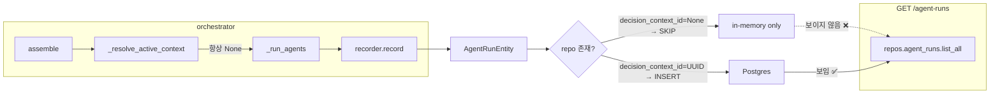
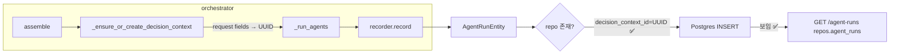
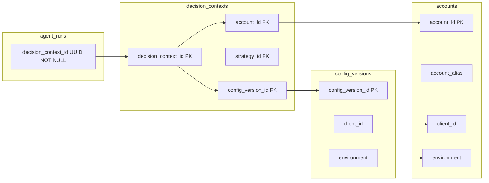

# 55: Write-Path 회피 수정 되돌리고 orchestrator가 decision_context 선확보

## 문제 요약

현재 Postgres 모드에서 `orchestrator → recorder → agent_runs` write path가 깨져있다.
원인은 `_resolve_active_context()`가 항상 `None`을 반환하고, 이 `None`이 그대로
`_run_agents()` → `recorder.record()` → `PostgresAgentRunRepository.add()`로 전달되어
`agent_runs.decision_context_id NOT NULL` 제약을 위반하기 때문이다.

**직전 수정 (회피책 — 되돌릴 대상)**:
- `recorder.py`에서 `decision_context_id is not None`일 때만 `repo.add()` 호출
- `recorder.py`에서 in-memory/repo merge 로직 추가 (`list_by_decision_context`, `list_all`)
- API가 `repos.agent_runs`에서 직접 읽으므로 merge는 무용 — 운영 경로에 agent_runs가 전혀 보이지 않음

**이번 수정 방향**:
- recorder 회피책을 제거하고 항상 `repo.add()`를 호출
- orchestrator가 agent 실행 전에 유효한 `decision_context_id`를 확보하도록 흐름 변경

---

## 보정사항 (사용자 피드백 반영)

1. `_ensure_or_create_decision_context()`는 무조건 생성하지 않는다.
   `account_id`, `strategy_id`, `config_version_id` **3개가 모두 유효하게 확보될 때만** 생성하고,
   하나라도 빠지면 `None`으로 fail-open 한다.
2. `repos.accounts.find_one()` — [`contracts.py`](src/agent_trading/repositories/contracts.py:71): 실제로 존재하는 메서드.
   `AccountLookup(account_alias=request.account_ref)` 경로 사용.
3. `repos.config_versions.get_active()` — [`contracts.py`](src/agent_trading/repositories/contracts.py:104): 실제로 존재하는 메서드.
   `(client_id, environment)` 파라미터 사용.
4. 테스트 최소 2개: (1) 생성 성공 경로 (2) 생성 불가 시 fail-open 유지 경로

---

## 아키텍쳐 분석

### 1. Agent runs data flow (현재)



### 2. Agent runs data flow (목표)



### 3. DecisionContextEntity FK chain



---

## 상세 설계

### Change 1: [`recorder.py`](src/agent_trading/services/ai_agents/recorder.py) — 회피 수정 되돌리기

**변경 사항**:

1. **Lines 177-180 (guard 제거)**: `if self._repo is not None and decision_context_id is not None:` 조건을 제거하고
   항상 `await self._repo.add(run)`을 호출한다.

2. **Lines 194-235 (merge 로직 제거)**: `list_by_decision_context()`와 `list_all()`에서 in-memory/repo merge를
   제거하고, repo가 있으면 repo에 위임, 없으면 in-memory에서 반환하는 단순 구조로 원복한다.

3. **유지할 코드**:
   - Lines 112-145: payload/storage semantic separation (correct)
   - Lines 147-168: synthetic UUID fallback 제거 (correct — orchestrator가 UUID 제공)
   - AgentRunEntity 생성 시 `decision_context_id` 파라미터 직접 전달

**결과**: recorder는 항상 `repo.add()`를 호출한다. `decision_context_id`가 None이면
Postgres NOT NULL 위반 예외가 발생한다 — 이는 호출자(orchestrator)의 책임을 명확히 드러낸다.

```python
# BEFORE (회피책 — 제거)
if self._repo is not None and decision_context_id is not None:
    persisted = await self._repo.add(run)
else:
    persisted = run

# AFTER (항상 위임)
if self._repo is not None:
    persisted = await self._repo.add(run)
else:
    persisted = run
```

```python
# BEFORE (merge — 제거)
async def list_by_decision_context(self, decision_context_id):
    repo_runs = ...
    if self._repo is not None:
        repo_runs = await self._repo.list_by_decision_context(decision_context_id)
    mem_runs = tuple(r for r in self._runs if r.decision_context_id == decision_context_id)
    seen = {r.agent_run_id for r in repo_runs}
    return tuple(list(repo_runs) + [r for r in mem_runs if r.agent_run_id not in seen])

# AFTER (단순 위임)
async def list_by_decision_context(self, decision_context_id):
    if self._repo is not None:
        return await self._repo.list_by_decision_context(decision_context_id)
    return tuple(r for r in self._runs if r.decision_context_id == decision_context_id)
```

---

### Change 2: [`decision_orchestrator.py`](src/agent_trading/services/decision_orchestrator.py) — `_ensure_or_create_decision_context()` 추가

#### 2a. 사용할 repository lookup 메서드 (실제 contract 기반)

| 필드 | 조회 경로 | 계약 위치 |
|------|-----------|-----------|
| `account_id` | `repos.accounts.find_one(AccountLookup(account_alias=request.account_ref))` | [`contracts.py:71`](src/agent_trading/repositories/contracts.py:71) |
| `strategy_id` | `UUID(request.strategy_id)` 문자열 파싱 | N/A (도메인 모델 필드) |
| `config_version_id` | `repos.config_versions.get_active(client_id, environment)` | [`contracts.py:104`](src/agent_trading/repositories/contracts.py:104) |

#### 2b. 생성 조건

**3개가 모두 유효할 때만** `DecisionContextEntity`를 생성하고 영속화한다:
1. `account` 조회 성공 (`account is not None`)
2. `strategy_id` UUID 파싱 성공
3. `config_version` 조회 성공 (`config_version is not None`)

하나라도 실패하면 → `None` 반환 (fail-open).

#### 2c. 새 메서드

`resolve_active_context`를 대체하는 새 메서드를 `assemble()` 호출 전에 삽입한다.

```python
async def _ensure_or_create_decision_context(
    self,
    request: SubmitOrderRequest,
    existing_context_id: UUID | None,
) -> UUID | None:
    """Agent 실행 전에 유효한 decision_context_id를 확보한다.

    생성 조건 (3개 모두 충족 시에만 생성)
    -------------------------------------
    1. request.account_ref → repos.accounts.find_one() → account (not None)
    2. request.strategy_id → UUID 파싱 성공
    3. account.client_id + account.environment → repos.config_versions.get_active() → config_version (not None)

    하나라도 실패하면 → None 반환 (fail-open: agent는 실행되나 영속화 안 됨)

    전략
    ----
    1. existing_context_id가 제공되고 DB에 존재하면 → 그대로 반환
    2. existing_context_id가 제공됐지만 DB에 없으면 → 같은 ID로 생성 시도 (fall through)
    3. existing_context_id가 None이면 → request fields에서 새 ID로 생성 시도
    """

    # Case 1: existing_context_id가 제공되고 DB에 존재함
    if existing_context_id is not None:
        context = await self._resolve_decision_context(existing_context_id)
        if context is not None:
            return existing_context_id
        # DB에 없으면 → 해당 ID로 생성 시도 (fall through)

    # Case 2: request fields에서 FK chain resolution
    from agent_trading.repositories.filters import AccountLookup

    try:
        # 조건 1: account_ref → account
        account = await self._repos.accounts.find_one(
            AccountLookup(account_alias=request.account_ref)
        )
        if account is None:
            logger.warning(
                "Cannot create decision context: account not found for ref=%s",
                request.account_ref,
            )
            return None

        # 조건 2: strategy_id 파싱
        try:
            strategy_id = UUID(request.strategy_id)
        except (ValueError, AttributeError):
            logger.warning(
                "Cannot create decision context: invalid strategy_id=%s",
                request.strategy_id,
            )
            return None

        # 조건 3: client_id + environment → active config version
        config_version = await self._repos.config_versions.get_active(
            client_id=account.client_id,
            environment=account.environment,
        )
        if config_version is None:
            logger.warning(
                "Cannot create decision context: no active config version "
                "for client=%s env=%s",
                account.client_id,
                account.environment,
            )
            return None

        # --- 모든 조건 충족 → DecisionContextEntity 생성 ---
        now = datetime.now(timezone.utc)
        context_id = existing_context_id or uuid4()
        correlation_id = request.correlation_id or str(uuid4())

        context = DecisionContextEntity(
            decision_context_id=context_id,
            account_id=account.account_id,
            strategy_id=strategy_id,
            config_version_id=config_version.config_version_id,
            market_timestamp=now,
            correlation_id=correlation_id,
            created_at=now,
        )

        saved = await self._repos.decision_contexts.add(context)
        logger.info(
            "Created decision context: id=%s account_id=%s strategy_id=%s "
            "correlation_id=%s",
            saved.decision_context_id,
            saved.account_id,
            saved.strategy_id,
            saved.correlation_id,
        )
        return saved.decision_context_id

    except Exception:
        logger.warning(
            "Failed to create decision context — agent runs will proceed "
            "without persistence. account_ref=%s",
            request.account_ref,
            exc_info=True,
        )
        return None
```

#### 2b. `assemble()` 호출부 변경 (lines 324-327)

```python
# BEFORE
resolved_context_id = decision_context_id
if resolved_context_id is None:
    resolved_context_id = await self._resolve_active_context()

# AFTER
resolved_context_id = await self._ensure_or_create_decision_context(
    request, decision_context_id
)
```

**중요**: `_resolve_active_context()`는 그대로 유지한다 (향후 hook). 단, `assemble()`에서 호출하지 않는다.

#### 2c. `_run_agents()` 로깅 메시지 변경 (lines 595-600)

```python
# BEFORE
if decision_context_id is None:
    logger.info(
        "No active decision context — agent runs will be kept "
        "in-memory only (not persisted). correlation_id=%s",
        correlation_id,
    )

# AFTER (선택적 — 유지해도 무방, 하지만 운영 경로에서는 거의 발생하지 않음)
```

---

### Change 3: [`test_decision_orchestrator.py`](tests/services/test_decision_orchestrator.py) — 테스트 보강

#### 3a. `test_assemble_creates_decision_context_when_not_provided` (신규)

`seeded_service` fixture에 account를 추가하여 orchestrator가 context를 생성할 수 있도록 한다.

```python
@pytest.fixture
def seeded_service_with_account() -> DecisionOrchestratorService:
    """Service with a seeded account and config version for context creation."""
    repos = build_in_memory_repositories()
    now = datetime.now(timezone.utc)

    # Seed an account matching sample_request.account_ref="test_account"
    account = AccountEntity(
        account_id=uuid4(),
        client_id=uuid4(),
        broker_account_id=uuid4(),
        environment=Environment.PAPER,
        account_alias="test_account",
        account_masked="test-****",
        status="active",
    )
    repos.accounts._items[account.account_id] = account

    # Seed a config version
    config_version = ConfigVersionEntity(
        config_version_id=uuid4(),
        client_id=account.client_id,
        environment=Environment.PAPER,
        version_tag="v1.0",
        config_json={},
        checksum="abc123",
        activated_at=now,
    )
    repos.config_versions._items[config_version.config_version_id] = config_version

    return DecisionOrchestratorService(repos=repos)


@pytest.mark.asyncio
async def test_assemble_creates_decision_context_when_not_provided(
    seeded_service_with_account, sample_request
):
    """Orchestrator creates a decision context when none is provided."""
    service = seeded_service_with_account
    intent = await service.assemble(sample_request)

    # Context should have been created
    assert intent.decision_context_id is not None
    assert intent.request.decision_context_id == str(intent.decision_context_id)

    # Verify context was persisted
    context = await service._repos.decision_contexts.get(
        intent.decision_context_id
    )
    assert context is not None
    assert context.account_alias ...  # verify fields

    # Verify 3 agent runs recorded
    runs = await service._agent_recorder.list_all()
    assert len(runs) == 3
```

#### 3b. `test_assemble_without_optional_fields` 수정 (lines 138-153)

이 테스트는 빈 in-memory repo를 사용하므로 context 생성이 실패하고 `None`을 반환한다.
이 동작은 변경되지 않으므로 테스트는 그대로 통과한다.

```python
# 변경 불필요 — empty repo → context 생성 실패 → decision_context_id is None
assert intent.decision_context_id is None  # 유지
```

#### 3c. Postgres smoke test: orchestrator → persistance → API 검증 (test_postgres_inspection.py or 신규)

`test_postgres_agent_runs.py`의 `seeded_decision_context` fixture를 활용하여
orchestrator를 실제 Postgres 환경에서 실행하고 agent_runs가 DB에 저장되는지 검증한다.

```python
# tests/repositories/test_postgres_agent_runs.py (추가)
@pytest.mark.asyncio
async def test_orchestrator_persists_agent_runs_via_recorder(
    seeded_postgres_data,  # account + config_version + instrument
):
    """Orchestrator → recorder → Postgres agent_runs write path."""
    repos, _, _, _ = seeded_postgres_data

    # Create orchestrator with real Postgres repos
    service = DecisionOrchestratorService(repos=repos)
    request = SubmitOrderRequest(
        account_ref="test_account",
        ...
    )

    intent = await service.assemble(request)

    # Verify: agent_runs exist in Postgres
    runs = await repos.agent_runs.list_by_decision_context(
        intent.decision_context_id
    )
    assert len(runs) == 3
```

---

## 변경 금지 목록 (compliance check)

| 항목 | 상태 | 설명 |
|------|------|------|
| broker submit semantics | ✅ 변경 없음 | orchestrator는 submit path 건드리지 않음 |
| hard guardrail 위치 | ✅ 변경 없음 | 
| reconciliation-first 정책 | ✅ 변경 없음 |
| admin UI | ✅ 변경 없음 |
| agent_runs.decision_context_id nullable migration | ✅ 변경 없음 | column은 NOT NULL 유지 |
| synthetic UUID FK 위반 복원 | ✅ 복원 금지 | orchestrator가 유효 UUID 제공 |

---

## 영향 분석

### 기존 테스트

| 테스트 | 영향 | 이유 |
|--------|------|------|
| `test_assemble_returns_order_intent` | ✅ 통과 | caller가 `decision_context_id` 제공 → orchestrator가 그대로 사용 |
| `test_assemble_without_optional_fields` | ✅ 통과 | empty repo → context 생성 실패 → `None` 반환 (기존 동일) |
| `test_assemble_preserves_request_fields` | ✅ 통과 | fields 보존 로직 변경 없음 |
| `test_assemble_and_create_order_full_flow` | ✅ 통과 | 이미 context ID 제공 |
| `test_assemble_creates_decision_context_when_not_provided` | ✅ 신규 | 새 fixture + 새 assertion |
| Postgres smoke tests (`test_postgres_inspection.py`) | ✅ 통과 | 기존 seeded data로 읽기 경로 검증 |

### 비-회귀

- In-memory 모드: `decision_context_id=None`에서 recorder는 `None`을 그대로 전달.
  `InMemoryAgentRunRepository.add()`는 `None`을 허용하므로 정상 동작.
- Postgres 모드: orchestrator가 항상 유효 UUID를 제공하므로 NOT NULL/FK 위반 없음.
- Context 생성 실패 시: `None` 반환 → agent는 실행되나 영속화되지 않음 (edge case).

---

## 실행 단계 (Code mode)

### Step 1: [`recorder.py`](src/agent_trading/services/ai_agents/recorder.py) 되돌리기

1. Lines 177-180: `if self._repo is not None and decision_context_id is not None:` → `if self._repo is not None:`
2. Lines 194-218: `list_by_decision_context` — merge 로직 제거, 단순 위임으로 변경
3. Lines 220-235: `list_all` — merge 로직 제거, 단순 위임으로 변경
4. Docstring 업데이트 (회피책 설명 제거)

### Step 2: [`decision_orchestrator.py`](src/agent_trading/services/decision_orchestrator.py) 수정

1. 새 메서드 `_ensure_or_create_decision_context()` 추가 (lines 520-546 위치)
2. `assemble()`의 `_resolve_active_context()` 호출을 `_ensure_or_create_decision_context()`로 대체
3. Import 추가: `AccountLookup` from filters

### Step 3: [`test_decision_orchestrator.py`](tests/services/test_decision_orchestrator.py) 보강

1. `seeded_service_with_account` fixture 추가
2. `test_assemble_creates_decision_context_when_not_provided` 테스트 추가

### Step 4: Postgres 재검증

1. pytest 실행: `pytest tests/ -x -v --timeout=60`
2. Postgres smoke test 실행: `pytest tests/repositories/test_postgres_agent_runs.py -x -v --timeout=60`
3. 전체 E2E Postgres path 검증
