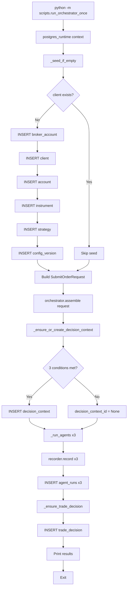

# Plan 56: Orchestrator Runtime Entrypoint

## Problem

`orchestrator.assemble()`가 production에서 단 한 번도 호출되지 않는다. API 서버는 read-only이고, Postgres DB는 비어 있다 (`decision_contexts=0`, `trade_decisions=0`, `agent_runs=0`). 클라이언트 화면에 데이터가 표시되지 않는 근본 원인이다.

## Goal

Postgres 모드에서 orchestrator를 한 번 실행해 `decision_contexts`, `trade_decisions`, `agent_runs`가 생성되는 **최소 경로**를 만든다.

**절대 broker submit까지 가지 않게 한다.**

---

## Step 1: Seed Prerequisite (FK Chain)

### orchestrator.assemble() → `_ensure_or_create_decision_context()` 3 conditions

| # | Condition | Required DB Rows | Request Field | Lookup Method |
|---|-----------|-----------------|---------------|---------------|
| 1 | Account lookup | `broker_accounts` + `accounts` + `clients` | `request.account_ref` | `repos.accounts.find_one(AccountLookup(account_alias=...))` |
| 2 | Strategy UUID parse | `strategies` | `request.strategy_id` | `UUID(request.strategy_id)` (parse only, no DB lookup) |
| 3 | Active config version | `config_versions` (with non-NULL `activated_at`) | — (uses `account.client_id` + `account.environment`) | `repos.config_versions.get_active(client_id, environment)` |

### FK Dependency Graph

```
broker_accounts (broker_account_id)
  └── accounts.broker_account_id ──→ account_id ──→ decision_contexts.account_id
                                                       │
clients (client_id) ──→ accounts.client_id            │
  │                      strategies.client_id          │
  └─── config_versions.client_id ──→ config_version_id ──→ decision_contexts.config_version_id
                                                       │
strategies (strategy_id) ──────────────────────────────→ decision_contexts.strategy_id
                                                       │
                                              decision_contexts.decision_context_id
                                                       │
                                              trade_decisions.decision_context_id
                                                       │
                                              agent_runs.decision_context_id

instruments (optional, fail-open) — used only for position symbol filtering
```

### Minimum Seed Fields (per entity)

| Entity | Required Fields |
|--------|----------------|
| `BrokerAccountEntity` | `broker_account_id`, `broker_name`, `account_ref`, `environment`, `credential_ref`, `base_url`, `status` |
| `ClientEntity` | `client_id`, `client_code`, `name`, `status`, `base_currency` |
| `AccountEntity` | `account_id`, `client_id`, `broker_account_id`, `environment`, `account_alias`, `account_masked`, `status` |
| `StrategyEntity` | `strategy_id`, `client_id`, `strategy_code`, `name`, `asset_class`, `status` |
| `ConfigVersionEntity` | `config_version_id`, `client_id`, `environment`, `version_tag`, `config_json`, `checksum`, `activated_at` (**must not be NULL**) |

### orchestrator 하위 생성

- **`_run_agents()`**: `decision_context_id`가 not None이면 3개 agent (EI, AR, FDC) 실행 → `recorder.record()` 3회 → `agent_runs`에 3행 INSERT
- **`_ensure_trade_decision()`**: `decision_context_id`가 not None이면 `TradeDecisionEntity` 생성 → `trade_decisions`에 1행 INSERT (stub agent 기준 safe fallback values)

---

## Step 2: Entrypoint Design — `scripts/run_orchestrator_once.py`

### Location

`scripts/run_orchestrator_once.py` (신규 파일)

### Runtime Pattern

```python
async with postgres_runtime() as runtime:
    repos: RepositoryContainer = runtime["repositories"]
    orchestrator: DecisionOrchestratorService = runtime["orchestrator"]

    # 1. Seed prerequisites (idempotent)
    await _seed_if_empty(repos)

    # 2. Build SubmitOrderRequest with valid UUID strategy_id
    request = SubmitOrderRequest(
        account_ref="entrypoint-account",
        strategy_id=str(STRATEGY_ID),  # valid UUID
        symbol="005930",
        market="KRX",
        side=OrderSide.BUY,
        order_type=OrderType.LIMIT,
        quantity=Decimal("10"),
        price=Decimal("50000"),
    )

    # 3. Run orchestrator.assemble()
    intent = await orchestrator.assemble(request)

    # 4. Print results
    print(f"decision_context_id: {intent.decision_context_id}")
    ...
```

### Seed Logic (`_seed_if_empty`)

- `repos.clients.get_by_code("ENTRYPOINT")` → 있으면 skip
- 없으면: broker_account → client → account → instrument → strategy → config_version 순서로 INSERT
- ConfigVersionEntity의 `activated_at`은 반드시 현재 시각으로 설정 (NULL이면 `get_active()`가 찾지 못함)

### Submit 차단

- `OrderManager.create_order()` 또는 `KoreaInvestmentAdapter.submit_order()` 호출 금지
- `assemble()`은 `OrderIntent`만 반환하고 종료 — broker submit 경로 없음
- 추가 하드가드: `_ensure_trade_decision()`은 entity 생성까지만 하고 종료 (현재 구현상 broker 호출 없음)

---

## Step 3: Integration Test — `tests/test_orchestrator_entrypoint.py`

### Test 1: `test_entrypoint_seeds_and_assembles`

- `scripts.run_orchestrator_once._seed_if_empty()` 호출 → DB에 seed 데이터 존재 확인
- `orchestrator.assemble(request)` 호출 → `OrderIntent` 반환 확인
- `intent.decision_context_id` is not None 확인
- DB 조회: `decision_contexts` 1행, `trade_decisions` 1행, `agent_runs` 3행 확인

### Test 2: `test_entrypoint_idempotent_seed`

- `_seed_if_empty()` 2회 연속 호출 → 중복 INSERT 없음 (UNIQUE constraint violation 없음)

### Test 3: `test_entrypoint_no_broker_submit`

- `monkeypatch`로 `OrderManager.create_order()` 차단 → 호출되지 않음을 확인

---

## Step 4: Execution & Verification

### 실행 명령

```bash
# docker-compose Postgres가 실행 중인 상태에서:
cd /workspace/agent_trading
python -m scripts.run_orchestrator_once
```

### 검증 항목

1. 로그 출력: `decision_context_id`, `trade_decision_id`, agent runs 3건
2. API 조회: `GET /trade-decisions` (port 8000) → `[ { ... } ]` (1행)
3. API 조회: `GET /agent-runs` → `[ { ... }, { ... }, { ... } ]` (3행)
4. Docker DB 직접 확인: `SELECT COUNT(*) FROM trading.decision_contexts` = 1

---

## 변경 금지 목록 (Compliance)

| 항목 | 상태 |
|------|------|
| broker submit semantics (`OrderManager.create_order()`, `ReconciliationService`) | ❌ 변경 금지 |
| `decision_orchestrator.py` 로직 | ❌ 변경 금지 (seed/entrypoint만 추가) |
| `runtime/bootstrap.py` | ✅ entrypoint에서 import만 사용, 수정 금지 |
| admin UI | ❌ 변경 금지 |
| inspection API contract | ❌ 변경 금지 |
| KIS live/paper submit | ❌ 변경 금지 |
| scheduler/cron/full worker system | ❌ 변경 금지 (단순 1회 실행) |

---

## 파일 변경 요약

| 파일 | 작업 | 설명 |
|------|------|------|
| `scripts/run_orchestrator_once.py` | **생성** | Main entrypoint: seed + assemble + print |
| `tests/test_orchestrator_entrypoint.py` | **생성** | Integration test |
| `pyproject.toml` | **수정** | (선택) `[project.scripts]`에 `run-orch` console_script 추가 |

---

## Mermaid Flow


