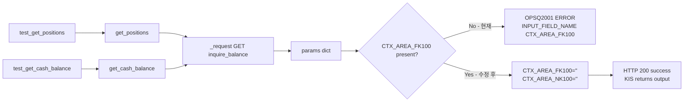

# Plan 61 — KIS Paper `OPSQ2001` 수정: `inquire_balance` 요청 파라미터 정렬

## 1. 문제 분석

### 현재 상태

`test_get_positions` 실행 시 다음과 같은 에러 발생:

```
BrokerError: koreainvestment | api_error |
KIS inquire_balance: business error (rt_cd=2, msg_cd=OPSQ2001):
ERROR : INPUT_FIELD_NAME CTX_AREA_FK100
```

**특징**:
- HTTP 200 (정상 응답), `rt_cd=2` (KIS 비즈니스 에러)
- `OPSQ2001`은 `_KNOWN_FAILURE_CODES`나 `_AMBIGUOUS_ERROR_CODES`에 **없음**
- 따라서 `BrokerErrorType.API_ERROR`로 일반 API 에러 처리됨
- `test_get_cash_balance`는 동일한 `inquire_balance` 엔드포인트를 호출하지만 다른 에러 (RuntimeError)로 실패

### 현재 요청 파라미터 (`get_positions`, `get_cash_balance`)

```python
params = {
    "CANO": self.account_number,           # 계좌번호
    "ACNT_PRDT_CD": self.account_product_code,  # 계좌상품코드
    "AFHR_FLPR_YN": "N",                   # 시간외단일가여부
    "OFL_YN": "",                           # 오프라인여부
    "INQR_DVSN": "01",                     # 조회구분 (01=전체)
    "UNPR_DVSN": "01",                     # 단가구분
    "FUND_STTL_ICLD_YN": "N",              # 펀드결제분포함여부
    "FNCG_AMT_AUTO_RDPT_YN": "N",          # 융자금액자동상환여부
    "PRCS_DVSN": "01",                     # 처리구분
    "COST_ICLD_YN": "N",                   # 비용포함여부
}
```

### 누락된 필드

KIS `inquire-balance` API 문서에 따르면, 요청에 **필수**로 포함되어야 하는 연속조회(continuation) 파라미터가 누락되어 있음:

| 필드 | 설명 | 첫 조회 시 값 |
|------|------|--------------|
| `CTX_AREA_FK100` | 연속조회검색조건100 | 빈 문자열 `""` |
| `CTX_AREA_NK100` | 연속조회키100 | 빈 문자열 `""` |

KIS 문서에서 `inquire_balance`는 "연속조회 필요"로 명시되어 있으며, 이 필드들은 **최초 조회라도 반드시 포함**해야 한다. 빈 문자열로 전송하면 KIS가 "첫 페이지 요청"으로 인식한다.

### 근거

KIS OpenAPI의 연속조회(페이징) 규약:
- 모든 조회系 API (`inquire-balance`, `inquire-daily-ccld` 등)는 `CTX_AREA_FK100` + `CTX_AREA_NK100` 필드를 요구
- 최초 조회: 두 필드를 빈 문자열 `""`로 설정
- 연속 조회: 이전 응답에서 받은 `CTX_AREA_FK100` + `CTX_AREA_NK100` 값을 그대로 전송
- 이 필드가 누락되면 `OPSQ2001: INPUT_FIELD_NAME CTX_AREA_FK100` 에러 발생

## 2. 수정안

### 변경 대상: `get_positions()`와 `get_cash_balance()`

두 메서드 모두 `inquire_balance` 엔드포인트를 호출하므로 동일한 수정이 필요하다.

**수정 전:**
```python
params = {
    "CANO": self.account_number,
    "ACNT_PRDT_CD": self.account_product_code,
    "AFHR_FLPR_YN": "N",
    "OFL_YN": "",
    "INQR_DVSN": "01",
    "UNPR_DVSN": "01",
    "FUND_STTL_ICLD_YN": "N",
    "FNCG_AMT_AUTO_RDPT_YN": "N",
    "PRCS_DVSN": "01",
    "COST_ICLD_YN": "N",
}
```

**수정 후:**
```python
params = {
    "CANO": self.account_number,
    "ACNT_PRDT_CD": self.account_product_code,
    "AFHR_FLPR_YN": "N",
    "OFL_YN": "",
    "INQR_DVSN": "01",
    "UNPR_DVSN": "01",
    "FUND_STTL_ICLD_YN": "N",
    "FNCG_AMT_AUTO_RDPT_YN": "N",
    "PRCS_DVSN": "01",
    "COST_ICLD_YN": "N",
    "CTX_AREA_FK100": "",   # 연속조회검색조건100 (최초조회: 빈값)
    "CTX_AREA_NK100": "",   # 연속조회키100 (최초조회: 빈값)
}
```

### 변경 금지
- `live/real` 경로 사용 — 금지
- `broker submit semantics` 변경 — 금지
- `admin UI` 변경 — 금지
- `inquire_daily_ccld` (`get_fills`) — 현재 PASS 상태이므로 불필요한 변경 금지
- `get_quote`, `get_orderbook` — 관련 없음

## 3. 영향 분석

### `get_positions()` — `inquire_balance` 호출
- `CTX_AREA_FK100=""`, `CTX_AREA_NK100=""` 추가
- `OPSQ2001` 해소 예상
- 응답 `output` 구조는 동일하므로 파싱 로직 변경 불필요

### `get_cash_balance()` — `inquire_balance` 호출
- 동일한 수정
- 단, `test_get_cash_balance`는 현재 RuntimeError로 실패하므로 이 수정만으로는 PASS 보장 불가
- RuntimeError는 별도 이슈

### `inquire_daily_ccld` (`get_fills`)
- 현재 PASS 상태이므로 수정 불필요
- 단, 장기적으로는 동일한 `CTX_AREA_FK100`/`CTX_AREA_NK100` 이슈가 발생할 가능성 있음
- 이번 작업 범위 밖

### `_raise_on_error()` — `OPSQ2001` 처리
- `OPSQ2001`은 `inquire_balance`에서만 발생하는 필드 누락 에러
- 요청 파라미터 수정으로 원인 제거되므로 `_raise_on_error()` 수정 불필요
- 만약 다른 컨텍스트에서도 발생한다면, `_KNOWN_FAILURE_CODES`에 등록 검토 가능

## 4. 변경 파일 목록

| 파일 | 변경 내용 | 영향 범위 |
|------|-----------|-----------|
| `src/agent_trading/brokers/koreainvestment/rest_client.py` | `get_positions()`와 `get_cash_balance()`의 `inquire_balance` 요청 params에 `CTX_AREA_FK100`, `CTX_AREA_NK100` 추가 | `inquire_balance` 호출 (2개 메서드) |

## 5. 검증 계획

### 5.1 단위 테스트 (기존 67개 통과 확인)
```bash
pytest -q tests/brokers/test_rate_limit.py tests/brokers/test_kis_adapter_validation.py tests/brokers/test_budget_exhaustion.py tests/services/ai_agents/test_settings.py -v
```

### 5.2 `test_get_positions` 단독 실행
```bash
pytest -q tests/smoke/test_kis_paper_smoke.py -k test_get_positions -v
```

### 5.3 Account 관련 테스트 전체 실행
```bash
pytest -q tests/smoke/test_kis_paper_smoke.py -k "positions or cash_balance or fills" -v
```

### 5.4 전체 Smoke 테스트 실행
```bash
pytest -q tests/smoke/test_kis_paper_smoke.py -v --cache-clear
```

## 6. 기대 효과

| 테스트 | 현재 결과 | 예상 결과 |
|--------|-----------|-----------|
| `test_get_positions` | OPSQ2001 FAIL | ✅ PASS (CTX_AREA_FK100 추가로) |
| `test_get_cash_balance` | RuntimeError FAIL | ⚠️ 동일 (RuntimeError는 별도 이슈) |
| `test_get_fills` | PASS | ✅ 유지 |
| 기타 단위 테스트 | 67 PASS | ✅ 유지 |
| 전체 smoke | 3/8 | 4/8 (RuntimeError 4건 별도) |

## 7. Todo List

```markdown
[ ] Step 1: `get_positions()` params에 `CTX_AREA_FK100`, `CTX_AREA_NK100` 추가
[ ] Step 2: `get_cash_balance()` params에 `CTX_AREA_FK100`, `CTX_AREA_NK100` 추가
[ ] Step 3: 기존 단위 테스트 실행 (67개 통과 확인)
[ ] Step 4: `test_get_positions` 단독 실행 (OPSQ2001 해소 확인)
[ ] Step 5: Account 관련 테스트 전체 실행
[ ] Step 6: 결과 분류 (OPSQ2001 resolved / changed / remaining)
```

## 8. Mermaid: `inquire_balance` 요청 흐름



## 9. 핵심 원칙

1. **가장 작은 수정** — 단순히 누락된 필드 2개를 추가하는 것이 전부
2. **생산 코드만 변경** — `rest_client.py`만 수정, 테스트 코드 수정 불필요
3. **OPSQ2001 해소가 목표** — RuntimeError는 별도 이슈로 분리
4. **연속조회 기능은 추가 안 함** — CTX_AREA를 빈값으로 보내 첫 페이지 조회만 함. 연속조회(페이징)는 이번 작업 범위 밖
