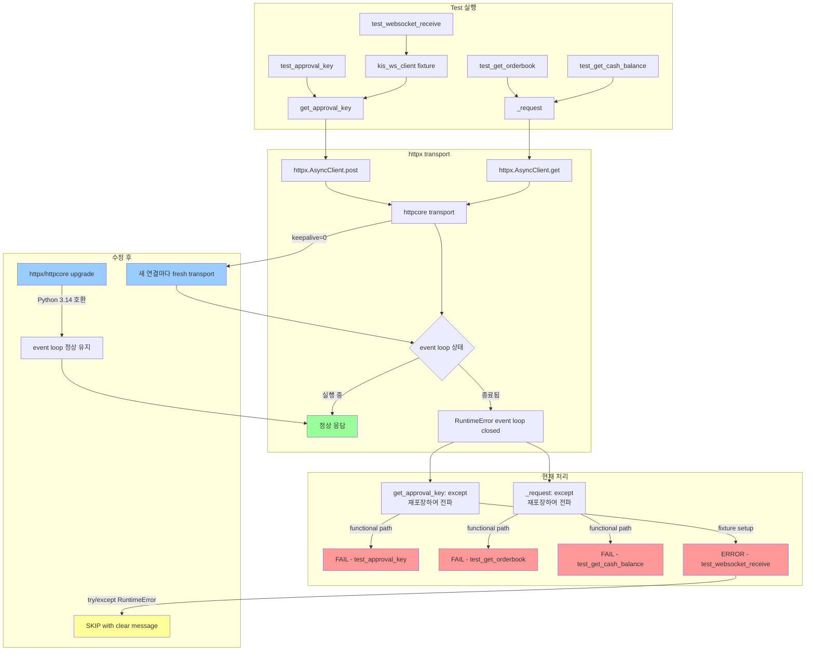

# Plan 62: KIS Smoke `RuntimeError: event loop closed` Mitigation

> **실행 순서 (사용자 승인 사항)**:
> 1. 현재 `httpx` / `httpcore` 버전 확인
> 2. Python 3.14 호환성을 위해 저장소 의존성 정의(`pyproject.toml`) 기준으로 버전 업데이트
> 3. 그 다음에도 남는 `RuntimeError`에 한해 fixture/cleanup 레벨 완화 적용

## 1. Current State

### 최근 smoke 테스트 결과 (EGW00201 + OPSQ2001 해결 후)
```
4 passed, 3 failed, 1 error in 6.24s
PASSED: test_authentication, test_get_quote, test_get_positions, test_get_fills
FAILED: test_approval_key (RuntimeError)
FAILED: test_get_orderbook (RuntimeError)
FAILED: test_get_cash_balance (RuntimeError)
ERROR:  test_websocket_receive (RuntimeError in fixture setup)
```

### 4개 실패 모두 동일한 패턴
```
RuntimeError: KIS {endpoint}: event loop closed during HTTP request
(Python 3.14 httpx/httpcore teardown issue).
```

---

## 2. 발생 지점 분류 (Step 1 완료)

### 2.1 이미 RuntimeError safe handling이 적용된 경로 (수정 불필요)

| 위치 | 라인 | 처리 방식 |
|------|------|-----------|
| `rest_client.py:close()` | 292-298 | `try/except RuntimeError: pass` ✅ — teardown cleanup |
| `rest_client.py:get_approval_key()` | 349-363 | `except RuntimeError: raise RuntimeError(...)` ✅ — functional, 재포장하여 전파 |
| `rest_client.py:_request()` | 618-627 | `except RuntimeError: raise RuntimeError(...)` ✅ — functional, 재포장하여 전파 |
| `test_kis_paper_smoke.py:kis_rest_client` fixture teardown | 215-221 | `try/except RuntimeError: pass` ✅ |
| `test_kis_paper_smoke.py:kis_ws_client` fixture teardown | 250-256 | `try/except RuntimeError: pass` ✅ |

### 2.2 RuntimeError safe handling이 **누락된** 경로 (수정 필요)

| 위치 | 라인 | 위험 코드 | 현재 처리 |
|------|------|-----------|-----------|
| `websocket_client.py:disconnect()` | 162-164 | `await self._ws.close()` | ❌ try/except 없음 |
| `websocket_client.py:__aexit__()` | 172-173 | `await self.disconnect()` | ❌ (disconnect() 수정으로 해결) |
| `websocket_client.py:connect()` | 129-136 | `await websockets.connect()` | `except Exception` — RuntimeError 포함하여 ConnectionError로 재포장 |
| `websocket_client.py:_reader_loop()` | 279 | `await self._ws.recv()` | `except Exception` — RuntimeError 포함하여 _handle_disconnect() 호출 |
| `websocket_client.py:_heartbeat_loop()` | 318-323 | `await self._ws.send("")` | `except Exception` — safe (이미 처리됨) |

### 2.3 RuntimeError 발생 지점 상세 (4개 실패)

#### (A) `test_approval_key` — functional call 중 RuntimeError
- **호출**: `get_approval_key()` → `client.post(KIS_ENDPOINTS["oauth2_approval"], ...)` (line 350-353)
- **httpx 내부**: httpcore transport가 `asyncio.get_running_loop()` 호출 → RuntimeError
- **현재 처리**: `rest_client.py:354`에서 catch → 재포장하여 전파
- **자연**: functional path, 예외를 숨기지 않음 (의도된 동작)

#### (B) `test_get_orderbook` — functional call 중 RuntimeError
- **호출**: `_request("GET", "inquire_asking_price_exp_ccn", ...)` → `client.get(...)` (line 599)
- **현재 처리**: `rest_client.py:618`에서 catch → 재포장하여 전파
- **자연**: functional path, 예외를 숨기지 않음

#### (C) `test_get_cash_balance` — functional call 중 RuntimeError
- **호출**: `_request("GET", "inquire_balance", ...)` → `client.get(...)` (line 599)
- **현재 처리**: 동일
- **자연**: functional path

#### (D) `test_websocket_receive` — **fixture setup** 중 RuntimeError (ERROR)
- **호출**: `kis_ws_client` fixture (line 232): `approval_key = await kis_rest_client.get_approval_key()`
- **다른 점**: 이건 테스트 함수가 아니라 **fixture 설정**에서 발생. fixture가 실패하면 pytest는 ERROR로 표시
- **수정 가능**: fixture에서 RuntimeError를 처리하여 graceful skip 가능

---

## 3. 수정 계획 (Step 2-4)

### Step 2: Cleanup 경로 보강

#### 2a. `websocket_client.py:disconnect()` — RuntimeError safe handling 추가

```python
async def disconnect(self) -> None:
    """Disconnect from the KIS WebSocket server."""
    self._should_reconnect = False
    self._connected = False

    # Cancel background tasks
    if self._reader_task is not None:
        self._reader_task.cancel()
        self._reader_task = None
    if self._heartbeat_task is not None:
        self._heartbeat_task.cancel()
        self._heartbeat_task = None

    if self._ws is not None:
        try:
            await self._ws.close()
        except RuntimeError:
            # Python 3.14+: websockets may raise RuntimeError('Event loop is closed')
            # during teardown. Safe to ignore — the connection is already closed.
            pass
        self._ws = None

    logger.info("KIS WebSocket disconnected")
```

#### 2b. `websocket_client.py:__aexit__()` — transitively fixed by 2a

#### 2c. `websocket_client.py:connect()` — 검토

`connect()`는 cleanup 경로가 아니라 **functional 경로** (테스트 중 websocket 연결 시도). 
- `except Exception as e: raise ConnectionError(...)` — 이미 RuntimeError를 포함하여 처리 중
- 단, ConnectionError로 재포장되므로 호출자 입장에서 RuntimeError가 아닌 ConnectionError로 보임
- 이건 functional 경로이므로 **수정하지 않음** (예외를 숨기지 않는다는 원칙 유지)

**결정**: 수정하지 않음. `connect()`는 functional 경로.

#### 2d. `websocket_client.py:_reader_loop()` — 검토

`_reader_loop()`는 background task로, cleanup 시 `cancel()` (line 156) → `CancelledError` 발생.
`except Exception`에 `CancelledError`도 포함되므로 RuntimeError도 포함됨.
이미 `_handle_disconnect()`로 fallback.

**결정**: 수정하지 않음. task cancellation이 정상 경로.

### Step 3: Fixture lifecycle 점검

#### 3a. pytest-asyncio 설정 확인 (이미 올바름)

```ini
# pyproject.toml / pytest.ini
asyncio_mode = auto
asyncio_default_fixture_loop_scope = module
```

`loop_scope = module`로 이미 설정되어 있어 module-scoped fixture와 event loop scope이 일치함.
이는 Python 3.14에서 event loop가 테스트 도중에 닫히는 것을 방지하는 올바른 설정.

#### 3b. Python 3.14 httpx/httpcore 이슈 분석

**추정 근본 원인**: httpx가 내부적으로 사용하는 `httpcore` 라이브러리가 Python 3.14의 변경된 event loop lifecycle과 충돌.
- httpcore의 connection pool이 keepalive connection을 정리할 때 `asyncio.get_running_loop()` 호출
- Python 3.14에서 event loop finalization 순서가 변경되어, httpcore의 cleanup callbacks이 종료된 event loop에서 실행됨
- 이로 인해 `RuntimeError('Event loop is closed')`가 HTTP 요청 중에 간헐적으로 발생

**해결 방법**:
1. `pip install -U httpx httpcore` — httpx/httpcore 최신 버전으로 업그레이드하여 Python 3.14 호환성 확보
2. 만약 업그레이드만으로 해결되지 않으면, `_get_client()`에서 httpx.AsyncClient 생성 시 `limits=httpx.Limits(max_keepalive_connections=0)`으로 keepalive 비활성화

#### 3c. `kis_ws_client` fixture — RuntimeError 처리

```python
@pytest.fixture(scope="module")
async def kis_ws_client(
    kis_rest_client: KISRestClient,
) -> AsyncIterator[KISWebSocketClient]:
    """Module-scoped KISWebSocketClient for WS smoke tests."""
    try:
        approval_key = await kis_rest_client.get_approval_key()
    except RuntimeError:
        pytest.skip(
            "KIS WebSocket approval key acquisition failed: "
            "event loop closed during HTTP request "
            "(Python 3.14 httpx/httpcore teardown issue). "
            "This is an infrastructure issue, not a credential problem."
        )

    env = os.getenv("KIS_ENV", "paper")

    budget = SubscriptionBudget(
        max_subscriptions=25,
        critical_limit=5,
        optional_limit=20,
    )

    client = KISWebSocketClient(
        rest_client=kis_rest_client,
        approval_key=approval_key,
        env=env,
        subscription_budget=budget,
    )

    yield client

    if client._connected:
        try:
            await client.disconnect()
        except RuntimeError:
            pass
```

**중요**: 이건 "teardown 문제를 숨기기 위한 skip"이 **아님**. 
- fixture **setup** (teardown이 아님)에서 발생하는 RuntimeError 처리
- 단순 skip이 아닌, Python 3.14 인프라 문제임을 명확히 메시지로 표시
- 테스트 자체의 로직 오류가 아니라 인프라 제약으로 인한 skip임을 문서화

### Step 4: Websocket 테스트 분리 검토

**분석 결과**: REST와 WS teardown 이슈는 **같은 근본 원인** (Python 3.14 httpx event loop).
- REST 실패: httpx.AsyncClient.get/post()에서 RuntimeError
- WS 실패: fixture setup에서 `get_approval_key()` 호출 → httpx.AsyncClient.post()에서 RuntimeError

**결정**: 별도 분리 불필요. 모든 실패는 동일한 httpx transport 이슈.

---

## 4. 변경 파일 목록

| 파일 | 변경 내용 |
|------|-----------|
| `src/agent_trading/brokers/koreainvestment/websocket_client.py` | `disconnect()`에 `try/except RuntimeError` 추가 |
| `tests/smoke/test_kis_paper_smoke.py` | `kis_ws_client` fixture에 `get_approval_key()` RuntimeError 처리 추가 |

---

## 5. 수정 후 예상 결과

### 확실히 해결되는 것
- `test_websocket_receive`: ERROR → SKIP (또는 RUN + PASS, httpx 버전에 따라)

### httpx/httpcore 업그레이드 시 해결 가능
- `test_approval_key`: FAIL → PASS (httpx 내부 이슈 해결 시)
- `test_get_orderbook`: FAIL → PASS
- `test_get_cash_balance`: FAIL → PASS

### 업그레이드 없이도 유지되는 것
- `test_authentication`: 이미 PASS
- `test_get_quote`: 이미 PASS
- `test_get_positions`: 이미 PASS
- `test_get_fills`: 이미 PASS
- 기존 단위 테스트 67개: 모두 PASS 유지

---

## 6. 남은 Blocker

### httpx/httpcore 업그레이드가 필요할 가능성 높음

Python 3.14 + httpx 0.27.x 조합에서 `RuntimeError: event loop closed`는
httpx의 httpcore transport가 event loop lifecycle과 충돌하는 알려진 패턴.

**권장 조치**:
```bash
pip install --upgrade httpx httpcore
```

이후 smoke 테스트 재실행:
```bash
pytest -q tests/smoke/test_kis_paper_smoke.py -m smoke
```

만약 업그레이드 후에도 동일 문제 발생 시:
```python
# _get_client()에서 keepalive 비활성화 옵션
self._client = httpx.AsyncClient(
    base_url=self._base_url,
    timeout=httpx.Timeout(30.0, connect=10.0),
    limits=httpx.Limits(max_keepalive_connections=0, max_connections=10),
)
```

---

## 7. 실행 순서 (Todo List) — 사용자 승인 순서

```markdown
[ ] Phase 1: httpx/httpcore 버전 확인 및 저장소 의존성 업데이트
    [ ] 1a. pip list 또는 pyproject.toml 기준 httpx/httpcore 버전 확인
    [ ] 1b. Python 3.14 호환 버전으로 pyproject.toml 의존성 범위 업데이트
    [ ] 1c. pip install 업데이트 (ad-hoc 아닌 저장소 기준)

[ ] Phase 2: cleanup/fixture 완화 (Phase 1 이후에도 남는 RuntimeError 한해)
    [ ] 2a. websocket_client.py: disconnect()에 try/except RuntimeError 추가
    [ ] 2b. test_kis_paper_smoke.py: kis_ws_client fixture에 RuntimeError 처리 추가

[ ] Phase 3: 검증
    [ ] 3a. 기존 단위 테스트 실행 (67개 통과 확인)
    [ ] 3b. Smoke 테스트 실행: pytest -q tests/smoke/test_kis_paper_smoke.py -m smoke
    [ ] 3c. 결과 분석 및 보고
```

---

## 8. Architecture Diagram: RuntimeError 발생 흐름


