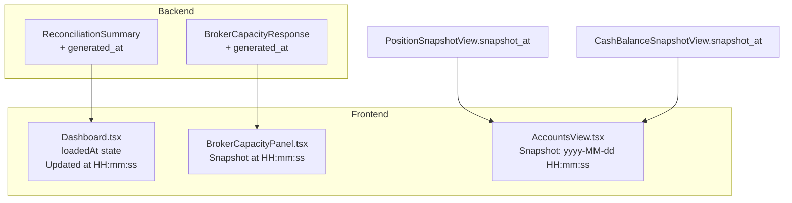

# 운영 패널 Freshness 가시화

## 목표
Dashboard / Accounts / Broker Capacity 패널에 마지막 갱신 시각을 일관되게 표시하여
운영자가 stale data를 빠르게 인지할 수 있게 한다.

## 현재 상태 분석

### Backend timestamp source 현황

| 응답 | timestamp 필드 | 현재 UI 표시 |
|------|---------------|-------------|
| `ReconciliationSummary` | 없음 | 없음 |
| `BrokerCapacityResponse` | 없음 | 없음 |
| `PositionSnapshotView` | `snapshot_at: datetime` ✅ | AccountsView에 표시 중 (원시값) |
| `CashBalanceSnapshotView` | `snapshot_at: datetime` ✅ | AccountsView에 표시 중 (원시값) |

## 변경 계획

### Step 1. Backend — `generated_at` 필드 추가

**1a. `BrokerCapacityResponse`** ([`src/agent_trading/api/schemas.py:334`](../../src/agent_trading/api/schemas.py:334))
- `generated_at: datetime` 필드 추가
- [`routes/broker_capacity.py`](../../src/agent_trading/api/routes/broker_capacity.py) — 응답 생성 시 `datetime.now(timezone.utc)` 설정

**1b. `ReconciliationSummary`** ([`src/agent_trading/api/schemas.py:117`](../../src/agent_trading/api/schemas.py:117))
- `generated_at: datetime` 필드 추가
- [`routes/reconciliation.py`](../../src/agent_trading/api/routes/reconciliation.py) — 응답 생성 시 `datetime.now(timezone.utc)` 설정

### Step 2. Backend 테스트

**2a. `BrokerCapacityResponse` schema 테스트** — `generated_at` 필드 포함 여부 확인
**2b. `ReconciliationSummary` schema 테스트** — `generated_at` 필드 포함 여부 확인

### Step 3. Frontend — TypeScript 타입 업데이트

**3a. [`admin_ui/src/types/api.ts`](../../admin_ui/src/types/api.ts)**
- `BrokerCapacityResponse`에 `generated_at: string` 추가
- `ReconciliationSummary`에 `generated_at: string` 추가

### Step 4. Frontend — Dashboard.tsx freshness 표시

**4a. [`Dashboard.tsx`](../../admin_ui/src/components/Dashboard.tsx)**
- `loadedAt: Date | null` state 추가 (초기값 null)
- `fetchAll` 완료 시 `setLoadedAt(new Date())` 호출
- 페이지 헤더 영역 (line 243-246)에 "Updated at HH:MM:SS" 표시
  - `loadedAt`이 null이면 미표시
  - `toLocaleTimeString("ko-KR")`으로 포매팅
  - 작은 폰트, muted 컬러로 표시

### Step 5. Frontend — BrokerCapacityPanel.tsx freshness 표시

**5a. [`BrokerCapacityPanel.tsx`](../../admin_ui/src/components/BrokerCapacityPanel.tsx)**
- Summary row (line 163-186)에 `generated_at` 표시 추가
  - broker_name 옆에 작은 폰트로 "Snapshot at HH:MM:SS"
  - `new Date(capacity.generated_at).toLocaleTimeString("ko-KR")`

### Step 6. Frontend — AccountsView.tsx snapshot freshness 개선

**6a. [`AccountsView.tsx`](../../admin_ui/src/components/AccountsView.tsx)**
- Cash Balance 섹션 (line 496-500): 현재 `{cashBalance.snapshot_at}` → `"Snapshot: " + formatTime(cashBalance.snapshot_at)`
- Positions 섹션 (line 540-547): 현재 `{positions[0].snapshot_at}` → `"Snapshot: " + formatTime(positions[0].snapshot_at)`
- `formatTime` 헬퍼: ISO string → "yyyy-MM-dd HH:mm:ss" 형태로 변환

### Step 7. Frontend 테스트 업데이트

**7a. `dashboard.test.tsx`** — `mockReconciliationSummary`에 `generated_at` 추가, "Updated at" 텍스트 검증
**7b. `BrokerCapacityPanel.test.tsx`** — `mockCapacity`에 `generated_at` 추가, "Snapshot at" 텍스트 검증
**7c. `accounts.test.tsx`** — "Snapshot:" 레이블 검증

### Step 8. 빌드/검증

- `npx vitest run`
- `npm run build`
- backend `pytest`

## Mermaid: 변경 흐름

## 변경 파일 목록

### Backend (4 files)
| 파일 | 변경 |
|------|------|
| `src/agent_trading/api/schemas.py` | `BrokerCapacityResponse` + `generated_at`, `ReconciliationSummary` + `generated_at` |
| `src/agent_trading/api/routes/broker_capacity.py` | 응답 생성 시 `generated_at` 설정 |
| `src/agent_trading/api/routes/reconciliation.py` | 응답 생성 시 `generated_at` 설정 |
| `tests/api/test_inspection.py` 또는 `tests/api/test_broker_capacity.py` | schema 테스트 추가 |

### Frontend (5 files)
| 파일 | 변경 |
|------|------|
| `admin_ui/src/types/api.ts` | 타입에 `generated_at` 추가 |
| `admin_ui/src/components/Dashboard.tsx` | `loadedAt` state + 헤더에 "Updated at" 표시 |
| `admin_ui/src/components/BrokerCapacityPanel.tsx` | summary row에 "Snapshot at" 표시 |
| `admin_ui/src/components/AccountsView.tsx` | `snapshot_at` 표시 형식 개선 |
| `admin_ui/src/__tests__/dashboard.test.tsx` | fresh timestamp 검증 추가 |
| `admin_ui/src/__tests__/BrokerCapacityPanel.test.tsx` | "Snapshot at" 검증 |
| `admin_ui/src/__tests__/accounts.test.tsx` | "Snapshot:" 레이블 검증 |
