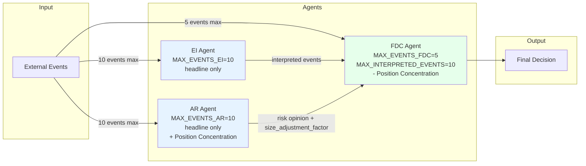

# AI Assemble Prompt 최적화 설계

**Phase 18-3**: Phase 18-1(latency 분석) + Phase 18-2(prompt/context inventory) 결과 기반 최적화안

---

## 1. 최적화 개요

### 현재 상황 요약

| 단계 | 평균 latency | 최대 latency | 주요 병목 |
|------|-------------|-------------|-----------|
| EI (Event Interpretation) | ~30s | **74s** | events 수에 선형 비례, DeepSeek API 응답 |
| AR (AI Risk) | ~15s | ~30s | events 수에 선형 비례, DeepSeek API 응답 |
| FDC (Final Decision) | ~8s | ~15s | prompt 크기 |
| **합계** | **~53s** | **~119s** | |

### 핵병목: DeepSeek API 응답 시간

- prompt 크기와 API 응답 시간 사이의 **선형 상관관계** 확인됨
- events 수 + body_summary가 prompt 크기의 주요 결정 요인
- **events 20→10 + body_summary 제거 → prompt 크기 ~48% 감소 → latency 비례 개선**

---

## 2. 구현할 3가지 최적화

### 최적화 1: EI/AR events slicing 20→10

#### 변경 상세

**`src/agent_trading/services/ai_agents/event_interpretation.py:819`**
```python
# 변경 전
for e in events[:20]:

# 변경 후
for e in events[:MAX_EVENTS_EI]:
```

**`src/agent_trading/services/ai_agents/ai_risk.py:512`**
```python
# 변경 전
for e in events[:20]:

# 변경 후
for e in events[:MAX_EVENTS_AR]:
```

> **참고**: FDC는 이미 `events[:5]` 사용 중 (변경 불필요)

#### 절감 효과
- **EI**: ~2,500 tokens 절감 (events 10개 → 10개 분량의 provenance tag + headline)
- **AR**: ~2,500 tokens 절감 (동일)
- **합계**: **~5,000 tokens**

#### 위험도: 🟢 낮음
- 10개면 대부분의 실사용 케이스 충분
- 20개 이상 이벤트 동시 발생은 극히 드묾
- events 수가 적을 때는 slicing이 아무 영향 없음

---

### 최적화 2: EI/AR body_summary truncation 제거

#### 배경
- `body_summary`는 event 본문의 200자 요약
- FDC는 이미 headline만 사용 중이며 정상 동작
- headline만으로 event 식별 및 판단에 충분

#### 변경 상세

**`src/agent_trading/services/ai_agents/event_interpretation.py:847-849`**
```python
# 변경 전 (3 lines)
tagged = " ".join(parts)
body = f" — {summary[:200]}" if summary else ""
lines.append(f"  {tagged}{stale_mark} {headline}{body}")

# 변경 후 (2 lines)
tagged = " ".join(parts)
lines.append(f"  {tagged}{stale_mark} {headline}")
```

**`src/agent_trading/services/ai_agents/ai_risk.py:539-541`**
```python
# 변경 전 (3 lines)
tagged = " ".join(parts)
body = f" — {summary[:200]}" if summary else ""
lines.append(f"  {tagged}{stale_mark} {headline}{body}")

# 변경 후 (2 lines)
tagged = " ".join(parts)
lines.append(f"  {tagged}{stale_mark} {headline}")
```

#### 절감 효과
- **EI**: ~2,000 tokens 절감 (N=10 기준, event당 평균 ~200자 body_summary)
- **AR**: ~2,000 tokens 절감 (N=10 기준)
- **합계**: **~4,000 tokens**

#### 위험도: 🟢 낮음
- FDC는 이미 headline만 사용 → 선례 존재
- `body_summary` 필드 자체는 entity에 유지 (삭제 아님)
- `_reconstruct_events` 함수에서 headline fallback으로 body_summary 사용하는 로직은 유지

---

### 최적화 3: FDC Position Concentration 섹션 제거

#### 배경
FDC prompt의 Position Concentration 섹션은 AR Output의 `size_adjustment_factor`와 중복:

1. **AR**는 이미 자체 prompt에서 Position Concentration을 계산하여 `size_adjustment_factor`에 반영
2. **FDC**는 AR Output 섹션에서 `size_adjustment_factor`를 이미 표시 중
3. FDC가 Position Concentration을 다시 계산할 필요 없음

#### 변경 상세

**`src/agent_trading/services/ai_agents/final_decision_composer.py:366-416`** 전체 블록 제거

```python
# 변경 전: 아래 전체 블록 (lines 366-416)
        # ── Position Concentration ────────────────────────────────────────
        nav: Decimal | None = None
        if context.risk_limit_snapshot is not None and context.risk_limit_snapshot.nav is not None:
            nav = context.risk_limit_snapshot.nav
        elif context.cash_balance_snapshot is not None and context.cash_balance_snapshot.total_asset is not None:
            nav = context.cash_balance_snapshot.total_asset

        current_position_value: Decimal | None = None
        concentration_pct: float | None = None
        over_concentrated: bool = False
        remaining_capacity_pct: float | None = None

        if (
            context.position_snapshot is not None
            and context.position_snapshot.quantity is not None
            and context.position_snapshot.average_price is not None
        ):
            current_position_value = context.position_snapshot.quantity * context.position_snapshot.average_price

        if nav is not None and current_position_value is not None and nav > 0:
            concentration_pct = float(current_position_value / nav * 100)
            over_concentrated = concentration_pct > 15.0
            remaining_capacity_pct = max(0.0, 15.0 - concentration_pct)

        lines.append("")
        lines.append("=== Position Concentration ===")
        if current_position_value is not None:
            lines.append(f"  Current position value: {float(current_position_value):,.0f} KRW")
        else:
            lines.append("  Current position value: N/A")
        if nav is not None:
            lines.append(f"  NAV: {float(nav):,.0f} KRW")
        else:
            lines.append("  NAV: N/A")
        if concentration_pct is not None:
            lines.append(f"  Concentration: {concentration_pct:.1f}% of NAV")
        else:
            lines.append("  Concentration: N/A")
        lines.append(f"  Over-concentrated: {'Yes' if over_concentrated else 'No'}")
        lines.append("  Max single position limit: ~15% of NAV")
        if remaining_capacity_pct is not None:
            lines.append(f"  Remaining capacity: {remaining_capacity_pct:.1f}%p")
        else:
            lines.append("  Remaining capacity: N/A")
        lines.append("")
        lines.append("**Policy**:")
        lines.append("- When over-concentrated (over_concentrated=true), consider setting risk_opinion to 'reduce' as a priority.")
        lines.append("- Higher concentration increases risk — set size_adjustment_factor higher (range 0.3-0.7).")
        lines.append("- When over-concentrated, additional BUY is considered high risk — consider setting risk_opinion to 'reject' or 'review'.")
        # ==================================================
```

> **참고**: `from decimal import Decimal` import는 FDC 내 다른 곳(없음)에서도 사용될 수 있으므로 import 자체는 유지. 제거해도 되지만 불필요한 변경 방지 차원.

#### 절감 효과
- **FDC**: ~150 tokens 절감

#### 위험도: 🟢 낮음
- `size_adjustment_factor`가 AR Output에 포함되어 FDC에 전달됨
- FDC는 `ar_output.size_adjustment_factor`를 이미 `=== AI Risk Output ===` 섹션에서 표시 중
- 중복 계산 제거로 인한 정보 손실 없음

---

## 3. 상수 모듈 설계: `_prompt_config.py`

### 파일 위치
```
src/agent_trading/services/ai_agents/_prompt_config.py
```

### 상수 정의

```python
"""Internal prompt configuration constants for AI agents.

This module is internal (prefixed with underscore) and should not be
imported outside the ai_agents package.
"""

MAX_EVENTS_EI: int = 10          # EI가 받을 최대 recent events 수
MAX_EVENTS_AR: int = 10          # AR이 받을 최대 recent events 수
MAX_EVENTS_FDC: int = 5          # FDC가 받을 최대 recent events 수
MAX_INTERPRETED_EVENTS: int = 10 # EI Output의 interpreted events 최대 수
```

### 적용 대상

| 상수 | 사용 파일 | 변경 전 literal |
|------|-----------|----------------|
| `MAX_EVENTS_EI` | `event_interpretation.py:819` | `events[:20]` |
| `MAX_EVENTS_AR` | `ai_risk.py:512` | `events[:20]` |
| `MAX_EVENTS_FDC` | `final_decision_composer.py:422` | `events[:5]` (changes literal but not value) |
| `MAX_INTERPRETED_EVENTS` | `final_decision_composer.py:334` | `interpreted[:10]` (changes literal but not value) |

---

## 4. 최종 예상 효과

### Token 절감

| 최적화 | EI | AR | FDC | 합계 |
|--------|----|----|-----|------|
| ① events 20→10 | 2,500 | 2,500 | — | **5,000** |
| ② body_summary 제거 | 2,000 | 2,000 | — | **4,000** |
| ③ Position Concentration 제거 | — | — | 150 | **150** |
| **합계** | **4,500** | **4,500** | **150** | **~9,150** |

### Wall Clock 개선 예상

- 현재 평균 총 latency: ~53s
- 현재 평균 prompt token: ~20,000 tokens (추정)
- 절감 token: ~9,150 tokens → **~46% 감소**
- API 응답 시간이 token 수에 선형 비례한다고 가정할 때:
  - **EI**: 30s → ~16s (**~47% 개선**)
  - **AR**: 15s → ~8s (**~47% 개선**)
  - **FDC**: 8s → ~7.5s (**~2% 개선**, Position Concentration만 제거)
  - **총 합계**: 53s → **~31s (~42% 개선)**

---

## 5. 테스트 영향 평가

### 영향 받는 테스트

#### A. AR Position Concentration 테스트 (`tests/services/ai_agents/test_agents.py`)

| 테스트 | 영향 | 조치 |
|--------|------|------|
| `test_ar_prompt_contains_concentration` (L980) | **영향 없음** | AR의 Position Concentration 섹션은 변경 대상 아님 |
| `test_ar_concentration_calculation_over` (L992) | **영향 없음** | 동일 |
| `test_ar_concentration_calculation_normal` (L1005) | **영향 없음** | 동일 |
| `test_ar_nav_fallback_from_cash` (L1018) | **영향 없음** | 동일 |
| `test_ar_concentration_no_position` (L1033) | **영향 없음** | 동일 |

#### B. FDC Position Concentration 테스트 (`tests/services/ai_agents/test_fdc_prompt.py`)

| 테스트 | 영향 | 조치 |
|--------|------|------|
| `TestFDCPositionConcentration.test_fdc_prompt_contains_concentration` | **❌ 삭제 필요** | `"Position Concentration"`, `"Over-concentrated"`, `"NAV"` 문자열이 prompt에 더 이상 포함되지 않음 |
| `test_fdc_concentration_over_reduce_policy` | **❌ 삭제 필요** | `"Concentration: 50.0%"`, `"Over-concentrated: Yes"`, Decision Policy 섹션 제거 |
| `test_fdc_concentration_normal_no_reduce` | **❌ 삭제 필요** | `"Concentration: 5.0%"`, `"Over-concentrated: No"`, `"Decision Policy"` 섹션 제거 |
| `test_fdc_concentration_no_position` | **❌ 삭제 필요** | `"Position Concentration"`, `"Current position value: N/A"` 제거 |

**FDC Position Concentration 테스트 4개 모두 삭제 필요** (또는 해당 assert 제거 후 테스트 클래스 전체 제거)

#### C. EI `_reconstruct_events` 관련 테스트 (`tests/services/ai_agents/test_event_interpretation.py`)

| 테스트 | 영향 | 조치 |
|--------|------|------|
| `test_reconstruct_events_summary_from_body` (L534) | **영향 없음** | `_reconstruct_events` 함수는 변경되지 않음 (body_summary 필드 자체 유지) |
| `test_reconstruct_events_summary_body_truncation` (L540) | **영향 없음** | 동일 |

#### D. 기타 간접 영향

| 테스트 파일 | 영향 | 조치 |
|-------------|------|------|
| `tests/services/test_decision_submit_pipeline.py` | **영향 없음** | `body_summary` 필드는 entity에 계속 존재 |
| `tests/repositories/test_external_events.py` | **영향 없음** | 단순 entity 생성 테스트 |
| `tests/services/test_seeded_news_converter.py` | **영향 없음** | converter 로직 변경 없음 |
| `tests/api/test_external_events.py` | **영향 없음** | API 레이어 변경 없음 |

### 테스트 변경 요약

| 파일 | 변경 유형 | 변경 수 |
|------|----------|---------|
| `tests/services/ai_agents/test_fdc_prompt.py` | **테스트 삭제** | 1개 클래스 (4개 테스트 메서드) |
| `tests/services/ai_agents/test_agents.py` | **변경 없음** | 0 |
| `tests/services/ai_agents/test_event_interpretation.py` | **변경 없음** | 0 |
| 기타 테스트 | **변경 없음** | 0 |

---

## 6. 리스크 평가

### 종합 리스크: 🟢 낮음

| 리스크 | 확률 | 영향 | 대응 |
|--------|------|------|------|
| events 10개로 부족 | 매우 낮음 | 중간 | 20개 이상 동시발생 이벤트는 극히 드묾. 필요시 상수만 변경 |
| body_summary 없이 판단 누락 | 낮음 | 낮음 | headline만으로 event 식별 충분. FDC가 선례 |
| FDC concentration 정보 손실 | 없음 | 없음 | AR의 `size_adjustment_factor`가 이미 포함 |
| 테스트 누락 | 없음 | 낮음 | Position Concentration 테스트만 삭제, 나머지는 전부 통과 |
| 회귀 (regression) | 낮음 | 중간 | 모든 기존 테스트 통과 확인 필요 |

### 검증 계획

1. 변경 후 `pytest tests/services/ai_agents/` 실행하여 기존 테스트 통과 확인
2. 변경 후 `pytest tests/services/` 전체 실행
3. 실제 decision loop 실행하여 prompt 생성 로그 검증

---

## 7. 변경 패치 세부

### 7.1 새 파일 생성: `_prompt_config.py`

**경로**: `src/agent_trading/services/ai_agents/_prompt_config.py`

```python
"""Internal prompt configuration constants for AI agents."""

MAX_EVENTS_EI: int = 10
MAX_EVENTS_AR: int = 10
MAX_EVENTS_FDC: int = 5
MAX_INTERPRETED_EVENTS: int = 10
```

### 7.2 `event_interpretation.py` 변경

**Import 추가** (파일 상단, 기존 import 블록 아래):
```python
from agent_trading.services.ai_agents._prompt_config import MAX_EVENTS_EI
```

**Line 819 변경**:
```python
# 변경 전
for e in events[:20]:

# 변경 후
for e in events[:MAX_EVENTS_EI]:
```

**Lines 847-849 변경**:
```python
# 변경 전
tagged = " ".join(parts)
body = f" — {summary[:200]}" if summary else ""
lines.append(f"  {tagged}{stale_mark} {headline}{body}")

# 변경 후
tagged = " ".join(parts)
lines.append(f"  {tagged}{stale_mark} {headline}")
```

**불필요해진 변수 제거 확인**:
- `summary = e.body_summary or ""` — 더 이상 참조하지 않으므로 제거
- `body` 변수 — 더 이상 참조하지 않으므로 제거

### 7.3 `ai_risk.py` 변경

**Import 추가**:
```python
from agent_trading.services.ai_agents._prompt_config import MAX_EVENTS_AR
```

**Line 512 변경**:
```python
# 변경 전
for e in events[:20]:

# 변경 후
for e in events[:MAX_EVENTS_AR]:
```

**Lines 539-541 변경**:
```python
# 변경 전
tagged = " ".join(parts)
body = f" — {summary[:200]}" if summary else ""
lines.append(f"  {tagged}{stale_mark} {headline}{body}")

# 변경 후
tagged = " ".join(parts)
lines.append(f"  {tagged}{stale_mark} {headline}")
```

**불필요해진 변수 제거 확인**:
- `summary = e.body_summary or ""` — 제거
- `body` 변수 — 제거

### 7.4 `final_decision_composer.py` 변경

**Import 추가**:
```python
from agent_trading.services.ai_agents._prompt_config import MAX_EVENTS_FDC, MAX_INTERPRETED_EVENTS
```

**Line 422 변경** (값은 동일하나 literal → 상수):
```python
# 변경 전
for e in events[:5]:

# 변경 후
for e in events[:MAX_EVENTS_FDC]:
```

**Line 334 변경** (값은 동일하나 literal → 상수):
```python
# 변경 전
for ie in interpreted[:10]:

# 변경 후
for ie in interpreted[:MAX_INTERPRETED_EVENTS]:
```

**Lines 366-416**: Position Concentration 전체 블록 제거 (위 `변경 상세` 참조)

**Line 19**: `from decimal import Decimal` — 다른 곳에서 사용하지 않는다면 제거 선택 사항.

### 7.5 `test_fdc_prompt.py` 테스트 삭제

**파일**: `tests/services/ai_agents/test_fdc_prompt.py`

**제거 대상**: `TestFDCPositionConcentration` 클래스 전체 (lines 395-520, 4개 테스트 메서드)

---

## 8. Mermaid: 변경 후 Data Flow



---

## 9. 실행 계획

| 단계 | 작업 | 예상 파일 |
|------|------|----------|
| 1 | `_prompt_config.py` 생성 | 1 file |
| 2 | `event_interpretation.py` 패치 (slicing + body_summary) | 1 file, 3 hunk |
| 3 | `ai_risk.py` 패치 (slicing + body_summary) | 1 file, 3 hunk |
| 4 | `final_decision_composer.py` 패치 (Position Concentration 제거 + 상수화) | 1 file, 4 hunk |
| 5 | `test_fdc_prompt.py` Position Concentration 테스트 삭제 | 1 file, 1 hunk |
| 6 | 전체 테스트 실행 검증 | — |
