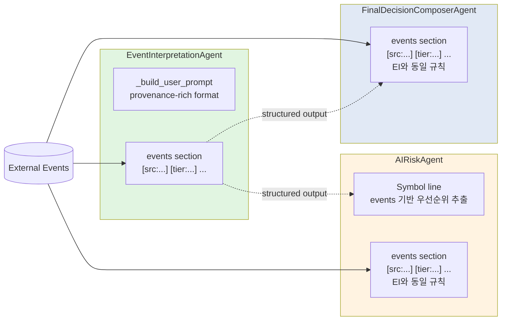

# AR/FDC Prompt Provenance 전파 + AR Symbol Line BUG 수정 — 구현 계획

## 1. 목적

EI(P1-A/P1-B)에서 개선된 provenance-rich event context를 AR/FDC prompt에도 일관되게 전파하고, AR의 Symbol line bug를 수정한다.

## 2. 현재 상태 분석

### 2.1 AR events section (ai_risk.py:391-398) — OLD format

```python
lines.append(f"Recent events ({len(events)}):")
for e in events[:20]:
    headline = e.headline or "(no headline)"
    summary = e.body_summary or ""
    lines.append(
        f"  - [{e.event_type}] {headline}"
        f"{' — ' + summary[:200] if summary else ''}"
    )
```

출력 예: `  - [Y|임원ㆍ주요주주특정증권등소유상황보고서] 임원ㆍ주요주주특정증권등소유상황보고서`

### 2.2 FDC events section (final_decision_composer.py:324-332) — OLD format

AR과 동일한 format. `  - [{event_type}] {headline}`

### 2.3 AR Symbol line BUG (ai_risk.py:291)

```python
lines.append(f"Symbol: {request.context.decision_context or '(not available)'}")
```

- `request.context.decision_context`는 `DecisionContextEntity | None`
- `DecisionContextEntity`는 `symbol` 필드가 없음
- `decision_context`가 `None`이면 `"(not available)"` 출력 (no bug, but no info)
- `decision_context`가 설정되어 있으면 `DecisionContextEntity(...)` repr 노출 → BUG

### 2.4 EI target format (event_interpretation.py:240-266) — TO-BE format

```python
# Provenance tags — only non-None/non-empty, non-default
parts: list[str] = []
if e.source_name:
    parts.append(f"[src:{e.source_name}]")
if e.source_reliability_tier:
    parts.append(f"[tier:{e.source_reliability_tier}]")
if e.event_type:
    parts.append(f"[{e.event_type}]")
if e.published_at:
    parts.append(f"[{e.published_at.strftime('%Y-%m-%d')}]")
if e.issuer_code:
    parts.append(f"[issuer:{e.issuer_code}]")
# Non-default severity only
if e.severity and e.severity != "medium":
    parts.append(f"[severity:{e.severity}]")
# Non-default direction only
if e.direction and e.direction not in ("neutral", ""):
    parts.append(f"[{e.direction}]")

# Stale check — based on ingested_at, not published_at
stale_mark = ""
if e.ingested_at and (now - e.ingested_at).total_seconds() > 86400:  # 24h
    stale_mark = " ⚠️STALE"

tagged = " ".join(parts)
body = f" — {summary[:200]}" if summary else ""
lines.append(f"  {tagged}{stale_mark} {headline}{body}")
```

출력 예:
```
  [src:opendart] [tier:T1] [Y|임원ㆍ주요주주특정증권등소유상황보고서] [2026-05-11] [issuer:00190321] 임원ㆍ주요주주특정증권등소유상황보고서
```

### 2.5 EI test patterns (test_agents.py:1342-1481) — reference

`TestEventInterpretationAgentPrompt` class:
- `_make_event()` static helper — ExternalEventEntity 기본값 설정
- `_build_prompt()` — EventInterpretationAgent._build_user_prompt() 호출
- 6 tests: all_tags_present, severity_medium_omitted, direction_neutral_omitted, fresh_event_no_stale, no_issuer_code_omitted, stale_event_shows_stale_mark

## 2.6 보정사항 반영 (사용자 피드백)

### 보정 1 — AR Symbol line source 우선순위

**기존**: `events[0].symbol` 단일 사용
**보정**: 아래 우선순위로 symbol 추출
1. `request` 레벨에서 직접 얻을 수 있는 symbol (AgentExecutionRequest에는 symbol 필드가 없으므로 생략)
2. `context.recent_events`에서 첫 non-null `e.symbol`
3. 최종 fallback: `"(not available)"`

이번 bug의 본질은 `decision_context.__repr__()` 누출 방지이므로, symbol source는 event line formatting과 분리.

### 보정 2 — EI와 완전히 동일한 provenance tag 규칙

AR/FDC에서 "거의 비슷한" format이 아닌 **EI와 동일한 조건/규칙**을 그대로 따라감:
- `severity != "medium"`일 때만 `[severity:...]`
- `direction not in ("neutral", "")`일 때만 `[positive]`/`[negative]`
- `issuer_code` 있을 때만 `[issuer:...]`
- `ingested_at > 24h`일 때만 `⚠️STALE`
- `published_at`는 날짜 표시만 (`strftime('%Y-%m-%d')`)
- `tier`는 stored raw value 사용
- `source_name` 있을 때만 `[src:...]`
- `source_reliability_tier` 있을 때만 `[tier:...]`
- `event_type` 있을 때만 `[{event_type}]`

### 보정 3 — 테스트는 존재/부재 중심

전체 문자열 스냅샷 비교 대신 `in`/`not in` (contains/not contains) 기반 assertion 유지.

## 3. 변경 사항

### 3.1 ai_risk.py — AR events section (lines 391-398)

**BEFORE:**
```python
lines.append(f"Recent events ({len(events)}):")
for e in events[:20]:
    headline = e.headline or "(no headline)"
    summary = e.body_summary or ""
    lines.append(
        f"  - [{e.event_type}] {headline}"
        f"{' — ' + summary[:200] if summary else ''}"
    )
```

**AFTER (EI와 완전히 동일한 규칙):**
```python
lines.append(f"Recent events ({len(events)}):")
now = datetime.now(timezone.utc)
for e in events[:20]:
    headline = e.headline or "(no headline)"
    summary = e.body_summary or ""

    # Provenance tags — same rules as EI (severity/direction default omission, stale check, etc.)
    parts: list[str] = []
    if e.source_name:
        parts.append(f"[src:{e.source_name}]")
    if e.source_reliability_tier:
        parts.append(f"[tier:{e.source_reliability_tier}]")
    if e.event_type:
        parts.append(f"[{e.event_type}]")
    if e.published_at:
        parts.append(f"[{e.published_at.strftime('%Y-%m-%d')}]")
    if e.issuer_code:
        parts.append(f"[issuer:{e.issuer_code}]")
    if e.severity and e.severity != "medium":
        parts.append(f"[severity:{e.severity}]")
    if e.direction and e.direction not in ("neutral", ""):
        parts.append(f"[{e.direction}]")

    # Stale check — based on ingested_at, not published_at
    stale_mark = ""
    if e.ingested_at and (now - e.ingested_at).total_seconds() > 86400:
        stale_mark = " ⚠️STALE"

    tagged = " ".join(parts)
    body = f" — {summary[:200]}" if summary else ""
    lines.append(f"  {tagged}{stale_mark} {headline}{body}")
```

Key changes:
- `now = datetime.now(timezone.utc)` 추가
- `  - [{event_type}]` → `  {tagged}{stale_mark}` (dash 제거, provenance tag로 대체)
- 모든 tag 조건/규칙이 EI와 정확히 일치

### 3.2 final_decision_composer.py — FDC events section (lines 324-332)

AR과 동일한 변경. EI와 완전히 동일한 규칙.

**BEFORE:**
```python
lines.append("")
lines.append(f"Recent events ({len(events)}):")
for e in events[:20]:
    headline = e.headline or "(no headline)"
    summary = e.body_summary or ""
    lines.append(
        f"  - [{e.event_type}] {headline}"
        f"{' — ' + summary[:200] if summary else ''}"
    )
```

**AFTER:**
```python
lines.append("")
lines.append(f"Recent events ({len(events)}):")
now = datetime.now(timezone.utc)
for e in events[:20]:
    headline = e.headline or "(no headline)"
    summary = e.body_summary or ""

    parts: list[str] = []
    if e.source_name:
        parts.append(f"[src:{e.source_name}]")
    if e.source_reliability_tier:
        parts.append(f"[tier:{e.source_reliability_tier}]")
    if e.event_type:
        parts.append(f"[{e.event_type}]")
    if e.published_at:
        parts.append(f"[{e.published_at.strftime('%Y-%m-%d')}]")
    if e.issuer_code:
        parts.append(f"[issuer:{e.issuer_code}]")
    if e.severity and e.severity != "medium":
        parts.append(f"[severity:{e.severity}]")
    if e.direction and e.direction not in ("neutral", ""):
        parts.append(f"[{e.direction}]")

    stale_mark = ""
    if e.ingested_at and (now - e.ingested_at).total_seconds() > 86400:
        stale_mark = " ⚠️STALE"

    tagged = " ".join(parts)
    body = f" — {summary[:200]}" if summary else ""
    lines.append(f"  {tagged}{stale_mark} {headline}{body}")
```

### 3.3 ai_risk.py — AR Symbol line fix (line 291)

**Symbol source 우선순위** (사용자 보정 반영):
1. `request` 레벨 symbol (AgentExecutionRequest에는 없음 → skip)
2. `context.recent_events` 첫 non-null `e.symbol`
3. 최종 fallback: `"(not available)"`

**BEFORE:**
```python
lines.append(f"Symbol: {request.context.decision_context or '(not available)'}")
```

**AFTER:**
```python
# Symbol source priority:
#   1. context.recent_events first non-None e.symbol
#   2. Fallback "(not available)"
# NOTE: AgentExecutionRequest has no direct symbol field;
#       events are all for the same symbol (queried by request.symbol in assemble()).
symbol: str = "(not available)"
if events:
    for e in events:
        if e.symbol:
            symbol = e.symbol
            break
lines.append(f"Symbol: {symbol}")
```

### 3.4 중복 vs helper 결정

**결정: inline duplication 채택** (사용자 지침 "과도한 abstraction 금지" 준수)

이유:
- Formatting logic ~12 lines × 3 agents = ~36 lines 중복
- 추가 파일/import 없이 각 agent self-contained 유지
- 미래 format 변경 시 3군데 수정 필요하나, 변경 자체가 드물고 명시적
- `severity`/`direction`/`issuer`/`stale` 조건이 각 agent에서 독립적으로 평가되어야 함

> ⚠️ 추후 4번째 agent가 동일 format 사용 시 module-level helper 추출 검토

## 4. 테스트 계획

### 4.1 신규 테스트 클래스: `TestAIRiskAgentPrompt` (test_agents.py)

기존 `TestEventInterpretationAgentPrompt` 패턴을 따라 `AIRiskAgent._build_user_prompt()` 테스트.

`test_agents.py` 하단에 추가. `ExternalEventEntity`는 이미 import되어 있음. `AIRiskAgent`는 import되어 있음.

#### Test 1: `test_ar_events_provenance_tags_present`
- 모든 필드가 채워진 event 1개 전달
- `[src:opendart]`, `[tier:T1]`, `[disclosure]`, `[YYYY-MM-DD]`, `[issuer:005930]` 모두 포함 확인
- `⚠️STALE` 미포함 확인 (fresh event)

#### Test 2: `test_ar_events_severity_medium_omitted`
- `severity=medium` → `[severity:...]` 생략 확인

#### Test 3: `test_ar_events_direction_neutral_omitted`
- `direction=neutral` → `[positive]`, `[negative]` 생략 확인

#### Test 4: `test_ar_events_no_stale_mark_when_fresh`
- `ingested_at=now` → `⚠️STALE` 생략 확인

#### Test 5: `test_ar_events_stale_mark_when_old`
- `ingested_at=25h_ago` → `⚠️STALE` 포함 확인

#### Test 6: `test_ar_events_no_issuer_tag_when_none`
- `issuer_code=None` → `[issuer:` 생략 확인

#### Test 7: `test_ar_symbol_line_no_repr_leak` (BUG 회귀 방지)
- `decision_context` 설정 + events 있음 → Symbol line에 `DecisionContextEntity(` 없음
- `decision_context` None + events 없음 → `Symbol: (not available)` 출력

### 4.2 테스트 작성 원칙 (사용자 보정 반영)

- `in` / `not in` 기반 assertion (contains / not contains)
- 전체 문자열 스냅샷 비교 금지
- 각 테스트는 "필수 tag 존재" 또는 "불필요 tag 부재"만 검증

### 4.3 신규 테스트 클래스: `TestFinalDecisionComposerAgentPrompt` (test_agents.py)

#### Test 1-6: `TestAIRiskAgentPrompt`과 동일한 구조로 FDC events section 검증
- `FinalDecisionComposerAgent._build_user_prompt()` 호출
- EI output + AR output은 `None`으로 설정 (events section만 검증)
- 동일한 contains/not contains 패턴

### 4.4 기존 테스트 회귀 방지

변경 후 실행할 명령:
```bash
cd /workspace/agent_trading && python -m pytest tests/services/ai_agents/test_agents.py -v --tb=short 2>&1
```

기존 테스트에 영향이 없어야 함:
- `TestEventInterpretationAgentPrompt` — 수정 없음
- `TestAIRiskAgent` — `_build_user_prompt()` 출력이 더 길어졌지만 test logic에 영향 없음 (mock provider가 prompt를 검증하지 않음)
- `TestFinalDecisionComposerAgent` — 동일
- `TestP1AandP1BIntegration` — `test_decision_submit_pipeline.py`에서 EI prompt만 검증, AR/FDC prompt 검증 없음

**잠재적 회귀 포인트**: 없음. AR/FDC 테스트는 mock provider를 사용하므로 prompt 내용 변경은 test 결과에 영향 없음.

## 5. 변경 제약 준수 확인

| 제약 | 상태 | 근거 |
|------|------|------|
| query contract 변경 금지 | ✅ 준수 | `list_by_symbol()` 호출 방식 변경 없음 |
| migration 금지 | ✅ 준수 | DB 변경 없음 |
| source adapter 추가 금지 | ✅ 준수 | adapter 변경 없음 |
| output schema 변경 금지 | ✅ 준수 | `AIRiskOutput`, `FinalDecisionComposerOutput` 변경 없음 |
| provider 호출 경로 변경 금지 | ✅ 준수 | `generate_structured()` 호출 방식 변경 없음 |
| broker submit semantics 변경 금지 | ✅ 준수 | broker 관련 코드 변경 없음 |
| admin UI 변경 금지 | ✅ 준수 | UI 코드 변경 없음 |
| DB schema 변경 금지 | ✅ 준수 | DB 변경 없음 |

## 6. 파일 변경 요약

| File | 변경 유형 | 예상 lines |
|------|-----------|-----------|
| `src/agent_trading/services/ai_agents/ai_risk.py` | 수정 | ~15 lines (events section) + ~5 lines (Symbol line) |
| `src/agent_trading/services/ai_agents/final_decision_composer.py` | 수정 | ~15 lines (events section) |
| `tests/services/ai_agents/test_agents.py` | 추가 | ~110 lines (2 test classes, 13 tests) |

## 7. 구현 순서

### Step 1: AR events section 변경 (ai_risk.py)
- lines 391-398을 provenance-rich format으로 교체
- `now = datetime.now(timezone.utc)` 추가

### Step 2: AR Symbol line fix (ai_risk.py)
- line 291을 events 기반 symbol 추출로 교체

### Step 3: FDC events section 변경 (final_decision_composer.py)
- lines 324-332을 provenance-rich format으로 교체
- `now = datetime.now(timezone.utc)` 추가

### Step 4: TestAIRiskAgentPrompt 추가 (test_agents.py)
- `_make_event()` helper (기존 EI helper와 동일, or 공유)
- `_build_prompt()` helper
- 7 tests

### Step 5: TestFinalDecisionComposerAgentPrompt 추가 (test_agents.py)
- `_build_prompt()` helper (EI+AR output None)
- 6 tests

### Step 6: 기존 테스트 회귀 확인
- `pytest tests/services/ai_agents/test_agents.py -v --tb=short`

### Step 7: 측정 스크립트 재실행
- `python scripts/ei_improvement_measurement.py` → AR/FDC provenance tag 전파 확인

## 8. Mermaid: 데이터 흐름



## 9. 위험 요소

| 위험 | 영향 | 완화 |
|------|------|------|
| Token count 증가로 AR/FDC API cost 상승 | Medium | EI 측정 결과 +64~78% 동일한 증가 예상. 기존 20개 event cap 유지 |
| dash `  - ` → space `  ` 변경으로 prompt parsing 혼란 | Low | EI와 동일한 format으로 일관성 향상이 더 큼 |
| `now` timestamp가 AR/FDC에서 각각 생성되어 stale 판정 시간 차이 | Low | EI/AR/FDC가 sequential 실행되므로 1-2초 차이는 무시 가능 |
| events가 비어있을 때 Symbol line | Low | loop로 모든 event 순회, 없으면 "(not available)" |