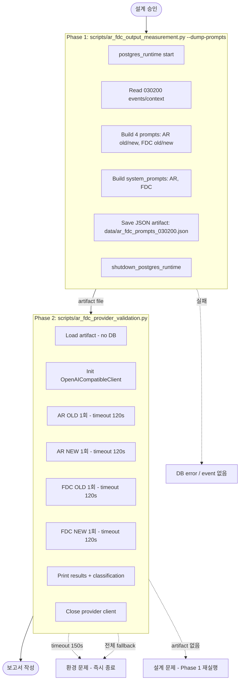

# AR/FDC Provider 실호출 탐색 검증 — 2단계 분리 설계

> **목적**: DB fetch (Postgres runtime)와 provider 호출을 분리하여 hang 문제를 회피하는 검증 구조 재설계
> **상태**: 설계 문서 (실행 계획)
> **이전 이슈**: `postgres_runtime()` async context 내에서 provider 호출 시 connection reset loop + hang 발생

---

## 1. 문제 진단

### 1.1 현재 구조의 문제점

```
async with postgres_runtime() as runtime:    ← DB connection pool 생성
    repos = runtime["repositories"]
    provider_client = OpenAICompatibleClient(...)
    
    for symbol in SYMBOLS:
        result = await measure_symbol(repos, symbol, ...)  ← DB read
    
    # Provider 호출 (같은 async context 내)
    for i in range(2):
        agent = _OldStyleAIRiskAgent(provider_client)
        result = await agent.run(request)     ← HTTP POST (hang 위험)
```

**hang 발생 메커니즘**:
1. `postgres_runtime()`이 asyncpg connection pool + transaction을 생성
2. 동일한 asyncio event loop에서 `OpenAICompatibleClient.generate_structured()`가 `httpx.AsyncClient.post()` 호출
3. Deepseek API 응답 지연 또는 network timeout 발생 시, httpx 요청이 event loop를 block
4. asyncpg connection pool이 `Resetting connection with an active transaction` 에러 발생
5. DB connection reset + provider 요청 대기가 서로 간섭하며 hang 상태로 빠짐

### 1.2 핵심 교훈

- **DB fetch와 provider 호출은 같은 long-running async context에 두지 않는다**
- Provider 호출은 독립된 process/event loop에서 실행해야 함
- 명시적 timeout 정책이 필요하며, timeout 시 즉시 종료 (재시도 금지)

---

## 2. 2단계 분리 설계

### 2.1 전체 구조

```
Phase 1: DB Fetch / Prompt Materialization
  ┌─────────────────────────────────────────────────────┐
  │  postgres_runtime() → repos → read events/context   │
  │  → build 4 prompts (AR old, AR new, FDC old, FDC new) │
  │  → serialize to JSON artifact                         │
  │  → DB runtime clean close                              │
  └─────────────────────────────────────────────────────┘
                          ↓
                  JSON artifact file
                    (data/ 아래)
                          ↓
Phase 2: Provider Call Only
  ┌─────────────────────────────────────────────────────┐
  │  load JSON artifact (no DB)                          │
  │  → OpenAICompatibleClient 생성                       │
  │  → OLD 1회 + NEW 1회 (최대 2회씩)                   │
  │  → timeout 120초 전체 제한                           │
  │  → 실패 시 즉시 종료 (환경 문제 분류)               │
  └─────────────────────────────────────────────────────┘
```

### 2.2 Phase 1 상세: DB Fetch + Prompt Materialization (Read-only)

**수정 대상**: [`scripts/ar_fdc_output_measurement.py`](../scripts/ar_fdc_output_measurement.py)

**변경 방식**: 기존 스크립트에 `--dump-prompts` 플래그 추가

```
python -m scripts.ar_fdc_output_measurement --dump-prompts
```

**Phase 1은 read-only 검증**:
- DB write 없음
- provider 호출 없음
- artifact dump only
- 기존 `--with-provider` 플래그와 동시 사용 시 `--dump-prompts` 우선

**동작**:
1. `postgres_runtime()` 시작
2. symbol `030200`만 대상으로 context/event 읽기
3. system prompt도 함께 수집 (`agent._build_system_prompt()`)
4. 4종 prompt 생성 (AR old, AR new, FDC old, FDC new)
5. event snapshot + approximate reconstruction flag 포함하여 JSON artifact 저장
6. DB runtime 정상 종료 (`shutdown_postgres_runtime()`)

**성공 기준**:
- ✅ Prompt 4종 생성 성공
- ✅ System prompt 2종 수집 성공
- ✅ DB runtime clean close (connection pool 반환)
- ✅ JSON artifact 파일 저장 성공

**실패 기준**:
- ❌ DB connection 실패
- ❌ Event count 0 (데이터 없음)
- ❌ JSON artifact write 실패

### 2.3 Phase 2 상세: Provider Call Only

**신규 파일**: [`scripts/ar_fdc_provider_validation.py`](../scripts/ar_fdc_provider_validation.py)

```
python -m scripts.ar_fdc_provider_validation
```

**동작**:
1. JSON artifact 로드 (DB 연결 없음)
2. `.env`에서 `DEEPSEEK_API_KEY` 로드 (`load_dotenv()`)
3. `OpenAICompatibleClient` 생성
4. OLD-style AR 1회 → NEW-style AR 1회 (순차)
5. OLD-style FDC 1회 → NEW-style FDC 1회 (순차)
6. 결과 출력
7. `provider_client.close()` 호출

**성공 기준**:
- ✅ Provider 호출 최소 2개 완료 (OLD 1 + NEW 1, AR 또는 FDC)
- ✅ 각 호출 success=True
- ✅ 전체 프로세스 timeout 120초 내 완료

**실패 기준**:
- ❌ Timeout (120초 초과) → 즉시 종료, "환경 문제" 분류
- ❌ 모든 호출이 fallback (default 값만 반환) → "환경 문제" 분류
- ❌ API key / base_url / model_id 누락 → "환경 문제" 분류
- ❌ JSON artifact 로드 실패 → "설계 문제" 분류

### 2.4 실행 순서

```
Step 1: Phase 1 실행
  python -m scripts.ar_fdc_output_measurement --dump-prompts
  → data/ar_fdc_prompts_030200.json 생성

Step 2: Phase 2 실행 (별도 명령)
  python -m scripts.ar_fdc_provider_validation
  → provider 호출 결과 출력
```

---

## 3. Artifact 파일 포맷

### 3.1 경로

```
data/ar_fdc_prompts_030200.json
```

### 3.2 JSON Schema

```json
{
  "meta": {
    "symbol": "030200",
    "measured_at_utc": "2026-05-12T00:41:00Z",
    "since_utc": "2026-05-09T00:41:00Z",
    "event_count": 5,
    "schema_version": "1.0"
  },
  "event_snapshot": [
    {
      "source_name": "opendart",
      "event_type": "K|전환가액의조정",
      "published_at": "2026-05-11T00:00:00Z",
      "issuer_code": "00365624",
      "headline": "전환가액의조정"
    }
  ],
  "context": {
    "score": {
      "score": 0.0,
      "threshold": 0.0,
      "reason_codes": ["code1", "code2"]
    },
    "decision_context": {
      "account_id": "uuid",
      "symbol": "030200"
    },
    "position_snapshot": {
      "quantity": 0,
      "average_price": null,
      "market_price": null
    },
    "cash_balance_snapshot": {
      "available_cash": "1000000",
      "currency": "KRW"
    },
    "risk_limit_snapshot": {
      "kill_switch_active": false
    },
    "ei_output_summary": {
      "overall_bias": "neutral",
      "event_conflict": false,
      "top_reason_codes": ["code1"],
      "interpreted_event_count": 3
    },
    "ar_output_summary": {
      "risk_opinion": "allow",
      "risk_score": 0.0,
      "reason_codes": []
    }
  },
  "prompts": {
    "ar_old_prompt": "Correlation ID: ...\nSymbol: ...\n...",
    "ar_new_prompt": "Correlation ID: ...\nSymbol: 030200\n...",
    "fdc_old_prompt": "Correlation ID: ...\nAccount ID: ...\n...",
    "fdc_new_prompt": "Correlation ID: ...\nAccount ID: ...\n..."
  },
  "system_prompts": {
    "ar": "You are an AI risk assessment agent...",
    "fdc": "You are a final decision composer..."
  },
  "flags": {
    "old_style_is_approximate_reconstruction": true
  },
  "prompt_quality": {
    "ar": {
      "tokens": {"old": 229, "new": 294, "increase_pct": 28.4},
      "provenance_completeness": {
        "score": 1.0,
        "per_tag": {"src": 1.0, "tier": 1.0, "issuer": 1.0, "event_type": 1.0, "date": 1.0}
      },
      "context_depth": {
        "reason_code_depth": 3,
        "event_richness": 5,
        "continuity_score": 4,
        "continuity_max": 4
      },
      "symbol_bug_fixed": true
    },
    "fdc": {
      "tokens": {"old": 250, "new": 304, "increase_pct": 21.6},
      "provenance_completeness": {
        "score": 1.0,
        "per_tag": {"src": 1.0, "tier": 1.0, "issuer": 1.0, "event_type": 1.0, "date": 1.0}
      },
      "context_depth": {
        "reason_code_depth": 3,
        "event_richness": 4,
        "continuity_score": 9,
        "continuity_max": 11
      }
    }
  }
}
```

---

## 4. Phase 2 실행/종료 정책

### 4.1 호출 순서와 횟수

| 순서 | 호출 | prompt | 최대 시간 | 비고 |
|------|------|--------|-----------|------|
| 1 | AR OLD 1회 | `prompts.ar_old` | 120초 | |
| 2 | AR NEW 1회 | `prompts.ar_new` | 120초 | |
| 3 | FDC OLD 1회 | `prompts.fdc_old` | 120초 | |
| 4 | FDC NEW 1회 | `prompts.fdc_new` | 120초 | |
| **전체** | **4회** | | **150초** | **hard limit (process 외부)** |

### 4.2 Timeout 처리 (Double Timeout)

**2중 timeout 정책**:
1. **Client-level timeout**: 120초 (OpenAICompatibleClient.__init__의 timeout_seconds=120)
   - 각 `generate_structured()` 호출당 httpx.Timeout(120) 적용
   - Deepseek API의 느린 응답을 포용하면서도 무한 대기 방지
2. **Process-level timeout**: 150초 (asyncio.wait_for() 또는 shell timeout 150)
   - 전체 스크립트 실행 시간 제한
   - client timeout(120s)보다 여유 있게 설정하여 마지막 호출 완료 보장

- timeout 발생 시:
  - 현재 호출 결과 = `{"run": "...", "success": False, "error": "timeout", "used_fallback": false}`
  - **즉시 종료**, 추가 호출 없음
  - 분류: "환경 문제" (provider 응답 지연)

### 4.3 Fallback 탐지

각 Phase 2 호출 결과는 `used_fallback: bool` 필드를 포함하여 genuine 결과와 fallback 결과를 명확히 구분한다.

- `result.success == True`지만 모든 field가 default 값인 경우 → `used_fallback: true`
  - AR: `opinion=allow, score=0.0, codes=[]` → 실제 호출 실패 (provider 응답 파싱 실패)
  - FDC: `decision=HOLD, confidence=0.0` → 실제 호출 실패 (provider 응답 파싱 실패)
- `result.success == True` + non-default 값이 하나라도 있음 → `used_fallback: false`
- Fallback만 존재하는 경우 (전체 4회 중 used_fallback=true만 있음) → "환경 문제" 분류

### 4.4 종료 조건 (명시적)

| 조건 | 행동 | 분류 |
|------|------|------|
| 모든 호출 성공 + signal 변화 있음 | 결과 출력 후 정상 종료 | 개선 신호 / 혼합 신호 |
| 모든 호출 성공 + signal 변화 없음 | 결과 출력 후 정상 종료 | Inconclusive |
| 일부 호출 성공 + 일부 timeout | 성공한 데이터만 출력 | 불완전 데이터 |
| 전부 timeout 또는 fallback | 즉시 종료 | 환경 문제 |
| API key / base_url 누락 | 즉시 종료 | 환경 문제 |
| JSON artifact 로드 실패 | 즉시 종료 | 설계 문제 |

**중요: 같은 명령 재실행 금지.** 실패 시 "환경 문제"로 분류하고 재시도 자동화하지 않음.

### 4.5 Phase 2 결과 Artifact 스키마

**경로**: `data/ar_fdc_provider_validation_030200.json`

Phase 2 실행 완료 후 모든 호출 결과를 JSON artifact로 저장한다. 이 파일은 보고서 작성과 추후 분석에 사용된다.

```json
{
  "meta": {
    "run_ts_utc": "2026-05-12T02:30:00Z",
    "symbol": "030200",
    "phase1_artifact": "data/ar_fdc_prompts_030200.json",
    "model_id": "deepseek-chat",
    "client_timeout_seconds": 120,
    "process_timeout_seconds": 150,
    "schema_version": "1.0"
  },
  "calls": [
    {
      "run": "ar-old-1",
      "success": true,
      "used_fallback": false,
      "duration_seconds": 45.2,
      "parsed_output": {
        "risk_opinion": "allow",
        "risk_score": 0.35,
        "reason_codes": ["code1", "code2"],
        "reasoning": "분석 내용..."
      },
      "raw_response_preview": "{\"risk_opinion\": \"allow\", ...}"
    },
    {
      "run": "ar-new-1",
      "success": true,
      "used_fallback": false,
      "duration_seconds": 38.1,
      "parsed_output": {
        "risk_opinion": "reduce",
        "risk_score": 0.65,
        "reason_codes": ["code3", "code4"],
        "reasoning": "분석 내용..."
      },
      "raw_response_preview": "{\"risk_opinion\": \"reduce\", ...}"
    },
    {
      "run": "fdc-old-1",
      "success": false,
      "used_fallback": true,
      "duration_seconds": 120.0,
      "error": "timeout",
      "parsed_output": null
    },
    {
      "run": "fdc-new-1",
      "success": true,
      "used_fallback": false,
      "duration_seconds": 55.0,
      "parsed_output": {
        "decision": "BUY",
        "confidence": 0.72,
        "order_type": "LIMIT",
        "quantity": 100,
        "limit_price": 35000.0,
        "reasoning": "매수 사유..."
      },
      "raw_response_preview": "{\"decision\": \"BUY\", ...}"
    }
  ],
  "summary": {
    "total_calls": 4,
    "successful": 3,
    "failed": 1,
    "fallback_count": 1,
    "total_duration_seconds": 150.0,
    "conclusion": "mixed_signal"
  }
}
```

**필드 설명**:
- `calls[].used_fallback`: `true`면 fallback (default 값만 반환), `false`면 genuine provider 응답
- `calls[].parsed_output`: 성공 시 파싱된 structured output (run 종류에 따라 다른 schema)
- `calls[].raw_response_preview`: 원본 응답 텍스트 (전문은 길 수 있으므로 preview)
- `summary.conclusion`: Phase 2 최종 결론 (아래 4.6 참고)

### 4.6 결론 분류 규칙

Phase 2 실행 완료 후 `summary.conclusion` 필드는 다음 3가지 값 중 하나로 결정한다.

| 결론 | 조건 | 의미 |
|------|------|------|
| `improvement_signal` | AR: OLD vs NEW 간 `risk_opinion` 또는 `risk_score`에 유의미한 차이 + NEW 쪽이 더 정보에 기반한 판단으로 보임 | Provider output에서 provenance 개선 효과가 관찰됨 |
| `mixed_signal` | 일부 호출에서 차이가 있으나 일관되지 않음, 또는 일부 호출만 성공 | 부분적 또는 불완전한 신호 |
| `inconclusive` | 모든 호출이 fallback 또는 timeout, 또는 OLD/NEW 간 차이가 없음 | 검증 불가 — 환경 문제 또는 차이 없음 |

**자동 inconclusive 조건**:
- 전체 4회 중 **모든 성공 호출이 used_fallback=true**인 경우 → `inconclusive`
- **전체 호출이 timeout** 또는 실패한 경우 → `inconclusive`
- OLD/NEW 쌍(AR 또는 FDC) 중 한쪽만 성공한 경우 → `inconclusive` (비교 불가)

**판단 기준** (수동 검토):
- `improvement_signal`: NEW 쪽에서 더 구체적인 `reason_codes`, 더 높은/낮은 `risk_score`, 더 명확한 `reasoning` 텍스트가 관찰됨
- `mixed_signal`: AR은 개선 신호가 있지만 FDC는 없음, 또는 그 반대

---

## 5. 변경 파일 목록

| 파일 | 변경 유형 | 설명 |
|------|-----------|------|
| `scripts/ar_fdc_output_measurement.py` | **수정** | `--dump-prompts` 플래그 추가, Phase 1 전용 모드 |
| `scripts/ar_fdc_provider_validation.py` | **신규 생성** | Phase 2 전용, DB 없이 artifact → provider 호출 |
| `plans/ar_fdc_provider_2phase_design.md` | **신규 생성** | 본 설계 문서 |

**변경하지 않는 파일**:
- `src/` 아래 모든 production 코드 — 변경 금지
- `scripts/ar_fdc_output_measurement.py`의 기존 `--with-provider` 플래그 — 유지 (비권장)
- `plans/ar_fdc_provider_exploratory_plan.md` — 유지 (참고용)

---

## 6. Phase 1 `--dump-prompts` 플래그 상세 동작

### 6.1 기존 스크립트 수정 사항

```python
# main() 함수에 추가
parser.add_argument("--dump-prompts", action="store_true",
                    help="Phase 1: DB fetch → prompt materialization → JSON artifact")

if args.dump_prompts:
    # 030200 only
    symbol = "030200"
    result = await measure_symbol(repos, symbol, now, since, with_provider=False)
    
    # Artifact 작성
    artifact = _build_artifact(symbol, result)
    _save_artifact(artifact)
    
    print(f"  ✅ Artifact saved: data/ar_fdc_prompts_{symbol}.json")
    return 0
```

### 6.2 신규 함수

```python
def _build_artifact(symbol: str, result: dict[str, Any]) -> dict[str, Any]:
    """Build the JSON artifact from measurement result."""

def _save_artifact(artifact: dict[str, Any]) -> None:
    """Save artifact to data/ar_fdc_prompts_{symbol}.json."""
```

### 6.3 기존 `--with-provider` 플래그와의 관계

- `--dump-prompts`: 030200 only, Phase 1 전용 (권장)
- `--with-provider`: 기존 동작 유지 (비권장, hang 위험)
- 두 플래그 동시 사용 시 `--dump-prompts` 우선

---

## 7. Phase 2 `ar_fdc_provider_validation.py` 상세 설계

### 7.1 구조

```python
#!/usr/bin/env python3
"""Phase 2: Provider Call Only — Load JSON artifact, call provider, report results.

사용법:
    python -m scripts.ar_fdc_provider_validation

종료 코드:
    0 — 성공 (일부 성공 포함)
    1 — artifact 로드 실패 / 환경 문제
"""

import asyncio
import json
import logging
import sys
from pathlib import Path

# .env 로드
try:
    from dotenv import load_dotenv
    _dotenv_path = Path(__file__).resolve().parent.parent / ".env"
    if _dotenv_path.exists():
        load_dotenv(_dotenv_path)
except ImportError:
    pass

# DB import 없음! (postgres_runtime, Repository 등 사용 금지)
from agent_trading.config.settings import AppSettings
from agent_trading.services.ai_agents.provider_client import OpenAICompatibleClient


async def main() -> int:
    # 1. Load artifact
    artifact_path = Path("data/ar_fdc_prompts_030200.json")
    if not artifact_path.exists():
        print("❌ Artifact not found. Run Phase 1 first.")
        return 1
    
    with open(artifact_path) as f:
        artifact = json.load(f)
    
    # 2. Init provider client
    settings = AppSettings()
    if not settings.provider_api_key:
        print("❌ provider_api_key is empty. Check .env file.")
        return 1
    
    client = OpenAICompatibleClient(
        api_key=settings.provider_api_key,
        base_url=settings.provider_base_url,
        timeout_seconds=120,
    )
    
    try:
        # 3. Call provider for each prompt (순차 호출, 각각 최대 120초)
        results: list[dict[str, Any]] = []
        
        results.append(await _call_ar(
            client, artifact["prompts"]["ar_old"],
            artifact["system_prompts"]["ar"], "ar-old-1"))
        results.append(await _call_ar(
            client, artifact["prompts"]["ar_new"],
            artifact["system_prompts"]["ar"], "ar-new-1"))
        results.append(await _call_fdc(
            client, artifact["prompts"]["fdc_old"],
            artifact["system_prompts"]["fdc"], "fdc-old-1"))
        results.append(await _call_fdc(
            client, artifact["prompts"]["fdc_new"],
            artifact["system_prompts"]["fdc"], "fdc-new-1"))
        
        # 4. Save results artifact + Print results
        _save_results(results)
        _print_results(artifact, results)
        
    except asyncio.TimeoutError:
        print("❌ Global timeout (150s) exceeded.")
        return 1
    finally:
        await client.close()
    
    return 0


def _call_ar(client, user_prompt, label):
    """Call provider with AR system prompt + user_prompt."""
    # Use AIRiskAgent's system prompt (hardcoded or from artifact)
    ...


def _call_fdc(client, user_prompt, label):
    """Call provider with FDC system prompt + user_prompt."""
    ...


if __name__ == "__main__":
    exit_code = asyncio.run(main())
    sys.exit(exit_code)
```

### 7.2 System prompt 문제

`AIRiskAgent._build_system_prompt()`와 `FinalDecisionComposerAgent._build_system_prompt()`는 production 코드입니다. Phase 2에서는 이 system prompt를 어떻게 확보할지 결정해야 합니다.

**선택지 A: System prompt를 artifact에 포함**
- Phase 1에서 `agent._build_system_prompt()` 호출 결과를 artifact에 저장
- Phase 2에서 artifact에서 읽어 사용
- 장점: production 코드 변경 없음
- 단점: system prompt는 고정값이므로 변경 가능성 낮음

**선택지 B: Phase 2에서 inline agent 생성**
```python
agent = AIRiskAgent(provider_client=client)
# _build_user_prompt()를 artifact prompt로 대체
```
- 문제: `AIRiskAgent.__init__()`이 `provider_client`를 필요로 함
- 장점: system prompt를 동적으로 생성

**권장: 선택지 A** — Phase 1에서 system prompt도 artifact에 포함
```json
{
  "prompts": {
    "ar_old": "...",
    "ar_new": "...",
    "fdc_old": "...",
    "fdc_new": "..."
  },
  "system_prompts": {
    "ar": "You are an AI risk assessment agent...",
    "fdc": "You are a final decision composer..."
  }
}
```

### 7.3 Provider 호출 방식

Phase 2는 `OpenAICompatibleClient.generate_structured()`를 직접 호출:

```python
async def _call_ar(
    client: OpenAICompatibleClient,
    user_prompt: str,
    system_prompt: str,
    label: str,
) -> dict[str, Any]:
    """AR provider 호출 + fallback 감지 + used_fallback 포함 반환."""
    from agent_trading.services.ai_agents.schemas import AIRiskOutput
    try:
        response = await client.generate_structured(
            model_id=settings.provider_model_id,
            system_prompt=system_prompt,
            user_prompt=user_prompt,
            response_format=AIRiskOutput,
            temperature=0.0,
        )
        result = response.parsed
        # Fallback 감지: 모든 field가 default인 경우
        is_fallback = (
            result.risk_opinion == "allow"
            and result.risk_score == 0.0
            and not result.reason_codes
        )
        return {
            "run": label, "success": True, "used_fallback": is_fallback,
            "parsed_output": {
                "risk_opinion": result.risk_opinion,
                "risk_score": result.risk_score,
                "reason_codes": list(result.reason_codes),
            },
            "raw_response_preview": response.raw_content[:500],
        }
    except Exception as e:
        return {
            "run": label, "success": False, "used_fallback": True,
            "error": str(e), "parsed_output": None,
        }


async def _call_fdc(
    client: OpenAICompatibleClient,
    user_prompt: str,
    system_prompt: str,
    label: str,
) -> dict[str, Any]:
    """FDC provider 호출 + fallback 감지 + used_fallback 포함 반환."""
    from agent_trading.services.ai_agents.schemas import FinalDecisionComposerOutput
    try:
        response = await client.generate_structured(
            model_id=settings.provider_model_id,
            system_prompt=system_prompt,
            user_prompt=user_prompt,
            response_format=FinalDecisionComposerOutput,
            temperature=0.0,
        )
        result = response.parsed
        # Fallback 감지: 모든 field가 default인 경우
        is_fallback = (
            result.decision == "HOLD"
            and result.confidence == 0.0
        )
        return {
            "run": label, "success": True, "used_fallback": is_fallback,
            "parsed_output": {
                "decision": result.decision,
                "confidence": result.confidence,
                "reasoning": result.reasoning,
            },
            "raw_response_preview": response.raw_content[:500],
        }
    except Exception as e:
        return {
            "run": label, "success": False, "used_fallback": True,
            "error": str(e), "parsed_output": None,
        }
```

---

## 8. 남은 리스크 1개

**리스크: Phase 2에서 `AIRiskOutput` / `FinalDecisionComposerOutput` dataclass import 필요**

`generate_structured(response_format=...)`에 dataclass type을 전달해야 합니다. 이는 `schemas.py`의 frozen dataclass로, import 자체는 safe하지만 dataclass의 `__post_init__()`에서 validation 로직이 있을 수 있습니다.

현재 `AIRiskOutput.__post_init__()`은 `risk_opinion` 정규화만 수행하므로 문제가 없습니다. 하지만 provider 응답이 예상치 못한 형식일 경우 `__post_init__()`에서 오류가 발생할 수 있습니다.

**대응**: `_call_ar()` / `_call_fdc()` 함수 내부에서 `try/except`로 감싸서 모든 parsing 오류를 캡처.

---

## 9. 다음 직접 액션 1개

1. `scripts/ar_fdc_output_measurement.py`에 `--dump-prompts` 플래그 추가 (Phase 1)
   - `_build_artifact()` / `_save_artifact()` 함수 구현
   - 030200 only read + prompt 4종 생성 + JSON 저장
   - system prompt도 artifact에 포함 (`agent._build_system_prompt()` 호출)
2. `scripts/ar_fdc_provider_validation.py` 신규 생성 (Phase 2)
   - DB import 없이 artifact 로드 → provider 호출
   - client timeout 120초 + process timeout 150초 (double timeout)
   - 각 호출 결과에 `used_fallback: bool` 포함
   - 결과 artifact 저장: `data/ar_fdc_provider_validation_030200.json`

---

## 10. Mermaid: 실행 흐름



---

## 부록: Phase 1 구현 시 변경 상세

### `scripts/ar_fdc_output_measurement.py` 변경 사항

1. `main()`에 `--dump-prompts` argparse 인자 추가
2. `_build_artifact(result) → dict` 함수 추가
3. `_save_artifact(artifact, symbol) → None` 함수 추가
4. `--dump-prompts` 모드: 030200 only, prompt quality 측정 후 artifact 저장
5. system prompt도 artifact에 포함 (`agent._build_system_prompt()` 호출)
6. 기존 `--with-provider` 플래그 유지 (비권장 표시)

### `scripts/ar_fdc_provider_validation.py` 전체 구조

- DB import 없음 (`postgres_runtime`, `Repository` 등 사용 금지)
- `load_dotenv()`로 `.env` 로드
- `AppSettings()`로 설정 읽기
- `OpenAICompatibleClient` 직접 사용
- `AIRiskOutput` / `FinalDecisionComposerOutput` import 필요
- `asyncio.run(main())`으로 실행
- client timeout: `OpenAICompatibleClient(timeout_seconds=120)` (client-level, 각 호출당)
- process timeout: `timeout 150` shell wrapping 또는 `asyncio.wait_for(timeout=150)` (전체 프로세스)
- 각 호출 결과에 `used_fallback: true/false` 포함 (fallback 감지)
- 결과 artifact 저장: `data/ar_fdc_provider_validation_030200.json`
