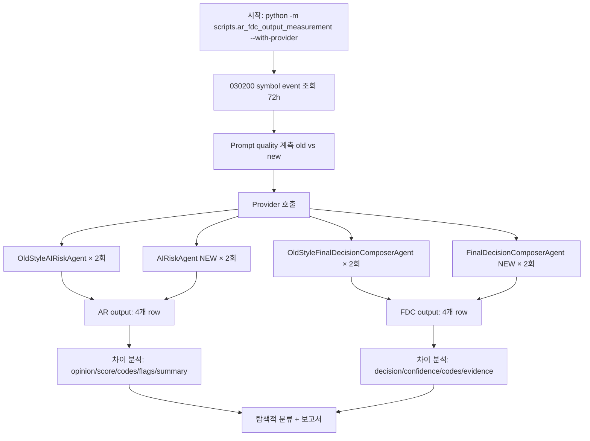

# AR/FDC Provider 실호출 탐색 검증 — 실행 계획

## 1. 목적

Prompt/context quality 개선 (EI provenance 전파 및 AR Symbol BUG 수정)이 실제 provider output에
어떤 변화를 주는지 탐색적으로 관찰한다.

**이번 작업은 exploratory validation이며, definitive proof가 아니다.**
인과 관계를 증명하지 않고, signal strength를 조심스럽게 해석한다.

### 핵심 제약
- 생산코드(`src/`) 변경 금지
- provider 호출은 exploratory only, causal claim 금지
- OLD/NEW 비교는 동일 입력 세트(symbol, event, request) 유지
- AR/FDC 결과는 분리 보고 (합산 금지)
- 결론 과장 금지: "명확한 개선" 같은 강한 표현 사용 금지

---

## 2. 현재 상태 분석

### 2.1 기존 스크립트 구조

[`scripts/ar_fdc_output_measurement.py`](scripts/ar_fdc_output_measurement.py:766)—`--with-provider` 플래그는
다음과 같이 동작:

```
AIRiskAgent(provider_client) 생성 → agent.run(request) 호출 → 내부적으로 _build_user_prompt() 사용
```

**문제: `_build_user_prompt()`는 현재 NEW-style (provenance-rich) prompt를 반환한다.**
OLD-style prompt로 provider를 호출하는 경로가 전혀 존재하지 않는다.

### 2.2 OLD-style formatter 상태

[`_build_old_style_ar_prompt()`](scripts/ar_fdc_output_measurement.py:82)—다음을 재현:
- Events 섹션: `  - [{event_type}] {headline}` (dash-prefix, provenance tag 없음)
- Symbol line: `{dc}` (DecisionContextEntity repr — BUG 상태 유지)

[`_build_old_style_fdc_prompt()`](scripts/ar_fdc_output_measurement.py:212)—동일한 old-style events 포맷.

두 formatter 모두 `AgentExecutionRequest`를 받아 `str`을 반환. 현재는 prompt quality 계측에만 사용.

### 2.3 `AIRiskAgent.run()` / `FinalDecisionComposerAgent.run()` 내부 구조

```
run(request):
    1. _build_system_prompt() → str  (변경 불필요)
    2. self._build_user_prompt(request) → str  ← 여기를 가로채야 함
    3. provider.generate_structured(system_prompt, user_prompt, ...)
    4. 응답 파싱 및 fallback 처리
```

---

## 3. 설계 결정: Subclass 접근법 (선택)

### 3.1 방식

기존 `ar_fdc_output_measurement.py`에 **inline subclass** 2개를 추가하여
old-style prompt를 provider에 전달한다:

```python
class _OldStyleAIRiskAgent(AIRiskAgent):
    """스크립트 내부 전용: OLD-style prompt로 provider 호출.

    NOTE: production 경로에서 재사용되지 않음. 측정 스크립트 전용 private class.
    """
    def _build_user_prompt(self, request: AgentExecutionRequest) -> str:
        return _build_old_style_ar_prompt(request)


class _OldStyleFinalDecisionComposerAgent(FinalDecisionComposerAgent):
    """스크립트 내부 전용: OLD-style prompt로 provider 호출.

    NOTE: production 경로에서 재사용되지 않음. 측정 스크립트 전용 private class.
    """
    def _build_user_prompt(self, request: AgentExecutionRequest) -> str:
        return _build_old_style_fdc_prompt(request)
```

### 3.2 선택 이유 (다른 접근법 대비)

| 접근법 | 코드 변경량 | 생산코드 영향 | fallback/error 처리 | 선정 |
|-------|-----------|-------------|-------------------|-----|
| **Subclass** | ~8 lines 추가 | 없음 | agent.run() 그대로 재사용 | ✅ |
| Direct provider call | ~15 lines 추가 | 없음 | bypass — fallback 로직 상실 | ❌ |
| Monkey-patch | ~5 lines 추가 | 없음 | 복원 누락 위험 | ❌ |

### 3.3 동작 흐름

```
[OLD-style provider 호출]
OldStyleAIRiskAgent(provider_client) 생성
  → _build_user_prompt() 오버라이드 → _build_old_style_ar_prompt(request) 반환
  → agent.run(request) 실행
    → system_prompt = _build_system_prompt()  (변경 없음)
    → user_prompt = self._build_user_prompt(request)  (OLD-style)
    → provider.generate_structured(system_prompt, user_prompt)
    → 응답 파싱 + fallback (동일)

[NEW-style provider 호출]
AIRiskAgent(provider_client) 생성 (기존 코드, 변경 없음)
  → _build_user_prompt() → provenance-rich prompt
  → agent.run(request) 실행 (동일)
```

---

## 4. 변경 사항 상세

### 4.1 추가할 코드

**A. Inline subclass 정의** (스크립트 내, ~310번 줄 `_measure_prompt_quality` 함수 근처)

```python
class _OldStyleAIRiskAgent(AIRiskAgent):
    """Old-style prompt를 사용하는 AR agent (provider 실호출용)."""
    def _build_user_prompt(self, request: AgentExecutionRequest) -> str:
        return _build_old_style_ar_prompt(request)


class _OldStyleFinalDecisionComposerAgent(FinalDecisionComposerAgent):
    """Old-style prompt를 사용하는 FDC agent (provider 실호출용)."""
    def _build_user_prompt(self, request: AgentExecutionRequest) -> str:
        return _build_old_style_fdc_prompt(request)
```

**B. Provider 호출 블록 확장** (기존 lines 766-778 → 아래 구조로 변경)

```
기존 (NEW-style만 2회):
  for i in range(2):
      agent = AIRiskAgent(provider_client=provider_client)
      result = _call_provider_ar(agent, request_with_ei, f"ar-new-{i+1}")

변경 (OLD + NEW 각 2회, 총 4회):
  # OLD-style: 2회
  for i in range(2):
      agent = _OldStyleAIRiskAgent(provider_client=provider_client)
      result = _call_provider_ar(agent, request_with_ei, f"ar-old-{i+1}")
  
  # NEW-style: 2회
  for i in range(2):
      agent = AIRiskAgent(provider_client=provider_client)
      result = _call_provider_ar(agent, request_with_ei, f"ar-new-{i+1}")
```

FDC도 동일한 패턴.

**C. Provider 결과 출력 확장** (기존 lines 941-951 → old/new 구분 출력)

기존은 `run` label에 "ar-new-1" 등이 포함되어 있어 출력 로직은 변경 불필요.
단, 요약 출력에서 old/new를 구분하여 표시.

### 4.2 변경하지 않는 것

- 생산 코드 (`src/` 아래 모든 파일)
- 테스트 코드
- 기존 prompt quality 계측 로직
- 판정 기준 (이번 측정은 exploratory observation이므로 자동 판정 없음)

### 4.3 총 코드 변경량

- 스크립트 1개: ~30-40 lines 추가
- production code: 0 lines

---

## 5. 실행 계획

### 5.1 실행 조건

| 항목 | 값 |
|------|-----|
| Symbol | 030200 고정 |
| 반복 횟수 | old/new 각 2회 기본, 결과 흔들리면 3회까지 허용 (tie-breaker only) |
| 총 호출 수 | 기본: AR 4회 + FDC 4회 = 8회, 최대: AR 6회 + FDC 6회 = 12회 |
| Provider | AIProviderClientImpl (실제 LLM) |
| 측정 시각 | 실행 시점 UTC |
| Event window | 72h (since = now - 72h) |
| OLD/NEW 공통 입력 | 반드시 동일 event set, 동일 symbol, 동일 request 유지 |

### 5.2 관찰 항목

**AR output 비교:**
| 항목 | 관찰ポイント |
|------|------------|
| `risk_opinion` | allow/reduce/reject/review — old vs new 차이 |
| `risk_score` | 0.0-1.0 — 점수 차이 방향 |
| `reason_codes` | 개수, 구체성, event 연관성 |
| `risk_flags` | 플래그 유무 및 종류 |
| `summary` | 요약 길이, event 언급 포함 여부 (specificity) |

**FDC output 비교:**
| 항목 | 관찰ポイント |
|------|------------|
| `decision_type` | buy/sell/hold/watch — old vs new 차이 |
| `confidence` | 0.0-1.0 — 차이 방향 |
| `reason_codes` | 개수, AR reason code 전파 여부 |
| `opposing_evidence` | 항목 개수, 구체성 (richness) |

### 5.3 분류 기준 (사전 고정)

실행 결과를 다음 3가지로 **탐색적 분류** (AR과 FDC 각각 별도 분류):

| 분류 | 정의 | 조건 |
|------|------|------|
| **improvement signal** | 같은 방향의 변화가 반복됨 | OLD→NEW에서 일관된 차이, 2회 모두 동일 방향 |
| **mixed signal** | 일부 개선 + 일부 동일/저하 | 항목별 방향 불일치, 또는 run 간 불일치 |
| **inconclusive** | 차이 미미 / 랜덤 | run-to-run variance가 signal보다 큼 |

**중요:**
- "명확한 개선", "확정적 결론" 같은 강한 표현 금지
- 결과 흔들림이 크면 definitive conclusion 금지
- AR과 FDC는 합산 금지, 각각 별도 분류

---

## 6. 보고서 형식

출력: [`plans/ar_fdc_provider_exploratory_report.md`](plans/)

### 6.1 섹션 구성 (9 sections)

| # | 섹션 | 내용 |
|---|------|------|
| 1 | 변경 파일 목록 | 수정된 파일과 변경량 |
| 2 | 실제 호출 구성 | symbol, OLD/NEW 횟수, 총 호출 수 |
| 3 | 호출 성공/실패 현황 | success/fail/timeout/fallback 건수 |
| 4 | AR output 비교 | risk_opinion, risk_score, reason_codes, risk_flags, summary specificity |
| 5 | FDC output 비교 | decision_type, confidence, reason_codes, opposing_evidence richness |
| 6 | variance 관찰 | run-to-run 동일성, OLD 2회 vs NEW 2회 안정성 |
| 7 | 탐색적 결론 | AR/FDC 각각 classification + signal strength 해석 |
| 8 | 남은 리스크 1개 | 예: run-to-run variance가 signal을 압도, 또는 OLD-style 근사 재현의 한계 |
| 9 | 다음 직접 액션 1개 | 예: 3회째 반복, 또는 EI→AR만 먼저 분리 측정 |

### 6.2 반드시 포함할 항목

- **Old/new prompt excerpt** — events section 2-3개 event 비교 (OLD는 approximate reconstruction 표기)
- **AR output diff** — 각 run의 raw 값 + 비교
- **FDC output diff** — 각 run의 raw 값 + 비교
- **Run-to-run variance** — 동일 prompt로 2회 호출 시 output 안정성
- **호출 성공/실패/timeout/fallback 현황** — 모두 기록
- **OLD-style "approximate reconstruction" 명시** — historical exact replay가 아님
- **Prompt/context quality 측정과 provider output 관찰 분리** — "provenance 개선으로 output quality가 좋아졌다"고 단정하지 말 것
- **AR/FDC 결과 분리 보고** — 합산 금지

---

## 7. 위험 요소

| 리스크 | 대응 |
|--------|------|
| Provider 비결정성으로 run-to-run variance가 큼 | 2회로 variance 관찰, 3회 추가 가능 |
| Token 증가로 인한 비용/지연 | 8회 호출 = 소규모, 감내 가능 |
| Old-style prompt 재현 부정확 | "approximate reconstruction" 명시 |
| 측정 결과가 "output quality 개선"으로 오독될 위험 | 보고서에 인과 주장 금지 명시 |

---

## 8. Mermaid: 실행 흐름



---

## 9. 승인 요청

아래 질문에 답변해 주시면 plan을 확정하고 Code 모드로 전환하겠습니다.

1) **반복 횟수**: old/new 각 2회 vs 3회?
2) **Subclass 접근법**: 위 설계에 동의하시나요? 다른 선호 방식이 있나요?
3) **추가 고려사항**: 놓친 부분이 있다면 알려주세요.
