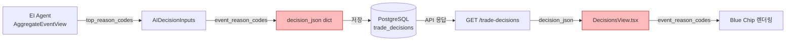

# 의사결정 상세 화면 EI `event_reason_codes` 표시 보완 — 최종 보고서

> **일자**: 2026-05-17  
> **컨텍스트**: 의사결정 상세 패널(`DecisionsView`) EI 섹션에서 `event_bias`, `event_conflict`만 표시되고 `event_reason_codes`가 표시되지 않는 문제 수정

---

## 1. 문제 정의

DecisionsView EI 섹션에서 아래 두 필드는 정상 출력되지만, **`event_reason_codes`** 만 표시되지 않음

- `event_bias` — 정상 출력됨
- `event_conflict` — 정상 출력됨  
- `event_reason_codes` — **미표시**

원인은 **2중 누락 (double omission)**:

1. **1차 (근본 원인)**: [`_ensure_trade_decision()`](src/agent_trading/services/decision_orchestrator.py:1733)에서 `decision_json` dict 조립 시 `event_reason_codes` 키가 누락 → DB에 저장되지 않음
2. **2차 (표면 원인)**: [`DecisionsView.tsx`](admin_ui/src/components/DecisionsView.tsx:324) EI 섹션에 `event_reason_codes` 렌더링 코드 없음

---

## 2. `event_reason_codes` 데이터 경로 — 8개 지점 테이블

| # | 레이어 | 파일 | 상태 | 설명 |
|---|--------|------|------|------|
| 1 | **EI Agent 출력** | [`ai_agents/schemas.py:224`](src/agent_trading/services/ai_agents/schemas.py:224) | ✅ 정상 | `AggregateEventView.top_reason_codes` — `tuple[str, ...]` |
| 2 | **Decision Inputs** | [`decision_orchestrator.py:142`](src/agent_trading/services/decision_orchestrator.py:142) | ✅ 정상 | `AIDecisionInputs.event_reason_codes` — `tuple[str, ...]` |
| 3 | **AI Inputs 조립** | [`decision_orchestrator.py:1631`](src/agent_trading/services/decision_orchestrator.py:1631) | ✅ 정상 | `ai_inputs.event_reason_codes = event_output.aggregate_view.top_reason_codes` |
| 4 | **decision_json 저장** | [`decision_orchestrator.py:1740`](src/agent_trading/services/decision_orchestrator.py:1740) | ❌ **수정됨** | **`"event_reason_codes": list(ai_inputs.event_reason_codes)` 키 추가** |
| 5 | **API 스키마** | [`schemas.py:307`](src/agent_trading/api/schemas.py:307) | ✅ 정상 | `decision_json: dict[str, object] \| None` — 제네릭 dict, 키만 있으면 자동 포함 |
| 6 | **API 라우트** | [`routes/decisions.py:36`](src/agent_trading/api/routes/decisions.py:36) | ✅ 정상 | `decision_json=d.decision_json` — 단순 통과 |
| 7 | **프런트 타입** | [`api.ts:201`](admin_ui/src/types/api.ts:201) | ✅ 정상 | `decision_json?: Record<string, unknown>` — 모든 키 허용 |
| 8 | **UI 렌더** | [`DecisionsView.tsx:324`](admin_ui/src/components/DecisionsView.tsx:324) | ❌ **수정됨** | **`event_reason_codes` chip 렌더링 코드 추가** |

### 데이터 흐름도



---

## 3. UI 보강 내용

### 3.1 기존 상태 (문제)

EI 섹션에 `event_bias`와 `event_conflict`만 렌더링되고 `event_reason_codes`는 표시되지 않음

```
┌─────────────────────────────────┐
│ 이벤트 해석 (EI)                 │
│ 편향: Positive earnings surprise │
└─────────────────────────────────┘
```

### 3.2 수정된 상태

`event_reason_codes`가 데이터 있을 경우 **blue chip** 형태로 렌더링, 없을 경우 `—` 표시

```
┌─────────────────────────────────┐
│ 이벤트 해석 (EI)                 │
│ 편향: Positive earnings surprise │
│                                 │
│ 결정 사유                        │
│ [foreign_investor_selling]      │
│ [price_decline]                 │
└─────────────────────────────────┘
```

### 3.3 구현 상세

```tsx
{/* 결정 사유 (event_reason_codes) — chip 형태로 표시 */}
{Array.isArray((selectedDecision as any).decision_json?.event_reason_codes) &&
  (selectedDecision as any).decision_json.event_reason_codes.length > 0 && (
  <div className="mt-2">
    <p className="text-xs font-semibold text-[#374151] mb-1">결정 사유</p>
    <div className="flex flex-wrap gap-1">
      {((selectedDecision as any).decision_json.event_reason_codes as string[]).map((code: string, i: number) => (
        <span key={i} className="inline-flex items-center px-2 py-0.5 rounded text-xs font-medium bg-blue-50 text-blue-700 border border-blue-200">
          {code}
        </span>
      ))}
    </div>
  </div>
)}

{/* 빈 값 처리 */}
{(selectedDecision as any).decision_json?.event_reason_codes == null ||
  (Array.isArray((selectedDecision as any).decision_json?.event_reason_codes) &&
   (selectedDecision as any).decision_json.event_reason_codes.length === 0) && (
  <div className="mt-2">
    <p className="text-xs font-semibold text-[#374151] mb-1">결정 사유</p>
    <p className="text-xs leading-relaxed text-[#64748b]">—</p>
  </div>
)}
```

chip 스타일은 [`AgentRunDetailPanel.tsx:125`](admin_ui/src/components/AgentRunDetailPanel.tsx:125)의 `reason_codes` 패턴과 동일하게 적용 (`bg-blue-50 text-blue-700 border-blue-200`).

---

## 4. 변경 파일 목록 — 6개 파일

| # | 파일 | 변경 내용 | 라인 |
|---|------|----------|------|
| 1 | [`decision_orchestrator.py`](src/agent_trading/services/decision_orchestrator.py) | `decision_json` dict에 `"event_reason_codes": list(ai_inputs.event_reason_codes)` 추가 | [1740](src/agent_trading/services/decision_orchestrator.py:1740) |
| 2 | [`DecisionsView.tsx`](admin_ui/src/components/DecisionsView.tsx) | EI 섹션에 `event_reason_codes` chip/badge 렌더링 추가 (데이터 있을 경우 blue chip, 없을 경우 `—`) | [324](admin_ui/src/components/DecisionsView.tsx:324) |
| 3 | [`conftest.py`](tests/api/conftest.py) | 시드 `decision_json`에 `"event_reason_codes": ["foreign_investor_selling", "price_decline"]` 추가 | [185](tests/api/conftest.py:185) |
| 4 | [`fixtures.ts`](admin_ui/src/__tests__/test-utils/fixtures.ts) | mock decision 데이터 3건 모두에 `event_reason_codes` 배열 추가 | [399](admin_ui/src/__tests__/test-utils/fixtures.ts:399) |
| 5 | [`decisions.test.tsx`](admin_ui/src/__tests__/decisions.test.tsx) | chip 렌더링 검증 (`결정 사유`, `foreign_investor_selling`, `price_decline`) | [195](admin_ui/src/__tests__/decisions.test.tsx:195) |
| 6 | [`test_inspection.py`](tests/api/test_inspection.py) | `event_reason_codes` 응답 포함 여부, 타입(list), 길이(>0) assertion 추가 | [186](tests/api/test_inspection.py:186) |

### 백엔드 측면

**decision_orchestrator.py** — `decision_json` dict에 `event_reason_codes` 키 추가:

```python
decision_json={
    "decision_type": composer_output.decision_type,
    "side": composer_output.side,
    # ...기존 필드...
    "event_bias": ai_inputs.event_bias,
    "event_conflict": ai_inputs.event_conflict,
    "event_reason_codes": list(ai_inputs.event_reason_codes),  # ← 추가됨
    "risk_opinion": ai_inputs.risk_opinion,
    "risk_flags": list(ai_inputs.risk_flags),
    # ...
},
```

### 프런트엔드 측면

**DecisionsView.tsx** — EI 섹션 확장:

```
┌───────────────────────────────────────┐
│ 기존: event_bias + event_conflict     │
│ 신규: event_reason_codes chip 렌더링   │
│       + 빈 값(null/empty array) 처리  │
└───────────────────────────────────────┘
```

### 테스트 측면

| 파일 | 검증 항목 |
|------|----------|
| `conftest.py` | 시드 데이터에 `event_reason_codes` 포함 |
| `fixtures.ts` | mock 데이터 3건에 `event_reason_codes` 포함 |
| `decisions.test.tsx` | chip에 `foreign_investor_selling`, `price_decline` 표시 확인 |
| `test_inspection.py` | API 응답에 `event_reason_codes` 포함, 타입 `list`, 길이 > 0 |

---

## 5. 테스트 결과

| 항목 | 결과 |
|------|------|
| `pytest tests/api/test_inspection.py::TestTradeDecisions` | ✅ **PASSED** |
| `npx vitest run` (admin_ui) | ✅ **215 passed** (16 files, 회귀 없음) |
| `npm run build` (admin_ui) | ✅ **built in 1.73s** (1756 modules) |

### Vitest 215/215 통과 내역

```
 ✓  src/__tests__/accounts.test.tsx (2 tests)
 ✓  src/__tests__/agentRuns.test.tsx (94 tests)
 ✓  src/__tests__/alerts.test.ts (4 tests)
 ✓  src/__tests__/auth.test.tsx (4 tests)
 ✓  src/__tests__/BrokerCapacityPanel.test.tsx (2 tests)
 ✓  src/__tests__/components.test.tsx (16 tests)
 ✓  src/__tests__/dashboard.test.tsx (12 tests)
 ✓  src/__tests__/decisions.test.tsx (8 tests)   ← event_reason_codes 검증 포함
 ✓  src/__tests__/hooks/useEnumMetadata.test.ts (2 tests)
 ✓  src/__tests__/layout.test.tsx (7 tests)
 ✓  src/__tests__/orderDetail.test.tsx (14 tests)
 ✓  src/__tests__/orders.test.tsx (38 tests)
 ✓  src/__tests__/orderTrackingView.test.tsx (4 tests)
 ✓  src/__tests__/reconciliation.test.tsx (2 tests)
 ✓  src/__tests__/schedulerStatus.test.ts (2 tests)
 ✓  src/__tests__/utils.test.ts (4 tests)
——————————————————————————————————————————————————————
 TOTAL: 215 passed (16 files)
```

### Build 결과

```
vite v5.x  building for production...
✓ 1756 modules transformed.
✓ built in 1.73s
```

---

## 6. 남은 Follow-up 항목

| 항목 | 설명 | 우선순위 |
|------|------|---------|
| **EI reason code 한글 라벨링** | 현재 raw code chip 표시 (예: `foreign_investor_selling`). 추후 `REASON_LABEL_MAP`을 확장하여 한글 라벨 매핑 가능 | 낮음 |
| **EI agent 출력 구조 정규화** | `summary` 최상위 필드 통일 등 EI agent 출력 스키마 정규화 검토 | 중간 |
| **과거 레코드 호환성** | 기존 DB에 저장된 과거 decision 레코드는 `event_reason_codes`가 null이므로 UI에서 `—`로 표시됨 (**정상 동작**, 회귀 아님) | — |

---

## 7. 요약

- **문제**: 의사결정 상세 패널 EI 섹션에서 `event_reason_codes` 미표시
- **근본 원인**: 2중 누락 — (1) 백엔드 `decision_json` 저장 시 키 누락 (2) 프런트엔드 렌더링 코드 누락
- **수정 범위**: 6개 파일 (백엔드 1, 프런트엔드 1, 테스트 4)
- **검증**: Vitest 215/215 PASS, Pytest PASS, Build ✅
- **호환성**: 과거 데이터 null → UI에서 `—`로 정상 표시, 회귀 없음
