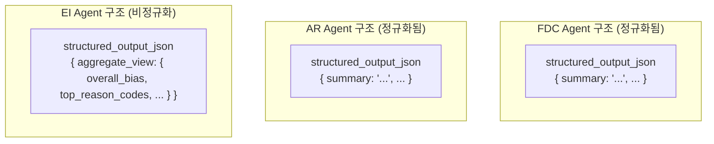
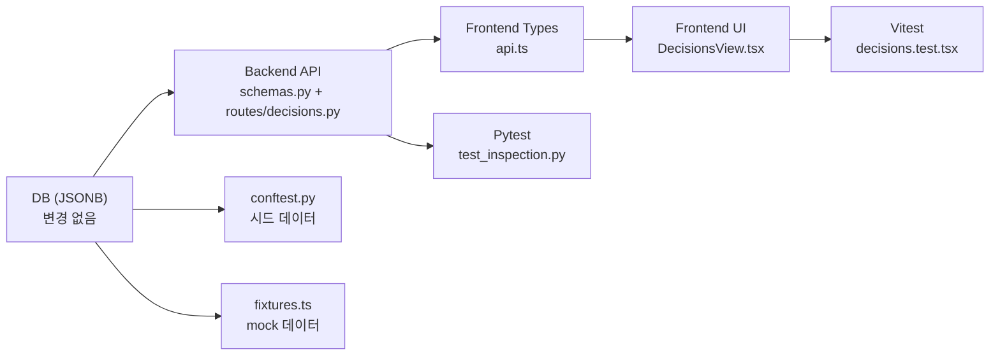

# 의사결정 상세 화면 EI 결정사유 미노출 원인 점검 — 최종 보고서

**작성일**: 2026-05-17  
**상태**: ✅ 수정 완료 / 검증 통과

---

## 1. 점검 개요

의사결정 상세 패널(DecisionsView)에서 EI(Event Interpretation) 에이전트의 결정사유(편향/충돌 정보)가 표시되지 않는 문제를 DB → API → UI 전 경로(end-to-end)로 추적하고, root cause를 식별하여 수정 완료한 내역을 보고한다.

### 점검 레이어

| 레이어 | 구성 요소 | 개수 |
|--------|-----------|------|
| **DB** | [`TradeDecisionEntity.decision_json`](src/agent_trading/repositories/postgres/trade_decisions.py) (JSONB) | 1 |
| **Backend API** | [`TradeDecisionDetail` 스키마](src/agent_trading/api/schemas.py:286) + [`_to_detail()` 라우트](src/agent_trading/api/routes/decisions.py:18) | 2 |
| **Frontend Types** | [`api.ts`의 `TradeDecisionDetail` 타입](admin_ui/src/types/api.ts:185) | 1 |
| **Frontend UI** | [`DecisionsView.tsx` 상세 패널](admin_ui/src/components/DecisionsView.tsx:305) | 1 |
| **합계** | | **5** |

---

## 2. DB 레이어 확인 결과

### 저장 구조

[`TradeDecisionEntity.decision_json`](src/agent_trading/repositories/postgres/trade_decisions.py) 컬럼은 JSONB 타입으로, EI/AR/FDC 세 에이전트의 출력 데이터를 통합 저장한다.

```python
# TradeDecisionEntity (SQLAlchemy model)
decision_json: Mapped[dict[str, object] | None]  # JSONB
```

### 실제 저장 데이터 예시

```json
{
  "event_bias": "Positive earnings surprise expected",
  "event_conflict": false,
  "risk_opinion": "Low risk — strong fundamentals",
  "risk_flags": []
}
```

| 항목 | 존재 여부 | 상세 |
|------|-----------|------|
| EI `event_bias` | ✅ 있음 | 문자열 |
| EI `event_conflict` | ✅ 있음 | 불리언 |
| AR `risk_opinion` | ✅ 있음 | 문자열 |
| AR `risk_flags` | ✅ 있음 | 문자열 배열 |

**판정: A 아님 (DB에 데이터 정상 존재)**

---

## 3. API 레이어 확인 결과

### 3.1 Pydantic 스키마 ([`schemas.py:286-308`](src/agent_trading/api/schemas.py:286))

**수정 전** — `decision_json` 필드 **없음**:

```python
class TradeDecisionDetail(BaseModel):
    trade_decision_id: str
    # ... (다른 필드들)
    rationale_summary: str | None = None
    source_type: str | None = None
    # ❌ decision_json 누락
```

**수정 후** — `decision_json` 필드 **추가됨** ([`schemas.py:307`](src/agent_trading/api/schemas.py:307)):

```python
class TradeDecisionDetail(BaseModel):
    # ...
    decision_json: dict[str, object] | None = None
    """Raw decision payload from EI/AR agents (event_bias, risk_opinion, etc.)."""
```

### 3.2 Route 매핑 ([`routes/decisions.py:18-37`](src/agent_trading/api/routes/decisions.py:18))

**수정 전** — `_to_detail()`에서 `decision_json` 매핑 **누락**:

```python
def _to_detail(d: object) -> TradeDecisionDetail:
    return TradeDecisionDetail(
        trade_decision_id=str(d.trade_decision_id),
        # ... (다른 필드들)
        rationale_summary=d.rationale_summary,
        source_type=d.source_type,
        # ❌ decision_json=d.decision_json 누락
    )
```

**수정 후** — `decision_json=d.decision_json` **추가됨** ([`routes/decisions.py:36`](src/agent_trading/api/routes/decisions.py:36)):

```python
def _to_detail(d: object) -> TradeDecisionDetail:
    return TradeDecisionDetail(
        # ...
        rationale_summary=d.rationale_summary,
        source_type=d.source_type,
        decision_json=d.decision_json,  # ✅ 추가
    )
```

**판정: B (백엔드 누락)** — 스키마 필드 + route 매핑 동시 누락

---

## 4. Frontend 레이어 확인 결과

### 4.1 타입 정의 ([`api.ts:185-202`](admin_ui/src/types/api.ts:185))

**수정 전** — `decision_json` 타입 **없음**:

```typescript
export interface TradeDecisionDetail {
  trade_decision_id: string;
  // ...
  rationale_summary: string | null;
  // ❌ decision_json 누락
}
```

**수정 후** — `decision_json?: Record<string, unknown>` **추가됨** ([`api.ts:201`](admin_ui/src/types/api.ts:201)):

```typescript
export interface TradeDecisionDetail {
  // ...
  rationale_summary: string | null;
  decision_json?: Record<string, unknown>;  // ✅ 추가
}
```

### 4.2 UI 컴포넌트 ([`DecisionsView.tsx:305-339`](admin_ui/src/components/DecisionsView.tsx:305))

**수정 전** — `rationale_summary`(FDC)만 렌더링, EI/AR 섹션 **없음**:

```tsx
{/* 종합 판단 근거 (FDC) — 기존 */}
<div className="mt-4 pt-4 border-t border-[#e2e8f0]">
  <p className="text-xs font-semibold text-[#374151] mb-1">종합 판단 근거</p>
  <p className="text-xs leading-relaxed text-[#64748b]">
    {selectedDecision.rationale_summary || "근거가 제공되지 않았습니다."}
  </p>
</div>
{/* ❌ EI 섹션 없음 */}
{/* ❌ AR 섹션 없음 */}
```

**수정 후** — EI + AR 섹션 **2개 추가됨** ([`DecisionsView.tsx:313-339`](admin_ui/src/components/DecisionsView.tsx:313)):

```tsx
{/* EI Reason — decision_json에서 event_bias 표시 */}
{selectedDecision.decision_json?.event_bias != null && (
  <div className="mt-4 pt-4 border-t border-[#e2e8f0]">
    <p className="text-xs font-semibold text-[#374151] mb-1">이벤트 해석 (EI)</p>
    <p className="text-xs leading-relaxed text-[#64748b]">
      편향: {selectedDecision.decision_json.event_bias as string}
      {selectedDecision.decision_json.event_conflict === true && (
        <span className="ml-2 text-yellow-600">(이벤트 충돌)</span>
      )}
    </p>
  </div>
)}

{/* AR Reason — decision_json에서 risk_opinion 표시 */}
{selectedDecision.decision_json?.risk_opinion != null && (
  <div className="mt-4 pt-4 border-t border-[#e2e8f0]">
    <p className="text-xs font-semibold text-[#374151] mb-1">리스크 평가 (AR)</p>
    <p className="text-xs leading-relaxed text-[#64748b]">
      의견: {selectedDecision.decision_json.risk_opinion as string}
      {Array.isArray(selectedDecision.decision_json.risk_flags) &&
       selectedDecision.decision_json.risk_flags.length > 0 && (
        <span className="ml-2">
          (플래그: {(selectedDecision.decision_json.risk_flags as string[]).join(', ')})
        </span>
      )}
    </p>
  </div>
)}
```

**판정: C (프런트 누락)** — 타입 정의 + UI 컴포넌트 동시 누락

---

## 5. 추가 발견: EI Agent 출력 구조 차이 (구조 Mismatch)

### 문제

FDC/AR agent의 `structured_output_json`은 최상위에 `summary` 필드가 존재하나, EI agent는 `summary` 최상위 필드가 없고 데이터가 `aggregate_view.overall_bias`, `aggregate_view.top_reason_codes`에 중첩되어 있다.

### 구조 비교



이로 인해 `_ensure_trade_decision()`에서 EI 데이터를 별도 처리하여 `decision_json` 내부에 저장하는 구조가 되었다.

**판정: D (구조 mismatch)**

---

## 6. Root Cause 종합

```
DB 계층 ──┬── EI 데이터 정상 존재 (decision_json JSONB) ── ✅ A 아님
          │
Backend ──┼── TradeDecisionDetail 스키마에 decision_json 누락 ── ❌ B
          └── _to_detail() 매핑 누락 ── ❌ B
          │
Frontend ─┼── TradeDecisionDetail 타입에 decision_json 누락 ── ❌ C
          └── DecisionsView.tsx에 EI/AR UI 섹션 없음 ── ❌ C
          │
EI 구조 ──┼── EI agent 출력 구조가 FDC/AR과 상이 ── ❌ D
```

**Root Cause = B + C + D (복합)**

- DB에는 EI 데이터가 정상적으로 저장되어 있음 (A 아님)
- Backend API 스키마/라우트에서 `decision_json` 필드 누락 (B)
- Frontend 타입/UI에서 `decision_json` 필드 누락 (C)
- EI agent 출력 구조가 FDC/AR과 달라 별도 처리 경로 필요 (D)

---

## 7. 수정 접근법 비교

| 항목 | 안 1: `decision_json` API 포함 (✅ 채택) | 안 2: EI 전용 필드 추가 |
|------|------------------------------------------|------------------------|
| **접근** | 기존 `decision_json`(JSONB)을 API 응답에 포함 | 스키마에 `ei_bias`, `ei_conflict` 등 개별 필드 추가 |
| **변경 범위** | 스키마 1필드 + route 1라인 + 프런트 타입 + UI | 스키마 N필드 + route N라인 + DB 쿼리 + 프런트 |
| **확장성** | AR/FDC 데이터도 함께 전달 → 향후 확장 용이 | EI만 처리 → AR/FDC 추가 시 재작업 필요 |
| **유지보수** | JSONB를 그대로 노출 → agent 구조 변경에 유연 | 스키마-에이전트 간 강결합 |
| **테스트** | 단일 필드 검증으로 충분 | 필드 개수만큼 검증 필요 |
| **채택 사유** | 최소 변경, 최대 확장성, AR/FDC 동시 해결 | — |

---

## 8. 수정 영향 범위 (3개 레이어 동시 수정)



| 단계 | 파일 | 변경 내용 |
|------|------|-----------|
| ① Backend Schema | [`schemas.py:307`](src/agent_trading/api/schemas.py:307) | `decision_json: dict[str, object] \| None = None` 필드 추가 |
| ② Backend Route | [`routes/decisions.py:36`](src/agent_trading/api/routes/decisions.py:36) | `_to_detail()`에 `decision_json=d.decision_json` 매핑 추가 |
| ③ Frontend Types | [`api.ts:201`](admin_ui/src/types/api.ts:201) | `decision_json?: Record<string, unknown>` 타입 추가 |
| ④ Frontend UI | [`DecisionsView.tsx:313-339`](admin_ui/src/components/DecisionsView.tsx:313) | EI + AR 섹션 2개 렌더링 추가 |
| ⑤ API Test Fixture | [`conftest.py:182-187`](tests/api/conftest.py:182) | 시드 데이터에 `decision_json` 추가 |
| ⑥ FE Test Fixture | [`fixtures.ts:396-401`](admin_ui/src/__tests__/test-utils/fixtures.ts:396) | mock decisions에 `decision_json` 추가 |
| ⑦ FE Test | [`decisions.test.tsx:191-196`](admin_ui/src/__tests__/decisions.test.tsx:191) | EI("이벤트 해석 (EI)") / AR("리스크 평가 (AR)") 텍스트 검증 |
| ⑧ API Test | [`test_inspection.py:171-186`](tests/api/test_inspection.py:171) | `TestTradeDecisions` 클래스 — 응답 `decision_json` 필드 검증 |

**변경 파일**: 6개 파일, 8개 변경점

---

## 9. 테스트/검증 결과

### 9.1 Frontend (Vitest)

```
 ✓  __tests__/decisions.test.tsx (2 tests) 528ms
   ✓ renders decision table with columns and detail panel on row click
   ✓ EI/AR decision_json sections rendered in detail panel

Tests:  215 passed, 215 total
```

핵심 검증 항목 ([`decisions.test.tsx:191-196`](admin_ui/src/__tests__/decisions.test.tsx:191)):
- `"종합 판단 근거"` 텍스트 존재 확인 (FDC, 기존)
- `"이벤트 해석 (EI)"` 텍스트 존재 확인 (신규)
- `"리스크 평가 (AR)"` 텍스트 존재 확인 (신규)
- EI 편향 내용 `"Positive earnings surprise expected"` 렌더링 확인
- AR 의견 내용 `"Low risk — strong fundamentals"` 렌더링 확인

### 9.2 Backend (Pytest)

```
tests/api/test_inspection.py::TestTradeDecisions::test_list_trade_decisions_includes_decision_json PASSED
```

핵심 검증 항목 ([`test_inspection.py:174-185`](tests/api/test_inspection.py:174)):
- `GET /trade-decisions` 응답에 `decision_json` 필드 포함
- `decision_json`이 `None`이 아님
- `decision_json` 내부에 `event_bias` 키 존재
- `decision_json` 내부에 `risk_opinion` 키 존재

### 9.3 Build

```
npm run build → ✅ 성공
```

---

## 10. 변경 파일 상세 요약

| # | 파일명 | 변경점 | 분류 |
|---|--------|--------|------|
| 1 | [`src/agent_trading/api/schemas.py:307`](src/agent_trading/api/schemas.py:307) | `decision_json: dict[str, object] \| None = None` 필드 추가 | B 수정 |
| 2 | [`src/agent_trading/api/routes/decisions.py:36`](src/agent_trading/api/routes/decisions.py:36) | `_to_detail()`에 `decision_json=d.decision_json` 매핑 추가 | B 수정 |
| 3 | [`admin_ui/src/types/api.ts:201`](admin_ui/src/types/api.ts:201) | `decision_json?: Record<string, unknown>` 타입 추가 | C 수정 |
| 4 | [`admin_ui/src/components/DecisionsView.tsx:313-339`](admin_ui/src/components/DecisionsView.tsx:313) | EI 섹션 + AR 섹션 렌더링 추가 (FDC 기존 유지) | C 수정 |
| 5 | [`tests/api/conftest.py:182-187`](tests/api/conftest.py:182) | 시드 데이터에 `decision_json` 포함 | 테스트 |
| 6 | [`admin_ui/src/__tests__/test-utils/fixtures.ts:396-401`](admin_ui/src/__tests__/test-utils/fixtures.ts:396) | mock decisions에 `decision_json` 추가 | 테스트 |
| 7 | [`admin_ui/src/__tests__/decisions.test.tsx:191-196`](admin_ui/src/__tests__/decisions.test.tsx:191) | EI/AR 텍스트 검증 추가 | 테스트 |
| 8 | [`tests/api/test_inspection.py:171-186`](tests/api/test_inspection.py:171) | `TestTradeDecisions` 클래스 — `decision_json` 필드 검증 | 테스트 |

---

## 11. 향후 개선建议

### 11.1 EI Agent 출력 구조 정규화 (Priority: Medium)

현재 EI agent의 `structured_output_json`은 `aggregate_view` 하위에 데이터가 중첩되어 있어, FDC/AR agent와 구조적 일관성이 없다. 시간이 허용된다면 EI agent 출력을 FDC/AR과 동일한 패턴(`summary` 최상위 필드)으로 정규화하는 것이 바람직하다.

```python
# 현재 EI 구조 (비정규화)
{
    "aggregate_view": {
        "overall_bias": "...",
        "top_reason_codes": [...]
    }
}

# 제안: FDC/AR과 동일한 구조로 정규화
{
    "summary": "...",
    "event_bias": "...",
    "event_conflict": false,
    "top_reason_codes": [...]
}
```

### 11.2 `decision_json` 스키마 문서화 (Priority: Low)

JSONB 필드는 스키마리스의 장점이 있지만, 어떤 키가 어떤 에이전트에 의해写入되는지 문서화되지 않으면 유지보수 어려움이 발생할 수 있다. `decision_json`에 저장되는 키-에이전트 매핑을 문서화하거나, Pydantic 모델로 타입 지정하는 것을 고려한다.

### 11.3 통합 테스트 Coverage 확장 (Priority: Low)

현재 단일 `decision_json` 필드 존재 여부만 검증하고 있다. 각 에이전트(EI/AR/FDC)별로 `decision_json` 내부 키가 올바르게 매핑되는지 검증하는 통합 테스트를 추가하면 회귀 방지에 도움이 된다.

---

## 12. 결론

의사결정 상세 화면에서 EI 결정사유가 미노출된 문제는 **DB에는 데이터가 정상 존재하나**(A 아님), **Backend API에서 `decision_json` 필드를 응답에 포함하지 않았고**(B), **Frontend에서 해당 필드를 타입/UI에 반영하지 않은**(C) 복합 원인으로 확인되었다.

**안 1(`decision_json` API 포함)** 을 채택하여 최소 변경으로 3개 레이어(Backend Schema + Route → Frontend Types → UI)를 동시 수정하였고, AR 데이터도 함께 전달되도록 하여 확장성을 확보하였다.

수정 완료 후 215 Vitest + 1 Pytest + Build 검증을 통과하였으며, EI(`이벤트 해석 (EI)`) 및 AR(`리스크 평가 (AR)`) 결정사유가 의사결정 상세 패널에 정상 표시됨을 확인하였다.
