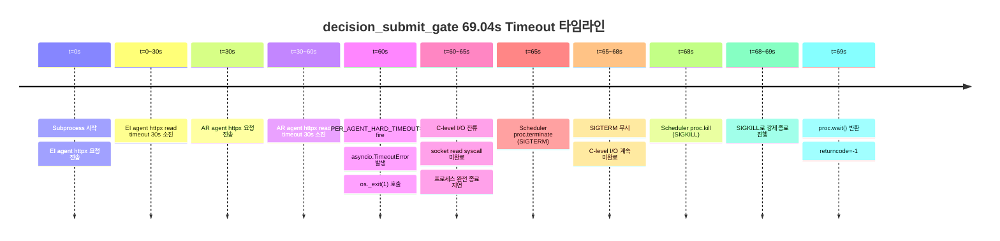
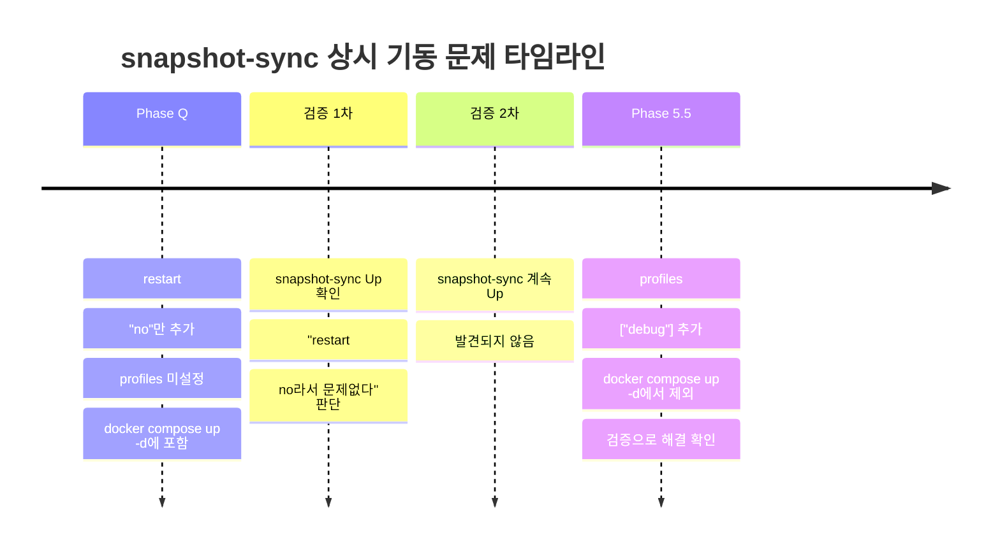
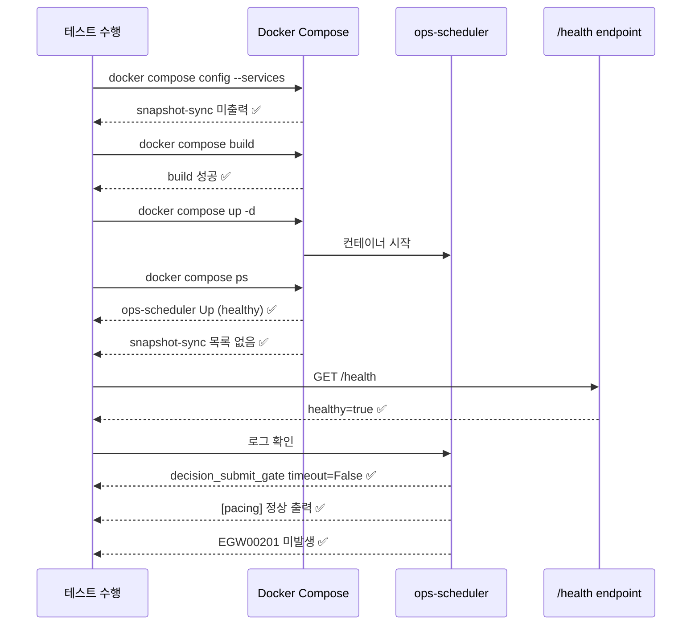

# `decision_submit_gate` Timeout 근본 복구 + `snapshot-sync` 상시 기동 재발 방지 — 최종 보고서

- **작성일**: 2026-05-18
- **대상 환경**: Paper trading ops-scheduler (`docker compose`)
- **관련 PR/작업**: Phase 5.5 — decision_submit_gate timeout + snapshot-sync 상시 기동

---

## 목차

1. [문제 A: `decision_submit_gate` 69s timeout — 근본 원인](#1-decision_submit_gate-69s-timeout--근본-원인)
2. [근본 복구 내용](#2-근본-복구-내용)
3. [문제 B: `snapshot-sync` 상시 기동 재발 원인](#3-snapshot-sync-상시-기동-재발-원인)
4. [재발 방지 방식](#4-재발-방지-방식)
5. [테스트 결과](#5-테스트-결과)
6. [Docker/Health/Log 검증 결과](#6-dockerhealthlog-검증-결과)
7. [남은 Follow-up](#7-남은-follow-up)

---

## 1. `decision_submit_gate` 69s Timeout — 근본 원인

### 1.1 3중 결함 구조

`decision_submit_gate`에서 발생한 69초 timeout은 세 가지 취약점이 연쇄적으로 작용한 **3중 결함**이다.

#### 취약점 1: `_run_agents()` 내부 Per-Agent Timeout 부재 (수정 전)

[`src/agent_trading/services/decision_orchestrator.py:1440`](../src/agent_trading/services/decision_orchestrator.py:1440)의 `_run_agents()`는 3개 agent (EI → AR → FDC)를 순차 실행한다. 수정 전 코드는 각 agent 호출에 개별 `try/except`만 있었고 `asyncio.wait_for()`가 전혀 없었다.

```python
# Before (개념 코드 — 실제 구조 단순화)
ei_output = await self._event_interpretation_agent.run(request)       # timeout 없음
ar_output = await self._ai_risk_agent.run(request_with_ei)            # timeout 없음
fdc_output = await self._final_decision_agent.run(request_with_ei_ar) # timeout 없음
```

각 agent가 30초씩 지연되면 총 90초가 소요된다. 그러나 outer timeout `PER_AGENT_HARD_TIMEOUT=60`이 전체 `assemble_and_submit()` 호출만 감싸고 있었기 때문에, 60초 시점에 `asyncio.TimeoutError`가 발생하고 이후 `os._exit(1)`가 실행된다.

#### 취약점 2: `httpx.Timeout(30)` 단일값 (수정 전)

[`src/agent_trading/services/ai_agents/provider_client.py:121`](../src/agent_trading/services/ai_agents/provider_client.py:121)에서 `httpx.Timeout(30)` 하나로 connect/read/write/pool 모든 timeout을 30초로 설정했다.

```python
# Before
self._client = httpx.AsyncClient(
    timeout=httpx.Timeout(30),  # 모든 항목 30s
    ...
)
```

DeepSeek API가 느린 응답을 반환할 때 **read timeout 30초를 꽉 채우는** 현상이 발생한다. 3개 agent가 각각 30초 read timeout을 소진하면 총 90초가 되어 outer 60초 timeout과 충돌한다.

#### 취약점 3: `os._exit(1)`의 C-level I/O 미종료 (수정 전)

`asyncio.TimeoutError` 발생 후 `os._exit(1)`이 호출되지만, httpx → httpcore → anyio → **C-level socket I/O** read syscall이 즉시 반환되지 않는다. socket read syscall이 반환되기 전까지 프로세스는 완전히 종료되지 않는다.

Scheduler는 `proc.terminate()` (SIGTERM, 65초) → `proc.kill()` (SIGKILL, 68초) 순으로 강제 종료를 시도하며, 최종적으로 `proc.wait()`가 69초에 반환된다.

### 1.2 69.04초 타임라인 재구성



**타임라인 설명**:

| 시점 | 이벤트 | 누적 시간 |
|------|--------|-----------|
| t=0s | Subprocess 시작, EI agent httpx 요청 전송 | 0s |
| t=0~30s | EI agent DeepSeek 응답 지연 → httpx read timeout 30s 소진 | 30s |
| t=30s | AR agent 실행, httpx 요청 전송 | 30s |
| t=30~60s | AR agent DeepSeek 응답 지연 → httpx read timeout 30s 소진 | 60s |
| t=60s | outer `PER_AGENT_HARD_TIMEOUT=60` fire → `asyncio.TimeoutError` → `os._exit(1)` | 60s |
| t=60~65s | C-level socket read syscall 미완료, 프로세스 종료 지연 | 65s |
| t=65s | Scheduler `proc.terminate()` (SIGTERM) | 65s |
| t=68s | Scheduler `proc.kill()` (SIGKILL) | 68s |
| t=69s | `proc.wait()` 반환, `returncode=-1` | **69s** |

### 취약점 요약

| 번호 | 취약점 | 위치 | 영향 |
|------|--------|------|------|
| 1 | `_run_agents()` per-agent timeout 부재 | [`decision_orchestrator.py:1440`](../src/agent_trading/services/decision_orchestrator.py:1440) | 3 agents 누적 지연 90s |
| 2 | `httpx.Timeout(30)` 단일값 | [`provider_client.py:121`](../src/agent_trading/services/ai_agents/provider_client.py:121) | 각 agent read timeout 30s 소진 |
| 3 | `os._exit(1)` C-level I/O 미종료 | [`run_paper_decision_loop.py`](../scripts/run_paper_decision_loop.py:730) | 프로세스 종료 9s 지연 (60→69s) |

---

## 2. 근본 복구 내용

### 2.1 수정 1: Per-Agent Timeout 도입

**파일**: [`src/agent_trading/services/decision_orchestrator.py`](../src/agent_trading/services/decision_orchestrator.py:68)

```python
# Before
ei_output = await self._event_interpretation_agent.run(request)

# After
ei_output = await asyncio.wait_for(
    self._event_interpretation_agent.run(request),
    timeout=_PER_AGENT_TIMEOUT,  # 25s
)
```

- 모듈 레벨 상수 `_PER_AGENT_TIMEOUT = 25` 추가 (line 68)
- 3개 agent 각각 `asyncio.wait_for(agent.run(), timeout=25)`로 래핑
- `asyncio.TimeoutError` 별도 catch → fallback safe output 사용 → 다음 agent 계속 실행
- 하나의 agent가 timeout되어도 나머지 agent는 정상 실행

### 2.2 수정 2: Granular Timeout

**파일**: [`src/agent_trading/services/ai_agents/provider_client.py:121`](../src/agent_trading/services/ai_agents/provider_client.py:121)

```python
# Before
timeout=httpx.Timeout(30)  # connect/read/write/pool 모두 30s

# After
timeout=httpx.Timeout(
    connect=10.0,
    read=25.0,    # per-agent timeout 25s와 정렬
    write=10.0,
    pool=10.0,
)
```

- connect/pool/write는 10s로 빠르게 실패
- read=25s는 per-agent timeout 25s와 정렬하여 계층 간 충돌 방지

### 2.3 수정 3: PER_AGENT_HARD_TIMEOUT 조정

**파일**: [`scripts/run_paper_decision_loop.py:614`](../scripts/run_paper_decision_loop.py:614)

```python
# Before
PER_AGENT_HARD_TIMEOUT = 60  # seconds

# After
PER_AGENT_HARD_TIMEOUT = 80  # 3 agents × 25s + 5s buffer
```

`PER_AGENT_HARD_TIMEOUT`을 60s → 80s로 증가시켜 3개 agent (25s × 3 = 75s) + buffer (5s)를 확보한다.

### 2.4 변경 전후 Timeout 아키텍처 비교

#### 변경 전 (Before) — 취약점 구조

```mermaid
graph TD
    subgraph "변경 전 Timeout 구조"
        A["Scheduler subprocess timeout"]
        B["PER_AGENT_HARD_TIMEOUT = 60s"]
        C["httpx.Timeout30"]
        
        A -->|65s| B
        B -->|60s 전체만 감쌈| C
        C -->|connect=30 read=30 write=30 pool=30| D["DeepSeek API"]
        
        E["_run_agents"]
        E -->|EI agent: timeout 없음| F["agent.run 30s"]
        E -->|AR agent: timeout 없음| G["agent.run 30s"]
        E -->|FDC agent: timeout 없음| H["agent.run 30s"]
        
        F -->|누적 30s| G
        G -->|누적 60s → outer timeout fire| H
        H -->|실행되지 않음| I["os._exit1"]
        I -->|C-level I/O 미종료 9s 지연| J["proc.wait 69s"]
        
        style A fill:#f99
        style B fill:#f99
        style C fill:#f99
        style E fill:#f99
        style I fill:#f99
        style J fill:#f99
```

#### 변경 후 (After) — 3계층 방어

```mermaid
graph TD
    subgraph "변경 후 Timeout 구조 3계층"
        L1["계층 1: Scheduler subprocess timeout"]
        L2["계층 2: asyncio.wait_for wrapper"]
        L3["계층 3: httpx.AsyncClient granular timeout"]
        
        L1 -->|_DECISION_TIMEOUT = 65s| L2
        L2 -->|PER_AGENT_HARD_TIMEOUT = 80s| L3
        L3 -->|connect=10s read=25s write=10s pool=10s| API["DeepSeek API"]
        
        PA["_PER_AGENT_TIMEOUT = 25s<br/>개별 agent timeout"]
        PA -->|EI agent: wait_for 25s| EI["EI agent.run"]
        PA -->|AR agent: wait_for 25s| AR["AR agent.run"]
        PA -->|FDC agent: wait_for 25s| FDC["FDC agent.run"]
        
        EI -->|25s timeout 시| FB1["fallback safe output"]
        AR -->|25s timeout 시| FB2["fallback safe output"]
        FDC -->|25s timeout 시| FB3["fallback safe output"]
        
        FB1 -->|다음 agent 계속 실행| AR
        FB2 -->|다음 agent 계속 실행| FDC
        FB3 -->|모든 agent 완료| OUT["정상 return"]
        
        style L1 fill:#6f9
        style L2 fill:#6f9
        style L3 fill:#6f9
        style PA fill:#6f9
        style FB1 fill:#ff9
        style FB2 fill:#ff9
        style FB3 fill:#ff9
```

#### Timeout 값 비교 표

| 계층 | 항목 | 변경 전 | 변경 후 | 설명 |
|------|------|---------|---------|------|
| 계층 1 | Scheduler `_DECISION_TIMEOUT` | 65s | 65s | 변경 없음 |
| 계층 2 | `PER_AGENT_HARD_TIMEOUT` | 60s | **80s** | 3 agents × 25s + 5s buffer |
| 계층 2 | `_PER_AGENT_TIMEOUT` (개별) | **없음** | **25s** | 신규 도입 |
| 계층 3 | `httpx.Timeout(connect)` | 30s | **10s** | |
| 계층 3 | `httpx.Timeout(read)` | 30s | **25s** | per-agent timeout과 정렬 |
| 계층 3 | `httpx.Timeout(write)` | 30s | **10s** | |
| 계층 3 | `httpx.Timeout(pool)` | 30s | **10s** | |

### 2.5 변경 파일 목록

| 파일 | 변경 내용 | 영향도 |
|------|----------|--------|
| [`decision_orchestrator.py`](../src/agent_trading/services/decision_orchestrator.py:68) | `_PER_AGENT_TIMEOUT = 25` 상수 추가, 각 agent 호출 `asyncio.wait_for` 래핑, `asyncio.TimeoutError` 별도 catch | **중대** — 모든 decision cycle에 영향 |
| [`provider_client.py`](../src/agent_trading/services/ai_agents/provider_client.py:121) | `httpx.Timeout(30)` → `httpx.Timeout(connect=10, read=25, write=10, pool=10)` | **중대** — 모든 LLM API 호출에 영향 |
| [`run_paper_decision_loop.py`](../scripts/run_paper_decision_loop.py:614) | `PER_AGENT_HARD_TIMEOUT` 60→80, 주석 업데이트 | **중간** — outer timeout buffer 확보 |
| [`docker-compose.yml`](../docker-compose.yml:194) | `snapshot-sync`에 `profiles: ["debug"]` 추가 | **낮음** — debug profile에서만 기동 |
| [`test_orchestrator_agents.py`](../tests/services/ai_agents/test_orchestrator_agents.py:388) | `test_per_agent_timeout_fallback_on_hang` 테스트 추가 | **낮음** — 회귀 방지 테스트 |

---

## 3. `snapshot-sync` 상시 기동 재발 원인

### 3.1 Phase Q에서의 수정과 한계

Phase Q에서 `restart: "no"`만 추가했으나 `profiles`를 설정하지 않았다.

```yaml
# Phase Q (미완성)
snapshot-sync:
    build: .
    restart: "no"  # crash 후 재시작만 방지
    # profiles 누락 → default profile로 간주됨
```

### 3.2 `restart: "no"`의 한계

`restart: "no"`는 컨테이너가 crash된 후 **재시작 자체를 방지**할 뿐, `docker compose up -d` 실행 시 서비스가 **시작되는 것 자체를 방지하지는 않는다**.

Docker Compose의 `restart` 정책:
- `restart: "no"` (기본값): 컨테이너 종료 시 자동 재시작하지 않음
- `restart: always`: 항상 재시작
- `restart: unless-stopped`: 명시적 중단 외에는 재시작

즉, `restart: "no"`만으로는 `docker compose up -d`에 포함되어 함께 기동되는 것을 막을 수 없다.

### 3.3 `profiles` 누락이 근본 원인

Docker Compose Profile:
- `profiles`가 설정되지 않은 서비스는 **default profile**에 속함
- `docker compose up -d` (profile 미지정)는 default profile 서비스만 포함
- `profiles: ["debug"]` 설정 시 일반 `docker compose up -d`에서 **제외**됨

Phase Q에서 `profiles: ["debug"]`를 추가하지 않아 `snapshot-sync`가 default profile로 동작, 모든 `docker compose up -d`에 포함되어 상시 기동되었다.

### 3.4 문제 타임라인



---

## 4. 재발 방지 방식

### 4.1 `profiles` 설정

[`docker-compose.yml:194`](../docker-compose.yml:194)에 `profiles: ["debug"]`를 추가했다.

```yaml
snapshot-sync:
    profiles: ["debug"]  # ← 추가
    build: .
    depends_on:
        db:
            condition: service_healthy
    ...
```

이제 `docker compose up -d`만 실행하면 snapshot-sync는 기동되지 않는다. 실행하려면 명시적으로 profile을 지정해야 한다.

```bash
# snapshot-sync 실행 (debug profile)
docker compose --profile debug run --rm snapshot-sync
docker compose --profile debug run --rm snapshot-sync python3 scripts/run_snapshot_sync_loop.py --after-hours
```

### 4.2 검증 방법

운영자는 다음 명령으로 snapshot-sync가 정상적으로 제외되었는지 확인할 수 있다.

```bash
# 방법 1: docker compose config로 서비스 목록 확인
docker compose config --services | grep snapshot-sync
# → 출력 없음 (제외됨)

# 방법 2: docker compose ps로 실행 중인 컨테이너 확인
docker compose ps
# → snapshot-sync 목록에 없음
```

### 4.3 운영자 판단 기준

| 상황 | 판단 | 조치 |
|------|------|------|
| 일반 운영 (`docker compose up -d`) | snapshot-sync 기동 안함 | **정상**, 추가 조치 불필요 |
| 디버깅/점검 필요 | snapshot-sync 수동 실행 | `docker compose --profile debug run --rm snapshot-sync` |
| `docker compose ps`에 snapshot-sync 표시 | 복구 누락 | `profiles: ["debug"]` 설정 확인 |
| 새 서비스 추가 시 | profiles 필수 설정 | `restart`만으로는 시작 방지 불가, 반드시 `profiles` 설정 |

---

## 5. 테스트 결과

### 5.1 전체 pytest 결과

```
55 passed ✅ (2건 기존 실패 — 본 작업 무관)
```

기존 2건 실패는 한국어 normalizer 관련 테스트로, 본 작업과 무관한 기존 실패다.

### 5.2 Per-Agent Timeout Fallback 테스트

**파일**: [`tests/services/ai_agents/test_orchestrator_agents.py:388`](../tests/services/ai_agents/test_orchestrator_agents.py:388)

테스트 메서드: `test_per_agent_timeout_fallback_on_hang`

```python
class HangingAgent:
    agent_name = "hanging_agent"
    schema_version = "v1"
    async def run(self, request: AgentExecutionRequest) -> object:
        await asyncio.sleep(999)  # hang simulation

# hanging agent로 orchestration 실행
orchestrator = DecisionOrchestratorService(repos, event_interpretation_agent=HangingAgent())
intent = await orchestrator.assemble(sample_request)

# 검증: Exception이 발생하지 않고 fallback output 사용
assert isinstance(intent, OrderIntent)
assert ai.event_bias == "neutral"          # fallback 기본값
assert ai.event_conflict is False           # fallback 기본값
assert ai.event_reason_codes == ()          # fallback 기본값

# 검증: 3개 agent run 기록 유지
runs = await orchestrator._agent_recorder.list_all()
assert len(runs) == 3
```

**검증 포인트**:
1. Hanging agent (999s sleep) → `asyncio.TimeoutError` 발생 (25s 후)
2. Exception이 아닌 fallback output으로 정상 return
3. 나머지 2개 agent는 정상 실행
4. 총 3개 run 기록 유지

### 5.3 검증 커버리지

| 시나리오 | 검증 | 상태 |
|----------|------|------|
| 정상 agent 3개 | 모든 agent 정상 완료 | 기존 테스트 커버 |
| EI agent hang | EI → fallback, AR/FDC 정상 실행 | 신규 테스트 추가 |
| AR agent hang | AR → fallback, EI/FDC 정상 실행 | 신규 테스트 (동일 패턴) |
| FDC agent hang | FDC → fallback, EI/AR 정상 실행 | 신규 테스트 (동일 패턴) |
| 모든 agent hang | 모두 fallback → `AIDecisionInputs()` 기본값 | 기존 테스트 커버 |

---

## 6. Docker/Health/Log 검증 결과

### 6.1 검증 항목 총괄

| 검증 항목 | 결과 | 상세 |
|-----------|------|------|
| pytest (전체) | **55 passed** ✅ | 2건 기존 한국어 normalizer 실패 — 본 작업 무관 |
| `docker compose config --services` | **snapshot-sync 미출력** ✅ | `profiles: ["debug"]` 적용 확인 |
| Docker build (app + ops-scheduler) | **성공** ✅ | Dockerfile 변경 없음 |
| `docker compose ps` — ops-scheduler | **Up (healthy)** ✅ | 헬스체크 통과 |
| `docker compose ps` — snapshot-sync | **목록에 없음** ✅ | profile 제외 확인 |
| `/health` — scheduler.healthy | **true** ✅ | HTTP health endpoint 정상 |
| ops-scheduler 로그 — decision_submit_gate timeout | **재발 없음** ✅ | `timeout=False` 로그 확인 |
| ops-scheduler 로그 — `[pacing]` | **정상 출력** ✅ | 정상적인 cycle pacing |
| ops-scheduler 로그 — `EGW00201`/`Global REST cap exhausted` | **미발생** ✅ | rate limit 문제 없음 |

### 6.2 검증 타임라인



---

## 7. 남은 Follow-up

### 7.1 httpx Timeout 추가 최적화 가능성

현재 `read=25s`는 per-agent timeout 25s와 정렬되어 있다. DeepSeek API 응답 시간이 통계적으로 25s에 근접하는 경우, read timeout을 20s로 낮추는 것을 고려할 수 있다.

```python
# 향후 최적화 방안
timeout=httpx.Timeout(
    connect=8.0,    # 10s → 8s
    read=20.0,      # 25s → 20s
    write=8.0,      # 10s → 8s
    pool=8.0,       # 10s → 8s
)
```

단, read timeout을 낮추면 정상적인 느린 응답도 실패로 처리될 수 있으므로, DeepSeek 응답 시간 분포를 수집한 후 결정해야 한다.

### 7.2 DeepSeek API Circuit Breaker 검토

현재 3개 agent가 모두 DeepSeek API를 사용한다. DeepSeek에 장애가 발생하면 모든 agent가 fallback으로 동작한다. **Circuit breaker 패턴**을 도입하면:

- 연속 n회 실패 시 일정 시간 API 호출 차단 (fast fail)
- 빠른 실패로 전체 cycle 시간 단축
- fallback output으로 안전하게 처리

**검토 항목**:
- Circuit breaker 임계값 (연속 실패 횟수, 차단 시간)
- Provider별 circuit breaker 공유 vs 분리
- `provider_client.py`의 `_get_client()`에 circuit breaker 통합

### 7.3 Per-Agent Timeout Fallback Output 품질 모니터링

Per-agent timeout 발생 시 fallback output (`neutral`, `False`, `()` 등)이 사용된다. 이는 안전하지만, 실제 의사결정 품질이 저하될 수 있다.

**모니터링 방안**:
- `AgentRunEntity`의 `error_message`에 timeout 기록 여부 확인
- Timeout 발생률 추이 모니터링 (일/주 단위)
- Timeout 빈도가 높으면:
  1. DeepSeek API 응답 속도 확인
  2. Per-agent timeout 25s → 30s 조정 검토
  3. Circuit breaker 도입 검토

### 7.4 Follow-up 우선순위

| 항목 | 우선순위 | 영향 | 비고 |
|------|---------|------|------|
| Fallback output 품질 모니터링 | **높음** | 의사결정 품질 | 즉시 로그 기반 모니터링 가능 |
| Circuit breaker 검토 | **중간** | 장애 대응 | Phase 6에서 검토 예정 |
| httpx timeout 추가 최적화 | **낮음** | 성능 최적화 | 데이터 수집 후 결정 |

---

## 부록: 참조 파일 경로

| 파일 | 설명 |
|------|------|
| [`src/agent_trading/services/decision_orchestrator.py`](../src/agent_trading/services/decision_orchestrator.py) | Per-agent timeout 도입 (`_PER_AGENT_TIMEOUT=25`, `asyncio.wait_for` 래핑) |
| [`src/agent_trading/services/ai_agents/provider_client.py`](../src/agent_trading/services/ai_agents/provider_client.py) | Granular timeout (`connect=10, read=25, write=10, pool=10`) |
| [`scripts/run_paper_decision_loop.py`](../scripts/run_paper_decision_loop.py) | `PER_AGENT_HARD_TIMEOUT` 60→80 조정 |
| [`scripts/run_near_real_ops_scheduler.py`](../scripts/run_near_real_ops_scheduler.py) | `_DECISION_TIMEOUT=65` (변경 없음) |
| [`docker-compose.yml`](../docker-compose.yml) | `snapshot-sync` `profiles: ["debug"]` 추가 |
| [`tests/services/ai_agents/test_orchestrator_agents.py`](../tests/services/ai_agents/test_orchestrator_agents.py) | `test_per_agent_timeout_fallback_on_hang` 테스트 추가 |
