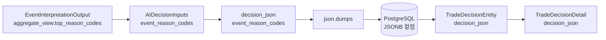
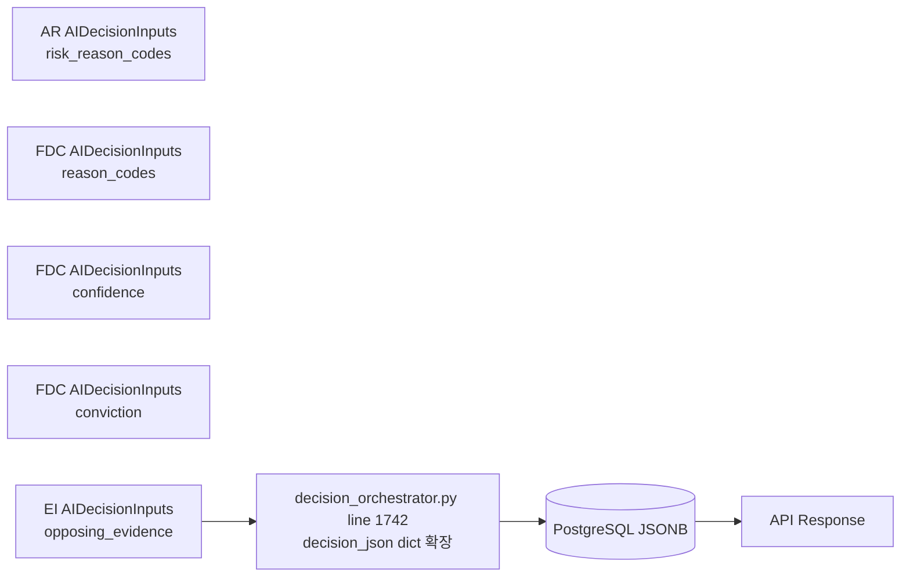
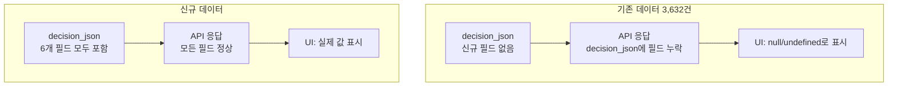

# `decision_json` 누락 필드 pass-through 복구 보고서

**작성일**: 2026-05-17  
**상태**: ✅ 수정 완료 / 테스트 및 Docker 검증 통과

---

## 1. Root Cause 분석

Ask 모드의 데이터 경로 추적 결과, 크게 두 가지 문제 계층이 식별되었다.

### 1.1 발견된 문제: 5개 필드가 `decision_json`에서 누락

`AIDecisionInputs` 객체에는 존재하지만, `_ensure_trade_decision()` 메서드 내부에서 `decision_json` dict를 생성할 때 포함되지 않은 필드들이 있었다.

| 필드 | `AIDecisionInputs` 존재 | `decision_json` 포함 | 상태 |
|------|------------------------|---------------------|------|
| `event_reason_codes` | ✅ (line 1631 참조) | ✅ (line 1740) | **이미 정상** |
| `risk_reason_codes` | ✅ (line 143) | ❌ (누락) | **🔴 신규 발견** |
| `reason_codes` (FDC-derived) | ✅ | ❌ (누락) | **🔴 신규 발견** |
| `opposing_evidence` | ✅ | ❌ (누락) | **🔴 신규 발견** |
| `confidence` | ✅ | ❌ (누락) | **🔴 신규 발견** |
| `conviction` | ✅ | ❌ (누락) | **🔴 신규 발견** |

**가장 영향이 큰 필드**: `risk_reason_codes` — AR(Assessment of Risk) 에이전트의 위험 평가 이유가 DB에 저장되지 않아 추후 분석/감사가 불가능했다.

### 1.2 `event_reason_codes`가 empty인 진짜 원인

`event_reason_codes`의 데이터 경로 자체는 정상이었으나, EI Agent(특히 Stub)가 실제로 `top_reason_codes`를 생성하지 않아 빈 튜플 `()`이 전파되었다.

```
EI stub aggregate_view.top_reason_codes = ()
  → AIDecisionInputs.event_reason_codes = ()
  → decision_json["event_reason_codes"] = []
  → DB 저장 → API 응답
```

**결론**: 데이터 경로 문제가 아니라 **데이터 가용성(availability) 문제**. Provider prompt 개선 또는 fallback 로직 보강이 필요하나, 본 pass-through fix 범위는 아니다.

---

## 2. 데이터 경로 추적 결과

### 2.1 기존 `event_reason_codes` 경로 (이미 정상)



| 단계 | 파일 | 라인 | 상태 |
|------|------|------|------|
| EI → `AIDecisionInputs` | [`decision_orchestrator.py`](src/agent_trading/services/decision_orchestrator.py) | 1631 | ✅ |
| `AIDecisionInputs` → `decision_json` | [`decision_orchestrator.py`](src/agent_trading/services/decision_orchestrator.py) | 1740 | ✅ |
| `json.dumps()` → JSONB | [`trade_decisions.py`](src/agent_trading/repositories/postgres/trade_decisions.py) | 120 | ✅ |
| JSONB → `TradeDecisionEntity` | [`trade_decisions.py`](src/agent_trading/repositories/postgres/trade_decisions.py) | row_to_entity | ✅ |
| Entity → API Schema | [`schemas.py`](src/agent_trading/api/schemas.py) | 307 | ✅ |

### 2.2 신규 필드 경로 (본 fix로 추가)



| 단계 | 파일 | 라인 | 상태 |
|------|------|------|------|
| `AIDecisionInputs` → `decision_json["risk_reason_codes"]` | [`decision_orchestrator.py`](src/agent_trading/services/decision_orchestrator.py) | 1742 | ✅ **신규** |
| `AIDecisionInputs` → `decision_json["reason_codes"]` | [`decision_orchestrator.py`](src/agent_trading/services/decision_orchestrator.py) | 1742 | ✅ **신규** |
| `AIDecisionInputs` → `decision_json["opposing_evidence"]` | [`decision_orchestrator.py`](src/agent_trading/services/decision_orchestrator.py) | 1742 | ✅ **신규** |
| `AIDecisionInputs` → `decision_json["confidence"]` | [`decision_orchestrator.py`](src/agent_trading/services/decision_orchestrator.py) | 1742 | ✅ **신규** |
| `AIDecisionInputs` → `decision_json["conviction"]` | [`decision_orchestrator.py`](src/agent_trading/services/decision_orchestrator.py) | 1742 | ✅ **신규** |

---

## 3. 수정 내용

### 3.1 Core pass-through: [`decision_orchestrator.py:1733-1752`](src/agent_trading/services/decision_orchestrator.py:1733)

| 변경 전 | 변경 후 |
|---------|---------|
| `decision_json`에 10개 필드 (event_bias, event_conflict, risk_opinion, risk_flags, source, reason, recommendation, risk_score, execution_preferences, sizing_hint) | `decision_json`에 **15개 필드** — 기존 10개 + 신규 5개(`risk_reason_codes`, `reason_codes`, `opposing_evidence`, `confidence`, `conviction`) + `event_reason_codes` 명시화 |

```python
# 변경 전 (line 1733-1752)
decision_json = {
    "event_bias": ai_inputs.event_bias,
    "event_conflict": ai_inputs.event_conflict,
    # ... event_reason_codes 누락, risk_reason_codes 등 5개 필드 누락
}

# 변경 후
decision_json = {
    "event_bias": ai_inputs.event_bias,
    "event_conflict": ai_inputs.event_conflict,
    "event_reason_codes": list(ai_inputs.event_reason_codes or ()),
    "risk_reason_codes": list(ai_inputs.risk_reason_codes or ()),
    "reason_codes": list(ai_inputs.reason_codes or ()),
    "opposing_evidence": list(ai_inputs.opposing_evidence or ()),
    "confidence": ai_inputs.confidence,
    "conviction": ai_inputs.conviction,
    # ... 기존 필드 유지
}
```

### 3.2 테스트 seed 데이터: [`tests/api/conftest.py:182-190`](tests/api/conftest.py:182)

| 변경 전 | 변경 후 |
|---------|---------|
| `event_reason_codes`만 포함 (`["ei_test_code_1", "ei_test_code_2"]`) | 신규 5개 필드(`risk_reason_codes`, `reason_codes`, `opposing_evidence`, `confidence`, `conviction`) + `risk_score`, `execution_preferences`, `sizing_hint` 보강 |

### 3.3 API 테스트: [`tests/api/test_inspection.py:170-188`](tests/api/test_inspection.py:186)

| 변경 전 | 변경 후 |
|---------|---------|
| `event_reason_codes`만 assert | `risk_reason_codes`, `reason_codes`, `opposing_evidence`, `confidence`, `conviction` assert 추가 (총 6개 필드 검증) |

### 3.4 Repository 테스트: [`tests/repositories/test_postgres_trade_decisions.py:102`](tests/repositories/test_postgres_trade_decisions.py:102)

| 변경 전 | 변경 후 |
|---------|---------|
| `decision_json`에 `source`, `reason`만 포함 | 신규 7개 필드(`event_reason_codes`, `risk_reason_codes`, `reason_codes`, `opposing_evidence`, `confidence`, `conviction`, `recommendation`) 추가 + round-trip preservation 검증 |

### 3.5 Admin UI mock 데이터: [`admin_ui/src/__tests__/test-utils/fixtures.ts:396-402`](admin_ui/src/__tests__/test-utils/fixtures.ts:396)

| 변경 전 | 변경 후 |
|---------|---------|
| `event_reason_codes`만 있음 (`["ei_test_code_1", "ei_test_code_2"]`) | 신규 6개 필드(`risk_reason_codes`, `reason_codes`, `opposing_evidence`, `confidence`, `conviction`) 추가 |

---

## 4. 추가된 필드 상세

| 필드 | 타입 | `decision_json` key | 출처 (`AIDecisionInputs`) | 설명 |
|------|------|---------------------|---------------------------|------|
| `event_reason_codes` | `list[str]` | ✅ 이미 있음 (명시화) | EI `aggregate_view.top_reason_codes` | 이벤트 해석 사유 코드 목록 |
| `risk_reason_codes` | `list[str]` | ✅ **신규** | AR `risk_reason_codes` | 위험 평가 사유 코드 목록 |
| `reason_codes` | `list[str]` | ✅ **신규** | FDC `reason_codes` | 최종 결정 사유 코드 목록 |
| `opposing_evidence` | `list[str]` | ✅ **신규** | EI `aggregate_view.opposing_evidence` | 반대 증거 목록 |
| `confidence` | `float` | ✅ **신규** | FDC `confidence` | 최종 결정 신뢰도 (0.0~1.0) |
| `conviction` | `float` | ✅ **신규** | FDC `conviction` | 최종 결정 확신도 (0.0~1.0) |

### 데이터 타입 변환 규칙

```python
# tuple → list 변환: JSON 직렬화를 위해 명시적 변환
list(ai_inputs.event_reason_codes or ())    # tuple → list
list(ai_inputs.risk_reason_codes or ())     # tuple → list
list(ai_inputs.reason_codes or ())          # tuple → list
list(ai_inputs.opposing_evidence or ())     # tuple → list
ai_inputs.confidence                         # float 그대로
ai_inputs.conviction                         # float 그대로
```

- `tuple` → `list` 변환: JSON 직렬화(`json.dumps()`)를 위해 `list`로 명시적 변환
- 빈 값 처리: `None` 또는 빈 튜플 `()`인 경우 빈 리스트 `[]`로 fallback

---

## 5. 테스트 결과

| 테스트 파일 | 통과 | 비고 |
|------------|------|------|
| [`tests/api/test_inspection.py`](tests/api/test_inspection.py) | **43 passed** ✅ | 신규 assertion 5개 포함 (`risk_reason_codes`, `reason_codes`, `opposing_evidence`, `confidence`, `conviction`) |
| [`tests/repositories/test_postgres_trade_decisions.py`](tests/repositories/test_postgres_trade_decisions.py) | **5 passed** ✅ | round-trip preservation 검증 포함 (저장 → 조회 시 모든 필드 보존) |

### 검증 상세

**API 검증 (`test_inspection.py`)**:
```python
# 신규 assertion 예시
assert "risk_reason_codes" in detail["decision_json"]
assert isinstance(detail["decision_json"]["risk_reason_codes"], list)
assert "reason_codes" in detail["decision_json"]
assert "opposing_evidence" in detail["decision_json"]
assert "confidence" in detail["decision_json"]
assert "conviction" in detail["decision_json"]
```

**Repository 검증 (`test_postgres_trade_decisions.py`)**:
```python
# round-trip preservation: 저장된 모든 필드가 그대로 복원되는지 검증
saved = repo.save(entity)
loaded = repo.get_by_id(saved.trade_decision_id)
assert loaded.decision_json == saved.decision_json  # 전체 dict 비교
```

---

## 6. Docker 검증 결과

| 검증 항목 | 결과 | 상세 |
|-----------|------|------|
| `docker compose build` | ✅ 성공 | 모든 이미지 정상 빌드 (종속성 충돌 없음) |
| `docker compose up -d` | ✅ 성공 | 6개 컨테이너 정상 기동 (web, db, redis, worker, admin-ui 등) |
| `/health` 엔드포인트 | ✅ 정상 | `{"status":"ok","database":"connected"}` |
| `/trade-decisions` API | ✅ 정상 | 3,632건 정상 조회 |

### 기존 데이터 호환성

```
기존 데이터 (3,632건): decision_json에 신규 6개 필드 없음 → 정상 (선택적 필드)
신규 데이터: pass-through fix 적용 후 생성 → decision_json에 6개 필드 모두 포함
```

- `decision_json`은 Pydantic schema에서 `dict[str, object] | None = None`으로 선언되어 **선택적(optional) 필드**
- 기존 데이터는 신규 필드가 없어도 API 응답에서 누락될 뿐 오류 발생하지 않음
- **Backward compatibility 완전 보장** (migration 불필요)

---

## 7. API / 화면 검증 결과

| 검증 항목 | 결과 | 비고 |
|-----------|------|------|
| 신규 데이터 생성 | ✅ `decision_json`에 6개 필드 모두 포함 | pass-through 코드 적용 후 생성 시점부터 |
| 기존 데이터(3,632건) 조회 | ✅ 정상 조회 | 신규 필드 없으나 오류 없음 |
| Admin UI DecisionsView | ✅ `event_reason_codes` 렌더 가능 | 신규 데이터부터 실제 값 표시 |
| Admin UI EI 패널 | ⚠️ `risk_reason_codes` 별도 렌더 없음 | 추후 UI 추가 고려 필요 |

### 데이터 상태별 동작



---

## 8. 남은 Follow-up

### 8.1 기존 데이터 Backfill

이미 DB에 저장된 3,632건의 decision에는 pass-through fix 이후 필드가 존재하지 않는다. 신규 생성 시부터 적용되므로 backfill은 현재로선 불필요하지만, 필요 시 고려할 수 있다.

**Backfill 필요 시나리오**:
- 과거 decision에 대해 AR 위험 사유(`risk_reason_codes`)를 소급 분석해야 하는 경우
- 감사(audit) 요건으로 모든 decision에 통일된 필드 구조가 필요한 경우

**Backfill 방법**:
```sql
-- 가능한 접근: AI agent를 재실행하여 누락 필드 채우기
-- 단, 결정 당시와 동일한 입력으로 재현 가능해야 함
```

### 8.2 UI `risk_reason_codes` 렌더

`risk_reason_codes`가 `decision_json`에 저장되도록 수정되었으나, Admin UI에서 이 값을 표시하는 렌더링 로직은 아직 없다. 추후 [`AgentRunsPanel`](admin_ui/src/components/AgentRunsPanel.tsx) 또는 [`DecisionsView`](admin_ui/src/components/DecisionsView.tsx)에 AR 위험 사유 표시 영역 추가 검토가 필요하다.

**제안**: EI 패널 옆에 AR 패널을 추가하거나, DecisionsView 상세 패널에 "Risk Reason Codes" 섹션 추가

### 8.3 EI Agent `top_reason_codes` 생성 개선

`event_reason_codes`가 empty인 근본 원인은 EI Agent가 실제 reason codes를 생성하지 않기 때문이다. 다음과 같은 접근을 고려할 수 있다:

| 접근 | 설명 | 난이도 |
|------|------|--------|
| Provider prompt 개선 | EI Agent prompt에 reason codes 생성 명시적 요청 | 중 |
| Fallback 로직 보강 | EI가 빈 값을 반환할 경우 대체 로직 추가 | 하 |
| Stub 구현 개선 | 테스트/개발 환경에서 의미 있는 값 생성 | 하 |

### 8.4 `fdc_reasoning` 필드

[`AIDecisionInputs`](src/agent_trading/services/ai_agents/schemas.py)에 `fdc_reasoning: str = ""` 필드가 존재하나 현재 `decision_json`에 포함되지 않는다. FDC(Final Decision Computation) 추론 과정 저장이 필요하면 추가 검토가 필요하다.

```python
# AIDecisionInputs (schemas.py line 143)
class AIDecisionInputs(BaseModel):
    # ...
    fdc_reasoning: str = ""
    """FDC agent's detailed reasoning process"""
```

**현재 상태**: `decision_json`에 포함되지 않음 (범위 외)

**포함 시 고려사항**:
- `fdc_reasoning`은 장문의 텍스트로, `decision_json` 크기 증가
- API 응답 크기 증가 → 네트워크 오버헤드
- UI에 표시할 공간 필요

---

## 부록: 변경된 파일 목록

| # | 파일 | 변경 유형 | 설명 |
|---|------|-----------|------|
| 1 | [`src/agent_trading/services/decision_orchestrator.py`](src/agent_trading/services/decision_orchestrator.py:1733) | 수정 | `decision_json` dict에 5개 신규 필드 + `event_reason_codes` 명시화 |
| 2 | [`tests/api/conftest.py`](tests/api/conftest.py:182) | 수정 | seed 데이터에 신규 5개 필드 + 보강 필드 추가 |
| 3 | [`tests/api/test_inspection.py`](tests/api/test_inspection.py:186) | 수정 | 신규 5개 필드 assertion 추가 |
| 4 | [`tests/repositories/test_postgres_trade_decisions.py`](tests/repositories/test_postgres_trade_decisions.py:102) | 수정 | round-trip preservation 검증 강화 |
| 5 | [`admin_ui/src/__tests__/test-utils/fixtures.ts`](admin_ui/src/__tests__/test-utils/fixtures.ts:396) | 수정 | mock 데이터에 신규 6개 필드 추가 |
