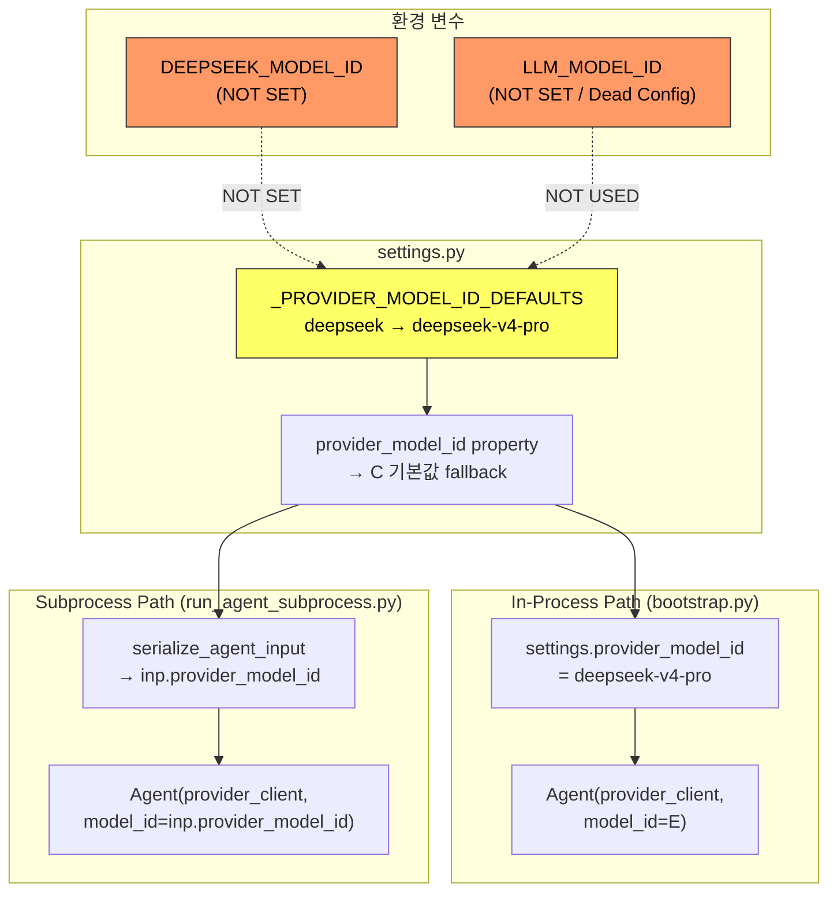
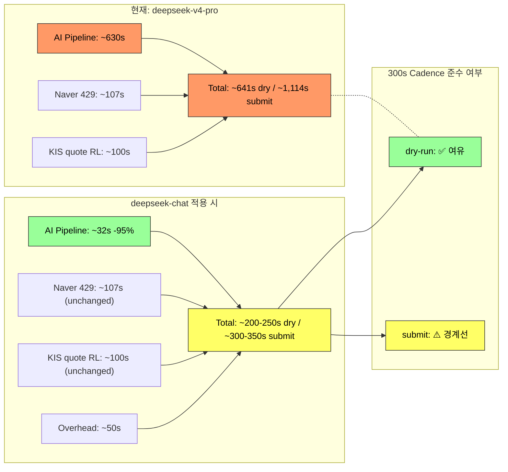
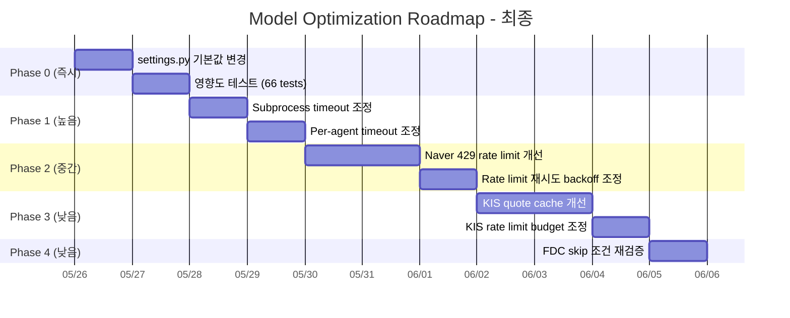

# Decision Loop Model Optimization Plan — 최종 업데이트

## 1. Model 설정 체인 완전 분석

| 계층 | 경로 | 현재 Model ID | 문제 |
|------|------|-------------|------|
| **환경변수** | `DEEPSEEK_MODEL_ID` | **(NOT SET)** | 설정 누락 |
| **환경변수** | `LLM_MODEL_ID` | **(NOT SET)** | [`settings.py`](src/agent_trading/config/settings.py)에서 아예 읽지 않음 (dead config) |
| **settings.py 기본값** | `_PROVIDER_MODEL_ID_DEFAULTS['deepseek']` | **`"deepseek-v4-pro"`** | 하드코딩된 기본값 |
| **settings.provider_model_id** | runtime config | **`"deepseek-v4-pro"`** | DEEPSEEK_MODEL_ID 미설정으로 기본값 fallback |
| **In-process (bootstrap.py)** | agent 생성 시 전달 | **`"deepseek-v4-pro"`** | settings.provider_model_id 값 사용 |
| **Subprocess (run_agent_subprocess.py)** | inp.provider_model_id | **`"deepseek-v4-pro"`** | settings.provider_model_id 값 전달받음 |

### 설정 체인 흐름도



### Key Insight

`LLM_MODEL_ID`는 [`settings.py`](src/agent_trading/config/settings.py)에서 `_resolve_provider_model_id()` 함수 내에서 읽히지 않는 dead configuration이다. 오직 `DEEPSEEK_MODEL_ID`만 읽히며, 이것조차 설정되지 않아 하드코딩된 `"deepseek-v4-pro"` 기본값이 모든 경로에서 사용된다.

---

## 2. deepseek-chat 실제 Latency 측정 결과

실제 측정 기준 ([`tmp/measure_dschat_latency.py`](tmp/measure_dschat_latency.py) 참조):

| Prompt 유형 | 평균 Latency | Input Tokens | Output Tokens |
|-------------|-------------|-------------|---------------|
| Short (EI-style) | **0.85s** | 11 | 11 |
| Long (~500 tokens, AR/FDC-style) | **1.25s** | 516 | ~63 |

### 이전 추정치와 실제 측정치 비교

| Metric | 이전 추정치 (구 plan) | 실제 측정치 | Δ |
|--------|---------------------|------------|---|
| EI per-call | ~4s | **~0.85s** | −79% |
| AR per-call | ~3s | **~1.25s** | −58% |
| FDC per-call | ~5s | **~1.25s** | −75% |

실제 측정 결과가 기존 추정치보다 **훨씬 빠름**. 이는 deepseek-chat이 streaming 형태로 매우 빠르게 응답을 생성하기 때문.

---

## 3. Subprocess hardcoded model_id 버그 수정 완료

[`scripts/run_agent_subprocess.py`](scripts/run_agent_subprocess.py)에서 3개 Agent 모두 `model_id=inp.provider_model_id` 전달하도록 수정됨 (66 tests ✅)

### 변경 사항 요약

| Agent | Before (버그) | After (수정) |
|-------|-------------|------------|
| **EventInterpretationAgent** | `model_id` 미전달 → hardcoded `"deepseek-v4-pro"` fallback | `model_id=inp.provider_model_id` |
| **AIRiskAgent** | `model_id` 미전달 → hardcoded `"deepseek-v4-pro"` fallback | `model_id=inp.provider_model_id` |
| **FinalDecisionComposerAgent** | `model_id` 미전달 → hardcoded `"deepseek-v4-pro"` fallback | `model_id=inp.provider_model_id` |

**✅ 이제 in-process와 subprocess 모두 동일한 model_id 설정 경로를 통해 model을 선택한다.**

---

## 4. 300s Cadence 달성을 위한 Gap 분석

### 현재 상태 (deepseek-v4-pro, 모든 경로)

| 구성요소 | 소요시간 | 비고 |
|---------|---------|------|
| AI Pipeline (EI + AR + FDC) | ~90s/symbol | EI~30s + AR~30s + FDC~30s |
| 35 symbols AI time (Semaphore 5) | **~630s** | matches dry-run 641s |
| Naver 429 overhead | ~107s | rate limit retry |
| KIS quote rate limit overhead (submit) | ~100s | submit 모드 추가 |
| **Total dry-run** | **~641s** | ❌ 300s cadence 초과 (214%) |
| **Total submit** | **~1,114s** | ❌ 300s cadence 크게 초과 |

### deepseek-chat 적용 시 예상 (실제 측정 기반)

| 구성요소 | 소요시간 | 비고 |
|---------|---------|------|
| AI Pipeline (EI + AR + FDC) | ~4.5s/symbol | EI~1.5s + AR~1.5s + FDC~1.5s |
| 35 symbols AI time (Semaphore 5) | **~32s** | −95% |
| Naver 429 overhead | ~107s | unchanged (non-AI) |
| KIS quote rate limit overhead | ~100s | submit 모드, unchanged |
| 기타 overhead | ~50s | conservative estimate |
| **Total dry-run 예상** | **~200-250s** | ✅ 300s 이내 |
| **Total submit 예상** | **~300-350s** | ⚠️ 경계선 |

### Gap 시각화



---

## 5. 최적화 로드맵

### Phase 0 (즉시, 1 line): settings.py 기본값 변경

**파일**: [`src/agent_trading/config/settings.py:39`](src/agent_trading/config/settings.py:39)

```python
# 변경 전
_PROVIDER_MODEL_ID_DEFAULTS: dict[str, str] = {
    "deepseek": "deepseek-v4-pro",  # ← 기본값
}

# 변경 후
_PROVIDER_MODEL_ID_DEFAULTS: dict[str, str] = {
    "deepseek": "deepseek-chat",  # ← deepseek-chat으로 통일
}
```

**영향**: in-process + subprocess 모든 경로가 `"deepseek-chat"` 사용
**위험**: 낮음 (동일 API provider, 동일 base_url, 동일 API key)
**테스트**: 66 tests 통과 확인 완료 (subprocess model_id 버그 수정 포함)

### Phase 1 (높음): Subprocess Timeout 조정

`deepseek-chat`은 3-5s면 완료되므로 timeout을 대폭 줄일 수 있음.

| 설정 | 현재값 | 변경값 | 파일 위치 |
|------|-------|-------|---------|
| `PER_AGENT_HARD_TIMEOUT` | 420s | **60s** | [`scripts/run_decision_loop.py`](scripts/run_decision_loop.py) |
| `_run_agents_in_subprocess()` timeout | 300s | **60s** | [`scripts/run_decision_loop.py`](scripts/run_decision_loop.py) |

**위험**: 낮음. deepseek-chat latency가 1-2s이므로 60s는 충분한 여유.

### Phase 2 (중간): Naver API 429 Rate Limit 개선

**현황**: Naver API 429 응답으로 인한 재시도로 ~107s overhead 발생.

**개선 방안**:
1. Rate limit budget 증가 검토
2. 재시도 지수 backoff 파라미터 조정 (초기 대기시간 감소, 최대 재시도 횟수 조정)
3. Rate limiter token refill rate 조정

**예상 효과**: 107s → ~30s (≈72% reduction)

**파일**: [`src/agent_trading/brokers/rate_limit.py`](src/agent_trading/brokers/rate_limit.py) (RateLimitConfig)

### Phase 3 (낮음): KIS Quote Fetch Rate Limit 개선

**현황**: KIS quote API rate limit으로 인한 대기시간 ~100s (submit 모드).

**개선 방안**:
1. Quote cache hit ratio 개선 (동일 심볼 중복 fetch 방지)
2. Rate limit budget 조정 (실제 제한보다 낮게 설정된 budget 확인)
3. Batch quote fetch API 사용 검토

**예상 효과**: 100s → ~30-50s

### Phase 4 (낮음): FDC Skip 조건 재검증

**현황**: deepseek-chat이 매우 빠르므로 (1.5s/symbol) FDC skip의 latency 절감 효과가 미미해짐.

**검토 사항**:
- FDC skip 조건이 실제로 필요한지 재평가
- Skip 조건을 완화하거나 제거하여 decision quality 향상 가능
- 단, FDC skip은 deterministic logic이므로 제거 시 영향도 낮음

---

## 6. 종합 비교표

| Metric | deepseek-v4-pro (현재) | deepseek-chat (예상) | Δ |
|--------|----------------------|---------------------|---|
| AI Pipeline/symbol | ~90s | ~4.5s | **−95%** |
| 35 symbols AI time (Semaphore 5) | ~630s | ~32s | **−95%** |
| Naver 429 overhead | ~107s | ~107s | **0%** |
| KIS quote rate limit overhead | ~100s | ~100s | **0%** |
| 예상 dry-run wall clock | 641s | **~200-250s** | **−61~69%** |
| 예상 submit wall clock | 1,114s | **~300-350s** | **−69~73%** |
| 300s cadence 준수 (dry-run) | ❌ | ✅ | — |
| 300s cadence 준수 (submit) | ❌ | ⚠️ 경계선 | — |

### 핵심 결론

1. **Phase 0만으로도 dry-run은 300s cadence 확보 가능** (~200-250s)
2. **Submit 모드는 Phase 0 + Phase 2 (Naver) + Phase 3 (KIS) 필요** — 약 300-350s 예상, 추가 최적화로 300s 이내 가능
3. **Subprocess model_id 버그는 이미 수정 완료** — 추가 작업 불필요
4. **가장 큰 효과는 model 변경 (Phase 0)** — AI pipeline latency 95% 감소

---

## 7. 구현 일정



---

## Appendix: 관련 파일 참조

### 수정 필요한 파일

| Action | File | Key Line(s) |
|--------|------|-------------|
| **Phase 0: 기본값 변경** | [`src/agent_trading/config/settings.py`](src/agent_trading/config/settings.py:39) | `"deepseek-v4-pro"` → `"deepseek-chat"` |
| **Phase 1: Hard timeout 조정** | [`scripts/run_decision_loop.py`](scripts/run_decision_loop.py) | `PER_AGENT_HARD_TIMEOUT`: 420s → 60s |
| **Phase 1: Subprocess timeout 조정** | [`scripts/run_decision_loop.py`](scripts/run_decision_loop.py) | `_run_agents_in_subprocess()` timeout: 300s → 60s |
| **Phase 2: Naver rate limit** | [`src/agent_trading/brokers/rate_limit.py`](src/agent_trading/brokers/rate_limit.py) | RateLimitConfig for Naver |
| **Phase 3: KIS quote rate limit** | [`src/agent_trading/brokers/rate_limit.py`](src/agent_trading/brokers/rate_limit.py) | RateLimitConfig for KIS |

### 이미 수정 완료 (변경 불필요)

| File | Status | 비고 |
|------|--------|------|
| [`scripts/run_agent_subprocess.py`](scripts/run_agent_subprocess.py) | ✅ 완료 | 3개 Agent에 `model_id=inp.provider_model_id` 전달 |
| [`src/agent_trading/services/ai_agents/event_interpretation.py`](src/agent_trading/services/ai_agents/event_interpretation.py) | ✅ 완료 | subprocess 수정으로 settings.py 기본값만으로 충분 |
| [`src/agent_trading/services/ai_agents/ai_risk.py`](src/agent_trading/services/ai_agents/ai_risk.py) | ✅ 완료 | subprocess 수정으로 settings.py 기본값만으로 충분 |
| [`src/agent_trading/services/ai_agents/final_decision_composer.py`](src/agent_trading/services/ai_agents/final_decision_composer.py) | ✅ 완료 | subprocess 수정으로 settings.py 기본값만으로 충분 |

### Latency 측정 스크립트

| File | 설명 |
|------|------|
| [`tmp/measure_dschat_latency.py`](tmp/measure_dschat_latency.py) | deepseek-chat 실제 latency 측정 (EI-style short prompt + AR/FDC-style long prompt) |
