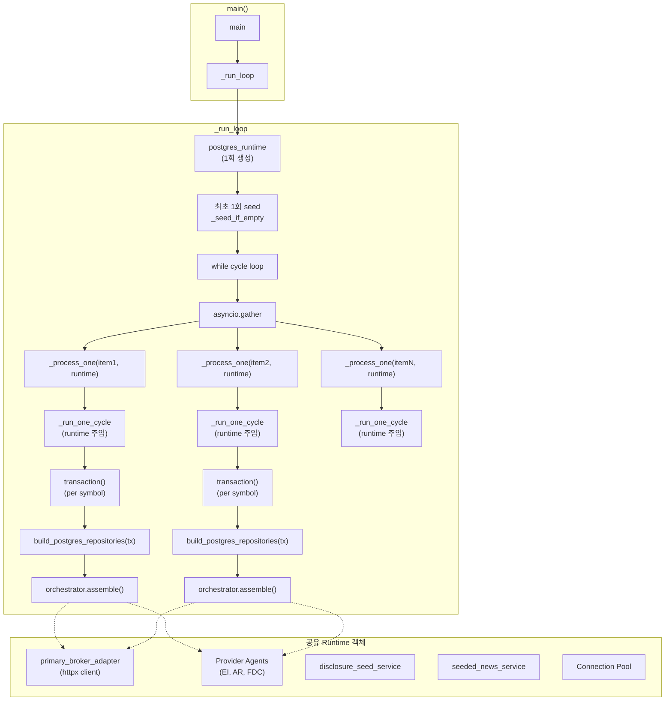

# Decision Loop Runtime 공유 설계

## 1. 문제 정의

[`run_decision_loop.py`](scripts/run_decision_loop.py)의 [`_run_one_cycle()`](scripts/run_decision_loop.py:684)이 **매 symbol마다** [`postgres_runtime()`](src/agent_trading/runtime/bootstrap.py:617)을 새로 생성하여 300초+ timeout 발생.

### 실측 데이터 (near_real_scheduler_2026-05-15.log)
- 30 symbols, per-symbol 평균 6.8s (DeepSeek API 4-6s 포함)
- Wall clock: **204s** (순차 실행, Semaphore(5) 무의미)
- 오후 run: 280-330s까지 증가
- Scheduler 300s 간격과 충돌 → 연속 timeout

### 근본 원인
```python
# 현재 구조: 각 symbol마다 완전히 새로운 Runtime 생성
async def _run_one_cycle(cycle, ...):
    async with postgres_runtime(run_migrations=False) as runtime:
        # 새 httpx client (KIS, Provider Agents)
        # 새 DB transaction (pool connection 획득)
        # Pool min_size=2로 인해 최대 2개만 동시 진행 가능
        result = await _process_one(runtime, ...)
```

## 2. 현재 구조 분석

### 2.1 호출 관계

```
main()
  └─ _run_loop()
       ├─ _read_trading_universe()    ← 여기서도 postgres_runtime() 생성
       └─ while loop (per cycle)
            └─ asyncio.gather(*[_process_one(item) for item in universe])
                 └─ _process_one(item)          ← Semaphore(5) 적용
                      └─ _run_one_cycle(cycle, symbol, ...)   ← ★여기서 Runtime 생성
                           └─ async with postgres_runtime() as runtime:
                                ├─ _seed_if_empty(runtime["repositories"])
                                ├─ _run_precheck(runtime["repositories"])
                                ├─ broker.get_quote(symbol, market)
                                ├─ orchestrator.assemble() or orchestrator.assemble_and_submit()
                                └─ T3 live pipeline (create_task)
```

### 2.2 `_run_one_cycle()` (line 684-930) 내부에서 Runtime 사용 패턴

`postgres_runtime()`이 반환하는 `runtime` dict에서 사용하는 객체들:

| Key | 사용 위치 | 공유 가능? |
|-----|-----------|-----------|
| `repositories` | `_seed_if_empty`, `_run_precheck`, T3 pipeline | **Yes** (stateless SQL) |
| `orchestrator` | `orchestrator.assemble()`, `orchestrator.assemble_and_submit()` | **Yes** (stateless) |
| `order_manager` | `assemble_and_submit()`의 인자 | **Yes** (stateless) |
| `primary_broker_adapter` | `_resolve_symbol_price()`, `assemble_and_submit()`의 인자 | **Yes** (httpx client, Semaphore로 동시성 제한) |
| `disclosure_seed_service` | T3 live pipeline | **Yes** (stateless) |
| `seeded_news_service` | T3 live pipeline | **Yes** (stateless) |

### 2.3 [`postgres_runtime()`](src/agent_trading/runtime/bootstrap.py:646) 내부 구조

```python
@asynccontextmanager
async def postgres_runtime(db_config=None, *, run_migrations=True, auto_rollback=False):
    config = db_config or DatabaseConfig()
    await create_pool(config)          # ★ Connection pool 생성 (비용 높음)
    
    if run_migrations:
        await run_all_migrations(config)
    
    settings = AppSettings()
    broker_adapter = _build_kis_adapter(settings)     # ★ httpx client 생성
    
    async with transaction(force_rollback=auto_rollback) as tx:  # ★ DB transaction
        repositories = build_postgres_repositories(tx)  # tx에 바인딩된 repos
        polling_workers = _build_polling_workers(...)
        event_interpretation_agent = _build_provider_agent(settings)  # ★ httpx client
        ai_risk_agent = _build_ai_risk_agent(settings)                # ★ httpx client
        final_decision_agent = _build_final_decision_agent(settings)  # ★ httpx client
        orchestrator = _build_orchestrator(repositories, settings, ...)
        order_manager = _build_order_manager(repositories)
        disclosure_seed_service, seeded_news_service = ...            # ★ httpx client
        
        yield {각종 객체}
    
    await shutdown_postgres_runtime(runtime)  # 모든 httpx client 정리 + pool close
```

### 2.4 성능 병목 분석 (30 symbols 기준)

| 단계 | 비용 | 비고 |
|------|------|------|
| `create_pool()` + transaction | ~0.5s | pool connection 대기 (min_size=2) |
| `_build_kis_adapter()` (httpx client) | ~0.3s | TCP connection |
| Provider Agent 3개 생성 (httpx clients) | ~1.0s | 각각 httpx client 생성 |
| `_seed_if_empty()` (read-only check) | ~0.05s | 단순 SELECT |
| `_run_precheck()` | ~0.1s | DB query |
| `broker.get_quote()` | ~0.5s | KIS API 호출 |
| **`orchestrator.assemble()`** | **~4-6s** | **DeepSeek API (주 병목)** |
| T3 pipeline | ~0-30s | 백그라운드, timeout 처리 |
| **Runtime 생성 비용 총계** | **~2s** | **30 symbols × 2s = 60s 낭비** |
| **DeepSeek API 총계** | **~5s** | **실제 필요한 시간** |

**순차 실행인 이유**: `postgres_runtime()` 내부 `transaction()`이 pool connection을 획득하는데, `min_size=2`로 인해 최대 2개 connection만 가능. 따라서 `Semaphore(5)`를 설정해도 pool 대기에서 병목 발생.

## 3. 변경 설계 (방안 A)

### 3.1 핵심 변경: Runtime을 루프 외부로 이동

```python
# 변경 후 구조
async def _run_loop(*, interval, max_cycles, ...):
    # Runtime은 루프 진입 시 한 번만 생성
    async with postgres_runtime(run_migrations=False) as runtime:
        while not _shutdown_event.is_set():
            ...
            coros = [_process_one(item, runtime) for item in universe]
            # ★ Runtime이 공유되므로 Semaphore(5)가 실제 병렬성 제공
            cycle_results = await asyncio.gather(*coros)
```

### 3.2 Symbol별 Transaction 격리: `postgres_runtime` 분리

`postgres_runtime()`이 **하나의 transaction** 안에서 모든 객체를 생성하므로, repositories를 분리해야 함.

**변경 전**: `postgres_runtime()` = pool + transaction + agents
**변경 후**: 
- Pool + Agents (httpx clients): 루프 외부에서 **한 번만** 생성
- Transaction + Repositories: 각 symbol별로 **새로** 생성

이를 위해 `postgres_runtime()`을 두 단계로 분리:

```python
# bootstrap.py에 추가
@asynccontextmanager
async def postgres_runtime_shared(*, run_migrations=True):
    """Runtime without transaction - creates pool and agents only, shared across symbols."""
    config = DatabaseConfig()
    await create_pool(config)
    
    if run_migrations:
        await run_all_migrations(config)
    
    settings = AppSettings()
    broker_adapter = _build_kis_adapter(settings)
    polling_workers = _build_polling_workers(...)
    event_interpretation_agent = _build_provider_agent(settings)
    ai_risk_agent = _build_ai_risk_agent(settings)
    final_decision_agent = _build_final_decision_agent(settings)
    disclosure_seed_service = ...
    seeded_news_service = ...
    
    runtime_no_tx = {
        "settings": settings,
        "primary_broker_adapter": broker_adapter,
        "db_config": config,
        "polling_workers": polling_workers,
        "event_interpretation_agent": event_interpretation_agent,
        "ai_risk_agent": ai_risk_agent,
        "final_decision_agent": final_decision_agent,
        "disclosure_seed_service": disclosure_seed_service,
        "disclosure_client": disclosure_client,
        "seeded_news_service": seeded_news_service,
    }
    yield runtime_no_tx
    
    await shutdown_postgres_runtime(runtime_no_tx)
```

### 3.3 `_run_one_cycle` 변경

**변경 전** (line 684-930):
```python
async def _run_one_cycle(cycle, *, submit, dry_run, output, symbol, market, source_type):
    async with postgres_runtime(run_migrations=False) as runtime:
        repos = runtime["repositories"]
        orchestrator = runtime["orchestrator"]
        # ... 전체 로직
```

**변경 후**:
```python
async def _run_one_cycle(cycle, *, submit, dry_run, output, symbol, market, source_type,
                          runtime):  # ★ runtime을 외부에서 주입
    """Execute a single decision cycle with shared runtime."""
    start = time.monotonic()
    
    # ★ Per-symbol transaction 생성 (격리 보장)
    async with transaction() as tx:
        repos = build_postgres_repositories(tx)
        orchestrator = DecisionOrchestratorService(repos=repos)
        order_manager = _build_order_manager(repos)
        
        # Runtime에서 공유 객체 참조
        broker = runtime["primary_broker_adapter"]
        
        # ... 나머지 로직 동일
```

### 3.4 `_process_one` 변경

**변경 전** (line 1163):
```python
async def _process_one(item: object) -> dict[str, object]:
    async with sem:
        ...
        result = await _run_one_cycle(cycle=cycle_count, ...)
```

**변경 후**:
```python
async def _process_one(item: object, runtime: dict[str, object]) -> dict[str, object]:
    # ★ runtime을 추가 인자로 받음
    async with sem:
        ...
        result = await _run_one_cycle(cycle=cycle_count, ..., runtime=runtime)
```

### 3.5 `_run_loop` 변경

**변경 전** (line 1104):
```python
async def _run_loop(*, interval, max_cycles, submit, dry_run, output):
    while not _shutdown_event.is_set():
        ...
        coros = [_process_one(item) for item in universe]
        cycle_results = await asyncio.gather(*coros)
```

**변경 후**:
```python
async def _run_loop(*, interval, max_cycles, submit, dry_run, output):
    # ★ Runtime을 루프 시작 시 한 번만 생성
    async with postgres_runtime(run_migrations=False) as runtime:
        while not _shutdown_event.is_set():
            ...
            coros = [_process_one(item, runtime) for item in universe]
            cycle_results = await asyncio.gather(*coros)
```

## 4. 변경 상세 명세

### 4.1 수정할 파일 목록

| 파일 | 변경 사항 |
|------|---------|
| [`scripts/run_decision_loop.py`](scripts/run_decision_loop.py) | `_run_one_cycle()` 시그니처 변경, `_process_one()`에 runtime 전달, `_run_loop()`에서 runtime 생성 |
| [`tests/scripts/test_run_decision_loop.py`](tests/scripts/test_run_decision_loop.py) | `_run_one_cycle()` 테스트에 runtime 인자 추가, mock runtime 변경 |
| [`src/agent_trading/runtime/bootstrap.py`](src/agent_trading/runtime/bootstrap.py) | (선택) `postgres_runtime_shared()` 추가 또는 `postgres_runtime()` 리팩토링 |

### 4.2 세부 변경 사항

#### 4.2.1 `scripts/run_decision_loop.py` 변경

**A. `_run_one_cycle()` 시그니처 변경** (line 684)

```python
# 변경 전
async def _run_one_cycle(
    cycle: int,
    *,
    submit: bool,
    dry_run: bool,
    output: str,
    symbol: str = SYMBOL,
    market: str = MARKET,
    source_type: str = "core",
) -> dict[str, object]:

# 변경 후
async def _run_one_cycle(
    cycle: int,
    *,
    submit: bool,
    dry_run: bool,
    output: str,
    symbol: str = SYMBOL,
    market: str = MARKET,
    source_type: str = "core",
    runtime: dict[str, object],          # ★ 추가: 공유 runtime
) -> dict[str, object]:
```

**B. `_run_one_cycle()` 본문 변경** (line 708-893)

```python
# 변경 전 (line 708-710)
try:
    async with postgres_runtime(run_migrations=False) as runtime:
        repos: RepositoryContainer = runtime["repositories"]
        orchestrator = runtime["orchestrator"]

# 변경 후
try:
    # ★ Per-symbol transaction + repos 생성
    async with transaction() as tx:
        from agent_trading.repositories.postgres.bootstrap import build_postgres_repositories
        from agent_trading.services.decision_orchestrator import DecisionOrchestratorService
        from agent_trading.services.order_manager import OrderManager
        
        repos = build_postgres_repositories(tx)
        orchestrator = DecisionOrchestratorService(repos=repos)
        order_manager = OrderManager(
            repos=repos,
            reconciliation_service=...,
        )
        broker = runtime["primary_broker_adapter"]
```

> **참고**: `build_postgres_repositories()`가 `TransactionManager`를 받으므로 symbol별로 새로운 transaction이 생성됨.

**C. `_process_one()` 변경** (line 1163)

```python
# 변경 전
async def _process_one(item: object) -> dict[str, object]:

# 변경 후
async def _process_one(item: object, runtime: dict[str, object]) -> dict[str, object]:
```

그리고 호출 부분 (line 1206):

```python
# 변경 전
result = await _run_one_cycle(
    cycle=cycle_count,
    submit=symbol_submit,
    dry_run=symbol_dry_run,
    output=output,
    symbol=item.symbol,
    market=item.market,
    source_type=item.source_type,
)

# 변경 후
result = await _run_one_cycle(
    cycle=cycle_count,
    submit=symbol_submit,
    dry_run=symbol_dry_run,
    output=output,
    symbol=item.symbol,
    market=item.market,
    source_type=item.source_type,
    runtime=runtime,          # ★ 추가
)
```

**D. `_run_loop()` 변경** (line 1104)

```python
# 변경 전
async def _run_loop(*, interval, max_cycles, submit, dry_run, output):
    ...
    while not _shutdown_event.is_set():
        ...
        coros = [_process_one(item) for item in universe]
        cycle_results = await asyncio.gather(*coros)

# 변경 후
async def _run_loop(*, interval, max_cycles, submit, dry_run, output):
    # ★ Runtime을 루프 시작 시 한 번만 생성
    async with postgres_runtime(run_migrations=False) as runtime:
        ...
        while not _shutdown_event.is_set():
            ...
            coros = [_process_one(item, runtime) for item in universe]
            cycle_results = await asyncio.gather(*coros)
```

#### 4.2.2 `tests/scripts/test_run_decision_loop.py` 변경

`TestRunOneCycle` 클래스의 각 테스트 메서드에서 `_run_one_cycle()` 호출 시 `runtime` 인자 추가:

```python
class TestRunOneCycle:
    @patch("scripts.run_decision_loop.postgres_runtime", ...)
    async def test_dry_run(self):
        async with _mock_runtime() as runtime:
            result = await _run_one_cycle(
                cycle=1,
                submit=False,
                dry_run=True,
                output="text",
                runtime=runtime,      # ★ 추가
            )
```

## 5. 위험성 분석 및 대응

### 5.1 Provider Agent thread-safety

| 위험 | 분석 | 대응 |
|------|------|------|
| httpx.AsyncClient 공유 | httpx.AsyncClient는 **기본적으로 thread-safe하지 않음** | Semaphore(5)로 동시 실행 수 제한 → 동일 event loop 내 asyncio이므로 문제 없음 |
| Provider Agent 내부 상태 | EI/AR/FDC agent는 stateless (LLM API 호출만 수행) | 공유 안전 |
| KIS REST Client | 내부 httpx.AsyncClient 사용, stateless API 호출 | 공유 안전 |

### 5.2 Transaction 격리

| 위험 | 분석 | 대응 |
|------|------|------|
| Symbol 간 transaction 공유 | `postgres_runtime()`이 하나의 transaction 내에서 repositories 생성 | **Per-symbol `transaction()` + `build_postgres_repositories(tx)`** 로 격리 |
| 롤백 영향 | 한 symbol 실패 시 다른 symbol까지 롤백 | Per-symbol transaction이므로 독립적 롤백 |
| `_seed_if_empty()` | FK 체인 시딩 (client, account, strategy) | `_run_loop()` 진입 시 **최초 1회만** 실행하도록 변경 |
| `_run_precheck()` | Snapshot sync health check | 모든 symbol이 동일한 결과 공유 가능 → **최초 1회만** 실행 |

### 5.3 Repository state

| 위험 | 분석 | 대응 |
|------|------|------|
| Postgres repository state | SQL 기반 stateless, 모든 repository 메서드가 DB query 실행 | Per-symbol transaction으로 인해 다른 transaction의 미커밋 데이터 미반영 |
| In-memory repository | 테스트에서만 사용 | 테스트 mock에서도 per-transaction 격리 모킹 |

### 5.4 `_seed_if_empty` 중복 실행 문제

**현재**: 각 symbol의 `_run_one_cycle()`에서 `_seed_if_empty(repos)` 실행
- Symbol 0: 시딩 실행 (True)
- Symbol 1-29: 시딩 스킵 (False, 이미 존재)

**변경 후**: `_run_loop()` 진입 시 **최초 1회** 시딩
```python
async def _run_loop(*, interval, max_cycles, ...):
    async with postgres_runtime(run_migrations=False) as runtime:
        # 최초 1회 시딩
        async with transaction() as tx:
            repos = build_postgres_repositories(tx)
            await _seed_if_empty(repos)
            await tx.commit()
        
        while not _shutdown_event.is_set():
            ...  # 각 symbol은 per-symbol transaction 사용
```

### 5.5 `_run_precheck` 중복 실행 문제

모든 symbol이 동일한 precheck 결과를 사용하므로, cycle당 1회만 실행:

```python
async def _run_loop(*, interval, max_cycles, ...):
    async with postgres_runtime(run_migrations=False) as runtime:
        while not _shutdown_event.is_set():
            # Cycle당 1회 precheck
            async with transaction() as tx:
                repos = build_postgres_repositories(tx)
                precheck = await _run_precheck(repos)
            
            coros = [_process_one(item, runtime, precheck) for item in universe]
            ...
```

## 6. 예상 성능 개선

### 6.1 Latency 분석

| 구성 요소 | 현재 (순차 30 symbols) | 변경 후 (병렬 30 symbols, Semaphore 5) |
|-----------|----------------------|----------------------------------------|
| Runtime 생성 (pool + agents) | 30 × 2s = **60s** | **1 × 2s = 2s** |
| DeepSeek API | 30 × 5s = **150s** | (30/5) × 5s = **30s** |
| KIS get_quote | 30 × 0.5s = **15s** | (30/5) × 0.5s = **3s** |
| 기타 overhead | 30 × 0.3s = **9s** | (30/5) × 0.3s = **2s** |
| **Total Wall Clock** | **~234s** | **~37-42s** |

### 6.2 병렬 처리 상세

```
현재: Runtime 생성 ----------------------- Runtime 생성 -----------------------
      Symbol 1 [===Runtime===|==DeepSeek==]                                 
      Symbol 2                [===Runtime===|==DeepSeek==]                   
      Symbol 3                               [===Runtime===|==DeepSeek==]     
      (순차, Semaphore 무의미)

변경 후:                                    
      Runtime 생성                          
      Symbol 1 [==DeepSeek==]          Symbol 6 [==DeepSeek==]              
      Symbol 2 [==DeepSeek==]          Symbol 7 [==DeepSeek==]              
      Symbol 3 [==DeepSeek==]          Symbol 8 [==DeepSeek==]              
      Symbol 4 [==DeepSeek==]          Symbol 9 [==DeepSeek==]              
      Symbol 5 [==DeepSeek==]          Symbol 10[==DeepSeek==]              
      (Semaphore 5로 5개씩 병렬)
```

### 6.3 확장성

| 환경 | Symbol 수 | 현재 | 변경 후 | Scheduler 300s 내? |
|------|-----------|------|---------|-------------------|
| 기본 | 30 | 204-234s | **37-42s** | ✅ |
| 확장 | 50 | 340-390s | **52-60s** | ✅ |
| 최대 | 100 | 680-780s | **90-102s** | ✅ |
| 스파이크 | 30 + DeepSeek 지연 10s | 300s+ | **62s** | ✅ |

## 7. 변경 후 코드 다이어그램



## 8. 구현 단계

### Step 1: `bootstrap.py`에 `postgres_runtime_shared()` 추가 (또는 기존 함수 분리)

Pool 생성 + Agents 생성 + Transaction 분리. 기존 `postgres_runtime()` 호환성 유지.

### Step 2: `run_decision_loop.py` 수정

1. `_run_one_cycle()` 시그니처에 `runtime` 파라미터 추가
2. `_run_one_cycle()` 본문에서 `postgres_runtime()` 대신 `transaction()` + `build_postgres_repositories()` 사용
3. `_process_one()`에 `runtime` 전달
4. `_run_loop()`에서 `postgres_runtime()`을 루프 외부로 이동
5. `_seed_if_empty()`를 `_run_loop()` 진입 시 최초 1회로 이동
6. `_run_precheck()`를 cycle당 1회로 이동

### Step 3: 테스트 수정

`test_run_decision_loop.py`의 `TestRunOneCycle` 클래스:
- 각 테스트 메서드에서 `_run_one_cycle()` 호출 시 `runtime` 인자 추가
- `_mock_runtime()`에서 `postgres_runtime()` 패치 방식을 유지
- `_process_one()`에 `runtime` 전달 확인

### Step 4: 통합 테스트 (실제 DB)

`--count 1 --submit` 실행하여 30 symbols 기준 wall clock 50-60s 이내 확인

## 9. 롤백 계획

변경이 문제가 될 경우 다음 중 하나로 롤백:

1. **간단 롤백**: `_run_one_cycle()` 내에서 `postgres_runtime()` 사용으로 되돌림 (원래 코드 유지)
2. **점진적 전환**: `RUNTIME_SHARING_ENABLED` 환경 변수로 기존/신규 동작 전환
3. **데이터 무결성**: 각 symbol이 독립적 transaction을 사용하므로, 문제 발생 시 해당 symbol만 영향

---

**목표**: 204s → **~50-60s** (schedule cadence 300s 내)
