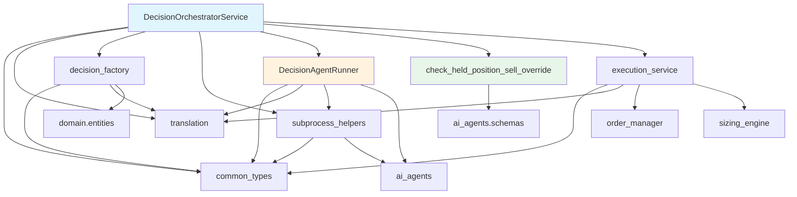

# Phase 5: DecisionOrchestrator 잔여 책임 Inventory 및 분리 설계

> **분석 일자**: 2026-05-24
> **대상 파일**: [`decision_orchestrator.py`](src/agent_trading/services/decision_orchestrator.py) (1,380 lines)
> **이미 분리된 모듈**: `translation.py`, `common_types.py`, `decision_factory.py`, `subprocess_helpers.py`

---

## 1. 상세 Inventory: 각 메서드 분류 (C/D/W)

| # | 메서드 | 라인 | 분류 | 설명 |
|---|--------|------|------|------|
| 1 | `__init__` | 175–228 (54L) | **C** (Coordinator) | 의존성 주입 + `ExecutionService`/`DecisionContextService` 초기화 |
| 2 | `_check_held_position_sell_override` | 230–288 (59L) | **D** (Decision logic) | 보유 포지션 + risk 신호 → REDUCE/EXIT override. `self` 미사용, 순수 함수 |
| 3 | `_ensure_or_create_decision_context` | 290–299 (10L) | **W** (Thin wrapper) | `DecisionContextService.ensure_or_create()` 단순 위임 |
| 4 | `_ensure_trade_decision` | 301–320 (20L) | **W** (Thin wrapper) | `build_trade_decision_entity()` + `repos.trade_decisions.add()` |
| 5 | `assemble()` | 322–699 (378L) | **C** + **D** (혼합) | 핵심 assembly: context 조회(C) + agent 실행 호출(C) + override(D) + OrderIntent 조립(C) |
| 6 | `assemble_and_submit()` | 705–791 (87L) | **C** (Coordinator) | Public API: `_run_decision_pipeline()` → `ExecutionService` 체이닝 |
| 7 | `_run_decision_pipeline()` | 798–872 (75L) | **C** (Coordinator) | `assemble()` 호출 + 에러 핸들링 + phase trace |
| 8 | `_run_agents()` | 883–1216 (334L) | **D** (Decision logic) | **3-agent sequential 실행** (EI→AR→FDC) + timeout/safe-fallback + recording |
| 9 | `_run_agents_in_subprocess()` | 1222–1376 (155L) | **D** (Decision logic) | 서브프로세스 기반 agent 실행. `_run_agents()`의 대체 구현 |

### 요약 통계

| 분류 | 메서드 | 총 라인 | 비율 |
|------|--------|---------|------|
| **C** (Coordinator) | `__init__`, `assemble_and_submit`, `_run_decision_pipeline`, `assemble()`(일부) | ~300L | 22% |
| **D** (Decision logic) | `_check_held_position_sell_override`, `_run_agents`, `_run_agents_in_subprocess`, `assemble()`(일부) | ~550L | 40% |
| **W** (Thin wrapper) | `_ensure_or_create_decision_context`, `_ensure_trade_decision` | ~30L | 2% |
| 기타 (module-level 상수/docs) | - | ~500L | 36% |

---

## 2. 분리 후보 평가

### 후보 A: `DecisionAgentRunner` — Agent 실행 서비스 (**추천**)

**대상**: `_run_agents()` (334L) + `_run_agents_in_subprocess()` (155L) = **~489L** (전체의 35%)

**이유**:
- 명확한 경계: agent 3개 sequential 실행 + timeout + safe-fallback
- `_run_agents_in_subprocess()`는`_run_agents()`와 동일한 시그니처 → 같은 클래스에서 관리
- orchestrator 의존성 없음 (새 클래스는 repos + agent 인스턴스만 필요)

**의존성 주입 목록**:
```
- repos: RepositoryContainer          # AgentRunRecorder 통해 recording
- event_interpretation_agent          # ProviderAIAgent
- ai_risk_agent                       # ProviderAIAgent
- final_decision_agent                # ProviderAIAgent
- agent_recorder                      # AgentRunRecorder
- score_calculator                    # ScoreCalculator
- use_subprocess_isolation: bool
- llm_provider, provider_api_key, provider_base_url, provider_model_id, provider_timeout_seconds
```

**Import cycle 위험**: ✅ **없음**
```
agent_runner.py
  → common_types.py       (OK)
  → translation.py        (OK)
  → subprocess_helpers.py (OK)
  → ai_agents/*           (OK — one-way)
  → domain.entities       (OK)
  → repositories.contracts (OK)
  → decision_orchestrator.py (차단! → import 하면 안 됨)
```

**복잡성**: 중간
- `_run_agents()`는 orchestrator의 `self._event_interpretation_agent`, `self._repos` 등 10개 속성 참조
- 새 클래스로 래핑하여 생성자로 주입

### 후보 B: `_check_held_position_sell_override` 순수 함수 분리

**대상**: `_check_held_position_sell_override()` (59L)

**이유**:
- **`self`를 전혀 사용하지 않는 순수 함수**
- 로직만 뽑아내서 standalone 함수로 전환 가능
- `decision_factory.py`에 배치 또는 새 `override_helpers.py` 파일

**Import cycle 위험**: ✅ **없음**
```python
# signatures only use AIRiskOutput, FinalDecisionComposerOutput
def check_held_position_sell_override(
    source_type: str,
    ar_output: AIRiskOutput | None,
    fdc_output: FinalDecisionComposerOutput | None,
) -> tuple[str, str, str] | None:
```

**복잡성**: 낮음 — 메서드 시그니처 변경 없이 그대로 함수로 추출

### 후보 C: `assemble()` 내 context assembly 로직 부분 분리

**대상**: `assemble()` 378L 중 data-fetching 부분 (context resolution, event query, snapshot query)

**이유**:
- assemble()의 절반은 "repository에서 데이터 가져와서 `AssembledContext` 조립"
- 하지만 `DecisionContextService`가 이미 context 조회를 담당하고 있어 경계가 모호
- 분리해도 orchestrator는 여전히 agent 실행 + override 조정 역할이 남음

**Import cycle 위험**: ⚠️ **있음** — 새 모듈이 `decision_factory.py`(이미 orchestrator import)를 import할 가능성

**복잡성**: 높음 — `assemble()`은 orchestrator의 여러 속성 사용 + 흐름 제어 포함

### 후보 D: `_run_decision_pipeline()` → `pipeline_service.py`

**대상**: `_run_decision_pipeline()` (75L)

**이유**:
- 너무 작음 (75L) — 분리 효과 미미
- `assemble_and_submit()`과 강하게 결합 (phase trace 클로저 공유)
- 두지 말고 `assemble_and_submit()`에 인라인하는 것도 고려

**복잡성**: 낮음 but **분리 효과 낮음** → 비추천

---

## 3. 추천 분리 계획

### Phase 5a: `DecisionAgentRunner` 클래스 추출 (Priority: 높음)

**새 파일**: [`src/agent_trading/services/decision/agent_runner.py`](src/agent_trading/services/decision/agent_runner.py)

```python
"""Agent execution runner — 3-agent sequential/subprocess pipeline.

Extracted from DecisionOrchestratorService to separate agent execution
logic from decision orchestration.
"""

class DecisionAgentRunner:
    """Executes EI → AR → FDC agents with timeout/safe-fallback.
    
    Supports both in-process and subprocess-isolated execution.
    """
    
    def __init__(
        self,
        repos: RepositoryContainer,
        *,
        event_interpretation_agent: ProviderAIAgent,
        ai_risk_agent: ProviderAIAgent,
        final_decision_agent: ProviderAIAgent,
        agent_recorder: AgentRunRecorder,
        score_calculator: ScoreCalculator,
        use_subprocess_isolation: bool = True,
        llm_provider: str = "deepseek",
        provider_api_key: str = "",
        provider_base_url: str = "",
        provider_model_id: str = "",
        provider_timeout_seconds: int = 120,
    ) -> None:
        ...
    
    async def run_agents(
        self,
        *,
        assembled_context: AssembledContext,
        decision_context_id: UUID | None,
        correlation_id: str,
        symbol: str | None = None,
        market: str | None = None,
    ) -> AgentExecutionBundle:
        """Execute 3 agents sequentially (in-process)."""
        # _run_agents() 로직 그대로 이동
    
    async def _run_agents_in_subprocess(
        self,
        *,
        assembled_context: AssembledContext,
        decision_context_id: UUID | None,
        correlation_id: str,
        symbol: str | None = None,
        market: str | None = None,
    ) -> AgentExecutionBundle:
        """Execute 3 agents in subprocess with SIGKILL-guaranteed timeout."""
        # _run_agents_in_subprocess() 로직 그대로 이동
```

### Phase 5b: `check_held_position_sell_override` 순수 함수 분리 (Priority: 중간)

**위치**: [`src/agent_trading/services/decision_factory.py`](src/agent_trading/services/decision_factory.py) (기존 모듈)
**또는**: 새 파일 [`src/agent_trading/services/decision/override_helpers.py`](src/agent_trading/services/decision/override_helpers.py)

```python
def check_held_position_sell_override(
    source_type: str,
    ar_output: AIRiskOutput | None,
    fdc_output: FinalDecisionComposerOutput | None,
) -> tuple[str, str, str] | None:
    """보유 포지션 + 강한 리스크 신호 → REDUCE/EXIT sell override 판단."""
    # _check_held_position_sell_override() 본문 그대로 이동 (self → params 전환)
```

### Phase 5 이후 `DecisionOrchestratorService` 예상 구조

```python
class DecisionOrchestratorService:
    def __init__(self, ..., agent_runner: DecisionAgentRunner | None = None):
        self._agent_runner = agent_runner or DecisionAgentRunner(...)
        self._execution_service = ExecutionService(...)
        ...
    
    # --- Thin wrappers (keep) ---
    async def _ensure_or_create_decision_context(self, ...): ...  # W
    async def _ensure_trade_decision(self, ...): ...               # W
    
    # --- Coordinator (keep, simplified) ---
    async def assemble(self, ...) -> OrderIntent:                # C + 일부 D
        # context resolution (그대로)
        # agent_bundle = await self._agent_runner.run_agents(...)   # ← 위임
        # override = check_held_position_sell_override(...)         # ← 순수 함수
        # OrderIntent 조립 (그대로)
    
    async def assemble_and_submit(self, ...) -> SubmitResult:    # C
        # chain: _run_decision_pipeline → execution_service
    
    async def _run_decision_pipeline(self, ...):                 # C (또는 inline)
        # assemble() 호출 + 에러 핸들링
```

---

## 4. 변경 영향 범위

### 직접 수정되는 파일

| 파일 | 변경 내용 | 예상 라인 수 |
|------|-----------|-------------|
| [`decision_orchestrator.py`](src/agent_trading/services/decision_orchestrator.py) | `_run_agents()`, `_run_agents_in_subprocess()` 삭제 → `DecisionAgentRunner` 위임. `_check_held_position_sell_override()` 삭제 → 함수 호출로 대체. `assemble()` 내 agent 실행/override 부분 위임 | -489L |
| [`decision_agent_runner.py`](src/agent_trading/services/decision/agent_runner.py) (신규) | orchestrator에서 추출한 agent 실행 로직 | ~490L |
| [`decision_factory.py`](src/agent_trading/services/decision_factory.py) (선택) | `check_held_position_sell_override()` 추가 | +60L |

### 영향받는 테스트 파일

| 테스트 파일 | 영향 | 대응 |
|-------------|------|------|
| [`test_decision_orchestrator.py`](tests/services/test_decision_orchestrator.py) | `_run_agents()` 직접 호출 제거 → `DecisionAgentRunner` 모킹 필요 | 기존 테스트 유지 + `agent_runner` mock 주입 |
| [`test_decision_replay.py`](tests/services/test_decision_replay.py) | `assemble()` public API 유지 → 영향 없음 | 변경 불필요 |
| [`test_decision_submit_pipeline.py`](tests/services/test_decision_submit_pipeline.py) | `assemble_and_submit()` public API 유지 → 영향 없음 | 변경 불필요 |
| [`test_held_position_sell_override.py`](tests/services/test_held_position_sell_override.py) | 함수 경로 변경 `service._check_held_position_sell_override()` → `check_held_position_sell_override()` | import 경로 수정 |
| [`test_fdc_skip.py`](tests/scripts/test_fdc_skip.py) | subprocess 경로 영향 가능 | 확인 필요 |

### 기타 영향

- **Main entry point** ([`runtimetask.py`](src/agent_trading/runtime/task_runner.py) 등): `DecisionOrchestratorService` 생성자 시그니처 변경 없음 (`agent_runner`는 선택적 파라미터)
- **Bootstrap**: 선택적 `agent_runner` 생성 → orchestrator에 전달하는 wiring 추가 가능

---

## 5. 예상 결과

### 분리 전후 라인 수 비교

| 항목 | 현재 (Phase 4) | Phase 5 후 | Delta |
|------|---------------|------------|-------|
| [`decision_orchestrator.py`](src/agent_trading/services/decision_orchestrator.py) | **1,380L** | **~620L** | -55% |
| [`decision/agent_runner.py`](src/agent_trading/services/decision/agent_runner.py) (신규) | — | **~490L** | +490L |
| [`decision_factory.py`](src/agent_trading/services/decision_factory.py) | 362L | ~420L (선택) | +60L |
| **합계** | **1,380L** | **~1,530L** | +150L (모듈 분할로 인한 overhead) |

### 분리 후 orchestrator 주요 구성

```
DecisionOrchestratorService (~620L)
├── __init__                          (~54L)  — 의존성 주입
├── _ensure_or_create_decision_context (~10L) — W
├── _ensure_trade_decision             (~20L) — W
├── assemble()                        (~350L) — C + D (context assembly + override 위임)
├── assemble_and_submit()              (~87L) — C
└── _run_decision_pipeline()           (~75L) — C
```

---

## 6. 실행 계획 요약

### Step 1: `DecisionAgentRunner` 추출

1. `services/decision/agent_runner.py` 신규 생성
2. `_run_agents()` → `DecisionAgentRunner.run_agents()`로 이동 (self → self._repos 등)
3. `_run_agents_in_subprocess()` → `DecisionAgentRunner._run_agents_in_subprocess()`로 이동
4. module-level 상수 `_PER_AGENT_TIMEOUT`, `_SUBPROCESS_TIMEOUT`도 함께 이동
5. `decision_orchestrator.py` → `DecisionAgentRunner` import + 생성자 위임
6. `assemble()` 내 `self._run_agents(...)` → `self._agent_runner.run_agents(...)` 변경
7. `assemble()` 내 subprocess rehydration 로직도 agent_runner로 이동 가능한지 검토

### Step 2: `check_held_position_sell_override` 분리

1. `decision_factory.py` 또는 새 `override_helpers.py`에 순수 함수로 추출
2. `decision_orchestrator.py` → import 변경 + `self._check_held_position_sell_override(...)` → `check_held_position_sell_override(...)`
3. 테스트 `test_held_position_sell_override.py` import 경로 업데이트

---

## 7. Mermaid: Phase 5 후 모듈 의존성



---

## 참고: Phase 4 대비 개선점 확인

| Phase 4 완료 사항 | Phase 5에서 유지/개선 |
|------------------|---------------------|
| `translation.py` — 순수 변환 함수 | 유지, 변경 불필요 |
| `common_types.py` — 공유 타입 | 유지, 변경 불필요 |
| `decision_factory.py` — `build_trade_decision_entity()` / `DecisionContextService` | 유지, sell override 함수 추가 가능 |
| `subprocess_helpers.py` — 직렬화/역직렬화 | 유지, `DecisionAgentRunner`가 사용 |
| `execution_service.py` — execution pipeline | 유지, 변경 불필요 |
