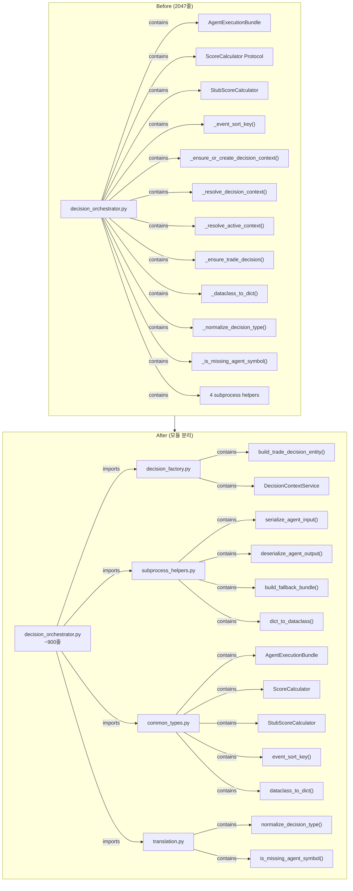

# Phase 4: DecisionOrchestrator 모듈 분리 — 상세 설계

## 개요

[`decision_orchestrator.py`](src/agent_trading/services/decision_orchestrator.py) (2047줄)에서 persistence/factory 책임과 helper 함수들을 4개의 모듈로 추출하여 응집도를 높이고 단일 책임 원칙을 준수합니다.

---

## 1. 현재 구조 분석

### 1.1 현재 [`decision_orchestrator.py`](src/agent_trading/services/decision_orchestrator.py) 내 구성요소

| 라인 | 식별자 | 유형 | 이동 대상 |
|------|--------|------|-----------|
| 110-128 | [`AgentExecutionBundle`](src/agent_trading/services/decision_orchestrator.py:110) | dataclass | [`common_types.py`](src/agent_trading/services/common_types.py) |
| 131-153 | [`ScoreCalculator`](src/agent_trading/services/decision_orchestrator.py:131) | Protocol | [`common_types.py`](src/agent_trading/services/common_types.py) |
| 163-171 | [`StubScoreCalculator`](src/agent_trading/services/decision_orchestrator.py:163) | class | [`common_types.py`](src/agent_trading/services/common_types.py) |
| 179-188 | [`_event_sort_key()`](src/agent_trading/services/decision_orchestrator.py:179) | module-level function | [`common_types.py`](src/agent_trading/services/common_types.py) |
| 904-1060 | [`_ensure_or_create_decision_context()`](src/agent_trading/services/decision_orchestrator.py:904) | method | [`decision_factory.py`](src/agent_trading/services/decision_factory.py) → `DecisionContextService.ensure_or_create()` |
| 1061-1074 | [`_resolve_active_context()`](src/agent_trading/services/decision_orchestrator.py:1061) | method | [`decision_factory.py`](src/agent_trading/services/decision_factory.py) → `DecisionContextService.resolve_active()` |
| 1076-1087 | [`_resolve_decision_context()`](src/agent_trading/services/decision_orchestrator.py:1076) | method | [`decision_factory.py`](src/agent_trading/services/decision_factory.py) → `DecisionContextService.resolve()` |
| 1626-1686 | `_ensure_trade_decision()` TD Entity 생성부 | method body | [`decision_factory.py`](src/agent_trading/services/decision_factory.py) → `build_trade_decision_entity()` |
| 1719-1750 | [`_dataclass_to_dict()`](src/agent_trading/services/decision_orchestrator.py:1719) | module-level function | [`common_types.py`](src/agent_trading/services/common_types.py) |
| 1753-1793 | [`_normalize_decision_type()`](src/agent_trading/services/decision_orchestrator.py:1753) | module-level function | [`translation.py`](src/agent_trading/services/translation.py) → `normalize_decision_type` |
| 1796-1801 | [`_is_missing_agent_symbol()`](src/agent_trading/services/decision_orchestrator.py:1796) | module-level function | [`translation.py`](src/agent_trading/services/translation.py) → `is_missing_agent_symbol` |
| 1809-1844 | [`_serialize_agent_input()`](src/agent_trading/services/decision_orchestrator.py:1809) | module-level function | [`subprocess_helpers.py`](src/agent_trading/services/subprocess_helpers.py) |
| 1847-1926 | [`_deserialize_agent_output()`](src/agent_trading/services/decision_orchestrator.py:1847) | module-level function | [`subprocess_helpers.py`](src/agent_trading/services/subprocess_helpers.py) |
| 1929-1989 | [`_build_fallback_bundle()`](src/agent_trading/services/decision_orchestrator.py:1929) | module-level function | [`subprocess_helpers.py`](src/agent_trading/services/subprocess_helpers.py) |
| 1992-2046 | [`_dict_to_dataclass()`](src/agent_trading/services/decision_orchestrator.py:1992) | module-level function | [`subprocess_helpers.py`](src/agent_trading/services/subprocess_helpers.py) |

### 1.2 호출 관계 분석

```
assemble()                                    [orchestrator 메서드, 유지]
├── self._ensure_or_create_decision_context()  → DecisionContextService.ensure_or_create()
├── self._resolve_decision_context()            → DecisionContextService.resolve()
├── _event_sort_key()                           → event_sort_key()
├── _dataclass_to_dict()                        → dataclass_to_dict()
├── self._run_agents() / _run_agents_in_subprocess()
│   ├── _serialize_agent_input()                → serialize_agent_input()
│   ├── _deserialize_agent_output()             → deserialize_agent_output()
│   ├── _build_fallback_bundle()                → build_fallback_bundle()
│   └── _dict_to_dataclass()                    → dict_to_dataclass()
└── self._ensure_trade_decision()               → build_trade_decision_entity() + repos.add()
```

### 1.3 외부 import 현황

현재 `_event_sort_key`를 [`test_seeded_news_converter.py`](tests/services/test_seeded_news_converter.py:309)에서 직접 import하고 있습니다.

---

## 2. 상세 설계

### 2.1 Step 1: [`decision_factory.py`](src/agent_trading/services/decision_factory.py) 생성

#### 2.1.1 `build_trade_decision_entity()` — 순수 factory 함수

**시그니처:**
```python
def build_trade_decision_entity(
    *,
    decision_context_id: UUID,
    request: SubmitOrderRequest,
    assembled_context: AssembledContext,
    agent_bundle: AgentExecutionBundle,
    fdc_run_id: UUID | None = None,
) -> TradeDecisionEntity:
```

**추출 범위:** [`decision_orchestrator.py:1626-1686`](src/agent_trading/services/decision_orchestrator.py:1626)

**핵심 변경사항:**
- `self._repos.trade_decisions.add(decision)` 호출 제거 → orchestrator에서 직접 호출
- `self._dataclass_to_dict(...)` 호출을 `dataclass_to_dict(...)`로 변경 (imported)
- `self._` prefix 제거
- `_ensure_trade_decision()` 메서드의 validation 부분 (line 1614-1621: `decision_context_id is None`, `decision_context is None` 체크)은 orchestrator에서 처리, factory 함수는 pure creation만 담당
- 추출 후 orchestrator 호출부:
```python
# orchestrator.assemble() 내부
trade_decision = build_trade_decision_entity(
    decision_context_id=resolved_context_id,
    request=request,
    assembled_context=assembled_context,
    agent_bundle=agent_bundle,
    fdc_run_id=_fdc_run_id,
)
saved = await self._repos.trade_decisions.add(trade_decision)
trade_decision_id = saved.trade_decision_id
```

#### 2.1.2 `DecisionContextService` 클래스

```python
class DecisionContextService:
    """Decision context resolution and creation service.
    
    Encapsulates repository interactions for decision context lifecycle.
    Extracted from DecisionOrchestratorService.
    """
    
    def __init__(self, repos: RepositoryContainer) -> None:
        self._repos = repos
    
    async def ensure_or_create(
        self,
        request: SubmitOrderRequest,
        existing_context_id: UUID | None,
    ) -> UUID | None:
        """Resolve or create a valid decision_context_id."""
        # ← _ensure_or_create_decision_context() body (lines 904-1060)
    
    async def resolve_active(self) -> UUID | None:
        """Resolve the most recent active decision context."""
        # ← _resolve_active_context() body (lines 1061-1074)
    
    async def resolve(self, context_id: UUID) -> DecisionContextEntity | None:
        """Resolve a full DecisionContextEntity by ID."""
        # ← _resolve_decision_context() body (lines 1076-1087)
```

**변경 후 orchestrator 호출부:**
```python
# __init__에서:
self._decision_context_service = DecisionContextService(repos)

# assemble()에서:
resolved_context_id = await self._decision_context_service.ensure_or_create(
    request, decision_context_id
)
decision_context = await self._decision_context_service.resolve(
    resolved_context_id
)
```

---

### 2.2 Step 2: [`subprocess_helpers.py`](src/agent_trading/services/subprocess_helpers.py) 생성

**포함할 함수들:**

| 함수명 | 원본 위치 | 변경사항 |
|--------|-----------|----------|
| [`serialize_agent_input()`](src/agent_trading/services/decision_orchestrator.py:1809) | module-level, `_` prefix | `_` 제거, `_dataclass_to_dict` → `dataclass_to_dict` |
| [`deserialize_agent_output()`](src/agent_trading/services/decision_orchestrator.py:1847) | module-level, `_` prefix | `_` 제거, `_dict_to_dataclass` → `dict_to_dataclass` |
| [`build_fallback_bundle()`](src/agent_trading/services/decision_orchestrator.py:1929) | module-level, `_` prefix | `_` 제거 |
| [`dict_to_dataclass()`](src/agent_trading/services/decision_orchestrator.py:1992) | module-level, `_` prefix | `_` 제거 |

**필요한 import:**
- [`AssembledContext`](src/agent_trading/services/common_types.py:101), [`AIDecisionInputs`](src/agent_trading/services/common_types.py:48), [`AgentExecutionBundle`](src/agent_trading/services/common_types.py) (이동 후)
- [`EventInterpretationOutput`](src/agent_trading/services/ai_agents/schemas.py), [`AIRiskOutput`](src/agent_trading/services/ai_agents/schemas.py), [`FinalDecisionComposerOutput`](src/agent_trading/services/ai_agents/schemas.py)
- [`_finalize_ei_output`](src/agent_trading/services/ai_agents/event_interpretation.py) (fallback bundle에서 사용)
- [`dataclass_to_dict`](src/agent_trading/services/common_types.py) (순환참조 방지: common_types → subprocess_helpers로 import)
- `logging`, `json`, `UUID`

**주의:** `deserialize_agent_output()`은 `_finalize_ei_output`을 fallback bundle에서만 사용하지만, 현재 `_build_fallback_bundle()`에서 `_finalize_ei_output(event_output)`을 호출합니다. 이 import는 `ai_agents/event_interpretation.py` 모듈에서 가져오므로 순환참조 문제가 없습니다.

---

### 2.3 Step 3: [`common_types.py`](src/agent_trading/services/common_types.py) + [`translation.py`](src/agent_trading/services/translation.py) 확장

#### 2.3.1 [`common_types.py`](src/agent_trading/services/common_types.py) 추가 항목

**이동할 요소:**

1. [`AgentExecutionBundle`](src/agent_trading/services/decision_orchestrator.py:110-128) dataclass
   - `from agent_trading.services.ai_agents.schemas import AIRiskOutput, EventInterpretationOutput, FinalDecisionComposerOutput` 필요
   - `from agent_trading.services.common_types import AIDecisionInputs` (자체 참조 — 이미 동일 모듈에 있음)

2. [`ScoreCalculator`](src/agent_trading/services/decision_orchestrator.py:131-153) Protocol
   - `from agent_trading.services.common_types import AssembledContext, ScoreResult` 필요

3. [`StubScoreCalculator`](src/agent_trading/services/decision_orchestrator.py:163-171) class

4. `event_sort_key()` (원본: `_event_sort_key`, lines 179-188)
   - public으로 변경 → `_` prefix 제거
   - `from agent_trading.domain.entities import ExternalEventEntity` 필요

5. `dataclass_to_dict()` (원본: `_dataclass_to_dict`, lines 1719-1750)
   - public으로 변경 → `_` prefix 제거
   - `UUID` 타입 변환 로직 포함

**`__all__`에 추가:**
```python
__all__ = [
    # 기존...
    "AgentExecutionBundle",
    "ScoreCalculator",
    "StubScoreCalculator",
    "event_sort_key",
    "dataclass_to_dict",
]
```

#### 2.3.2 [`translation.py`](src/agent_trading/services/translation.py) 추가 항목

**이동할 함수:**

1. `normalize_decision_type()` (원본: `_normalize_decision_type`, lines 1753-1793)
   - public으로 변경 → `_` prefix 제거
   - 순수 문자열 변환 함수, 추가 import 불필요

2. `is_missing_agent_symbol()` (원본: `_is_missing_agent_symbol`, lines 1796-1801)
   - public으로 변경 → `_` prefix 제거
   - 순수 문자열 검증 함수, 추가 import 불필요

**`__all__`에 추가:**
```python
__all__ = [
    # 기존...
    "normalize_decision_type",
    "is_missing_agent_symbol",
]
```

---

### 2.4 Step 4: [`decision_orchestrator.py`](src/agent_trading/services/decision_orchestrator.py) 정리

#### 2.4.1 제거할 항목

1. `AgentExecutionBundle` dataclass (lines 110-128)
2. `ScoreCalculator` Protocol (lines 131-153)
3. `StubScoreCalculator` class (lines 163-171)
4. `_event_sort_key()` 함수 (lines 179-188)
5. `_ensure_or_create_decision_context()` 메서드 (lines 904-1060)
6. `_resolve_active_context()` 메서드 (lines 1061-1074)
7. `_resolve_decision_context()` 메서드 (lines 1076-1087)
8. `_dataclass_to_dict()` 함수 (lines 1719-1750)
9. `_normalize_decision_type()` 함수 (lines 1753-1793)
10. `_is_missing_agent_symbol()` 함수 (lines 1796-1801)
11. `_serialize_agent_input()` 함수 (lines 1809-1844)
12. `_deserialize_agent_output()` 함수 (lines 1847-1926)
13. `_build_fallback_bundle()` 함수 (lines 1929-1989)
14. `_dict_to_dataclass()` 함수 (lines 1992-2046)

#### 2.4.2 새로 추가할 import

```python
from agent_trading.services.common_types import (
    AgentExecutionBundle,
    ScoreCalculator,
    StubScoreCalculator,
    event_sort_key,
    dataclass_to_dict,
    # 기존 import 유지
    PhaseTraceEntry,
    SubmitResult,
    AIDecisionInputs,
    AssembledContext,
    OrderIntent,
    ScoreResult,
)
from agent_trading.services.decision_factory import (
    build_trade_decision_entity,
    DecisionContextService,
)
from agent_trading.services.subprocess_helpers import (
    serialize_agent_input,
    deserialize_agent_output,
    build_fallback_bundle,
    dict_to_dataclass,
)
from agent_trading.services.translation import (
    normalize_decision_type,
    is_missing_agent_symbol,
    # 기존 import 유지
    build_submit_order_request_from_decision,
    calculate_max_order_value,
    decimal_or_none,
    resolve_decision_type,
    resolve_entry_style,
    resolve_order_side,
)
```

#### 2.4.3 변경할 호출부

| 원본 | 변경 후 |
|------|---------|
| `self._ensure_or_create_decision_context(request, ...)` | `await self._decision_context_service.ensure_or_create(request, ...)` |
| `self._resolve_decision_context(...)` | `await self._decision_context_service.resolve(...)` |
| `self._resolve_active_context()` | `await self._decision_context_service.resolve_active()` |
| `_event_sort_key(...)` | `event_sort_key(...)` |
| `_dataclass_to_dict(...)` | `dataclass_to_dict(...)` |
| `self._ensure_trade_decision(...)` | `trade_decision = build_trade_decision_entity(...)` + `await self._repos.trade_decisions.add(trade_decision)` |
| `_serialize_agent_input(...)` | `serialize_agent_input(...)` |
| `_deserialize_agent_output(...)` | `deserialize_agent_output(...)` |
| `_build_fallback_bundle()` | `build_fallback_bundle()` |
| `_dict_to_dataclass(...)` | `dict_to_dataclass(...)` |

#### 2.4.4 `__init__` 생성자 변경

`DecisionContextService` 인스턴스를 생성자에서 초기화:
```python
def __init__(self, ...):
    # ... 기존 코드 유지 ...
    self._decision_context_service = DecisionContextService(repos)
```

**참고:** `DecisionOrchestratorService.__init__` 시그니처는 **절대 변경하지 않음**. 기존 생성자 파라미터는 그대로 유지.

#### 2.4.5 public API 보존

다음 public API 시그니처는 **절대 변경하지 않음**:
- `assemble()` — [`decision_orchestrator.py:354`](src/agent_trading/services/decision_orchestrator.py:354)
- `assemble_and_submit()` — 유지 (메서드 본체 수정은 가능하나 시그니처 불변)

---

## 3. 순환참조 분석

### 3.1 잠재적 순환참조

```
common_types.py
  ├── domain.entities (기존)
  ├── domain.models (기존)
  └── ai_agents.schemas (신규: AgentExecutionBundle 이동으로 필요)

subprocess_helpers.py
  ├── common_types (AssembledContext, AIDecisionInputs, AgentExecutionBundle)
  ├── ai_agents.schemas (신규)
  ├── ai_agents.event_interpretation (_finalize_ei_output)
  └── common_types.dataclass_to_dict ← ❌ 순환참조 가능성
```

**해결:** `dataclass_to_dict()`은 `common_types.py`에 있고, `subprocess_helpers.py`는 `common_types`에서 `AgentExecutionBundle` 등을 import합니다. 만약 `common_types`가 `subprocess_helpers`를 import하면 순환참조. 하지만 `common_types`는 `subprocess_helpers`를 import하지 않으므로 **순환참조 없음**.

```
decision_factory.py
  ├── common_types (AssembledContext, AgentExecutionBundle 등)
  ├── domain.entities (TradeDecisionEntity 등)
  ├── domain.models (SubmitOrderRequest)
  ├── domain.enums (DecisionType 등)
  ├── ai_agents.schemas (FinalDecisionComposerOutput)
  ├── ai_agents.korean_normalizer (validate_or_normalize_korean)
  └── translation (resolve_decision_type, resolve_order_side, etc.)
     └── common_types (OrderIntent, AssembledContext 등)
```

`decision_factory.py` ↔ `translation.py` → `common_types.py` 방향의 단방향 의존성. **순환참조 없음**.

---

## 4. 테스트 영향 분석

### 4.1 변경이 필요한 테스트 import

| 테스트 파일 | 변경 사항 |
|-------------|-----------|
| [`tests/services/test_decision_orchestrator.py`](tests/services/test_decision_orchestrator.py) | `AIDecisionInputs`, `AssembledContext`, `OrderIntent`, `ScoreResult`, `StubScoreCalculator` import가 `decision_orchestrator` → `common_types`로 변경 |
| [`tests/services/test_seeded_news_converter.py`](tests/services/test_seeded_news_converter.py:309) | `_event_sort_key` import가 `decision_orchestrator` → `common_types`로 변경 |
| [`tests/services/test_held_position_sell_override.py`](tests/services/test_held_position_sell_override.py:12) | `_build_fallback_bundle` import가 `decision_orchestrator` → `subprocess_helpers`로 변경 |

### 4.2 모킹 변경

`_ensure_trade_decision`을 모킹한 테스트:
- [`test_decision_submit_pipeline.py:1365`](tests/services/test_decision_submit_pipeline.py:1365): `"agent_trading.services.decision_orchestrator.DecisionOrchestratorService._ensure_trade_decision"` 경로 유지 (메서드는 orchestrator에 남지만 본체가 `build_trade_decision_entity` 호출로 변경됨). 또는 `"agent_trading.services.decision_factory.build_trade_decision_entity"`로 변경.

### 4.3 테스트 전략

1. 각 Step별 `python3 -c "from agent_trading.services.<module> import <symbol>"` 검증
2. `pytest tests/services/test_decision_orchestrator.py -v` 실행
3. `pytest tests/services/ -v` 전체 실행
4. `pytest tests/ -x` 전체 실행

---

## 5. 실행 계획 (Subtask 분해)

### Subtask 1/5: [`decision_factory.py`](src/agent_trading/services/decision_factory.py) 생성
- [`build_trade_decision_entity()`](src/agent_trading/services/decision_orchestrator.py:1626) 함수 추출 (순수 entity 생성, repository 호출 제외)
- [`DecisionContextService`](src/agent_trading/services/decision_orchestrator.py:904) 클래스 추출 (3개 메서드)
- 검증: `python3 -c "from agent_trading.services.decision_factory import build_trade_decision_entity, DecisionContextService"`

### Subtask 2/5: [`subprocess_helpers.py`](src/agent_trading/services/subprocess_helpers.py) 생성
- 4개 helper 함수 추출 (`serialize_agent_input`, `deserialize_agent_output`, `build_fallback_bundle`, `dict_to_dataclass`)
- 검증: `python3 -c "from agent_trading.services.subprocess_helpers import serialize_agent_input, deserialize_agent_output, build_fallback_bundle, dict_to_dataclass"`

### Subtask 3/5: [`common_types.py`](src/agent_trading/services/common_types.py) + [`translation.py`](src/agent_trading/services/translation.py) 확장
- [`common_types.py`](src/agent_trading/services/common_types.py): `AgentExecutionBundle`, `ScoreCalculator`, `StubScoreCalculator`, `event_sort_key`, `dataclass_to_dict` 추가
- [`translation.py`](src/agent_trading/services/translation.py): `normalize_decision_type`, `is_missing_agent_symbol` 추가
- 검증: `python3 -c "from agent_trading.services.common_types import AgentExecutionBundle, ScoreCalculator, StubScoreCalculator, event_sort_key, dataclass_to_dict"` + `python3 -c "from agent_trading.services.translation import normalize_decision_type, is_missing_agent_symbol"`

### Subtask 4/5: [`decision_orchestrator.py`](src/agent_trading/services/decision_orchestrator.py) 정리
- 추출된 요소들 제거
- 새 import 추가
- 호출부 변경 (`self._ensure_or_create_decision_context()` → `await self._decision_context_service.ensure_or_create()` 등)
- `__init__`에 `DecisionContextService` 인스턴스 생성 추가
- 검증: `python3 -c "from agent_trading.services.decision_orchestrator import DecisionOrchestratorService"`

### Subtask 5/5: 테스트 및 Docker 검증
- 테스트 import 경로 업데이트
- 모킹 경로 업데이트
- Step별 pytest 실행
- 전체 pytest 실행
- Docker rebuild + health check

---

## 6. Mermaid 다이어그램



---

## 7. 제약 조건 요약

- `python3`만 사용
- `/bin/bash` 기준
- `.env` 수정 금지
- public API 시그니처 절대 변경 금지 (`assemble()`, `assemble_and_submit()`)
- 각 subtask 완료 후 `python3 -c "from ... import ..."` 검증
- Docker rebuild + health check 필수
