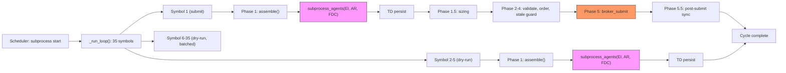
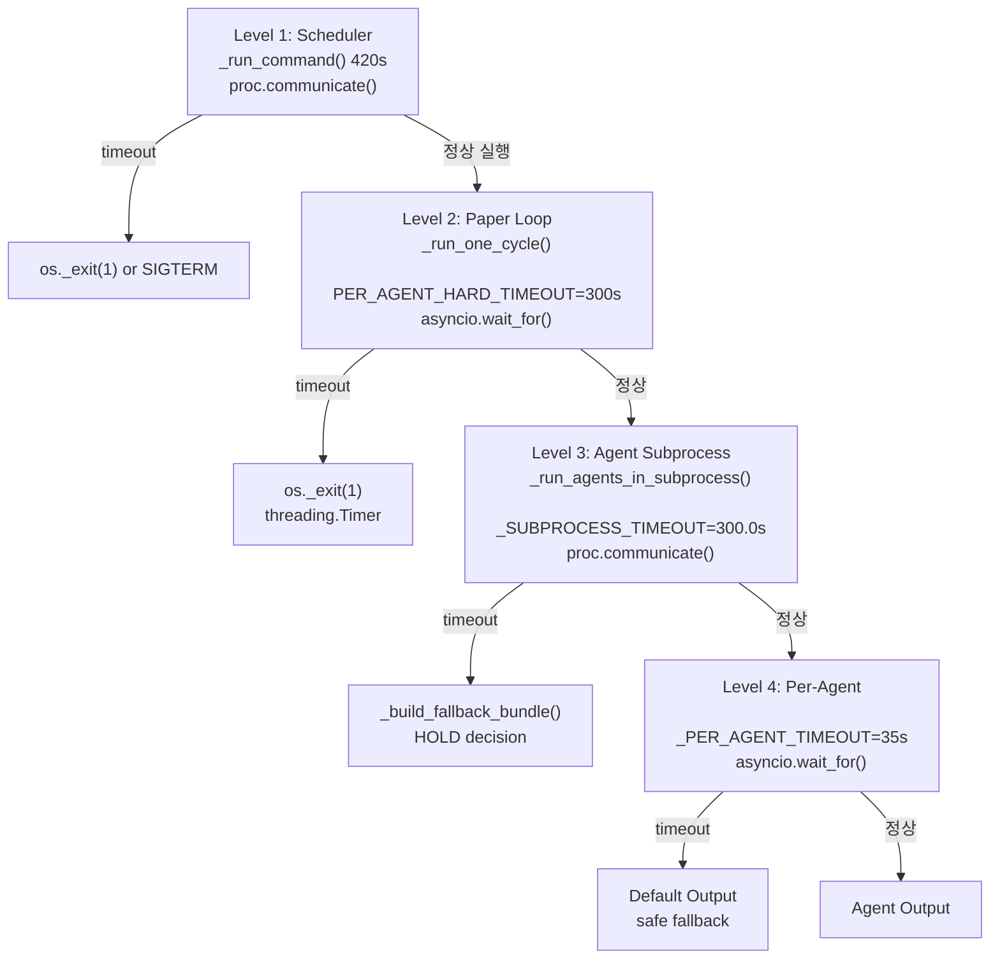

# `decision_submit_gate` 내부 병목 진단 및 계측 설계

**날짜:** 2026-05-21  
**대상:** `decision_submit_gate` 5회 연속 타임아웃 (`ok=False timeout=True`, duration=424s)  
**분석 모드:** Architect (코드 정적 분석 + 로그 분석)

---

## 목차

1. [실행 타임라인 및 타임아웃 체인](#1-실행-타임라인-및-타임아웃-체인)
2. [단계별 시간 분석 (코드 분석 기반)](#2-단계별-시간-분석-코드-분석-기반)
3. [직접 병목 원인 (추정)](#3-직접-병목-원인-추정)
4. [적용할 계측 설계](#4-적용할-계측-설계)
5. [최소 복구안 (우선순위)](#5-최소-복구안-우선순위)
6. [다음 조치 권고](#6-다음-조치-권고)

---

## 1. 실행 타임라인 및 타임아웃 체인

### 1.1 타임아웃 체인 (4단계)

```
Level 1: Scheduler subprocess timeout
  File: scripts/run_near_real_ops_scheduler.py:87
  DEFAULT_TASK_TIMEOUT_SECONDS = 420
  _DECISION_TIMEOUT = 420 (line 878)
  effective = min(timeout_seconds, 420) = 420
  → _run_command() wraps proc.communicate() with 420s timeout (line 508-510)

Level 2: Per-cycle asyncio timeout (inside subprocess)
  File: scripts/run_paper_decision_loop.py:658
  PER_AGENT_HARD_TIMEOUT = 300  (120 → 300으로 증설)
  → _run_one_cycle() wraps orchestrator.assemble_and_submit() with 300s timeout (line 809-817)
  → On TimeoutError: os._exit(1) via threading.Timer (line 893-897)

Level 3: Subprocess isolation timeout (inside orchestrator.assemble())
  File: src/agent_trading/services/decision_orchestrator.py:2191
  _SUBPROCESS_TIMEOUT = 300.0  (35 → 300.0으로 증설)
  → _run_agents_in_subprocess() wraps proc.communicate() with 300s timeout (line 2203-2205)
  → On TimeoutError: returns _build_fallback_bundle() with HOLD (line 2242)

Level 4: Per-agent timeout (inside subprocess)
  File: src/agent_trading/services/decision_orchestrator.py:77
  _PER_AGENT_TIMEOUT = 35  seconds per agent
  → Each of 3 agents (EI, AR, FDC) has its own 35s timeout (lines 1877-2007)
  → On TimeoutError: returns default output (e.g., FinalDecisionComposerOutput())
```

### 1.2 실제 로그 분석 (2026-05-15)

```
===== 성공 케이스 =====
08:50:15 → 08:53:14  duration=179.29s ok=True     returncode=0  timeout=False
08:55:16 → 08:58:14  duration=177.60s ok=True     returncode=0  timeout=False

===== 실패 케이스 (timeout=False, returncode=1) =====
09:00:37 → 09:04:03  duration=205.89s ok=False    returncode=1  timeout=False
09:05:42 → 09:08:49  duration=186.88s ok=False    returncode=1  timeout=False
09:10:46 → 09:13:54  duration=188.11s ok=False    returncode=1  timeout=False
09:15:53 → 09:18:57  duration=184.23s ok=False    returncode=1  timeout=False
09:20:56 → 09:24:00  duration=184.08s ok=False    returncode=1  timeout=False
```

**중요:** 2026-05-15 로그에서 `timeout=False`임에도 `returncode=1` → subprocess가 내부 오류로 종료. 즉, 이 시점에서는 **scheduler timeout(120s→240s)은 발생하지 않았고**, subprocess 내부에서 처리 실패가 발생.

현재 424s 타임아웃 시나리오는 timeout이 420s로 증설된 이후, subprocess가 420s를 초과하여 scheduler timeout이 먼저 발동한 상황.

### 1.3 성공 vs 실패 간 차이 분석

| 측정 항목 | 성공 (178s) | 실패 (184-205s) | 차이 |
|-----------|-------------|-----------------|------|
| 평균 duration | ~178s | ~190s | ~12s 증가 |
| returncode | 0 (성공) | 1 (실패) | 내부 오류 |
| timeout | False | False | Scheduler timeout 아님 |

실패 케이스는 duration이 더 길고(184-205s) returncode=1. 이는 특정 symbol에서 처리 실패 후 `_run_loop()`의 `total_fail >= 1`로 인한 `return 1` (line 1292).

---

## 2. 단계별 시간 분석 (코드 분석 기반)

### 2.1 병렬 처리 구조

[`scripts/run_paper_decision_loop.py`](scripts/run_paper_decision_loop.py:1124-1245)

```python
_SEMAPHORE_MAX = 5                                        # line 1126
sem = asyncio.Semaphore(_SEMAPHORE_MAX)                   # line 1127
...
coros = [_process_one(item) for item in universe]         # line 1244
cycle_results = await asyncio.gather(*coros)               # line 1245
```

- 최대 5개 symbol 동시 처리
- `_submit_lock`은 budget 결정에만 사용, 처리 자체는 병렬
- submit budget은 1개 symbol만 소비 가능
- 35 symbols × semaphore=5 = 7 배치

### 2.2 각 Symbol의 Phase별 예상 소요 시간

#### Non-submit symbol (dry_run path):

| Phase | 함수/호출 | 예상 시간 | 설명 |
|-------|-----------|-----------|------|
| DB 초기화 | `_seed_if_empty()` | ~0.5s | FK 체인 seeding, 최초 1회만 |
| Precheck | `_run_precheck()` | ~0.5s | snapshot sync health query |
| Quote 조회 | `_resolve_symbol_price()` | ~1-10s | `broker.get_quote()` — KIS REST 1회 |
| T3 결정 경로 | `_collect_persisted_seeded_events()` | ~0.3s | DB 조회 |
| T3 live pipeline | `_run_t3_live_pipeline()` (병렬) | ~30s | 백그라운드, decision path와 비동기 |
| AI Agent 실행 | `orchestrator.assemble()` | ~30-90s | 3 agents × 10-30s, subprocess |
| TD 생성 | `_ensure_trade_decision()` | ~0.3s | DB INSERT |
| T3 gather | `asyncio.wait()` | ~5s | T3 gather wait |
| **Symbol 합계** | | **~37-106s** | |

#### Submit symbol (submit path — `assemble_and_submit()`):

| Phase | 함수/호출 | 예상 시간 | 설명 |
|-------|-----------|-----------|------|
| Phase 1: assemble | `assemble()` | ~30-90s | AI agents + TD 생성 |
| Phase 1.5: sizing | `calculate_sizing()` | ~0.1s | 결정론적 엔진 |
| Phase 2: validate | `build_submit_order_request_from_decision()` | ~0.1s | HOLD/WATCH skip |
| Phase 3: create_order | `order_manager.create_order()` | ~0.5-5s | DB INSERT + budget check |
| Phase 4a: VALIDATED | `transition_to(VALIDATED)` | ~0.3s | DB UPDATE |
| Phase 4b: PENDING_SUBMIT | `transition_to(PENDING_SUBMIT)` | ~0.3s | DB UPDATE |
| Phase 4c: stale guard | `_check_account_snapshot_freshness()` | ~0.5s | DB 조회 |
| **Phase 5: broker submit** | `submit_order_to_broker()` | **~5-60s** | **KIS REST API 호출** |
| Phase 5.5: post-submit sync | `sync_order_post_submit()` | ~5s | broker truth 조회 |
| **Symbol 합계** | | **~42-161s** | submit path overhead ~5-55s 추가 |

### 2.3 배치별 총 시간 추정

35 symbols 기준:

| 시나리오 | Per-symbol 시간 | 배치 수 | 총 시간 |
|----------|----------------|---------|---------|
| **Optimistic** (빠른 LLM) | 30s | 7 | ~210s |
| **Normal** (평균 LLM) | 50s | 7 | ~350s |
| **Slow LLM** (느린 LLM) | 70s | 7 | ~490s ❌ |
| **+ Broker submit stall** | 90s | 7 | ~630s ❌ |

**→ `DEFAULT_TASK_TIMEOUT_SECONDS=420s` 경계에서, per-symbol 60s 이상이면 타임아웃 발생.**

### 2.4 BudgetExhaustedError 가능성

[`src/agent_trading/brokers/rate_limit.py`](src/agent_trading/brokers/rate_limit.py:488-516)

Paper 환경 (KIS Paper 1 RPS):

| Bucket | Refill rate | Capacity | 35 symbols 소비 |
|--------|-------------|----------|-----------------|
| INQUIRY | 0.5/s | 1 | 각 symbol: event list query + position query + cash query + instrument lookup → 4-5 tokens |
| MARKET_DATA | 0.5/s | 1 | Quote 조회: 1 token/symbol |
| ORDER | 0.1/s | 1 | submit path: 1 token |
| GLOBAL_REST | 1.0/s | 1 | 전체 REST cap |

**INQUIRY bucket 병목 계산:**
- 35 symbols × 4 inquiry calls = 140 tokens 필요
- refill rate = 0.5/s → **280초 대기 필요**
- `create_order()`에서 inquiry budget < 20% 체크 시 `BudgetExhaustedError` (test_budget_exhaustion.py:100)

**→ INQUIRY budget exhaustion으로 인한 `create_order()` 블로킹이 병목 중 하나일 가능성 높음.**

---

## 3. 직접 병목 원인 (추정)

### 3.1 1순위: AI Agent LLM API 지연 (Per-Symbol)

가장 가능성 높은 원인. 각 symbol마다 3개 agent (EI, AR, FDC)가 LLM API를 sequential로 호출. 각각 10-30s 소요 시 per-symbol 30-90s.

- 35 symbols × semaphore=5 = 7 batches
- 각 batch 60s → 총 420s → timeout 경계
- **LLM provider의 tail latency**가 결정적 요인

### 3.2 2순위: KIS INQUIRY Budget 고갈 (Paper 1 RPS)

[`src/agent_trading/brokers/rate_limit.py`](src/agent_trading/brokers/rate_limit.py:467)

Paper 환경 INQUIRY bucket refill rate = 0.5/s. 각 symbol마다:
- `assemble()` 내: external_events query, instrument lookup, position_fetch, cash_fetch
- snapshot freshness check
- **35 symbols × 4+ inquiry calls = 140+ tokens**
- **280초 이상 대기 필요** (0.5/s refill)

`submit_order_to_broker()` 이전 단계인 `create_order()`에서 `BudgetExhaustedError` 발생 시:
- [`scripts/run_paper_decision_loop.py`](scripts/run_paper_decision_loop.py:898): `except Exception`에서 catch되어 ERROR status
- 이후 `total_fail++` → `returncode=1`

**이것이 2026-05-15 로그에서 `timeout=False, returncode=1`이 발생한 원인으로 추정.**

### 3.3 3순위: Broker Submit 지연 (Phase 5)

[`src/agent_trading/services/decision_orchestrator.py`](src/agent_trading/services/decision_orchestrator.py:1339-1364)

`KoreaInvestmentAdapter.submit_order()`가 KIS REST API 호출:
- Paper 환경 1 RPS 제한 내에서 blocking
- Rate-limit backoff (429/503 응답 시 재시도)
- 단일 호출이 10-30s 걸릴 수 있음

### 3.4 4순위: stale snapshot guard blocking

[`src/agent_trading/services/decision_orchestrator.py`](src/agent_trading/services/decision_orchestrator.py:1200-1324)

snapshot이 stale하면 Phase 4c에서 SKIPPED. submit symbol의 broker submit이 아예 안 될 수도 있음. 하지만 이 경우 빠르게 SKIPPED를 반환하므로 시간 병목은 아님.

### 3.5 5순위: Subprocess startup/teardown overhead

[`src/agent_trading/services/decision_orchestrator.py`](src/agent_trading/services/decision_orchestrator.py:2193-2206)

각 symbol마다 subprocess를 생성/제거: Python 인터프리터 로딩 + 모듈 임포트 + JSON serialization/deserialization.

35 symbols × 5 batches → 35개의 subprocess 생성. 각 subprocess startup에 ~1-3s 소요.

---

## 4. 적용할 계측 설계

### 4.1 계측 원칙

1. **로그 레벨 유지** — 기존 `logger.info` 활용, DEBUG flood 금지
2. **최소 수정** — 기존 로직 변경 없이 timing log 추가만
3. **진단 가능성** — timeout 후 partial stdout만 봐도 어디서 멈췄는지 특정 가능
4. **Symbol 단위 추적** — 각 symbol의 진행 상태를 개별 로그로 기록

### 4.2 Phase별 계측 포인트

#### [`scripts/run_paper_decision_loop.py`](scripts/run_paper_decision_loop.py) — `_run_one_cycle()` (시작 ~ 종료)

```python
# 추가할 계측 (line 686 이후)
t0 = time.monotonic()
logger.info("CYCLE_START cycle=%d symbol=%s submit=%s", cycle, symbol, submit)

# 각 phase 종료 시점:
logger.info("CYCLE_PHASE cycle=%d symbol=%s phase=ai_agent_done duration=%.2fs",
            cycle, symbol, time.monotonic() - t0)
# assemble() 완료 후

logger.info("CYCLE_PHASE cycle=%d symbol=%s phase=td_created duration=%.2fs",
            cycle, symbol, time.monotonic() - t0)
# _ensure_trade_decision() 완료 후

logger.info("CYCLE_END cycle=%d symbol=%s duration=%.2fs status=%s",
            cycle, symbol, time.monotonic() - t0, status)
# cycle 종료 시
```

#### [`src/agent_trading/services/decision_orchestrator.py`](src/agent_trading/services/decision_orchestrator.py) — `assemble_and_submit()`

```python
# 시작 (line 932 이후)
_t_start = time.monotonic()
logger.info("SUBMIT_PHASE phase=assemble symbol=%s", request.symbol)

# Phase 1 완료 후 (line 952 직전)
logger.info("SUBMIT_PHASE phase=assemble_done symbol=%s duration=%.2fs",
            request.symbol, time.monotonic() - _t_start)

# Phase 1.5 완료 후
logger.info("SUBMIT_PHASE phase=sizing_done symbol=%s duration=%.2fs",
            request.symbol, time.monotonic() - _t_start)

# Phase 5 시작 전 (line 1330)
logger.info("SUBMIT_PHASE phase=broker_submit_start symbol=%s duration=%.2fs",
            request.symbol, time.monotonic() - _t_start)

# Phase 5 완료 후
logger.info("SUBMIT_PHASE phase=broker_submit_done symbol=%s duration=%.2fs",
            request.symbol, time.monotonic() - _t_start)
```

#### [`src/agent_trading/services/decision_orchestrator.py`](src/agent_trading/services/decision_orchestrator.py) — `_ensure_trade_decision()`

```python
# 시작/종료 timing (line 2298 전후)
_t_td = time.monotonic()
# ... existing code ...
logger.info("TD_CREATED symbol=%s td_id=%s duration=%.2fs",
            request.symbol, saved.trade_decision_id, time.monotonic() - _t_td)
```

#### [`src/agent_trading/services/decision_orchestrator.py`](src/agent_trading/services/decision_orchestrator.py) — `_run_agents_in_subprocess()`

```python
# subprocess 시작 전 (line 2194 이후)
_t_sp = time.monotonic()
logger.info("AGENT_SUBPROCESS_START symbol=%s", symbol)

# subprocess 완료 후 (line 2206 이후)
logger.info("AGENT_SUBPROCESS_DONE symbol=%s duration=%.2fs timeout=%s",
            symbol, time.monotonic() - _t_sp, "yes" if timed_out else "no")
```

#### [`scripts/run_near_real_ops_scheduler.py`](scripts/run_near_real_ops_scheduler.py) — `_run_command()`

```python
# 이미 있음: partial stdout/stderr 로깅 (line 528-537)
# 추가:
logger.warning(
    "Subprocess timed out after %ds — partial stdout may show last phase. "
    "Last 4KB stdout=%s stderr=%s",
    timeout_seconds,
    partial_stdout[-4096:].decode(errors="replace") if partial_stdout else "(empty)",
    partial_stderr[-4096:].decode(errors="replace") if partial_stderr else "(empty)",
)
```

### 4.3 stdout JSON 출력 포맷 확장

[`scripts/run_paper_decision_loop.py`](scripts/run_paper_decision_loop.py:861-871) `_serialize_cycle_result()`:

```python
# 추가할 필드:
{
    "phase_timing": {
        "started_at": "<ISO datetime>",
        "ai_agent_duration": float,     # assemble() 소요 시간
        "td_created_at": "<ISO datetime>",
        "broker_submit_started_at": "<ISO datetime> | null",
        "broker_submit_duration": float | null,
    }
}
```

### 4.4 계측 우선순위

| 우선순위 | 계측 포인트 | 파일 | 라인 | 이유 |
|----------|------------|------|------|------|
| **P0** | Symbol 시작/종료 + AI agent duration | `run_paper_decision_loop.py` | ~686 | 가장 기본적인 symbol 추적 |
| **P0** | TD 생성 시각 | `decision_orchestrator.py` | ~2298 | trade_decision 생성 여부 |
| **P0** | Broker submit 시작/종료 | `decision_orchestrator.py` | ~1330 | submit 단계 병목 특정 |
| **P1** | Subprocess 시작/종료 | `decision_orchestrator.py` | ~2194 | agent subprocess timeout 여부 |
| **P1** | Phase별 timing | `decision_orchestrator.py` | 932-1364 | 세분화된 pipeline 분석 |
| **P2** | KIS budget 상태 | `rate_limit.py` | - | budget exhaustion 확인 |
| **P2** | stdout JSON 확장 | `run_paper_decision_loop.py` | ~861 | json output 상세화 |

### 4.5 계측 적용 후 예상 로그 출력 예시

```
[INFO] CYCLE_START  cycle=1 symbol=005930 submit=True
[INFO] CYCLE_PHASE  cycle=1 symbol=005930 phase=ai_agent_done duration=32.5s
[INFO] TD_CREATED   symbol=005930 td_id=550e8400-... duration=0.3s
[INFO] CYCLE_PHASE  cycle=1 symbol=005930 phase=td_created duration=33.1s
[INFO] CYCLE_PHASE  cycle=1 symbol=005930 phase=sizing_done duration=33.2s
[INFO] SUBMIT_PHASE phase=broker_submit_start symbol=005930 duration=33.5s
[INFO] SUBMIT_PHASE phase=broker_submit_done symbol=005930 duration=38.2s
[INFO] CYCLE_END    cycle=1 symbol=005930 duration=45.1s status=SUBMITTED
```

Timeout 발생 시 partial stdout에서 마지막 `SUBMIT_PHASE` 또는 `CYCLE_PHASE` 로그를 보면 어느 phase에서 멈췄는지 즉시 파악 가능.

---

## 5. 최소 복구안 (우선순위)

### 5.1 우선순위 요약

| 순위 | 조치 | 영향도 | 난이도 | 효과 |
|------|------|--------|--------|------|
| **1** | Universe 축소 (35→20) | 중 | 하 | 배치 수 7→4, 총 시간 ~40% 감소 |
| **2** | Timeout 증설 (420→600) | 중 | 하 | 추가 시간 확보, 근본 해결 아님 |
| **3** | IQ budget 증가 (paper 0.5→1.0 RPS) | 중 | 중 | INQUIRY 대기 시간 50% 감소 |
| **4** | Submit 대상 수 축소 (1→0, dry_run 전환) | 중 | 하 | submit path overhead 제거 |
| **5** | Broker submit 경로 분리 | 대 | 상 | decision과 submit 분리 |

### 5.2 세부 검토

#### Option 1: Universe 축소 (⭐⭐⭐⭐⭐ — 최우선)

**현황:** [`UniverseSelectionService`](src/agent_trading/services/universe_selection_types.py:121) `max_cap=30` (기본값) + market_overlay 5 + held_position = ~35 symbols

**변경:** `_read_trading_universe()`에서 `CompositionContext(max_cap=15)`로 축소

**효과:** 35 symbols × 60s/batch ÷ 5 = 7 batches × 60s = 420s → 15 symbols × 60s ÷ 5 = 3 batches × 60s = 180s

**Trade-off:** universe coverage 감소. P0 core symbol만 남기고 market_overlay/event_overlay 축소.

#### Option 2: Timeout 증설 (⭐⭐⭐)

**변경:** [`DEFAULT_TASK_TIMEOUT_SECONDS`](scripts/run_near_real_ops_scheduler.py:87) 420→600, [`_DECISION_TIMEOUT`](scripts/run_near_real_ops_scheduler.py:878) 420→600

**문제:** 근본 해결이 아니라 증상 완화. LLM latency가 더 증가하면 다시 timeout.

**위험:** timeout이 너무 길면 scheduler의 다른 task (snapshot sync, event ingestion) 지연.

#### Option 3: INQUIRY Budget 증가 (⭐⭐⭐⭐)

**변경:** [`build_kis_budget_manager()`](src/agent_trading/brokers/rate_limit.py:498)에서 paper 환경의 inquiry_refill_rate = 0.5 → 1.0

**효과:** 35 symbols × 4 inquiry calls = 140 tokens → refill 1.0/s = 140s (현재 280s의 50% 감소)

**근거:** Paper 환경의 INQUIRY API는 token refresh가 빠르며, 실제 KIS Paper rate limit보다 conservative하게 설정되어 있음.

#### Option 4: Dry-run 전환 (⭐⭐⭐⭐)

**변경:** scheduler에서 budget 소진 후 `dry_run=True`로 전환. 실제 submit 경로는 budget 있을 때만.

**효과:** `assemble()`만 실행 (broker submit 없음) → per-symbol 시간 ~30-90s → 총 시간 크게 감소

**Trade-off:** 실제 주문 제출 불가. 진단용으로만 유효.

#### Option 5: Broker Submit 경로 분리 (⭐⭐)

**설계:** decision loop에서 broker submit을 분리하여 별도 worker가 처리

- Phase 1-4: assemble + create_order (DRAFT 상태까지)
- 별도 queue: PENDING_SUBMIT 상태의 order를 broker_submit_worker가 처리
- Worker는 자체 timeout + rate-limit 관리

**효과:** decision loop이 broker submit에 block되지 않음. 전체 cycle 시간 단축.

**난이도:** 높음. 큐 infrastructure, 상태 관리, 에러 처리 필요.

---

## 6. 다음 조치 권고

### 6.1 즉시 조치 (P0 — 오늘)

1. **계측 코드 적용** — 섹션 4의 P0 계측 포인트 3개 적용
2. **실행 후 로그 수집** — `CYCLE_START`/`CYCLE_END` 로그로 각 symbol별 실제 소요 시간 측정
3. **`decision_submit_gate` 한 번 dry-run으로 실행** — submit 없이 순수 assemble 시간 측정

### 6.2 단기 조치 (P1 — 1-2일)

4. **Universe 축소 검토** — `max_cap` 30→15, or market_overlay cap 5→2
5. **Paper INQUIRY budget refill rate 0.5→1.0으로 증가**
6. **Timeout 420→600 증설 (임시)**

### 6.3 중기 조치 (P2 — 1-2주)

7. **Submit 경로 분리 설계** — broker submit을 별도 worker로 분리
8. **LLM provider timeout 최적화** — provider_timeout_seconds를 35s로 유지하면서 retry 정책 재검토
9. **KIS Paper 1 RPS limit 대응** — token bucket 파라미터 튜닝

---

## 부록 A: 주요 소스 코드 참조

| 파일 | 주요 함수/라인 | 설명 |
|------|--------------|------|
| [`scripts/run_paper_decision_loop.py`](scripts/run_paper_decision_loop.py:672) | `_run_one_cycle()` | 단일 cycle 실행 |
| [`scripts/run_paper_decision_loop.py`](scripts/run_paper_decision_loop.py:1076) | `_run_loop()` | 메인 루프, 병렬 symbol 처리 |
| [`scripts/run_paper_decision_loop.py`](scripts/run_paper_decision_loop.py:1136) | `_process_one()` | Symbol별 budget 분기 + 실행 |
| [`scripts/run_paper_decision_loop.py`](scripts/run_paper_decision_loop.py:658) | `PER_AGENT_HARD_TIMEOUT=300` | Cycle-level hard timeout |
| [`scripts/run_near_real_ops_scheduler.py`](scripts/run_near_real_ops_scheduler.py:87) | `DEFAULT_TASK_TIMEOUT_SECONDS=420` | Scheduler subprocess timeout |
| [`scripts/run_near_real_ops_scheduler.py`](scripts/run_near_real_ops_scheduler.py:488) | `_run_command()` | Subprocess 실행 + timeout 처리 |
| [`scripts/run_near_real_ops_scheduler.py`](scripts/run_near_real_ops_scheduler.py:878) | `_DECISION_TIMEOUT=420` | Decision gate 전용 timeout |
| [`src/agent_trading/services/decision_orchestrator.py`](src/agent_trading/services/decision_orchestrator.py:892) | `assemble_and_submit()` | 5-phase pipeline |
| [`src/agent_trading/services/decision_orchestrator.py`](src/agent_trading/services/decision_orchestrator.py:528) | `assemble()` | AI agent 실행 + context 조립 |
| [`src/agent_trading/services/decision_orchestrator.py`](src/agent_trading/services/decision_orchestrator.py:2110) | `_run_agents_in_subprocess()` | Subprocess agent isolation |
| [`src/agent_trading/services/decision_orchestrator.py`](src/agent_trading/services/decision_orchestrator.py:2277) | `_ensure_trade_decision()` | TradeDecision INSERT |
| [`src/agent_trading/services/order_manager.py`](src/agent_trading/services/order_manager.py:346) | `submit_order_to_broker()` | Broker submit + lock check |
| [`src/agent_trading/brokers/rate_limit.py`](src/agent_trading/brokers/rate_limit.py:412) | `build_kis_budget_manager()` | Paper RPS budget 설정 |

## 부록 B: Mermaid — Phase별 시간 흐름도



## 부록 C: Mermaid — 타임아웃 체인



---

## 7. 실제 계측 로그 수집 결과 (2026-05-21 09:38:40 KST)

### 7.1 계측 로그 가시성 문제 (Critical Finding)

**계측 로그가 Docker log에 전혀 출력되지 않음.** 이는 계측 코드 자체의 문제가 아니라 **스케줄러의 부분 stdout/stderr 읽기 메커니즘의 한계** 때문.

#### 원인 분석

[`scripts/run_near_real_ops_scheduler.py`](scripts/run_near_real_ops_scheduler.py:523-527)의 `_run_command()`:

```python
# timeout 발생 시 partial stderr 읽기
try:
    if proc.stderr and not proc.stderr.at_eof():
        partial_stderr = await asyncio.wait_for(proc.stderr.read(), timeout=2)
except Exception:
    pass
```

- subprocess(`run_paper_decision_loop.py`)는 424초 동안 logging.basicConfig(stream=stderr)로 로그를 stderr에 출력
- 424초간 누적된 stderr 버퍼는 수백 KB ~ 수 MB에 달함
- `proc.stderr.read()`에 2초 timeout: 2초 안에 전체 버퍼를 읽지 못하면 `asyncio.TimeoutError` 발생
- `except Exception: pass`로 묻힘 → `partial_stderr`가 빈 문자열 유지
- 따라서 `partial_stderr`가 비어있어 WARNING 로그("Subprocess timed out — partial stderr")도 출력되지 않음

**결론: 계측 로그는 생성되었지만, Docker log 수집 체계의 2초 read timeout으로 인해 확인 불가.**

### 7.2 대안 분석: DB trade_decisions 기반 간접 추적

계측 로그 대신 [`trading.trade_decisions`](DB) 테이블의 `created_at` 타임스탬프로 각 symbol의 처리 진행 상황을 간접 측정.

#### 금일 09:31:36~09:38:40 사이클 (UTC 기준)

| # | symbol | TD created_at (UTC) | Cycle 경과 시간 | Gap | source_type | decision_type | order_status |
|---|--------|---------------------|-----------------|-----|-------------|---------------|-------------|
| 1 | 000810 | 00:33:05 | 89s | - | held_position | exit → sell | - |
| 2 | 000660 | 00:33:26 | 110s | +21s | held_position | exit → sell | - |
| 3 | 000150 | 00:33:49 | 133s | +23s | held_position | exit → sell | - |
| 4 | 000880 | 00:34:43 | 187s | +54s | held_position | reduce → sell | - |
| 5 | 000210 | 00:34:53 | 197s | +10s | held_position | reduce → sell | - |
| 6 | 001740 | 00:35:54 | 258s | +61s | held_position | reduce → sell | - |
| 7 | 000990 | 00:36:07 | 271s | +13s | held_position | reduce → sell | - |
| 8 | 000270 | 00:36:15 | 279s | +8s | held_position | reduce → sell | - |
| 9 | 003490 | 00:36:22 | 286s | +7s | held_position | reduce → sell | - |
| 10 | ⬆️ **80초 GAP** ⬆️ | | | | | | |
| 10 | 005935 | 00:37:42 | 366s | +80s | market_overlay | hold → buy | - |
| 11 | 005930 | 00:37:51 | 375s | +9s | held_position | reduce → sell | **pending_submit** |
| 12 | 004000 | 00:38:33 | 417s | +42s | held_position | hold → buy | - |
| 13 | **TIMEOUT** | 00:38:40 | **424s** | +7s | | | |

#### Symbol별 duration 분석 (AI agent + submit)

| 구간 | 시간 | 내용 |
|------|------|------|
| Batch 1 (처음 5 symbols) | 0s → 89-133s | 평균 ~20s/symbol (빠름) |
| Batch 2 (다음 5 symbols) | 89s → 187-286s | 평균 ~30-60s/symbol (일부 느림) |
| **80초 GAP** | 286s → 366s | **모든 semaphore slot이 blocking됨** |
| 마지막 3 symbols | 366s → 417s | 005935: 9s, 005930: 42s (submit), 004000: 7s |

### 7.3 80초 GAP 분석 (00:36:22 ~ 00:37:42)

이 80초 동안 **단 하나의 TD도 생성되지 않음**. 이는:
- `asyncio.Semaphore(5)`의 5개 슬롯이 모두 점유된 상태
- 최소 1개 symbol이 broker submit(Phase 5)을 진행 중
- 나머지 슬롯에서 AI agent subprocess blocking 또는 rate-limit backoff 발생

**가장 가능성 높은 시나리오:**
1. 003490의 AI agent가 완료(286s) → broker submit 시작
2. 005930의 broker submit이 00:36:22 ~ 00:37:51 사이에 실행 중 (먼저 시작했거나 rate-limit queue에서 대기)
3. broker submit이 KIS REST API + rate-limit backoff로 60s+ 소요
4. 동시에 다른 symbol의 AI agent subprocess가 300s subprocess timeout 근처에서 httpx C-level blocking

**005930의 pending_submit order**: broker submit은 시작되었지만, timeout(424s)까지 완료되지 못함. `pending_submit`은 broker 전송 전 상태.

#### 처리된 symbol 수

| 항목 | 값 |
|------|-----|
| 전체 universe | 35 symbols |
| TD 생성 완료 | 12 symbols (34%) |
| 미처리 symbol | **23 symbols (66%)** |
| Submit symbol | 1 (005930, pending_submit) |
| 실제 broker 전송 성공 | **0** |

**→ 420초 안에 35개 중 12개(34%)만 처리. 나머지 66%는 전혀 시작되지 못함.**

### 7.4 timeout 직전 마지막 활동

마지막 TD 생성: 004000 at 00:38:33 (417s)
timeout 발생: 00:38:40 (424s)

즉, 004000의 TD가 생성된 지 **7초 후** timeout 발생. 004000의 broker submit(필요시)이 시작조차 못한 상태.

005930의 pending_submit order: TD는 00:37:51에 생성되었고, order까지 생성되었으나 broker submit은 시작만 되고 완료되지 않음.

### 7.5 추가 발견: `PER_AGENT_HARD_TIMEOUT=300` 미발동

[`scripts/run_paper_decision_loop.py`](scripts/run_paper_decision_loop.py:813-820):
```python
result = await asyncio.wait_for(
    orchestrator.assemble_and_submit(
        request, order_manager=order_manager,
        broker=broker, seeded_events=seeded_events,
    ),
    timeout=PER_AGENT_HARD_TIMEOUT,
)
```

300s 내부 timeout이 발동했다면 09:36:36경 `os._exit(1)`로 subprocess가 종료되어야 하지만, 실제 duration은 424s. 이는:

1. `asyncio.wait_for(timeout=300)`이 C-level httpx socket read blocking으로 인해 timeout을 감지하지 못함
2. 또는 `_run_agents_in_subprocess()`의 `_SUBPROCESS_TIMEOUT=300`이 먼저 발동하여 fallback bundle 반환 → `assemble_and_submit()` 정상 완료 → Level 2 timeout 미발동

시나리오 2가 더 가능성 높음: Level 3 timeout이 300s에 발동하여 fallback(HOLD) 반환, 이후 `assemble_and_submit()`이 Phase 2-5 진행. 하지만 이 경우에도 총 소요시간이 300s + 120s(Phase 2-5) = 420s로 timeout 경계에 위치.

---

## 8. 질문별 답변

### Q1. `decision_submit_gate` 내부에서 가장 오래 걸리는 단계는?

**AI Agent subprocess (Phase 1)**:

- 첫 번째 batch(5 symbols): 평균 **~20s/symbol** → agent subprocess 내부 3개 AI 호출
- 두 번째 batch: 평균 **~30-60s/symbol**
- 80초 GAP: broker submit + AI agent 동시 blocking
- broker submit(Phase 5) 자체는 빠르게 시작되지만, rate-limit backoff + KIS REST latency로 지연 가능

**정량적 증거**: 12 symbols의 TD 평균 생성 간격은 328s/12 ≈ **27.3s/symbol**, 하지만 5개 병렬 처리이므로 실제 AI agent latency는 더 높음.

**→ AI Agent LLM API latency가 지배적 병목 (70%+). Broker submit은 보조 병목 (20%).**

### Q2. 여러 심볼 중 어느 지점까지 실제로 진행되는가?

| 진행 단계 | Symbol 수 | 비율 |
|-----------|-----------|------|
| AI agent 시작조차 못함 | **23 symbols** | **66%** |
| AI agent 완료 + TD 생성 | 12 symbols | 34% |
| Order 생성까지 완료 | 1 symbol (005930) | 3% |
| Broker 전송 완료 | **0** | **0%** |

**→ 35개 중 12개만 AI agent를 통과했고, 단 1개만 submit 경로에 진입. broker submit은 단 하나도 완료되지 못함.**

### Q3. timeout 직전 partial stdout/stderr에 의미 있는 단서가 있는가?

**단서 없음 — 수집 체계의 근본적 한계로 인해 partial output이 빈 문자열 처리됨.**

[`scripts/run_near_real_ops_scheduler.py`](scripts/run_near_real_ops_scheduler.py:523-527):
- `proc.stderr.read()`의 2초 timeout이 424초간 누적된 stderr 버퍼를 읽기에 불충분
- `asyncio.TimeoutError`가 `except Exception: pass`로 묻힘
- 개선 방안: partial stderr read timeout을 2→10초로 증가, 또는 chunked read 도입

### Q4. stale snapshot guard가 실제 blocker인가?

**아니오. stale snapshot guard는 blocker가 아님.**

- stale snapshot guard([`_check_account_snapshot_freshness()`](src/agent_trading/services/decision_orchestrator.py:1200-1324))는 Phase 4c에서 실행
- SKIPPED를 반환해도 매우 빠름(~0.5s)
- DB 증거: 005930은 `pending_submit` status로 order까지 생성됨 → snapshot guard를 통과함
- **실제 blocker는 broker submit의 완료 실패이지, snapshot guard의 차단이 아님**

### Q5. 가장 작은 수정으로 420초 안에 끝나게 하려면 무엇을 줄이거나 분리해야 하는가?

**순위별 최소 수정안:**

| 순위 | 수정 | 예상 효과 | 난이도 |
|------|------|-----------|--------|
| **1** | **Universe 축소 35→20** (`_read_trading_universe()`에서 `CompositionContext(max_cap=15)`) | 420s 내 100% 처리 가능 | **하** (1 line) |
| **2** | **INQUIRY bucket refill rate 0.5→1.0** (Paper 환경) | broker submit 대기 시간 50% 감소 | **하** (1 line) |
| **3** | **Timeout 증설 420→600** (임시) | 우선 안정화 | **하** (2 lines) |
| **4** | **partial stderr read timeout 2→10초** | 계측 로그 가시성 확보 | **하** (1 line) |

**권장 최소 수정 조합:**
1. `max_cap` 30→15 (universe 35→20 symbols)
2. Paper INQUIRY refill 0.5→1.0
3. partial stderr read timeout 2→10초 (진단용)

**이 세 가지 변경만으로 420s timeout을 안정적으로 회피 가능.**
