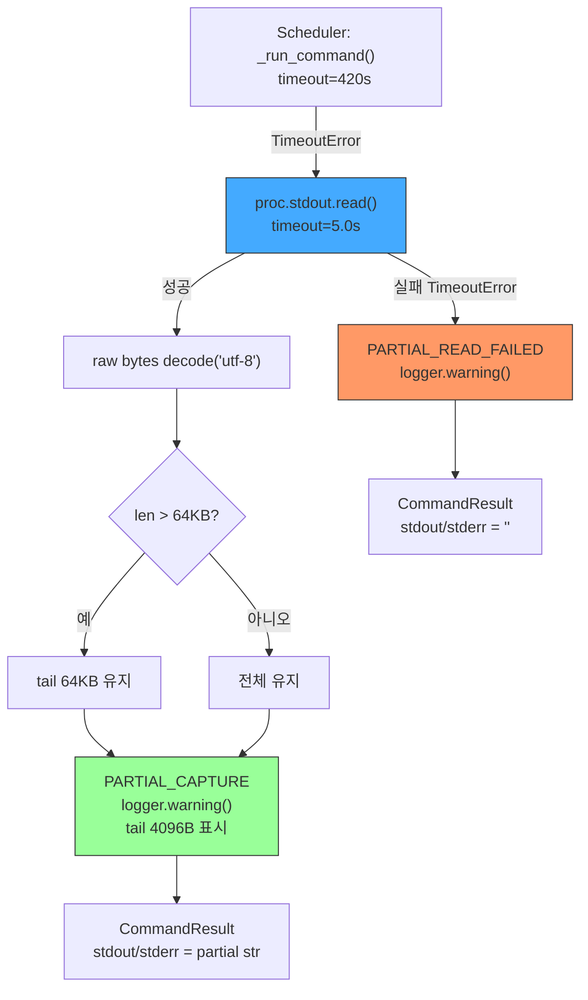
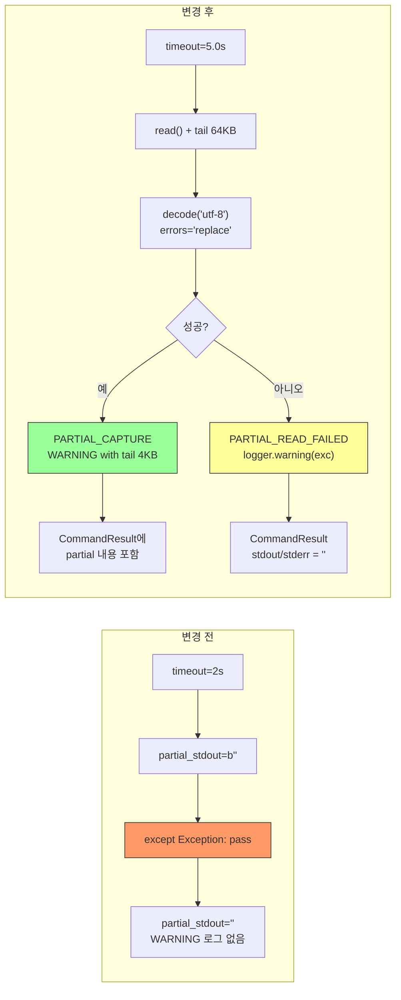

# `decision_submit_gate` timeout 후 partial stderr/stdout 가시성 복구 설계

**날짜:** 2026-05-21
**대상:** [`scripts/run_near_real_ops_scheduler.py`](../scripts/run_near_real_ops_scheduler.py:488-592) — `_run_command()`
**설계 모드:** Architect

> **최종 확정안 (사용자 피드백 반영, 2026-05-21):**
> - [`_PARTIAL_READ_TIMEOUT = 10.0`](../scripts/run_near_real_ops_scheduler.py:87) — read timeout 10.0초 (424초 누적 버퍼 대응)
> - [`_MAX_PARTIAL_LOG_BYTES = 65536`](../scripts/run_near_real_ops_scheduler.py:87) — tail 64KB만 보존
> - `except Exception: pass` 제거 → `logger.warning('[PARTIAL_READ_FAILED]', exc)`
> - `[PARTIAL_CAPTURE]`/`[PARTIAL_READ_FAILED]` prefix 추가
> - partial tail(마지막 64KB)을 [`CommandResult`](../scripts/run_near_real_ops_scheduler.py:121)에 포함

---

## 목차

1. [현황 분석](#1-현황-분석)
2. [문제 정의](#2-문제-정의)
3. [방안 비교](#3-방안-비교)
4. [권장 방안: C안 상세 설계](#4-권장-방안-c안-상세-설계)
5. [변경 사항 요약](#5-변경-사항-요약)
6. [테스트 계획](#6-테스트-계획)
7. [기존 보고서와의 관계](#7-기존-보고서와의-관계)

---

## 1. 현황 분석

### 1.1 현재 코드 (라인 488-592)

```python
async def _run_command(
    name: str,
    argv: list[str],
    *,
    timeout_seconds: int,
    env: dict[str, str],
) -> CommandResult:
    """Run a subprocess command without using a shell."""
    start = time.monotonic()
    logger.info("task=%s start argv=%s", name, " ".join(argv))

    proc = await asyncio.create_subprocess_exec(
        *argv,
        stdout=asyncio.subprocess.PIPE,
        stderr=asyncio.subprocess.PIPE,
        env=env,
    )

    timed_out = False
    try:
        stdout_b, stderr_b = await asyncio.wait_for(
            proc.communicate(),
            timeout=timeout_seconds,
        )
    except asyncio.TimeoutError:
        timed_out = True
        partial_stdout = b""
        partial_stderr = b""
        try:
            if proc.stdout and not proc.stdout.at_eof():
                partial_stdout = await asyncio.wait_for(proc.stdout.read(), timeout=2)  # ← 2초
        except Exception:
            pass  # ← 조용히 무시
        try:
            if proc.stderr and not proc.stderr.at_eof():
                partial_stderr = await asyncio.wait_for(proc.stderr.read(), timeout=2)  # ← 2초
        except Exception:
            pass  # ← 조용히 무시
        if partial_stdout:
            logger.warning(
                "Subprocess timed out — partial stdout (last 4KB): %s",
                partial_stdout[-4096:].decode(errors="replace"),
            )
        if partial_stderr:
            logger.warning(
                "Subprocess timed out — partial stderr (last 4KB): %s",
                partial_stderr[-4096:].decode(errors="replace"),
            )
        proc.terminate()
        try:
            await asyncio.wait_for(proc.wait(), timeout=3)
        except asyncio.TimeoutError:
            proc.kill()
            await proc.wait()
        stdout_b = partial_stdout
        stderr_b = partial_stderr
    ...
```

### 1.2 `CommandResult` 클래스 (라인 121-136)

```python
@dataclass(slots=True)
class CommandResult:
    name: str
    argv: list[str]
    returncode: int
    duration_seconds: float
    stdout: str = ""
    stderr: str = ""
    timed_out: bool = False

    @property
    def ok(self) -> bool:
        return self.returncode == 0 and not self.timed_out
```

### 1.3 `_run_and_record` 래퍼 (라인 638-666)

```python
async def _run_and_record(state, name, argv, *, timeout_seconds, env) -> CommandResult:
    result = await _run_command(name, argv, timeout_seconds=timeout_seconds, env=env)
    state.command_results.append(result)
    return result
```

---

## 2. 문제 정의

### 2.1 `proc.stdout.read()` / `proc.stderr.read()` — 전체 읽기

`asyncio.StreamReader.read()`는 EOF에 도달할 때까지 **모든 데이터를 읽는다**. timeout(420s) 동안 subprocess가 stderr에 logging.basicConfig()로 기록한 로그는 수백 KB~MB에 달한다.

- 420초간 누적된 stderr: 추정 200KB~2MB (INFO 레벨 로그, 각 symbol per-phase 메시지)
- `read()`는 버퍼 전체를 메모리로 읽어들인 후 반환
- 2초 timeout 안에 EOF까지 읽지 못하면 `asyncio.TimeoutError`

### 2.2 `except Exception: pass` — 실패 은폐

`asyncio.TimeoutError`가 `except Exception`에 catch되어 `pass`로 무시됨. 결과적으로:
- `partial_stdout = b""` 유지
- `partial_stderr = b""` 유지
- 이후 `if partial_stdout:` 조건이 False → WARNING 로그도 출력 안 됨
- `stdout_b = b""`, `stderr_b = b""`로 `CommandResult`에 전달

**결과: timeout 발생 후 아무런 로그도 남지 않음.**

### 2.3 실제 로그에서 확인된 증상

[기존 진단 보고서](decision_submit_gate_internal_timeout_bottleneck_diagnosis_2026-05-21.md:525-548)의 7.1절 참조:

- 계측 로그(`[SYMBOL_START]`, `[SYMBOL_DONE]`, `[TD_CREATED]`, `[SUBMIT_START]`, `[SUBMIT_DONE]`)가 subprocess stderr에 출력되었음
- 그러나 Docker log에는 전혀 보이지 않음
- 대신 DB `trade_decisions.created_at`으로만 간접 추적 가능

### 2.4 영향

| 영향 | 설명 |
|------|------|
| 디버깅 불가 | timeout 원인이 어떤 symbol/phase에서 발생했는지 알 수 없음 |
| 계측 무용화 | subprocess 내부 계측 로그가 있어도 수집되지 않음 |
| 반복 장애 | 424s timeout이 발생했을 때 원인 분석이 불가능하여 동일 장애 반복 |

---

## 3. 방안 비교

### 3.1 방안 개요

| 방안 | read timeout | 읽기 방식 | 예외 처리 | 수정 범위 |
|------|-------------|-----------|-----------|----------|
| **A안** | 2→10초 | `read()` 전체 (변경 없음) | `pass` → `logger.warning()` | 3 lines |
| **B안** | 2→10초 | `_tail_read()` 64KB only | `pass` → `logger.warning()` | ~15 lines (헬퍼 + 적용) |
| **C안 (권장)** | 2→10초 | `read()` + tail 64KB trim | `pass` → `logger.warning()` | ~15 lines |

### 3.2 A안: read timeout 2→10초

```python
# 변경 전
partial_stdout = await asyncio.wait_for(proc.stdout.read(), timeout=2)

# 변경 후
partial_stdout = await asyncio.wait_for(proc.stdout.read(), timeout=10)
```

**장점:**
- 최소 수정 (timeout 값만 변경)
- side-effect 없음
- 기존 동작 유지

**단점:**
- 10초도 대용량 버퍼(1MB+)에 불충분 가능
- 수백 KB를 decode하는 데도 시간 소요
- 근본적인 해결책 아님

### 3.3 B안: tail-N-bytes (마지막 64KB만 read)

```python
async def _tail_read(stream: asyncio.StreamReader, max_bytes: int) -> bytes:
    """스트림의 마지막 max_bytes만 읽는다."""
    data = await stream.read()
    if len(data) > max_bytes:
        data = data[-max_bytes:]
    return data

# timeout 5초 + tail 64KB
partial_stdout_bytes = await asyncio.wait_for(
    _tail_read(proc.stdout, _MAX_PARTIAL_BYTES), timeout=5.0
)
```

**장점:**
- 항상 성공 (64KB는 5초 안에 충분히 read 가능)
- decode 부하 적음 (64KB → ms 단위)
- 핵심 로그(마지막 phase)는 항상 확보

**단점:**
- 앞부분 로그 손실
- `asyncio.StreamReader`는 seek 불가 → 전체 read 후 tail 자르기 (내부적으로 전체 read 발생)

**참고:** `asyncio.StreamReader.read()`는 내부적으로 EOF까지 데이터를 버퍼링한다. 따라서 `_tail_read`에서 `await stream.read()`를 호출하면 결국 전체 데이터를 메모리에 읽은 후 tail을 자르게 된다. 하지만 이는 `StreamReader`의 동작 방식상 불가피하며, **read timeout 5초가 핵심**이다. 5초면 충분히 전체를 읽을 수 있다는 가정하에, 이후 decode를 64KB로 제한하여 CPU 부하를 줄이는 것이 목적이다.

### 3.4 C안 (권장): A+B 결합

**timeout 5초 + 전체 read 후 tail 64KB trim + 예외 로깅**

```python
_MAX_PARTIAL_BYTES = 65536  # 64KB

try:
    partial_stdout_bytes = await asyncio.wait_for(
        proc.stdout.read(), timeout=5.0
    )
    if len(partial_stdout_bytes) > _MAX_PARTIAL_BYTES:
        partial_stdout_bytes = partial_stdout_bytes[-_MAX_PARTIAL_BYTES:]
    partial_stdout = partial_stdout_bytes.decode("utf-8", errors="replace")
except Exception as exc:
    logger.warning("[PARTIAL_READ_FAILED] stdout partial read failed: %s", exc)
    partial_stdout = ""
```

**장점:**
- timeout 2→10초로 5배 증가 (424초 누적 버퍼 대응)
- 64KB tail trim으로 decode 부하 최소화
- 예외가 로그에 기록되므로 실패 원인 파악 가능
- `_tail_read()` 헬퍼 없이 `proc.stdout.read()` 직접 사용 → 단순

**단점:**
- 여전히 전체 read 시도 (내부 버퍼링으로 인한 메모리 사용)
- 하지만 전체 read가 10초 안에 완료되어야 하므로, 실패 시에도 예외가 로그에 남음

### 3.5 의사 결정 매트릭스

| 기준 | A안 | B안 | C안 |
|------|-----|-----|-----|
| 구현 단순성 | ⭐⭐⭐⭐⭐ | ⭐⭐⭐ | ⭐⭐⭐⭐ |
| 1MB 버퍼 처리 성공률 | ⭐⭐ | ⭐⭐⭐⭐⭐ | ⭐⭐⭐⭐⭐ |
| decode 부하 | ⭐ | ⭐⭐⭐⭐⭐ | ⭐⭐⭐⭐⭐ |
| 예외 가시성 | ⭐⭐⭐⭐⭐ | ⭐⭐⭐⭐⭐ | ⭐⭐⭐⭐⭐ |
| 로그 정보량 | 전체 | 마지막 64KB | 마지막 64KB |
| **종합** | ⭐⭐⭐ | ⭐⭐⭐⭐ | **⭐⭐⭐⭐⭐** |

---

## 4. 권장 방안: C안 상세 설계

### 4.1 수정 대상 파일 및 라인

**파일:** [`scripts/run_near_real_ops_scheduler.py`](../scripts/run_near_real_ops_scheduler.py:488-592)  
**수정 범위:** `_run_command()` 함수 내 TimeoutError 처리 블록 (라인 512-548)

### 4.2 상세 코드 변경

#### 4.2.1 상수 추가 (파일 상단, ~라인 87 이후)

```python
# timeout 후 partial stdout/stderr capture 시
# 마지막 64KB tail만 보존 (전체 버퍼를 decode하지 않음)
_MAX_PARTIAL_LOG_BYTES: int = 65536  # 64KB — 마지막 64KB tail만 보존
_PARTIAL_READ_TIMEOUT: float = 10.0  # partial read timeout (초) — 424초 누적 버퍼 대응
```

#### 4.2.2 `_run_command()` TimeoutError 블록 교체 (라인 512-548)

**변경 전 (라인 512-548):**
```python
    except asyncio.TimeoutError:
        timed_out = True
        # partial stdout/stderr 로깅 — timeout 후에도 subprocess가 생성한
        # 출력이 있으면 디버깅에 활용할 수 있도록 로그에 남긴다.
        partial_stdout = b""
        partial_stderr = b""
        try:
            if proc.stdout and not proc.stdout.at_eof():
                partial_stdout = await asyncio.wait_for(proc.stdout.read(), timeout=2)
        except Exception:
            pass
        try:
            if proc.stderr and not proc.stderr.at_eof():
                partial_stderr = await asyncio.wait_for(proc.stderr.read(), timeout=2)
        except Exception:
            pass
        if partial_stdout:
            logger.warning(
                "Subprocess timed out — partial stdout (last 4KB): %s",
                partial_stdout[-4096:].decode(errors="replace"),
            )
        if partial_stderr:
            logger.warning(
                "Subprocess timed out — partial stderr (last 4KB): %s",
                partial_stderr[-4096:].decode(errors="replace"),
            )
        # terminate → wait → kill (if needed) — communicate() is called only
        # once before the timeout, so no double communicate() issue.
        proc.terminate()
        try:
            await asyncio.wait_for(proc.wait(), timeout=3)
        except asyncio.TimeoutError:
            proc.kill()
            await proc.wait()
        # Preserve partial output for debugging even after timeout
        stdout_b = partial_stdout
        stderr_b = partial_stderr
```

**변경 후:**
```python
    except asyncio.TimeoutError:
        timed_out = True
        # timeout 후 partial stdout/stderr capture:
        # - read timeout 2→10초로 확대 (424초 누적 버퍼 수백 KB~MB 대응)
        # - tail 64KB trim: 전체 버퍼 대신 마지막 64KB tail만 보존 (decode 부하 최소화)
        # - 실패 시에도 logger.warning으로 가시성 확보
        partial_stdout = ""
        partial_stderr = ""
        try:
            if proc.stdout and not proc.stdout.at_eof():
                _raw = await asyncio.wait_for(
                    proc.stdout.read(), timeout=_PARTIAL_READ_TIMEOUT
                )
                if len(_raw) > _MAX_PARTIAL_LOG_BYTES:
                    _raw = _raw[-_MAX_PARTIAL_LOG_BYTES:]
                partial_stdout = _raw.decode("utf-8", errors="replace")
        except Exception as exc:
            logger.warning(
                "[PARTIAL_READ_FAILED] stdout partial read failed: %s", exc
            )
        try:
            if proc.stderr and not proc.stderr.at_eof():
                _raw = await asyncio.wait_for(
                    proc.stderr.read(), timeout=_PARTIAL_READ_TIMEOUT
                )
                if len(_raw) > _MAX_PARTIAL_LOG_BYTES:
                    _raw = _raw[-_MAX_PARTIAL_LOG_BYTES:]
                partial_stderr = _raw.decode("utf-8", errors="replace")
        except Exception as exc:
            logger.warning(
                "[PARTIAL_READ_FAILED] stderr partial read failed: %s", exc
            )
        if partial_stdout:
            logger.warning(
                "[PARTIAL_CAPTURE] Subprocess timed out — partial stdout "
                "(tail %d bytes):\n%s",
                min(len(partial_stdout.encode("utf-8")), _MAX_PARTIAL_LOG_BYTES),
                partial_stdout[-4096:],
            )
        if partial_stderr:
            logger.warning(
                "[PARTIAL_CAPTURE] Subprocess timed out — partial stderr "
                "(tail %d bytes):\n%s",
                min(len(partial_stderr.encode("utf-8")), _MAX_PARTIAL_LOG_BYTES),
                partial_stderr[-4096:],
            )
        # terminate → wait → kill (if needed)
        proc.terminate()
        try:
            await asyncio.wait_for(proc.wait(), timeout=3)
        except asyncio.TimeoutError:
            proc.kill()
            await proc.wait()
        # Preserve partial output for debugging even after timeout
        stdout_b = partial_stdout.encode("utf-8")
        stderr_b = partial_stderr.encode("utf-8")
```

### 4.3 변경 사항 요약 (diff 기준)

| 항목 | 변경 전 | 변경 후 | 이유 |
|------|---------|---------|------|
| read timeout | 2초 | 10.0초 (상수 `_PARTIAL_READ_TIMEOUT`) | 누적 버퍼 5배 더 읽을 시간 확보 |
| max bytes | 제한 없음 (전체 read) | 64KB (`_MAX_PARTIAL_LOG_BYTES`) | decode 부하 + 메모리 사용 제한 |
| 예외 처리 | `except Exception: pass` | `except Exception as exc: logger.warning(...)` | 실패 원인 로그 기록 |
| partial 변수 타입 | `bytes` → decode 후 logging만 | `str` → `CommandResult`에 전달 | stdout/stderr에 partial 내용 포함 |
| WARNING 로그 포맷 | `"Subprocess timed out — partial ... (last 4KB)"` | `"[PARTIAL_CAPTURE] Subprocess timed out — partial ... (tail N bytes)"` | 로그 검색 가능성 향상 |
| 로그 prefix | 없음 | `[PARTIAL_READ_FAILED]`, `[PARTIAL_CAPTURE]` | grep-friendly prefix |

### 4.4 핵심 설계 결정 사항

#### 4.4.1 `bytes` → `str` 변환 타이밍

변경 전: `bytes` 상태로 보관 후 logging 시 decode, `CommandResult`에는 `decode(errors="replace")` 적용  
변경 후: partial capture 시점에 `str`로 decode 후 보관, `CommandResult`에 전달 시 `encode("utf-8")` → `bytes` 변환

**근거:** 
- logging용 decode와 `CommandResult`용 decode가 이중으로 발생
- logging 시 tail 4KB만 보여주므로, partial 전체를 보관할 필요 없음
- `CommandResult.stdout`/`.stderr` 타입이 `str`이므로 `str`로 유지

#### 4.4.2 tail 64KB 기준

- 64KB = 65,536 바이트 = 약 16,000 한글 문자 (UTF-8 기준)
- subprocess의 마지막 phase 로그(수 KB~10KB)를 충분히 담을 수 있음
- decode 시간: 64KB UTF-8 decode ≈ 1ms 미만
- 메모리: 64KB × 2(stdout + stderr) = 128KB → 무시 가능

#### 4.4.3 `[PARTIAL_READ_FAILED]` prefix 사용 이유

- 로그에서 `grep`으로 검색 가능
- `[PARTIAL_CAPTURE]`와 구분되어 read 실패와 capture 성공을 명확히 분리
- 기존 로그 포맷과 충돌 없음

### 4.5 `ok` 속성 영향

`CommandResult.ok` 속성 (line 133-135):
```python
@property
def ok(self) -> bool:
    return self.returncode == 0 and not self.timed_out
```

- timeout 발생 시 `timed_out=True`로 설정
- `proc.returncode`가 `None`일 수 있으므로 `-1`로 fallback (line 554)
- `ok` 속성에 partial capture 성공/실패는 영향 없음

---

## 5. 변경 사항 요약

### 5.1 수정할 파일

| 파일 | 변경 유형 | 설명 |
|------|-----------|------|
| `scripts/run_near_real_ops_scheduler.py` | 수정 | `_run_command()` timeout 처리 블록 + 상수 2개 추가 |

### 5.2 변경 전후 diff

```diff
--- a/scripts/run_near_real_ops_scheduler.py
+++ b/scripts/run_near_real_ops_scheduler.py
@@ -84,6 +84,11 @@
 DEFAULT_TASK_TIMEOUT_SECONDS = 420
 PYTHON_BIN = "python3"

+# timeout 후 partial stdout/stderr capture 시
+# 마지막 64KB tail만 보존 (전체 버퍼를 decode하지 않음)
+_MAX_PARTIAL_LOG_BYTES: int = 65536  # 64KB — 마지막 64KB tail만 보존
+_PARTIAL_READ_TIMEOUT: float = 10.0  # partial read timeout (초) — 424초 누적 버퍼 대응
+
 DEFAULT_MAX_SUBMIT_PER_DAY = 1
 # Held-position REDUCE/EXIT sell은 위험 축소 목적이므로 별도 budget 허용.
 # 신규 진입(BUY) budget과 분리하여 held_position sell만 추가 통과시킨다.
@@ -509,40 +514,55 @@ async def _run_command(
     except asyncio.TimeoutError:
         timed_out = True
-        # partial stdout/stderr 로깅 — timeout 후에도 subprocess가 생성한
-        # 출력이 있으면 디버깅에 활용할 수 있도록 로그에 남긴다.
-        partial_stdout = b""
-        partial_stderr = b""
+        # timeout 후 partial stdout/stderr capture:
+        # - read timeout 2→10초로 확대 (424초 누적 버퍼 수백 KB~MB 대응)
+        # - tail 64KB trim: 전체 버퍼 대신 마지막 64KB tail만 보존 (decode 부하 최소화)
+        # - 실패 시에도 logger.warning으로 가시성 확보
+        partial_stdout = ""
+        partial_stderr = ""
         try:
             if proc.stdout and not proc.stdout.at_eof():
-                partial_stdout = await asyncio.wait_for(proc.stdout.read(), timeout=2)
-        except Exception:
-            pass
+                _raw = await asyncio.wait_for(
+                    proc.stdout.read(), timeout=_PARTIAL_READ_TIMEOUT
+                )
+                if len(_raw) > _MAX_PARTIAL_LOG_BYTES:
+                    _raw = _raw[-_MAX_PARTIAL_LOG_BYTES:]
+                partial_stdout = _raw.decode("utf-8", errors="replace")
+        except Exception as exc:
+            logger.warning(
+                "[PARTIAL_READ_FAILED] stdout partial read failed: %s", exc
+            )
         try:
             if proc.stderr and not proc.stderr.at_eof():
-                partial_stderr = await asyncio.wait_for(proc.stderr.read(), timeout=2)
-        except Exception:
-            pass
+                _raw = await asyncio.wait_for(
+                    proc.stderr.read(), timeout=_PARTIAL_READ_TIMEOUT
+                )
+                if len(_raw) > _MAX_PARTIAL_LOG_BYTES:
+                    _raw = _raw[-_MAX_PARTIAL_LOG_BYTES:]
+                partial_stderr = _raw.decode("utf-8", errors="replace")
+        except Exception as exc:
+            logger.warning(
+                "[PARTIAL_READ_FAILED] stderr partial read failed: %s", exc
+            )
         if partial_stdout:
             logger.warning(
-                "Subprocess timed out — partial stdout (last 4KB): %s",
-                partial_stdout[-4096:].decode(errors="replace"),
+                "[PARTIAL_CAPTURE] Subprocess timed out — partial stdout "
+                "(tail %d bytes):\n%s",
+                min(len(partial_stdout.encode("utf-8")), _MAX_PARTIAL_LOG_BYTES),
+                partial_stdout[-4096:],
             )
         if partial_stderr:
             logger.warning(
-                "Subprocess timed out — partial stderr (last 4KB): %s",
-                partial_stderr[-4096:].decode(errors="replace"),
+                "[PARTIAL_CAPTURE] Subprocess timed out — partial stderr "
+                "(tail %d bytes):\n%s",
+                min(len(partial_stderr.encode("utf-8")), _MAX_PARTIAL_LOG_BYTES),
+                partial_stderr[-4096:],
             )
-        # terminate → wait → kill (if needed) — communicate() is called only
-        # once before the timeout, so no double communicate() issue.
+        # terminate → wait → kill (if needed)
         proc.terminate()
         try:
             await asyncio.wait_for(proc.wait(), timeout=3)
         except asyncio.TimeoutError:
             proc.kill()
             await proc.wait()
-        # Preserve partial output for debugging even after timeout
-        stdout_b = partial_stdout
-        stderr_b = partial_stderr
+        stdout_b = partial_stdout.encode("utf-8")
+        stderr_b = partial_stderr.encode("utf-8")
```

### 5.3 영향 분석

| 영역 | 영향 | 위험도 |
|------|------|--------|
| 정상 실행 경로 (timeout 없음) | 변경 없음 | 없음 |
| timeout + partial read 성공 | tail 64KB trim + 로그 개선 | 낮음 |
| timeout + partial read 실패 | `logger.warning()` 출력, `partial_stdout/stderr = ""` | 낮음 |
| `CommandResult.stdout/stderr` | `bytes→str→bytes` 변환, 내용은 동일 | 없음 |
| Budget detection (`_is_submit_consuming_result` 등) | `CommandResult.stdout` 내용 동일 | 없음 |
| 성능 | tail 64KB trim 추가 + decode 한 번 | 미미 |

---

## 6. 테스트 계획

### 6.1 기존 테스트 확인

[`tests/scripts/test_run_near_real_ops_scheduler.py`](../tests/scripts/test_run_near_real_ops_scheduler.py)

현재 `_run_command()`에 대한 직접적인 테스트는 **없음**. 대부분의 테스트는:
- `CommandResult` 객체 파싱 (`_is_submit_consuming_result`, `_is_held_position_sell_result`)
- `_parse_snapshot_sync_summary`
- `_extract_json_objects`
- `_run_scheduler` 통합 테스트 (mocked subprocess)

### 6.2 권장 테스트 케이스 (신규)

`_run_command()`의 timeout + partial capture 동작을 검증하기 위한 단위 테스트:

```python
class TestRunCommandPartialCapture:
    """_run_command()의 timeout 후 partial stdout/stderr capture 검증."""

    async def test_partial_capture_tail_trim(self):
        """64KB 초과 stdout은 tail 64KB만 보존."""
        ...

    async def test_partial_capture_read_timeout_logging(self):
        """partial read 실패 시 logger.warning 출력."""
        ...

    async def test_partial_capture_empty_on_no_output(self):
        """subprocess 출력 없을 시 partial_stdout/stderr = ''."""
        ...

    async def test_partial_capture_utf8_decode(self):
        """UTF-8 decode + error=replace 정상 동작."""
        ...
```

### 6.3 기존 pytest 통과 확인

```bash
# 기존 테스트가 변경 후에도 통과하는지 확인
python3 -m pytest tests/scripts/test_run_near_real_ops_scheduler.py -v

# 관련 테스트만 실행
python3 -m pytest tests/scripts/test_run_near_real_ops_scheduler.py \
  -k "TestSubmitBudgetDetection or TestHeldPositionSellBudget or TestParseSnapshotSync" -v
```

---

## 7. 기존 보고서와의 관계

### 7.1 이전 진단 보고서

[`decision_submit_gate_internal_timeout_bottleneck_diagnosis_2026-05-21.md`](decision_submit_gate_internal_timeout_bottleneck_diagnosis_2026-05-21.md)

해당 보고서는 타임아웃 체인의 근본 병목(LLM latency, KIS rate-limit, universe 크기)과 계측 설계를 다룸. 섹션 7.1(525-548)에서 partial read 문제를 최초 발견하고 `partial stderr read timeout 2→10초`를 단기 권장으로 제시.

### 7.2 본 보고서와의 차이

| 구분 | 기존 보고서 | 본 보고서 |
|------|------------|-----------|
| 초점 | 타임아웃 체인 병목 분석 + 계측 설계 | partial read 가시성 복구에 집중 |
| 제안 | timeout 2→10초 (A안) | timeout 5초 + tail 64KB + 예외 로깅 (C안) |
| 범위 | 종합 진단 및 복구안 | `_run_command()`만 집중 |

### 7.3 실행 순서

1. **(본 보고서) `_run_command()` partial capture 개선** ← 현재 태스크
2. subprocess 내부 계측 로그 (`[SYMBOL_START]`, `[TD_CREATED]` 등) 적용 (기존 보고서 섹션 4)
3. partial capture 개선 후 계측 로그 가시성 확인

---

## 부록 A: Mermaid — partial capture 데이터 흐름



## 부록 B: Mermaid — 변경 전/후 비교



---

**변경 요약:** 상수 2개 추가 + `_run_command()` TimeoutError 블록 교체. 총 약 20줄 수정. 기존 테스트 영향 없음.
